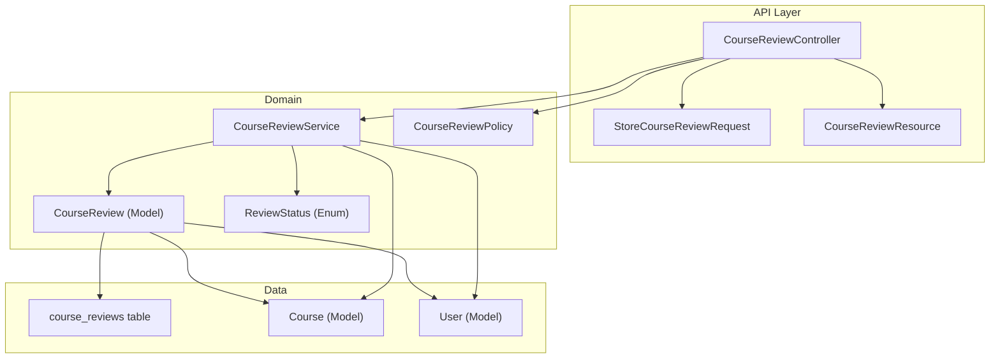
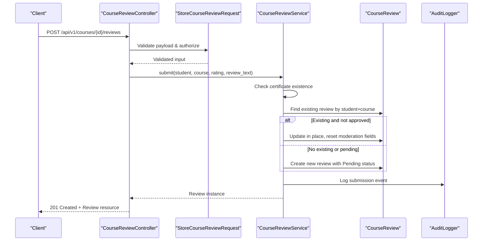
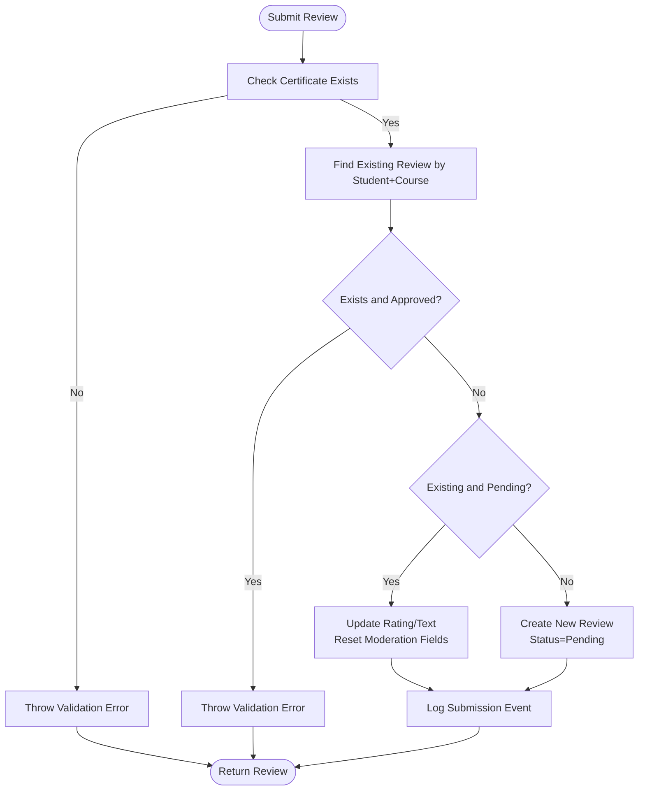
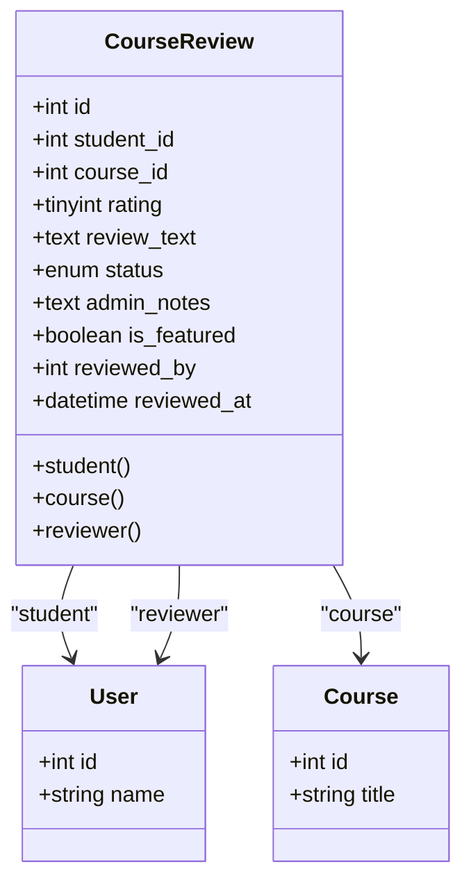
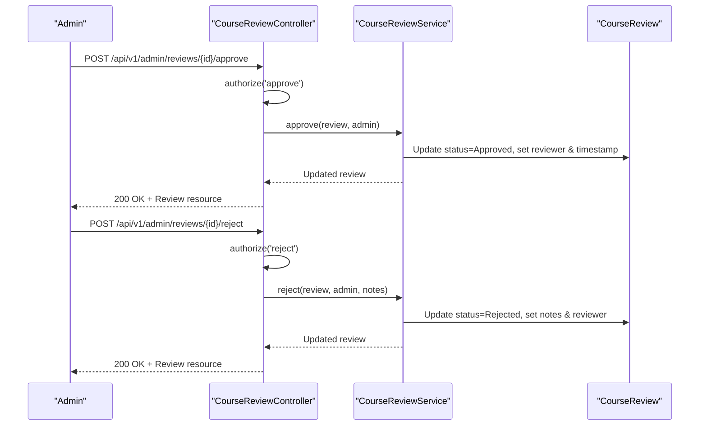
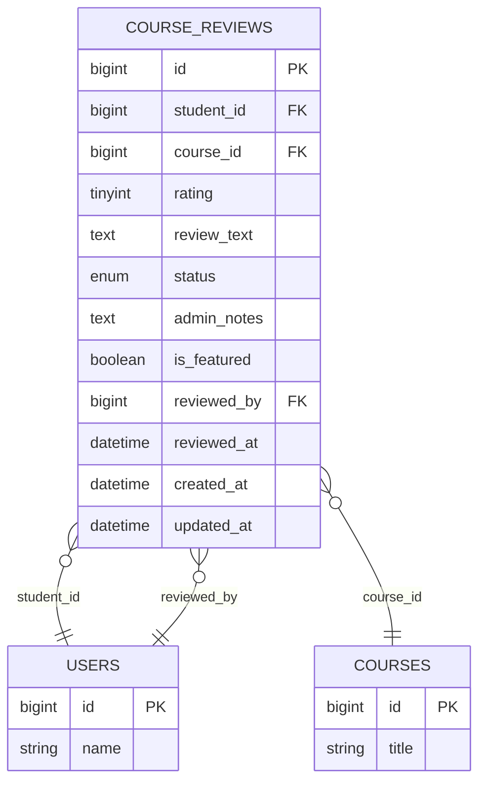
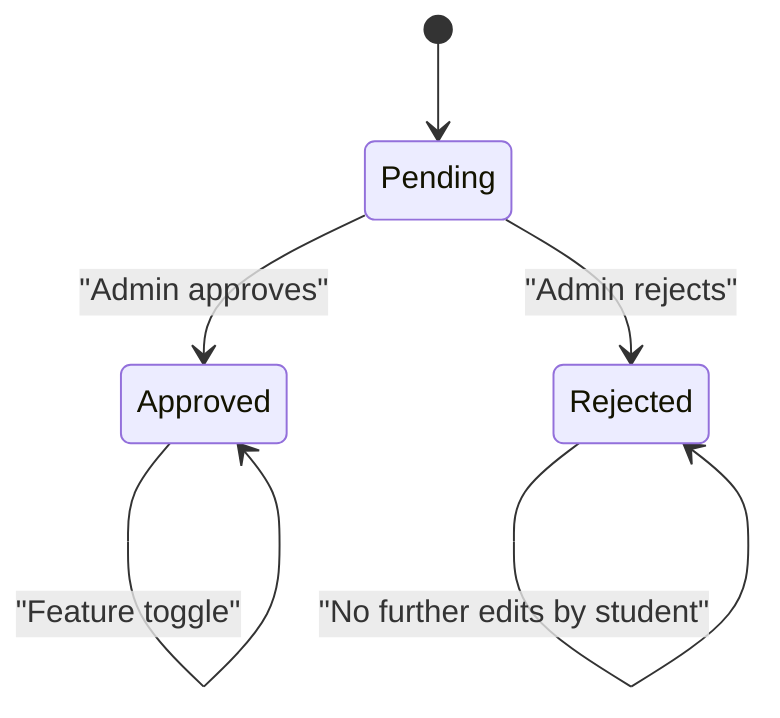
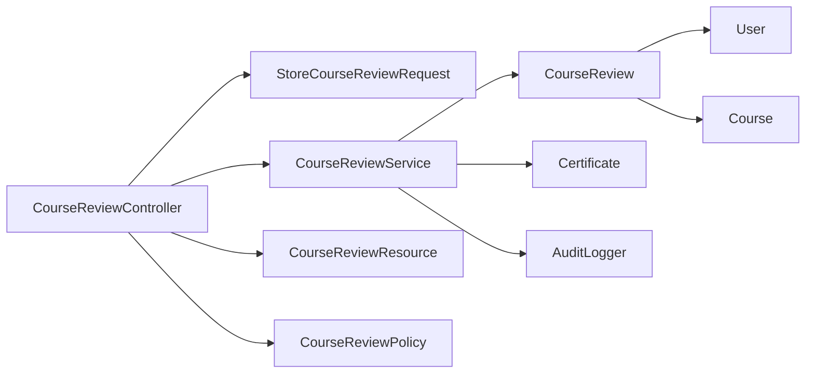

# Course Reviews Service

<cite>
**Referenced Files in This Document**
- [CourseReviewService.php](file://app/Services/Reviews/CourseReviewService.php)
- [CourseReview.php](file://app/Models/CourseReview.php)
- [CourseReviewController.php](file://app/Http/Controllers/Api/V1/CourseReviewController.php)
- [StoreCourseReviewRequest.php](file://app/Http/Requests/Api/V1/StoreCourseReviewRequest.php)
- [CourseReviewResource.php](file://app/Http/Resources/CourseReviewResource.php)
- [CourseReviewPolicy.php](file://app/Policies/CourseReviewPolicy.php)
- [2026_08_03_010000_create_course_reviews_table.php](file://database/migrations/2026_08_03_010000_create_course_reviews_table.php)
- [Course.php](file://app/Models/Course.php)
- [ReviewStatus.php](file://app/Enums/ReviewStatus.php)
- [CourseReviewFactory.php](file://database/factories/CourseReviewFactory.php)
- [CourseReviewTest.php](file://tests/Feature/Reviews/CourseReviewTest.php)
</cite>

## Table of Contents
1. [Introduction](#introduction)
2. [Project Structure](#project-structure)
3. [Core Components](#core-components)
4. [Architecture Overview](#architecture-overview)
5. [Detailed Component Analysis](#detailed-component-analysis)
6. [Dependency Analysis](#dependency-analysis)
7. [Performance Considerations](#performance-considerations)
8. [Troubleshooting Guide](#troubleshooting-guide)
9. [Conclusion](#conclusion)

## Introduction
This document explains the Course Reviews Service that enables students to submit course reviews after completing a course, administrators to moderate those reviews, and public endpoints to display approved reviews. It covers review validation, moderation workflows, data model design, and integration points with the course catalog and analytics. Where applicable, it also outlines how average ratings can be computed for courses using the stored reviews.

## Project Structure
The Course Reviews feature spans models, services, controllers, requests, resources, policies, migrations, factories, and tests:

- Model: CourseReview defines the entity and relationships.
- Service: CourseReviewService encapsulates business rules for submission, approval, rejection, and featuring.
- Controller: CourseReviewController exposes API endpoints for student submissions, admin moderation, and public listing.
- Request: StoreCourseReviewRequest validates incoming review payloads and enforces role-based authorization.
- Resource: CourseReviewResource serializes review data for API responses, including minimal user shapes for public endpoints.
- Policy: CourseReviewPolicy restricts moderation actions to admins.
- Migration: Creates the course_reviews table with constraints and indexes.
- Factory: Provides test-friendly factories for creating reviews in various states.
- Tests: Feature tests validate core behaviors like completion gating, edit-in-place, moderation, and public filtering.

**Diagram sources**
- [CourseReviewController.php:1-107](file://app/Http/Controllers/Api/V1/CourseReviewController.php#L1-L107)
- [CourseReviewService.php:1-134](file://app/Services/Reviews/CourseReviewService.php#L1-L134)
- [CourseReview.php:1-60](file://app/Models/CourseReview.php#L1-L60)
- [CourseReviewResource.php:1-40](file://app/Http/Resources/CourseReviewResource.php#L1-L40)
- [StoreCourseReviewRequest.php:1-25](file://app/Http/Requests/Api/V1/StoreCourseReviewRequest.php#L1-L25)
- [CourseReviewPolicy.php:1-32](file://app/Policies/CourseReviewPolicy.php#L1-L32)
- [ReviewStatus.php:1-13](file://app/Enums/ReviewStatus.php#L1-L13)
- [Course.php:123-129](file://app/Models/Course.php#L123-L129)

**Section sources**
- [CourseReviewController.php:1-107](file://app/Http/Controllers/Api/V1/CourseReviewController.php#L1-L107)
- [CourseReviewService.php:1-134](file://app/Services/Reviews/CourseReviewService.php#L1-L134)
- [CourseReview.php:1-60](file://app/Models/CourseReview.php#L1-L60)
- [StoreCourseReviewRequest.php:1-25](file://app/Http/Requests/Api/V1/StoreCourseReviewRequest.php#L1-L25)
- [CourseReviewResource.php:1-40](file://app/Http/Resources/CourseReviewResource.php#L1-L40)
- [CourseReviewPolicy.php:1-32](file://app/Policies/CourseReviewPolicy.php#L1-L32)
- [2026_08_03_010000_create_course_reviews_table.php:1-40](file://database/migrations/2026_08_03_010000_create_course_reviews_table.php#L1-L40)
- [Course.php:123-129](file://app/Models/Course.php#L123-L129)
- [ReviewStatus.php:1-13](file://app/Enums/ReviewStatus.php#L1-L13)
- [CourseReviewFactory.php:1-54](file://database/factories/CourseReviewFactory.php#L1-L54)
- [CourseReviewTest.php:1-131](file://tests/Feature/Reviews/CourseReviewTest.php#L1-L131)

## Core Components
- CourseReviewService: Central logic for submitting, approving, rejecting, and featuring reviews; enforces completion requirement and edit-in-place behavior; logs audit events.
- CourseReview model: Defines fillable fields, casts, and relationships to student, course, and reviewer.
- CourseReviewController: Exposes endpoints for listing (admin, mine, public), creating, approving, rejecting, and featuring reviews.
- StoreCourseReviewRequest: Validates rating range and text length; authorizes only students.
- CourseReviewResource: Serializes review data, safely exposing minimal user info on public endpoints.
- CourseReviewPolicy: Restricts moderation operations to admins.
- Migration: Ensures one review per student per course via unique constraint; indexes status and featured flag for efficient queries.

Key responsibilities:
- Validation: Rating must be an integer between 1 and 5; optional review text up to a defined length.
- Completion gate: A certificate must exist for the student-course pair before submission.
- Edit-in-place: If a non-approved review exists, update it in place and reset moderation state.
- Moderation: Admin-only approve/reject/feature with audit logging.
- Public exposure: Only approved reviews are returned publicly; featured filter supported.

**Section sources**
- [CourseReviewService.php:25-74](file://app/Services/Reviews/CourseReviewService.php#L25-L74)
- [CourseReviewService.php:76-132](file://app/Services/Reviews/CourseReviewService.php#L76-L132)
- [StoreCourseReviewRequest.php:12-23](file://app/Http/Requests/Api/V1/StoreCourseReviewRequest.php#L12-L23)
- [CourseReviewController.php:23-105](file://app/Http/Controllers/Api/V1/CourseReviewController.php#L23-L105)
- [CourseReviewResource.php:23-37](file://app/Http/Resources/CourseReviewResource.php#L23-L37)
- [CourseReviewPolicy.php:12-30](file://app/Policies/CourseReviewPolicy.php#L12-L30)
- [2026_08_03_010000_create_course_reviews_table.php:18-32](file://database/migrations/2026_08_03_010000_create_course_reviews_table.php#L18-L32)

## Architecture Overview
The service layer isolates business rules from HTTP concerns. Controllers authorize and delegate to the service, which interacts with models and external systems (audit logger). The database schema enforces integrity through foreign keys and unique constraints. Policies enforce role-based access control for moderation endpoints.

**Diagram sources**
- [CourseReviewController.php:72-82](file://app/Http/Controllers/Api/V1/CourseReviewController.php#L72-L82)
- [StoreCourseReviewRequest.php:12-23](file://app/Http/Requests/Api/V1/StoreCourseReviewRequest.php#L12-L23)
- [CourseReviewService.php:25-74](file://app/Services/Reviews/CourseReviewService.php#L25-L74)

## Detailed Component Analysis

### CourseReviewService
Responsibilities:
- Enforce completion requirement via certificate check.
- Prevent duplicate approved reviews; support edit-in-place for pending ones.
- Approve/reject with audit logging and timestamps.
- Allow featuring only approved reviews.

Validation and workflow highlights:
- Completion gate: Requires a certificate for the student-course pair.
- Duplicate handling: Unique constraint plus service-level checks ensure one active review per student per course.
- Moderation state reset: When editing a pending review, clears admin notes and reviewer metadata.

**Diagram sources**
- [CourseReviewService.php:25-74](file://app/Services/Reviews/CourseReviewService.php#L25-L74)

**Section sources**
- [CourseReviewService.php:25-74](file://app/Services/Reviews/CourseReviewService.php#L25-L74)
- [CourseReviewService.php:76-132](file://app/Services/Reviews/CourseReviewService.php#L76-L132)

### CourseReview Model
- Fillable fields include student_id, course_id, rating, review_text, status, admin_notes, is_featured, reviewed_by, reviewed_at.
- Casts status to ReviewStatus enum, boolean flags, and datetime for reviewed_at.
- Relationships: belongsTo User (student), belongsTo Course, belongsTo User (reviewer).

**Diagram sources**
- [CourseReview.php:18-58](file://app/Models/CourseReview.php#L18-L58)

**Section sources**
- [CourseReview.php:18-58](file://app/Models/CourseReview.php#L18-L58)

### API Endpoints and Flow
- Admin index: Lists all reviews with optional status filter; requires admin authorization.
- Mine: Lists current user’s reviews.
- Public index: Returns approved reviews, optionally filtered by featured; paginated.
- Store: Creates or updates a review for a completed course; returns created/updated resource.
- Approve/Reject/Feature: Admin-only moderation endpoints.

**Diagram sources**
- [CourseReviewController.php:84-105](file://app/Http/Controllers/Api/V1/CourseReviewController.php#L84-L105)
- [CourseReviewService.php:76-113](file://app/Services/Reviews/CourseReviewService.php#L76-L113)

**Section sources**
- [CourseReviewController.php:23-105](file://app/Http/Controllers/Api/V1/CourseReviewController.php#L23-L105)

### Data Model and Constraints
- Unique constraint on (student_id, course_id) ensures one review per student per course.
- Indexes on (status, is_featured) optimize moderation and public listing queries.
- Foreign keys link to users and courses with cascade/null-on-delete semantics.

**Diagram sources**
- [2026_08_03_010000_create_course_reviews_table.php:18-32](file://database/migrations/2026_08_03_010000_create_course_reviews_table.php#L18-L32)

**Section sources**
- [2026_08_03_010000_create_course_reviews_table.php:18-32](file://database/migrations/2026_08_03_010000_create_course_reviews_table.php#L18-L32)

### Rating Calculation and Aggregation
- The repository does not implement a dedicated rating aggregation method in the CourseReviewService or Course model.
- To compute average ratings per course, query approved reviews grouped by course_id and calculate the mean of the rating field. Example approach:
  - Filter CourseReview where status equals approved.
  - Group by course_id.
  - Compute avg(rating) and count(reviews).
- For display in course catalogs, combine these aggregates with course details and optionally surface top-rated or most-reviewed courses.

[No sources needed since this section provides general guidance]

### Moderation Workflow
- Submissions start in Pending status.
- Admins can Approve, Reject, or Feature (only if Approved).
- Each action records who performed it and when, and logs an audit event.

**Diagram sources**
- [CourseReviewService.php:76-132](file://app/Services/Reviews/CourseReviewService.php#L76-L132)
- [ReviewStatus.php:7-12](file://app/Enums/ReviewStatus.php#L7-L12)

**Section sources**
- [CourseReviewService.php:76-132](file://app/Services/Reviews/CourseReviewService.php#L76-L132)
- [CourseReviewPolicy.php:12-30](file://app/Policies/CourseReviewPolicy.php#L12-L30)

### Integration Points
- Course relationship: Course hasMany CourseReview, enabling retrieval of all reviews for a course.
- Public endpoint: Returns only approved reviews; supports featured filtering for testimonials.
- Analytics: Pending reviews are included in system summary metrics.

**Section sources**
- [Course.php:123-129](file://app/Models/Course.php#L123-L129)
- [CourseReviewController.php:58-70](file://app/Http/Controllers/Api/V1/CourseReviewController.php#L58-L70)
- [CourseReviewTest.php:123-130](file://tests/Feature/Reviews/CourseReviewTest.php#L123-L130)

## Dependency Analysis
- Controller depends on:
  - StoreCourseReviewRequest for validation and authorization.
  - CourseReviewService for business logic.
  - CourseReviewResource for serialization.
  - CourseReviewPolicy for authorization checks.
- Service depends on:
  - CourseReview model for persistence.
  - Certificate model to enforce completion.
  - AuditLogger for audit trails.
  - ReviewStatus enum for consistent state representation.
- Model depends on:
  - User and Course models via relationships.
  - Database via Eloquent.

**Diagram sources**
- [CourseReviewController.php:1-107](file://app/Http/Controllers/Api/V1/CourseReviewController.php#L1-L107)
- [CourseReviewService.php:1-134](file://app/Services/Reviews/CourseReviewService.php#L1-L134)
- [CourseReview.php:1-60](file://app/Models/CourseReview.php#L1-L60)

**Section sources**
- [CourseReviewController.php:1-107](file://app/Http/Controllers/Api/V1/CourseReviewController.php#L1-L107)
- [CourseReviewService.php:1-134](file://app/Services/Reviews/CourseReviewService.php#L1-L134)
- [CourseReview.php:1-60](file://app/Models/CourseReview.php#L1-L60)

## Performance Considerations
- Use the provided indexes on (status, is_featured) to efficiently list approved or featured reviews.
- Paginate public listings to limit payload size.
- Avoid N+1 queries by eager loading relationships (student, course, reviewer) where needed.
- Keep review_text within limits to reduce storage and processing overhead.

[No sources needed since this section provides general guidance]

## Troubleshooting Guide
Common issues and resolutions:
- Submission rejected due to no completion: Ensure a certificate exists for the student-course pair before allowing review submission.
- Duplicate review error: If an approved review already exists, resubmission is blocked; otherwise, pending reviews are updated in place.
- Unauthorized moderation: Only admins can approve, reject, or feature reviews; verify user role.
- Public endpoint empty: Only approved reviews are returned; ensure moderation has been completed.

Relevant validations and checks:
- Rating must be between 1 and 5; review text optional and limited in length.
- Completion gate enforced via certificate existence.
- Unique constraint prevents multiple reviews per student per course.

**Section sources**
- [StoreCourseReviewRequest.php:17-23](file://app/Http/Requests/Api/V1/StoreCourseReviewRequest.php#L17-L23)
- [CourseReviewService.php:25-43](file://app/Services/Reviews/CourseReviewService.php#L25-L43)
- [CourseReviewPolicy.php:12-30](file://app/Policies/CourseReviewPolicy.php#L12-L30)
- [CourseReviewTest.php:12-71](file://tests/Feature/Reviews/CourseReviewTest.php#L12-L71)

## Conclusion
The Course Reviews Service provides a robust, auditable workflow for collecting and moderating student feedback. It enforces completion requirements, prevents duplicates, supports edit-in-place for pending reviews, and exposes controlled public access to approved content. While average rating calculation is not implemented in the service, it can be derived from approved reviews grouped by course. The design emphasizes clear separation of concerns, strong validation, and secure moderation flows suitable for production use.