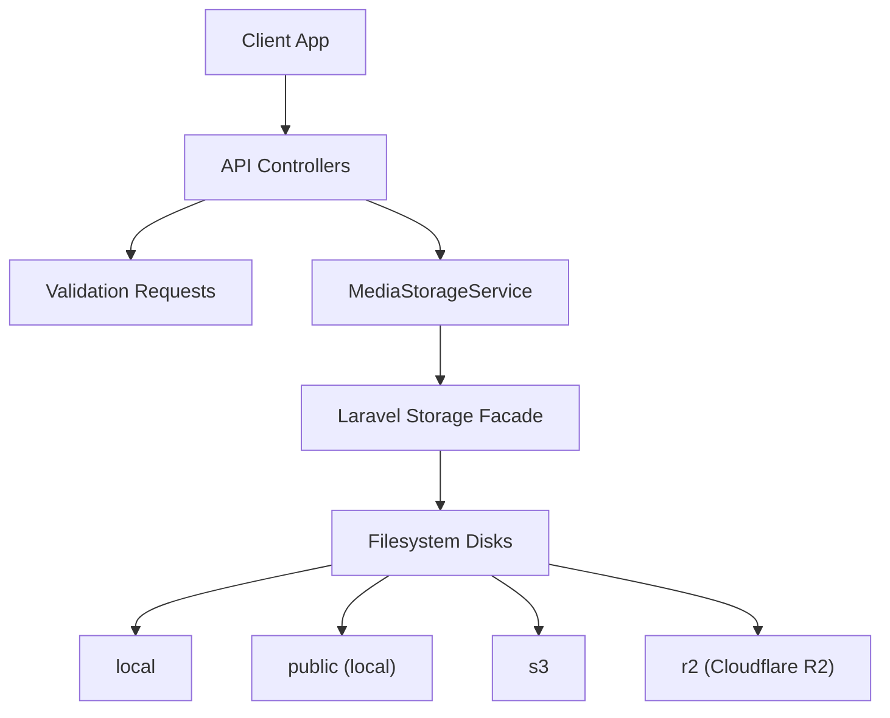
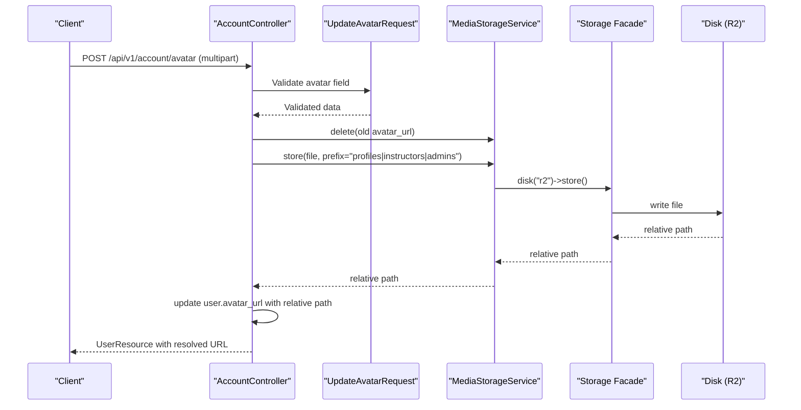
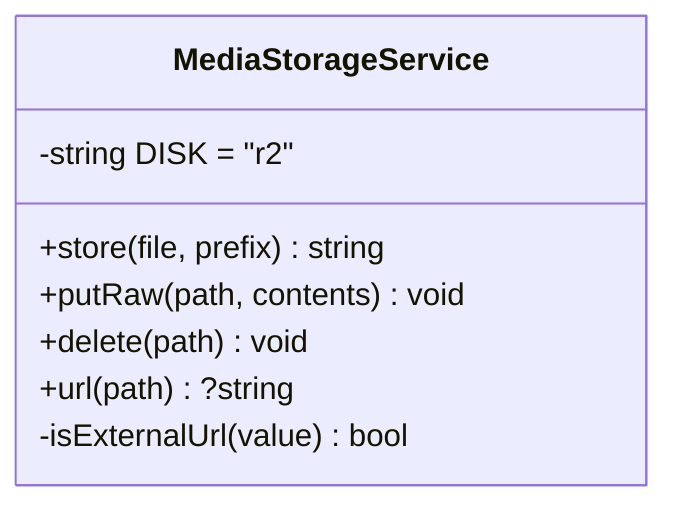
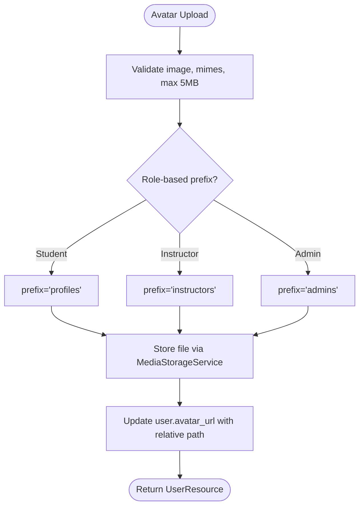
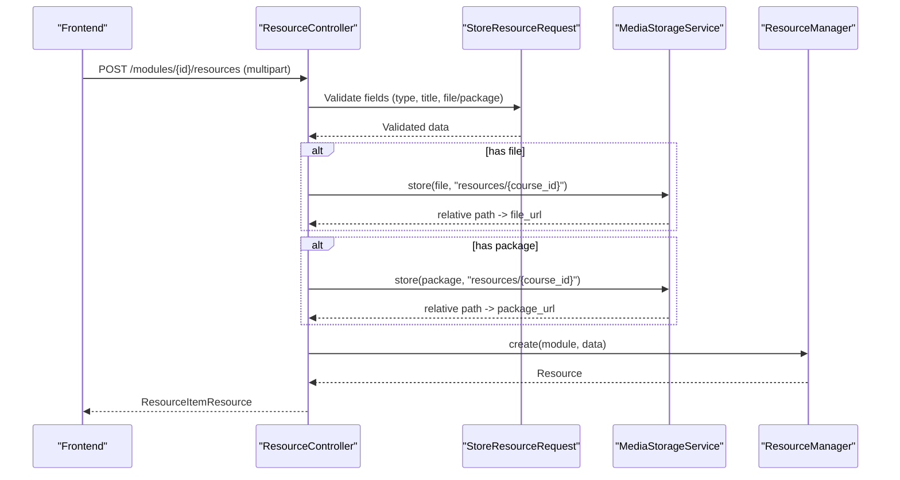
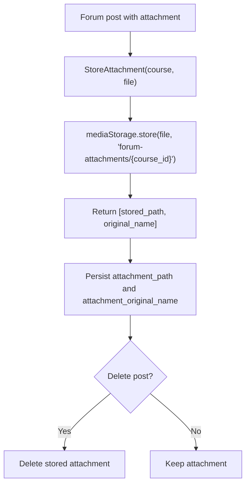
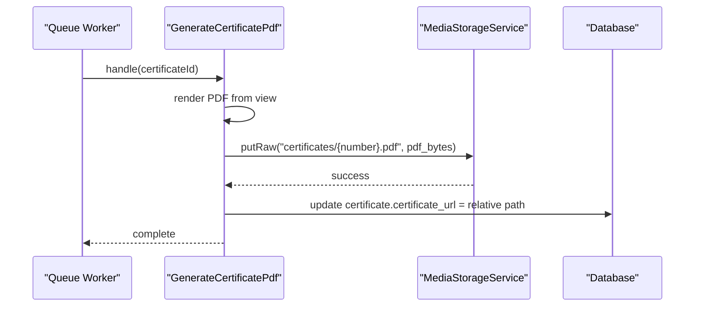
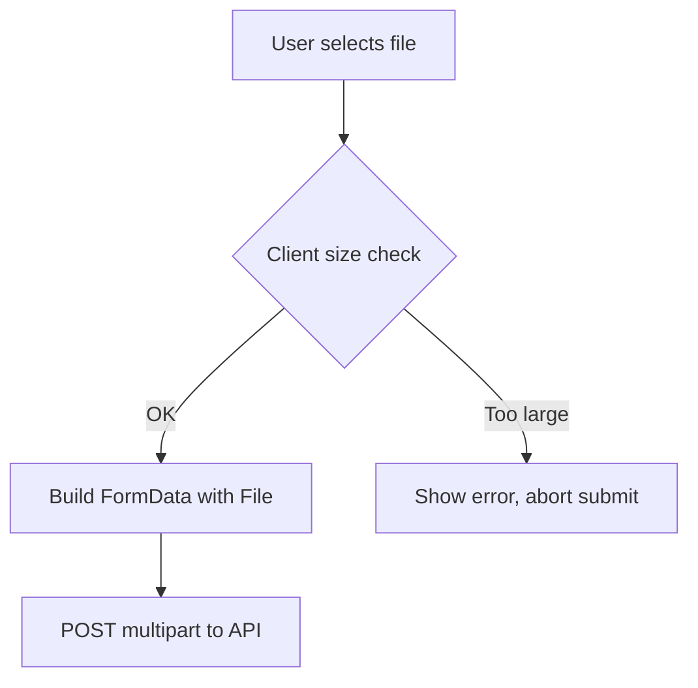
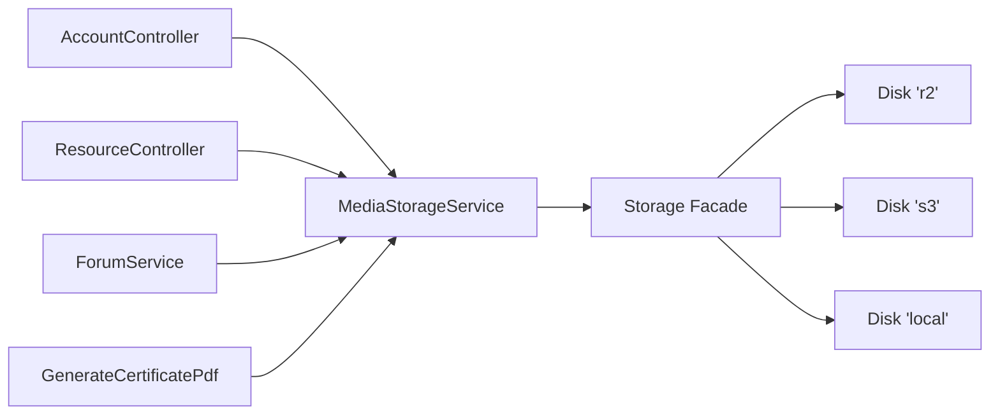

# Media Storage Service

<cite>
**Referenced Files in This Document**
- [MediaStorageService.php](file://app/Services/Storage/MediaStorageService.php)
- [filesystems.php](file://config/filesystems.php)
- [AccountController.php](file://app/Http/Controllers/Api/V1/AccountController.php)
- [UpdateAvatarRequest.php](file://app/Http/Requests/Api/V1/UpdateAvatarRequest.php)
- [ResourceController.php](file://app/Http/Controllers/Api/V1/ResourceController.php)
- [StoreResourceRequest.php](file://app/Http/Requests/Api/V1/StoreResourceRequest.php)
- [UpdateResourceRequest.php](file://app/Http/Requests/Api/V1/UpdateResourceRequest.php)
- [ForumService.php](file://app/Services/Communication/ForumService.php)
- [GenerateCertificatePdf.php](file://app/Jobs/GenerateCertificatePdf.php)
- [formData.ts](file://frontend/src/lib/api/formData.ts)
- [ResourceForm.tsx](file://frontend/src/features/courseStructure/ResourceForm.tsx)
- [ForumComposer.tsx](file://frontend/src/features/communication/ForumComposer.tsx)
</cite>

## Table of Contents
1. [Introduction](#introduction)
2. [Project Structure](#project-structure)
3. [Core Components](#core-components)
4. [Architecture Overview](#architecture-overview)
5. [Detailed Component Analysis](#detailed-component-analysis)
6. [Dependency Analysis](#dependency-analysis)
7. [Performance Considerations](#performance-considerations)
8. [Troubleshooting Guide](#troubleshooting-guide)
9. [Conclusion](#conclusion)
10. [Appendices](#appendices)

## Introduction
This document explains the Media Storage Service used across the application to handle file uploads, storage configuration, and media asset management. It covers how files are validated, stored, organized, retrieved, and deleted through a single service that abstracts the underlying storage backend. The service currently targets an S3-compatible disk configured for Cloudflare R2, while also supporting local and generic S3 disks via Laravel’s filesystem configuration.

Key capabilities:
- Centralized upload handling for avatars, resource files, forum attachments, and generated PDFs
- Consistent path-based storage with automatic URL resolution
- Role-based and feature-scoped directory organization
- Validation rules for MIME types and file sizes at request boundaries
- Safe deletion logic that ignores external URLs and null values

## Project Structure
The media storage flow spans controllers, request validators, services, jobs, and configuration:
- Controllers accept multipart uploads and delegate to the Media Storage Service
- Request classes enforce MIME type and size constraints per feature
- The Media Storage Service encapsulates disk operations and URL generation
- Jobs use the service to store server-generated content (e.g., certificate PDFs)
- Configuration defines available disks and their drivers

**Diagram sources**
- [filesystems.php:31-86](file://config/filesystems.php#L31-L86)
- [MediaStorageService.php:24-79](file://app/Services/Storage/MediaStorageService.php#L24-L79)

**Section sources**
- [filesystems.php:1-106](file://config/filesystems.php#L1-L106)
- [MediaStorageService.php:1-86](file://app/Services/Storage/MediaStorageService.php#L1-L86)

## Core Components
- MediaStorageService: Single entry point for all uploads and deletions; resolves relative paths to public URLs and passes through external URLs unchanged.
- Filesystem configuration: Defines local, public, S3, and R2 disks; R2 is the active disk for media assets.
- Controllers and requests: Enforce validation and orchestrate storage calls with appropriate prefixes.
- Jobs: Store server-generated files using the same service.

Highlights:
- Uploads are stored under feature-specific prefixes (e.g., profiles, resources/{course_id}, forum-attachments/{course_id}, certificates).
- Deletion is safe for null, empty, or external URLs.
- URL resolution uses the configured disk’s base URL.

**Section sources**
- [MediaStorageService.php:24-84](file://app/Services/Storage/MediaStorageService.php#L24-L84)
- [filesystems.php:31-86](file://config/filesystems.php#L31-L86)

## Architecture Overview
End-to-end upload flow from client to storage:

**Diagram sources**
- [AccountController.php:61-72](file://app/Http/Controllers/Api/V1/AccountController.php#L61-L72)
- [UpdateAvatarRequest.php:16-21](file://app/Http/Requests/Api/V1/UpdateAvatarRequest.php#L16-L21)
- [MediaStorageService.php:32-41](file://app/Services/Storage/MediaStorageService.php#L32-L41)
- [filesystems.php:75-86](file://config/filesystems.php#L75-L86)

## Detailed Component Analysis

### MediaStorageService
Responsibilities:
- Store uploaded files to the configured disk under a given prefix
- Put raw contents (for server-generated files like PDFs)
- Delete files safely (no-op for null/empty/external URLs)
- Resolve stored values to public URLs (pass-through for external URLs)

Behavioral notes:
- Uses a single disk constant for consistency
- Throws on store failure to signal upload issues upstream
- Detects external URLs by checking http/https prefixes

**Diagram sources**
- [MediaStorageService.php:24-84](file://app/Services/Storage/MediaStorageService.php#L24-L84)

**Section sources**
- [MediaStorageService.php:24-84](file://app/Services/Storage/MediaStorageService.php#L24-L84)

### Avatar Upload Flow
- Controller selects role-based prefix and delegates to the service
- Old avatar is deleted before storing the new one
- External URLs are preserved and not deleted

**Diagram sources**
- [AccountController.php:46-72](file://app/Http/Controllers/Api/V1/AccountController.php#L46-L72)
- [UpdateAvatarRequest.php:16-21](file://app/Http/Requests/Api/V1/UpdateAvatarRequest.php#L16-L21)
- [MediaStorageService.php:32-41](file://app/Services/Storage/MediaStorageService.php#L32-L41)

**Section sources**
- [AccountController.php:46-72](file://app/Http/Controllers/Api/V1/AccountController.php#L46-L72)
- [UpdateAvatarRequest.php:16-21](file://app/Http/Requests/Api/V1/UpdateAvatarRequest.php#L16-L21)

### Resource File Uploads
- Supports both direct file uploads and pasting URLs
- Validates MIME types and sizes per resource type
- Stores files under feature-scoped directories

**Diagram sources**
- [ResourceController.php:30-46](file://app/Http/Controllers/Api/V1/ResourceController.php#L30-L46)
- [StoreResourceRequest.php:25-62](file://app/Http/Requests/Api/V1/StoreResourceRequest.php#L25-L62)
- [MediaStorageService.php:32-41](file://app/Services/Storage/MediaStorageService.php#L32-L41)

**Section sources**
- [ResourceController.php:30-66](file://app/Http/Controllers/Api/V1/ResourceController.php#L30-L66)
- [StoreResourceRequest.php:25-62](file://app/Http/Requests/Api/V1/StoreResourceRequest.php#L25-L62)
- [UpdateResourceRequest.php:21-55](file://app/Http/Requests/Api/V1/UpdateResourceRequest.php#L21-L55)

### Forum Attachments
- Attachments are stored under course-scoped directories
- Original filename is captured alongside the stored path
- Deletion occurs when posts are removed

**Diagram sources**
- [ForumService.php:207-221](file://app/Services/Communication/ForumService.php#L207-L221)

**Section sources**
- [ForumService.php:207-221](file://app/Services/Communication/ForumService.php#L207-L221)

### Generated Certificate PDFs
- Server-generated PDFs are written directly to storage without being UploadedFile instances
- Path is stored on the model and later resolved to a URL via the service

**Diagram sources**
- [GenerateCertificatePdf.php:36-57](file://app/Jobs/GenerateCertificatePdf.php#L36-L57)
- [MediaStorageService.php:46-49](file://app/Services/Storage/MediaStorageService.php#L46-L49)

**Section sources**
- [GenerateCertificatePdf.php:36-57](file://app/Jobs/GenerateCertificatePdf.php#L36-L57)

### Frontend Integration
- Shared FormData builder ensures proper multipart encoding for uploads
- Feature forms set accept attributes and client-side size checks
- Large files are rejected early on the client to reduce bandwidth

**Diagram sources**
- [formData.ts:11-37](file://frontend/src/lib/api/formData.ts#L11-L37)
- [ResourceForm.tsx:20-61](file://frontend/src/features/courseStructure/ResourceForm.tsx#L20-L61)
- [ForumComposer.tsx:11-17](file://frontend/src/features/communication/ForumComposer.tsx#L11-L17)

**Section sources**
- [formData.ts:11-37](file://frontend/src/lib/api/formData.ts#L11-L37)
- [ResourceForm.tsx:20-61](file://frontend/src/features/courseStructure/ResourceForm.tsx#L20-L61)
- [ForumComposer.tsx:11-17](file://frontend/src/features/communication/ForumComposer.tsx#L11-L17)

## Dependency Analysis
- Controllers depend on MediaStorageService for all storage operations
- Request classes define strict MIME and size constraints per feature
- Jobs rely on MediaStorageService to persist generated artifacts
- Configuration centralizes disk definitions; MediaStorageService pins to the R2 disk

**Diagram sources**
- [AccountController.php:52-72](file://app/Http/Controllers/Api/V1/AccountController.php#L52-L72)
- [ResourceController.php:20-66](file://app/Http/Controllers/Api/V1/ResourceController.php#L20-L66)
- [ForumService.php:207-221](file://app/Services/Communication/ForumService.php#L207-L221)
- [GenerateCertificatePdf.php:36-57](file://app/Jobs/GenerateCertificatePdf.php#L36-L57)
- [filesystems.php:31-86](file://config/filesystems.php#L31-L86)

**Section sources**
- [filesystems.php:31-86](file://config/filesystems.php#L31-L86)
- [MediaStorageService.php:24-79](file://app/Services/Storage/MediaStorageService.php#L24-L79)

## Performance Considerations
- Prefer small, validated files at the edge: frontend size checks reduce unnecessary network transfers
- Use multipart uploads only when necessary; prefer URL references where feasible (e.g., documents, SCORM packages)
- Avoid repeated reads/writes by caching URLs in responses and minimizing redundant url() calls
- For large files:
  - Ensure queue workers have sufficient memory/time limits
  - Consider chunked uploads on the client side if supported by your infrastructure
  - Offload heavy processing (PDF generation) to background jobs
- CDN integration:
  - Configure the disk’s public URL to a CDN domain (e.g., custom domain over R2) so url() returns CDN endpoints
  - Enable cache headers at the CDN layer for static assets
- Cost optimization:
  - Use lifecycle policies to archive or delete old attachments
  - Compress or transcode media where possible (e.g., images, videos hosted elsewhere)
  - Prefer external hosting for large binaries (e.g., video platforms) and store only references

[No sources needed since this section provides general guidance]

## Troubleshooting Guide
Common issues and resolutions:
- Upload fails with “Failed to store the uploaded file”:
  - Verify disk credentials and endpoint settings
  - Check network connectivity and bucket permissions
- Unexpected deletion attempts on external URLs:
  - The service intentionally skips deletion for external URLs; ensure models store relative paths for owned assets
- MIME type rejection:
  - Confirm allowed extensions in request rules match intended file types
- Size limit errors:
  - Adjust request-level max rules and consider increasing PHP upload limits if needed
- URL resolution incorrect:
  - Ensure disk URL is set to the correct public base (CDN or bucket domain)

**Section sources**
- [MediaStorageService.php:32-41](file://app/Services/Storage/MediaStorageService.php#L32-L41)
- [StoreResourceRequest.php:39-55](file://app/Http/Requests/Api/V1/StoreResourceRequest.php#L39-L55)
- [UpdateAvatarRequest.php:16-21](file://app/Http/Requests/Api/V1/UpdateAvatarRequest.php#L16-L21)
- [filesystems.php:75-86](file://config/filesystems.php#L75-L86)

## Conclusion
The Media Storage Service provides a consistent, secure, and scalable abstraction for all media operations in the application. By centralizing storage logic, enforcing validation at request boundaries, and organizing files into logical directories, it simplifies maintenance and improves reliability. With the current R2-backed disk and optional CDN configuration, the system supports efficient retrieval and cost-conscious storage strategies. Future enhancements can include advanced image/video processing, richer validation, and more granular access controls.

[No sources needed since this section summarizes without analyzing specific files]

## Appendices

### Supported Storage Backends
- Local disk: development and testing
- Public local disk: serves files via symlinked storage path
- S3 disk: generic S3-compatible storage
- R2 disk: Cloudflare R2 (S3-compatible), used for production media

**Section sources**
- [filesystems.php:31-86](file://config/filesystems.php#L31-L86)

### File Organization Strategies
- Avatars: role-based prefixes (profiles, instructors, admins)
- Resources: scoped by course (resources/{course_id})
- Forum attachments: scoped by course (forum-attachments/{course_id})
- Certificates: scoped by certificate number (certificates/{number}.pdf)

**Section sources**
- [AccountController.php:46-72](file://app/Http/Controllers/Api/V1/AccountController.php#L46-L72)
- [ResourceController.php:30-66](file://app/Http/Controllers/Api/V1/ResourceController.php#L30-L66)
- [ForumService.php:207-221](file://app/Services/Communication/ForumService.php#L207-L221)
- [GenerateCertificatePdf.php:36-57](file://app/Jobs/GenerateCertificatePdf.php#L36-L57)

### Security Measures
- Strict MIME type validation per feature
- File size limits enforced at request level
- Safe deletion that ignores external URLs
- Centralized storage access reduces risk of inconsistent security logic

**Section sources**
- [UpdateAvatarRequest.php:16-21](file://app/Http/Requests/Api/V1/UpdateAvatarRequest.php#L16-L21)
- [StoreResourceRequest.php:39-55](file://app/Http/Requests/Api/V1/StoreResourceRequest.php#L39-L55)
- [MediaStorageService.php:55-62](file://app/Services/Storage/MediaStorageService.php#L55-L62)