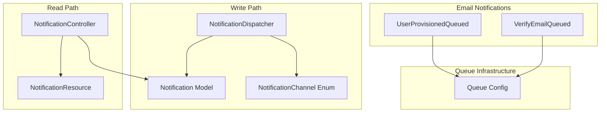
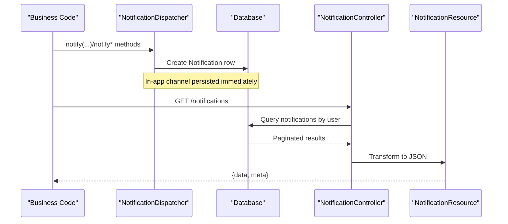
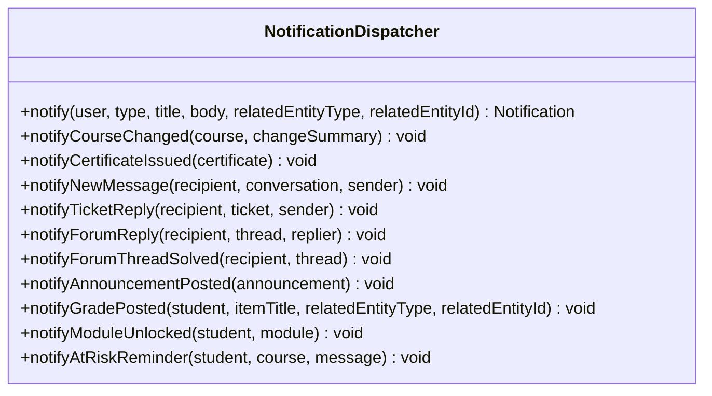
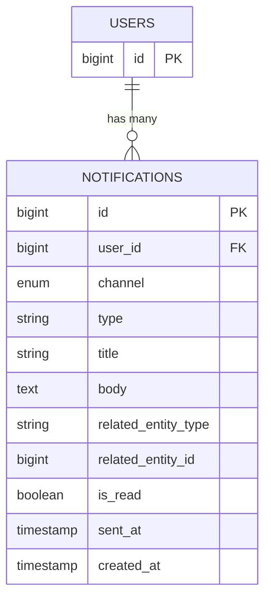
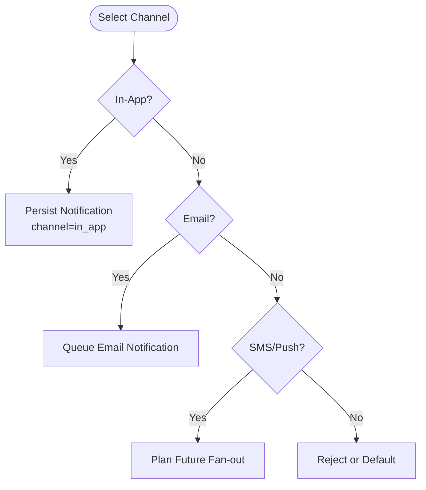
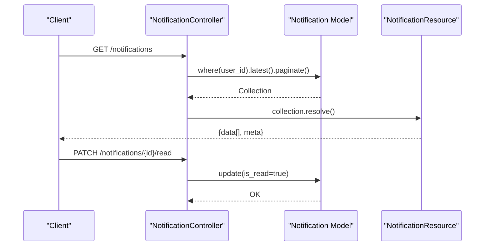
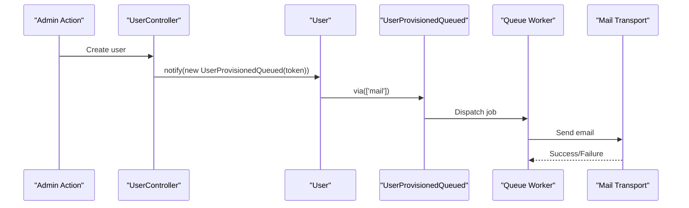
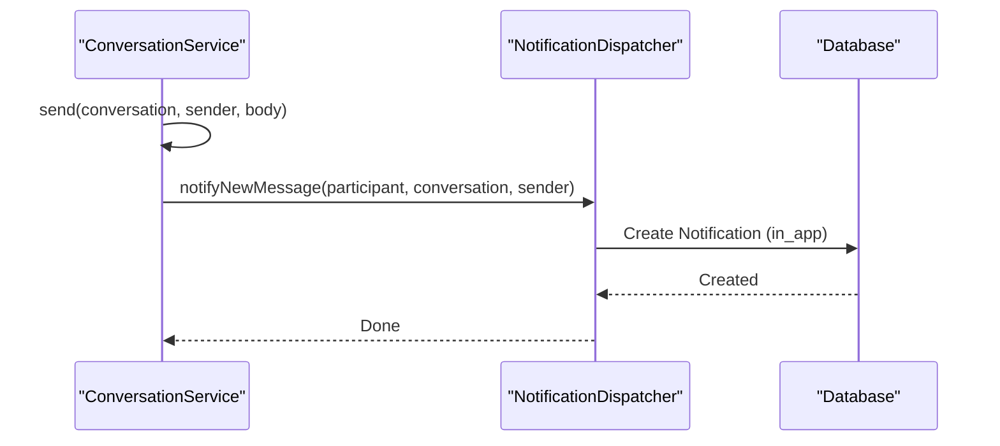
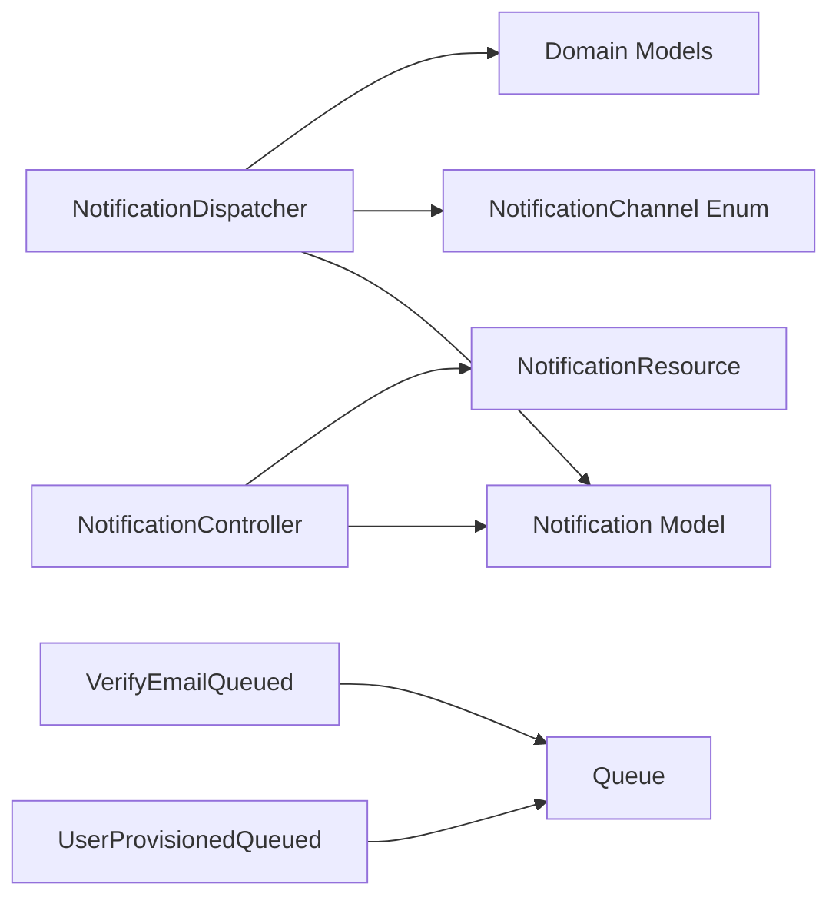

# Notification Dispatcher Service

<cite>
**Referenced Files in This Document**
- [NotificationDispatcher.php](file://app/Services/Notifications/NotificationDispatcher.php)
- [Notification.php](file://app/Models/Notification.php)
- [NotificationChannel.php](file://app/Enums/NotificationChannel.php)
- [2024_01_01_000180_create_notifications_table.php](file://database/migrations/2024_01_01_000180_create_notifications_table.php)
- [NotificationController.php](file://app/Http/Controllers/Api/V1/NotificationController.php)
- [NotificationResource.php](file://app/Http/Resources/NotificationResource.php)
- [UserProvisionedQueued.php](file://app/Notifications/UserProvisionedQueued.php)
- [VerifyEmailQueued.php](file://app/Notifications/VerifyEmailQueued.php)
- [queue.php](file://config/queue.php)
- [ConversationService.php](file://app/Services/Communication/ConversationService.php)
</cite>

## Table of Contents
1. [Introduction](#introduction)
2. [Project Structure](#project-structure)
3. [Core Components](#core-components)
4. [Architecture Overview](#architecture-overview)
5. [Detailed Component Analysis](#detailed-component-analysis)
6. [Dependency Analysis](#dependency-analysis)
7. [Performance Considerations](#performance-considerations)
8. [Troubleshooting Guide](#troubleshooting-guide)
9. [Conclusion](#conclusion)
10. [Appendices](#appendices)

## Introduction
This document explains the Notification Dispatcher Service that manages multi-channel notification delivery for email, in-app notifications, and other channels. It covers the NotificationDispatcher implementation, the notification model structure, channel abstraction via an enum, queue-based delivery patterns, retry mechanisms, and how to extend the system with custom channels. It also provides guidance on scalability and delivery status tracking.

## Project Structure
The notification subsystem is organized around a single write path (NotificationDispatcher), a persistent notification record (Notification model), a channel enumeration (NotificationChannel), and a read-only inbox API (NotificationController + NotificationResource). Email notifications are implemented as queued Laravel notifications. Queue configuration supports multiple backends and failure handling.

**Diagram sources**
- [NotificationDispatcher.php:25-39](file://app/Services/Notifications/NotificationDispatcher.php#L25-L39)
- [Notification.php:13-45](file://app/Models/Notification.php#L13-L45)
- [NotificationChannel.php:7-13](file://app/Enums/NotificationChannel.php#L7-L13)
- [NotificationController.php:19-53](file://app/Http/Controllers/Api/V1/NotificationController.php#L19-L53)
- [NotificationResource.php:10-28](file://app/Http/Resources/NotificationResource.php#L10-L28)
- [UserProvisionedQueued.php:21-47](file://app/Notifications/UserProvisionedQueued.php#L21-L47)
- [VerifyEmailQueued.php:18-21](file://app/Notifications/VerifyEmailQueued.php#L18-L21)
- [queue.php:16-92](file://config/queue.php#L16-L92)

**Section sources**
- [NotificationDispatcher.php:19-39](file://app/Services/Notifications/NotificationDispatcher.php#L19-L39)
- [Notification.php:13-45](file://app/Models/Notification.php#L13-L45)
- [NotificationChannel.php:7-13](file://app/Enums/NotificationChannel.php#L7-L13)
- [NotificationController.php:19-53](file://app/Http/Controllers/Api/V1/NotificationController.php#L19-L53)
- [NotificationResource.php:10-28](file://app/Http/Resources/NotificationResource.php#L10-L28)
- [UserProvisionedQueued.php:21-47](file://app/Notifications/UserProvisionedQueued.php#L21-L47)
- [VerifyEmailQueued.php:18-21](file://app/Notifications/VerifyEmailQueued.php#L18-L21)
- [queue.php:16-92](file://config/queue.php#L16-L92)

## Core Components
- NotificationDispatcher: Centralized entry point for creating in-app notifications and orchestrating business-specific notification events (course updates, certificates, messages, tickets, forum activity, grades, module unlocks, at-risk reminders).
- Notification model: Persistent record of each notification with user association, channel, type, title, body, related entity pointers, read status, and timestamps.
- NotificationChannel enum: Declares supported channels (in_app, email, sms, push) to standardize channel selection across the system.
- NotificationController + NotificationResource: Read-only API to list notifications, mark individual or all as read, and return structured payloads.
- Queued email notifications: UserProvisionedQueued and VerifyEmailQueued implement queued email delivery to avoid request-time failures.

Key responsibilities:
- Single write path for in-app notifications to ensure consistency and future extensibility.
- Clear separation between write (dispatcher) and read (controller/resource).
- Queued email notifications for resilience and decoupling from request lifecycle.

**Section sources**
- [NotificationDispatcher.php:25-205](file://app/Services/Notifications/NotificationDispatcher.php#L25-L205)
- [Notification.php:13-45](file://app/Models/Notification.php#L13-L45)
- [NotificationChannel.php:7-13](file://app/Enums/NotificationChannel.php#L7-L13)
- [NotificationController.php:19-53](file://app/Http/Controllers/Api/V1/NotificationController.php#L19-L53)
- [NotificationResource.php:10-28](file://app/Http/Resources/NotificationResource.php#L10-L28)
- [UserProvisionedQueued.php:21-47](file://app/Notifications/UserProvisionedQueued.php#L21-L47)
- [VerifyEmailQueued.php:18-21](file://app/Notifications/VerifyEmailQueued.php#L18-L21)

## Architecture Overview
The system uses a hub-and-spoke architecture centered on NotificationDispatcher for writes and a simple REST API for reads. Email notifications use Laravel’s notification system with queues to ensure reliability. The database schema stores all notifications with typed metadata for routing and filtering.

**Diagram sources**
- [NotificationDispatcher.php:25-39](file://app/Services/Notifications/NotificationDispatcher.php#L25-L39)
- [NotificationController.php:21-35](file://app/Http/Controllers/Api/V1/NotificationController.php#L21-L35)
- [NotificationResource.php:15-27](file://app/Http/Resources/NotificationResource.php#L15-L27)

## Detailed Component Analysis

### NotificationDispatcher
- Purpose: Single write path for in-app notifications; exposes domain-specific helpers to create consistent notifications across features.
- Behavior: Persists a Notification record with channel set to in_app and sets sent_at timestamp. Provides helpers for course changes, certificate issuance, new messages, ticket replies, forum activity, grade postings, module unlocks, and at-risk reminders.
- Extensibility: Designed to be extended later to fan out to email/SMS/push while keeping one write surface.

**Diagram sources**
- [NotificationDispatcher.php:25-205](file://app/Services/Notifications/NotificationDispatcher.php#L25-L205)

**Section sources**
- [NotificationDispatcher.php:25-205](file://app/Services/Notifications/NotificationDispatcher.php#L25-L205)

### Notification Model and Schema
- Fields: user_id, channel, type, title, body, related_entity_type, related_entity_id, is_read, sent_at, created_at.
- Relationships: belongsTo User.
- Indexes: composite index on user_id and is_read for efficient inbox queries.

**Diagram sources**
- [2024_01_01_000180_create_notifications_table.php:13-26](file://database/migrations/2024_01_01_000180_create_notifications_table.php#L13-L26)
- [Notification.php:13-45](file://app/Models/Notification.php#L13-L45)

**Section sources**
- [Notification.php:13-45](file://app/Models/Notification.php#L13-L45)
- [2024_01_01_000180_create_notifications_table.php:13-26](file://database/migrations/2024_01_01_000180_create_notifications_table.php#L13-L26)

### Channel Abstraction
- NotificationChannel enum defines available channels: in_app, email, sms, push.
- Current in-app writes default to in_app; email notifications are handled separately via queued Laravel notifications.

**Diagram sources**
- [NotificationChannel.php:7-13](file://app/Enums/NotificationChannel.php#L7-L13)
- [NotificationDispatcher.php:27-39](file://app/Services/Notifications/NotificationDispatcher.php#L27-L39)
- [UserProvisionedQueued.php:31-47](file://app/Notifications/UserProvisionedQueued.php#L31-L47)

**Section sources**
- [NotificationChannel.php:7-13](file://app/Enums/NotificationChannel.php#L7-L13)
- [NotificationDispatcher.php:27-39](file://app/Services/Notifications/NotificationDispatcher.php#L27-L39)

### Inbox API (Read Path)
- Lists notifications for the authenticated user with pagination and unread count.
- Marks individual or all notifications as read.
- Returns structured JSON via NotificationResource.

**Diagram sources**
- [NotificationController.php:21-53](file://app/Http/Controllers/Api/V1/NotificationController.php#L21-L53)
- [NotificationResource.php:15-27](file://app/Http/Resources/NotificationResource.php#L15-L27)

**Section sources**
- [NotificationController.php:21-53](file://app/Http/Controllers/Api/V1/NotificationController.php#L21-L53)
- [NotificationResource.php:15-27](file://app/Http/Resources/NotificationResource.php#L15-L27)

### Email Notifications (Queued)
- UserProvisionedQueued: Sends a mail with a password setup link when an admin provisions a user. Implements ShouldQueue to avoid blocking requests.
- VerifyEmailQueued: Queues the built-in email verification notification to prevent transient mail errors from failing registration responses.

**Diagram sources**
- [UserProvisionedQueued.php:21-47](file://app/Notifications/UserProvisionedQueued.php#L21-L47)
- [VerifyEmailQueued.php:18-21](file://app/Notifications/VerifyEmailQueued.php#L18-L21)
- [queue.php:16-92](file://config/queue.php#L16-L92)

**Section sources**
- [UserProvisionedQueued.php:21-47](file://app/Notifications/UserProvisionedQueued.php#L21-L47)
- [VerifyEmailQueued.php:18-21](file://app/Notifications/VerifyEmailQueued.php#L18-L21)
- [queue.php:16-92](file://config/queue.php#L16-L92)

### Integration Points and Examples
- Conversation messaging triggers in-app notifications for recipients:
  - When a message is sent, the service iterates participants and creates a notification for each non-sender.
- Course updates trigger notifications to confirmed enrollees.
- Certificate issuance triggers a notification to the student.
- Forum activity triggers notifications to thread creators or relevant parties.
- Grade postings and module unlocks generate targeted notifications.

**Diagram sources**
- [ConversationService.php:81-97](file://app/Services/Communication/ConversationService.php#L81-L97)
- [NotificationDispatcher.php:81-91](file://app/Services/Notifications/NotificationDispatcher.php#L81-L91)

**Section sources**
- [ConversationService.php:81-97](file://app/Services/Communication/ConversationService.php#L81-L97)
- [NotificationDispatcher.php:45-205](file://app/Services/Notifications/NotificationDispatcher.php#L45-L205)

## Dependency Analysis
- NotificationDispatcher depends on:
  - Notification model for persistence.
  - NotificationChannel enum for channel selection.
  - Domain models (User, Course, Announcement, Certificate, Conversation, Ticket, ForumThread, Module) to build context-aware notifications.
- NotificationController depends on:
  - Notification model for querying.
  - NotificationResource for response shaping.
- Email notifications depend on:
  - Laravel’s notification system and queue infrastructure.

**Diagram sources**
- [NotificationDispatcher.php:25-205](file://app/Services/Notifications/NotificationDispatcher.php#L25-L205)
- [Notification.php:13-45](file://app/Models/Notification.php#L13-L45)
- [NotificationChannel.php:7-13](file://app/Enums/NotificationChannel.php#L7-L13)
- [NotificationController.php:19-53](file://app/Http/Controllers/Api/V1/NotificationController.php#L19-L53)
- [NotificationResource.php:10-28](file://app/Http/Resources/NotificationResource.php#L10-L28)
- [UserProvisionedQueued.php:21-47](file://app/Notifications/UserProvisionedQueued.php#L21-L47)
- [VerifyEmailQueued.php:18-21](file://app/Notifications/VerifyEmailQueued.php#L18-L21)

**Section sources**
- [NotificationDispatcher.php:25-205](file://app/Services/Notifications/NotificationDispatcher.php#L25-L205)
- [NotificationController.php:19-53](file://app/Http/Controllers/Api/V1/NotificationController.php#L19-L53)
- [NotificationResource.php:10-28](file://app/Http/Resources/NotificationResource.php#L10-L28)
- [UserProvisionedQueued.php:21-47](file://app/Notifications/UserProvisionedQueued.php#L21-L47)
- [VerifyEmailQueued.php:18-21](file://app/Notifications/VerifyEmailQueued.php#L18-L21)

## Performance Considerations
- Use background workers for queue-backed email notifications to avoid request latency spikes.
- Prefer batching or chunking when notifying large audiences (e.g., announcements or course updates) to reduce memory pressure.
- Leverage existing indexes on notifications (user_id, is_read) for fast inbox queries.
- For high-volume scenarios:
  - Scale queue workers horizontally.
  - Consider dedicated queues per channel to isolate hot paths.
  - Monitor failed jobs and configure appropriate retry policies.

[No sources needed since this section provides general guidance]

## Troubleshooting Guide
- In-app notifications not appearing:
  - Verify the dispatcher is invoked and a Notification row is created.
  - Check the inbox API filters and authentication context.
- Email notifications not received:
  - Ensure queue workers are running and configured correctly.
  - Inspect failed jobs table and logs for transport errors.
- Mark-as-read not working:
  - Confirm ownership checks in the controller and correct user_id scoping.

**Section sources**
- [NotificationController.php:38-53](file://app/Http/Controllers/Api/V1/NotificationController.php#L38-L53)
- [queue.php:123-127](file://config/queue.php#L123-L127)

## Conclusion
The Notification Dispatcher Service provides a clean, centralized write path for in-app notifications and integrates seamlessly with Laravel’s queued email notifications. Its design separates concerns between writing and reading, uses a robust data model, and offers clear extension points for additional channels. With proper queue configuration and scaling strategies, it can support high-volume notification scenarios while maintaining reliability and observability.

[No sources needed since this section summarizes without analyzing specific files]

## Appendices

### How to Send Different Types of Notifications
- In-app notifications:
  - Use the dispatcher’s domain-specific methods to create notifications tied to business events (e.g., course updates, messages, tickets, forum activity, grades, module unlocks, at-risk reminders).
- Email notifications:
  - Dispatch queued Laravel notifications (e.g., UserProvisionedQueued, VerifyEmailQueued) to send emails asynchronously.

**Section sources**
- [NotificationDispatcher.php:45-205](file://app/Services/Notifications/NotificationDispatcher.php#L45-L205)
- [UserProvisionedQueued.php:21-47](file://app/Notifications/UserProvisionedQueued.php#L21-L47)
- [VerifyEmailQueued.php:18-21](file://app/Notifications/VerifyEmailQueued.php#L18-L21)

### Configuring Notification Channels
- Define channels using the NotificationChannel enum.
- Currently, in-app writes default to in_app; email is handled via queued notifications.
- Configure queue backend and workers to process email notifications reliably.

**Section sources**
- [NotificationChannel.php:7-13](file://app/Enums/NotificationChannel.php#L7-L13)
- [NotificationDispatcher.php:27-39](file://app/Services/Notifications/NotificationDispatcher.php#L27-L39)
- [queue.php:16-92](file://config/queue.php#L16-L92)

### Handling Notification Preferences
- Store user preferences externally (e.g., user settings) and consult them before dispatching to specific channels.
- Filter or route notifications based on preferences within the dispatcher or a future channel router.

[No sources needed since this section provides general guidance]

### Implementing Custom Notification Channels
- Add a new case to the NotificationChannel enum for the channel.
- Extend the dispatcher to handle the new channel or introduce a channel router that fans out to external providers.
- Ensure queue workers and monitoring are configured for any asynchronous delivery.

**Section sources**
- [NotificationChannel.php:7-13](file://app/Enums/NotificationChannel.php#L7-L13)
- [NotificationDispatcher.php:25-39](file://app/Services/Notifications/NotificationDispatcher.php#L25-L39)

### Delivery Status Tracking
- Track delivery status by:
  - Using sent_at for in-app notifications.
  - Monitoring queue job outcomes and failed_jobs for email.
  - Optionally adding explicit delivery_status fields in future phases.

**Section sources**
- [Notification.php:20-36](file://app/Models/Notification.php#L20-L36)
- [queue.php:123-127](file://config/queue.php#L123-L127)