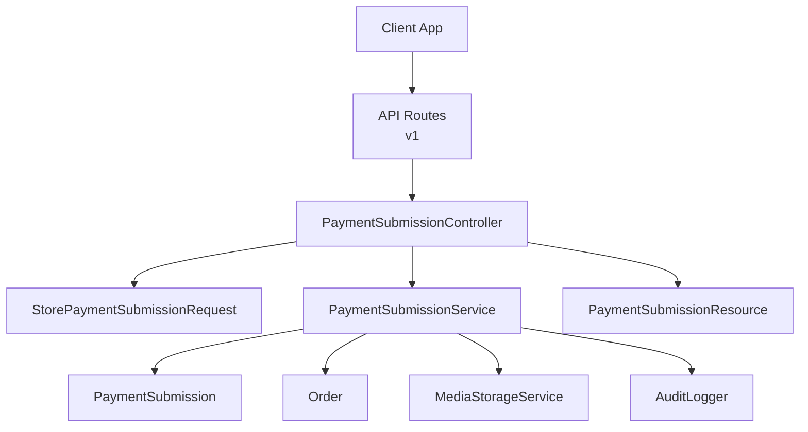
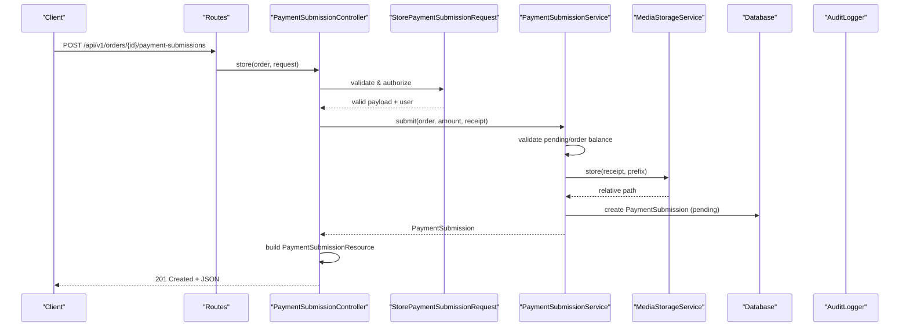
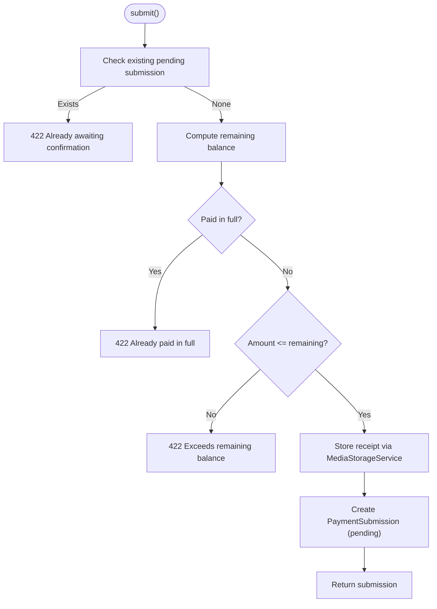
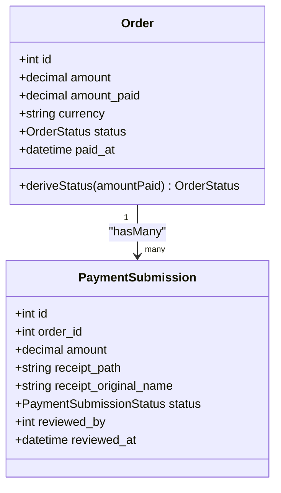
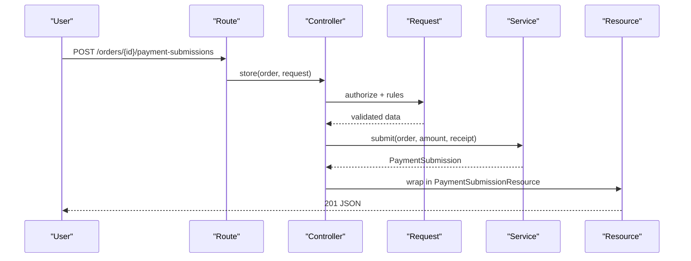
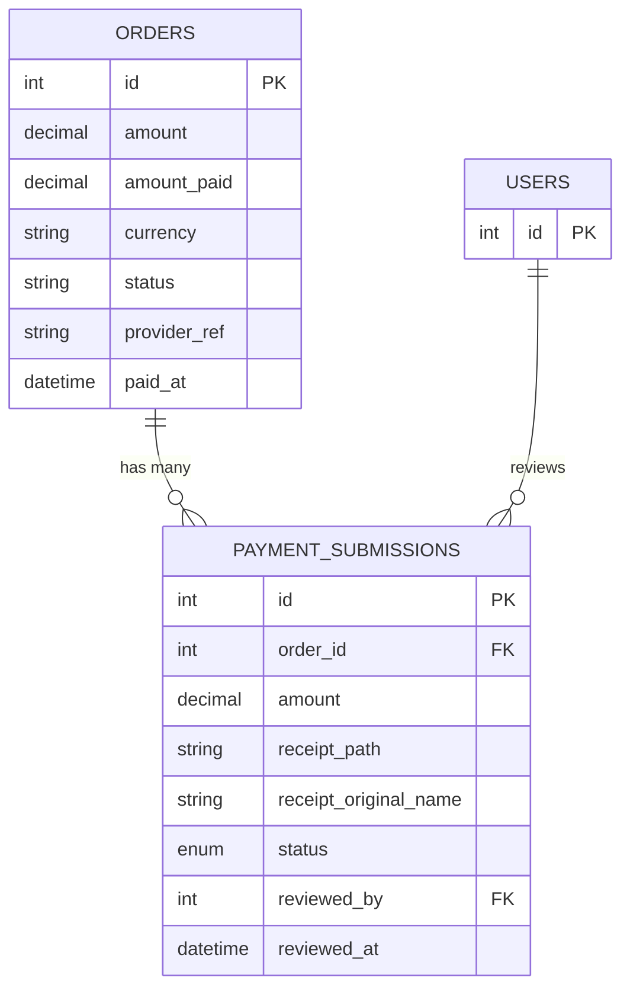
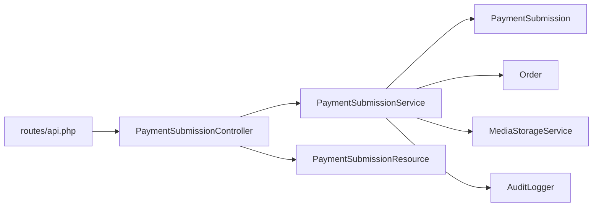

# Payment Processing Service

<cite>
**Referenced Files in This Document**
- [PaymentSubmissionService.php](file://app/Services/Payments/PaymentSubmissionService.php)
- [PaymentSubmissionController.php](file://app/Http/Controllers/Api/V1/PaymentSubmissionController.php)
- [StorePaymentSubmissionRequest.php](file://app/Http/Requests/Api/V1/StorePaymentSubmissionRequest.php)
- [PaymentSubmissionResource.php](file://app/Http/Resources/PaymentSubmissionResource.php)
- [PaymentSubmission.php](file://app/Models/PaymentSubmission.php)
- [Order.php](file://app/Models/Order.php)
- [PaymentSubmissionStatus.php](file://app/Enums/PaymentSubmissionStatus.php)
- [OrderStatus.php](file://app/Enums/OrderStatus.php)
- [2026_07_22_140000_create_payment_submissions_table.php](file://database/migrations/2026_07_22_140000_create_payment_submissions_table.php)
- [api.php](file://routes/api.php)
- [MediaStorageService.php](file://app/Services/Storage/MediaStorageService.php)
- [AuditLogger.php](file://app/Services/Audit/AuditLogger.php)
- [PaymentSubmissionTest.php](file://tests/Feature/PaymentSubmissionTest.php)
</cite>

## Table of Contents
1. Introduction
2. Project Structure
3. Core Components
4. Architecture Overview
5. Detailed Component Analysis
6. Dependency Analysis
7. Performance Considerations
8. Troubleshooting Guide
9. Conclusion

## Introduction
This document explains the Payment Processing Service that enables students to submit claimed payments with receipts, manages payment submission lifecycle, and integrates with admin review workflows. It covers validation, storage of receipts, order state derivation, audit logging, and API boundaries. It also clarifies what is implemented versus what is not (for example, there is no direct integration with external payment providers or webhook handling in this codebase).

## Project Structure
The payment feature spans controllers, services, models, enums, routes, resources, storage, and audit utilities:
- API entry point for student submissions under authenticated routes
- A service that enforces business rules and persists submissions
- Models and enums representing orders and submission states
- Migration defining the database schema
- Resource formatting for JSON responses
- Storage abstraction for receipt files
- Audit logger for compliance and traceability

**Diagram sources**
- [api.php:113-123](file://routes/api.php#L113-L123)
- [PaymentSubmissionController.php:14-32](file://app/Http/Controllers/Api/V1/PaymentSubmissionController.php#L14-L32)
- [StorePaymentSubmissionRequest.php:10-34](file://app/Http/Requests/Api/V1/StorePaymentSubmissionRequest.php#L10-L34)
- [PaymentSubmissionService.php:20-108](file://app/Services/Payments/PaymentSubmissionService.php#L20-L108)
- [PaymentSubmission.php:13-49](file://app/Models/PaymentSubmission.php#L13-L49)
- [Order.php:16-100](file://app/Models/Order.php#L16-L100)
- [MediaStorageService.php:24-85](file://app/Services/Storage/MediaStorageService.php#L24-L85)
- [AuditLogger.php:13-28](file://app/Services/Audit/AuditLogger.php#L13-L28)
- [PaymentSubmissionResource.php:11-29](file://app/Http/Resources/PaymentSubmissionResource.php#L11-L29)

**Section sources**
- [api.php:113-123](file://routes/api.php#L113-L123)
- [PaymentSubmissionController.php:14-32](file://app/Http/Controllers/Api/V1/PaymentSubmissionController.php#L14-L32)
- [StorePaymentSubmissionRequest.php:10-34](file://app/Http/Requests/Api/V1/StorePaymentSubmissionRequest.php#L10-L34)
- [PaymentSubmissionService.php:20-108](file://app/Services/Payments/PaymentSubmissionService.php#L20-L108)
- [PaymentSubmission.php:13-49](file://app/Models/PaymentSubmission.php#L13-L49)
- [Order.php:16-100](file://app/Models/Order.php#L16-L100)
- [MediaStorageService.php:24-85](file://app/Services/Storage/MediaStorageService.php#L24-L85)
- [AuditLogger.php:13-28](file://app/Services/Audit/AuditLogger.php#L13-L28)
- [PaymentSubmissionResource.php:11-29](file://app/Http/Resources/PaymentSubmissionResource.php#L11-L29)

## Core Components
- PaymentSubmissionService: Central orchestration for submitting, confirming, and rejecting payment submissions; validates amounts, stores receipts, updates orders, and logs audits.
- PaymentSubmission model: Represents a student’s claimed payment with amount, receipt path, status, and reviewer metadata.
- Order model: Holds course purchase details, tracks amount paid, and derives its own status from amount_paid vs amount.
- Enums: PaymentSubmissionStatus (pending, confirmed, rejected) and OrderStatus (pending, partial, paid).
- API layer: Route, controller, request validation, and resource serialization for submissions.
- Storage: MediaStorageService abstracts file uploads to a cloud disk and URL generation.
- Audit: AuditLogger records sensitive mutations for compliance.

Key responsibilities:
- Enforce one pending submission per order at a time
- Validate amount against remaining balance
- Store receipt securely and return a public URL
- Update order totals and status on confirmation
- Record audit trails for confirm/reject actions

**Section sources**
- [PaymentSubmissionService.php:20-108](file://app/Services/Payments/PaymentSubmissionService.php#L20-L108)
- [PaymentSubmission.php:13-49](file://app/Models/PaymentSubmission.php#L13-L49)
- [Order.php:16-100](file://app/Models/Order.php#L16-L100)
- [PaymentSubmissionStatus.php:7-12](file://app/Enums/PaymentSubmissionStatus.php#L7-L12)
- [OrderStatus.php:7-12](file://app/Enums/OrderStatus.php#L7-L12)
- [PaymentSubmissionController.php:14-32](file://app/Http/Controllers/Api/V1/PaymentSubmissionController.php#L14-L32)
- [StorePaymentSubmissionRequest.php:10-34](file://app/Http/Requests/Api/V1/StorePaymentSubmissionRequest.php#L10-L34)
- [PaymentSubmissionResource.php:11-29](file://app/Http/Resources/PaymentSubmissionResource.php#L11-L29)
- [MediaStorageService.php:24-85](file://app/Services/Storage/MediaStorageService.php#L24-L85)
- [AuditLogger.php:13-28](file://app/Services/Audit/AuditLogger.php#L13-L28)

## Architecture Overview
The flow begins with an authenticated student posting a payment submission against their order. The request is validated, then delegated to the service which performs business checks, stores the receipt, creates a pending submission, and returns a serialized response. Admins later confirm or reject submissions through separate admin endpoints (not shown here), which update order totals and statuses accordingly.

**Diagram sources**
- [api.php:113-113](file://routes/api.php#L113-L113)
- [PaymentSubmissionController.php:22-31](file://app/Http/Controllers/Api/V1/PaymentSubmissionController.php#L22-L31)
- [StorePaymentSubmissionRequest.php:12-33](file://app/Http/Requests/Api/V1/StorePaymentSubmissionRequest.php#L12-L33)
- [PaymentSubmissionService.php:27-54](file://app/Services/Payments/PaymentSubmissionService.php#L27-L54)
- [MediaStorageService.php:32-41](file://app/Services/Storage/MediaStorageService.php#L32-L41)
- [PaymentSubmission.php:18-32](file://app/Models/PaymentSubmission.php#L18-L32)

## Detailed Component Analysis

### PaymentSubmissionService
Responsibilities:
- Prevent duplicate pending submissions per order
- Ensure amount does not exceed remaining balance
- Store receipt via MediaStorageService
- Create a PaymentSubmission with status pending
- Confirm: apply amount to order, derive new order status, set paid_at when fully paid, mark submission confirmed with reviewer metadata, and log audit
- Reject: mark submission rejected with reviewer metadata and log audit

Validation and error handling:
- Uses abort_if to enforce business rules and return consistent client errors
- Ensures numeric precision for monetary values via decimal casts

Audit trail:
- Logs confirm and reject actions with context including previous/next amounts and status transitions

**Diagram sources**
- [PaymentSubmissionService.php:27-54](file://app/Services/Payments/PaymentSubmissionService.php#L27-L54)

**Section sources**
- [PaymentSubmissionService.php:27-54](file://app/Services/Payments/PaymentSubmissionService.php#L27-L54)
- [PaymentSubmissionService.php:56-86](file://app/Services/Payments/PaymentSubmissionService.php#L56-L86)
- [PaymentSubmissionService.php:88-107](file://app/Services/Payments/PaymentSubmissionService.php#L88-L107)

### Order and Status Derivation
- Order tracks total amount, amount_paid, currency, and derived status
- deriveStatus computes Pending/Partial/Paid based on amount_paid vs amount
- pendingPaymentSubmission helper isolates the latest pending submission for UI/admin flows

**Diagram sources**
- [Order.php:16-100](file://app/Models/Order.php#L16-L100)
- [PaymentSubmission.php:13-49](file://app/Models/PaymentSubmission.php#L13-L49)

**Section sources**
- [Order.php:16-100](file://app/Models/Order.php#L16-L100)
- [OrderStatus.php:7-12](file://app/Enums/OrderStatus.php#L7-L12)

### API Layer: Submission Endpoint
- Route: POST /api/v1/orders/{order}/payment-submissions
- Authorization: Policy-based authorization ensures only the order owner can submit
- Validation: Field-level rules for amount and receipt file type/size
- Response: Returns a PaymentSubmissionResource with a generated receipt URL

**Diagram sources**
- [api.php:113-113](file://routes/api.php#L113-L113)
- [PaymentSubmissionController.php:22-31](file://app/Http/Controllers/Api/V1/PaymentSubmissionController.php#L22-L31)
- [StorePaymentSubmissionRequest.php:12-33](file://app/Http/Requests/Api/V1/StorePaymentSubmissionRequest.php#L12-L33)
- [PaymentSubmissionResource.php:16-28](file://app/Http/Resources/PaymentSubmissionResource.php#L16-L28)

**Section sources**
- [api.php:113-113](file://routes/api.php#L113-L113)
- [PaymentSubmissionController.php:22-31](file://app/Http/Controllers/Api/V1/PaymentSubmissionController.php#L22-L31)
- [StorePaymentSubmissionRequest.php:12-33](file://app/Http/Requests/Api/V1/StorePaymentSubmissionRequest.php#L12-L33)
- [PaymentSubmissionResource.php:16-28](file://app/Http/Resources/PaymentSubmissionResource.php#L16-L28)

### Data Model and Schema
- payment_submissions table includes foreign keys to orders and users, amount, receipt path/name, status enum, and timestamps
- Order fields include amount, amount_paid, currency, status, provider_ref, and paid_at

**Diagram sources**
- [2026_07_22_140000_create_payment_submissions_table.php:13-23](file://database/migrations/2026_07_22_140000_create_payment_submissions_table.php#L13-L23)
- [Order.php:23-41](file://app/Models/Order.php#L23-L41)

**Section sources**
- [2026_07_22_140000_create_payment_submissions_table.php:13-23](file://database/migrations/2026_07_22_140000_create_payment_submissions_table.php#L13-L23)
- [Order.php:23-41](file://app/Models/Order.php#L23-L41)

### Receipt Storage and URLs
- Receipts are stored under a per-order prefix using MediaStorageService
- Responses expose a public receipt URL resolved by MediaStorageService.url()
- External URLs are passed through unchanged; internal paths resolve via configured disk

**Section sources**
- [PaymentSubmissionService.php:45-53](file://app/Services/Payments/PaymentSubmissionService.php#L45-L53)
- [MediaStorageService.php:32-41](file://app/Services/Storage/MediaStorageService.php#L32-L41)
- [MediaStorageService.php:68-79](file://app/Services/Storage/MediaStorageService.php#L68-L79)
- [PaymentSubmissionResource.php:22-22](file://app/Http/Resources/PaymentSubmissionResource.php#L22-L22)

### Audit Logging
- Confirm and reject actions are logged with actor, entity type/id, and contextual metadata
- Provides an auditable trail for financial operations

**Section sources**
- [PaymentSubmissionService.php:77-83](file://app/Services/Payments/PaymentSubmissionService.php#L77-L83)
- [PaymentSubmissionService.php:98-104](file://app/Services/Payments/PaymentSubmissionService.php#L98-L104)
- [AuditLogger.php:18-27](file://app/Services/Audit/AuditLogger.php#L18-L27)

## Dependency Analysis
- PaymentSubmissionController depends on PaymentSubmissionService and uses StorePaymentSubmissionRequest for validation and authorization
- PaymentSubmissionService depends on PaymentSubmission and Order models, MediaStorageService for file handling, and AuditLogger for compliance
- PaymentSubmissionResource depends on MediaStorageService to generate public URLs
- Routes wire the controller endpoint under authenticated middleware

**Diagram sources**
- [api.php:113-123](file://routes/api.php#L113-L123)
- [PaymentSubmissionController.php:14-32](file://app/Http/Controllers/Api/V1/PaymentSubmissionController.php#L14-L32)
- [PaymentSubmissionService.php:20-108](file://app/Services/Payments/PaymentSubmissionService.php#L20-L108)
- [PaymentSubmissionResource.php:11-29](file://app/Http/Resources/PaymentSubmissionResource.php#L11-L29)

**Section sources**
- [api.php:113-123](file://routes/api.php#L113-L123)
- [PaymentSubmissionController.php:14-32](file://app/Http/Controllers/Api/V1/PaymentSubmissionController.php#L14-L32)
- [PaymentSubmissionService.php:20-108](file://app/Services/Payments/PaymentSubmissionService.php#L20-L108)
- [PaymentSubmissionResource.php:11-29](file://app/Http/Resources/PaymentSubmissionResource.php#L11-L29)

## Performance Considerations
- Single pending submission guard prevents redundant writes and race conditions
- Monetary calculations use decimal casting to avoid floating-point drift
- File storage is abstracted; ensure disk configuration is tuned for throughput and caching
- Avoid eager loading unnecessary relations in list endpoints; load only required data for performance

[No sources needed since this section provides general guidance]

## Troubleshooting Guide
Common issues and resolutions:
- Duplicate pending submission: If a submission already exists in pending state, further submissions are rejected. Resolve by waiting for admin action or clearing stale pending submissions.
- Overpayment attempts: Submissions exceeding the remaining balance are rejected. Verify order.amount and order.amount_paid before submitting.
- Already paid in full: No submissions allowed when amount_paid equals or exceeds amount.
- Receipt upload failures: Storage errors will surface as runtime exceptions; check disk configuration and permissions.
- Authorization errors: Ensure the authenticated user owns the order or has appropriate policy access.

Relevant behaviors are enforced via explicit checks and consistent HTTP error codes.

**Section sources**
- [PaymentSubmissionService.php:29-43](file://app/Services/Payments/PaymentSubmissionService.php#L29-L43)
- [PaymentSubmissionService.php:56-59](file://app/Services/Payments/PaymentSubmissionService.php#L56-L59)
- [StorePaymentSubmissionRequest.php:12-18](file://app/Http/Requests/Api/V1/StorePaymentSubmissionRequest.php#L12-L18)
- [MediaStorageService.php:32-41](file://app/Services/Storage/MediaStorageService.php#L32-L41)

## Conclusion
The Payment Processing Service implements a robust, auditable workflow for students to submit claimed payments with receipts and for admins to review them. It enforces strict business rules around order balances, maintains clear state transitions, and centralizes storage and auditing. There is no direct integration with external payment providers or webhook handling in this codebase; payments are manually verified by administrators. For future enhancements, consider adding automated verification channels, webhook ingestion, and additional security controls aligned with PCI requirements.

[No sources needed since this section summarizes without analyzing specific files]

## Appendices

### Examples and Workflows

- Processing a new payment submission
  - Steps: Authenticate as the order owner, POST amount and receipt to the submission endpoint, receive a pending submission with a receipt URL
  - Validation: Amount must be positive and within remaining balance; receipt must be an allowed image format and size
  - Outcome: A pending PaymentSubmission is created; order totals remain unchanged until admin confirmation

- Generating payment receipts
  - Receipts are stored server-side and exposed via a public URL in the response
  - Use the provided receipt_url to display or download the receipt

- Handling payment failures
  - Rejection: Admin marks a submission as rejected; order remains unchanged; student may resubmit
  - Validation failures: Requests exceeding limits or violating policies return client errors

- Implementing payment verification workflows
  - Admin confirms a submission to apply the amount to the order and derive the final order status
  - On full payment, the order status becomes paid and paid_at is recorded
  - All confirmations and rejections are audited

- Webhook handling for payment confirmations
  - Not implemented in this codebase; current flow relies on manual admin review

- Security considerations and PCI compliance
  - Do not store raw cardholder data in application databases; rely on external payment providers if processing cards directly
  - Protect PII and financial metadata with authentication, authorization, and least privilege
  - Encrypt sensitive data at rest and in transit; restrict access to audit logs and receipts
  - Apply input validation and output encoding; sanitize file uploads and enforce MIME/type checks
  - Maintain comprehensive audit trails for all financial mutations
  - Follow PCI DSS guidelines for any system touching payment card data; isolate such systems and minimize scope

**Section sources**
- [PaymentSubmissionService.php:27-107](file://app/Services/Payments/PaymentSubmissionService.php#L27-L107)
- [StorePaymentSubmissionRequest.php:27-33](file://app/Http/Requests/Api/V1/StorePaymentSubmissionRequest.php#L27-L33)
- [PaymentSubmissionResource.php:16-28](file://app/Http/Resources/PaymentSubmissionResource.php#L16-L28)
- [AuditLogger.php:18-27](file://app/Services/Audit/AuditLogger.php#L18-L27)
- [PaymentSubmissionTest.php:19-36](file://tests/Feature/PaymentSubmissionTest.php#L19-L36)
- [PaymentSubmissionTest.php:38-46](file://tests/Feature/PaymentSubmissionTest.php#L38-L46)