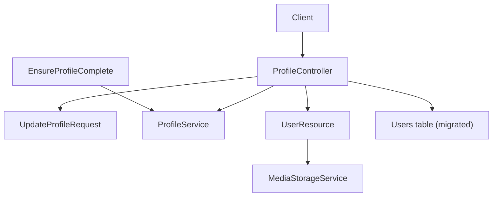
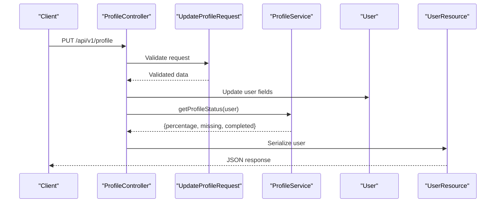
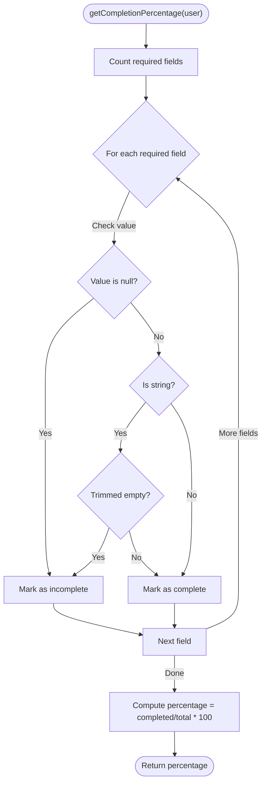
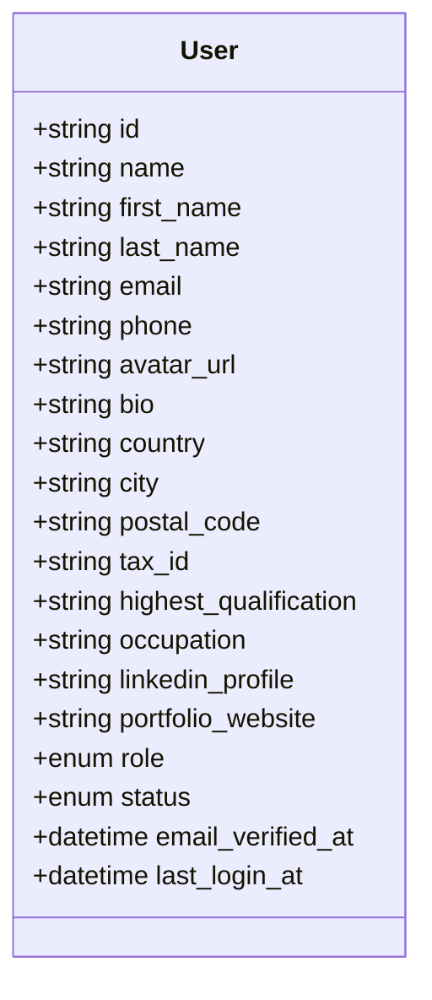
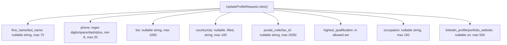
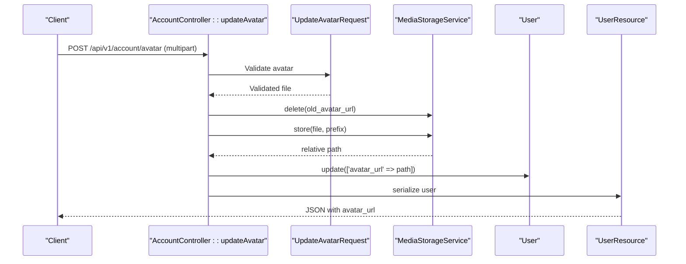
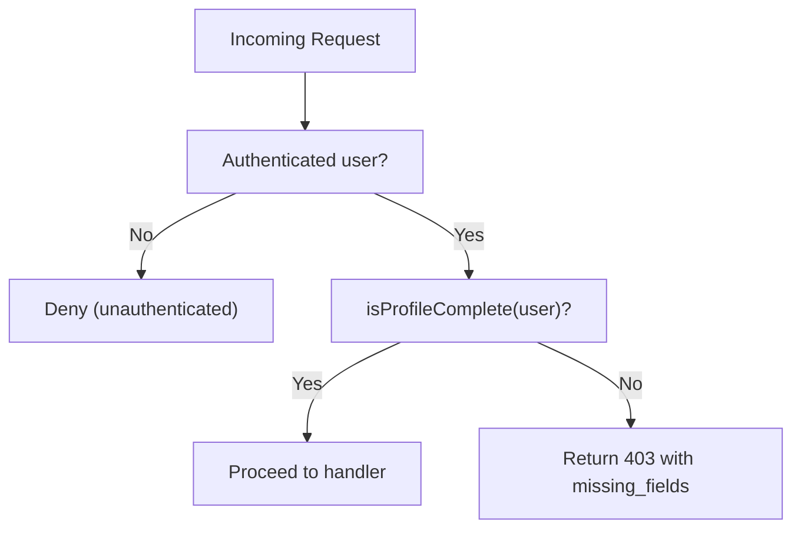
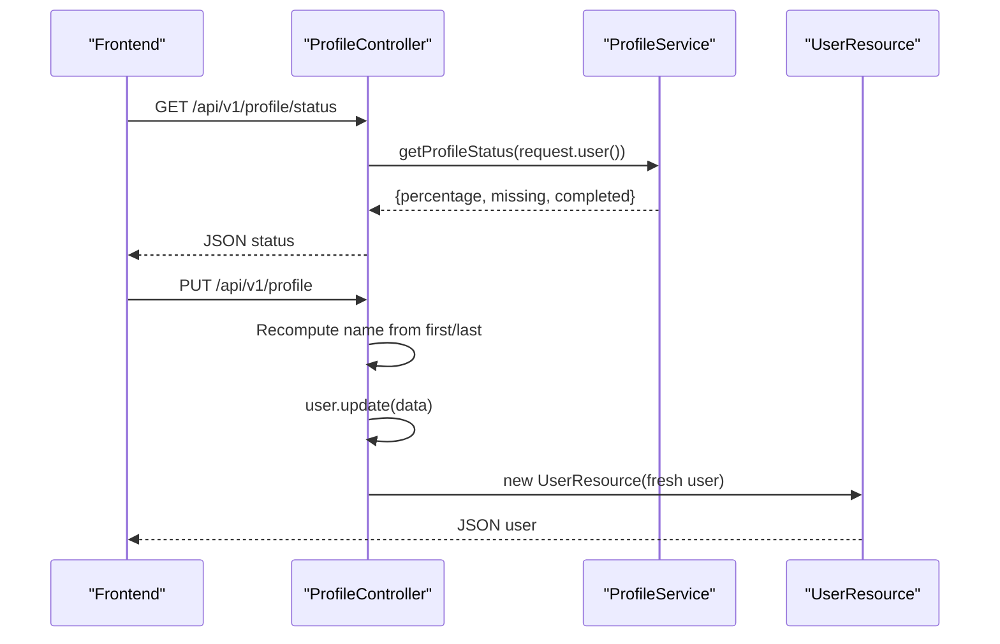
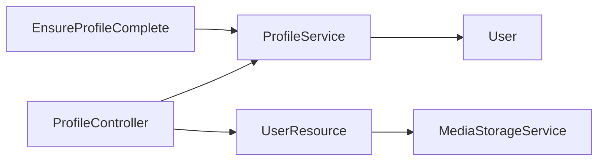

# Profile Management Service

<cite>
**Referenced Files in This Document**
- [ProfileService.php](file://app/Services/Profile/ProfileService.php)
- [User.php](file://app/Models/User.php)
- [ProfileController.php](file://app/Http/Controllers/Api/V1/ProfileController.php)
- [UpdateProfileRequest.php](file://app/Http/Requests/Api/V1/UpdateProfileRequest.php)
- [UpdateAvatarRequest.php](file://app/Http/Requests/Api/V1/UpdateAvatarRequest.php)
- [EnsureProfileComplete.php](file://app/Http/Middleware/EnsureProfileComplete.php)
- [UserResource.php](file://app/Http/Resources/UserResource.php)
- [MediaStorageService.php](file://app/Services/Storage/MediaStorageService.php)
- [2026_07_29_010000_add_profile_fields_to_users_table.php](file://database/migrations/2026_07_29_010000_add_profile_fields_to_users_table.php)
- [2026_08_05_010000_add_remaining_profile_fields_to_users_table.php](file://database/migrations/2026_08_05_010000_add_remaining_profile_fields_to_users_table.php)
- [ProfileServiceTest.php](file://tests/Unit/Services/Profile/ProfileServiceTest.php)
</cite>

## Table of Contents
1. [Introduction](#introduction)
2. [Project Structure](#project-structure)
3. [Core Components](#core-components)
4. [Architecture Overview](#architecture-overview)
5. [Detailed Component Analysis](#detailed-component-analysis)
6. [Dependency Analysis](#dependency-analysis)
7. [Performance Considerations](#performance-considerations)
8. [Troubleshooting Guide](#troubleshooting-guide)
9. [Conclusion](#conclusion)
10. [Appendices](#appendices)

## Introduction
This document explains the Profile Management Service that powers user profile updates, validation, and progressive profile completion tracking. It covers how required fields are defined, how completion percentages are calculated, how avatar uploads are handled, and how application areas can enforce profile completion via middleware. It also documents data privacy considerations, field accessibility controls, and synchronization across the API layer.

## Project Structure
The profile management feature spans several layers:
- Service layer: central business logic for profile completeness
- Model layer: user model with fillable profile fields
- Request validation: strict rules for profile and avatar updates
- Controller layer: endpoints to read status and update profiles
- Middleware: enforcement of profile completion on protected routes
- Resource layer: safe serialization of user data including avatar URLs
- Storage service: unified upload, URL resolution, and deletion
- Database migrations: schema additions for profile fields

**Diagram sources**
- [ProfileController.php:23-71](file://app/Http/Controllers/Api/V1/ProfileController.php#L23-L71)
- [UpdateProfileRequest.php:16-36](file://app/Http/Requests/Api/V1/UpdateProfileRequest.php#L16-L36)
- [ProfileService.php:16-175](file://app/Services/Profile/ProfileService.php#L16-L175)
- [EnsureProfileComplete.php:28-57](file://app/Http/Middleware/EnsureProfileComplete.php#L28-L57)
- [UserResource.php:16-37](file://app/Http/Resources/UserResource.php#L16-L37)
- [MediaStorageService.php:24-85](file://app/Services/Storage/MediaStorageService.php#L24-L85)
- [2026_07_29_010000_add_profile_fields_to_users_table.php:12-45](file://database/migrations/2026_07_29_010000_add_profile_fields_to_users_table.php#L12-L45)
- [2026_08_05_010000_add_remaining_profile_fields_to_users_table.php:22-36](file://database/migrations/2026_08_05_010000_add_remaining_profile_fields_to_users_table.php#L22-L36)

**Section sources**
- [ProfileService.php:16-175](file://app/Services/Profile/ProfileService.php#L16-L175)
- [User.php:24-55](file://app/Models/User.php#L24-L55)
- [ProfileController.php:23-71](file://app/Http/Controllers/Api/V1/ProfileController.php#L23-L71)
- [UpdateProfileRequest.php:16-36](file://app/Http/Requests/Api/V1/UpdateProfileRequest.php#L16-L36)
- [UpdateAvatarRequest.php:16-20](file://app/Http/Requests/Api/V1/UpdateAvatarRequest.php#L16-L20)
- [EnsureProfileComplete.php:28-57](file://app/Http/Middleware/EnsureProfileComplete.php#L28-L57)
- [UserResource.php:16-37](file://app/Http/Resources/UserResource.php#L16-L37)
- [MediaStorageService.php:24-85](file://app/Services/Storage/MediaStorageService.php#L24-L85)
- [2026_07_29_010000_add_profile_fields_to_users_table.php:12-45](file://database/migrations/2026_07_29_010000_add_profile_fields_to_users_table.php#L12-L45)
- [2026_08_05_010000_add_remaining_profile_fields_to_users_table.php:22-36](file://database/migrations/2026_08_05_010000_add_remaining_profile_fields_to_users_table.php#L22-L36)

## Core Components
- ProfileService: Defines required fields, calculates completion percentage, identifies missing/completed fields, and exposes a comprehensive status object.
- User model: Declares fillable profile fields and casts; includes name split into first_name/last_name and other optional fields.
- UpdateProfileRequest: Validates profile inputs including phone format, country/city presence when provided, qualification enum-like values, and optional URLs.
- ProfileController: Exposes status and update endpoints; recomputes display name from first/last name on update.
- EnsureProfileComplete middleware: Blocks requests to protected routes if profile is incomplete, returning structured error with missing fields.
- UserResource: Serializes user data safely, resolving avatar_url through MediaStorageService to public CDN URLs.
- MediaStorageService: Centralized storage abstraction for uploads, URL generation, and deletion; supports external URLs and internal paths.

**Section sources**
- [ProfileService.php:16-175](file://app/Services/Profile/ProfileService.php#L16-L175)
- [User.php:24-55](file://app/Models/User.php#L24-L55)
- [UpdateProfileRequest.php:16-36](file://app/Http/Requests/Api/V1/UpdateProfileRequest.php#L16-L36)
- [ProfileController.php:23-71](file://app/Http/Controllers/Api/V1/ProfileController.php#L23-L71)
- [EnsureProfileComplete.php:28-57](file://app/Http/Middleware/EnsureProfileComplete.php#L28-L57)
- [UserResource.php:16-37](file://app/Http/Resources/UserResource.php#L16-L37)
- [MediaStorageService.php:24-85](file://app/Services/Storage/MediaStorageService.php#L24-L85)

## Architecture Overview
The system enforces a clear separation of concerns:
- Controllers handle HTTP concerns and delegate to services
- Services encapsulate business rules (profile completion)
- Requests validate input at the boundary
- Middleware protects sensitive routes based on profile state
- Resources ensure consistent and safe API responses
- Storage service abstracts file operations and URL resolution

**Diagram sources**
- [ProfileController.php:57-71](file://app/Http/Controllers/Api/V1/ProfileController.php#L57-L71)
- [UpdateProfileRequest.php:16-36](file://app/Http/Requests/Api/V1/UpdateProfileRequest.php#L16-L36)
- [ProfileService.php:56-147](file://app/Services/Profile/ProfileService.php#L56-L147)
- [User.php:24-55](file://app/Models/User.php#L24-L55)
- [UserResource.php:16-37](file://app/Http/Resources/UserResource.php#L16-L37)

## Detailed Component Analysis

### ProfileService: Completion Logic
- Required fields: name, email, phone, country, city, highest_qualification
- Completion percentage: ratio of completed required fields to total required fields, rounded to two decimals
- Missing fields: list of required fields that are null or empty after trimming
- Complete check: true only when all required fields are present and non-empty
- Status object: returns percentage, missing, and completed arrays for UI consumption

**Diagram sources**
- [ProfileService.php:56-73](file://app/Services/Profile/ProfileService.php#L56-L73)
- [ProfileService.php:158-174](file://app/Services/Profile/ProfileService.php#L158-L174)

**Section sources**
- [ProfileService.php:16-175](file://app/Services/Profile/ProfileService.php#L16-L175)
- [ProfileServiceTest.php:46-154](file://tests/Unit/Services/Profile/ProfileServiceTest.php#L46-L154)

### User Model Extensions and Field Accessibility
- Fillable fields include personal and professional details: first_name, last_name, bio, country, city, postal_code, tax_id, highest_qualification, occupation, linkedin_profile, portfolio_website, avatar_url
- Hidden fields exclude password_hash from serialized output
- Casts map enums and datetime fields for consistency

**Diagram sources**
- [User.php:24-55](file://app/Models/User.php#L24-L55)

**Section sources**
- [User.php:24-55](file://app/Models/User.php#L24-L55)
- [2026_07_29_010000_add_profile_fields_to_users_table.php:12-45](file://database/migrations/2026_07_29_010000_add_profile_fields_to_users_table.php#L12-L45)
- [2026_08_05_010000_add_remaining_profile_fields_to_users_table.php:22-36](file://database/migrations/2026_08_05_010000_add_remaining_profile_fields_to_users_table.php#L22-L36)

### Validation Rules for Profile Updates
- first_name, last_name: nullable strings with length limits
- phone: sometimes present, numeric pattern, min/max length
- bio: nullable string with max length
- country, city: nullable but must be filled when present
- postal_code, tax_id: nullable strings with max lengths
- highest_qualification: enumerated-like set of acceptable values
- occupation: nullable string with max length
- linkedin_profile, portfolio_website: nullable URLs with max length

**Diagram sources**
- [UpdateProfileRequest.php:16-36](file://app/Http/Requests/Api/V1/UpdateProfileRequest.php#L16-L36)

**Section sources**
- [UpdateProfileRequest.php:16-36](file://app/Http/Requests/Api/V1/UpdateProfileRequest.php#L16-L36)

### Avatar Upload Handling
- Validation: image type restricted to jpg/jpeg/png/gif/webp, max size 5MB
- Storage: centralized via MediaStorageService which stores under role-based prefixes and resolves public URLs
- Response: UserResource serializes avatar_url using MediaStorageService.url to return CDN links

**Diagram sources**
- [UpdateAvatarRequest.php:16-20](file://app/Http/Requests/Api/V1/UpdateAvatarRequest.php#L16-L20)
- [MediaStorageService.php:32-79](file://app/Services/Storage/MediaStorageService.php#L32-L79)
- [UserResource.php:16-37](file://app/Http/Resources/UserResource.php#L16-L37)

**Section sources**
- [UpdateAvatarRequest.php:16-20](file://app/Http/Requests/Api/V1/UpdateAvatarRequest.php#L16-L20)
- [MediaStorageService.php:24-85](file://app/Services/Storage/MediaStorageService.php#L24-L85)
- [UserResource.php:16-37](file://app/Http/Resources/UserResource.php#L16-L37)

### Profile Completion Enforcement Middleware
- Protects routes by checking isProfileComplete
- Returns 403 with structured error containing missing fields when incomplete
- Enables consistent gating across features like course applications

**Diagram sources**
- [EnsureProfileComplete.php:42-57](file://app/Http/Middleware/EnsureProfileComplete.php#L42-L57)
- [ProfileService.php:108-117](file://app/Services/Profile/ProfileService.php#L108-L117)

**Section sources**
- [EnsureProfileComplete.php:28-57](file://app/Http/Middleware/EnsureProfileComplete.php#L28-L57)
- [ProfileService.php:108-117](file://app/Services/Profile/ProfileService.php#L108-L117)

### API Endpoints and Data Flow
- GET /api/v1/profile/status: returns detailed profile status (percentage, missing, completed)
- PUT /api/v1/profile: updates profile fields; recomputes name from first_name/last_name if provided

**Diagram sources**
- [ProfileController.php:38-71](file://app/Http/Controllers/Api/V1/ProfileController.php#L38-L71)
- [ProfileService.php:129-147](file://app/Services/Profile/ProfileService.php#L129-L147)
- [UserResource.php:16-37](file://app/Http/Resources/UserResource.php#L16-L37)

**Section sources**
- [ProfileController.php:23-71](file://app/Http/Controllers/Api/V1/ProfileController.php#L23-L71)

## Dependency Analysis
- ProfileController depends on ProfileService for business logic and UserResource for serialization
- EnsureProfileComplete depends on ProfileService to enforce completion policy
- UserResource depends on MediaStorageService to resolve avatar URLs
- All components rely on User model for data access and persistence

**Diagram sources**
- [ProfileController.php:23-71](file://app/Http/Controllers/Api/V1/ProfileController.php#L23-L71)
- [EnsureProfileComplete.php:28-57](file://app/Http/Middleware/EnsureProfileComplete.php#L28-L57)
- [UserResource.php:16-37](file://app/Http/Resources/UserResource.php#L16-L37)
- [MediaStorageService.php:24-85](file://app/Services/Storage/MediaStorageService.php#L24-L85)
- [User.php:24-55](file://app/Models/User.php#L24-L55)

**Section sources**
- [ProfileController.php:23-71](file://app/Http/Controllers/Api/V1/ProfileController.php#L23-L71)
- [EnsureProfileComplete.php:28-57](file://app/Http/Middleware/EnsureProfileComplete.php#L28-L57)
- [UserResource.php:16-37](file://app/Http/Resources/UserResource.php#L16-L37)
- [MediaStorageService.php:24-85](file://app/Services/Storage/MediaStorageService.php#L24-L85)
- [User.php:24-55](file://app/Models/User.php#L24-L55)

## Performance Considerations
- Profile completion checks iterate over a small fixed set of required fields; complexity is O(n) where n is number of required fields (constant in practice)
- Index on phone column improves queries that filter or sort by phone
- Avoid unnecessary re-fetching by using fresh() after updates to minimize extra queries
- MediaStorageService centralizes URL resolution and avoids repeated disk calls

[No sources needed since this section provides general guidance]

## Troubleshooting Guide
Common issues and resolutions:
- 403 profile_incomplete: Indicates missing required fields; use the returned missing_fields array to guide users
- Validation errors: Ensure phone matches allowed characters and length; verify highest_qualification is one of the accepted values; confirm URLs are valid for optional link fields
- Avatar upload failures: Confirm file type and size constraints; ensure storage disk configuration is correct; verify old avatar cleanup does not attempt to delete external URLs
- Name mismatch: When updating first_name/last_name, name is recomputed; ensure frontend sends updated first/last to keep name consistent

**Section sources**
- [EnsureProfileComplete.php:42-57](file://app/Http/Middleware/EnsureProfileComplete.php#L42-L57)
- [UpdateProfileRequest.php:16-36](file://app/Http/Requests/Api/V1/UpdateProfileRequest.php#L16-L36)
- [UpdateAvatarRequest.php:16-20](file://app/Http/Requests/Api/V1/UpdateAvatarRequest.php#L16-L20)
- [MediaStorageService.php:55-79](file://app/Services/Storage/MediaStorageService.php#L55-L79)
- [ProfileController.php:57-71](file://app/Http/Controllers/Api/V1/ProfileController.php#L57-L71)

## Conclusion
The Profile Management Service centralizes profile completion logic, ensuring consistent enforcement across the application. With robust validation, clear completion metrics, and secure avatar handling, it enables progressive onboarding while protecting sensitive routes until profiles are complete. The design promotes maintainability and scalability by isolating business rules in a dedicated service and standardizing I/O through requests, resources, and middleware.

[No sources needed since this section summarizes without analyzing specific files]

## Appendices

### Examples and Workflows

- Updating user profiles:
  - Call PUT /api/v1/profile with validated fields; controller recomputes name from first/last and persists changes; response includes updated user via UserResource
  - Reference: [ProfileController.php:57-71](file://app/Http/Controllers/Api/V1/ProfileController.php#L57-L71), [UpdateProfileRequest.php:16-36](file://app/Http/Requests/Api/V1/UpdateProfileRequest.php#L16-L36)

- Validating profile fields:
  - Use UpdateProfileRequest rules to enforce formats and constraints; errors will indicate invalid phone patterns, out-of-range lengths, or disallowed qualifications
  - Reference: [UpdateProfileRequest.php:16-36](file://app/Http/Requests/Api/V1/UpdateProfileRequest.php#L16-L36)

- Calculating completion percentages:
  - Use ProfileService.getCompletionPercentage to compute progress; empty or whitespace-only strings count as incomplete
  - Reference: [ProfileService.php:56-73](file://app/Services/Profile/ProfileService.php#L56-L73), [ProfileServiceTest.php:46-154](file://tests/Unit/Services/Profile/ProfileServiceTest.php#L46-L154)

- Implementing profile completion workflows:
  - Enforce completion on protected routes via EnsureProfileComplete middleware; return structured error with missing fields to guide users
  - Reference: [EnsureProfileComplete.php:42-57](file://app/Http/Middleware/EnsureProfileComplete.php#L42-L57)

- Uploading avatars:
  - POST multipart/form-data with avatar field; validated by UpdateAvatarRequest; stored via MediaStorageService; response includes resolved avatar URL
  - Reference: [UpdateAvatarRequest.php:16-20](file://app/Http/Requests/Api/V1/UpdateAvatarRequest.php#L16-L20), [MediaStorageService.php:32-79](file://app/Services/Storage/MediaStorageService.php#L32-L79), [UserResource.php:16-37](file://app/Http/Resources/UserResource.php#L16-L37)

### Data Privacy and Field Accessibility Controls
- Sensitive fields such as password_hash are hidden from serialized responses
- Optional fields (e.g., bio, occupation, social links) do not affect completion percentage and can be left blank
- Avatar URLs are resolved through MediaStorageService to ensure consistent and secure CDN delivery
- Middleware blocks access to protected routes unless all required fields are complete, reducing exposure of features requiring verified profiles

**Section sources**
- [User.php:45-55](file://app/Models/User.php#L45-L55)
- [UserResource.php:16-37](file://app/Http/Resources/UserResource.php#L16-L37)
- [EnsureProfileComplete.php:42-57](file://app/Http/Middleware/EnsureProfileComplete.php#L42-L57)

### Profile Synchronization Across Application Areas
- Profile status endpoint provides a single source of truth for completion percentage and missing fields used by dashboards, application flows, and UI prompts
- Middleware ensures consistent enforcement wherever protection is applied
- Resource layer guarantees consistent serialization of user data across endpoints

**Section sources**
- [ProfileController.php:38-71](file://app/Http/Controllers/Api/V1/ProfileController.php#L38-L71)
- [EnsureProfileComplete.php:42-57](file://app/Http/Middleware/EnsureProfileComplete.php#L42-L57)
- [UserResource.php:16-37](file://app/Http/Resources/UserResource.php#L16-L37)