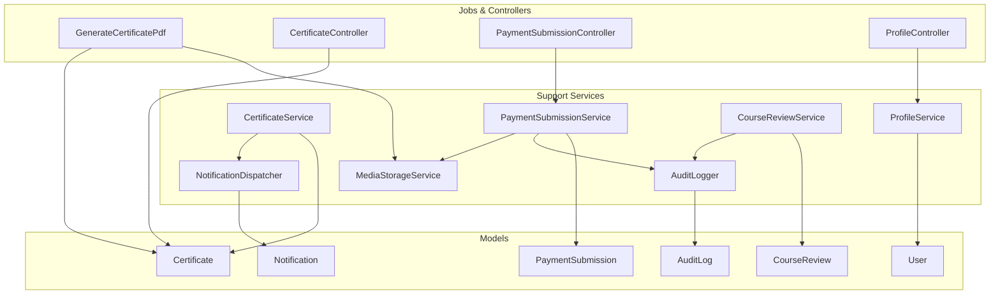
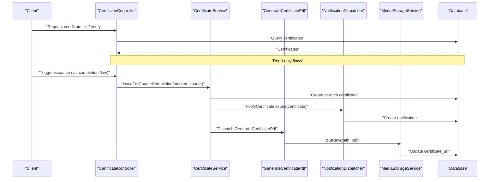
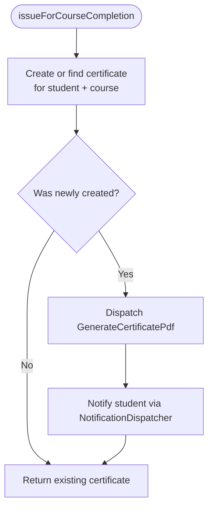
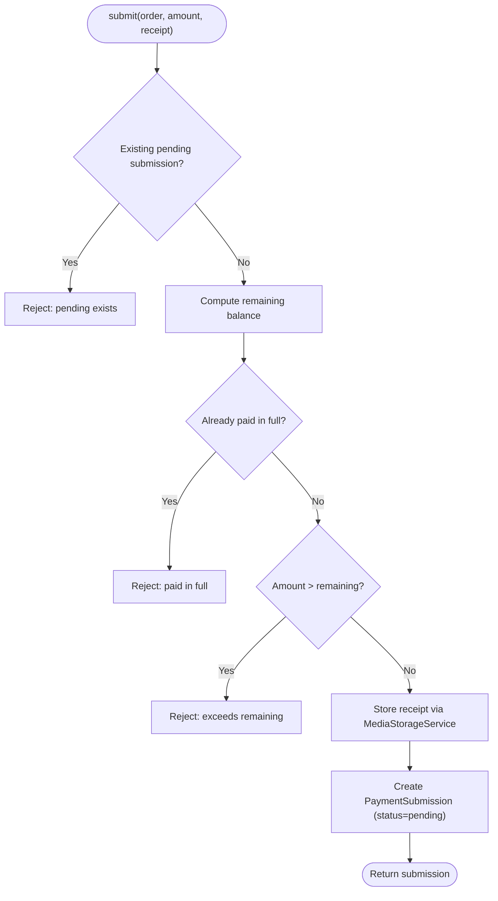
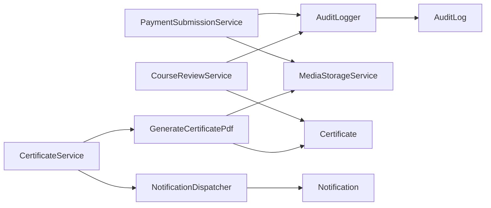

# Support Services

<cite>
**Referenced Files in This Document**
- [AuditLogger.php](file://app/Services/Audit/AuditLogger.php)
- [CertificateService.php](file://app/Services/Certification/CertificateService.php)
- [NotificationDispatcher.php](file://app/Services/Notifications/NotificationDispatcher.php)
- [PaymentSubmissionService.php](file://app/Services/Payments/PaymentSubmissionService.php)
- [ProfileService.php](file://app/Services/Profile/ProfileService.php)
- [CourseReviewService.php](file://app/Services/Reviews/CourseReviewService.php)
- [MediaStorageService.php](file://app/Services/Storage/MediaStorageService.php)
- [AuditLog.php](file://app/Models/AuditLog.php)
- [Certificate.php](file://app/Models/Certificate.php)
- [Notification.php](file://app/Models/Notification.php)
- [PaymentSubmission.php](file://app/Models/PaymentSubmission.php)
- [User.php](file://app/Models/User.php)
- [CourseReview.php](file://app/Models/CourseReview.php)
- [GenerateCertificatePdf.php](file://app/Jobs/GenerateCertificatePdf.php)
- [CertificateController.php](file://app/Http/Controllers/Api/V1/CertificateController.php)
- [PaymentSubmissionController.php](file://app/Http/Controllers/Api/V1/PaymentSubmissionController.php)
- [ProfileController.php](file://app/Http/Controllers/Api/V1/ProfileController.php)
</cite>

## Table of Contents
1. [Introduction](#introduction)
2. [Project Structure](#project-structure)
3. [Core Components](#core-components)
4. [Architecture Overview](#architecture-overview)
5. [Detailed Component Analysis](#detailed-component-analysis)
6. [Dependency Analysis](#dependency-analysis)
7. [Performance Considerations](#performance-considerations)
8. [Troubleshooting Guide](#troubleshooting-guide)
9. [Conclusion](#conclusion)

## Introduction
This document describes the Support Services that provide cross-cutting functionality across the application. These services encapsulate reusable business capabilities and maintain separation of concerns by centralizing responsibilities such as audit logging, certificate generation, notifications, payment processing, profile management, reviews, and storage operations. Each service is designed to be cohesive, testable, and independently usable by controllers, jobs, and other services without leaking infrastructure details into domain logic.

## Project Structure
The support services are organized under app/Services with a clear domain-based layout:
- Audit: centralized audit logging
- Certification: certificate issuance and coordination
- Notifications: single write path for in-app notifications
- Payments: submission, confirmation, and rejection workflows
- Profile: completion rules and status computation
- Reviews: course review lifecycle and moderation
- Storage: unified file upload, storage, URL resolution, and deletion

**Diagram sources**
- [AuditLogger.php:1-29](file://app/Services/Audit/AuditLogger.php#L1-L29)
- [CertificateService.php:1-47](file://app/Services/Certification/CertificateService.php#L1-L47)
- [NotificationDispatcher.php:1-206](file://app/Services/Notifications/NotificationDispatcher.php#L1-L206)
- [PaymentSubmissionService.php:1-109](file://app/Services/Payments/PaymentSubmissionService.php#L1-L109)
- [ProfileService.php:1-176](file://app/Services/Profile/ProfileService.php#L1-L176)
- [CourseReviewService.php:1-134](file://app/Services/Reviews/CourseReviewService.php#L1-L134)
- [MediaStorageService.php:1-86](file://app/Services/Storage/MediaStorageService.php#L1-L86)
- [AuditLog.php:1-39](file://app/Models/AuditLog.php#L1-L39)
- [Certificate.php:1-47](file://app/Models/Certificate.php#L1-L47)
- [Notification.php:1-46](file://app/Models/Notification.php#L1-L46)
- [PaymentSubmission.php:1-50](file://app/Models/PaymentSubmission.php#L1-L50)
- [User.php:1-100](file://app/Models/User.php#L1-L100)
- [CourseReview.php:1-60](file://app/Models/CourseReview.php#L1-L60)
- [GenerateCertificatePdf.php:1-67](file://app/Jobs/GenerateCertificatePdf.php#L1-L67)
- [CertificateController.php:1-48](file://app/Http/Controllers/Api/V1/CertificateController.php#L1-L48)
- [PaymentSubmissionController.php:1-33](file://app/Http/Controllers/Api/V1/PaymentSubmissionController.php#L1-L33)
- [ProfileController.php:1-73](file://app/Http/Controllers/Api/V1/ProfileController.php#L1-L73)

**Section sources**
- [AuditLogger.php:1-29](file://app/Services/Audit/AuditLogger.php#L1-L29)
- [CertificateService.php:1-47](file://app/Services/Certification/CertificateService.php#L1-L47)
- [NotificationDispatcher.php:1-206](file://app/Services/Notifications/NotificationDispatcher.php#L1-L206)
- [PaymentSubmissionService.php:1-109](file://app/Services/Payments/PaymentSubmissionService.php#L1-L109)
- [ProfileService.php:1-176](file://app/Services/Profile/ProfileService.php#L1-L176)
- [CourseReviewService.php:1-134](file://app/Services/Reviews/CourseReviewService.php#L1-L134)
- [MediaStorageService.php:1-86](file://app/Services/Storage/MediaStorageService.php#L1-L86)

## Core Components
- AuditLogger: Centralized audit log writer used by multiple services to record sensitive mutations with actor, action, entity type/id, and metadata.
- CertificateService: Issues certificates on course completion, ensures uniqueness, dispatches PDF generation off the request cycle, and notifies students.
- NotificationDispatcher: Single write path for in-app notifications; provides typed methods for common events (course updates, messages, tickets, forum activity, grades, module unlocks, at-risk reminders).
- PaymentSubmissionService: Validates and processes student payment submissions, stores receipts, updates order totals/status, and records admin confirmations/rejections with audit logs.
- ProfileService: Defines required profile fields, computes completion percentage, identifies missing/completed fields, and enforces completeness checks consistently.
- CourseReviewService: Enforces “completed before review” rule via certificate existence, manages review lifecycle (submit/approve/reject/feature), and audits all state changes.
- MediaStorageService: Unified abstraction over file storage; handles uploads, raw writes, deletions, and URL resolution while supporting both relative paths and external URLs.

**Section sources**
- [AuditLogger.php:1-29](file://app/Services/Audit/AuditLogger.php#L1-L29)
- [CertificateService.php:1-47](file://app/Services/Certification/CertificateService.php#L1-L47)
- [NotificationDispatcher.php:1-206](file://app/Services/Notifications/NotificationDispatcher.php#L1-L206)
- [PaymentSubmissionService.php:1-109](file://app/Services/Payments/PaymentSubmissionService.php#L1-L109)
- [ProfileService.php:1-176](file://app/Services/Profile/ProfileService.php#L1-L176)
- [CourseReviewService.php:1-134](file://app/Services/Reviews/CourseReviewService.php#L1-L134)
- [MediaStorageService.php:1-86](file://app/Services/Storage/MediaStorageService.php#L1-L86)

## Architecture Overview
The support services form a layered set of capabilities that controllers and jobs consume:
- Controllers orchestrate requests and delegate to services for business logic.
- Services coordinate models, jobs, and other services to enforce business rules.
- Jobs handle long-running or background tasks (e.g., PDF generation) to keep request cycles fast.
- Models represent domain entities and relationships.
- Storage and notification abstractions decouple infrastructure from business logic.

**Diagram sources**
- [CertificateController.php:1-48](file://app/Http/Controllers/Api/V1/CertificateController.php#L1-L48)
- [CertificateService.php:1-47](file://app/Services/Certification/CertificateService.php#L1-L47)
- [GenerateCertificatePdf.php:1-67](file://app/Jobs/GenerateCertificatePdf.php#L1-L67)
- [NotificationDispatcher.php:1-206](file://app/Services/Notifications/NotificationDispatcher.php#L1-L206)
- [MediaStorageService.php:1-86](file://app/Services/Storage/MediaStorageService.php#L1-L86)

## Detailed Component Analysis

### AuditLogger
Purpose:
- Provides a single, consistent entry point for writing audit logs.
- Captures actor identity, action, affected entity type/id, and structured metadata.

Key behaviors:
- Creates an audit log record with minimal parameters to reduce coupling.
- Used by services that mutate critical state (payments, reviews) to ensure traceability.

Data model:
- Writes to AuditLog model with fillable fields and array casting for metadata.

Usage examples:
- Payment confirmation/rejection logs include previous/next amounts and statuses.
- Review lifecycle logs capture rating and administrative actions.

**Section sources**
- [AuditLogger.php:1-29](file://app/Services/Audit/AuditLogger.php#L1-L29)
- [AuditLog.php:1-39](file://app/Models/AuditLog.php#L1-L39)
- [PaymentSubmissionService.php:56-86](file://app/Services/Payments/PaymentSubmissionService.php#L56-L86)
- [PaymentSubmissionService.php:88-107](file://app/Services/Payments/PaymentSubmissionService.php#L88-L107)
- [CourseReviewService.php:25-74](file://app/Services/Reviews/CourseReviewService.php#L25-L74)
- [CourseReviewService.php:76-132](file://app/Services/Reviews/CourseReviewService.php#L76-L132)

### CertificateService
Purpose:
- Orchestrates certificate issuance upon course completion.
- Ensures exactly-once semantics for certificate creation and decouples PDF rendering from the request.

Key behaviors:
- Creates or retrieves a certificate per student/course pair.
- Generates a unique certificate number.
- Dispatches a background job to render and store the PDF.
- Sends an in-app notification to the student.

Integration points:
- Uses NotificationDispatcher to notify students.
- Uses GenerateCertificatePdf job for PDF generation.
- Relies on MediaStorageService indirectly through the job to persist the PDF.

**Diagram sources**
- [CertificateService.php:23-36](file://app/Services/Certification/CertificateService.php#L23-L36)
- [GenerateCertificatePdf.php:36-57](file://app/Jobs/GenerateCertificatePdf.php#L36-L57)
- [NotificationDispatcher.php:66-76](file://app/Services/Notifications/NotificationDispatcher.php#L66-L76)

**Section sources**
- [CertificateService.php:1-47](file://app/Services/Certification/CertificateService.php#L1-L47)
- [GenerateCertificatePdf.php:1-67](file://app/Jobs/GenerateCertificatePdf.php#L1-L67)
- [Certificate.php:1-47](file://app/Models/Certificate.php#L1-L47)

### NotificationDispatcher
Purpose:
- Centralizes in-app notification creation with typed methods for common events.
- Keeps notification content and routing consistent across the application.

Key behaviors:
- Low-level notify method creates a Notification record with channel, type, title, body, and related entity references.
- High-level helpers for course updates, certificate issuance, new messages, ticket replies, forum activity, grade postings, module unlocks, and at-risk reminders.

Design notes:
- Currently focuses on in-app notifications; email/SMS/push fan-out can be extended here in future phases.
- Provides predictable patterns for broadcasting to groups (e.g., all confirmed enrollees).

**Section sources**
- [NotificationDispatcher.php:1-206](file://app/Services/Notifications/NotificationDispatcher.php#L1-L206)
- [Notification.php:1-46](file://app/Models/Notification.php#L1-L46)

### PaymentSubmissionService
Purpose:
- Manages the full lifecycle of student payment submissions against orders.
- Enforces business rules around remaining balance, duplicate submissions, and admin review.

Key behaviors:
- submit: validates no pending submission exists, calculates remaining balance, stores receipt via MediaStorageService, and creates a pending submission.
- confirm: updates order amount_paid and derived status, marks submission confirmed with reviewer info, and logs audit event.
- reject: marks submission rejected with reviewer info and logs audit event.

Error handling:
- Returns validation errors when rules are violated (e.g., already paid, exceeding remaining balance, already reviewed).

**Diagram sources**
- [PaymentSubmissionService.php:27-54](file://app/Services/Payments/PaymentSubmissionService.php#L27-L54)

**Section sources**
- [PaymentSubmissionService.php:1-109](file://app/Services/Payments/PaymentSubmissionService.php#L1-L109)
- [PaymentSubmission.php:1-50](file://app/Models/PaymentSubmission.php#L1-L50)
- [MediaStorageService.php:1-86](file://app/Services/Storage/MediaStorageService.php#L1-L86)
- [AuditLogger.php:1-29](file://app/Services/Audit/AuditLogger.php#L1-L29)

### ProfileService
Purpose:
- Centralizes profile completion logic and required field definitions.
- Supplies completion percentage, missing fields, and completeness checks for UI and middleware enforcement.

Key behaviors:
- getRequiredFields: returns the canonical list of required profile fields.
- getCompletionPercentage: computes percentage based on completed required fields.
- getMissingFields: lists incomplete fields.
- isProfileComplete: boolean check for full completion.
- getProfileStatus: composite view including percentage, missing, and completed fields.

Validation strategy:
- Fields are considered complete if non-null and non-empty strings after trimming.

**Section sources**
- [ProfileService.php:1-176](file://app/Services/Profile/ProfileService.php#L1-L176)
- [User.php:1-100](file://app/Models/User.php#L1-L100)

### CourseReviewService
Purpose:
- Manages course review lifecycle with strict eligibility and moderation controls.
- Audits all state transitions for compliance and traceability.

Key behaviors:
- submit: requires a certificate for the student/course, prevents duplicate approved reviews, upserts pending reviews, and logs submission.
- approve/reject: updates status, reviewer, timestamps, and logs actions.
- setFeatured: allows only approved reviews to be featured and logs the change.

Business rule:
- “Completed this course” is derived from certificate existence to avoid parallel notions of completion.

**Section sources**
- [CourseReviewService.php:1-134](file://app/Services/Reviews/CourseReviewService.php#L1-L134)
- [CourseReview.php:1-60](file://app/Models/CourseReview.php#L1-L60)
- [Certificate.php:1-47](file://app/Models/Certificate.php#L1-L47)
- [AuditLogger.php:1-29](file://app/Services/Audit/AuditLogger.php#L1-L29)

### MediaStorageService
Purpose:
- Single seam for all file operations: uploads, raw writes, deletions, and URL resolution.
- Supports both relative storage paths and external URLs transparently.

Key behaviors:
- store: persists uploaded files to the configured disk and returns a relative path.
- putRaw: writes server-generated content (e.g., certificate PDFs).
- delete: safely deletes stored files; ignores null/empty values and external URLs.
- url: resolves stored paths to public URLs; passes through external URLs unchanged.

Design notes:
- Decouples controllers and services from storage specifics.
- Enables consistent URL handling across the application.

**Section sources**
- [MediaStorageService.php:1-86](file://app/Services/Storage/MediaStorageService.php#L1-L86)

## Dependency Analysis
The services exhibit clear separation of concerns with focused dependencies:
- CertificateService depends on NotificationDispatcher and uses a job for PDF generation.
- PaymentSubmissionService depends on AuditLogger and MediaStorageService.
- CourseReviewService depends on AuditLogger and reads Certificate to enforce eligibility.
- NotificationDispatcher depends on models and enums to create notifications.
- MediaStorageService depends on Laravel’s Storage facade and configuration.

**Diagram sources**
- [AuditLogger.php:1-29](file://app/Services/Audit/AuditLogger.php#L1-L29)
- [CertificateService.php:1-47](file://app/Services/Certification/CertificateService.php#L1-L47)
- [NotificationDispatcher.php:1-206](file://app/Services/Notifications/NotificationDispatcher.php#L1-L206)
- [PaymentSubmissionService.php:1-109](file://app/Services/Payments/PaymentSubmissionService.php#L1-L109)
- [CourseReviewService.php:1-134](file://app/Services/Reviews/CourseReviewService.php#L1-L134)
- [MediaStorageService.php:1-86](file://app/Services/Storage/MediaStorageService.php#L1-L86)
- [GenerateCertificatePdf.php:1-67](file://app/Jobs/GenerateCertificatePdf.php#L1-L67)
- [AuditLog.php:1-39](file://app/Models/AuditLog.php#L1-L39)
- [Notification.php:1-46](file://app/Models/Notification.php#L1-L46)
- [Certificate.php:1-47](file://app/Models/Certificate.php#L1-L47)

**Section sources**
- [CertificateService.php:1-47](file://app/Services/Certification/CertificateService.php#L1-L47)
- [PaymentSubmissionService.php:1-109](file://app/Services/Payments/PaymentSubmissionService.php#L1-L109)
- [CourseReviewService.php:1-134](file://app/Services/Reviews/CourseReviewService.php#L1-L134)
- [NotificationDispatcher.php:1-206](file://app/Services/Notifications/NotificationDispatcher.php#L1-L206)
- [MediaStorageService.php:1-86](file://app/Services/Storage/MediaStorageService.php#L1-L86)
- [GenerateCertificatePdf.php:1-67](file://app/Jobs/GenerateCertificatePdf.php#L1-L67)

## Performance Considerations
- Asynchronous PDF generation: Certificate issuance dispatches a background job to avoid blocking user requests. The job is unique per certificate to prevent duplicates on retries.
- Minimal I/O in hot paths: NotificationDispatcher writes lightweight in-app notifications synchronously; heavy delivery channels can be added later without changing callers.
- Efficient storage operations: MediaStorageService centralizes disk interactions and avoids repeated configuration lookups; it also supports safe deletion and URL resolution.
- Validation early in payment flow: PaymentSubmissionService performs quick checks (pending submissions, remaining balance) before any storage or database writes.

[No sources needed since this section provides general guidance]

## Troubleshooting Guide
Common issues and where to investigate:
- Duplicate certificate PDF generation: Ensure the job remains unique per certificate id and that certificate_url is not already set before rendering.
- Failed file uploads: Check MediaStorageService::store error handling and storage disk configuration; failures throw runtime exceptions.
- Payment submission conflicts: Validate that no pending submission exists and that amounts do not exceed remaining balance; controller and service return appropriate validation errors.
- Missing notifications: Confirm NotificationDispatcher methods are invoked for relevant events and that the notifications table is populated.
- Profile completion inconsistencies: Verify required fields and completion logic in ProfileService; ensure user attributes are updated correctly via controllers.

**Section sources**
- [GenerateCertificatePdf.php:36-67](file://app/Jobs/GenerateCertificatePdf.php#L36-L67)
- [MediaStorageService.php:32-49](file://app/Services/Storage/MediaStorageService.php#L32-L49)
- [PaymentSubmissionService.php:27-54](file://app/Services/Payments/PaymentSubmissionService.php#L27-L54)
- [NotificationDispatcher.php:27-39](file://app/Services/Notifications/NotificationDispatcher.php#L27-L39)
- [ProfileService.php:56-147](file://app/Services/Profile/ProfileService.php#L56-L147)

## Conclusion
These support services deliver essential cross-cutting capabilities with clear boundaries and reusable interfaces. By centralizing audit logging, notifications, storage, and domain-specific workflows like payments and reviews, they enable controllers and jobs to remain lean and focused on request orchestration. This design promotes maintainability, testability, and scalability as the application evolves.