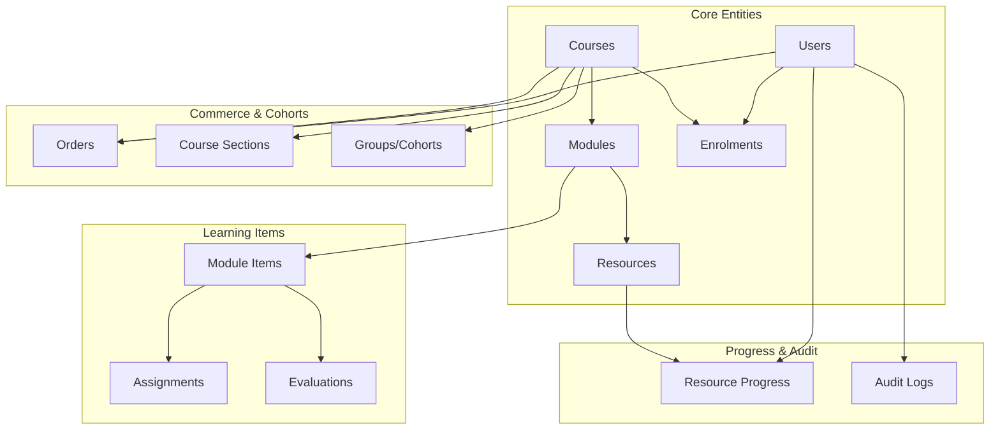
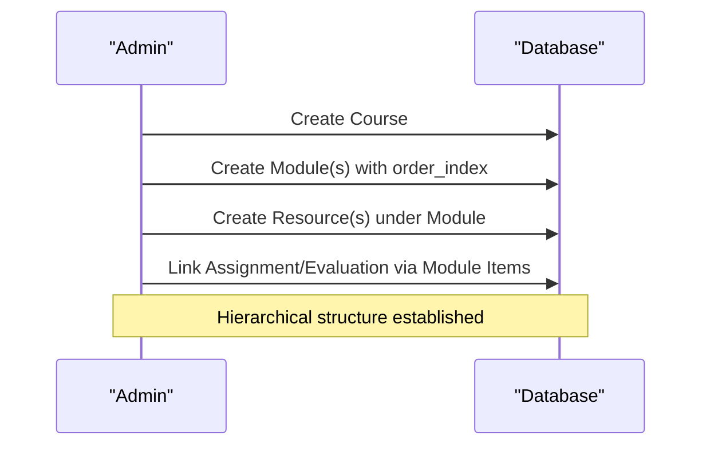
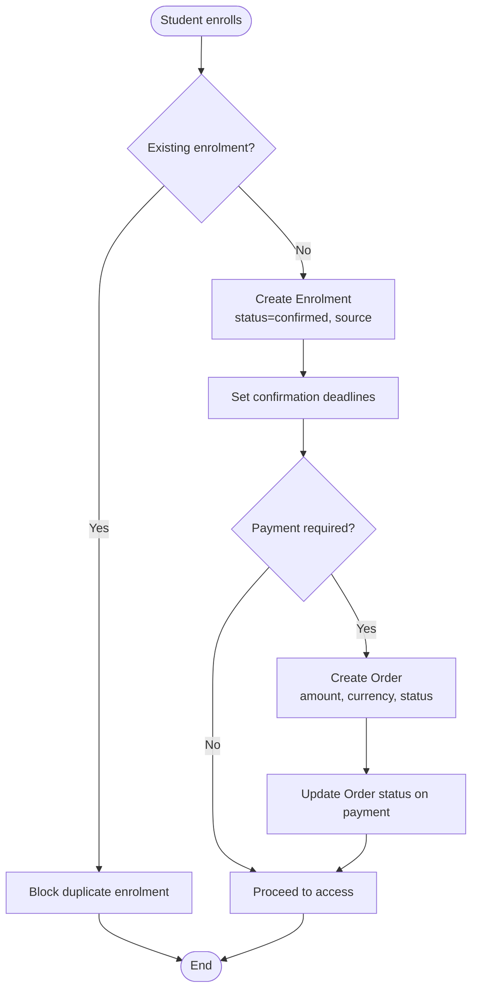
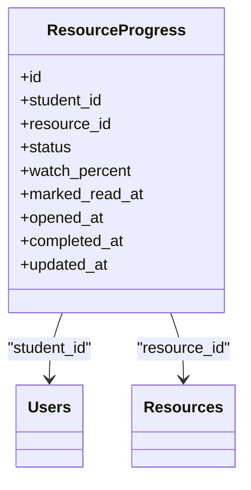
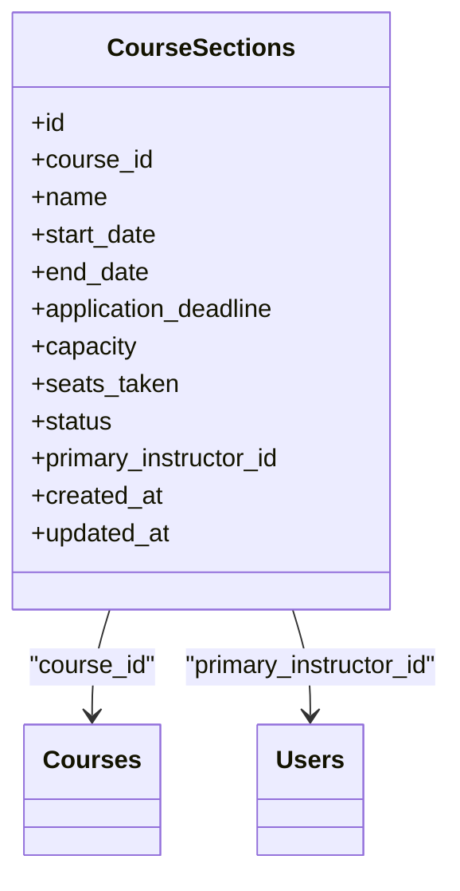
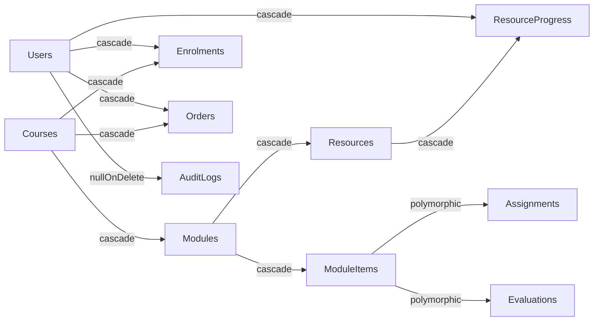

# Database Design

<cite>
**Referenced Files in This Document**
- [0001_01_01_000000_create_users_table.php](file://database/migrations/0001_01_01_000000_create_users_table.php)
- [2024_01_01_000020_create_categories_table.php](file://database/migrations/2024_01_01_000020_create_categories_table.php)
- [2024_01_01_000030_create_courses_table.php](file://database/migrations/2024_01_01_000030_create_courses_table.php)
- [2024_01_01_000060_create_enrolments_table.php](file://database/migrations/2024_01_01_000060_create_enrolments_table.php)
- [2024_01_01_000070_create_orders_table.php](file://database/migrations/2024_01_01_000070_create_orders_table.php)
- [2024_01_01_000080_create_groups_cohorts_table.php](file://database/migrations/2024_01_01_000080_create_groups_cohorts_table.php)
- [2024_01_01_000100_create_modules_table.php](file://database/migrations/2024_01_01_000100_create_modules_table.php)
- [2024_01_01_000120_create_resources_table.php](file://database/migrations/2024_01_01_000120_create_resources_table.php)
- [2024_01_01_000132_create_assignments_table.php](file://database/migrations/2024_01_01_000132_create_assignments_table.php)
- [2024_01_01_000143_create_evaluations_table.php](file://database/migrations/2024_01_01_000143_create_evaluations_table.php)
- [2024_01_01_000150_create_module_items_table.php](file://database/migrations/2024_01_01_000150_create_module_items_table.php)
- [2024_01_01_000151_create_resource_progress_table.php](file://database/migrations/2024_01_01_000151_create_resource_progress_table.php)
- [2024_01_01_000191_create_audit_logs_table.php](file://database/migrations/2024_01_01_000191_create_audit_logs_table.php)
- [2026_07_29_000000_add_deleted_at_to_modules_table.php](file://database/migrations/2026_07_29_000000_add_deleted_at_to_modules_table.php)
- [2026_08_10_010000_create_course_sections_table.php](file://database/migrations/2026_08_10_010000_create_course_sections_table.php)
</cite>

## Table of Contents
1. Introduction
2. Project Structure
3. Core Components
4. Architecture Overview
5. Detailed Component Analysis
6. Dependency Analysis
7. Performance Considerations
8. Troubleshooting Guide
9. Conclusion
10. Appendices

## Introduction
This document describes the ResNet Academy database design with a focus on the core entities Course, Module, Resource, Enrolment, and User, and their relationships. It explains the hierarchical course structure (Course → Module → Resource), enrollment workflows, schema principles, indexing strategies, foreign key constraints, migration history and versioning, data validation rules enforced at the database level, business rules implemented via relationships, security considerations, soft deletes, and audit logging mechanisms.

## Project Structure
The database is defined using Laravel migrations under database/migrations. Each table has a dedicated migration file that defines columns, types, indexes, and foreign keys. The project also includes factories and seeders for test data, but this document focuses on the schema and relationships.



**Diagram sources**
- [0001_01_01_000000_create_users_table.php:12-27](file://database/migrations/0001_01_01_000000_create_users_table.php#L12-L27)
- [2024_01_01_000030_create_courses_table.php:11-32](file://database/migrations/2024_01_01_000030_create_courses_table.php#L11-L32)
- [2024_01_01_000100_create_modules_table.php:11-22](file://database/migrations/2024_01_01_000100_create_modules_table.php#L11-L22)
- [2024_01_01_000120_create_resources_table.php:11-20](file://database/migrations/2024_01_01_000120_create_resources_table.php#L11-L20)
- [2024_01_01_000060_create_enrolments_table.php:11-29](file://database/migrations/2024_01_01_000060_create_enrolments_table.php#L11-L29)
- [2024_01_01_000150_create_module_items_table.php:11-22](file://database/migrations/2024_01_01_000150_create_module_items_table.php#L11-L22)
- [2024_01_01_000132_create_assignments_table.php:11-25](file://database/migrations/2024_01_01_000132_create_assignments_table.php#L11-L25)
- [2024_01_01_000143_create_evaluations_table.php:11-26](file://database/migrations/2024_01_01_000143_create_evaluations_table.php#L11-L26)
- [2024_01_01_000151_create_resource_progress_table.php:11-24](file://database/migrations/2024_01_01_000151_create_resource_progress_table.php#L11-L24)
- [2024_01_01_000191_create_audit_logs_table.php:11-23](file://database/migrations/2024_01_01_000191_create_audit_logs_table.php#L11-L23)
- [2024_01_01_000070_create_orders_table.php:11-27](file://database/migrations/2024_01_01_000070_create_orders_table.php#L11-L27)
- [2026_08_10_010000_create_course_sections_table.php:16-32](file://database/migrations/2026_08_10_010000_create_course_sections_table.php#L16-L32)
- [2024_01_01_000080_create_groups_cohorts_table.php:11-19](file://database/migrations/2024_01_01_000080_create_groups_cohorts_table.php#L11-L19)

**Section sources**
- [0001_01_01_000000_create_users_table.php:12-27](file://database/migrations/0001_01_01_000000_create_users_table.php#L12-L27)
- [2024_01_01_000030_create_courses_table.php:11-32](file://database/migrations/2024_01_01_000030_create_courses_table.php#L11-L32)
- [2024_01_01_000100_create_modules_table.php:11-22](file://database/migrations/2024_01_01_000100_create_modules_table.php#L11-L22)
- [2024_01_01_000120_create_resources_table.php:11-20](file://database/migrations/2024_01_01_000120_create_resources_table.php#L11-L20)
- [2024_01_01_000060_create_enrolments_table.php:11-29](file://database/migrations/2024_01_01_000060_create_enrolments_table.php#L11-L29)

## Core Components
- Users: Identity and roles for students, instructors, and admins. Includes email uniqueness, status, and timestamps.
- Categories: Hierarchical taxonomy for courses with parent references and unique slugs.
- Courses: Core learning product with title, slug, description, level, price/currency, status, versioning, confirmation delay, schedule start date, and creator reference.
- Modules: Ordered units within a course with optional scheduled availability and sequential order index.
- Resources: Content items attached to modules with typed polymorphic-like storage via type enum.
- Module Items: Links modules to assignments or evaluations alongside resources, enabling mixed module content and ordering.
- Enrolments: Student-to-course enrollments with source tracking, confirmation timing, and uniqueness per student/course.
- Orders: Payment records tied to students, courses, and optionally enrolments.
- Course Sections: Scheduled runs of a course with capacity management and instructor assignment.
- Groups/Cohorts: Optional grouping of learners within a course context.
- Resource Progress: Per-student progress tracking for resources with completion criteria.
- Audit Logs: Immutable record of actions with actor, entity, and metadata.

**Section sources**
- [0001_01_01_000000_create_users_table.php:12-27](file://database/migrations/0001_01_01_000000_create_users_table.php#L12-L27)
- [2024_01_01_000020_create_categories_table.php:11-20](file://database/migrations/2024_01_01_000020_create_categories_table.php#L11-L20)
- [2024_01_01_000030_create_courses_table.php:11-32](file://database/migrations/2024_01_01_000030_create_courses_table.php#L11-L32)
- [2024_01_01_000100_create_modules_table.php:11-22](file://database/migrations/2024_01_01_000100_create_modules_table.php#L11-L22)
- [2024_01_01_000120_create_resources_table.php:11-20](file://database/migrations/2024_01_01_000120_create_resources_table.php#L11-L20)
- [2024_01_01_000150_create_module_items_table.php:11-22](file://database/migrations/2024_01_01_000150_create_module_items_table.php#L11-L22)
- [2024_01_01_000060_create_enrolments_table.php:11-29](file://database/migrations/2024_01_01_000060_create_enrolments_table.php#L11-L29)
- [2024_01_01_000070_create_orders_table.php:11-27](file://database/migrations/2024_01_01_000070_create_orders_table.php#L11-L27)
- [2026_08_10_010000_create_course_sections_table.php:16-32](file://database/migrations/2026_08_10_010000_create_course_sections_table.php#L16-L32)
- [2024_01_01_000080_create_groups_cohorts_table.php:11-19](file://database/migrations/2024_01_01_000080_create_groups_cohorts_table.php#L11-L19)
- [2024_01_01_000151_create_resource_progress_table.php:11-24](file://database/migrations/2024_01_01_000151_create_resource_progress_table.php#L11-L24)
- [2024_01_01_000191_create_audit_logs_table.php:11-23](file://database/migrations/2024_01_01_000191_create_audit_logs_table.php#L11-L23)

## Architecture Overview
The data model centers around a strict hierarchy:
- Course contains multiple Modules.
- Module contains multiple Resources and can include Assignments/Evaluations via Module Items.
- Students (Users) are linked to Courses through Enrolments.
- Resource usage and completion are tracked per student in Resource Progress.
- Payments are recorded as Orders associated with Students and Courses.
- Course Sections represent time-bound cohorts of a Course.
- Audit Logs capture system and user actions across entities.

```mermaid
erDiagram
USERS {
bigint id PK
enum role
string name
string email UK
string password_hash
string phone
string avatar_url
enum status
timestamp email_verified_at
timestamp last_login_at
timestamp created_at
timestamp updated_at
}
CATEGORIES {
bigint id PK
string name
string slug UK
bigint parent_id FK
timestamp created_at
}
COURSES {
bigint id PK
bigint category_id FK
string title
string slug UK
text description
enum level
string thumbnail_url
text prerequisites_text
decimal price
char currency
enum status
unsigned int current_version
unsigned int confirmation_delay_hours
date schedule_start_date
bigint created_by FK
timestamp created_at
timestamp updated_at
}
MODULES {
bigint id PK
bigint course_id FK
string title
text description
unsigned int order_index
datetime scheduled_start_at
timestamp created_at
timestamp updated_at
timestamp deleted_at
}
RESOURCES {
bigint id PK
bigint module_id FK
enum type
string title
text description
timestamp created_at
timestamp updated_at
}
MODULE_ITEMS {
bigint id PK
bigint module_id FK
enum item_type
unsigned bigint item_id
unsigned int order_index
boolean is_required
}
ASSIGNMENTS {
bigint id PK
bigint module_id FK
string title
text instructions
enum submission_type
datetime due_at
boolean allow_late
bigint late_penalty_policy_id FK
decimal max_score
boolean plagiarism_check_enabled
timestamp created_at
timestamp updated_at
}
EVALUATIONS {
bigint id PK
bigint module_id FK
string title
text description
decimal pass_score
unsigned int max_attempts
unsigned int time_limit_minutes
boolean randomize_questions
unsigned int questions_per_attempt
datetime available_from
datetime available_until
timestamp created_at
timestamp updated_at
}
ENROLMENTS {
bigint id PK
bigint student_id FK
bigint course_id FK
enum status
enum source
bigint imported_by FK
timestamp applied_at
datetime confirmation_email_due_at
datetime confirmation_email_sent_at
timestamp created_at
}
ORDERS {
bigint id PK
bigint student_id FK
bigint course_id FK
bigint enrolment_id FK
decimal amount
char currency
enum status
string payment_method
string provider_ref
datetime paid_at
timestamp created_at
}
COURSE_SECTIONS {
bigint id PK
bigint course_id FK
string name
date start_date
date end_date
date application_deadline
int capacity
int seats_taken
enum status
bigint primary_instructor_id FK
timestamp created_at
timestamp updated_at
}
GROUPS_COHORTS {
bigint id PK
bigint course_id FK
string name
text description
timestamp created_at
}
RESOURCE_PROGRESS {
bigint id PK
bigint student_id FK
bigint resource_id FK
enum status
decimal watch_percent
datetime marked_read_at
datetime opened_at
datetime completed_at
timestamp updated_at
}
AUDIT_LOGS {
bigint id PK
bigint actor_id FK
string action
string entity_type
unsigned bigint entity_id
json meta
timestamp created_at
}
USERS ||--o{ ENROLMENTS : "enrolled"
COURSES ||--o{ ENROLMENTS : "has"
COURSES ||--o{ MODULES : "contains"
MODULES ||--o{ RESOURCES : "contains"
MODULES ||--o{ MODULE_ITEMS : "includes"
MODULE_ITEMS }o--|| ASSIGNMENTS : "links"
MODULE_ITEMS }o--|| EVALUATIONS : "links"
USERS ||--o{ RESOURCE_PROGRESS : "tracks"
RESOURCES ||--o{ RESOURCE_PROGRESS : "tracked"
USERS ||--o{ ORDERS : "places"
COURSES ||--o{ ORDERS : "receives"
COURSES ||--o{ COURSE_SECTIONS : "runs"
COURSES ||--o{ GROUPS_COHORTS : "groups"
USERS ||--o{ AUDIT_LOGS : "performs"
```

**Diagram sources**
- [0001_01_01_000000_create_users_table.php:12-27](file://database/migrations/0001_01_01_000000_create_users_table.php#L12-L27)
- [2024_01_01_000020_create_categories_table.php:11-20](file://database/migrations/2024_01_01_000020_create_categories_table.php#L11-L20)
- [2024_01_01_000030_create_courses_table.php:11-32](file://database/migrations/2024_01_01_000030_create_courses_table.php#L11-L32)
- [2024_01_01_000100_create_modules_table.php:11-22](file://database/migrations/2024_01_01_000100_create_modules_table.php#L11-L22)
- [2024_01_01_000120_create_resources_table.php:11-20](file://database/migrations/2024_01_01_000120_create_resources_table.php#L11-L20)
- [2024_01_01_000150_create_module_items_table.php:11-22](file://database/migrations/2024_01_01_000150_create_module_items_table.php#L11-L22)
- [2024_01_01_000132_create_assignments_table.php:11-25](file://database/migrations/2024_01_01_000132_create_assignments_table.php#L11-L25)
- [2024_01_01_000143_create_evaluations_table.php:11-26](file://database/migrations/2024_01_01_000143_create_evaluations_table.php#L11-L26)
- [2024_01_01_000060_create_enrolments_table.php:11-29](file://database/migrations/2024_01_01_000060_create_enrolments_table.php#L11-L29)
- [2024_01_01_000070_create_orders_table.php:11-27](file://database/migrations/2024_01_01_000070_create_orders_table.php#L11-L27)
- [2026_08_10_010000_create_course_sections_table.php:16-32](file://database/migrations/2026_08_10_010000_create_course_sections_table.php#L16-L32)
- [2024_01_01_000080_create_groups_cohorts_table.php:11-19](file://database/migrations/2024_01_01_000080_create_groups_cohorts_table.php#L11-L19)
- [2024_01_01_000151_create_resource_progress_table.php:11-24](file://database/migrations/2024_01_01_000151_create_resource_progress_table.php#L11-L24)
- [2024_01_01_000191_create_audit_logs_table.php:11-23](file://database/migrations/2024_01_01_000191_create_audit_logs_table.php#L11-L23)

## Detailed Component Analysis

### Course → Module → Resource Hierarchy
- Courses contain Modules ordered by order_index and optionally gated by scheduled_start_at.
- Modules contain Resources identified by type; additional learning items (assignments, evaluations) are linked via Module Items.
- Module Items enforce required vs optional participation and maintain sequence.



**Diagram sources**
- [2024_01_01_000030_create_courses_table.php:11-32](file://database/migrations/2024_01_01_000030_create_courses_table.php#L11-L32)
- [2024_01_01_000100_create_modules_table.php:11-22](file://database/migrations/2024_01_01_000100_create_modules_table.php#L11-L22)
- [2024_01_01_000120_create_resources_table.php:11-20](file://database/migrations/2024_01_01_000120_create_resources_table.php#L11-L20)
- [2024_01_01_000150_create_module_items_table.php:11-22](file://database/migrations/2024_01_01_000150_create_module_items_table.php#L11-L22)

**Section sources**
- [2024_01_01_000030_create_courses_table.php:11-32](file://database/migrations/2024_01_01_000030_create_courses_table.php#L11-L32)
- [2024_01_01_000100_create_modules_table.php:11-22](file://database/migrations/2024_01_01_000100_create_modules_table.php#L11-L22)
- [2024_01_01_000120_create_resources_table.php:11-20](file://database/migrations/2024_01_01_000120_create_resources_table.php#L11-L20)
- [2024_01_01_000150_create_module_items_table.php:11-22](file://database/migrations/2024_01_01_000150_create_module_items_table.php#L11-L22)

### Enrollment Workflow
- Students enroll in Courses via Enrolments with source tracking and confirmation scheduling.
- Uniqueness constraint prevents duplicate enrollments per student/course.
- Orders may be created to record payments and can optionally link to an enrolment.



**Diagram sources**
- [2024_01_01_000060_create_enrolments_table.php:11-29](file://database/migrations/2024_01_01_000060_create_enrolments_table.php#L11-L29)
- [2024_01_01_000070_create_orders_table.php:11-27](file://database/migrations/2024_01_01_000070_create_orders_table.php#L11-L27)

**Section sources**
- [2024_01_01_000060_create_enrolments_table.php:11-29](file://database/migrations/2024_01_01_000060_create_enrolments_table.php#L11-L29)
- [2024_01_01_000070_create_orders_table.php:11-27](file://database/migrations/2024_01_01_000070_create_orders_table.php#L11-L27)

### Resource Progress Tracking
- Per-student progress per resource tracks status, completion thresholds, and timestamps for different resource types.
- Unique constraint ensures one progress record per student/resource pair.



**Diagram sources**
- [2024_01_01_000151_create_resource_progress_table.php:11-24](file://database/migrations/2024_01_01_000151_create_resource_progress_table.php#L11-L24)
- [0001_01_01_000000_create_users_table.php:12-27](file://database/migrations/0001_01_01_000000_create_users_table.php#L12-L27)
- [2024_01_01_000120_create_resources_table.php:11-20](file://database/migrations/2024_01_01_000120_create_resources_table.php#L11-L20)

**Section sources**
- [2024_01_01_000151_create_resource_progress_table.php:11-24](file://database/migrations/2024_01_01_000151_create_resource_progress_table.php#L11-L24)

### Course Sections (Cohorts)
- Course Sections define scheduled runs with capacity limits, statuses, and primary instructor linkage.
- Useful for cohort-based delivery and seat management.



**Diagram sources**
- [2026_08_10_010000_create_course_sections_table.php:16-32](file://database/migrations/2026_08_10_010000_create_course_sections_table.php#L16-L32)
- [2024_01_01_000030_create_courses_table.php:11-32](file://database/migrations/2024_01_01_000030_create_courses_table.php#L11-L32)
- [0001_01_01_000000_create_users_table.php:12-27](file://database/migrations/0001_01_01_000000_create_users_table.php#L12-L27)

**Section sources**
- [2026_08_10_010000_create_course_sections_table.php:16-32](file://database/migrations/2026_08_10_010000_create_course_sections_table.php#L16-L32)

## Dependency Analysis
- Foreign Key Constraints:
  - Modules cascade delete on course deletion.
  - Resources cascade delete on module deletion.
  - Enrolments cascade delete on student/course deletion.
  - Orders cascade delete on student/course/enrolment deletion.
  - Module Items cascade delete on module deletion.
  - Assignments/Evaluations cascade delete on module deletion.
  - Resource Progress cascade delete on student/resource deletion.
  - Audit Logs use null-on-delete for actor to preserve logs when users are removed.
- Indexes:
  - Courses: unique slug, status index.
  - Modules: composite index on course_id and order_index.
  - Enrolments: unique student+course, course index.
  - Orders: student and course indexes.
  - Resource Progress: unique student+resource.
  - Audit Logs: index on entity_type+entity_id.
  - Categories: unique slug.



**Diagram sources**
- [2024_01_01_000100_create_modules_table.php:11-22](file://database/migrations/2024_01_01_000100_create_modules_table.php#L11-L22)
- [2024_01_01_000120_create_resources_table.php:11-20](file://database/migrations/2024_01_01_000120_create_resources_table.php#L11-L20)
- [2024_01_01_000150_create_module_items_table.php:11-22](file://database/migrations/2024_01_01_000150_create_module_items_table.php#L11-L22)
- [2024_01_01_000132_create_assignments_table.php:11-25](file://database/migrations/2024_01_01_000132_create_assignments_table.php#L11-L25)
- [2024_01_01_000143_create_evaluations_table.php:11-26](file://database/migrations/2024_01_01_000143_create_evaluations_table.php#L11-L26)
- [2024_01_01_000060_create_enrolments_table.php:11-29](file://database/migrations/2024_01_01_000060_create_enrolments_table.php#L11-L29)
- [2024_01_01_000070_create_orders_table.php:11-27](file://database/migrations/2024_01_01_000070_create_orders_table.php#L11-L27)
- [2024_01_01_000151_create_resource_progress_table.php:11-24](file://database/migrations/2024_01_01_000151_create_resource_progress_table.php#L11-L24)
- [2024_01_01_000191_create_audit_logs_table.php:11-23](file://database/migrations/2024_01_01_000191_create_audit_logs_table.php#L11-L23)

**Section sources**
- [2024_01_01_000100_create_modules_table.php:11-22](file://database/migrations/2024_01_01_000100_create_modules_table.php#L11-L22)
- [2024_01_01_000120_create_resources_table.php:11-20](file://database/migrations/2024_01_01_000120_create_resources_table.php#L11-L20)
- [2024_01_01_000150_create_module_items_table.php:11-22](file://database/migrations/2024_01_01_000150_create_module_items_table.php#L11-L22)
- [2024_01_01_000060_create_enrolments_table.php:11-29](file://database/migrations/2024_01_01_000060_create_enrolments_table.php#L11-L29)
- [2024_01_01_000070_create_orders_table.php:11-27](file://database/migrations/2024_01_01_000070_create_orders_table.php#L11-L27)
- [2024_01_01_000151_create_resource_progress_table.php:11-24](file://database/migrations/2024_01_01_000151_create_resource_progress_table.php#L11-L24)
- [2024_01_01_000191_create_audit_logs_table.php:11-23](file://database/migrations/2024_01_01_000191_create_audit_logs_table.php#L11-L23)

## Performance Considerations
- Use composite indexes for frequent queries:
  - Modules: course_id + order_index for sequential unlocking and listing.
  - Enrolments: course_id for course-centric queries; unique student+course for fast lookups.
  - Orders: student_id and course_id for reporting and reconciliation.
  - Resource Progress: unique student+resource for quick per-user progress checks.
  - Audit Logs: entity_type + entity_id for entity-centric audit retrieval.
- Enum fields reduce storage and improve query performance compared to free-text flags.
- Soft deletes on Modules avoid heavy cascading deletes and support purging jobs.
- Keep large text fields (descriptions) separate if needed for read-heavy workloads.

[No sources needed since this section provides general guidance]

## Troubleshooting Guide
- Duplicate Enrolments:
  - Symptom: Attempt to create enrolment fails due to unique constraint on student_id + course_id.
  - Resolution: Check existing enrolments before creating new ones; handle conflicts gracefully.
- Missing Prerequisites:
  - Courses store prerequisites_text for informational purposes; ensure application logic enforces prerequisites based on module unlocks and schedules.
- Module Availability:
  - Modules may be gated by order_index and scheduled_start_at; verify both conditions when granting access.
- Resource Completion Criteria:
  - Video completion uses watch_percent threshold; documents/readings use marked_read_at; external links use opened_at. Ensure updates align with these fields.
- Audit Log Integrity:
  - Actor_id may be NULL for automated actions; queries should account for system-generated entries.

**Section sources**
- [2024_01_01_000060_create_enrolments_table.php:11-29](file://database/migrations/2024_01_01_000060_create_enrolments_table.php#L11-L29)
- [2024_01_01_000030_create_courses_table.php:11-32](file://database/migrations/2024_01_01_000030_create_courses_table.php#L11-L32)
- [2024_01_01_000100_create_modules_table.php:11-22](file://database/migrations/2024_01_01_000100_create_modules_table.php#L11-L22)
- [2024_01_01_000151_create_resource_progress_table.php:11-24](file://database/migrations/2024_01_01_000151_create_resource_progress_table.php#L11-L24)
- [2024_01_01_000191_create_audit_logs_table.php:11-23](file://database/migrations/2024_01_01_000191_create_audit_logs_table.php#L11-L23)

## Conclusion
The ResNet Academy database implements a robust, scalable schema centered on a clear Course → Module → Resource hierarchy with strong referential integrity, thoughtful indexing, and comprehensive auditability. Enrollment workflows are constrained to prevent duplicates and support payment integration. Soft deletes and audit logs enable safe lifecycle management and traceability. Course Sections provide cohort-based delivery capabilities. Together, these elements form a solid foundation for learning management features while maintaining performance and data integrity.

[No sources needed since this section summarizes without analyzing specific files]

## Appendices

### Migration History and Version Management
- Migrations are timestamped and ordered, ensuring deterministic schema evolution.
- Additions such as soft deletes for Modules and course sections were introduced via dedicated migration files.
- Versioning strategy:
  - Use incremental timestamps for migration filenames.
  - Keep each change isolated in its own migration.
  - Maintain backward compatibility where possible; prefer additive changes (new columns, tables).
  - Use comments in migrations to explain rationale and feature references.

**Section sources**
- [2026_07_29_000000_add_deleted_at_to_modules_table.php:11-23](file://database/migrations/2026_07_29_000000_add_deleted_at_to_modules_table.php#L11-L23)
- [2026_08_10_010000_create_course_sections_table.php:16-32](file://database/migrations/2026_08_10_010000_create_course_sections_table.php#L16-L32)

### Data Validation Rules at Database Level
- Uniqueness:
  - Users.email unique.
  - Courses.slug unique.
  - Categories.slug unique.
  - Enrolments.student_id + course_id unique.
  - ResourceProgress.student_id + resource_id unique.
  - ModuleItems.item_type + item_id unique.
- Enums:
  - Users.role, status.
  - Courses.level, status.
  - Modules.scheduled_start_at gating.
  - Resources.type.
  - Enrolments.status, source.
  - Orders.status.
  - CourseSections.status.
  - ResourceProgress.status.
- Defaults and Constraints:
  - Prices and currencies standardized.
  - Confirmation delays configured per course.
  - Soft deletes on Modules for safe removal.

**Section sources**
- [0001_01_01_000000_create_users_table.php:12-27](file://database/migrations/0001_01_01_000000_create_users_table.php#L12-L27)
- [2024_01_01_000030_create_courses_table.php:11-32](file://database/migrations/2024_01_01_000030_create_courses_table.php#L11-L32)
- [2024_01_01_000020_create_categories_table.php:11-20](file://database/migrations/2024_01_01_000020_create_categories_table.php#L11-L20)
- [2024_01_01_000060_create_enrolments_table.php:11-29](file://database/migrations/2024_01_01_000060_create_enrolments_table.php#L11-L29)
- [2024_01_01_000151_create_resource_progress_table.php:11-24](file://database/migrations/2024_01_01_000151_create_resource_progress_table.php#L11-L24)
- [2024_01_01_000150_create_module_items_table.php:11-22](file://database/migrations/2024_01_01_000150_create_module_items_table.php#L11-L22)
- [2024_01_01_000070_create_orders_table.php:11-27](file://database/migrations/2024_01_01_000070_create_orders_table.php#L11-L27)
- [2026_08_10_010000_create_course_sections_table.php:16-32](file://database/migrations/2026_08_10_010000_create_course_sections_table.php#L16-L32)
- [2026_07_29_000000_add_deleted_at_to_modules_table.php:11-23](file://database/migrations/2026_07_29_000000_add_deleted_at_to_modules_table.php#L11-L23)

### Business Rules Implemented Through Relationships
- Sequential Unlocking:
  - Modules ordered by order_index; availability may be gated by scheduled_start_at.
- Required vs Optional Learning Items:
  - ModuleItems.is_required controls whether completion blocks module progression.
- Cohort Capacity:
  - CourseSections.capacity and seats_taken manage enrollment caps.
- Auditability:
  - AuditLogs capture actions with actor and entity references for traceability.

**Section sources**
- [2024_01_01_000100_create_modules_table.php:11-22](file://database/migrations/2024_01_01_000100_create_modules_table.php#L11-L22)
- [2024_01_01_000150_create_module_items_table.php:11-22](file://database/migrations/2024_01_01_000150_create_module_items_table.php#L11-L22)
- [2026_08_10_010000_create_course_sections_table.php:16-32](file://database/migrations/2026_08_10_010000_create_course_sections_table.php#L16-L32)
- [2024_01_01_000191_create_audit_logs_table.php:11-23](file://database/migrations/2024_01_01_000191_create_audit_logs_table.php#L11-L23)

### Security Considerations
- Access Control:
  - Enforce role-based permissions at the application layer; database-level constraints ensure referential integrity.
- Sensitive Data:
  - Passwords stored as hashes; avoid logging sensitive payloads in audit logs.
- Data Minimization:
  - Limit stored personal data to necessary fields; use nullable fields for optional profile information.
- Soft Deletes:
  - Modules support soft deletes to prevent accidental loss and enable recovery workflows.

**Section sources**
- [0001_01_01_000000_create_users_table.php:12-27](file://database/migrations/0001_01_01_000000_create_users_table.php#L12-L27)
- [2024_01_01_000191_create_audit_logs_table.php:11-23](file://database/migrations/2024_01_01_000191_create_audit_logs_table.php#L11-L23)
- [2026_07_29_000000_add_deleted_at_to_modules_table.php:11-23](file://database/migrations/2026_07_29_000000_add_deleted_at_to_modules_table.php#L11-L23)