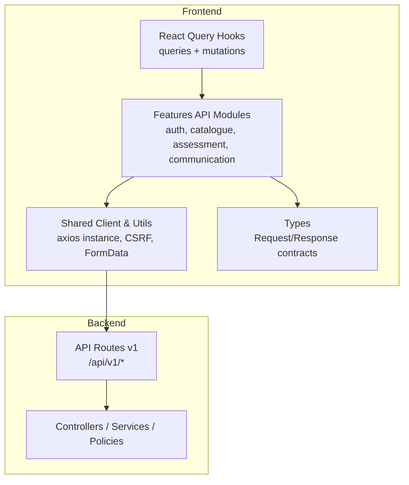
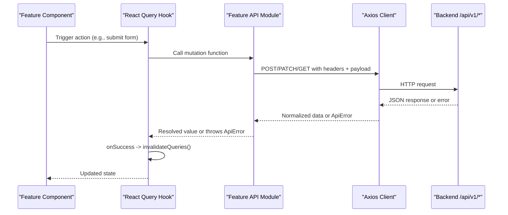
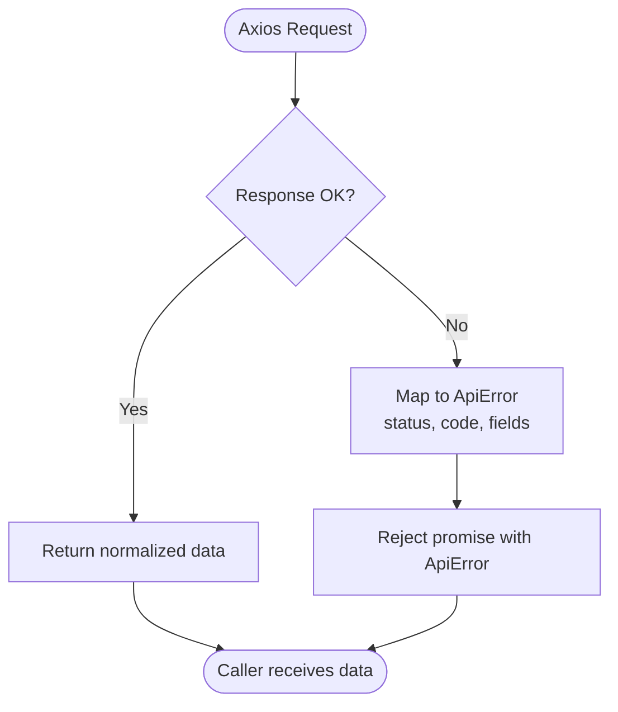
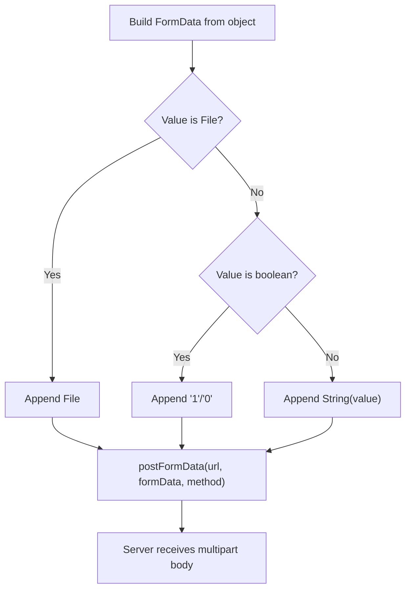
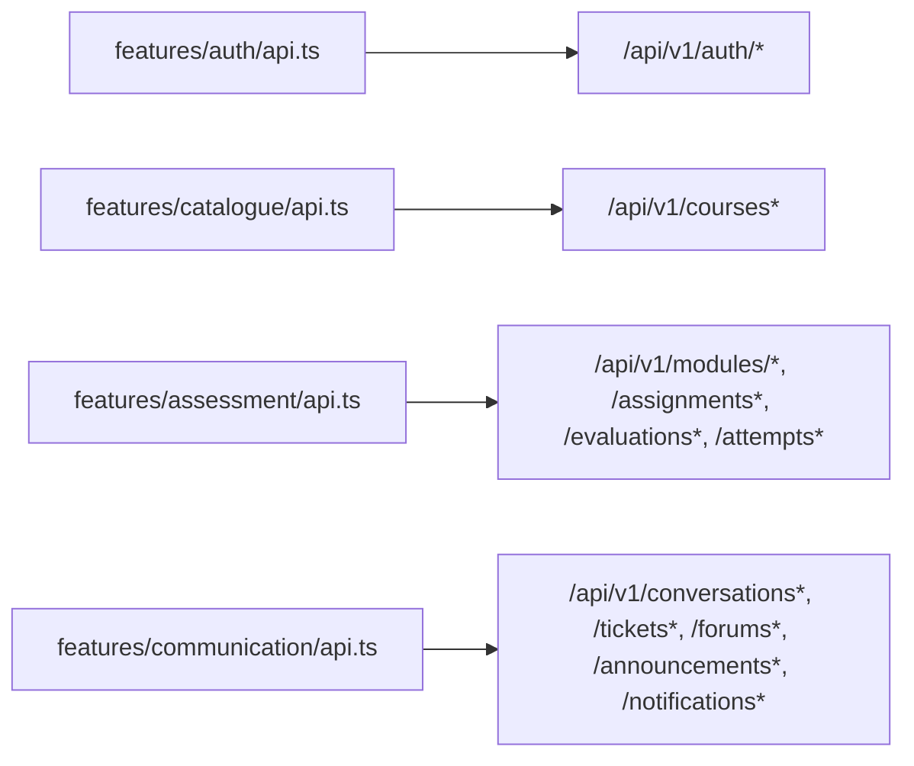
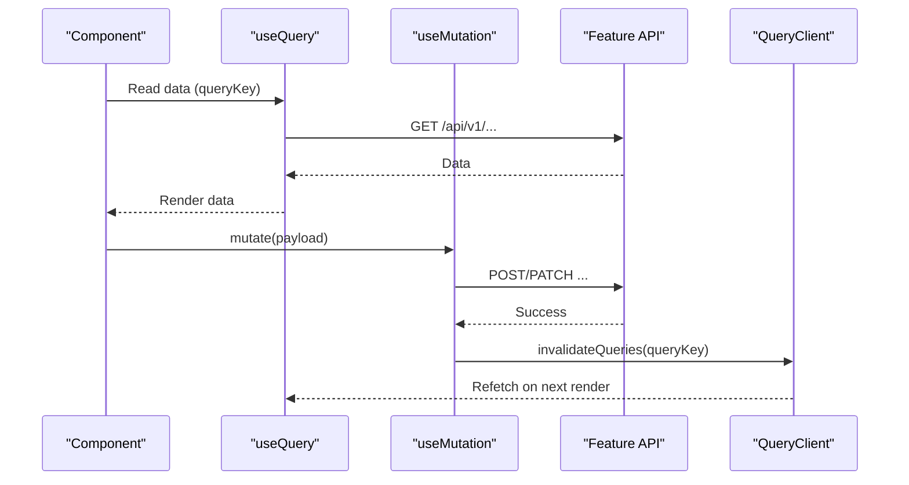
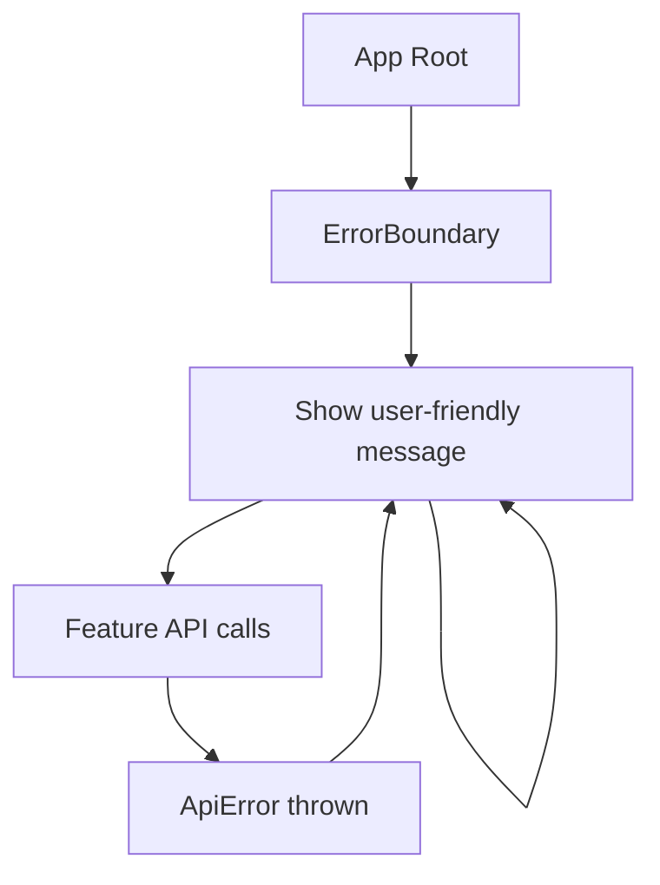
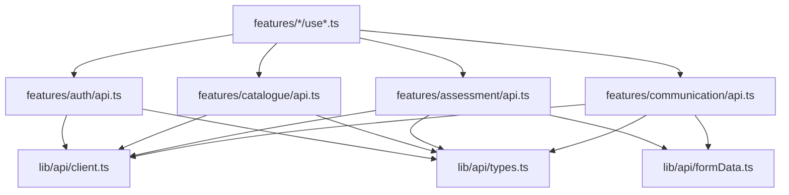

# API Integration Layer

<cite>
**Referenced Files in This Document**
- [client.ts](file://frontend/src/lib/api/client.ts)
- [formData.ts](file://frontend/src/lib/api/formData.ts)
- [types.ts](file://frontend/src/lib/api/types.ts)
- [api.php](file://routes/api.php)
- [auth api.ts](file://frontend/src/features/auth/api.ts)
- [account api.ts](file://frontend/src/features/account/api.ts)
- [catalogue api.ts](file://frontend/src/features/catalogue/api.ts)
- [assessment api.ts](file://frontend/src/features/assessment/api.ts)
- [communication api.ts](file://frontend/src/features/communication/api.ts)
- [main.tsx](file://frontend/src/main.tsx)
- [useAdminUsers.ts](file://frontend/src/features/admin/users/useAdminUsers.ts)
- [useCommunication.ts](file://frontend/src/features/communication/useCommunication.ts)
</cite>

## Table of Contents
1. [Introduction](#introduction)
2. [Project Structure](#project-structure)
3. [Core Components](#core-components)
4. [Architecture Overview](#architecture-overview)
5. [Detailed Component Analysis](#detailed-component-analysis)
6. [Dependency Analysis](#dependency-analysis)
7. [Performance Considerations](#performance-considerations)
8. [Troubleshooting Guide](#troubleshooting-guide)
9. [Conclusion](#conclusion)

## Introduction
This document explains the frontend API integration layer architecture for a feature-based application that communicates with a Laravel backend via a versioned REST API. Each feature owns its typed API client module, and data fetching/mutation is handled by React Query hooks. The system centralizes HTTP configuration, error normalization, CSRF handling, multipart uploads, and type-safe request/response contracts. It also covers patterns for CRUD operations, file uploads, real-time-like updates via cache invalidation, API versioning, error boundaries, and retry behavior.

## Project Structure
The frontend organizes API clients per feature under src/features/<feature>/api.ts, sharing a common HTTP client and utilities in src/lib/api. Backend routes are versioned under /api/v1 and grouped by domain (catalogue, assessment, communication, etc.).

**Diagram sources**
- [client.ts:6-13](file://frontend/src/lib/api/client.ts#L6-L13)
- [api.php:49-241](file://routes/api.php#L49-L241)

**Section sources**
- [client.ts:1-13](file://frontend/src/lib/api/client.ts#L1-L13)
- [api.php:49-241](file://routes/api.php#L49-L241)

## Core Components
- Typed API client: Centralized axios instance with base URL, credentials, and response interceptors that normalize errors into a custom ApiError.
- CSRF handling: Explicit cookie fetch before mutating requests to satisfy Sanctum SPA auth.
- Multipart upload helpers: Robust FormData builder and POST/PATCH helper for file uploads.
- Feature modules: Per-feature API functions with strongly-typed payloads and responses.
- React Query hooks: Queries and mutations encapsulate caching, refetching, and optimistic cache updates via invalidation.

**Section sources**
- [client.ts:15-68](file://frontend/src/lib/api/client.ts#L15-L68)
- [formData.ts:11-53](file://frontend/src/lib/api/formData.ts#L11-L53)
- [auth api.ts:6-61](file://frontend/src/features/auth/api.ts#L6-L61)
- [account api.ts:9-28](file://frontend/src/features/account/api.ts#L9-L28)
- [catalogue api.ts:14-31](file://frontend/src/features/catalogue/api.ts#L14-L31)
- [assessment api.ts:27-155](file://frontend/src/features/assessment/api.ts#L27-L155)
- [communication api.ts:21-239](file://frontend/src/features/communication/api.ts#L21-L239)

## Architecture Overview
The integration layer follows a layered pattern:
- Feature API modules call the shared axios client.
- Requests go through a single interceptor that converts Axios errors into domain-specific ApiError instances.
- Responses are unwrapped from the backend’s { data } envelope and typed via TypeScript interfaces.
- React Query manages state; mutations invalidate relevant query keys to keep UI consistent.

**Diagram sources**
- [client.ts:54-68](file://frontend/src/lib/api/client.ts#L54-L68)
- [assessment api.ts:116-155](file://frontend/src/features/assessment/api.ts#L116-L155)
- [useAdminUsers.ts:12-28](file://frontend/src/features/admin/users/useAdminUsers.ts#L12-L28)

## Detailed Component Analysis

### Shared HTTP Client and Error Handling
- Base URL: All requests target /api/v1 under the configured base URL.
- Credentials: Cookies enabled for session-based auth; XSRF token support enabled.
- CSRF seeding: ensureCsrfCookie fetches the Sanctum CSRF cookie once per page load before mutating requests.
- Error normalization: Response interceptor maps Axios errors to ApiError with status, code, message, and optional field errors.

**Diagram sources**
- [client.ts:54-68](file://frontend/src/lib/api/client.ts#L54-L68)

**Section sources**
- [client.ts:6-13](file://frontend/src/lib/api/client.ts#L6-L13)
- [client.ts:15-33](file://frontend/src/lib/api/client.ts#L15-L33)
- [client.ts:35-63](file://frontend/src/lib/api/client.ts#L35-L63)

### Multipart Uploads
- toFormData: Converts plain objects to FormData, safely handling File, boolean, null/undefined, and other primitives.
- postFormData: Sends multipart/form-data using axios request with explicit Content-Type header; supports both POST and PATCH.

**Diagram sources**
- [formData.ts:11-53](file://frontend/src/lib/api/formData.ts#L11-L53)

**Section sources**
- [formData.ts:11-53](file://frontend/src/lib/api/formData.ts#L11-L53)
- [account api.ts:9-12](file://frontend/src/features/account/api.ts#L9-L12)
- [assessment api.ts:116-133](file://frontend/src/features/assessment/api.ts#L116-L133)
- [communication api.ts:88-103](file://frontend/src/features/communication/api.ts#L88-L103)

### Feature API Modules (Typed Endpoints)
Each feature exposes typed functions aligned with backend routes:
- Auth: login, register, logout, password reset, email verification, current user fetch.
- Catalogue: list courses/categories, get course details, fetch modules.
- Assessment: assignments, submissions, evaluations, attempts, grading, gradebook.
- Communication: conversations, tickets, forums, announcements, notifications.

**Diagram sources**
- [api.php:52-241](file://routes/api.php#L52-L241)
- [auth api.ts:6-61](file://frontend/src/features/auth/api.ts#L6-L61)
- [catalogue api.ts:14-31](file://frontend/src/features/catalogue/api.ts#L14-L31)
- [assessment api.ts:27-204](file://frontend/src/features/assessment/api.ts#L27-L204)
- [communication api.ts:21-239](file://frontend/src/features/communication/api.ts#L21-L239)

**Section sources**
- [auth api.ts:6-61](file://frontend/src/features/auth/api.ts#L6-L61)
- [catalogue api.ts:14-31](file://frontend/src/features/catalogue/api.ts#L14-L31)
- [assessment api.ts:27-204](file://frontend/src/features/assessment/api.ts#L27-L204)
- [communication api.ts:21-239](file://frontend/src/features/communication/api.ts#L21-L239)
- [api.php:52-241](file://routes/api.php#L52-L241)

### React Query Hooks Pattern
Hooks encapsulate queries and mutations:
- Queries: useQuery with stable query keys; refetchOnWindowFocus disabled globally.
- Mutations: useMutation with mutationFn calling feature API functions; onSuccess invalidates related query keys to synchronize state.

**Diagram sources**
- [main.tsx:9-16](file://frontend/src/main.tsx#L9-L16)
- [useAdminUsers.ts:5-28](file://frontend/src/features/admin/users/useAdminUsers.ts#L5-L28)
- [useCommunication.ts:53-100](file://frontend/src/features/communication/useCommunication.ts#L53-L100)

**Section sources**
- [main.tsx:9-16](file://frontend/src/main.tsx#L9-L16)
- [useAdminUsers.ts:5-28](file://frontend/src/features/admin/users/useAdminUsers.ts#L5-L28)
- [useCommunication.ts:53-100](file://frontend/src/features/communication/useCommunication.ts#L53-L100)

### Real-Time-Like Updates via Cache Invalidation
Although not using WebSockets, the app achieves near-real-time UX by:
- Invalidating lists and detail queries after mutations (e.g., new messages, tickets, threads).
- Using granular query keys per resource to minimize unnecessary refetches.

Examples:
- Messaging: invalidate conversation list and specific conversation after sending a message.
- Tickets: invalidate ticket list and detail after replies.
- Forums: invalidate thread and posts when creating/updating.

**Section sources**
- [useCommunication.ts:53-100](file://frontend/src/features/communication/useCommunication.ts#L53-L100)
- [communication api.ts:45-70](file://frontend/src/features/communication/api.ts#L45-L70)
- [communication api.ts:146-193](file://frontend/src/features/communication/api.ts#L146-L193)

### API Versioning
All endpoints are prefixed with /api/v1, providing a clear contract boundary and enabling future evolution without breaking existing clients.

**Section sources**
- [api.php:49-241](file://routes/api.php#L49-L241)
- [client.ts:6-13](file://frontend/src/lib/api/client.ts#L6-L13)

### Error Boundaries and Global Error Handling
- Frontend error boundary: Catches render-time errors and displays a friendly fallback with reload option.
- Network/API errors: Normalized to ApiError with structured fields for UI display and validation feedback.

**Diagram sources**
- [main.tsx:18-46](file://frontend/src/main.tsx#L18-L46)
- [client.ts:54-68](file://frontend/src/lib/api/client.ts#L54-L68)

**Section sources**
- [main.tsx:18-46](file://frontend/src/main.tsx#L18-L46)
- [client.ts:35-63](file://frontend/src/lib/api/client.ts#L35-L63)

### Retry Mechanisms
- Global retry: React Query retries failed queries once by default.
- Mutation retries: Not set globally; rely on idempotency and manual retry if needed.
- CSRF: Ensured before first mutating request to avoid repeated failures due to missing tokens.

**Section sources**
- [main.tsx:9-16](file://frontend/src/main.tsx#L9-L16)
- [client.ts:15-33](file://frontend/src/lib/api/client.ts#L15-L33)

## Dependency Analysis
Feature API modules depend on:
- Shared client and utilities for HTTP and uploads.
- Type definitions for request/response contracts.
- React Query hooks for state synchronization and cache management.

**Diagram sources**
- [types.ts:1-653](file://frontend/src/lib/api/types.ts#L1-L653)
- [client.ts:1-13](file://frontend/src/lib/api/client.ts#L1-L13)
- [formData.ts:1-54](file://frontend/src/lib/api/formData.ts#L1-L54)
- [auth api.ts:1-61](file://frontend/src/features/auth/api.ts#L1-L61)
- [catalogue api.ts:1-33](file://frontend/src/features/catalogue/api.ts#L1-L33)
- [assessment api.ts:1-204](file://frontend/src/features/assessment/api.ts#L1-L204)
- [communication api.ts:1-240](file://frontend/src/features/communication/api.ts#L1-L240)

**Section sources**
- [types.ts:1-653](file://frontend/src/lib/api/types.ts#L1-L653)
- [client.ts:1-13](file://frontend/src/lib/api/client.ts#L1-L13)
- [formData.ts:1-54](file://frontend/src/lib/api/formData.ts#L1-L54)
- [auth api.ts:1-61](file://frontend/src/features/auth/api.ts#L1-L61)
- [catalogue api.ts:1-33](file://frontend/src/features/catalogue/api.ts#L1-L33)
- [assessment api.ts:1-204](file://frontend/src/features/assessment/api.ts#L1-L204)
- [communication api.ts:1-240](file://frontend/src/features/communication/api.ts#L1-L240)

## Performance Considerations
- Single axios instance reduces overhead and centralizes config.
- Disabled refetchOnWindowFocus avoids unnecessary network churn.
- Granular query keys enable targeted invalidations, minimizing re-renders.
- Multipart uploads use dedicated helpers to prevent redundant conversions and ensure correct content types.

[No sources needed since this section provides general guidance]

## Troubleshooting Guide
Common issues and resolutions:
- Authentication failures: Ensure ensureCsrfCookie is called before any mutating request (login/register/forgot-password/reset-password).
- Validation errors: ApiError includes field-level messages; map them to form fields for inline feedback.
- Upload failures: Verify toFormData usage and that postFormData sets multipart headers; confirm server accepts multipart PATCH where applicable.
- Stale data: After mutations, confirm corresponding query keys are invalidated to refresh UI.

**Section sources**
- [client.ts:15-33](file://frontend/src/lib/api/client.ts#L15-L33)
- [client.ts:54-68](file://frontend/src/lib/api/client.ts#L54-L68)
- [formData.ts:11-53](file://frontend/src/lib/api/formData.ts#L11-L53)
- [useCommunication.ts:53-100](file://frontend/src/features/communication/useCommunication.ts#L53-L100)

## Conclusion
The API integration layer combines a centralized HTTP client, robust error handling, typed contracts, and React Query-driven state synchronization. Feature-scoped API modules provide clean, maintainable endpoints for each domain, while hooks encapsulate data fetching and mutations with precise cache invalidation. Versioned routes and consistent patterns make the system scalable and easy to extend with new features.