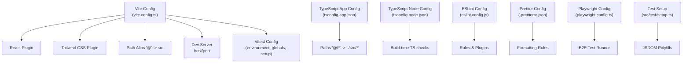
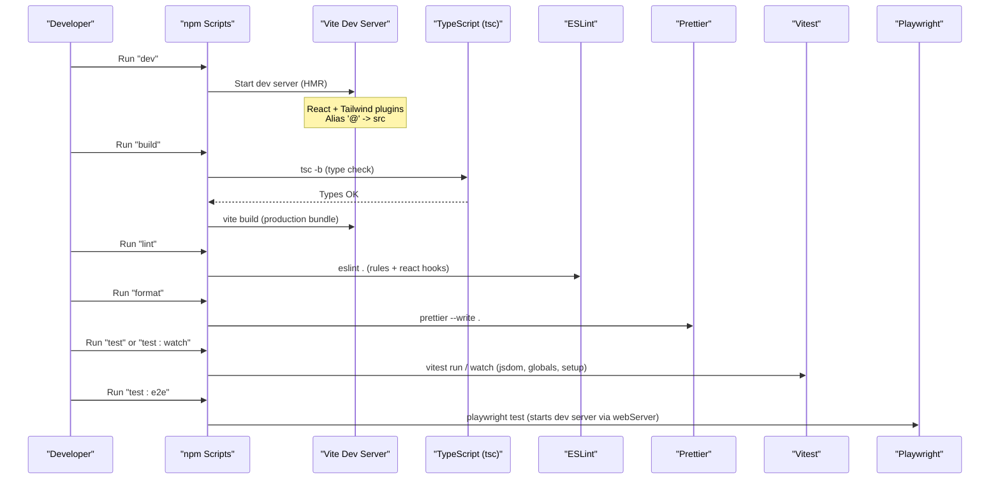
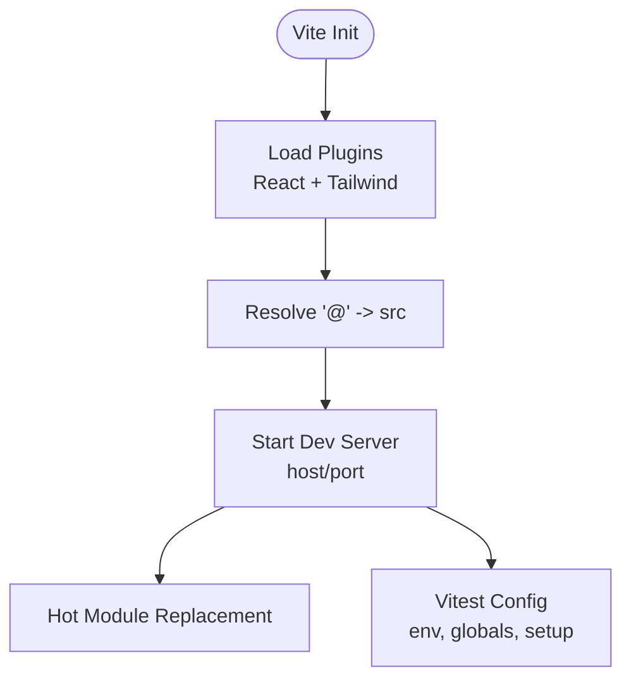
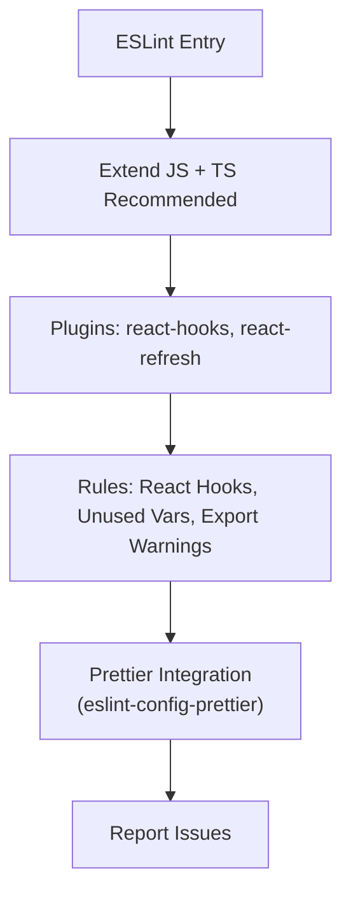
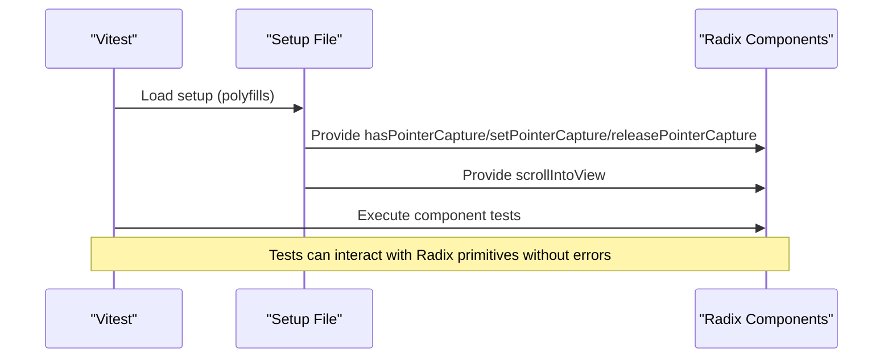
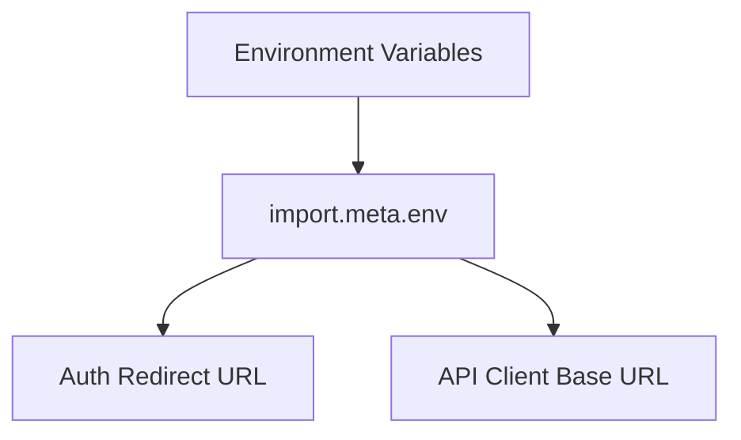
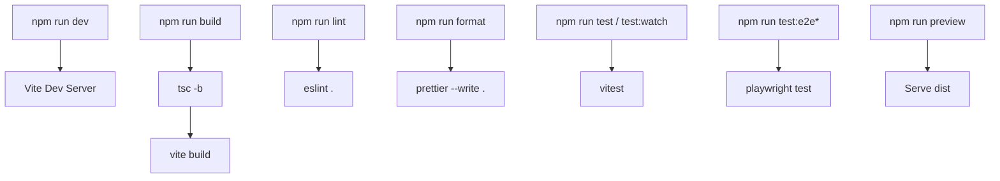
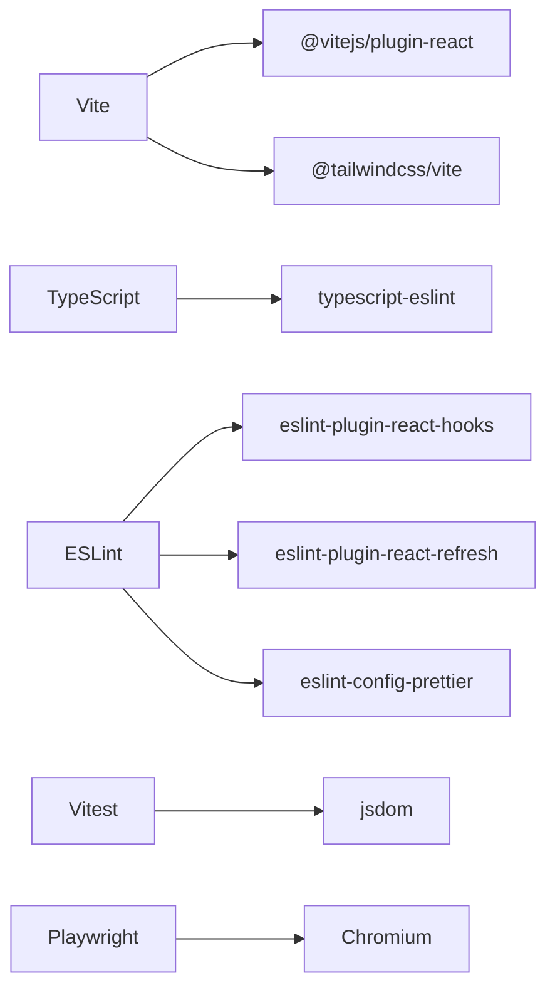

# Build Configuration & Tooling

<cite>
**Referenced Files in This Document**
- [vite.config.ts](file://frontend/vite.config.ts)
- [package.json](file://frontend/package.json)
- [tsconfig.json](file://frontend/tsconfig.json)
- [tsconfig.app.json](file://frontend/tsconfig.app.json)
- [tsconfig.node.json](file://frontend/tsconfig.node.json)
- [eslint.config.js](file://frontend/eslint.config.js)
- [.prettierrc.json](file://frontend/.prettierrc.json)
- [playwright.config.ts](file://frontend/playwright.config.ts)
- [setup.ts](file://frontend/src/test/setup.ts)
</cite>

## Table of Contents
1. [Introduction](#introduction)
2. [Project Structure](#project-structure)
3. [Core Components](#core-components)
4. [Architecture Overview](#architecture-overview)
5. [Detailed Component Analysis](#detailed-component-analysis)
6. [Dependency Analysis](#dependency-analysis)
7. [Performance Considerations](#performance-considerations)
8. [Troubleshooting Guide](#troubleshooting-guide)
9. [Conclusion](#conclusion)

## Introduction
This document explains the build configuration and development tooling for the frontend, focusing on Vite setup (plugins, aliases, dev server), TypeScript configuration (paths, type checking), code quality tools (Prettier, ESLint), testing (unit with Vitest, E2E with Playwright), environment variables usage, and the overall development workflow including hot module replacement and debugging.

## Project Structure
The frontend tooling is centered around:
- Vite as the build system and dev server
- TypeScript for type-safe development
- ESLint and Prettier for linting and formatting
- Vitest for unit tests
- Playwright for end-to-end tests



**Diagram sources**
- [vite.config.ts:1-29](file://frontend/vite.config.ts#L1-L29)
- [tsconfig.app.json:1-32](file://frontend/tsconfig.app.json#L1-L32)
- [tsconfig.node.json:1-24](file://frontend/tsconfig.node.json#L1-L24)
- [eslint.config.js:1-28](file://frontend/eslint.config.js#L1-L28)
- [.prettierrc.json:1-7](file://frontend/.prettierrc.json#L1-L7)
- [playwright.config.ts:1-49](file://frontend/playwright.config.ts#L1-L49)
- [setup.ts:1-24](file://frontend/src/test/setup.ts#L1-L24)

**Section sources**
- [vite.config.ts:1-29](file://frontend/vite.config.ts#L1-L29)
- [package.json:6-16](file://frontend/package.json#L6-L16)
- [tsconfig.json:1-5](file://frontend/tsconfig.json#L1-L5)

## Core Components
- Vite: Dev server, build pipeline, plugin chain, test runner integration
- TypeScript: App and Node project configs, path aliases, strictness flags
- ESLint + Prettier: Code quality and consistent formatting
- Vitest: Unit testing with jsdom environment and global setup
- Playwright: E2E testing with a local dev server lifecycle

**Section sources**
- [vite.config.ts:1-29](file://frontend/vite.config.ts#L1-L29)
- [tsconfig.app.json:1-32](file://frontend/tsconfig.app.json#L1-L32)
- [tsconfig.node.json:1-24](file://frontend/tsconfig.node.json#L1-L24)
- [eslint.config.js:1-28](file://frontend/eslint.config.js#L1-L28)
- [.prettierrc.json:1-7](file://frontend/.prettierrc.json#L1-L7)
- [playwright.config.ts:1-49](file://frontend/playwright.config.ts#L1-L49)
- [setup.ts:1-24](file://frontend/src/test/setup.ts#L1-L24)

## Architecture Overview
The development and build flow integrates multiple tools orchestrated by npm scripts and Vite:



**Diagram sources**
- [package.json:6-16](file://frontend/package.json#L6-L16)
- [vite.config.ts:1-29](file://frontend/vite.config.ts#L1-L29)
- [playwright.config.ts:41-48](file://frontend/playwright.config.ts#L41-L48)

**Section sources**
- [package.json:6-16](file://frontend/package.json#L6-L16)

## Detailed Component Analysis

### Vite Configuration
- Plugins: React and Tailwind CSS are enabled to support JSX/TSX and utility-first styling.
- Path alias: The alias "@" resolves to the src directory for cleaner imports.
- Dev server: Host set to localhost and port configured for local development.
- Testing integration: Vitest is configured with jsdom environment, global test APIs, a shared setup file, and forked workers with increased timeout for Windows environments.



**Diagram sources**
- [vite.config.ts:1-29](file://frontend/vite.config.ts#L1-L29)

**Section sources**
- [vite.config.ts:1-29](file://frontend/vite.config.ts#L1-L29)

### TypeScript Configuration
- Project references: Root tsconfig.json references app and node configs for separate compilation contexts.
- App config: Targets modern ES, includes DOM types, uses bundler module resolution, enables JSX transform, defines path alias "@/*", and enforces strict checks like no unused locals/parameters and switch fallthrough protection.
- Node config: Targets Node runtime for build-time scripts, disables emit, and applies similar strict checks.

```mermaid
classDiagram
class TSConfigRoot {
+references : ["tsconfig.app.json","tsconfig.node.json"]
}
class TSConfigApp {
+target : "es2023"
+lib : ["ES2023","DOM"]
+moduleResolution : "bundler"
+jsx : "react-jsx"
+paths : {"@/*" : "./src/*"}
+noUnusedLocals : true
+noUnusedParameters : true
+noFallthroughCasesInSwitch : true
}
class TSConfigNode {
+target : "es2023"
+lib : ["ES2023"]
+module : "nodenext"
+noEmit : true
+noUnusedLocals : true
+noUnusedParameters : true
+noFallthroughCasesInSwitch : true
}
TSConfigRoot --> TSConfigApp : "references"
TSConfigRoot --> TSConfigNode : "references"
```

**Diagram sources**
- [tsconfig.json:1-5](file://frontend/tsconfig.json#L1-L5)
- [tsconfig.app.json:1-32](file://frontend/tsconfig.app.json#L1-L32)
- [tsconfig.node.json:1-24](file://frontend/tsconfig.node.json#L1-L24)

**Section sources**
- [tsconfig.json:1-5](file://frontend/tsconfig.json#L1-L5)
- [tsconfig.app.json:1-32](file://frontend/tsconfig.app.json#L1-L32)
- [tsconfig.node.json:1-24](file://frontend/tsconfig.node.json#L1-L24)

### ESLint and Prettier
- ESLint: Uses recommended rules for JavaScript and TypeScript, integrates React Hooks and React Refresh plugins, and sets browser globals. It warns on non-constant exports from components and treats unused variables as errors while ignoring parameters prefixed with underscore.
- Prettier: Enforces single quotes, semicolons, 120-character print width, and trailing commas everywhere.



**Diagram sources**
- [eslint.config.js:1-28](file://frontend/eslint.config.js#L1-L28)
- [.prettierrc.json:1-7](file://frontend/.prettierrc.json#L1-L7)

**Section sources**
- [eslint.config.js:1-28](file://frontend/eslint.config.js#L1-L28)
- [.prettierrc.json:1-7](file://frontend/.prettierrc.json#L1-L7)

### Testing Setup (Unit and E2E)
- Unit tests (Vitest): jsdom environment, global test APIs, shared setup file that polyfills missing Pointer Events and scrollIntoView for Radix UI compatibility, and worker pool with extended timeout for Windows.
- E2E tests (Playwright): Runs tests in parallel, fails on CI if only tests remain, retries on CI, uses HTML reporter, targets Desktop Chrome, and starts the local dev server before running tests.



**Diagram sources**
- [vite.config.ts:19-28](file://frontend/vite.config.ts#L19-L28)
- [setup.ts:1-24](file://frontend/src/test/setup.ts#L1-L24)

**Section sources**
- [vite.config.ts:19-28](file://frontend/vite.config.ts#L19-L28)
- [setup.ts:1-24](file://frontend/src/test/setup.ts#L1-L24)
- [playwright.config.ts:1-49](file://frontend/playwright.config.ts#L1-L49)

### Environment Variables
- The application reads environment variables using import.meta.env, such as an API base URL used in authentication flows and API clients. These values are consumed at runtime by the built assets.



**Diagram sources**
- [setup.ts:1-24](file://frontend/src/test/setup.ts#L1-L24)

**Section sources**
- [setup.ts:1-24](file://frontend/src/test/setup.ts#L1-L24)

### Build Pipeline and Scripts
- Development: Starts the Vite dev server with HMR for fast feedback.
- Build: Runs TypeScript type checking across projects then builds optimized production assets with Vite.
- Lint and Format: Lints TypeScript files and formats code consistently.
- Tests: Executes unit tests (run/watch) and E2E tests (with optional UI/debug modes).
- Preview: Serves the built output locally to validate production behavior.



**Diagram sources**
- [package.json:6-16](file://frontend/package.json#L6-L16)

**Section sources**
- [package.json:6-16](file://frontend/package.json#L6-L16)

## Dependency Analysis
Key dependencies and their roles:
- Vite: Build system and dev server
- @vitejs/plugin-react: JSX/TSX support
- @tailwindcss/vite: Tailwind CSS processing
- TypeScript: Type checking and compilation
- ESLint + TypeScript ESLint: Linting
- Prettier + eslint-config-prettier: Formatting and rule conflict resolution
- Vitest + jsdom: Unit testing
- Playwright: End-to-end testing



**Diagram sources**
- [package.json:18-89](file://frontend/package.json#L18-L89)

**Section sources**
- [package.json:18-89](file://frontend/package.json#L18-L89)

## Performance Considerations
- Use TypeScript project references to incrementally type-check only changed projects.
- Keep the dev server host bound to localhost to avoid firewall prompts and ensure stable HMR.
- Enable Vitest’s forked workers to parallelize tests; adjust timeouts when needed for large dependency graphs.
- Avoid unnecessary re-renders in React components to keep HMR fast during development.
- For production builds, rely on Vite’s default optimizations; consider adding code splitting strategies in feature modules if needed.

[No sources needed since this section provides general guidance]

## Troubleshooting Guide
- HMR not updating: Ensure the dev server is running on the configured host/port and that your editor does not block file watchers.
- TypeScript errors blocking build: Run the type check step separately to isolate issues before building.
- ESLint conflicts with Prettier: Confirm eslint-config-prettier is included so Prettier overrides do not clash with ESLint rules.
- Tests failing due to missing APIs: Verify the test setup file is loaded and polyfills are applied for Pointer Events and scrollIntoView.
- E2E tests cannot connect: Confirm the dev server is reachable at the configured base URL and that Playwright’s webServer command is starting it correctly.

**Section sources**
- [vite.config.ts:15-28](file://frontend/vite.config.ts#L15-L28)
- [eslint.config.js:1-28](file://frontend/eslint.config.js#L1-L28)
- [playwright.config.ts:25-48](file://frontend/playwright.config.ts#L25-L48)
- [setup.ts:1-24](file://frontend/src/test/setup.ts#L1-L24)

## Conclusion
The frontend leverages a modern, cohesive toolchain: Vite for fast development and optimized builds, TypeScript for safety, ESLint and Prettier for code quality, and comprehensive testing with Vitest and Playwright. The configuration emphasizes clear path aliases, strict type checking, robust test environments, and smooth developer workflows with HMR and predictable build outputs.

[No sources needed since this section summarizes without analyzing specific files]