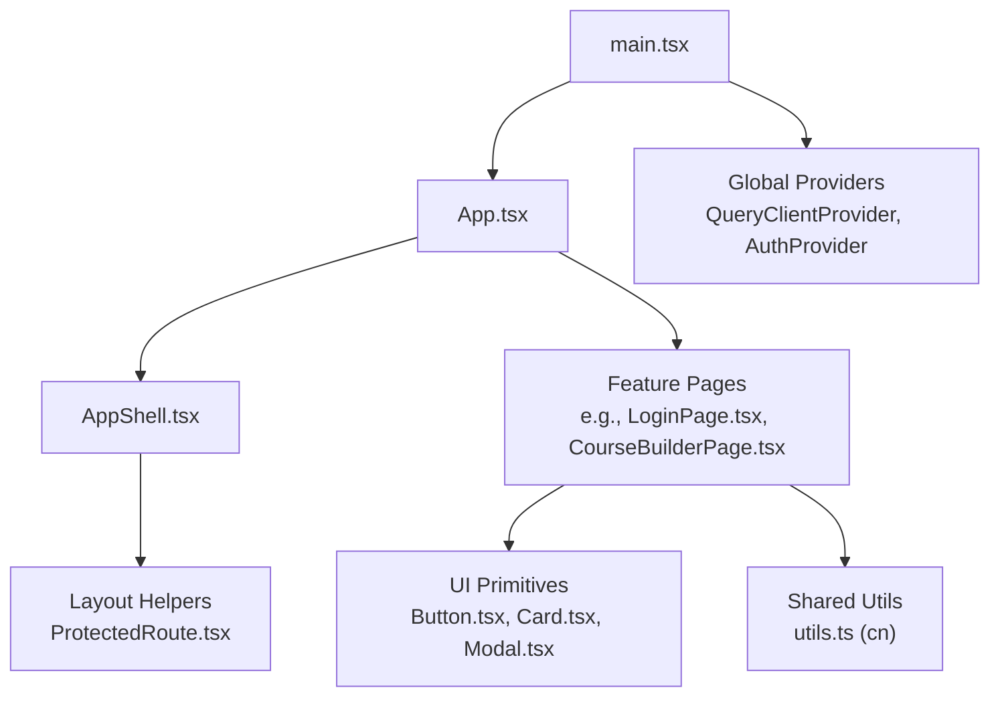
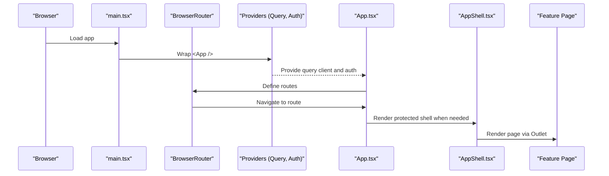
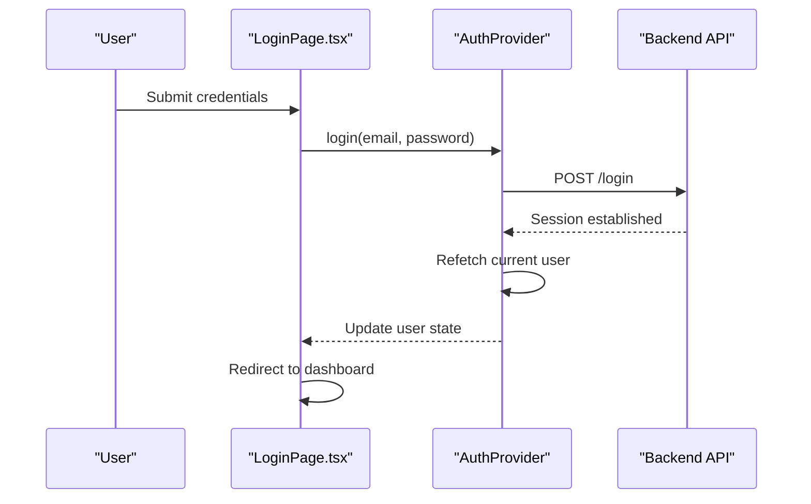
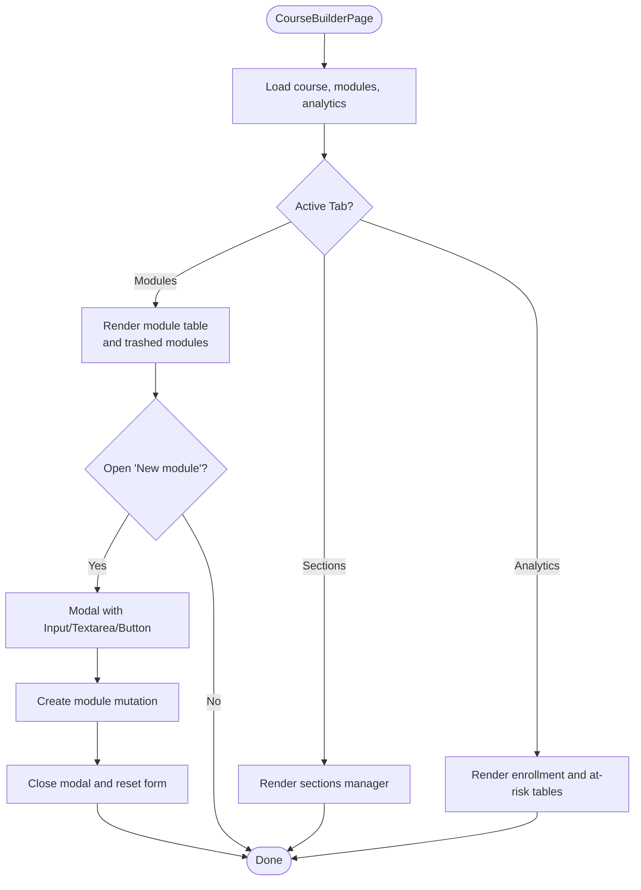
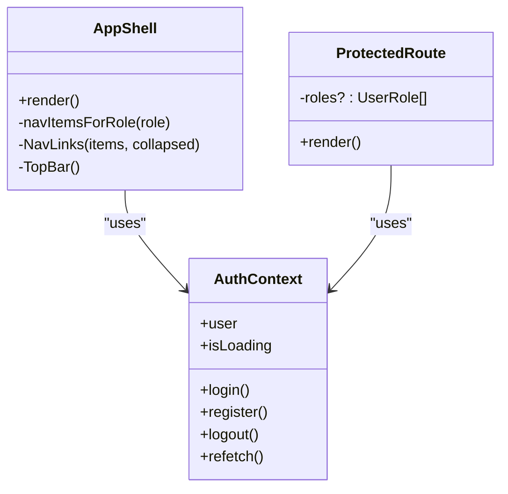
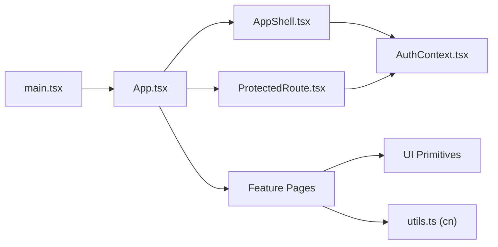

# Component Architecture

<cite>
**Referenced Files in This Document**
- [main.tsx](file://frontend/src/main.tsx)
- [App.tsx](file://frontend/src/App.tsx)
- [AuthContext.tsx](file://frontend/src/lib/auth/AuthContext.tsx)
- [ProtectedRoute.tsx](file://frontend/src/components/layout/ProtectedRoute.tsx)
- [AppShell.tsx](file://frontend/src/components/layout/AppShell.tsx)
- [Button.tsx](file://frontend/src/components/ui/Button.tsx)
- [Card.tsx](file://frontend/src/components/ui/Card.tsx)
- [Modal.tsx](file://frontend/src/components/ui/Modal.tsx)
- [LoginPage.tsx](file://frontend/src/features/auth/LoginPage.tsx)
- [CourseBuilderPage.tsx](file://frontend/src/features/courseStructure/CourseBuilderPage.tsx)
- [utils.ts](file://frontend/src/lib/utils.ts)
</cite>

## Table of Contents
1. Introduction
2. Project Structure
3. Core Components
4. Architecture Overview
5. Detailed Component Analysis
6. Dependency Analysis
7. Performance Considerations
8. Troubleshooting Guide
9. Conclusion

## Introduction
This document explains the React component architecture with a focus on feature-based organization and reusable UI primitives. The application is structured so that base UI components live under /components/ui, layout and routing helpers under /components/layout, and domain-specific features (auth, catalogue, assessment, communication, etc.) under /features. Pages are composed from these building blocks, communicate via props and context, and rely on shared utilities for styling and behavior.

## Project Structure
The frontend follows a layered, feature-driven structure:
- Entry and providers: main.tsx bootstraps the app with global providers (React Query, Router, Auth).
- Routing and shell: App.tsx defines routes; AppShell.tsx provides the authenticated shell with sidebar navigation and top bar.
- Base UI: /components/ui contains small, composable primitives (Button, Card, Modal, Input, etc.).
- Layout: /components/layout includes ProtectedRoute, AppShell, ProfileMenu, and public layouts.
- Features: /features groups domain logic and pages by capability (auth, courseStructure, assessment, communication, etc.).
- Shared lib: /lib holds cross-cutting utilities (e.g., cn), API clients, and contexts like auth.

**Diagram sources**
- [main.tsx:1-61](file://frontend/src/main.tsx#L1-L61)
- [App.tsx:1-247](file://frontend/src/App.tsx#L1-L247)
- [AppShell.tsx:1-270](file://frontend/src/components/layout/AppShell.tsx#L1-L270)
- [ProtectedRoute.tsx:1-35](file://frontend/src/components/layout/ProtectedRoute.tsx#L1-L35)
- [Button.tsx:1-72](file://frontend/src/components/ui/Button.tsx#L1-L72)
- [Card.tsx:1-57](file://frontend/src/components/ui/Card.tsx#L1-L57)
- [Modal.tsx:1-55](file://frontend/src/components/ui/Modal.tsx#L1-L55)
- [utils.ts:1-37](file://frontend/src/lib/utils.ts#L1-L37)

**Section sources**
- [main.tsx:1-61](file://frontend/src/main.tsx#L1-L61)
- [App.tsx:1-247](file://frontend/src/App.tsx#L1-L247)

## Core Components
Reusable UI primitives provide consistent interactions and appearance across features:
- Button: Supports variants, sizes, loading state, and asChild composition to render as other elements while preserving styles and accessibility.
- Card: Provides a container with header/title/description/content/footer sub-components for consistent card layouts.
- Modal: Wraps Radix Dialog for accessible overlays with focus management, backdrop, title, content, and optional footer.

These primitives are consumed by feature pages to build complex screens without duplicating styles or behavior.

**Section sources**
- [Button.tsx:1-72](file://frontend/src/components/ui/Button.tsx#L1-L72)
- [Card.tsx:1-57](file://frontend/src/components/ui/Card.tsx#L1-L57)
- [Modal.tsx:1-55](file://frontend/src/components/ui/Modal.tsx#L1-L55)

## Architecture Overview
The application uses a provider-centric architecture:
- Global providers wrap the app to supply data and services:
  - QueryClientProvider for caching and background updates
  - BrowserRouter for client-side routing
  - AuthProvider for user session and actions
- Routes map URLs to feature pages, guarded by ProtectedRoute for authentication and role checks.
- AppShell renders the authenticated layout (sidebar, top bar) and hosts page content via Outlet.

**Diagram sources**
- [main.tsx:1-61](file://frontend/src/main.tsx#L1-L61)
- [App.tsx:1-247](file://frontend/src/App.tsx#L1-L247)
- [AppShell.tsx:1-270](file://frontend/src/components/layout/AppShell.tsx#L1-L270)

## Detailed Component Analysis

### Authentication Flow and Context
Authentication is centralized in AuthContext, which:
- Fetches current user via React Query
- Exposes login, register, logout, and refetch functions
- Clears per-session UI state on logout

Feature pages consume this context to perform actions and react to auth state changes.

**Diagram sources**
- [LoginPage.tsx:1-101](file://frontend/src/features/auth/LoginPage.tsx#L1-L101)
- [AuthContext.tsx:1-71](file://frontend/src/lib/auth/AuthContext.tsx#L1-L71)

**Section sources**
- [AuthContext.tsx:1-71](file://frontend/src/lib/auth/AuthContext.tsx#L1-L71)
- [LoginPage.tsx:1-101](file://frontend/src/features/auth/LoginPage.tsx#L1-L101)

### Feature Organization: Course Builder
The Course Builder demonstrates how a feature page composes multiple UI primitives and feature modules:
- Uses UI primitives (Input, Textarea, Button, Spinner, EmptyState, Modal)
- Integrates with feature hooks to fetch and mutate data
- Presents tabs for Modules, Sections, and Analytics
- Manages local state for modals and form fields

**Diagram sources**
- [CourseBuilderPage.tsx:1-261](file://frontend/src/features/courseStructure/CourseBuilderPage.tsx#L1-L261)
- [Button.tsx:1-72](file://frontend/src/components/ui/Button.tsx#L1-L72)
- [Modal.tsx:1-55](file://frontend/src/components/ui/Modal.tsx#L1-L55)

**Section sources**
- [CourseBuilderPage.tsx:1-261](file://frontend/src/features/courseStructure/CourseBuilderPage.tsx#L1-L261)

### Reusable UI Patterns
- Button composition:
  - Variants and sizes controlled via class-variance-authority
  - Loading state disables interaction and shows spinner
  - asChild enables rendering as Link or other elements while preserving styles
- Card composition:
  - Header, Title, Description, Content, Footer sub-components for consistent card structures
- Modal composition:
  - Accessible overlay and content with focus trapping
  - Optional footer slot for actions

Usage examples:
- Login form composes Card, Input, Alert, and Button to present a validated login flow.
- Course builder composes Modal with Input and Textarea to create new modules.

**Section sources**
- [Button.tsx:1-72](file://frontend/src/components/ui/Button.tsx#L1-L72)
- [Card.tsx:1-57](file://frontend/src/components/ui/Card.tsx#L1-L57)
- [Modal.tsx:1-55](file://frontend/src/components/ui/Modal.tsx#L1-L55)
- [LoginPage.tsx:1-101](file://frontend/src/features/auth/LoginPage.tsx#L1-L101)
- [CourseBuilderPage.tsx:1-261](file://frontend/src/features/courseStructure/CourseBuilderPage.tsx#L1-L261)

### Layout and Routing
- AppShell:
  - Renders role-based sidebar navigation
  - Provides top bar with search and profile menu
  - Hosts page content via Outlet
- ProtectedRoute:
  - Guards routes based on authentication and roles
  - Redirects unauthenticated users to login with return path

**Diagram sources**
- [AppShell.tsx:1-270](file://frontend/src/components/layout/AppShell.tsx#L1-L270)
- [ProtectedRoute.tsx:1-35](file://frontend/src/components/layout/ProtectedRoute.tsx#L1-L35)
- [AuthContext.tsx:1-71](file://frontend/src/lib/auth/AuthContext.tsx#L1-L71)

**Section sources**
- [AppShell.tsx:1-270](file://frontend/src/components/layout/AppShell.tsx#L1-L270)
- [ProtectedRoute.tsx:1-35](file://frontend/src/components/layout/ProtectedRoute.tsx#L1-L35)

## Dependency Analysis
Key dependencies and relationships:
- main.tsx wires up global providers and mounts App
- App.tsx declares routes and maps them to feature pages
- AppShell depends on AuthContext for user info and renders role-based navigation
- Feature pages depend on UI primitives and shared utils (cn)
- ProtectedRoute depends on AuthContext for access control

**Diagram sources**
- [main.tsx:1-61](file://frontend/src/main.tsx#L1-L61)
- [App.tsx:1-247](file://frontend/src/App.tsx#L1-L247)
- [AppShell.tsx:1-270](file://frontend/src/components/layout/AppShell.tsx#L1-L270)
- [ProtectedRoute.tsx:1-35](file://frontend/src/components/layout/ProtectedRoute.tsx#L1-L35)
- [utils.ts:1-37](file://frontend/src/lib/utils.ts#L1-L37)

**Section sources**
- [main.tsx:1-61](file://frontend/src/main.tsx#L1-L61)
- [App.tsx:1-247](file://frontend/src/App.tsx#L1-L247)
- [AppShell.tsx:1-270](file://frontend/src/components/layout/AppShell.tsx#L1-L270)
- [ProtectedRoute.tsx:1-35](file://frontend/src/components/layout/ProtectedRoute.tsx#L1-L35)
- [utils.ts:1-37](file://frontend/src/lib/utils.ts#L1-L37)

## Performance Considerations
- Use React Query’s caching and refetch strategies to minimize redundant network calls.
- Keep UI primitives small and focused to enable efficient re-renders.
- Prefer composition over prop drilling where possible; use context sparingly for truly global concerns like auth.
- Defer heavy computations out of render paths; memoize derived data if necessary.

[No sources needed since this section provides general guidance]

## Troubleshooting Guide
Common issues and resolutions:
- Unhandled runtime errors:
  - An error boundary in main.tsx catches render-time exceptions and displays a friendly message with a reload option.
- Authentication redirects:
  - ProtectedRoute ensures unauthenticated users are redirected to login with a return path.
- Form validation errors:
  - Feature pages surface validation messages using Alert and Input error props.

**Section sources**
- [main.tsx:18-46](file://frontend/src/main.tsx#L18-L46)
- [ProtectedRoute.tsx:17-34](file://frontend/src/components/layout/ProtectedRoute.tsx#L17-L34)
- [LoginPage.tsx:27-49](file://frontend/src/features/auth/LoginPage.tsx#L27-L49)

## Conclusion
The application adopts a clear separation between base UI components, layout/routing, and feature-specific pages. Features encapsulate related functionality and compose UI primitives to build rich interfaces. Communication occurs through props and context, with global state managed by providers. This structure promotes maintainability, reusability, and scalability as new features are added.

[No sources needed since this section summarizes without analyzing specific files]