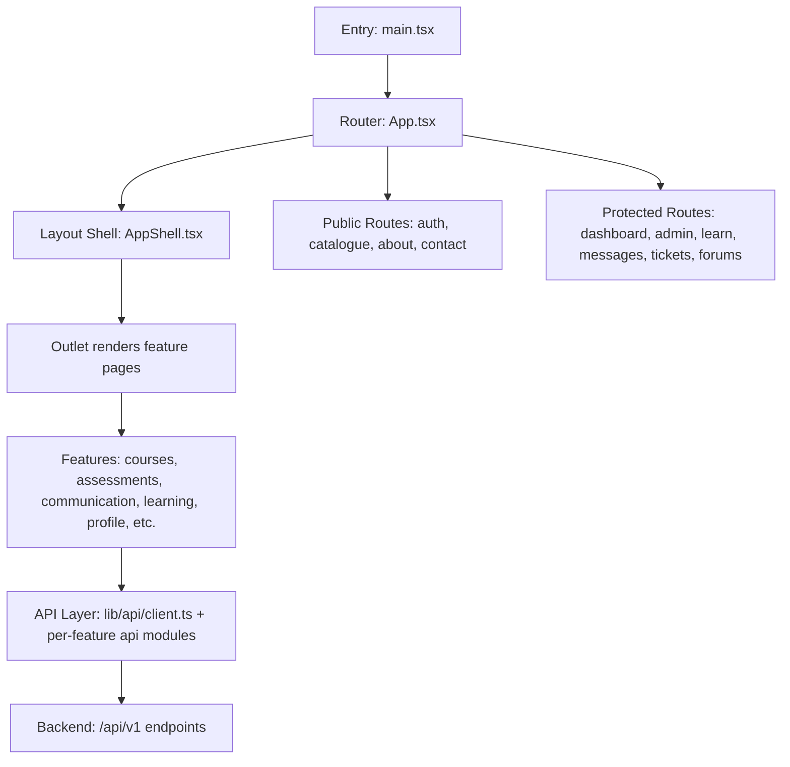
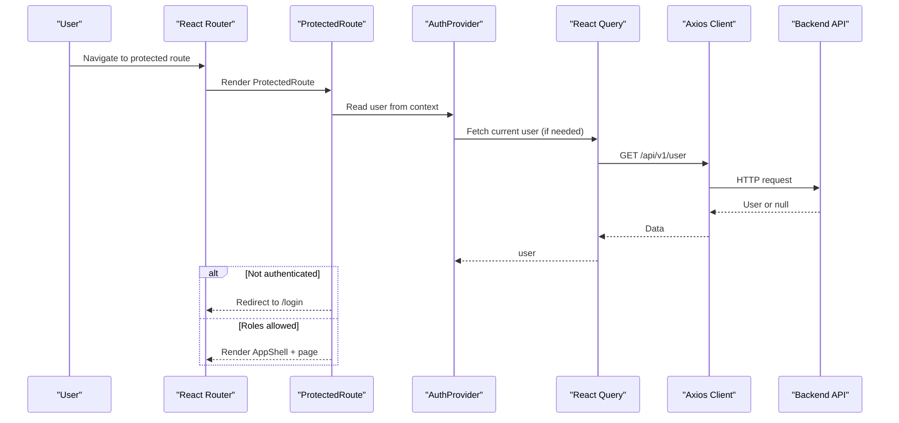
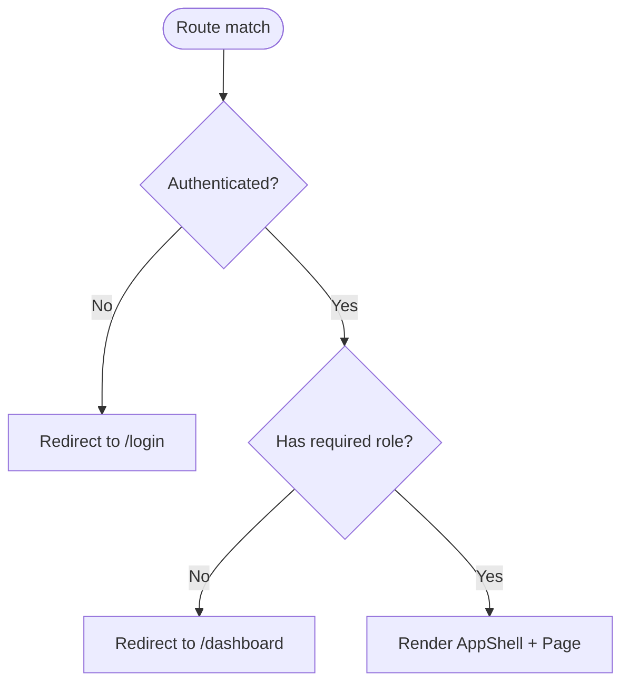
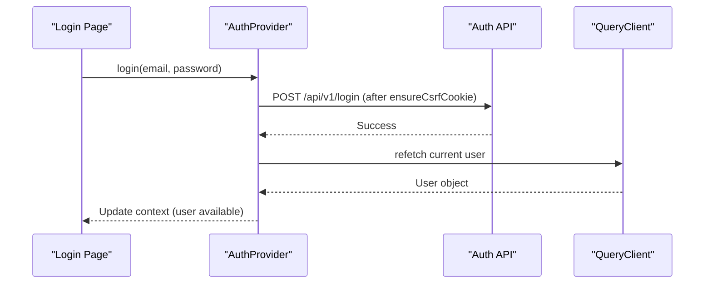
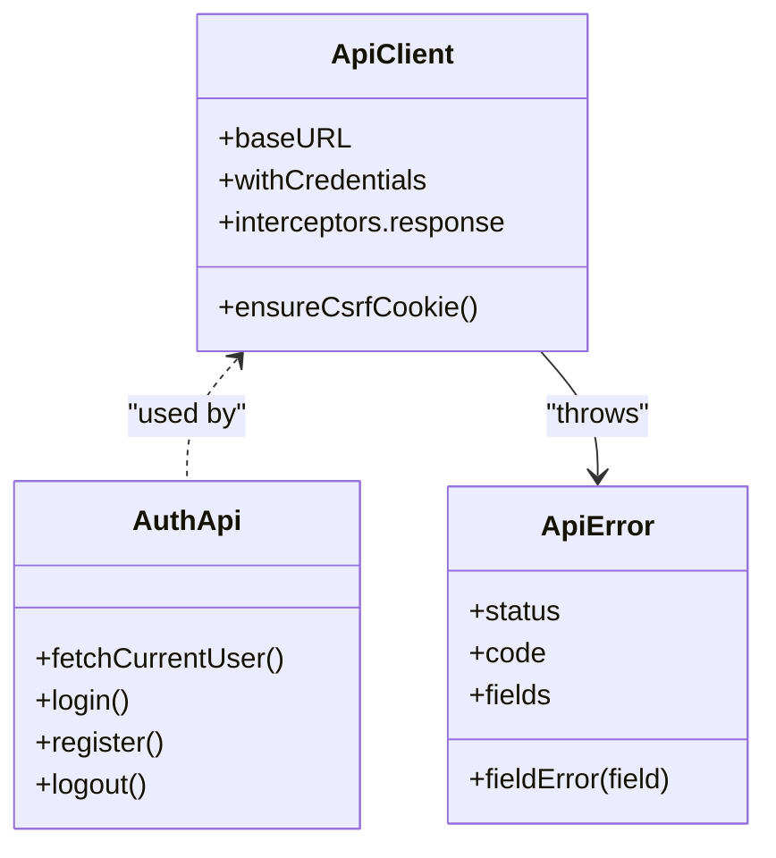
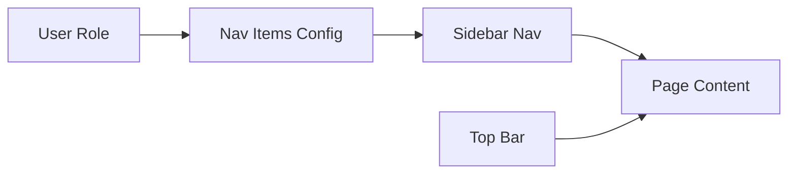
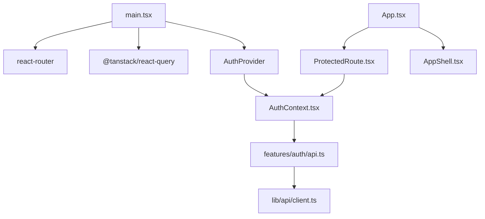

# Frontend Architecture

<cite>
**Referenced Files in This Document**
- [package.json](file://frontend/package.json)
- [vite.config.ts](file://frontend/vite.config.ts)
- [main.tsx](file://frontend/src/main.tsx)
- [App.tsx](file://frontend/src/App.tsx)
- [AuthContext.tsx](file://frontend/src/lib/auth/AuthContext.tsx)
- [ProtectedRoute.tsx](file://frontend/src/components/layout/ProtectedRoute.tsx)
- [AppShell.tsx](file://frontend/src/components/layout/AppShell.tsx)
- [client.ts](file://frontend/src/lib/api/client.ts)
- [api.ts](file://frontend/src/features/auth/api.ts)
</cite>

## Table of Contents
1. [Introduction](#introduction)
2. [Project Structure](#project-structure)
3. [Core Components](#core-components)
4. [Architecture Overview](#architecture-overview)
5. [Detailed Component Analysis](#detailed-component-analysis)
6. [Dependency Analysis](#dependency-analysis)
7. [Performance Considerations](#performance-considerations)
8. [Troubleshooting Guide](#troubleshooting-guide)
9. [Conclusion](#conclusion)

## Introduction
This document describes the React frontend architecture for an educational platform. It explains the component-based organization by domain (courses, assessments, communication, etc.), state management with React Query for server state and local patterns, API integration via a typed Axios client, routing and protected routes, authentication flow, build configuration with Vite and TypeScript, and testing infrastructure. It also covers composition patterns, reusable UI components, and styling with Tailwind CSS.

## Project Structure
The frontend is a modern React application built with Vite, TypeScript, and Tailwind CSS. The source tree is organized around features grouped by domain under src/features, shared UI primitives under src/components/ui, layout shell under src/components/layout, and a centralized API layer under src/lib/api. Pages live both as top-level pages (src/pages) and feature-scoped pages within their domains.

**Diagram sources**
- [main.tsx:1-61](file://frontend/src/main.tsx#L1-L61)
- [App.tsx:1-247](file://frontend/src/App.tsx#L1-L247)
- [AppShell.tsx:1-270](file://frontend/src/components/layout/AppShell.tsx#L1-L270)
- [client.ts:1-69](file://frontend/src/lib/api/client.ts#L1-L69)

**Section sources**
- [package.json:1-91](file://frontend/package.json#L1-L91)
- [vite.config.ts:1-30](file://frontend/vite.config.ts#L1-L30)
- [main.tsx:1-61](file://frontend/src/main.tsx#L1-L61)
- [App.tsx:1-247](file://frontend/src/App.tsx#L1-L247)

## Core Components
- Application bootstrap: Initializes React Query client, error boundary, router, and Auth provider.
- Routing and layout: Central route definitions with public and protected sections; AppShell provides role-aware navigation and page header context.
- Authentication: Contextual user state powered by React Query; login/register/logout flows integrated with CSRF handling.
- API client: Centralized Axios instance with base URL, credentials, XSRF token support, and unified error mapping.

Key responsibilities:
- State management: Server state via React Query; local UI state via component state and contexts where appropriate.
- Domain features: Organized under src/features (e.g., assessment, communication, learning, admin).
- Reusable UI: Shared components under src/components/ui and shadcn-derived primitives.

**Section sources**
- [main.tsx:1-61](file://frontend/src/main.tsx#L1-L61)
- [App.tsx:1-247](file://frontend/src/App.tsx#L1-L247)
- [AuthContext.tsx:1-71](file://frontend/src/lib/auth/AuthContext.tsx#L1-L71)
- [client.ts:1-69](file://frontend/src/lib/api/client.ts#L1-L69)

## Architecture Overview
The app follows a feature-sliced architecture:
- Entry and providers: main.tsx sets up ErrorBoundary, QueryClientProvider, BrowserRouter, and AuthProvider.
- Routing: App.tsx defines public and protected routes; ProtectedRoute enforces authentication and role checks.
- Layout: AppShell composes sidebar navigation based on user role, top bar with search and notifications, and an Outlet for feature pages.
- Data: Features call domain-specific API functions that use the central axios client to hit backend endpoints.

**Diagram sources**
- [App.tsx:1-247](file://frontend/src/App.tsx#L1-L247)
- [ProtectedRoute.tsx:1-35](file://frontend/src/components/layout/ProtectedRoute.tsx#L1-L35)
- [AuthContext.tsx:1-71](file://frontend/src/lib/auth/AuthContext.tsx#L1-L71)
- [client.ts:1-69](file://frontend/src/lib/api/client.ts#L1-L69)

## Detailed Component Analysis

### Routing and Protected Routes
- Public routes: landing, catalogue, about, contact, and auth flows.
- Protected routes: dashboard, admin, learning, communication, and profile pages wrapped in ProtectedRoute.
- Role-based access: ProtectedRoute supports optional roles array to restrict access to specific user types.

**Diagram sources**
- [App.tsx:1-247](file://frontend/src/App.tsx#L1-L247)
- [ProtectedRoute.tsx:1-35](file://frontend/src/components/layout/ProtectedRoute.tsx#L1-L35)

**Section sources**
- [App.tsx:1-247](file://frontend/src/App.tsx#L1-L247)
- [ProtectedRoute.tsx:1-35](file://frontend/src/components/layout/ProtectedRoute.tsx#L1-L35)

### Authentication Flow
- Provider: AuthContext uses React Query to fetch current user and exposes login/register/logout/refetch.
- CSRF: ensureCsrfCookie is called before mutating auth requests to satisfy Sanctum SPA flow.
- Post-auth: After login/register, refetch triggers rehydration of user data across the app.

**Diagram sources**
- [AuthContext.tsx:1-71](file://frontend/src/lib/auth/AuthContext.tsx#L1-L71)
- [api.ts:1-62](file://frontend/src/features/auth/api.ts#L1-L62)
- [client.ts:1-69](file://frontend/src/lib/api/client.ts#L1-L69)

**Section sources**
- [AuthContext.tsx:1-71](file://frontend/src/lib/auth/AuthContext.tsx#L1-L71)
- [api.ts:1-62](file://frontend/src/features/auth/api.ts#L1-L62)
- [client.ts:1-69](file://frontend/src/lib/api/client.ts#L1-L69)

### API Integration Layer
- Central client: Axios instance configured with base URL, credentials, and XSRF token support.
- Error handling: Response interceptor maps errors to a typed ApiError with status, code, and field errors.
- Feature APIs: Each feature module encapsulates its own API calls (e.g., auth, forum, profile), keeping concerns separated.

**Diagram sources**
- [client.ts:1-69](file://frontend/src/lib/api/client.ts#L1-L69)
- [api.ts:1-62](file://frontend/src/features/auth/api.ts#L1-L62)

**Section sources**
- [client.ts:1-69](file://frontend/src/lib/api/client.ts#L1-L69)
- [api.ts:1-62](file://frontend/src/features/auth/api.ts#L1-L62)

### Layout and Navigation (AppShell)
- Role-aware navigation: Sidebar items are generated based on user role (admin, instructor, student).
- Top bar: Provides page title/subtitle via context, optional global search, notifications, and profile menu.
- Responsive: Desktop sidebar with collapse toggle; mobile bottom navigation for quick actions.

**Diagram sources**
- [AppShell.tsx:1-270](file://frontend/src/components/layout/AppShell.tsx#L1-L270)

**Section sources**
- [AppShell.tsx:1-270](file://frontend/src/components/layout/AppShell.tsx#L1-L270)

### Build Configuration, TypeScript, and Testing
- Build tooling: Vite with React plugin and Tailwind CSS plugin; alias @ points to src.
- Development server: Hosted at 127.0.0.1:3000.
- TypeScript: Project references separate configs for app and node; strict type checking during build.
- Testing: Vitest configured with jsdom environment, globals enabled, and a setup file; Playwright for E2E tests.

**Section sources**
- [vite.config.ts:1-30](file://frontend/vite.config.ts#L1-L30)
- [package.json:1-91](file://frontend/package.json#L1-L91)

## Dependency Analysis
High-level dependencies and relationships:
- main.tsx depends on React Router, React Query, and AuthProvider.
- App.tsx orchestrates routes and imports feature pages and layout.
- ProtectedRoute depends on AuthContext and UI spinner.
- AuthContext depends on React Query and feature auth API.
- Feature APIs depend on the central axios client.

**Diagram sources**
- [main.tsx:1-61](file://frontend/src/main.tsx#L1-L61)
- [App.tsx:1-247](file://frontend/src/App.tsx#L1-L247)
- [AuthContext.tsx:1-71](file://frontend/src/lib/auth/AuthContext.tsx#L1-L71)
- [api.ts:1-62](file://frontend/src/features/auth/api.ts#L1-L62)
- [client.ts:1-69](file://frontend/src/lib/api/client.ts#L1-L69)
- [ProtectedRoute.tsx:1-35](file://frontend/src/components/layout/ProtectedRoute.tsx#L1-L35)
- [AppShell.tsx:1-270](file://frontend/src/components/layout/AppShell.tsx#L1-L270)

**Section sources**
- [main.tsx:1-61](file://frontend/src/main.tsx#L1-L61)
- [App.tsx:1-247](file://frontend/src/App.tsx#L1-L247)
- [AuthContext.tsx:1-71](file://frontend/src/lib/auth/AuthContext.tsx#L1-L71)
- [api.ts:1-62](file://frontend/src/features/auth/api.ts#L1-L62)
- [client.ts:1-69](file://frontend/src/lib/api/client.ts#L1-L69)
- [ProtectedRoute.tsx:1-35](file://frontend/src/components/layout/ProtectedRoute.tsx#L1-L35)
- [AppShell.tsx:1-270](file://frontend/src/components/layout/AppShell.tsx#L1-L270)

## Performance Considerations
- React Query tuning: Global defaults include minimal retries and disabled refetch on window focus to reduce unnecessary network churn.
- Stale time: Current user query has a reasonable staleTime to avoid frequent re-fetches while keeping session state fresh.
- Network efficiency: Centralized axios client reduces duplication and enables consistent caching/error strategies.
- Rendering: ProtectedRoute shows a lightweight spinner during auth checks to prevent layout thrash.

[No sources needed since this section provides general guidance]

## Troubleshooting Guide
Common issues and remedies:
- Authentication failures: Ensure CSRF cookie is fetched before login/register; check that the API base URL is correctly set and CORS allows credentials.
- Route redirects: If users are redirected unexpectedly, verify that the current user query resolves and that roles match the ProtectedRoute requirements.
- API errors: Inspect ApiError fields for validation feedback; handle network vs. server errors distinctly using status and code.
- Build/test issues: On Windows, test worker startup may exceed default timeouts; adjust pool options if necessary.

**Section sources**
- [client.ts:1-69](file://frontend/src/lib/api/client.ts#L1-L69)
- [api.ts:1-62](file://frontend/src/features/auth/api.ts#L1-L62)
- [ProtectedRoute.tsx:1-35](file://frontend/src/components/layout/ProtectedRoute.tsx#L1-L35)
- [vite.config.ts:1-30](file://frontend/vite.config.ts#L1-L30)

## Conclusion
The frontend employs a clean, scalable architecture centered on feature-based organization, robust server-state management with React Query, and a centralized API client. Routing and protected routes enforce authentication and role-based access, while the AppShell provides a responsive, role-aware layout. Vite, TypeScript, and Tailwind CSS deliver a fast developer experience and consistent styling. Testing is supported through Vitest for unit/integration and Playwright for end-to-end scenarios.

[No sources needed since this section summarizes without analyzing specific files]