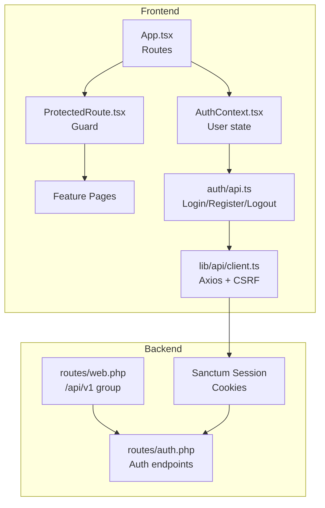
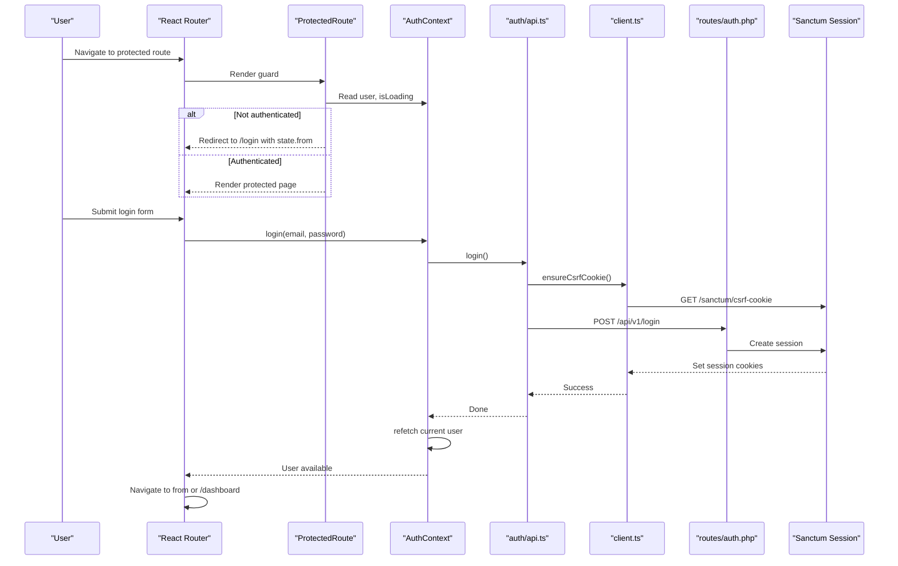
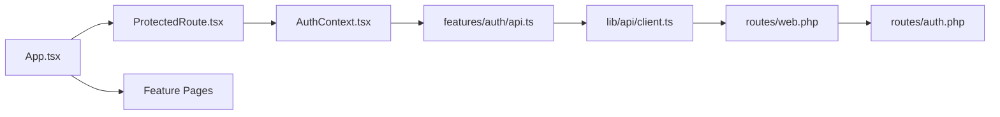

# Routing & Authentication

<cite>
**Referenced Files in This Document**
- [App.tsx](file://frontend/src/App.tsx)
- [ProtectedRoute.tsx](file://frontend/src/components/layout/ProtectedRoute.tsx)
- [AuthContext.tsx](file://frontend/src/lib/auth/AuthContext.tsx)
- [api.ts](file://frontend/src/features/auth/api.ts)
- [LoginPage.tsx](file://frontend/src/features/auth/LoginPage.tsx)
- [client.ts](file://frontend/src/lib/api/client.ts)
- [types.ts](file://frontend/src/lib/api/types.ts)
- [web.php](file://routes/web.php)
- [auth.php](file://routes/auth.php)
</cite>

## Table of Contents
1. Introduction
2. Project Structure
3. Core Components
4. Architecture Overview
5. Detailed Component Analysis
6. Dependency Analysis
7. Performance Considerations
8. Troubleshooting Guide
9. Conclusion

## Introduction
This document explains the frontend routing and authentication flow for the application. It covers React Router configuration, route definitions, nested protected routes, role-based access control, the authentication context, login/logout flows, session management via Sanctum, and error handling for unauthorized access.

## Project Structure
The application uses React Router to define public and protected routes. Protected routes are wrapped with a guard component that enforces authentication and optional role checks. The authentication state is provided by a context that manages user data and actions (login, register, logout). Backend routes under /api/v1 handle session-based authentication using Laravel Sanctum.

**Diagram sources**
- [App.tsx:42-242](file://frontend/src/App.tsx#L42-L242)
- [ProtectedRoute.tsx:17-34](file://frontend/src/components/layout/ProtectedRoute.tsx#L17-L34)
- [AuthContext.tsx:24-60](file://frontend/src/lib/auth/AuthContext.tsx#L24-L60)
- [api.ts:6-37](file://frontend/src/features/auth/api.ts#L6-L37)
- [client.ts:6-33](file://frontend/src/lib/api/client.ts#L6-L33)
- [web.php:23-46](file://routes/web.php#L23-L46)
- [auth.php:11-37](file://routes/auth.php#L11-L37)

**Section sources**
- [App.tsx:42-242](file://frontend/src/App.tsx#L42-L242)
- [web.php:23-46](file://routes/web.php#L23-L46)
- [auth.php:11-37](file://routes/auth.php#L11-L37)

## Core Components
- React Router setup and route tree: Public pages (landing, catalogue, auth) and nested protected routes under an AppShell wrapper.
- ProtectedRoute guard: Enforces authentication and optional role checks; redirects unauthenticated users to login and unauthorized users to dashboard.
- AuthContext: Provides current user, loading state, and actions (login, register, logout); fetches current user on mount and clears state on logout.
- API client: Axios instance configured for SPA with credentials and XSRF token support; ensures CSRF cookie before mutating requests.
- Backend routes: Sanctum-powered session endpoints for register, login, password reset, email verification, and logout under /api/v1.

**Section sources**
- [App.tsx:42-242](file://frontend/src/App.tsx#L42-L242)
- [ProtectedRoute.tsx:17-34](file://frontend/src/components/layout/ProtectedRoute.tsx#L17-L34)
- [AuthContext.tsx:24-60](file://frontend/src/lib/auth/AuthContext.tsx#L24-L60)
- [client.ts:6-33](file://frontend/src/lib/api/client.ts#L6-L33)
- [auth.php:11-37](file://routes/auth.php#L11-L37)

## Architecture Overview
The authentication flow combines frontend guards with backend session middleware:

**Diagram sources**
- [ProtectedRoute.tsx:17-34](file://frontend/src/components/layout/ProtectedRoute.tsx#L17-L34)
- [AuthContext.tsx:24-60](file://frontend/src/lib/auth/AuthContext.tsx#L24-L60)
- [api.ts:15-18](file://frontend/src/features/auth/api.ts#L15-L18)
- [client.ts:22-33](file://frontend/src/lib/api/client.ts#L22-L33)
- [auth.php:15-17](file://routes/auth.php#L15-L17)

## Detailed Component Analysis

### React Router Configuration and Route Definitions
- Public routes include landing, catalogue, about, contact, and authentication pages (login, register, forgot/reset password, verify notice).
- Protected routes are nested under a single route element that renders AppShell inside a ProtectedRoute guard.
- Role-based routes use ProtectedRoute with roles prop to restrict access to admin/instructor/student areas.
- Special case: When already logged in, the root index redirects to dashboard unless the URL contains #courses hash to allow course browsing.

Key behaviors:
- Unauthenticated access to protected routes redirects to /login with state.from preserving intended destination.
- Insufficient role redirects to /dashboard.
- Nested routes organize admin, learning, and communication features under the protected shell.

**Section sources**
- [App.tsx:42-242](file://frontend/src/App.tsx#L42-L242)

### ProtectedRoute Guard and Role-Based Access Control
- Displays a spinner while authentication state loads.
- If no user is present, navigates to /login with state.from.
- If roles are specified and the current user’s role is not included, navigates to /dashboard.
- Otherwise, renders children.

Notes:
- Frontend guards improve UX but are not the authorization boundary; server-side policies enforce actual permissions.

**Section sources**
- [ProtectedRoute.tsx:17-34](file://frontend/src/components/layout/ProtectedRoute.tsx#L17-L34)
- [types.ts:1](file://frontend/src/lib/api/types.ts#L1-L1)

### Authentication Context and Session Management
- On mount, fetches current user via a query hook; caches for a period and does not retry on failure.
- Login calls the API, then refreshes current user to populate context.
- Register calls the API and refreshes current user.
- Logout calls the API, clears local session flags, and resets current user cache.
- Provides refetch capability for components to revalidate state.

Session details:
- Uses Sanctum SPA mode with cookies enabled and XSRF token support.
- CSRF cookie is fetched once per page load before any mutating request.

**Section sources**
- [AuthContext.tsx:24-60](file://frontend/src/lib/auth/AuthContext.tsx#L24-L60)
- [client.ts:6-33](file://frontend/src/lib/api/client.ts#L6-L33)

### Login Flow
- Form validates inputs and submits to login endpoint.
- Ensures CSRF cookie is present before sending credentials.
- On success, navigates to the originally requested route or dashboard.
- Displays user-friendly errors for invalid credentials or network issues.

**Section sources**
- [LoginPage.tsx:21-49](file://frontend/src/features/auth/LoginPage.tsx#L21-L49)
- [api.ts:15-18](file://frontend/src/features/auth/api.ts#L15-L18)
- [client.ts:22-33](file://frontend/src/lib/api/client.ts#L22-L33)

### Logout Flow
- Calls backend logout endpoint to terminate session.
- Clears UI-specific flags and resets current user cache.
- Subsequent navigation to protected routes will redirect to login.

**Section sources**
- [AuthContext.tsx:48-53](file://frontend/src/lib/auth/AuthContext.tsx#L48-L53)
- [api.ts:35-37](file://frontend/src/features/auth/api.ts#L35-L37)

### Backend Authentication Endpoints
- Routes are grouped under /api/v1 and require session/CSRF via web middleware.
- Endpoints include register, login, password reset, email verification, and logout.
- Social auth callbacks and deactivation endpoints are also defined under this group.

**Section sources**
- [web.php:23-46](file://routes/web.php#L23-L46)
- [auth.php:11-37](file://routes/auth.php#L11-L37)

### Error Handling for Unauthorized Access
- Frontend:
  - ProtectedRoute redirects unauthenticated users to login and insufficient-role users to dashboard.
  - Login page surfaces API errors as user-readable messages.
- Backend:
  - Sanctum session middleware protects endpoints; unauthenticated requests result in standard responses handled by the client interceptor.
  - Client interceptor maps Axios errors to ApiError with status, code, message, and fields.

**Section sources**
- [ProtectedRoute.tsx:17-34](file://frontend/src/components/layout/ProtectedRoute.tsx#L17-L34)
- [LoginPage.tsx:33-49](file://frontend/src/features/auth/LoginPage.tsx#L33-L49)
- [client.ts:54-68](file://frontend/src/lib/api/client.ts#L54-L68)

## Dependency Analysis
The following diagram shows how routing, guards, context, and API layers depend on each other and on backend routes.

**Diagram sources**
- [App.tsx:42-242](file://frontend/src/App.tsx#L42-L242)
- [ProtectedRoute.tsx:17-34](file://frontend/src/components/layout/ProtectedRoute.tsx#L17-L34)
- [AuthContext.tsx:24-60](file://frontend/src/lib/auth/AuthContext.tsx#L24-L60)
- [api.ts:6-37](file://frontend/src/features/auth/api.ts#L6-L37)
- [client.ts:6-33](file://frontend/src/lib/api/client.ts#L6-L33)
- [web.php:23-46](file://routes/web.php#L23-L46)
- [auth.php:11-37](file://routes/auth.php#L11-L37)

**Section sources**
- [App.tsx:42-242](file://frontend/src/App.tsx#L42-L242)
- [ProtectedRoute.tsx:17-34](file://frontend/src/components/layout/ProtectedRoute.tsx#L17-L34)
- [AuthContext.tsx:24-60](file://frontend/src/lib/auth/AuthContext.tsx#L24-L60)
- [api.ts:6-37](file://frontend/src/features/auth/api.ts#L6-L37)
- [client.ts:6-33](file://frontend/src/lib/api/client.ts#L6-L33)
- [web.php:23-46](file://routes/web.php#L23-L46)
- [auth.php:11-37](file://routes/auth.php#L11-L37)

## Performance Considerations
- Current user query caching reduces redundant network calls during navigation.
- CSRF cookie fetching is cached per page load to avoid unnecessary requests.
- ProtectedRoute avoids rendering heavy layouts until authentication state resolves.

[No sources needed since this section provides general guidance]

## Troubleshooting Guide
Common issues and resolutions:
- Redirect loop after login: Ensure the from state is preserved and navigation occurs after successful login and user refetch.
- 401/403 on protected routes: Verify session cookies are sent (withCredentials) and CSRF cookie is fetched before mutations.
- Role mismatch: Confirm the user’s role matches the required roles array on the route.
- Network errors: Check API base URL and CORS settings; inspect ApiError details for field-level validation messages.

**Section sources**
- [LoginPage.tsx:33-49](file://frontend/src/features/auth/LoginPage.tsx#L33-L49)
- [client.ts:22-33](file://frontend/src/lib/api/client.ts#L22-L33)
- [ProtectedRoute.tsx:17-34](file://frontend/src/components/layout/ProtectedRoute.tsx#L17-L34)

## Conclusion
The application implements a clear separation between frontend routing/guards and backend session-based authentication. ProtectedRoute provides immediate UX feedback for authentication and role requirements, while Sanctum ensures secure sessions on the server. The AuthContext centralizes user state and actions, enabling consistent behavior across the app. Proper error handling and CSRF management complete a robust authentication flow.