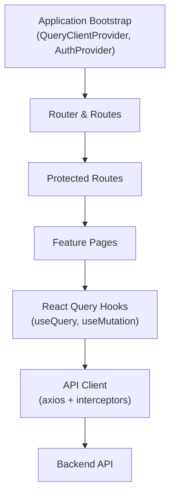
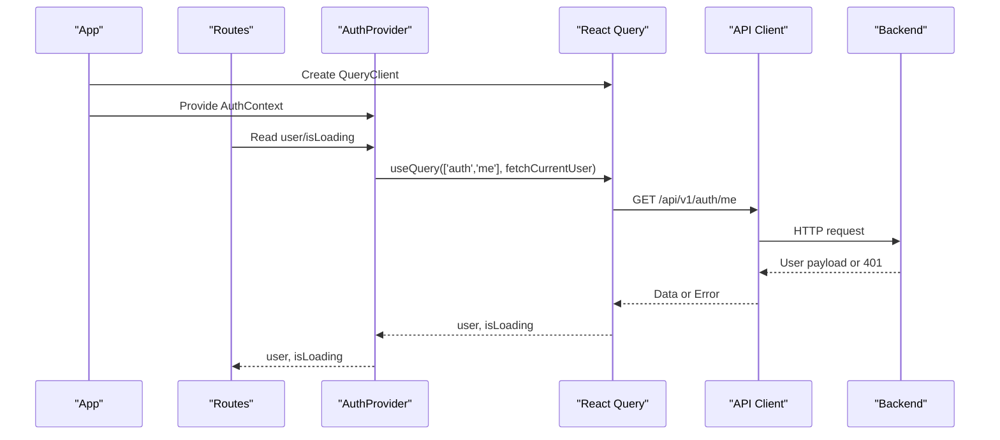
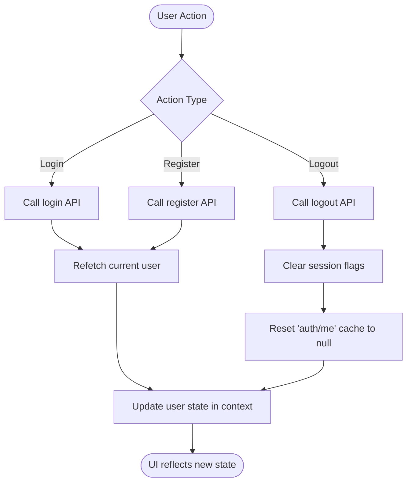
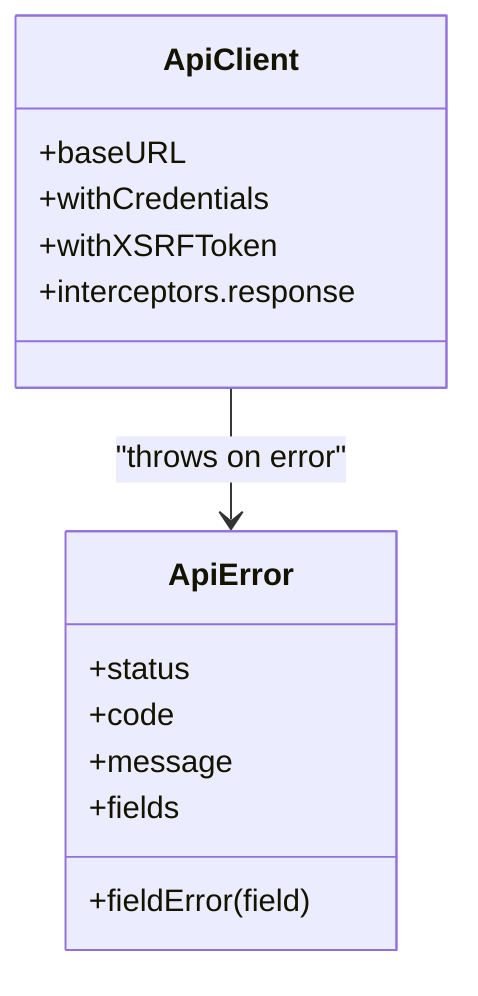
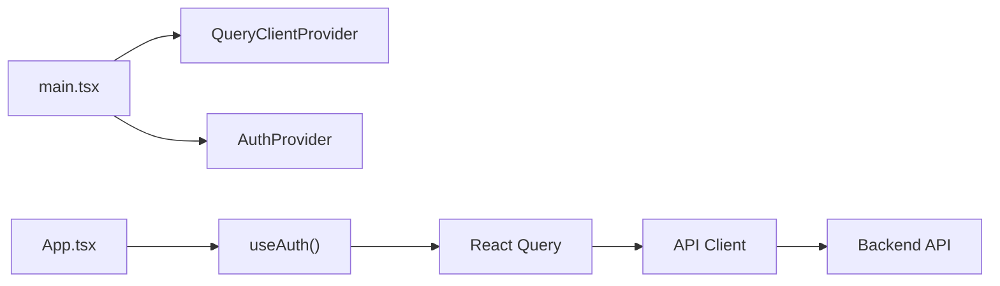

# State Management

<cite>
**Referenced Files in This Document**
- [main.tsx](file://frontend/src/main.tsx)
- [App.tsx](file://frontend/src/App.tsx)
- [AuthContext.tsx](file://frontend/src/lib/auth/AuthContext.tsx)
- [client.ts](file://frontend/src/lib/api/client.ts)
- [api.ts](file://frontend/src/features/auth/api.ts)
</cite>

## Table of Contents
1. [Introduction](#introduction)
2. [Project Structure](#project-structure)
3. [Core Components](#core-components)
4. [Architecture Overview](#architecture-overview)
5. [Detailed Component Analysis](#detailed-component-analysis)
6. [Dependency Analysis](#dependency-analysis)
7. [Performance Considerations](#performance-considerations)
8. [Troubleshooting Guide](#troubleshooting-guide)
9. [Conclusion](#conclusion)

## Introduction
This document explains the frontend state management strategy, which combines React Query for server state with local UI state for transient concerns. It covers:
- QueryClient configuration and caching behavior
- Data fetching patterns via React Query hooks
- Authentication context implementation and user state lifecycle
- Custom hooks for API integration, error handling, and loading states
- Synchronization between client and server, optimistic updates, and cache invalidation strategies

The approach keeps UI state (modals, form drafts, temporary flags) in component-level state while delegating persistent data to React Query’s cache, ensuring consistent, predictable, and performant data flows across the application.

## Project Structure
At a high level:
- Application bootstrap configures React Query and providers
- Routing wraps protected routes behind an authentication context
- Authentication state is managed through a React Query-backed context
- API client centralizes HTTP configuration, CSRF handling, and error normalization

**Diagram sources**
- [main.tsx:4-16](file://frontend/src/main.tsx#L4-L16)
- [main.tsx:48-60](file://frontend/src/main.tsx#L48-L60)
- [App.tsx:43-79](file://frontend/src/App.tsx#L43-L79)
- [client.ts:6-13](file://frontend/src/lib/api/client.ts#L6-L13)

**Section sources**
- [main.tsx:4-16](file://frontend/src/main.tsx#L4-L16)
- [main.tsx:48-60](file://frontend/src/main.tsx#L48-L60)
- [App.tsx:43-79](file://frontend/src/App.tsx#L43-L79)

## Core Components
- QueryClient setup: configured with retry and refetchOnWindowFocus options to control network behavior and reduce unnecessary refetches.
- Auth provider: uses React Query to fetch and cache current user; exposes login, register, logout, and refetch operations.
- API client: centralized axios instance with base URL, credentials, XSRF token support, and normalized error mapping.

Key responsibilities:
- Server state: owned by React Query caches keyed by stable query keys.
- UI state: kept in components (e.g., modals, form inputs).
- Cross-cutting concerns: authentication flow, CSRF seeding, error normalization.

**Section sources**
- [main.tsx:9-16](file://frontend/src/main.tsx#L9-L16)
- [AuthContext.tsx:24-53](file://frontend/src/lib/auth/AuthContext.tsx#L24-L53)
- [client.ts:6-13](file://frontend/src/lib/api/client.ts#L6-L13)
- [client.ts:22-33](file://frontend/src/lib/api/client.ts#L22-L33)
- [client.ts:35-63](file://frontend/src/lib/api/client.ts#L35-L63)

## Architecture Overview
The system separates concerns cleanly:
- Providers at the root configure global services (React Query, routing, auth).
- Feature pages consume data via React Query hooks, which coordinate with the API client.
- Authentication state is derived from a dedicated query key, enabling automatic synchronization on login/logout.

**Diagram sources**
- [main.tsx:4-16](file://frontend/src/main.tsx#L4-L16)
- [main.tsx:48-60](file://frontend/src/main.tsx#L48-L60)
- [AuthContext.tsx:24-36](file://frontend/src/lib/auth/AuthContext.tsx#L24-L36)
- [client.ts:6-13](file://frontend/src/lib/api/client.ts#L6-L13)

## Detailed Component Analysis

### QueryClient Configuration and Caching Strategy
- Global QueryClient is created once at app bootstrap and provided to the entire tree.
- Default query options include limited retries and disabled refetch on window focus to avoid noisy background requests.
- Stale time for the current user query ensures minimal revalidation after initial load.

Practical implications:
- Predictable network usage with controlled retries.
- Reduced flicker due to stale-time caching for sensitive queries like current user.
- Centralized configuration makes it easy to adjust behavior globally.

**Section sources**
- [main.tsx:9-16](file://frontend/src/main.tsx#L9-L16)
- [AuthContext.tsx:27-36](file://frontend/src/lib/auth/AuthContext.tsx#L27-L36)

### Authentication Context and User State Lifecycle
- The current user is fetched via a dedicated query key and cached with a stale time.
- Login and register trigger mutations that call backend endpoints, then refetch the current user to update the cache.
- Logout clears session-specific UI flags and resets the current user cache entry to null.

**Diagram sources**
- [AuthContext.tsx:38-53](file://frontend/src/lib/auth/AuthContext.tsx#L38-L53)
- [api.ts](file://frontend/src/features/auth/api.ts)

**Section sources**
- [AuthContext.tsx:24-53](file://frontend/src/lib/auth/AuthContext.tsx#L24-L53)
- [api.ts](file://frontend/src/features/auth/api.ts)

### API Client, Error Handling, and CSRF
- Axios instance sets base URL, includes credentials, and enables XSRF token usage for SPA sessions.
- CSRF cookie is seeded before mutating requests to satisfy Sanctum requirements.
- Response interceptor normalizes errors into a typed ApiError with status, code, message, and field-level details.

**Diagram sources**
- [client.ts:6-13](file://frontend/src/lib/api/client.ts#L6-L13)
- [client.ts:35-63](file://frontend/src/lib/api/client.ts#L35-L63)

**Section sources**
- [client.ts:6-13](file://frontend/src/lib/api/client.ts#L6-L13)
- [client.ts:22-33](file://frontend/src/lib/api/client.ts#L22-L33)
- [client.ts:35-63](file://frontend/src/lib/api/client.ts#L35-L63)

### Data Fetching Patterns with React Query
- Queries are defined with stable keys and functions that call the API client.
- Stale times and retries can be tuned per query to balance freshness and performance.
- Mutations handle side effects and invalidate related queries to keep the cache consistent.

Example patterns:
- List resources: useQuery with pagination keys and optional staleTime.
- Detail resource: useQuery with id-based keys and enabled guards.
- Mutations: useMutation to create/update/delete, followed by invalidateQueries to refresh dependent lists.

[No sources needed since this section describes general patterns without analyzing specific files]

### Local UI State vs Server State
- Use local state for transient UI concerns: modal visibility, draft form values, temporary filters.
- Use React Query for server state: anything persisted on the backend or shared across components.
- Keep them separate to avoid accidental persistence of UI-only state and to leverage caching and deduplication.

[No sources needed since this section provides general guidance]

### Optimistic Updates and Cache Invalidation
- Optimistic updates: temporarily update the cache with expected results before the mutation completes, then revert on error.
- Cache invalidation: after successful mutations, invalidate affected query keys so subsequent reads fetch fresh data.
- For real-time-like UX, combine optimistic updates with background refetches triggered by invalidation.

[No sources needed since this section provides general guidance]

### Custom Hooks for API Integration, Errors, and Loading
Recommended hook shapes:
- useApiData(key, fetcher): encapsulates useQuery with loading/error/data exposure.
- useApiMutation(key, mutateFn): encapsulates useMutation with success/error handlers and invalidation.
- useFieldErrors(error): maps ApiError fields to form field errors.

Usage guidelines:
- Always pass stable query keys.
- Centralize error display using normalized ApiError properties.
- Avoid direct axios calls in components; prefer hooks for consistency.

[No sources needed since this section provides general guidance]

## Dependency Analysis
The following diagram shows how core modules depend on each other during runtime initialization and data access.

**Diagram sources**
- [main.tsx:4-16](file://frontend/src/main.tsx#L4-L16)
- [main.tsx:48-60](file://frontend/src/main.tsx#L48-L60)
- [App.tsx:43-79](file://frontend/src/App.tsx#L43-L79)
- [AuthContext.tsx:24-36](file://frontend/src/lib/auth/AuthContext.tsx#L24-L36)
- [client.ts:6-13](file://frontend/src/lib/api/client.ts#L6-L13)

**Section sources**
- [main.tsx:4-16](file://frontend/src/main.tsx#L4-L16)
- [App.tsx:43-79](file://frontend/src/App.tsx#L43-L79)
- [AuthContext.tsx:24-36](file://frontend/src/lib/auth/AuthContext.tsx#L24-L36)
- [client.ts:6-13](file://frontend/src/lib/api/client.ts#L6-L13)

## Performance Considerations
- Prefer staleTime for frequently read data to reduce network calls.
- Disable refetchOnWindowFocus where background polling is not required.
- Use precise query keys to limit invalidation scope and avoid unnecessary refetches.
- Batch mutations when possible and invalidate only affected queries.
- Leverage React Query’s built-in deduplication and background refetching.

[No sources needed since this section provides general guidance]

## Troubleshooting Guide
Common issues and resolutions:
- 401 Unauthorized on first mutation: ensure CSRF cookie is seeded before login/register.
- Unexpected refetch loops: review refetchOnWindowFocus and query key stability.
- Stale UI after mutation: verify that relevant query keys are invalidated post-mutation.
- Form validation errors: map ApiError.fieldError to individual fields for precise feedback.

Operational tips:
- Inspect React Query devtools to visualize cache keys, statuses, and invalidations.
- Log ApiError instances to capture status, code, and field errors.
- Guard routes with isLoading to prevent rendering before auth state resolves.

**Section sources**
- [client.ts:22-33](file://frontend/src/lib/api/client.ts#L22-L33)
- [client.ts:35-63](file://frontend/src/lib/api/client.ts#L35-L63)
- [App.tsx:43-63](file://frontend/src/App.tsx#L43-L63)

## Conclusion
The application adopts a clear separation between server state (managed by React Query) and UI state (managed locally), resulting in predictable data flows and efficient caching. The authentication context leverages React Query to synchronize user state across the app, while the API client standardizes networking and error handling. By combining stable query keys, targeted invalidation, and optional optimistic updates, the system delivers responsive and reliable user experiences.