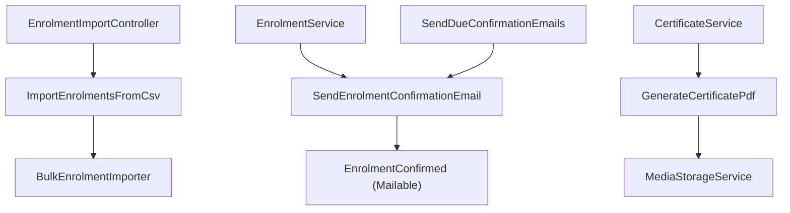
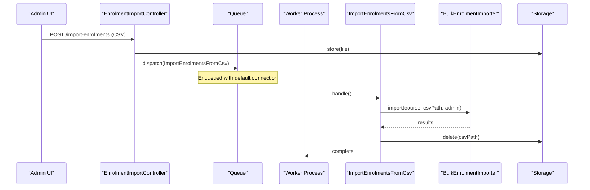
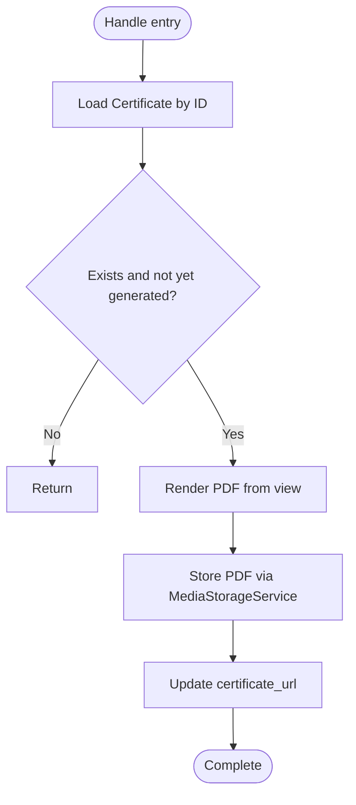
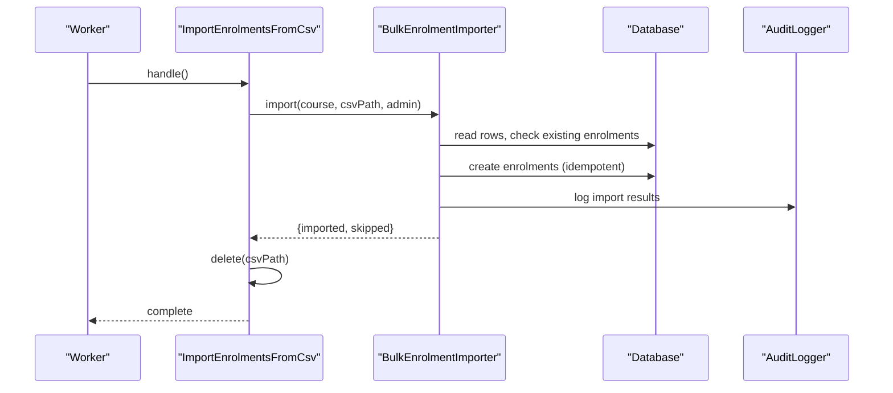
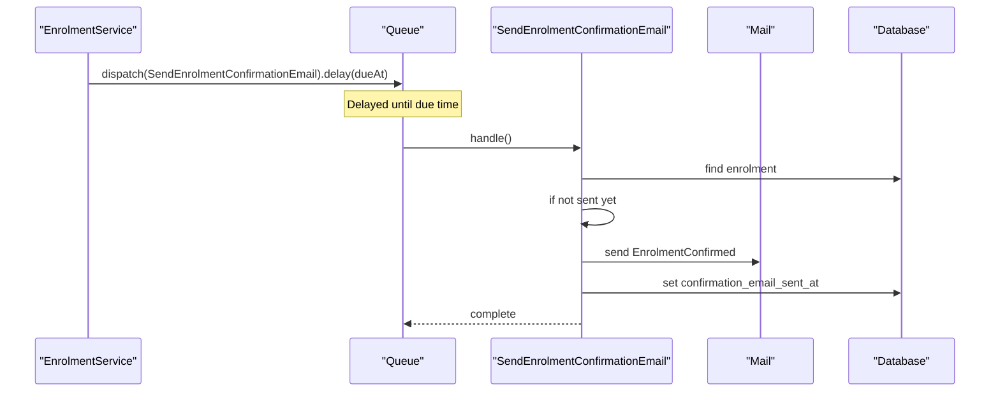
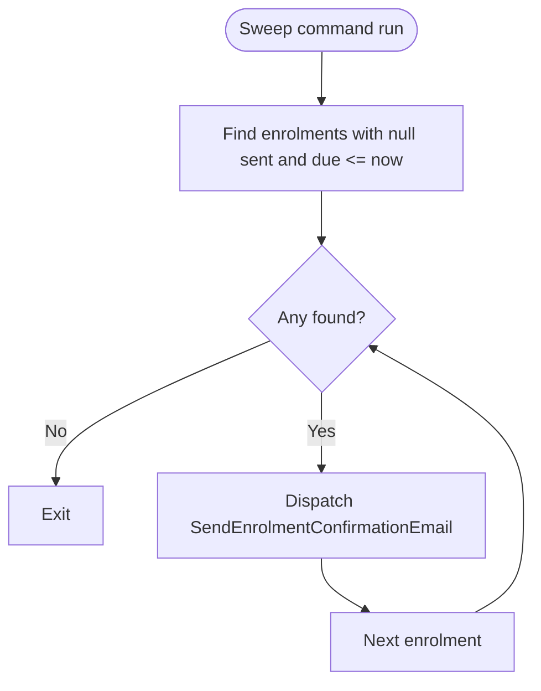
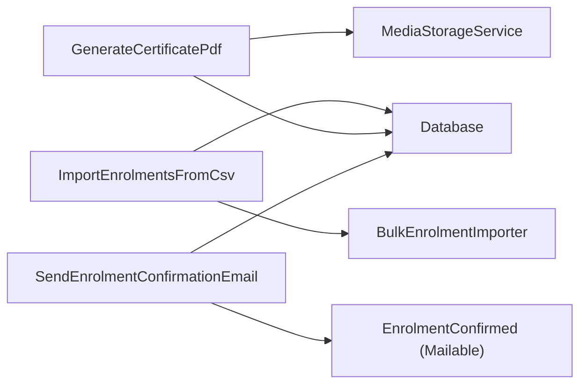

# Background Job Processing

<cite>
**Referenced Files in This Document**
- [GenerateCertificatePdf.php](file://app/Jobs/GenerateCertificatePdf.php)
- [ImportEnrolmentsFromCsv.php](file://app/Jobs/ImportEnrolmentsFromCsv.php)
- [SendEnrolmentConfirmationEmail.php](file://app/Jobs/SendEnrolmentConfirmationEmail.php)
- [queue.php](file://config/queue.php)
- [CertificateService.php](file://app/Services/Certification/CertificateService.php)
- [BulkEnrolmentImporter.php](file://app/Services/Enrolment/BulkEnrolmentImporter.php)
- [EnrolmentService.php](file://app/Services/Enrolment/EnrolmentService.php)
- [EnrolmentImportController.php](file://app/Http/Controllers/Api/V1/EnrolmentImportController.php)
- [SendDueConfirmationEmails.php](file://app/Console/Commands/SendDueConfirmationEmails.php)
- [EnrolmentConfirmed.php](file://app/Mail/EnrolmentConfirmed.php)
</cite>

## Table of Contents
1. [Introduction](#introduction)
2. [Project Structure](#project-structure)
3. [Core Components](#core-components)
4. [Architecture Overview](#architecture-overview)
5. [Detailed Component Analysis](#detailed-component-analysis)
6. [Dependency Analysis](#dependency-analysis)
7. [Performance Considerations](#performance-considerations)
8. [Troubleshooting Guide](#troubleshooting-guide)
9. [Conclusion](#conclusion)
10. [Appendices](#appendices)

## Introduction
This document explains the background job processing architecture built with Laravel queues. It focuses on three core jobs: GenerateCertificatePdf, ImportEnrolmentsFromCsv, and SendEnrolmentConfirmationEmail. It covers queue configuration, worker setup, dispatching patterns, retry and failure handling, monitoring strategies for long-running operations, prioritization, rate limiting, batch processing, and how jobs interact with services to keep business logic separate from execution context.

## Project Structure
The project organizes asynchronous work as:
- Jobs under app/Jobs that implement ShouldQueue and encapsulate unit-of-work.
- Services under app/Services that contain business logic and orchestrate domain actions.
- Controllers and Console Commands that dispatch jobs or schedule periodic tasks.
- Queue configuration under config/queue.php defining backends, batching, and failed job storage.

**Diagram sources**
- [EnrolmentImportController.php:18-29](file://app/Http/Controllers/Api/V1/EnrolmentImportController.php#L18-L29)
- [ImportEnrolmentsFromCsv.php:27-41](file://app/Jobs/ImportEnrolmentsFromCsv.php#L27-L41)
- [EnrolmentService.php:131-133](file://app/Services/Enrolment/EnrolmentService.php#L131-L133)
- [SendEnrolmentConfirmationEmail.php:37-48](file://app/Jobs/SendEnrolmentConfirmationEmail.php#L37-L48)
- [CertificateService.php:23-36](file://app/Services/Certification/CertificateService.php#L23-L36)
- [GenerateCertificatePdf.php:36-57](file://app/Jobs/GenerateCertificatePdf.php#L36-L57)
- [SendDueConfirmationEmails.php:21-35](file://app/Console/Commands/SendDueConfirmationEmails.php#L21-L35)
- [EnrolmentConfirmed.php:14-31](file://app/Mail/EnrolmentConfirmed.php#L14-L31)

**Section sources**
- [queue.php:16-92](file://config/queue.php#L16-L92)
- [EnrolmentImportController.php:18-29](file://app/Http/Controllers/Api/V1/EnrolmentImportController.php#L18-L29)
- [EnrolmentService.php:44-148](file://app/Services/Enrolment/EnrolmentService.php#L44-L148)
- [CertificateService.php:23-36](file://app/Services/Certification/CertificateService.php#L23-L36)
- [SendDueConfirmationEmails.php:21-35](file://app/Console/Commands/SendDueConfirmationEmails.php#L21-L35)

## Core Components
- GenerateCertificatePdf: Renders a certificate PDF off the request cycle and stores it via MediaStorageService. It is unique per certificate to prevent duplicate rendering on retries.
- ImportEnrolmentsFromCsv: Processes a stored CSV file using BulkEnrolmentImporter, which is idempotent per student/course pair. Cleans up the uploaded file after import.
- SendEnrolmentConfirmationEmail: Sends a confirmation email once per enrolment, guarded by a timestamp to avoid duplicates. Dispatched with delay based on course settings.

Key characteristics:
- All jobs implement ShouldQueue and use Dispatchable, InteractsWithQueue, SerializesModels.
- Idempotency is enforced either by uniqueness constraints (ShouldBeUnique) or by checking state before side effects.
- Failure paths log structured errors for observability.

**Section sources**
- [GenerateCertificatePdf.php:21-65](file://app/Jobs/GenerateCertificatePdf.php#L21-L65)
- [ImportEnrolmentsFromCsv.php:21-49](file://app/Jobs/ImportEnrolmentsFromCsv.php#L21-L49)
- [SendEnrolmentConfirmationEmail.php:22-56](file://app/Jobs/SendEnrolmentConfirmationEmail.php#L22-L56)

## Architecture Overview
The system separates concerns:
- Controllers and commands enqueue work; they do not perform heavy I/O.
- Services encapsulate domain rules and coordinate jobs where appropriate.
- Jobs execute side effects (PDF generation, file imports, emails) asynchronously.
- Queue backend is configurable; default uses database driver with failover support.

**Diagram sources**
- [EnrolmentImportController.php:18-29](file://app/Http/Controllers/Api/V1/EnrolmentImportController.php#L18-L29)
- [ImportEnrolmentsFromCsv.php:27-41](file://app/Jobs/ImportEnrolmentsFromCsv.php#L27-L41)
- [BulkEnrolmentImporter.php:29-85](file://app/Services/Enrolment/BulkEnrolmentImporter.php#L29-L85)
- [queue.php:16-92](file://config/queue.php#L16-L92)

## Detailed Component Analysis

### GenerateCertificatePdf
Purpose:
- Render certificate PDF from view data and persist to storage.
- Ensure exactly-once behavior via ShouldBeUnique keyed by certificate id.

Data flow:
- Load certificate with related models.
- If already processed or missing, exit early.
- Render PDF and store raw bytes via MediaStorageService.
- Update certificate record with storage path.

Retry and failure:
- Configured with tries and backoff.
- Failed method logs error with context.

**Diagram sources**
- [GenerateCertificatePdf.php:36-57](file://app/Jobs/GenerateCertificatePdf.php#L36-L57)

**Section sources**
- [GenerateCertificatePdf.php:21-65](file://app/Jobs/GenerateCertificatePdf.php#L21-L65)
- [CertificateService.php:23-36](file://app/Services/Certification/CertificateService.php#L23-L36)

### ImportEnrolmentsFromCsv
Purpose:
- Ingest bulk enrolments from a CSV file stored in application storage.
- Delegate parsing and enrolment creation to BulkEnrolmentImporter.

Idempotency:
- Importer skips students already enrolled in the course.

Cleanup:
- Deletes the temporary CSV file after successful import.

**Diagram sources**
- [ImportEnrolmentsFromCsv.php:27-41](file://app/Jobs/ImportEnrolmentsFromCsv.php#L27-L41)
- [BulkEnrolmentImporter.php:29-85](file://app/Services/Enrolment/BulkEnrolmentImporter.php#L29-L85)

**Section sources**
- [ImportEnrolmentsFromCsv.php:21-49](file://app/Jobs/ImportEnrolmentsFromCsv.php#L21-L49)
- [BulkEnrolmentImporter.php:14-85](file://app/Services/Enrolment/BulkEnrolmentImporter.php#L14-L85)

### SendEnrolmentConfirmationEmail
Purpose:
- Send a confirmation email at a scheduled time derived from course settings.
- Guard against duplicate sends using a timestamp field.

Dispatch patterns:
- Delayed dispatch from EnrolmentService upon enrolment or promotion.
- Fallback sweep command dispatches any overdue emails missed due to queue restarts.

**Diagram sources**
- [EnrolmentService.php:131-133](file://app/Services/Enrolment/EnrolmentService.php#L131-L133)
- [SendEnrolmentConfirmationEmail.php:37-48](file://app/Jobs/SendEnrolmentConfirmationEmail.php#L37-L48)
- [EnrolmentConfirmed.php:14-31](file://app/Mail/EnrolmentConfirmed.php#L14-L31)

**Section sources**
- [SendEnrolmentConfirmationEmail.php:22-56](file://app/Jobs/SendEnrolmentConfirmationEmail.php#L22-L56)
- [EnrolmentService.php:131-133](file://app/Services/Enrolment/EnrolmentService.php#L131-L133)
- [SendDueConfirmationEmails.php:21-35](file://app/Console/Commands/SendDueConfirmationEmails.php#L21-L35)

### Enrolment Confirmation Sweep
Purpose:
- Periodically dispatch confirmation emails for enrolments whose due time has passed but were never sent.

**Diagram sources**
- [SendDueConfirmationEmails.php:21-35](file://app/Console/Commands/SendDueConfirmationEmails.php#L21-L35)
- [SendEnrolmentConfirmationEmail.php:37-48](file://app/Jobs/SendEnrolmentConfirmationEmail.php#L37-L48)

**Section sources**
- [SendDueConfirmationEmails.php:21-35](file://app/Console/Commands/SendDueConfirmationEmails.php#L21-L35)

## Dependency Analysis
Jobs depend on services and external systems:
- GenerateCertificatePdf depends on MediaStorageService and PDF rendering.
- ImportEnrolmentsFromCsv depends on BulkEnrolmentImporter and Storage.
- SendEnrolmentConfirmationEmail depends on Mail and Enrolment model state.

**Diagram sources**
- [GenerateCertificatePdf.php:36-57](file://app/Jobs/GenerateCertificatePdf.php#L36-L57)
- [ImportEnrolmentsFromCsv.php:27-41](file://app/Jobs/ImportEnrolmentsFromCsv.php#L27-L41)
- [SendEnrolmentConfirmationEmail.php:37-48](file://app/Jobs/SendEnrolmentConfirmationEmail.php#L37-L48)

**Section sources**
- [GenerateCertificatePdf.php:21-65](file://app/Jobs/GenerateCertificatePdf.php#L21-L65)
- [ImportEnrolmentsFromCsv.php:21-49](file://app/Jobs/ImportEnrolmentsFromCsv.php#L21-L49)
- [SendEnrolmentConfirmationEmail.php:22-56](file://app/Jobs/SendEnrolmentConfirmationEmail.php#L22-L56)

## Performance Considerations
- Use database-backed queues for durability; consider Redis for higher throughput.
- Configure retry_after appropriately for long-running jobs to avoid double-processing.
- Keep jobs small and focused; delegate heavy work to services.
- Prefer idempotent operations and uniqueness to safely handle retries.
- For high-volume CSV imports, ensure streaming reads and minimal memory usage within BulkEnrolmentImporter.
- Monitor failed jobs and set up alerts for persistent failures.

[No sources needed since this section provides general guidance]

## Troubleshooting Guide
Common issues and remedies:
- Duplicate emails or PDFs: Verify ShouldBeUnique implementation and idempotent checks in jobs.
- Stuck delayed emails: Run the sweep command to dispatch overdue emails.
- Import failures: Check logs for exceptions during CSV parsing or enrolment creation; confirm file exists and permissions are correct.
- Queue worker down: Ensure workers are running and configured with appropriate timeouts and memory limits.

Operational tips:
- Inspect failed jobs table for detailed error payloads.
- Use structured logging in job failed methods to capture context.
- Restart workers gracefully when deploying changes.

**Section sources**
- [GenerateCertificatePdf.php:59-65](file://app/Jobs/GenerateCertificatePdf.php#L59-L65)
- [ImportEnrolmentsFromCsv.php:43-49](file://app/Jobs/ImportEnrolmentsFromCsv.php#L43-L49)
- [SendEnrolmentConfirmationEmail.php:50-56](file://app/Jobs/SendEnrolmentConfirmationEmail.php#L50-L56)
- [SendDueConfirmationEmails.php:21-35](file://app/Console/Commands/SendDueConfirmationEmails.php#L21-L35)

## Conclusion
The background job system cleanly separates business logic from execution context through service-driven design and queued jobs. Idempotency, uniqueness, and robust failure handling ensure reliability. The queue configuration supports multiple backends and batching, enabling scalable processing for high-volume operations. Scheduled sweeps provide resilience against lost delayed jobs.

[No sources needed since this section summarizes without analyzing specific files]

## Appendices

### Queue Configuration and Worker Setup
- Default connection: database with configurable retry_after.
- Additional connections: redis, beanstalkd, sqs, deferred, background, failover.
- Batching: enabled with job_batches table.
- Failed jobs: stored via database-uuids.

Recommended worker flags:
- Set timeout and memory limits suitable for long-running jobs.
- Use max-jobs or max-time to recycle workers periodically.

**Section sources**
- [queue.php:16-127](file://config/queue.php#L16-L127)

### Job Chaining and Event-Driven Triggering
- Chaining: Chain subsequent jobs after a primary job completes by chaining on the returned job instance.
- Event-driven: Dispatch jobs from service methods triggered by domain events (e.g., enrolment confirmed, certificate issued).

Examples in codebase:
- EnrolmentService dispatches delayed confirmation emails upon enrolment or promotion.
- CertificateService dispatches PDF generation upon certificate issuance.

**Section sources**
- [EnrolmentService.php:131-133](file://app/Services/Enrolment/EnrolmentService.php#L131-L133)
- [EnrolmentService.php:243-244](file://app/Services/Enrolment/EnrolmentService.php#L243-L244)
- [CertificateService.php:23-36](file://app/Services/Certification/CertificateService.php#L23-L36)

### Rate Limiting and Prioritization
- Rate limiting: Apply middleware or in-job throttling to control external API or resource usage.
- Prioritization: Use named queues (e.g., high, default) and configure workers to process priority queues first.

[No sources needed since this section provides general guidance]

### Batch Processing Capabilities
- Use Bus::batch to group multiple jobs, track progress, and handle completion/failure callbacks.
- Suitable for large-scale imports or parallelizable tasks.

[No sources needed since this section provides general guidance]