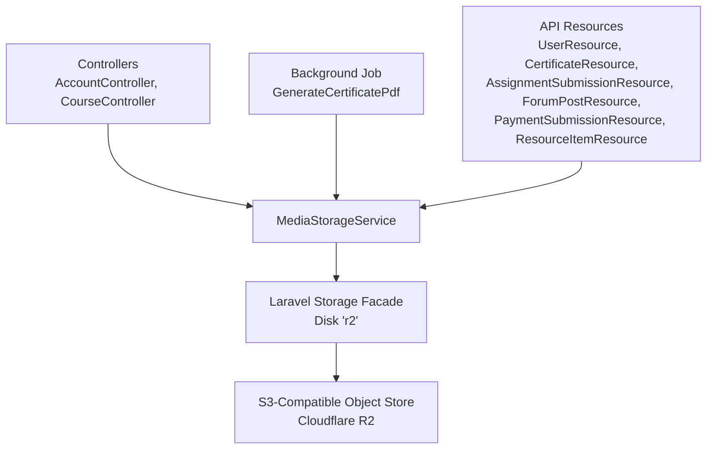
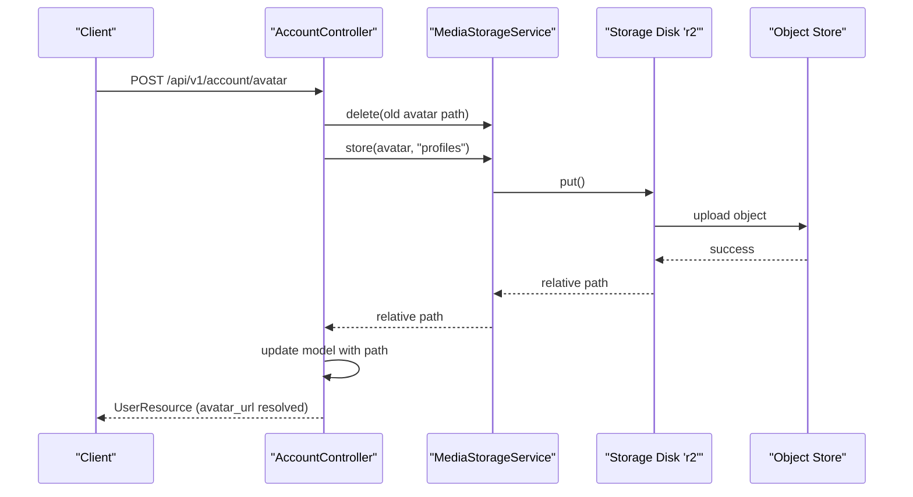
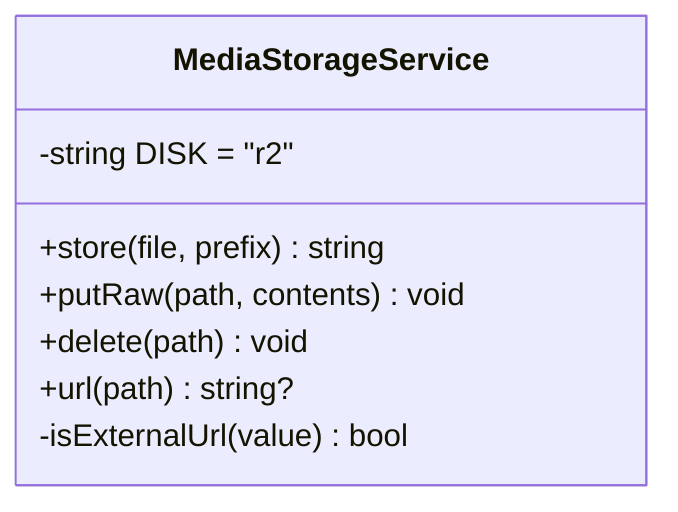
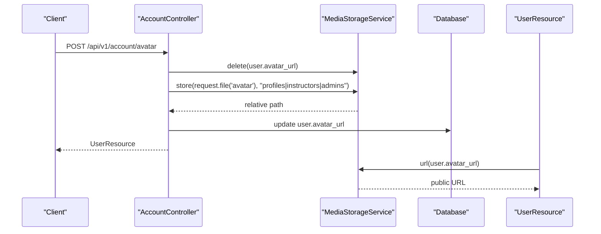
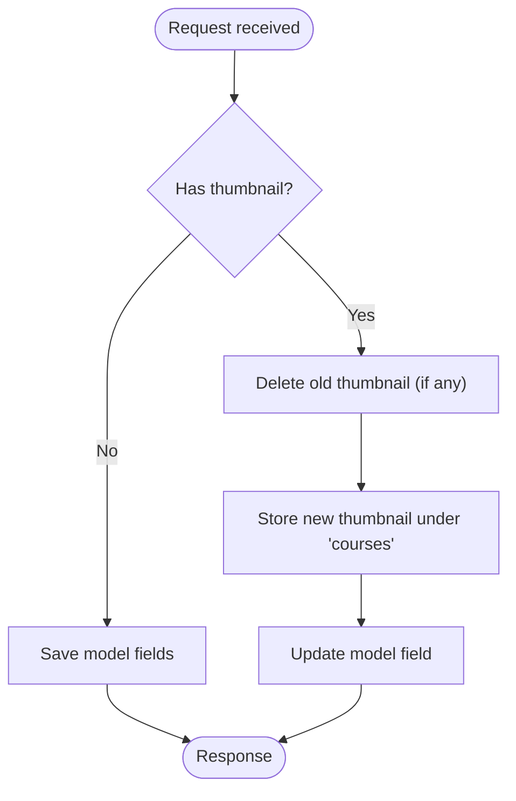
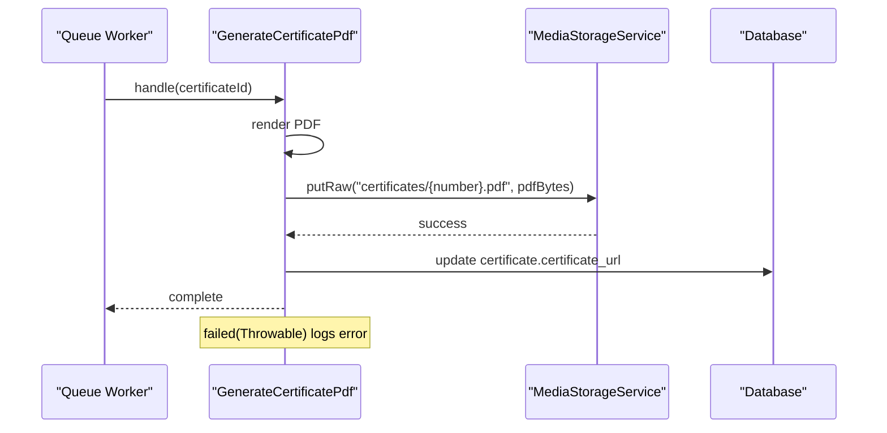
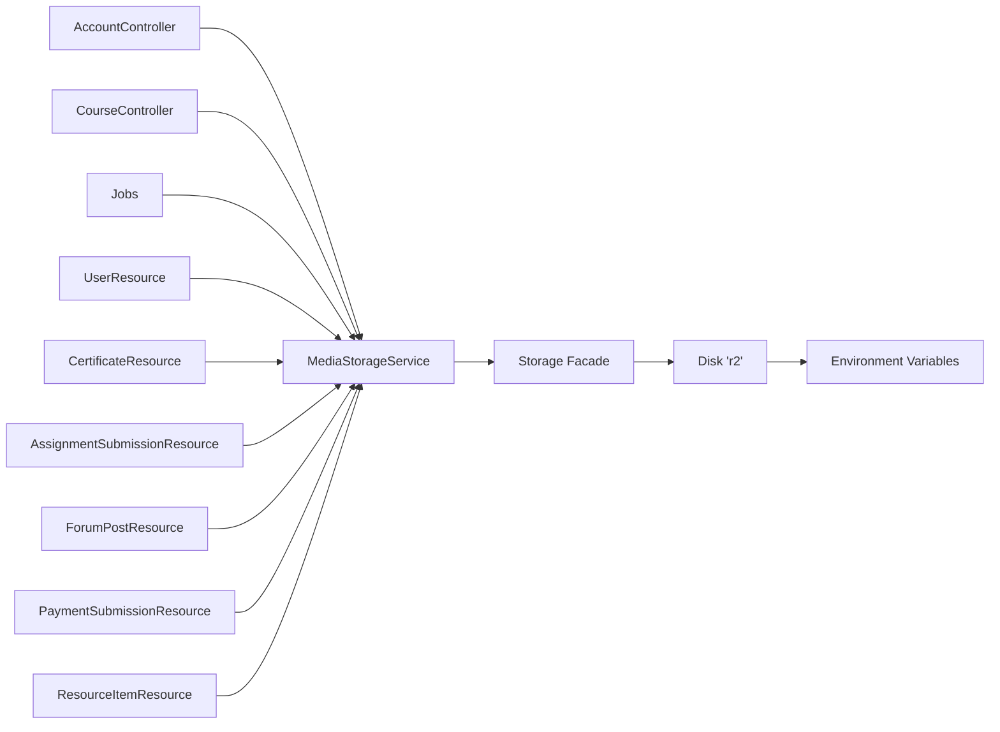

# AWS S3 Storage Integration

<cite>
**Referenced Files in This Document**
- [MediaStorageService.php](file://app/Services/Storage/MediaStorageService.php)
- [filesystems.php](file://config/filesystems.php)
- [AccountController.php](file://app/Http/Controllers/Api/V1/AccountController.php)
- [CourseController.php](file://app/Http/Controllers/Api/V1/CourseController.php)
- [GenerateCertificatePdf.php](file://app/Jobs/GenerateCertificatePdf.php)
- [UserResource.php](file://app/Http/Resources/UserResource.php)
- [CertificateResource.php](file://app/Http/Resources/CertificateResource.php)
- [AssignmentSubmissionResource.php](file://app/Http/Resources/AssignmentSubmissionResource.php)
- [ForumPostResource.php](file://app/Http/Resources/ForumPostResource.php)
- [PaymentSubmissionResource.php](file://app/Http/Resources/PaymentSubmissionResource.php)
- [ResourceItemResource.php](file://app/Http/Resources/ResourceItemResource.php)
- [test_upload.php](file://test_upload.php)
</cite>

## Table of Contents
1. [Introduction](#introduction)
2. [Project Structure](#project-structure)
3. [Core Components](#core-components)
4. [Architecture Overview](#architecture-overview)
5. [Detailed Component Analysis](#detailed-component-analysis)
6. [Dependency Analysis](#dependency-analysis)
7. [Performance Considerations](#performance-considerations)
8. [Troubleshooting Guide](#troubleshooting-guide)
9. [Conclusion](#conclusion)

## Introduction
This document explains how the ResNet Academy LMS integrates object storage for media assets. The application uses a unified service to abstract file operations and currently targets an S3-compatible disk configured as Cloudflare R2. Controllers, resources, and background jobs all interact with this service so uploads, deletions, and URL resolution are consistent across the system.

The primary goals covered here:
- Unified interface for storage via MediaStorageService
- Configuration of the S3-compatible disk (bucket, credentials, endpoint, region)
- File upload workflows for certificates, course materials, and user avatars
- Error handling strategies around network failures, permissions, and rate limits
- Service composition and dependency injection patterns
- Performance considerations such as CDN usage and caching

## Project Structure
The storage integration spans configuration, a central service, controllers that perform uploads, resources that resolve URLs, and a queued job that generates and stores certificate PDFs.

**Diagram sources**
- [MediaStorageService.php:24-85](file://app/Services/Storage/MediaStorageService.php#L24-L85)
- [filesystems.php:50-86](file://config/filesystems.php#L50-L86)
- [AccountController.php:52-72](file://app/Http/Controllers/Api/V1/AccountController.php#L52-L72)
- [CourseController.php:78-114](file://app/Http/Controllers/Api/V1/CourseController.php#L78-L114)
- [GenerateCertificatePdf.php:36-57](file://app/Jobs/GenerateCertificatePdf.php#L36-L57)
- [UserResource.php:16-36](file://app/Http/Resources/UserResource.php#L16-L36)
- [CertificateResource.php:16-28](file://app/Http/Resources/CertificateResource.php#L16-L28)

**Section sources**
- [MediaStorageService.php:11-23](file://app/Services/Storage/MediaStorageService.php#L11-L23)
- [filesystems.php:16-86](file://config/filesystems.php#L16-L86)

## Core Components
- MediaStorageService: Central abstraction for storing, deleting, and resolving URLs for files. It always works with relative paths internally and resolves public URLs at read time.
- Filesystem configuration: Defines the default disk and multiple disks including an S3-compatible disk named r2 used by the service.
- Controllers: Use dependency injection to obtain MediaStorageService for avatar and thumbnail uploads.
- API Resources: Resolve stored paths to public URLs when serializing responses.
- Background Job: Generates certificate PDFs and persists them using the service.

Key behaviors:
- store(file, prefix): Uploads a file under a prefix and returns a relative path. Throws on failure.
- putRaw(path, contents): Writes raw bytes (used for generated PDFs).
- delete(path): Safely deletes only owned relative paths; ignores null/empty or external URLs.
- url(path): Returns a public URL; passes through external URLs unchanged.

**Section sources**
- [MediaStorageService.php:28-79](file://app/Services/Storage/MediaStorageService.php#L28-L79)
- [filesystems.php:50-86](file://config/filesystems.php#L50-L86)

## Architecture Overview
The architecture follows a clear separation:
- Controllers accept requests and delegate storage to MediaStorageService.
- Resources transform models into JSON, resolving storage paths to URLs.
- Queued jobs generate content and persist it via the same service.
- The underlying disk is S3-compatible and configured for Cloudflare R2.

**Diagram sources**
- [AccountController.php:52-72](file://app/Http/Controllers/Api/V1/AccountController.php#L52-L72)
- [MediaStorageService.php:28-79](file://app/Services/Storage/MediaStorageService.php#L28-L79)
- [filesystems.php:75-86](file://config/filesystems.php#L75-L86)

## Detailed Component Analysis

### MediaStorageService
Responsibilities:
- Encapsulates disk selection and URL resolution logic.
- Normalizes behavior for both local paths and external URLs.
- Provides safe deletion semantics.

Implementation highlights:
- Uses a single disk constant to avoid scattered disk names.
- Throws a runtime exception on upload failure to fail fast.
- Detects external URLs to avoid accidental deletion or rewrites.

**Diagram sources**
- [MediaStorageService.php:24-85](file://app/Services/Storage/MediaStorageService.php#L24-L85)

**Section sources**
- [MediaStorageService.php:28-85](file://app/Services/Storage/MediaStorageService.php#L28-L85)

### Filesystem Configuration (S3-compatible disk)
The application defines an S3-compatible disk named r2. It configures:
- Driver: s3
- Credentials: access key and secret
- Region: auto (documented for R2)
- Bucket: from environment
- Public URL base: from environment
- Endpoint: private S3 API endpoint
- Path-style endpoints: enabled

This disk is used exclusively by MediaStorageService.

**Section sources**
- [filesystems.php:50-86](file://config/filesystems.php#L50-L86)

### Avatar Upload Workflow
Flow:
- Controller validates request and determines role-based prefix.
- Deletes previous avatar if present.
- Stores new avatar under the appropriate prefix.
- Persists relative path to the user model.
- Response resource resolves the path to a public URL.

**Diagram sources**
- [AccountController.php:52-72](file://app/Http/Controllers/Api/V1/AccountController.php#L52-L72)
- [UserResource.php:16-36](file://app/Http/Resources/UserResource.php#L16-L36)
- [MediaStorageService.php:28-79](file://app/Services/Storage/MediaStorageService.php#L28-L79)

**Section sources**
- [AccountController.php:52-72](file://app/Http/Controllers/Api/V1/AccountController.php#L52-L72)
- [UserResource.php:16-36](file://app/Http/Resources/UserResource.php#L16-L36)

### Course Thumbnail Upload Workflow
Flow:
- On create/update, controller checks for a thumbnail file.
- If provided, stores under the courses prefix and updates the model.
- On update, deletes the old thumbnail before storing the new one.
- Response resource resolves the thumbnail URL.

**Diagram sources**
- [CourseController.php:78-114](file://app/Http/Controllers/Api/V1/CourseController.php#L78-L114)
- [MediaStorageService.php:28-79](file://app/Services/Storage/MediaStorageService.php#L28-L79)

**Section sources**
- [CourseController.php:78-114](file://app/Http/Controllers/Api/V1/CourseController.php#L78-L114)

### Certificate Generation and Storage
Flow:
- A queued job renders a PDF view.
- Writes the PDF bytes to the storage disk under a certificates prefix.
- Updates the certificate record with the relative path.
- On failure, logs error details.

**Diagram sources**
- [GenerateCertificatePdf.php:36-65](file://app/Jobs/GenerateCertificatePdf.php#L36-L65)
- [MediaStorageService.php:43-49](file://app/Services/Storage/MediaStorageService.php#L43-L49)

**Section sources**
- [GenerateCertificatePdf.php:36-65](file://app/Jobs/GenerateCertificatePdf.php#L36-L65)

### URL Resolution in API Resources
Resources consistently call MediaStorageService::url() to convert stored paths to public URLs. This includes:
- User avatars
- Certificates
- Assignment submissions
- Forum post attachments
- Payment receipts
- Resource items

This ensures a single source of truth for URL generation and supports both internal paths and external URLs.

**Section sources**
- [UserResource.php:16-36](file://app/Http/Resources/UserResource.php#L16-L36)
- [CertificateResource.php:16-28](file://app/Http/Resources/CertificateResource.php#L16-L28)
- [AssignmentSubmissionResource.php:1-30](file://app/Http/Resources/AssignmentSubmissionResource.php#L1-L30)
- [ForumPostResource.php:1-30](file://app/Http/Resources/ForumPostResource.php#L1-L30)
- [PaymentSubmissionResource.php:1-30](file://app/Http/Resources/PaymentSubmissionResource.php#L1-L30)
- [ResourceItemResource.php:1-70](file://app/Http/Resources/ResourceItemResource.php#L1-L70)

## Dependency Analysis
- Controllers depend on MediaStorageService via constructor injection.
- Resources depend on MediaStorageService via app() resolution to resolve URLs.
- The service depends on Laravel’s Storage facade and the configured r2 disk.
- The r2 disk depends on environment variables for credentials, bucket, endpoint, and URL.

**Diagram sources**
- [AccountController.php:52-72](file://app/Http/Controllers/Api/V1/AccountController.php#L52-L72)
- [CourseController.php:78-114](file://app/Http/Controllers/Api/V1/CourseController.php#L78-L114)
- [GenerateCertificatePdf.php:36-57](file://app/Jobs/GenerateCertificatePdf.php#L36-L57)
- [UserResource.php:16-36](file://app/Http/Resources/UserResource.php#L16-L36)
- [CertificateResource.php:16-28](file://app/Http/Resources/CertificateResource.php#L16-L28)
- [filesystems.php:75-86](file://config/filesystems.php#L75-L86)

**Section sources**
- [filesystems.php:75-86](file://config/filesystems.php#L75-L86)

## Performance Considerations
- CDN-backed URLs: The r2 disk’s public URL base is configured via environment variables, enabling CDN delivery for static assets like avatars and thumbnails.
- Read-time URL resolution: Storing relative paths and resolving URLs at response time allows easy rotation of domains or CDN endpoints without data migration.
- Background processing: Certificate PDF generation runs in a queue to avoid blocking requests.
- Minimal client-side work: Clients send files directly to the API; the server handles storage and URL resolution.

[No sources needed since this section provides general guidance]

## Troubleshooting Guide
Common issues and strategies:
- Network failures during upload: The service throws a runtime exception when store() fails. Wrap calls in try/catch where appropriate and return meaningful errors to clients.
- Permission issues: Ensure the configured credentials have write permissions to the bucket and correct object ACLs for public reads.
- Rate limiting: If the object store enforces rate limits, consider retrying with backoff in higher-level code or queuing heavy operations.
- Misconfigured endpoint or URL: Verify environment variables for endpoint, bucket, and public URL. A small probe script can help validate connectivity.

Verification tip:
- Use the provided probe script to test the r2 disk with throw mode enabled to surface low-level SDK errors.

**Section sources**
- [MediaStorageService.php:32-41](file://app/Services/Storage/MediaStorageService.php#L32-L41)
- [filesystems.php:75-86](file://config/filesystems.php#L75-L86)
- [test_upload.php:1-19](file://test_upload.php#L1-L19)

## Conclusion
The ResNet Academy LMS centralizes storage interactions through MediaStorageService, which abstracts S3-compatible object storage behind a simple interface. Controllers and resources use this service to ensure consistent upload, deletion, and URL resolution. The configuration points to an S3-compatible disk (currently Cloudflare R2), making it straightforward to switch providers by updating environment variables. For robustness, leverage background jobs for heavy tasks, rely on CDN-backed URLs for performance, and implement retries and logging around storage operations to handle transient failures gracefully.