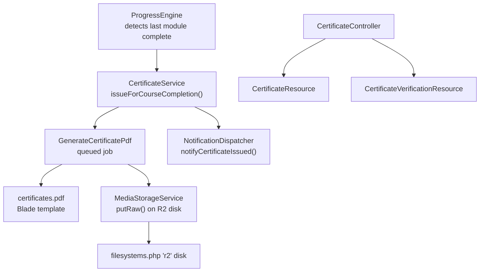
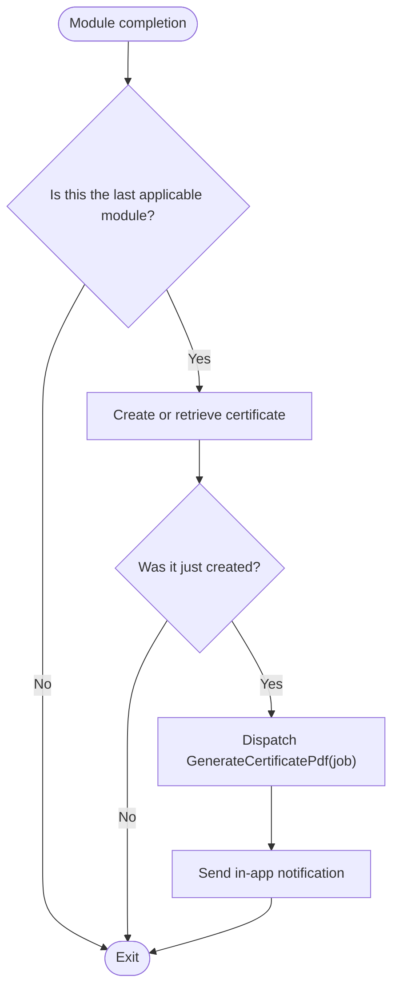
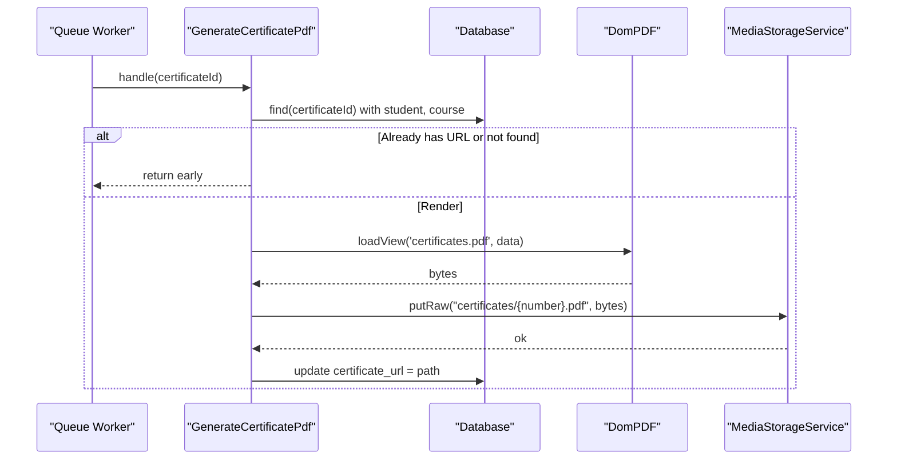
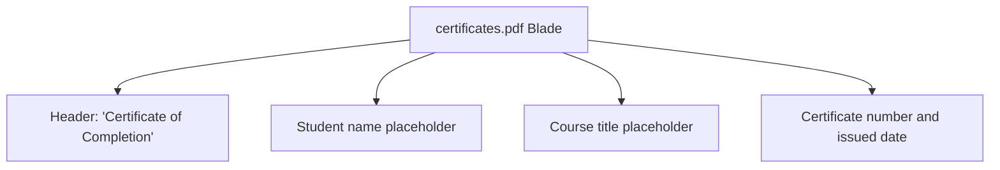
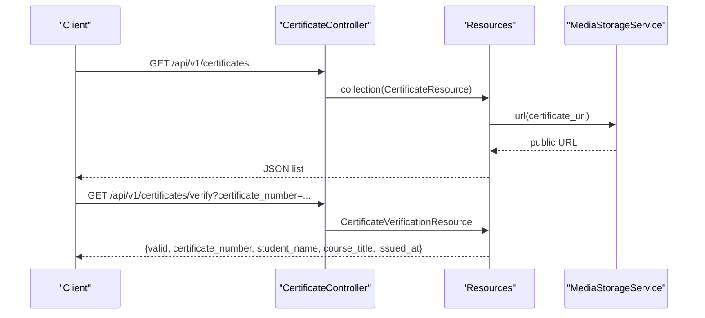
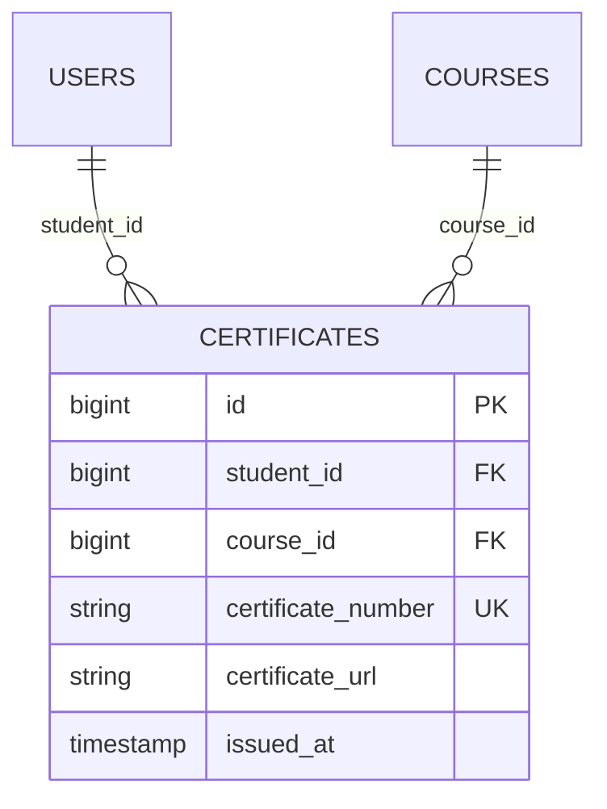
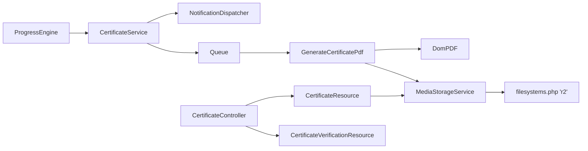

# Certificate Generation System

<cite>
**Referenced Files in This Document**
- [CertificateService.php](file://app/Services/Certification/CertificateService.php)
- [GenerateCertificatePdf.php](file://app/Jobs/GenerateCertificatePdf.php)
- [pdf.blade.php](file://resources/views/certificates/pdf.blade.php)
- [MediaStorageService.php](file://app/Services/Storage/MediaStorageService.php)
- [filesystems.php](file://config/filesystems.php)
- [CertificateController.php](file://app/Http/Controllers/Api/V1/CertificateController.php)
- [CertificateResource.php](file://app/Http/Resources/CertificateResource.php)
- [CertificateVerificationResource.php](file://app/Http/Resources/CertificateVerificationResource.php)
- [ProgressEngine.php](file://app/Services/Progress/ProgressEngine.php)
- [NotificationDispatcher.php](file://app/Services/Notifications/NotificationDispatcher.php)
- [Certificate.php](file://app/Models/Certificate.php)
- [2024_01_01_000160_create_certificates_table.php](file://database/migrations/2024_01_01_000160_create_certificates_table.php)
</cite>

## Table of Contents
1. Introduction
2. Project Structure
3. Core Components
4. Architecture Overview
5. Detailed Component Analysis
6. Dependency Analysis
7. Performance Considerations
8. Troubleshooting Guide
9. Conclusion
10. Appendices

## Introduction
This document explains the certificate generation system that uses DomPDF to produce downloadable completion certificates for learners. It covers the end-to-end workflow from detecting course completion to generating and storing PDFs, the template structure and dynamic content insertion, background job processing, customization options, error handling, memory considerations, storage optimization, and how to extend the system with custom templates and verification features.

## Project Structure
The certificate feature spans models, services, jobs, views, controllers, resources, configuration, and migrations:
- Model and migration define the certificate entity and storage fields.
- A service orchestrates issuance when a learner completes the last module.
- A queued job renders the PDF using DomPDF and stores it via a centralized storage service.
- Blade template defines the visual layout and placeholders for dynamic data.
- API controller and resources expose listing, retrieval, and public verification endpoints.
- Configuration centralizes object storage (Cloudflare R2) used for all media including certificates.



**Diagram sources**
- [ProgressEngine.php:126-151](file://app/Services/Progress/ProgressEngine.php#L126-L151)
- [CertificateService.php:23-35](file://app/Services/Certification/CertificateService.php#L23-L35)
- [GenerateCertificatePdf.php:36-57](file://app/Jobs/GenerateCertificatePdf.php#L36-L57)
- [pdf.blade.php:1-28](file://resources/views/certificates/pdf.blade.php#L1-L28)
- [MediaStorageService.php:46-49](file://app/Services/Storage/MediaStorageService.php#L46-L49)
- [filesystems.php:75-86](file://config/filesystems.php#L75-L86)
- [CertificateController.php:16-46](file://app/Http/Controllers/Api/V1/CertificateController.php#L16-L46)
- [CertificateResource.php:16-29](file://app/Http/Resources/CertificateResource.php#L16-L29)
- [CertificateVerificationResource.php:20-29](file://app/Http/Resources/CertificateVerificationResource.php#L20-L29)

**Section sources**
- [ProgressEngine.php:126-151](file://app/Services/Progress/ProgressEngine.php#L126-L151)
- [CertificateService.php:23-35](file://app/Services/Certification/CertificateService.php#L23-L35)
- [GenerateCertificatePdf.php:36-57](file://app/Jobs/GenerateCertificatePdf.php#L36-L57)
- [pdf.blade.php:1-28](file://resources/views/certificates/pdf.blade.php#L1-L28)
- [MediaStorageService.php:46-49](file://app/Services/Storage/MediaStorageService.php#L46-L49)
- [filesystems.php:75-86](file://config/filesystems.php#L75-L86)
- [CertificateController.php:16-46](file://app/Http/Controllers/Api/V1/CertificateController.php#L16-L46)
- [CertificateResource.php:16-29](file://app/Http/Resources/CertificateResource.php#L16-L29)
- [CertificateVerificationResource.php:20-29](file://app/Http/Resources/CertificateVerificationResource.php#L20-L29)

## Core Components
- Certificate model and schema: Stores student, course, unique certificate number, issued timestamp, and optional URL to the generated PDF. Unique constraints ensure one certificate per student-course pair and globally unique numbers.
- CertificateService: Creates or retrieves a certificate record synchronously upon course completion and dispatches an asynchronous PDF generation job plus a notification.
- GenerateCertificatePdf job: Loads the Blade view with dynamic data, renders PDF via DomPDF, stores the file to object storage, and updates the certificate record with the stored path.
- MediaStorageService: Centralized abstraction over object storage (R2), providing putRaw for server-generated files and url resolution for relative paths.
- CertificateController and Resources: Provide authenticated listing/retrieval and a public verification endpoint returning minimal, safe information about a certificate.
- NotificationDispatcher: Emits an in-app notification when a certificate is issued.

**Section sources**
- [Certificate.php:12-45](file://app/Models/Certificate.php#L12-L45)
- [2024_01_01_000160_create_certificates_table.php:13-22](file://database/migrations/2024_01_01_000160_create_certificates_table.php#L13-L22)
- [CertificateService.php:23-45](file://app/Services/Certification/CertificateService.php#L23-L45)
- [GenerateCertificatePdf.php:36-65](file://app/Jobs/GenerateCertificatePdf.php#L36-L65)
- [MediaStorageService.php:24-79](file://app/Services/Storage/MediaStorageService.php#L24-L79)
- [CertificateController.php:16-46](file://app/Http/Controllers/Api/V1/CertificateController.php#L16-L46)
- [CertificateResource.php:16-29](file://app/Http/Resources/CertificateResource.php#L16-L29)
- [CertificateVerificationResource.php:20-29](file://app/Http/Resources/CertificateVerificationResource.php#L20-L29)
- [NotificationDispatcher.php:66-76](file://app/Services/Notifications/NotificationDispatcher.php#L66-L76)

## Architecture Overview
The system decouples business triggers from heavy work:
- Completion detection: The progress engine determines when a learner completes the final applicable module.
- Issuance: A service creates a certificate record and dispatches a background job; notifications are sent immediately.
- Rendering: A queued job renders the PDF using DomPDF against a Blade template and stores it to object storage.
- Access: Controllers serve certificate listings and a public verification endpoint.

```mermaid
sequenceDiagram
participant PE as "ProgressEngine"
participant CS as "CertificateService"
participant Q as "Queue"
participant J as "GenerateCertificatePdf"
participant V as "Blade Template"
participant MS as "MediaStorageService"
participant DB as "Certificates table"
PE->>CS : issueForCourseCompletion(student, course)
CS->>DB : firstOrCreate(certificate)
CS-->>PE : Certificate
CS->>Q : dispatch GenerateCertificatePdf(id)
CS->>CS : notifyCertificateIssued()
Note over CS : Notification is immediate; PDF is async
Q-->>J : handle(certificateId)
J->>DB : load certificate + relations
J->>V : render with studentName, courseTitle, certificateNumber, issuedAt
J->>MS : putRaw("certificates/{number}.pdf", pdfBytes)
MS-->>J : success
J->>DB : update certificate_url = path
```

**Diagram sources**
- [ProgressEngine.php:126-151](file://app/Services/Progress/ProgressEngine.php#L126-L151)
- [CertificateService.php:23-35](file://app/Services/Certification/CertificateService.php#L23-L35)
- [GenerateCertificatePdf.php:36-57](file://app/Jobs/GenerateCertificatePdf.php#L36-L57)
- [pdf.blade.php:15-24](file://resources/views/certificates/pdf.blade.php#L15-L24)
- [MediaStorageService.php:46-49](file://app/Services/Storage/MediaStorageService.php#L46-L49)
- [2024_01_01_000160_create_certificates_table.php:13-22](file://database/migrations/2024_01_01_000160_create_certificates_table.php#L13-L22)

## Detailed Component Analysis

### Certificate Service and Triggering
- Triggers when the last applicable module completes for a student.
- Ensures exactly-once issuance by creating or retrieving a certificate row synchronously.
- Dispatches a background job to generate the PDF and sends a notification without blocking the request.



**Diagram sources**
- [ProgressEngine.php:126-151](file://app/Services/Progress/ProgressEngine.php#L126-L151)
- [CertificateService.php:23-35](file://app/Services/Certification/CertificateService.php#L23-L35)
- [NotificationDispatcher.php:66-76](file://app/Services/Notifications/NotificationDispatcher.php#L66-L76)

**Section sources**
- [ProgressEngine.php:126-151](file://app/Services/Progress/ProgressEngine.php#L126-L151)
- [CertificateService.php:23-45](file://app/Services/Certification/CertificateService.php#L23-L45)
- [NotificationDispatcher.php:66-76](file://app/Services/Notifications/NotificationDispatcher.php#L66-L76)

### Background Job: PDF Generation and Storage
- Loads the certificate with related student and course.
- Renders the Blade template into a PDF using DomPDF.
- Stores the binary output to object storage under a deterministic path based on the certificate number.
- Updates the certificate record with the stored path.
- Implements uniqueness to prevent duplicate rendering on retries.



**Diagram sources**
- [GenerateCertificatePdf.php:36-57](file://app/Jobs/GenerateCertificatePdf.php#L36-L57)
- [pdf.blade.php:15-24](file://resources/views/certificates/pdf.blade.php#L15-L24)
- [MediaStorageService.php:46-49](file://app/Services/Storage/MediaStorageService.php#L46-L49)

**Section sources**
- [GenerateCertificatePdf.php:36-65](file://app/Jobs/GenerateCertificatePdf.php#L36-L65)
- [MediaStorageService.php:46-49](file://app/Services/Storage/MediaStorageService.php#L46-L49)

### PDF Template Structure and Dynamic Content
- The Blade template defines a bordered layout with headings, student name, course title, certificate number, and issued date.
- Dynamic variables are injected by the job: student name, course title, certificate number, and formatted issue date.
- Styling is inline CSS suitable for PDF rendering.



**Diagram sources**
- [pdf.blade.php:15-24](file://resources/views/certificates/pdf.blade.php#L15-L24)

**Section sources**
- [pdf.blade.php:1-28](file://resources/views/certificates/pdf.blade.php#L1-L28)
- [GenerateCertificatePdf.php:44-49](file://app/Jobs/GenerateCertificatePdf.php#L44-L49)

### API and Verification
- Authenticated endpoints list and show certificates for the current user.
- Public verification endpoint accepts a certificate number and returns minimal details to confirm authenticity.
- Resources resolve storage URLs and format timestamps consistently.



**Diagram sources**
- [CertificateController.php:16-46](file://app/Http/Controllers/Api/V1/CertificateController.php#L16-L46)
- [CertificateResource.php:16-29](file://app/Http/Resources/CertificateResource.php#L16-L29)
- [CertificateVerificationResource.php:20-29](file://app/Http/Resources/CertificateVerificationResource.php#L20-L29)
- [MediaStorageService.php:68-79](file://app/Services/Storage/MediaStorageService.php#L68-L79)

**Section sources**
- [CertificateController.php:16-46](file://app/Http/Controllers/Api/V1/CertificateController.php#L16-L46)
- [CertificateResource.php:16-29](file://app/Http/Resources/CertificateResource.php#L16-L29)
- [CertificateVerificationResource.php:20-29](file://app/Http/Resources/CertificateVerificationResource.php#L20-L29)

### Data Model and Schema
- The certificates table stores relationships to users and courses, a unique certificate number, an optional URL to the PDF, and an issued timestamp.
- Unique constraints enforce one certificate per student-course pair and globally unique numbers.



**Diagram sources**
- [2024_01_01_000160_create_certificates_table.php:13-22](file://database/migrations/2024_01_01_000160_create_certificates_table.php#L13-L22)

**Section sources**
- [2024_01_01_000160_create_certificates_table.php:13-22](file://database/migrations/2024_01_01_000160_create_certificates_table.php#L13-L22)
- [Certificate.php:12-45](file://app/Models/Certificate.php#L12-L45)

## Dependency Analysis
- ProgressEngine depends on CertificateService to trigger issuance at the right time.
- CertificateService depends on NotificationDispatcher for immediate feedback and on the queue to offload PDF rendering.
- GenerateCertificatePdf depends on DomPDF (via facade), MediaStorageService, and the database.
- MediaStorageService abstracts filesystem configuration (R2 disk).
- CertificateController and Resources depend on MediaStorageService to resolve public URLs.



**Diagram sources**
- [ProgressEngine.php:126-151](file://app/Services/Progress/ProgressEngine.php#L126-L151)
- [CertificateService.php:23-35](file://app/Services/Certification/CertificateService.php#L23-L35)
- [GenerateCertificatePdf.php:36-57](file://app/Jobs/GenerateCertificatePdf.php#L36-L57)
- [MediaStorageService.php:24-79](file://app/Services/Storage/MediaStorageService.php#L24-L79)
- [filesystems.php:75-86](file://config/filesystems.php#L75-L86)
- [CertificateController.php:16-46](file://app/Http/Controllers/Api/V1/CertificateController.php#L16-L46)
- [CertificateResource.php:16-29](file://app/Http/Resources/CertificateResource.php#L16-L29)
- [CertificateVerificationResource.php:20-29](file://app/Http/Resources/CertificateVerificationResource.php#L20-L29)

**Section sources**
- [ProgressEngine.php:126-151](file://app/Services/Progress/ProgressEngine.php#L126-L151)
- [CertificateService.php:23-35](file://app/Services/Certification/CertificateService.php#L23-L35)
- [GenerateCertificatePdf.php:36-57](file://app/Jobs/GenerateCertificatePdf.php#L36-L57)
- [MediaStorageService.php:24-79](file://app/Services/Storage/MediaStorageService.php#L24-L79)
- [filesystems.php:75-86](file://config/filesystems.php#L75-L86)
- [CertificateController.php:16-46](file://app/Http/Controllers/Api/V1/CertificateController.php#L16-L46)
- [CertificateResource.php:16-29](file://app/Http/Resources/CertificateResource.php#L16-L29)
- [CertificateVerificationResource.php:20-29](file://app/Http/Resources/CertificateVerificationResource.php#L20-L29)

## Performance Considerations
- Offloading rendering: PDF generation runs in a background job to avoid blocking user requests.
- Idempotency: The job implements uniqueness keyed by certificate ID to prevent duplicate renders on retries.
- Storage efficiency: Certificates are stored as compact PDFs under deterministic paths; URLs are resolved lazily via the storage service.
- Memory management: For large or complex templates, consider reducing image sizes, avoiding heavy assets, and ensuring adequate PHP memory limits for PDF rendering. Monitor job execution times and memory usage.
- Queue tuning: Adjust concurrency and backoff settings to balance throughput and resource consumption.

[No sources needed since this section provides general guidance]

## Troubleshooting Guide
- Missing certificate URL: If a certificate shows no URL, verify that the background job processed successfully and that object storage credentials and bucket configuration are correct.
- Duplicate PDF generation: The job’s uniqueness prevents duplicates; if you see multiple attempts, check queue retry behavior and ensure the job remains unique per certificate.
- Rendering failures: Inspect job logs for errors during PDF rendering. Validate that the Blade template contains only supported HTML/CSS for DomPDF.
- Storage issues: Confirm the configured disk is reachable and writable. Verify environment variables for the object storage provider.
- Verification endpoint errors: Ensure the certificate number exists and matches the unique constraint.

**Section sources**
- [GenerateCertificatePdf.php:59-65](file://app/Jobs/GenerateCertificatePdf.php#L59-L65)
- [MediaStorageService.php:46-49](file://app/Services/Storage/MediaStorageService.php#L46-L49)
- [filesystems.php:75-86](file://config/filesystems.php#L75-L86)
- [CertificateController.php:38-46](file://app/Http/Controllers/Api/V1/CertificateController.php#L38-L46)

## Conclusion
The certificate generation system cleanly separates concerns: completion detection triggers issuance, a service ensures consistent state and notifies users, and a background job handles heavy PDF rendering and storage. The design supports extensibility through templating and storage abstraction, while maintaining performance and reliability via queuing, idempotency, and centralized storage.

[No sources needed since this section summarizes without analyzing specific files]

## Appendices

### Customization Options
- Template styling: Modify the Blade template to adjust fonts, colors, borders, and layout. Keep styles compatible with DomPDF.
- Branding elements: Add logos or headers to the template; ensure images are optimized for PDF size.
- Additional fields: Extend the template variables passed by the job to include extra metadata such as instructor name or completion date formats.
- Verification enhancements: Extend the verification resource to include additional non-sensitive fields if desired.

[No sources needed since this section provides general guidance]

### Extending the System
- Custom templates: Create new Blade views and route the job to use them conditionally based on course or organization.
- Additional verification features: Add signature validation or QR codes to the template and verification response.
- Multi-disk support: Use the storage service to switch disks or add prefixes for different environments.

[No sources needed since this section provides general guidance]