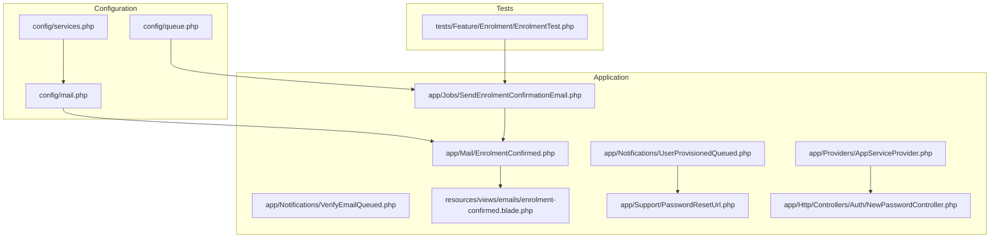
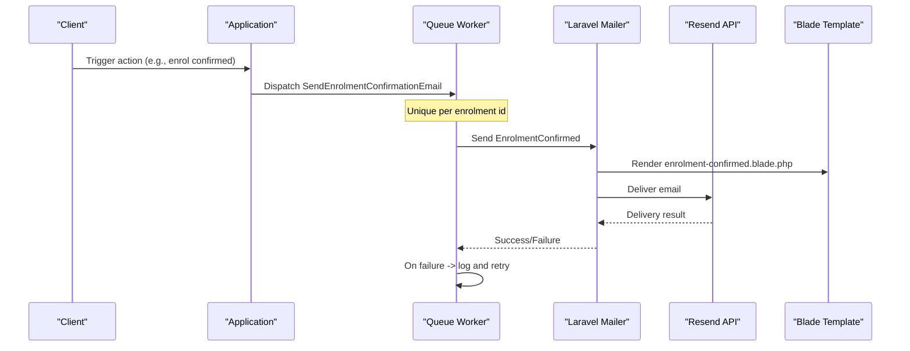
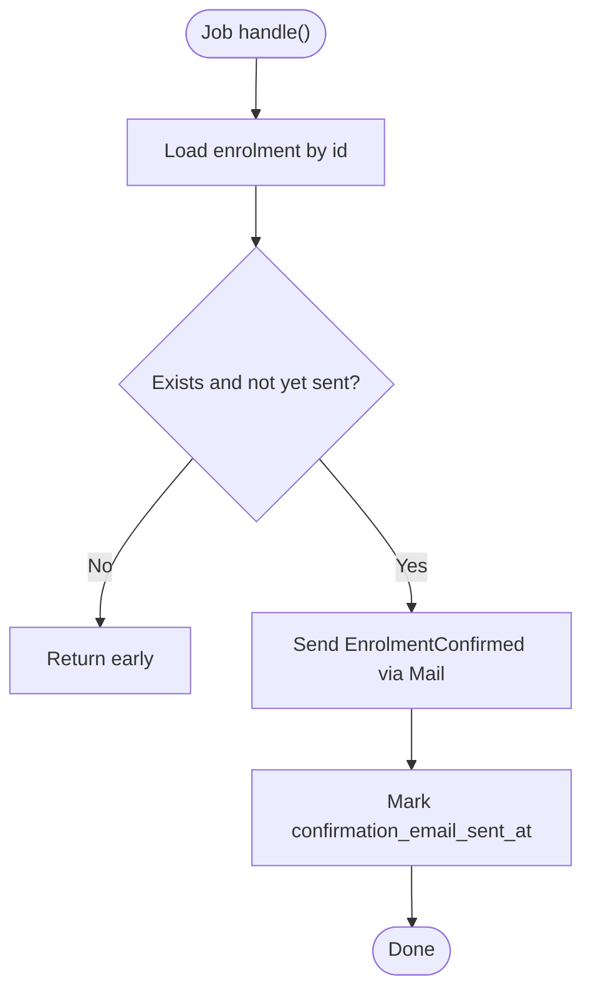
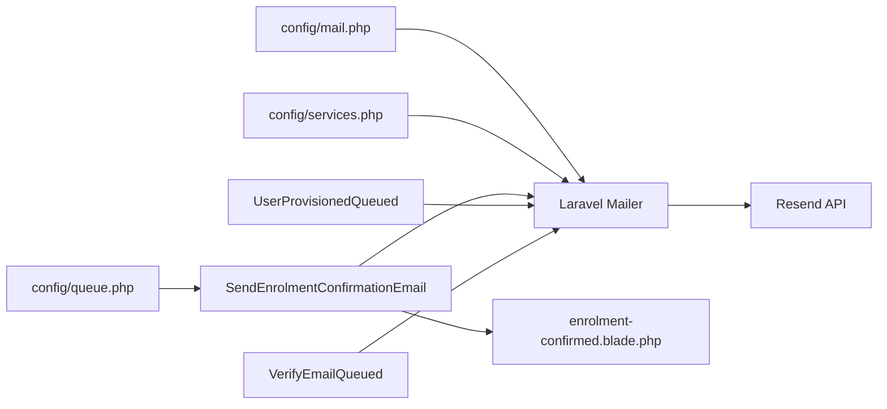

# Email Service Integration (Resend)

<cite>
**Referenced Files in This Document**
- [mail.php](file://config/mail.php)
- [services.php](file://config/services.php)
- [queue.php](file://config/queue.php)
- [EnrolmentConfirmed.php](file://app/Mail/EnrolmentConfirmed.php)
- [enrolment-confirmed.blade.php](file://resources/views/emails/enrolment-confirmed.blade.php)
- [SendEnrolmentConfirmationEmail.php](file://app/Jobs/SendEnrolmentConfirmationEmail.php)
- [UserProvisionedQueued.php](file://app/Notifications/UserProvisionedQueued.php)
- [VerifyEmailQueued.php](file://app/Notifications/VerifyEmailQueued.php)
- [AppServiceProvider.php](file://app/Providers/AppServiceProvider.php)
- [PasswordResetUrl.php](file://app/Support/PasswordResetUrl.php)
- [NewPasswordController.php](file://app/Http/Controllers/Auth/NewPasswordController.php)
- [EnrolmentTest.php](file://tests/Feature/Enrolment/EnrolmentTest.php)
</cite>

## Table of Contents
1. Introduction
2. Project Structure
3. Core Components
4. Architecture Overview
5. Detailed Component Analysis
6. Dependency Analysis
7. Performance Considerations
8. Troubleshooting Guide
9. Conclusion
10. Appendices

## Introduction
This document explains how ResNet Academy LMS integrates email delivery using the Resend API through Laravel’s mail system. It covers configuration, template management, personalization variables, asynchronous sending via queues, error handling and retries, and testing strategies for email functionality. The implementation uses:
- A dedicated resend mailer transport
- Environment-based API key configuration
- Mailables and Blade templates for content
- Queues to avoid request-time failures
- Notifications for password reset and account provisioning flows
- Tests that assert email dispatch behavior

## Project Structure
The email subsystem spans configuration, services, jobs, notifications, views, and tests:
- Configuration defines the default mailer and available transports, including resend.
- Services provide third-party credentials such as the Resend API key.
- Jobs encapsulate async email sending with retry and idempotency.
- Notifications handle password reset and verification emails.
- Views define HTML email templates with personalization variables.
- Tests verify queuing and email dispatch without actually sending.

**Diagram sources**
- [mail.php:17-66](file://config/mail.php#L17-L66)
- [services.php:21-23](file://config/services.php#L21-L23)
- [queue.php:16-44](file://config/queue.php#L16-L44)
- [EnrolmentConfirmed.php:14-30](file://app/Mail/EnrolmentConfirmed.php#L14-L30)
- [SendEnrolmentConfirmationEmail.php:22-48](file://app/Jobs/SendEnrolmentConfirmationEmail.php#L22-L48)
- [UserProvisionedQueued.php:21-47](file://app/Notifications/UserProvisionedQueued.php#L21-L47)
- [VerifyEmailQueued.php:18-21](file://app/Notifications/VerifyEmailQueued.php#L18-L21)
- [enrolment-confirmed.blade.php:1-17](file://resources/views/emails/enrolment-confirmed.blade.php#L1-L17)
- [AppServiceProvider.php:22-30](file://app/Providers/AppServiceProvider.php#L22-L30)
- [PasswordResetUrl.php:13-19](file://app/Support/PasswordResetUrl.php#L13-L19)
- [NewPasswordController.php:21-41](file://app/Http/Controllers/Auth/NewPasswordController.php#L21-L41)
- [EnrolmentTest.php:73-83](file://tests/Feature/Enrolment/EnrolmentTest.php#L73-L83)

**Section sources**
- [mail.php:17-66](file://config/mail.php#L17-L66)
- [services.php:21-23](file://config/services.php#L21-L23)
- [queue.php:16-44](file://config/queue.php#L16-L44)

## Core Components
- Resend mailer transport is configured and can be selected as the default or explicit mailer.
- Resend API key is sourced from environment variables into service configuration.
- Enrolment confirmation is implemented as a queued job that sends a Mailable backed by a Blade template.
- Password reset and verification emails are sent via queued notifications with centralized URL generation.
- Queue backend is configurable; database queue is used by default with retry and failure tables.

Key responsibilities:
- Configuration: select transport, set global “from” address, and load provider keys.
- Jobs: ensure idempotent sending, mark when sent, and log failures.
- Notifications: build user-facing messages for password setup/reset and email verification.
- Templates: render personalized HTML emails using model data.
- Testing: assert that emails are queued/sent without network calls.

**Section sources**
- [mail.php:17-66](file://config/mail.php#L17-L66)
- [services.php:21-23](file://config/services.php#L21-L23)
- [EnrolmentConfirmed.php:14-30](file://app/Mail/EnrolmentConfirmed.php#L14-L30)
- [SendEnrolmentConfirmationEmail.php:22-56](file://app/Jobs/SendEnrolmentConfirmationEmail.php#L22-L56)
- [UserProvisionedQueued.php:21-47](file://app/Notifications/UserProvisionedQueued.php#L21-L47)
- [VerifyEmailQueued.php:18-21](file://app/Notifications/VerifyEmailQueued.php#L18-L21)
- [queue.php:16-44](file://config/queue.php#L16-L44)

## Architecture Overview
The email flow combines Laravel’s mail abstraction with Resend as the transport. Business logic triggers either a Mailable (for enrolment confirmations) or a Notification (for password reset/verification). All email-sending paths are decoupled from HTTP requests via queues to improve reliability and performance.

**Diagram sources**
- [SendEnrolmentConfirmationEmail.php:22-56](file://app/Jobs/SendEnrolmentConfirmationEmail.php#L22-L56)
- [EnrolmentConfirmed.php:14-30](file://app/Mail/EnrolmentConfirmed.php#L14-L30)
- [enrolment-confirmed.blade.php:1-17](file://resources/views/emails/enrolment-confirmed.blade.php#L1-L17)
- [mail.php:17-66](file://config/mail.php#L17-L66)
- [services.php:21-23](file://config/services.php#L21-L23)
- [queue.php:16-44](file://config/queue.php#L16-L44)

## Detailed Component Analysis

### Resend Configuration and Transport
- Default mailer and available transports are defined in the mail configuration, including resend.
- Global “from” address and name are set via environment variables.
- Resend API key is loaded from environment into service configuration for the resend transport.

Operational notes:
- Switch the default mailer to resend in production.
- Ensure RESEND_API_KEY is set in the environment.
- Use the array or log mailers in local development to avoid external calls.

**Section sources**
- [mail.php:17-66](file://config/mail.php#L17-L66)
- [services.php:21-23](file://config/services.php#L21-L23)

### Enrolment Confirmation Email (Mailable + Blade)
- The Mailable defines subject and content view.
- The Blade template personalizes greeting, course title, and enrollment date using the enrolment model.
- The job ensures idempotency by checking if the confirmation email was already sent and marks it after sending.

Personalization variables:
- Student name
- Course title
- Enrollment date

Attachment handling:
- No attachments are included in this email type.

**Section sources**
- [EnrolmentConfirmed.php:14-30](file://app/Mail/EnrolmentConfirmed.php#L14-L30)
- [enrolment-confirmed.blade.php:1-17](file://resources/views/emails/enrolment-confirmed.blade.php#L1-L17)
- [SendEnrolmentConfirmationEmail.php:37-48](file://app/Jobs/SendEnrolmentConfirmationEmail.php#L37-L48)

### Asynchronous Sending with Queues
- The confirmation email is dispatched as a job implementing uniqueness on enrolment id to prevent duplicates.
- The job has retry attempts and backoff settings.
- On failure, errors are logged with context for debugging.

Queue configuration:
- Default connection is database-backed with configurable retry windows.
- Failed jobs are persisted to a table for inspection.

**Diagram sources**
- [SendEnrolmentConfirmationEmail.php:37-56](file://app/Jobs/SendEnrolmentConfirmationEmail.php#L37-L56)
- [queue.php:16-44](file://config/queue.php#L16-L44)

**Section sources**
- [SendEnrolmentConfirmationEmail.php:22-56](file://app/Jobs/SendEnrolmentConfirmationEmail.php#L22-L56)
- [queue.php:16-44](file://config/queue.php#L16-L44)

### Password Reset and Verification Emails (Notifications)
- Password reset links are generated centrally to ensure consistent URLs across flows.
- The application customizes the default reset link builder to match frontend routing.
- User provisioning notification sends a queued email instructing users to set their password.
- Email verification notification is queued to avoid request-time failures.

Flow overview:
- Admin provisions an account -> queued notification sends password setup link.
- User clicks link -> controller resets password and verifies email if needed.

**Section sources**
- [PasswordResetUrl.php:13-19](file://app/Support/PasswordResetUrl.php#L13-L19)
- [AppServiceProvider.php:22-30](file://app/Providers/AppServiceProvider.php#L22-L30)
- [UserProvisionedQueued.php:21-47](file://app/Notifications/UserProvisionedQueued.php#L21-L47)
- [VerifyEmailQueued.php:18-21](file://app/Notifications/VerifyEmailQueued.php#L18-L21)
- [NewPasswordController.php:21-41](file://app/Http/Controllers/Auth/NewPasswordController.php#L21-L41)

### Template Management and Personalization
- Email templates live under resources/views/emails and are referenced by Mailables.
- Variables are passed implicitly via the Mailable constructor properties bound to the template.
- Keep templates simple and focused on deliverability; avoid heavy assets.

Best practices:
- Use semantic HTML and inline styles for broad client compatibility.
- Centralize branding tokens (colors, fonts) in shared CSS where possible.
- Validate variable presence before rendering to avoid broken emails.

**Section sources**
- [EnrolmentConfirmed.php:20-30](file://app/Mail/EnrolmentConfirmed.php#L20-L30)
- [enrolment-confirmed.blade.php:1-17](file://resources/views/emails/enrolment-confirmed.blade.php#L1-L17)

### Attachments Handling
- The current enrolment confirmation email does not include attachments.
- If attachments are required later, attach files within the Mailable using standard Laravel methods and ensure size limits and security checks are enforced at the source.

[No sources needed since this section provides general guidance]

### Error Handling, Bounce Management, and Retries
- Job-level retries and backoff protect against transient failures.
- Failures are logged with context (enrolment id and error message).
- For bounce management and advanced delivery analytics, rely on Resend’s platform features and configure webhooks/bounces in your Resend dashboard.
- Use failed jobs table to inspect and reprocess persistent failures.

**Section sources**
- [SendEnrolmentConfirmationEmail.php:26-28](file://app/Jobs/SendEnrolmentConfirmationEmail.php#L26-L28)
- [SendEnrolmentConfirmationEmail.php:50-56](file://app/Jobs/SendEnrolmentConfirmationEmail.php#L50-L56)
- [queue.php:123-127](file://config/queue.php#L123-L127)

### Testing Strategies and Debugging Techniques
- Use Mail::fake() to assert emails are sent without real delivery.
- Assert specific Mailable classes and counts to validate behavior.
- Use Bus::fake() to ensure jobs are dispatched rather than executed synchronously during tests.
- Inspect failed jobs and logs to diagnose delivery issues.

Example assertions:
- Confirm a single confirmation email is sent even if the job runs multiple times.
- Verify queuing behavior for notifications and jobs.

**Section sources**
- [EnrolmentTest.php:73-83](file://tests/Feature/Enrolment/EnrolmentTest.php#L73-L83)

## Dependency Analysis
The email system depends on configuration, queue infrastructure, and application components:

**Diagram sources**
- [mail.php:17-66](file://config/mail.php#L17-L66)
- [services.php:21-23](file://config/services.php#L21-L23)
- [queue.php:16-44](file://config/queue.php#L16-L44)
- [SendEnrolmentConfirmationEmail.php:22-48](file://app/Jobs/SendEnrolmentConfirmationEmail.php#L22-L48)
- [UserProvisionedQueued.php:21-47](file://app/Notifications/UserProvisionedQueued.php#L21-L47)
- [VerifyEmailQueued.php:18-21](file://app/Notifications/VerifyEmailQueued.php#L18-L21)
- [enrolment-confirmed.blade.php:1-17](file://resources/views/emails/enrolment-confirmed.blade.php#L1-L17)

**Section sources**
- [mail.php:17-66](file://config/mail.php#L17-L66)
- [services.php:21-23](file://config/services.php#L21-L23)
- [queue.php:16-44](file://config/queue.php#L16-L44)

## Performance Considerations
- Always send emails asynchronously via queues to keep request latency low.
- Configure appropriate queue workers and concurrency for your workload.
- Use unique job IDs to prevent duplicate sends under retries or scheduled sweeps.
- Keep email templates lightweight to reduce rendering time.
- Monitor queue backlog and failed jobs to maintain throughput.

[No sources needed since this section provides general guidance]

## Troubleshooting Guide
Common issues and resolutions:
- Missing API key: Ensure RESEND_API_KEY is set and the resend transport is enabled.
- Wrong default mailer: Set MAIL_MAILER=resend in production environments.
- Duplicate emails: Verify job uniqueness and idempotency checks are in place.
- Delivery failures: Check job logs, failed jobs table, and Resend dashboard for bounces.
- Broken links: Confirm password reset URL generation matches frontend routes.

Debugging steps:
- Inspect logs for job failures and exceptions.
- Review failed jobs entries for stack traces and payloads.
- Temporarily switch to array or log mailer to capture email content locally.
- Validate environment variables and queue worker status.

**Section sources**
- [mail.php:17-66](file://config/mail.php#L17-L66)
- [services.php:21-23](file://config/services.php#L21-L23)
- [SendEnrolmentConfirmationEmail.php:50-56](file://app/Jobs/SendEnrolmentConfirmationEmail.php#L50-L56)
- [queue.php:123-127](file://config/queue.php#L123-L127)
- [AppServiceProvider.php:22-30](file://app/Providers/AppServiceProvider.php#L22-L30)

## Conclusion
ResNet Academy LMS integrates email delivery through Laravel’s mail abstraction with Resend as the transport. The system uses queued jobs and notifications to ensure reliable, non-blocking email sending, with robust idempotency and retry mechanisms. Templates are simple and personalized, while tests validate behavior without external dependencies. With proper configuration and monitoring, the email subsystem supports critical user workflows like enrolment confirmations, password resets, and verification.

[No sources needed since this section summarizes without analyzing specific files]

## Appendices

### Configuration Checklist
- Set MAIL_MAILER=resend in production.
- Set RESEND_API_KEY in environment.
- Configure MAIL_FROM_ADDRESS and MAIL_FROM_NAME.
- Ensure queue worker is running and connected to the configured backend.
- Enable failed jobs storage for observability.

**Section sources**
- [mail.php:17-66](file://config/mail.php#L17-L66)
- [services.php:21-23](file://config/services.php#L21-L23)
- [queue.php:16-44](file://config/queue.php#L16-L44)

### Email Types Summary
- Enrolment confirmation: Mailable + Blade template, queued job, idempotent send.
- Password reset/setup: Queued notification with centralized URL generation.
- Email verification: Queued notification to avoid request-time failures.

**Section sources**
- [EnrolmentConfirmed.php:14-30](file://app/Mail/EnrolmentConfirmed.php#L14-L30)
- [SendEnrolmentConfirmationEmail.php:22-56](file://app/Jobs/SendEnrolmentConfirmationEmail.php#L22-L56)
- [UserProvisionedQueued.php:21-47](file://app/Notifications/UserProvisionedQueued.php#L21-L47)
- [VerifyEmailQueued.php:18-21](file://app/Notifications/VerifyEmailQueued.php#L18-L21)
- [PasswordResetUrl.php:13-19](file://app/Support/PasswordResetUrl.php#L13-L19)