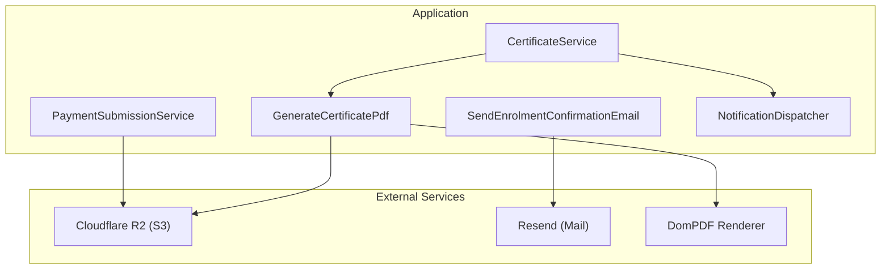
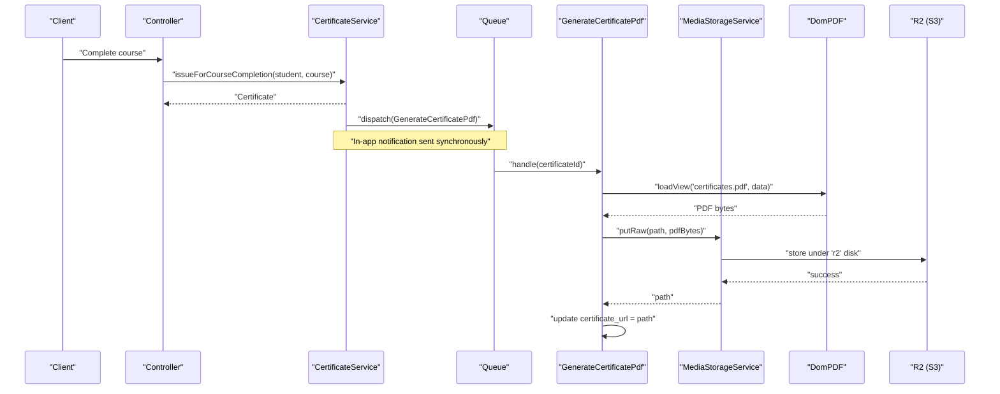
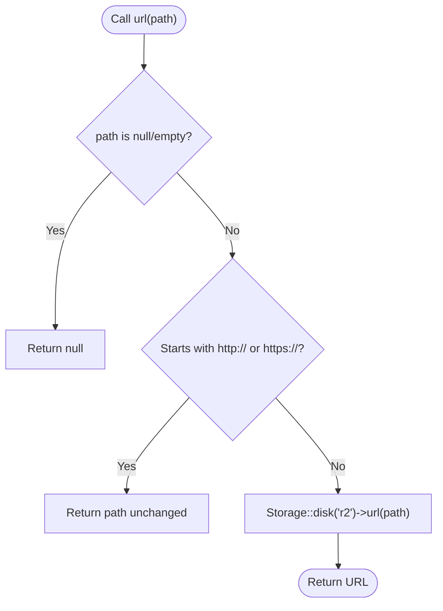
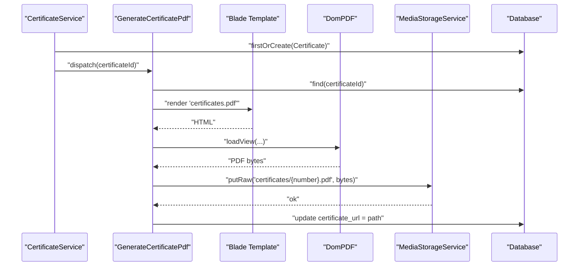
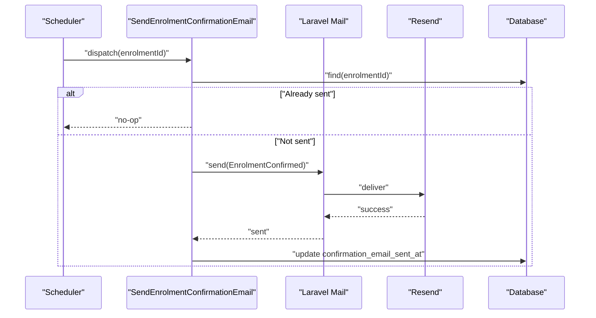
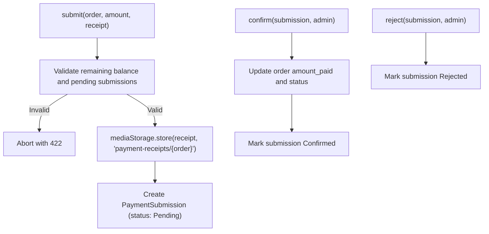
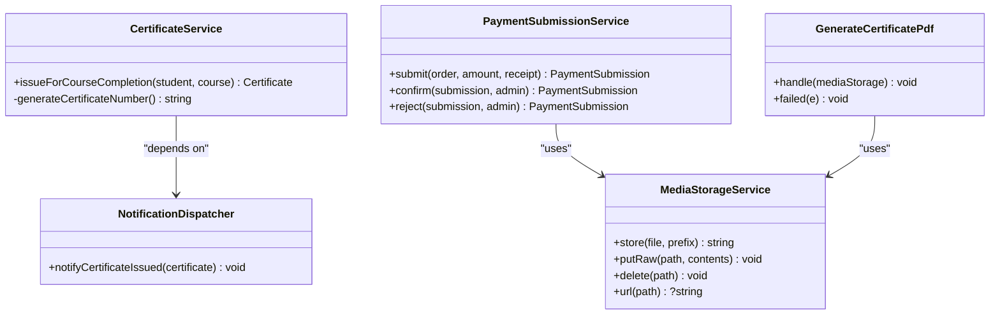
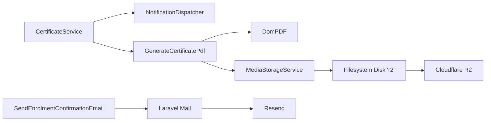

# External Service Integrations

<cite>
**Referenced Files in This Document**
- [MediaStorageService.php](file://app/Services/Storage/MediaStorageService.php)
- [filesystems.php](file://config/filesystems.php)
- [services.php](file://config/services.php)
- [mail.php](file://config/mail.php)
- [CertificateService.php](file://app/Services/Certification/CertificateService.php)
- [GenerateCertificatePdf.php](file://app/Jobs/GenerateCertificatePdf.php)
- [pdf.blade.php](file://resources/views/certificates/pdf.blade.php)
- [EnrolmentConfirmed.php](file://app/Mail/EnrolmentConfirmed.php)
- [SendEnrolmentConfirmationEmail.php](file://app/Jobs/SendEnrolmentConfirmationEmail.php)
- [PaymentSubmissionService.php](file://app/Services/Payments/PaymentSubmissionService.php)
- [NotificationDispatcher.php](file://app/Services/Notifications/NotificationDispatcher.php)
- [AppServiceProvider.php](file://app/Providers/AppServiceProvider.php)
</cite>

## Table of Contents
1. Introduction
2. Project Structure
3. Core Components
4. Architecture Overview
5. Detailed Component Analysis
6. Dependency Analysis
7. Performance Considerations
8. Troubleshooting Guide
9. Conclusion

## Introduction
This document explains how the ResNet Academy LMS integrates external services using service abstractions, dependency injection, and queues to isolate third-party dependencies such as object storage (Cloudflare R2 via S3-compatible driver), email delivery (Resend), and PDF generation (DomPDF). It focuses on:
- The MediaStorageService abstraction for unified storage operations across backends
- Certificate generation with DomPDF and asynchronous processing
- Email delivery via Resend through Laravel’s mail system
- Configuration management for different environments and credential handling
- Error handling strategies for external API failures
- Service composition patterns and dependency injection usage

## Project Structure
The integration points are organized around clear boundaries:
- Services encapsulate business logic and coordinate external calls
- Jobs handle long-running or retryable tasks off the request cycle
- Configuration files centralize credentials and transport settings
- Views define templates for emails and certificates

**Diagram sources**
- [CertificateService.php:23-35](file://app/Services/Certification/CertificateService.php#L23-L35)
- [GenerateCertificatePdf.php:36-57](file://app/Jobs/GenerateCertificatePdf.php#L36-L57)
- [MediaStorageService.php:32-79](file://app/Services/Storage/MediaStorageService.php#L32-L79)
- [SendEnrolmentConfirmationEmail.php:37-48](file://app/Jobs/SendEnrolmentConfirmationEmail.php#L37-L48)
- [PaymentSubmissionService.php:27-54](file://app/Services/Payments/PaymentSubmissionService.php#L27-L54)
- [NotificationDispatcher.php:66-76](file://app/Services/Notifications/NotificationDispatcher.php#L66-L76)

**Section sources**
- [MediaStorageService.php:11-84](file://app/Services/Storage/MediaStorageService.php#L11-L84)
- [filesystems.php:31-86](file://config/filesystems.php#L31-L86)
- [services.php:17-42](file://config/services.php#L17-L42)
- [mail.php:38-99](file://config/mail.php#L38-L99)

## Core Components
- MediaStorageService: A single seam for all uploads and file operations, abstracting the underlying storage disk. It stores relative paths and resolves public URLs, passing through external URLs unchanged.
- CertificateService: Orchestrates certificate issuance, creates a unique record, dispatches an async job to render the PDF, and sends an in-app notification.
- GenerateCertificatePdf: Renders a certificate PDF using DomPDF, stores it via MediaStorageService, and persists the path. Includes retries and failure logging.
- SendEnrolmentConfirmationEmail: Queued job that sends confirmation emails via Laravel’s Mail facade (configured to use Resend when enabled).
- PaymentSubmissionService: Handles payment receipt uploads via MediaStorageService and updates order state with audit logging.
- NotificationDispatcher: Centralizes in-app notifications; currently writes to the database but designed to be extended for email/SMS/push later.

**Section sources**
- [MediaStorageService.php:24-84](file://app/Services/Storage/MediaStorageService.php#L24-L84)
- [CertificateService.php:19-45](file://app/Services/Certification/CertificateService.php#L19-L45)
- [GenerateCertificatePdf.php:21-65](file://app/Jobs/GenerateCertificatePdf.php#L21-L65)
- [SendEnrolmentConfirmationEmail.php:22-56](file://app/Jobs/SendEnrolmentConfirmationEmail.php#L22-L56)
- [PaymentSubmissionService.php:20-107](file://app/Services/Payments/PaymentSubmissionService.php#L20-L107)
- [NotificationDispatcher.php:25-76](file://app/Services/Notifications/NotificationDispatcher.php#L25-L76)

## Architecture Overview
The system uses a layered approach:
- Controllers invoke services
- Services compose domain logic and call external services via abstractions or facades
- Long-running tasks run as queued jobs with idempotency and retries
- Configuration centralizes credentials and transport selection

**Diagram sources**
- [CertificateService.php:23-35](file://app/Services/Certification/CertificateService.php#L23-L35)
- [GenerateCertificatePdf.php:36-57](file://app/Jobs/GenerateCertificatePdf.php#L36-L57)
- [MediaStorageService.php:46-49](file://app/Services/Storage/MediaStorageService.php#L46-L49)
- [filesystems.php:75-86](file://config/filesystems.php#L75-L86)

## Detailed Component Analysis

### MediaStorageService: Unified Storage Abstraction
- Purpose: Provide a consistent interface for storing, retrieving, and deleting files regardless of backend.
- Key behaviors:
  - store(): Uploads files to the configured disk and returns a relative path
  - putRaw(): Writes server-generated content (e.g., PDFs) to the disk
  - delete(): Safely deletes only owned paths; ignores null/empty/external URLs
  - url(): Resolves stored values to public URLs; passes through external URLs unchanged
- Backend configuration: Uses the 'r2' disk defined in filesystems.php, which is S3-compatible and points to Cloudflare R2.

**Diagram sources**
- [MediaStorageService.php:68-84](file://app/Services/Storage/MediaStorageService.php#L68-L84)

**Section sources**
- [MediaStorageService.php:24-84](file://app/Services/Storage/MediaStorageService.php#L24-L84)
- [filesystems.php:75-86](file://config/filesystems.php#L75-L86)

### Certificate Generation with DomPDF
- CertificateService issues a certificate record and dispatches an async job to render the PDF.
- GenerateCertificatePdf:
  - Loads the Blade template for the certificate
  - Renders PDF using DomPDF
  - Stores the PDF via MediaStorageService
  - Updates the certificate record with the stored path
  - Implements uniqueness per certificate ID to prevent duplicate renders on retries
  - Logs failures for observability

**Diagram sources**
- [CertificateService.php:23-35](file://app/Services/Certification/CertificateService.php#L23-L35)
- [GenerateCertificatePdf.php:36-57](file://app/Jobs/GenerateCertificatePdf.php#L36-L57)
- [pdf.blade.php:1-28](file://resources/views/certificates/pdf.blade.php#L1-L28)

**Section sources**
- [CertificateService.php:19-45](file://app/Services/Certification/CertificateService.php#L19-L45)
- [GenerateCertificatePdf.php:21-65](file://app/Jobs/GenerateCertificatePdf.php#L21-L65)
- [pdf.blade.php:1-28](file://resources/views/certificates/pdf.blade.php#L1-L28)

### Email Delivery via Resend
- EnrolmentConfirmed mailable defines subject and content view for enrolment confirmation.
- SendEnrolmentConfirmationEmail job:
  - Ensures idempotency by checking if the email was already sent
  - Sends email via Laravel’s Mail facade
  - Marks the enrolment with a timestamp once sent
  - Retries up to 3 times with exponential backoff and logs failures

**Diagram sources**
- [EnrolmentConfirmed.php:14-30](file://app/Mail/EnrolmentConfirmed.php#L14-L30)
- [SendEnrolmentConfirmationEmail.php:22-56](file://app/Jobs/SendEnrolmentConfirmationEmail.php#L22-L56)
- [mail.php:64-66](file://config/mail.php#L64-L66)
- [services.php:21-23](file://config/services.php#L21-L23)

**Section sources**
- [EnrolmentConfirmed.php:14-30](file://app/Mail/EnrolmentConfirmed.php#L14-L30)
- [SendEnrolmentConfirmationEmail.php:22-56](file://app/Jobs/SendEnrolmentConfirmationEmail.php#L22-L56)
- [mail.php:17-99](file://config/mail.php#L17-L99)
- [services.php:21-23](file://config/services.php#L21-L23)

### Payment Submission and Storage Integration
- PaymentSubmissionService validates business rules before accepting a payment submission.
- Uses MediaStorageService to store receipts under a structured prefix tied to the order.
- Confirms or rejects submissions, updates order totals/status, and logs audits.

**Diagram sources**
- [PaymentSubmissionService.php:27-107](file://app/Services/Payments/PaymentSubmissionService.php#L27-L107)
- [MediaStorageService.php:32-49](file://app/Services/Storage/MediaStorageService.php#L32-L49)

**Section sources**
- [PaymentSubmissionService.php:20-107](file://app/Services/Payments/PaymentSubmissionService.php#L20-L107)
- [MediaStorageService.php:32-49](file://app/Services/Storage/MediaStorageService.php#L32-L49)

### Service Composition and Dependency Injection
- Constructor injection is used consistently:
  - CertificateService depends on NotificationDispatcher
  - PaymentSubmissionService depends on AuditLogger and MediaStorageService
  - Jobs receive services via container resolution (e.g., GenerateCertificatePdf receives MediaStorageService)
- AppServiceProvider customizes password reset link generation, demonstrating runtime configuration via bootstrapping.

**Diagram sources**
- [CertificateService.php:19-35](file://app/Services/Certification/CertificateService.php#L19-L35)
- [PaymentSubmissionService.php:20-54](file://app/Services/Payments/PaymentSubmissionService.php#L20-L54)
- [GenerateCertificatePdf.php:36-57](file://app/Jobs/GenerateCertificatePdf.php#L36-L57)
- [MediaStorageService.php:32-79](file://app/Services/Storage/MediaStorageService.php#L32-L79)

**Section sources**
- [CertificateService.php:19-35](file://app/Services/Certification/CertificateService.php#L19-L35)
- [PaymentSubmissionService.php:20-54](file://app/Services/Payments/PaymentSubmissionService.php#L20-L54)
- [GenerateCertificatePdf.php:36-57](file://app/Jobs/GenerateCertificatePdf.php#L36-L57)
- [AppServiceProvider.php:22-30](file://app/Providers/AppServiceProvider.php#L22-L30)

## Dependency Analysis
- Storage dependency chain:
  - MediaStorageService -> Laravel Storage Facade -> Filesystem Disk ('r2') -> Cloudflare R2 (S3-compatible)
- Email dependency chain:
  - SendEnrolmentConfirmationEmail -> Laravel Mail -> Resend transport (when configured)
- PDF generation dependency chain:
  - GenerateCertificatePdf -> DomPDF -> Blade template -> MediaStorageService -> R2

**Diagram sources**
- [CertificateService.php:23-35](file://app/Services/Certification/CertificateService.php#L23-L35)
- [GenerateCertificatePdf.php:36-57](file://app/Jobs/GenerateCertificatePdf.php#L36-L57)
- [MediaStorageService.php:32-79](file://app/Services/Storage/MediaStorageService.php#L32-L79)
- [filesystems.php:75-86](file://config/filesystems.php#L75-L86)
- [SendEnrolmentConfirmationEmail.php:37-48](file://app/Jobs/SendEnrolmentConfirmationEmail.php#L37-L48)
- [mail.php:64-66](file://config/mail.php#L64-L66)

**Section sources**
- [filesystems.php:75-86](file://config/filesystems.php#L75-L86)
- [mail.php:64-66](file://config/mail.php#L64-L66)
- [services.php:21-23](file://config/services.php#L21-L23)

## Performance Considerations
- Offload heavy work to queues:
  - PDF rendering and email sending are queued to avoid blocking requests
  - Jobs implement ShouldBeUnique to prevent duplicate work on retries
- Retry and backoff:
  - Jobs configure tries and backoff to handle transient failures gracefully
- Idempotency:
  - Jobs check existing state before performing actions (e.g., email sent flag, certificate URL presence)
- Storage efficiency:
  - MediaStorageService stores relative paths and resolves URLs at read time, enabling flexible backend changes without data migration

[No sources needed since this section provides general guidance]

## Troubleshooting Guide
- Storage failures:
  - If uploads fail, verify the 'r2' disk configuration and environment variables for access keys, bucket, endpoint, and URL
  - Ensure the storage disk is correctly set and accessible
- Email delivery issues:
  - Confirm MAIL_MAILER is set appropriately and RESEND_API_KEY is configured
  - Check queue workers are running to process queued emails
- PDF generation errors:
  - Verify DomPDF dependencies and PHP extensions required for PDF rendering
  - Inspect job logs for rendering or storage errors
- Idempotency checks:
  - For emails, ensure confirmation_email_sent_at is set after successful send
  - For certificates, ensure certificate_url is set after successful PDF storage

**Section sources**
- [filesystems.php:75-86](file://config/filesystems.php#L75-L86)
- [mail.php:17-99](file://config/mail.php#L17-L99)
- [SendEnrolmentConfirmationEmail.php:37-56](file://app/Jobs/SendEnrolmentConfirmationEmail.php#L37-L56)
- [GenerateCertificatePdf.php:36-65](file://app/Jobs/GenerateCertificatePdf.php#L36-L65)

## Conclusion
The ResNet Academy LMS employs robust service abstractions and dependency injection to isolate external dependencies. MediaStorageService unifies storage operations, while queued jobs handle intensive tasks like PDF generation and email delivery. Configuration files centralize credentials and transport settings, enabling environment-specific behavior. These patterns improve maintainability, scalability, and resilience against external service failures.

[No sources needed since this section summarizes without analyzing specific files]