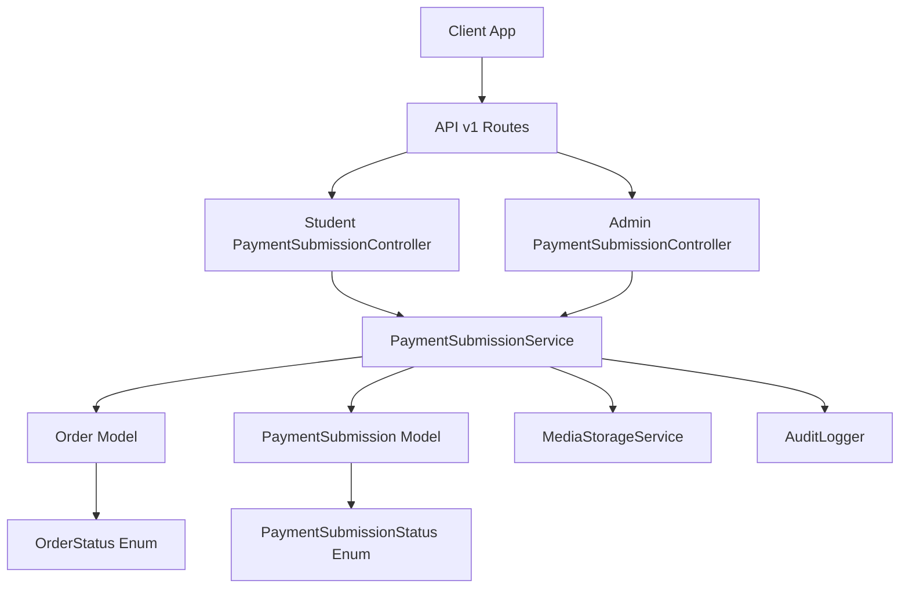
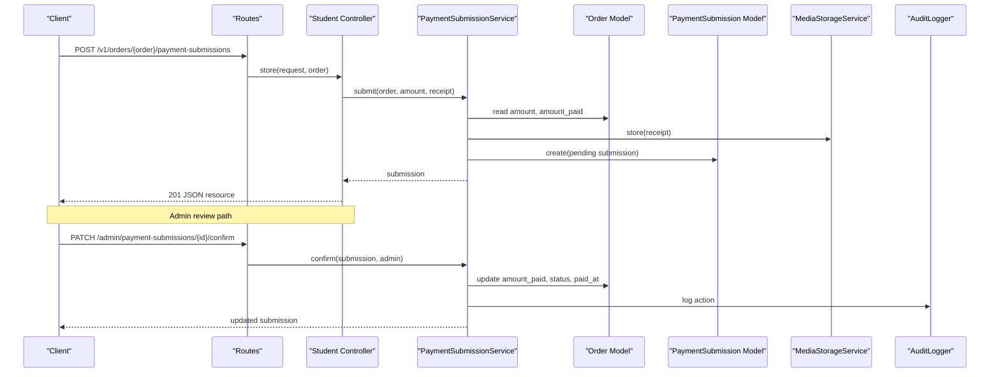
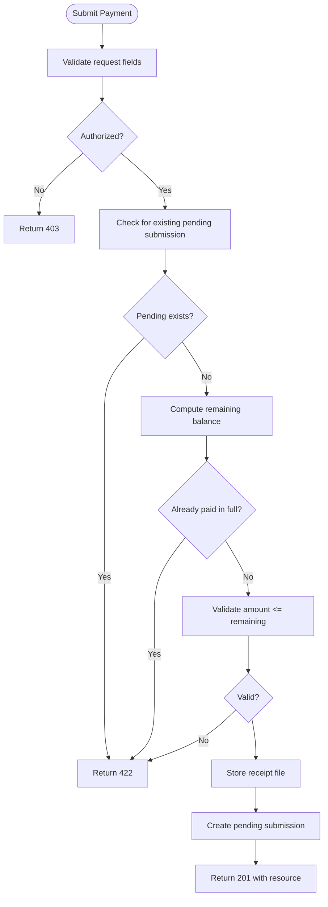
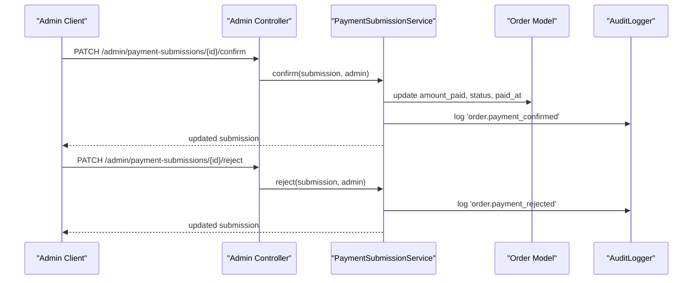
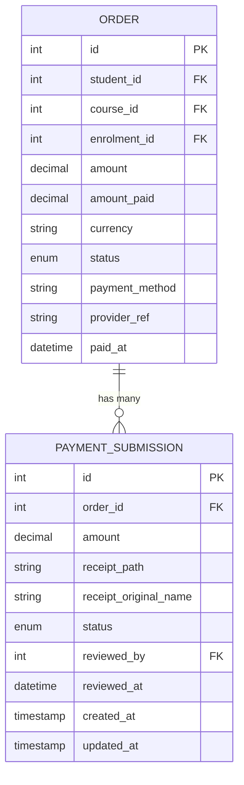
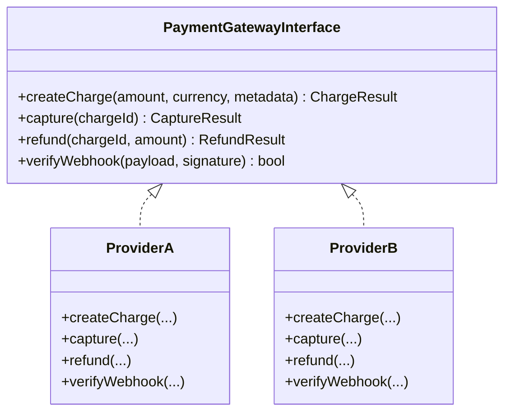
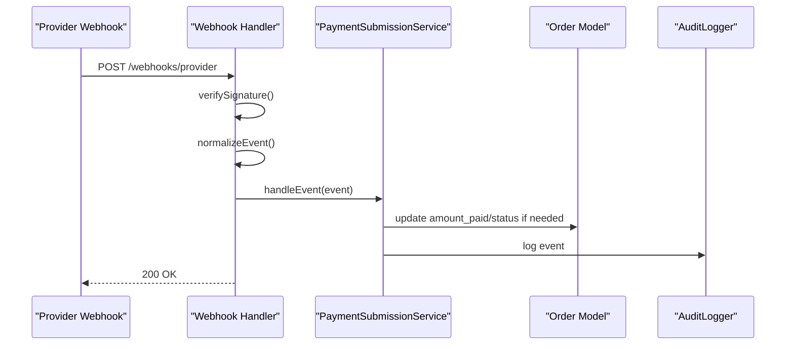
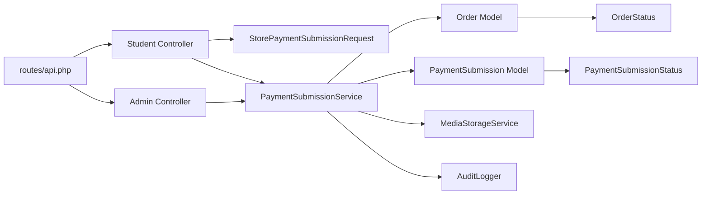

# Payment Gateway Integration

<cite>
**Referenced Files in This Document**
- [PaymentSubmissionController.php](file://app/Http/Controllers/Api/V1/PaymentSubmissionController.php)
- [Admin PaymentSubmissionController.php](file://app/Http/Controllers/Api/V1/Admin/PaymentSubmissionController.php)
- [StorePaymentSubmissionRequest.php](file://app/Http/Requests/Api/V1/StorePaymentSubmissionRequest.php)
- [PaymentSubmissionResource.php](file://app/Http/Resources/PaymentSubmissionResource.php)
- [PaymentSubmissionService.php](file://app/Services/Payments/PaymentSubmissionService.php)
- [Order.php](file://app/Models/Order.php)
- [PaymentSubmission.php](file://app/Models/PaymentSubmission.php)
- [OrderStatus.php](file://app/Enums/OrderStatus.php)
- [PaymentSubmissionStatus.php](file://app/Enums/PaymentSubmissionStatus.php)
- [api.php](file://routes/api.php)
- [2026_07_22_125411_add_amount_paid_and_narrow_status_on_orders_table.php](file://database/migrations/2026_07_22_125411_add_amount_paid_and_narrow_status_on_orders_table.php)
- [2026_07_22_140000_create_payment_submissions_table.php](file://database/migrations/2026_07_22_140000_create_payment_submissions_table.php)
- [PaymentSubmissionTest.php](file://tests/Feature/PaymentSubmissionTest.php)
</cite>

## Table of Contents
1. Introduction
2. Project Structure
3. Core Components
4. Architecture Overview
5. Detailed Component Analysis
6. Dependency Analysis
7. Performance Considerations
8. Troubleshooting Guide
9. Conclusion
10. Appendices

## Introduction
This document explains the payment integration architecture in ResNet Academy LMS with a focus on how payments are submitted, reviewed, and reconciled against orders. The system currently supports manual payment submissions (receipts) that require admin confirmation to update order balances and status. It also outlines where and how to integrate automated payment gateways using an abstraction pattern so multiple providers can be supported behind a common interface.

Key goals:
- Provide a clear model and controller structure for payment submission flows
- Define an abstraction layer to isolate provider-specific logic behind a common interface
- Document webhook handling patterns for confirmations, status updates, and failures
- Address security considerations, PCI compliance, and secure credential management
- Provide examples for implementing new payment gateways
- Outline testing strategies including sandbox environments and mocks

## Project Structure
The payment feature spans controllers, services, models, enums, routes, migrations, and resources. Students submit receipts against their orders; admins review and confirm or reject submissions. Order status is derived from amounts paid versus total amount.

**Diagram sources**
- [api.php:113-123](file://routes/api.php#L113-L123)
- [PaymentSubmissionController.php:14-31](file://app/Http/Controllers/Api/V1/PaymentSubmissionController.php#L14-L31)
- [Admin PaymentSubmissionController.php:18-39](file://app/Http/Controllers/Api/V1/Admin/PaymentSubmissionController.php#L18-L39)
- [PaymentSubmissionService.php:20-108](file://app/Services/Payments/PaymentSubmissionService.php#L20-L108)
- [Order.php:16-100](file://app/Models/Order.php#L16-L100)
- [PaymentSubmission.php:13-49](file://app/Models/PaymentSubmission.php#L13-L49)
- [OrderStatus.php:7-12](file://app/Enums/OrderStatus.php#L7-L12)
- [PaymentSubmissionStatus.php:7-12](file://app/Enums/PaymentSubmissionStatus.php#L7-L12)

**Section sources**
- [api.php:113-123](file://routes/api.php#L113-L123)
- [PaymentSubmissionController.php:14-31](file://app/Http/Controllers/Api/V1/PaymentSubmissionController.php#L14-L31)
- [Admin PaymentSubmissionController.php:18-39](file://app/Http/Controllers/Api/V1/Admin/PaymentSubmissionController.php#L18-L39)
- [PaymentSubmissionService.php:20-108](file://app/Services/Payments/PaymentSubmissionService.php#L20-L108)
- [Order.php:16-100](file://app/Models/Order.php#L16-L100)
- [PaymentSubmission.php:13-49](file://app/Models/PaymentSubmission.php#L13-L49)
- [OrderStatus.php:7-12](file://app/Enums/OrderStatus.php#L7-L12)
- [PaymentSubmissionStatus.php:7-12](file://app/Enums/PaymentSubmissionStatus.php#L7-L12)

## Core Components
- Student-facing submission endpoint: validates input, enforces policies, delegates to service
- Admin review endpoints: authorize admin actions to confirm or reject submissions
- Service layer: encapsulates business rules for submission, confirmation, and rejection; persists receipts; updates order state; logs audit events
- Models and enums: represent orders and submissions; derive order status deterministically
- Resources: serialize submission data for API responses
- Migrations: define schema for orders and payment submissions

**Section sources**
- [PaymentSubmissionController.php:14-31](file://app/Http/Controllers/Api/V1/PaymentSubmissionController.php#L14-L31)
- [Admin PaymentSubmissionController.php:18-39](file://app/Http/Controllers/Api/V1/Admin/PaymentSubmissionController.php#L18-L39)
- [PaymentSubmissionService.php:20-108](file://app/Services/Payments/PaymentSubmissionService.php#L20-L108)
- [Order.php:16-100](file://app/Models/Order.php#L16-L100)
- [PaymentSubmission.php:13-49](file://app/Models/PaymentSubmission.php#L13-L49)
- [OrderStatus.php:7-12](file://app/Enums/OrderStatus.php#L7-L12)
- [PaymentSubmissionStatus.php:7-12](file://app/Enums/PaymentSubmissionStatus.php#L7-L12)
- [PaymentSubmissionResource.php:11-29](file://app/Http/Resources/PaymentSubmissionResource.php#L11-L29)
- [2026_07_22_125411_add_amount_paid_and_narrow_status_on_orders_table.php:20-41](file://database/migrations/2026_07_22_125411_add_amount_paid_and_narrow_status_on_orders_table.php#L20-L41)
- [2026_07_22_140000_create_payment_submissions_table.php:9-30](file://database/migrations/2026_07_22_140000_create_payment_submissions_table.php#L9-L30)

## Architecture Overview
The current flow centers around manual receipt-based payments. A student submits a payment claim with an amount and receipt file. The service validates constraints (no duplicate pending submission, cannot exceed remaining balance), stores the receipt, and creates a pending submission. An admin reviews and confirms or rejects it. On confirmation, the order’s amount_paid increases and its status is recalculated.

**Diagram sources**
- [api.php:113-123](file://routes/api.php#L113-L123)
- [PaymentSubmissionController.php:14-31](file://app/Http/Controllers/Api/V1/PaymentSubmissionController.php#L14-L31)
- [Admin PaymentSubmissionController.php:18-39](file://app/Http/Controllers/Api/V1/Admin/PaymentSubmissionController.php#L18-L39)
- [PaymentSubmissionService.php:20-108](file://app/Services/Payments/PaymentSubmissionService.php#L20-L108)
- [Order.php:16-100](file://app/Models/Order.php#L16-L100)

## Detailed Component Analysis

### Payment Submission Flow (Student)
- Request validation ensures required fields and acceptable types
- Authorization checks that the authenticated user may submit payment for the given order
- Service enforces business rules: no existing pending submission, not fully paid, amount within remaining balance
- Receipt stored via storage service; submission created with pending status

**Diagram sources**
- [StorePaymentSubmissionRequest.php:10-34](file://app/Http/Requests/Api/V1/StorePaymentSubmissionRequest.php#L10-L34)
- [PaymentSubmissionService.php:27-54](file://app/Services/Payments/PaymentSubmissionService.php#L27-L54)
- [PaymentSubmissionResource.php:11-29](file://app/Http/Resources/PaymentSubmissionResource.php#L11-L29)

**Section sources**
- [StorePaymentSubmissionRequest.php:10-34](file://app/Http/Requests/Api/V1/StorePaymentSubmissionRequest.php#L10-L34)
- [PaymentSubmissionService.php:27-54](file://app/Services/Payments/PaymentSubmissionService.php#L27-L54)
- [PaymentSubmissionResource.php:11-29](file://app/Http/Resources/PaymentSubmissionResource.php#L11-L29)

### Admin Review Flow (Confirm/Reject)
- Admin endpoints require authorization
- Confirm updates order totals and status, marks submission confirmed, records audit event
- Reject marks submission rejected, records audit event

**Diagram sources**
- [Admin PaymentSubmissionController.php:18-39](file://app/Http/Controllers/Api/V1/Admin/PaymentSubmissionController.php#L18-L39)
- [PaymentSubmissionService.php:56-108](file://app/Services/Payments/PaymentSubmissionService.php#L56-L108)

**Section sources**
- [Admin PaymentSubmissionController.php:18-39](file://app/Http/Controllers/Api/V1/Admin/PaymentSubmissionController.php#L18-L39)
- [PaymentSubmissionService.php:56-108](file://app/Services/Payments/PaymentSubmissionService.php#L56-L108)

### Data Model and Relationships
- Order tracks student, course, enrolment, amounts, currency, status, payment method, provider reference, and paid timestamp
- PaymentSubmission links to order, stores amount, receipt metadata, status, reviewer info, and timestamps
- Statuses are strongly typed enums for clarity and safety

**Diagram sources**
- [Order.php:16-100](file://app/Models/Order.php#L16-L100)
- [PaymentSubmission.php:13-49](file://app/Models/PaymentSubmission.php#L13-L49)
- [2026_07_22_125411_add_amount_paid_and_narrow_status_on_orders_table.php:20-41](file://database/migrations/2026_07_22_125411_add_amount_paid_and_narrow_status_on_orders_table.php#L20-L41)
- [2026_07_22_140000_create_payment_submissions_table.php:9-30](file://database/migrations/2026_07_22_140000_create_payment_submissions_table.php#L9-L30)

**Section sources**
- [Order.php:16-100](file://app/Models/Order.php#L16-L100)
- [PaymentSubmission.php:13-49](file://app/Models/PaymentSubmission.php#L13-L49)
- [2026_07_22_125411_add_amount_paid_and_narrow_status_on_orders_table.php:20-41](file://database/migrations/2026_07_22_125411_add_amount_paid_and_narrow_status_on_orders_table.php#L20-L41)
- [2026_07_22_140000_create_payment_submissions_table.php:9-30](file://database/migrations/2026_07_22_140000_create_payment_submissions_table.php#L9-L30)

### Abstraction Pattern for Payment Providers
To support multiple payment providers while keeping the core stable:
- Define a common interface for payment operations (create charge, capture, refund, verify webhook signature)
- Implement provider-specific classes behind this interface
- Use dependency injection to select the active provider at runtime based on configuration
- Keep webhooks provider-agnostic by normalizing incoming events into internal domain events

[No diagram sources since this is a conceptual design illustration]

### Webhook Handling Strategy
- Expose a single webhook endpoint per provider or a unified endpoint that dispatches by provider
- Verify signatures using provider secrets stored securely
- Normalize payloads into internal events (e.g., payment.succeeded, payment.failed, payment.refunded)
- Apply idempotency keys to avoid duplicate processing
- Update order status and amount_paid only after successful verification and idempotent checks
- Log all webhook events for auditability

[No diagram sources since this is a conceptual workflow]

### Security Considerations and PCI Compliance
- Do not store raw card numbers or CVV in application databases or logs
- Use provider-hosted checkout or tokenization; store only provider references
- Enforce HTTPS everywhere; validate and sign all webhook requests
- Restrict access to payment-related endpoints via authentication and authorization policies
- Encrypt sensitive configuration values (provider credentials) at rest and in transit
- Limit logging to non-sensitive fields; redact any accidental sensitive data
- Follow least privilege for service accounts and database users
- Maintain audit trails for all financial state changes

[No section sources since this provides general guidance]

### Secure Credential Management
- Store provider secrets in environment variables or a secrets manager
- Load credentials via configuration services; never hardcode
- Rotate credentials regularly and maintain versioning
- Scope permissions to minimum required for each provider account
- Avoid logging or exposing secrets in error messages or stack traces

[No section sources since this provides general guidance]

### Example: Implementing a New Payment Gateway
Steps to add a new provider following established patterns:
- Create a provider class implementing the common payment gateway interface
- Register the provider in the service container with a key (e.g., provider name)
- Add configuration for the provider (keys, endpoints, modes)
- Wire the provider into the payment orchestration service used by controllers/webhooks
- Implement webhook handler for the provider’s events, normalizing them to internal events
- Add tests covering success, failure, and idempotency scenarios

[No section sources since this provides implementation guidance]

## Dependency Analysis
The payment subsystem depends on routing, controllers, request validation, service layer, models, enums, storage, and auditing.

**Diagram sources**
- [api.php:113-123](file://routes/api.php#L113-L123)
- [PaymentSubmissionController.php:14-31](file://app/Http/Controllers/Api/V1/PaymentSubmissionController.php#L14-L31)
- [Admin PaymentSubmissionController.php:18-39](file://app/Http/Controllers/Api/V1/Admin/PaymentSubmissionController.php#L18-L39)
- [StorePaymentSubmissionRequest.php:10-34](file://app/Http/Requests/Api/V1/StorePaymentSubmissionRequest.php#L10-L34)
- [PaymentSubmissionService.php:20-108](file://app/Services/Payments/PaymentSubmissionService.php#L20-L108)
- [Order.php:16-100](file://app/Models/Order.php#L16-L100)
- [PaymentSubmission.php:13-49](file://app/Models/PaymentSubmission.php#L13-L49)
- [OrderStatus.php:7-12](file://app/Enums/OrderStatus.php#L7-L12)
- [PaymentSubmissionStatus.php:7-12](file://app/Enums/PaymentSubmissionStatus.php#L7-L12)

**Section sources**
- [api.php:113-123](file://routes/api.php#L113-L123)
- [PaymentSubmissionController.php:14-31](file://app/Http/Controllers/Api/V1/PaymentSubmissionController.php#L14-L31)
- [Admin PaymentSubmissionController.php:18-39](file://app/Http/Controllers/Api/V1/Admin/PaymentSubmissionController.php#L18-L39)
- [StorePaymentSubmissionRequest.php:10-34](file://app/Http/Requests/Api/V1/StorePaymentSubmissionRequest.php#L10-L34)
- [PaymentSubmissionService.php:20-108](file://app/Services/Payments/PaymentSubmissionService.php#L20-L108)
- [Order.php:16-100](file://app/Models/Order.php#L16-L100)
- [PaymentSubmission.php:13-49](file://app/Models/PaymentSubmission.php#L13-L49)
- [OrderStatus.php:7-12](file://app/Enums/OrderStatus.php#L7-L12)
- [PaymentSubmissionStatus.php:7-12](file://app/Enums/PaymentSubmissionStatus.php#L7-L12)

## Performance Considerations
- Keep payment submission endpoints fast by deferring heavy work to background jobs (e.g., receipt processing, notifications)
- Use database transactions to ensure atomicity when updating order and submission states
- Cache frequently accessed order aggregates only when necessary; prefer deterministic derivation of status
- Index foreign keys and commonly queried columns (order_id, status) to optimize lookups
- Rate-limit webhook endpoints to mitigate abuse and ensure idempotent processing

[No section sources since this provides general guidance]

## Troubleshooting Guide
Common issues and resolutions:
- Duplicate pending submission: Ensure only one pending submission per order; service prevents concurrent submissions
- Overpayment attempts: Validate amount against remaining balance before creating submission
- Unauthorized access: Confirm policies allow students to submit and admins to review
- Receipt storage errors: Verify storage configuration and permissions
- Audit gaps: Ensure audit logger is configured and writes to persistent storage

**Section sources**
- [PaymentSubmissionService.php:27-54](file://app/Services/Payments/PaymentSubmissionService.php#L27-L54)
- [PaymentSubmissionService.php:56-108](file://app/Services/Payments/PaymentSubmissionService.php#L56-L108)
- [StorePaymentSubmissionRequest.php:10-34](file://app/Http/Requests/Api/V1/StorePaymentSubmissionRequest.php#L10-L34)

## Conclusion
ResNet Academy LMS implements a robust, auditable payment submission workflow centered around manual receipt verification and admin approval. The service layer encapsulates business rules and integrates with storage and auditing. To scale to automated payments, introduce a provider abstraction with a common interface, normalize webhooks into internal events, and enforce strict security and PCI-compliant practices. Testing should cover both manual and automated flows using sandbox environments and mocks to validate correctness and resilience.

[No section sources since this summarizes without analyzing specific files]

## Appendices

### API Endpoints Summary
- Student: POST /v1/orders/{order}/payment-submissions
- Admin: PATCH /admin/payment-submissions/{paymentSubmission}/confirm
- Admin: PATCH /admin/payment-submissions/{paymentSubmission}/reject

**Section sources**
- [api.php:113-123](file://routes/api.php#L113-L123)

### Database Schema Notes
- Orders include amount, amount_paid, status derived server-side
- Payment submissions track amount, receipt metadata, status, and reviewer information

**Section sources**
- [2026_07_22_125411_add_amount_paid_and_narrow_status_on_orders_table.php:20-41](file://database/migrations/2026_07_22_125411_add_amount_paid_and_narrow_status_on_orders_table.php#L20-L41)
- [2026_07_22_140000_create_payment_submissions_table.php:9-30](file://database/migrations/2026_07_22_140000_create_payment_submissions_table.php#L9-L30)

### Testing Strategies
- Unit tests for service methods: submission validation, confirmation/rejection logic, order status derivation
- Feature tests for controller endpoints: authorization, validation, response shapes
- Mock external dependencies: storage service, audit logger, and future payment providers
- Sandbox testing: use provider test modes to simulate successes, failures, and webhooks
- Idempotency tests: ensure repeated webhook calls do not alter state incorrectly

**Section sources**
- [PaymentSubmissionTest.php](file://tests/Feature/PaymentSubmissionTest.php)