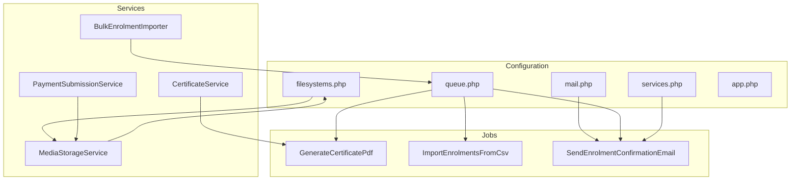
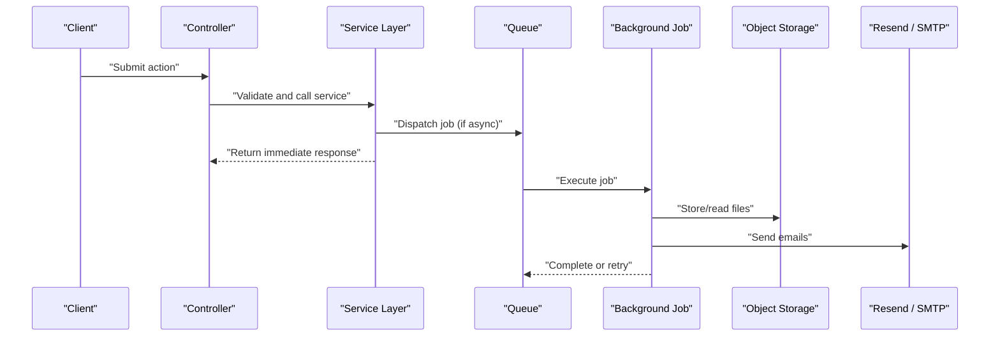
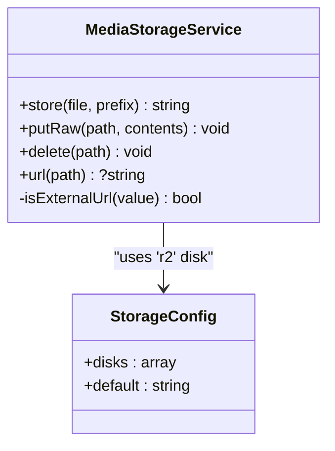
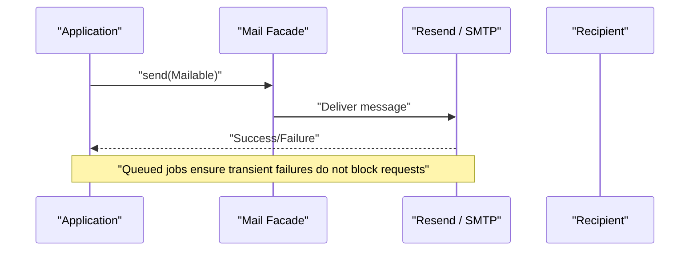
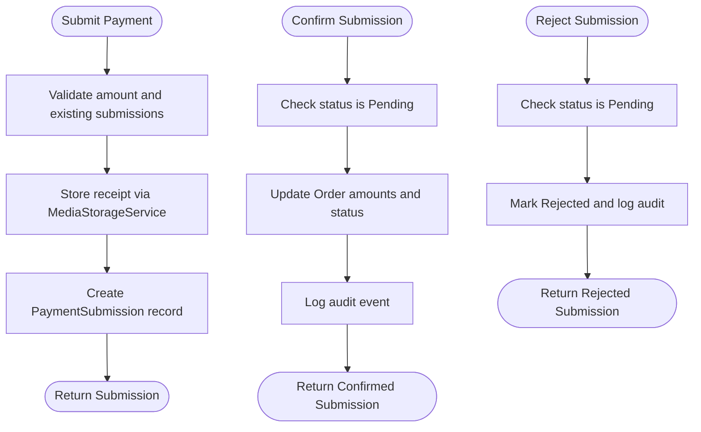
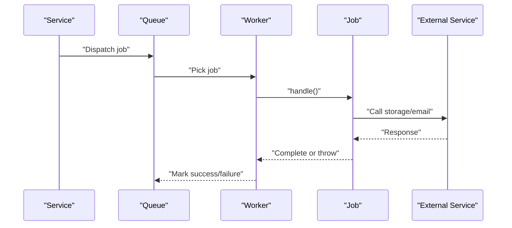
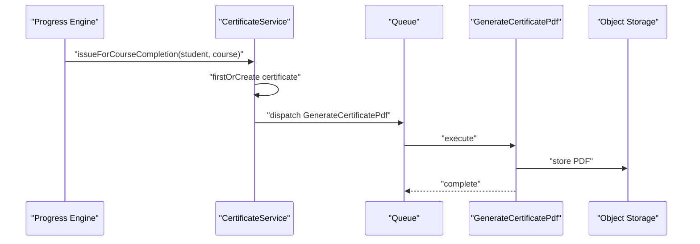
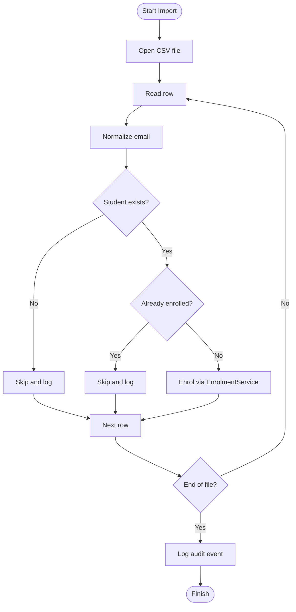
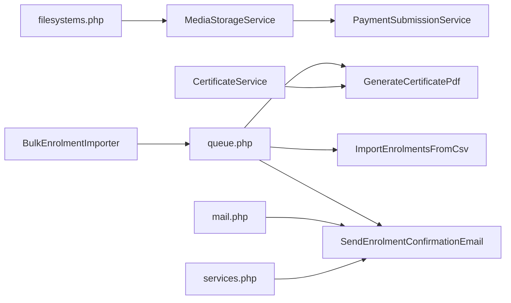

# Integration Patterns

<cite>
**Referenced Files in This Document**
- [filesystems.php](file://config/filesystems.php)
- [mail.php](file://config/mail.php)
- [queue.php](file://config/queue.php)
- [services.php](file://config/services.php)
- [app.php](file://config/app.php)
- [MediaStorageService.php](file://app/Services/Storage/MediaStorageService.php)
- [GenerateCertificatePdf.php](file://app/Jobs/GenerateCertificatePdf.php)
- [ImportEnrolmentsFromCsv.php](file://app/Jobs/ImportEnrolmentsFromCsv.php)
- [SendEnrolmentConfirmationEmail.php](file://app/Jobs/SendEnrolmentConfirmationEmail.php)
- [PaymentSubmissionService.php](file://app/Services/Payments/PaymentSubmissionService.php)
- [BulkEnrolmentImporter.php](file://app/Services/Enrolment/BulkEnrolmentImporter.php)
- [CertificateService.php](file://app/Services/Certification/CertificateService.php)
- [EnrolmentConfirmed.php](file://app/Mail/EnrolmentConfirmed.php)
- [VerifyEmailQueued.php](file://app/Notifications/VerifyEmailQueued.php)
- [UserProvisionedQueued.php](file://app/Notifications/UserProvisionedQueued.php)
</cite>

## Table of Contents
1. Introduction
2. Project Structure
3. Core Components
4. Architecture Overview
5. Detailed Component Analysis
6. Dependency Analysis
7. Performance Considerations
8. Troubleshooting Guide
9. Conclusion

## Introduction
This document explains how the application integrates with external services and systems, focusing on:
- File storage via S3-compatible object storage (AWS S3 and Cloudflare R2)
- Email delivery via Resend
- Payment gateway interfaces for manual payment submissions
- Background job processing using Laravel queues for asynchronous operations such as certificate generation and bulk enrolment imports
- Service abstraction to isolate external dependencies
- Retry mechanisms, error handling, and monitoring strategies
- Configuration management across environments and credential handling
- Caching strategies and performance optimization for external API calls

The goal is to provide a clear architectural view that helps developers understand integration points, failure modes, and best practices for reliability and performance.

## Project Structure
External integrations are organized around configuration files and service classes:
- Storage configuration defines disks for local, public, AWS S3, and Cloudflare R2
- Mail configuration defines mailers including SMTP, SES, Postmark, and Resend
- Queue configuration defines backends like database, Redis, SQS, and failover strategies
- Services encapsulate business logic and external interactions behind clean interfaces
- Jobs implement background tasks with retry and idempotency guarantees

**Diagram sources**
- [filesystems.php:31-86](file://config/filesystems.php#L31-L86)
- [mail.php:38-99](file://config/mail.php#L38-L99)
- [queue.php:32-92](file://config/queue.php#L32-L92)
- [services.php:17-29](file://config/services.php#L17-L29)
- [MediaStorageService.php:24-85](file://app/Services/Storage/MediaStorageService.php#L24-L85)
- [PaymentSubmissionService.php:20-108](file://app/Services/Payments/PaymentSubmissionService.php#L20-L108)
- [BulkEnrolmentImporter.php:19-87](file://app/Services/Enrolment/BulkEnrolmentImporter.php#L19-L87)
- [CertificateService.php:19-47](file://app/Services/Certification/CertificateService.php#L19-L47)
- [GenerateCertificatePdf.php:21-67](file://app/Jobs/GenerateCertificatePdf.php#L21-L67)
- [ImportEnrolmentsFromCsv.php:21-51](file://app/Jobs/ImportEnrolmentsFromCsv.php#L21-L51)
- [SendEnrolmentConfirmationEmail.php:22-58](file://app/Jobs/SendEnrolmentConfirmationEmail.php#L22-L58)

**Section sources**
- [filesystems.php:31-86](file://config/filesystems.php#L31-L86)
- [mail.php:38-99](file://config/mail.php#L38-L99)
- [queue.php:32-92](file://config/queue.php#L32-L92)
- [services.php:17-29](file://config/services.php#L17-L29)
- [app.php:16-68](file://config/app.php#L16-L68)

## Core Components
- MediaStorageService: Centralized abstraction over file storage, supporting uploads, raw writes, URL resolution, and deletion. It isolates callers from disk specifics and handles both relative paths and external URLs.
- PaymentSubmissionService: Encapsulates payment submission workflow, including validation, receipt storage, order updates, and audit logging.
- CertificateService: Orchestrates certificate issuance and triggers asynchronous PDF generation and notifications.
- BulkEnrolmentImporter: Processes CSV enrolment imports with idempotency and audit logging.
- Queue-backed jobs: GenerateCertificatePdf, ImportEnrolmentsFromCsv, SendEnrolmentConfirmationEmail handle long-running or external-dependent tasks off the request path.

**Section sources**
- [MediaStorageService.php:24-85](file://app/Services/Storage/MediaStorageService.php#L24-L85)
- [PaymentSubmissionService.php:20-108](file://app/Services/Payments/PaymentSubmissionService.php#L20-L108)
- [CertificateService.php:19-47](file://app/Services/Certification/CertificateService.php#L19-L47)
- [BulkEnrolmentImporter.php:19-87](file://app/Services/Enrolment/BulkEnrolmentImporter.php#L19-L87)
- [GenerateCertificatePdf.php:21-67](file://app/Jobs/GenerateCertificatePdf.php#L21-L67)
- [ImportEnrolmentsFromCsv.php:21-51](file://app/Jobs/ImportEnrolmentsFromCsv.php#L21-L51)
- [SendEnrolmentConfirmationEmail.php:22-58](file://app/Jobs/SendEnrolmentConfirmationEmail.php#L22-L58)

## Architecture Overview
The system uses a layered approach:
- Controllers and requests validate inputs and delegate to services
- Services encapsulate domain logic and coordinate external integrations through abstractions
- Jobs run asynchronously via queues to avoid blocking requests
- Configuration centralizes credentials and environment-specific settings

**Diagram sources**
- [queue.php:32-92](file://config/queue.php#L32-L92)
- [mail.php:38-99](file://config/mail.php#L38-L99)
- [filesystems.php:31-86](file://config/filesystems.php#L31-L86)
- [GenerateCertificatePdf.php:21-67](file://app/Jobs/GenerateCertificatePdf.php#L21-L67)
- [SendEnrolmentConfirmationEmail.php:22-58](file://app/Jobs/SendEnrolmentConfirmationEmail.php#L22-L58)

## Detailed Component Analysis

### File Storage Abstraction (AWS S3 and Cloudflare R2)
The application abstracts file storage through MediaStorageService, which:
- Stores uploaded files under prefixes and returns relative paths
- Writes server-generated content (e.g., certificate PDFs) directly to storage
- Resolves stored values to public URLs, passing through external URLs unchanged
- Deletes files safely, ignoring null/empty values and external URLs

Configuration supports multiple disks:
- Local and public disks for development and local serving
- AWS S3 disk with keys, region, bucket, endpoint, and path-style options
- Cloudflare R2 disk configured similarly to S3 but with specific endpoint and region behavior

**Diagram sources**
- [MediaStorageService.php:24-85](file://app/Services/Storage/MediaStorageService.php#L24-L85)
- [filesystems.php:31-86](file://config/filesystems.php#L31-L86)

**Section sources**
- [MediaStorageService.php:24-85](file://app/Services/Storage/MediaStorageService.php#L24-L85)
- [filesystems.php:31-86](file://config/filesystems.php#L31-L86)

### Email Delivery (Resend and Alternatives)
Email delivery is configured via mailers:
- Default mailer can be set per environment
- Resend transport is available alongside SMTP, SES, Postmark, log, array, failover, and roundrobin
- Global sender address and name are configurable
- Notifications and mailables use queueable patterns to avoid request-time failures

**Diagram sources**
- [mail.php:38-99](file://config/mail.php#L38-L99)
- [services.php:17-29](file://config/services.php#L17-L29)
- [SendEnrolmentConfirmationEmail.php:22-58](file://app/Jobs/SendEnrolmentConfirmationEmail.php#L22-L58)
- [EnrolmentConfirmed.php:14-32](file://app/Mail/EnrolmentConfirmed.php#L14-L32)
- [VerifyEmailQueued.php:18-21](file://app/Notifications/VerifyEmailQueued.php#L18-L21)
- [UserProvisionedQueued.php:21-48](file://app/Notifications/UserProvisionedQueued.php#L21-L48)

**Section sources**
- [mail.php:38-99](file://config/mail.php#L38-L99)
- [services.php:17-29](file://config/services.php#L17-L29)
- [SendEnrolmentConfirmationEmail.php:22-58](file://app/Jobs/SendEnrolmentConfirmationEmail.php#L22-L58)
- [EnrolmentConfirmed.php:14-32](file://app/Mail/EnrolmentConfirmed.php#L14-L32)
- [VerifyEmailQueued.php:18-21](file://app/Notifications/VerifyEmailQueued.php#L18-L21)
- [UserProvisionedQueued.php:21-48](file://app/Notifications/UserProvisionedQueued.php#L21-L48)

### Payment Gateway Interfaces
Payment workflows are handled by PaymentSubmissionService:
- Validates remaining balance and prevents duplicate pending submissions
- Stores receipts via MediaStorageService and records metadata
- Confirms or rejects submissions with audit logging
- Updates order state and timestamps based on confirmation

**Diagram sources**
- [PaymentSubmissionService.php:20-108](file://app/Services/Payments/PaymentSubmissionService.php#L20-L108)
- [MediaStorageService.php:24-85](file://app/Services/Storage/MediaStorageService.php#L24-L85)

**Section sources**
- [PaymentSubmissionService.php:20-108](file://app/Services/Payments/PaymentSubmissionService.php#L20-L108)

### Background Job Processing (Queues)
Jobs run asynchronously to avoid blocking requests and to handle retries:
- GenerateCertificatePdf renders PDFs and stores them, with uniqueness to prevent duplicates
- ImportEnrolmentsFromCsv processes CSV files and cleans up after import
- SendEnrolmentConfirmationEmail sends confirmation emails with idempotency checks

**Diagram sources**
- [queue.php:32-92](file://config/queue.php#L32-L92)
- [GenerateCertificatePdf.php:21-67](file://app/Jobs/GenerateCertificatePdf.php#L21-L67)
- [ImportEnrolmentsFromCsv.php:21-51](file://app/Jobs/ImportEnrolmentsFromCsv.php#L21-L51)
- [SendEnrolmentConfirmationEmail.php:22-58](file://app/Jobs/SendEnrolmentConfirmationEmail.php#L22-L58)

**Section sources**
- [queue.php:32-92](file://config/queue.php#L32-L92)
- [GenerateCertificatePdf.php:21-67](file://app/Jobs/GenerateCertificatePdf.php#L21-L67)
- [ImportEnrolmentsFromCsv.php:21-51](file://app/Jobs/ImportEnrolmentsFromCsv.php#L21-L51)
- [SendEnrolmentConfirmationEmail.php:22-58](file://app/Jobs/SendEnrolmentConfirmationEmail.php#L22-L58)

### Certificate Issuance Workflow
CertificateService ensures exactly-once issuance and triggers asynchronous PDF generation:
- Creates or retrieves a certificate record with a unique number
- Dispatches a job to render and store the PDF
- Sends notifications about certificate issuance

**Diagram sources**
- [CertificateService.php:19-47](file://app/Services/Certification/CertificateService.php#L19-L47)
- [GenerateCertificatePdf.php:21-67](file://app/Jobs/GenerateCertificatePdf.php#L21-L67)

**Section sources**
- [CertificateService.php:19-47](file://app/Services/Certification/CertificateService.php#L19-L47)
- [GenerateCertificatePdf.php:21-67](file://app/Jobs/GenerateCertificatePdf.php#L21-L67)

### Bulk Enrolment Import
BulkEnrolmentImporter provides an idempotent CSV import mechanism:
- Reads CSV rows and normalizes email addresses
- Skips missing students and already enrolled users
- Uses EnrolmentService to enrol students and logs audit events

**Diagram sources**
- [BulkEnrolmentImporter.php:19-87](file://app/Services/Enrolment/BulkEnrolmentImporter.php#L19-L87)

**Section sources**
- [BulkEnrolmentImporter.php:19-87](file://app/Services/Enrolment/BulkEnrolmentImporter.php#L19-L87)

## Dependency Analysis
Key dependencies and relationships:
- MediaStorageService depends on filesystems configuration to select the correct disk
- Jobs depend on queue configuration for backend selection and retry behavior
- Email-related components depend on mail configuration and services configuration for transports
- PaymentSubmissionService depends on MediaStorageService and audit logging
- CertificateService depends on NotificationDispatcher and queue dispatching

**Diagram sources**
- [filesystems.php:31-86](file://config/filesystems.php#L31-L86)
- [queue.php:32-92](file://config/queue.php#L32-L92)
- [mail.php:38-99](file://config/mail.php#L38-L99)
- [services.php:17-29](file://config/services.php#L17-L29)
- [MediaStorageService.php:24-85](file://app/Services/Storage/MediaStorageService.php#L24-L85)
- [PaymentSubmissionService.php:20-108](file://app/Services/Payments/PaymentSubmissionService.php#L20-L108)
- [CertificateService.php:19-47](file://app/Services/Certification/CertificateService.php#L19-L47)
- [BulkEnrolmentImporter.php:19-87](file://app/Services/Enrolment/BulkEnrolmentImporter.php#L19-L87)

**Section sources**
- [filesystems.php:31-86](file://config/filesystems.php#L31-L86)
- [queue.php:32-92](file://config/queue.php#L32-L92)
- [mail.php:38-99](file://config/mail.php#L38-L99)
- [services.php:17-29](file://config/services.php#L17-L29)
- [MediaStorageService.php:24-85](file://app/Services/Storage/MediaStorageService.php#L24-L85)
- [PaymentSubmissionService.php:20-108](file://app/Services/Payments/PaymentSubmissionService.php#L20-L108)
- [CertificateService.php:19-47](file://app/Services/Certification/CertificateService.php#L19-L47)
- [BulkEnrolmentImporter.php:19-87](file://app/Services/Enrolment/BulkEnrolmentImporter.php#L19-L87)

## Performance Considerations
- Use queues for long-running tasks to keep request latency low
- Configure appropriate retry counts and backoff intervals for jobs interacting with external APIs
- Prefer object storage for large files and generated assets; avoid storing large binaries in the database
- Leverage idempotency in jobs to safely retry without side effects
- Use failover and round-robin mailers for resilience against provider outages
- Cache frequently accessed data at the application layer where appropriate to reduce external API calls
- Monitor failed jobs and external service errors to detect issues early

[No sources needed since this section provides general guidance]

## Troubleshooting Guide
Common issues and strategies:
- Storage failures: Ensure correct disk configuration and credentials; enable throw mode during testing to surface SDK errors
- Email delivery failures: Use queued notifications and mailables; configure fallback mailers; check rate limits and recipient validity
- Queue failures: Inspect failed jobs table; adjust retry_after and max attempts; verify worker processes are running
- Payment submission errors: Validate remaining balances and existing submissions; review audit logs for admin actions
- Monitoring: Use logging within job failed handlers to capture context and error messages

**Section sources**
- [GenerateCertificatePdf.php:59-67](file://app/Jobs/GenerateCertificatePdf.php#L59-L67)
- [ImportEnrolmentsFromCsv.php:43-51](file://app/Jobs/ImportEnrolmentsFromCsv.php#L43-L51)
- [SendEnrolmentConfirmationEmail.php:50-58](file://app/Jobs/SendEnrolmentConfirmationEmail.php#L50-L58)
- [queue.php:123-127](file://config/queue.php#L123-L127)
- [filesystems.php:50-86](file://config/filesystems.php#L50-L86)

## Conclusion
The application employs robust integration patterns:
- Service abstractions isolate external dependencies and simplify testing and maintenance
- Queues provide reliable asynchronous processing with retries and idempotency
- Configuration centralizes credentials and environment-specific settings
- Error handling and monitoring are integrated into jobs and services
- Performance is optimized by offloading heavy tasks and leveraging object storage

These patterns ensure scalability, resilience, and maintainability while integrating with external services like object storage, email providers, and payment workflows.

[No sources needed since this section summarizes without analyzing specific files]