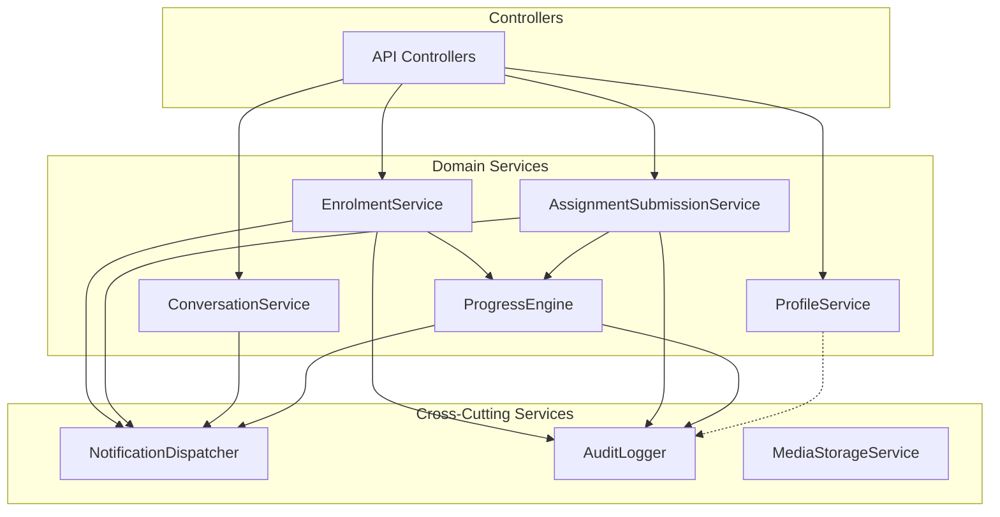
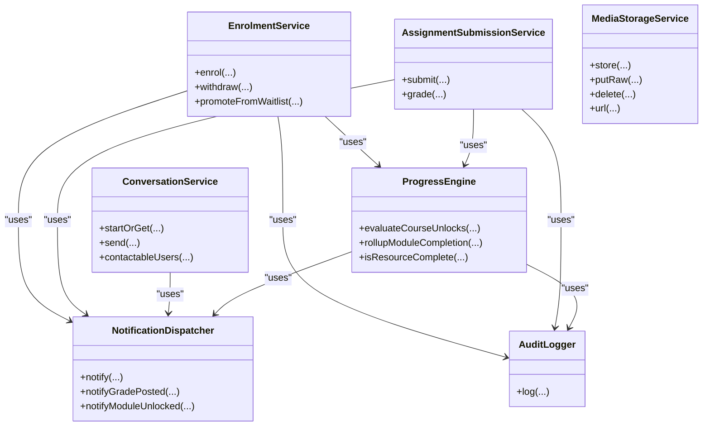
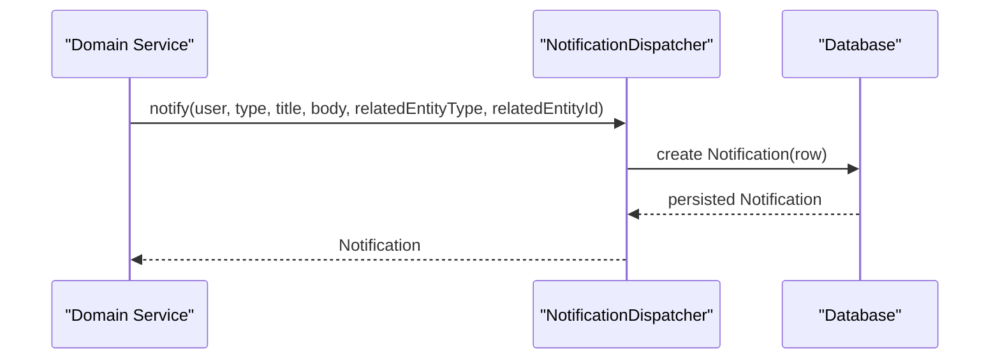
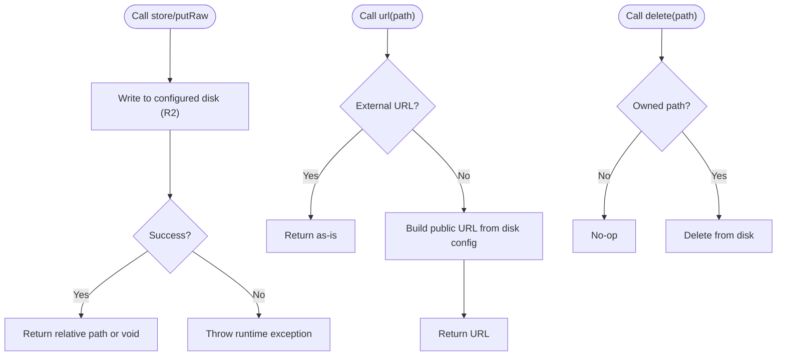
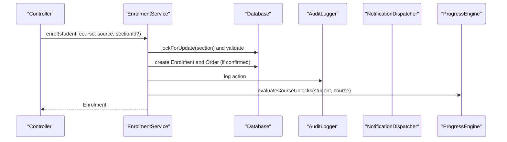
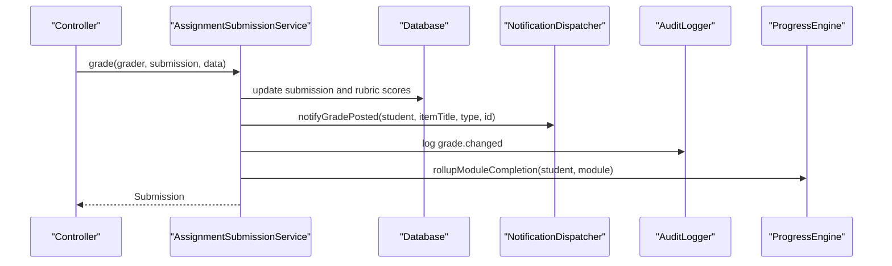
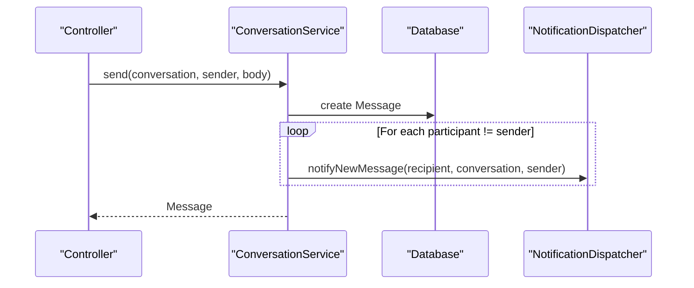
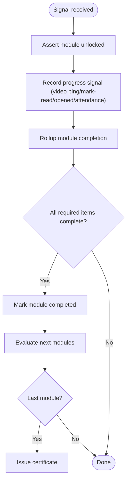
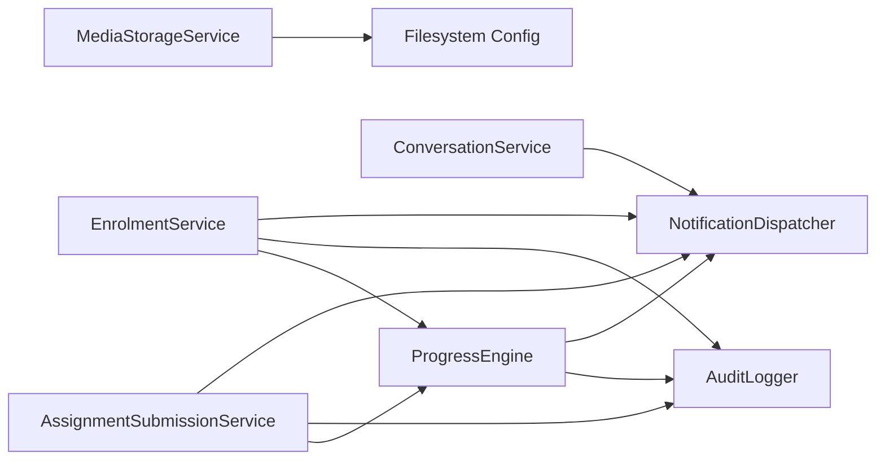

# Service Abstraction Pattern

<cite>
**Referenced Files in This Document**
- [AppServiceProvider.php](file://app/Providers/AppServiceProvider.php)
- [NotificationDispatcher.php](file://app/Services/Notifications/NotificationDispatcher.php)
- [MediaStorageService.php](file://app/Services/Storage/MediaStorageService.php)
- [filesystems.php](file://config/filesystems.php)
- [EnrolmentService.php](file://app/Services/Enrolment/EnrolmentService.php)
- [AssignmentSubmissionService.php](file://app/Services/Assessment/AssignmentSubmissionService.php)
- [ConversationService.php](file://app/Services/Communication/ConversationService.php)
- [ProgressEngine.php](file://app/Services/Progress/ProgressEngine.php)
- [AuditLogger.php](file://app/Services/Audit/AuditLogger.php)
- [ProfileService.php](file://app/Services/Profile/ProfileService.php)
- [composer.json](file://composer.json)
</cite>

## Table of Contents
1. [Introduction](#introduction)
2. [Project Structure](#project-structure)
3. [Core Components](#core-components)
4. [Architecture Overview](#architecture-overview)
5. [Detailed Component Analysis](#detailed-component-analysis)
6. [Dependency Analysis](#dependency-analysis)
7. [Performance Considerations](#performance-considerations)
8. [Troubleshooting Guide](#troubleshooting-guide)
9. [Conclusion](#conclusion)

## Introduction
This document explains the service abstraction pattern used across ResNet Academy’s backend. Services encapsulate business logic, expose clean interfaces to controllers and other components, and coordinate cross-cutting concerns such as notifications, auditing, progress tracking, and media storage. The application uses constructor-based dependency injection via Laravel’s container, keeping services loosely coupled and testable. A central notification dispatcher provides a single write path for in-app notifications, while a media storage service abstracts object storage backends behind a consistent interface.

## Project Structure
The service layer is organized by domain area under app/Services:
- Notifications: NotificationDispatcher (single write path for in-app notifications)
- Storage: MediaStorageService (unified upload/read/delete URL resolution)
- Enrolment: EnrolmentService (enrollment lifecycle, waitlist promotion, sequencing with progress engine)
- Assessment: AssignmentSubmissionService (submission and grading workflows)
- Communication: ConversationService (1:1 messaging with permission checks)
- Progress: ProgressEngine (module unlock/completion rules, resource completion signals)
- Audit: AuditLogger (centralized audit log writes)
- Profile: ProfileService (profile completeness policy)

**Diagram sources**
- [EnrolmentService.php:32-36](file://app/Services/Enrolment/EnrolmentService.php#L32-L36)
- [AssignmentSubmissionService.php:26-32](file://app/Services/Assessment/AssignmentSubmissionService.php#L26-L32)
- [ConversationService.php:25](file://app/Services/Communication/ConversationService.php#L25)
- [ProgressEngine.php:35-39](file://app/Services/Progress/ProgressEngine.php#L35-L39)
- [NotificationDispatcher.php:25-39](file://app/Services/Notifications/NotificationDispatcher.php#L25-L39)
- [AuditLogger.php:13-27](file://app/Services/Audit/AuditLogger.php#L13-L27)
- [MediaStorageService.php:24-84](file://app/Services/Storage/MediaStorageService.php#L24-L84)

**Section sources**
- [AppServiceProvider.php:14-30](file://app/Providers/AppServiceProvider.php#L14-L30)
- [composer.json:33-44](file://composer.json#L33-L44)

## Core Components
- NotificationDispatcher: Centralizes in-app notification creation and provides domain-specific helpers (course updates, certificate issuance, messages, tickets, forum replies, grades, module unlocks, at-risk reminders). It currently writes only to the in-app channel; email/SMS/push fan-out can be added later without changing callers.
- MediaStorageService: Single seam for all uploads and file operations. Stores files on the configured R2 disk, resolves public URLs, deletes owned files, and passes through external URLs unchanged to support legacy data.
- EnrolmentService: Orchestrates enrollment, waitlisting, promotions, order creation, confirmation emails, auditing, and progress evaluation. Uses database transactions and pessimistic locking for capacity management.
- AssignmentSubmissionService: Handles submission lifecycle, late penalty calculation, rubric scoring, grading, grade notifications, auditing, and progress rollups.
- ConversationService: Manages 1:1 conversations with role-based permissions, message sending, read receipts, and contact discovery.
- ProgressEngine: Owns module unlock and completion logic, evaluates resource completion per type, records engagement events, and triggers certificate issuance upon course completion.
- AuditLogger: Centralized audit logging for sensitive mutations.
- ProfileService: Encapsulates profile completeness policy and metrics.

**Section sources**
- [NotificationDispatcher.php:25-205](file://app/Services/Notifications/NotificationDispatcher.php#L25-L205)
- [MediaStorageService.php:24-84](file://app/Services/Storage/MediaStorageService.php#L24-L84)
- [EnrolmentService.php:32-248](file://app/Services/Enrolment/EnrolmentService.php#L32-L248)
- [AssignmentSubmissionService.php:26-115](file://app/Services/Assessment/AssignmentSubmissionService.php#L26-L115)
- [ConversationService.php:25-162](file://app/Services/Communication/ConversationService.php#L25-L162)
- [ProgressEngine.php:35-286](file://app/Services/Progress/ProgressEngine.php#L35-L286)
- [AuditLogger.php:13-27](file://app/Services/Audit/AuditLogger.php#L13-L27)
- [ProfileService.php:16-175](file://app/Services/Profile/ProfileService.php#L16-L175)

## Architecture Overview
The service layer follows a clear separation of concerns:
- Domain services implement business workflows and compose cross-cutting services.
- Cross-cutting services provide focused capabilities (notifications, auditing, storage, progress).
- Dependency injection via constructors decouples components and enables testing with mocks.
- Configuration-driven behavior (e.g., filesystem disks) allows swapping backends without code changes.

**Diagram sources**
- [EnrolmentService.php:32-36](file://app/Services/Enrolment/EnrolmentService.php#L32-L36)
- [AssignmentSubmissionService.php:26-32](file://app/Services/Assessment/AssignmentSubmissionService.php#L26-L32)
- [ConversationService.php:25](file://app/Services/Communication/ConversationService.php#L25)
- [ProgressEngine.php:35-39](file://app/Services/Progress/ProgressEngine.php#L35-L39)
- [NotificationDispatcher.php:25-39](file://app/Services/Notifications/NotificationDispatcher.php#L25-L39)
- [AuditLogger.php:13-27](file://app/Services/Audit/AuditLogger.php#L13-L27)
- [MediaStorageService.php:24-84](file://app/Services/Storage/MediaStorageService.php#L24-L84)

## Detailed Component Analysis

### Notification Dispatcher Pattern
The notification dispatcher centralizes in-app notification creation and exposes domain-specific methods that encapsulate business rules for when and how to notify users. It currently targets the in-app channel but is designed to be extended for multi-channel delivery without altering callers.

**Diagram sources**
- [NotificationDispatcher.php:27-39](file://app/Services/Notifications/NotificationDispatcher.php#L27-L39)

Key responsibilities and examples:
- Course updates: notifies all confirmed enrollees when a course changes.
- Certificate issuance: notifies students when certificates are issued.
- Messaging: notifies recipients of new conversation messages.
- Tickets and forums: notifies relevant parties on replies or thread status changes.
- Grades: notifies students when grades are posted.
- Module unlocks: notifies students when modules become available.
- At-risk reminders: supports staff-triggered check-ins.

**Section sources**
- [NotificationDispatcher.php:45-205](file://app/Services/Notifications/NotificationDispatcher.php#L45-L205)

### Media Storage Service Abstraction
MediaStorageService provides a unified interface for storing, reading, deleting, and resolving URLs for media assets. It abstracts the underlying object storage (R2) and supports both internal paths and external URLs, enabling seamless coexistence of legacy and new data.

**Diagram sources**
- [MediaStorageService.php:32-84](file://app/Services/Storage/MediaStorageService.php#L32-L84)
- [filesystems.php:75-86](file://config/filesystems.php#L75-L86)

Configuration-driven behavior:
- The R2 disk is defined in configuration and accessed via the storage facade.
- Public URLs are built using the configured base URL for the disk.
- External URLs are passed through unchanged to support pre-existing assets.

**Section sources**
- [MediaStorageService.php:24-84](file://app/Services/Storage/MediaStorageService.php#L24-L84)
- [filesystems.php:75-86](file://config/filesystems.php#L75-L86)

### Service Composition: Enrollment Workflow
EnrolmentService composes multiple services to implement enrollment, waitlisting, and progression:
- Validates section availability and capacity using pessimistic locking.
- Creates orders and queues confirmation emails.
- Audits state changes.
- Triggers progress evaluation to unlock modules.
- Promotes waitlisted students when seats open.

**Diagram sources**
- [EnrolmentService.php:44-147](file://app/Services/Enrolment/EnrolmentService.php#L44-L147)
- [AuditLogger.php:18-27](file://app/Services/Audit/AuditLogger.php#L18-L27)
- [ProgressEngine.php:50-81](file://app/Services/Progress/ProgressEngine.php#L50-L81)

**Section sources**
- [EnrolmentService.php:44-248](file://app/Services/Enrolment/EnrolmentService.php#L44-L248)

### Service Composition: Grading Workflow
AssignmentSubmissionService coordinates submission, grading, notifications, auditing, and progress rollups:
- Computes late penalties and attempt numbers.
- Persists rubric scores and final scores.
- Notifies students about new grades.
- Audits grade changes.
- Rolls up module completion based on submissions.

**Diagram sources**
- [AssignmentSubmissionService.php:72-115](file://app/Services/Assessment/AssignmentSubmissionService.php#L72-L115)
- [NotificationDispatcher.php:163-172](file://app/Services/Notifications/NotificationDispatcher.php#L163-L172)
- [AuditLogger.php:18-27](file://app/Services/Audit/AuditLogger.php#L18-L27)
- [ProgressEngine.php:126-152](file://app/Services/Progress/ProgressEngine.php#L126-L152)

**Section sources**
- [AssignmentSubmissionService.php:37-115](file://app/Services/Assessment/AssignmentSubmissionService.php#L37-L115)

### Service Composition: Messaging Workflow
ConversationService manages 1:1 conversations with strict permission rules and integrates notifications:
- Validates allowed pairings (admin-student/instructor-student/admin-instructor).
- Reuses existing conversations between two users.
- Sends messages and notifies non-sender participants.
- Provides read receipt marking and contact discovery.

**Diagram sources**
- [ConversationService.php:81-97](file://app/Services/Communication/ConversationService.php#L81-L97)
- [NotificationDispatcher.php:81-91](file://app/Services/Notifications/NotificationDispatcher.php#L81-L91)

**Section sources**
- [ConversationService.php:27-162](file://app/Services/Communication/ConversationService.php#L27-L162)

### Progress Engine: Unlock and Completion Logic
ProgressEngine owns module unlocking and completion rules:
- Evaluates schedule reachability per module (section-relative offsets or absolute scheduled dates).
- Unlocks modules when prerequisites are met and schedules allow.
- Rolls up module completion when required items are complete.
- Records engagement events and triggers certificate issuance upon course completion.

**Diagram sources**
- [ProgressEngine.php:50-81](file://app/Services/Progress/ProgressEngine.php#L50-L81)
- [ProgressEngine.php:126-152](file://app/Services/Progress/ProgressEngine.php#L126-L152)
- [ProgressEngine.php:218-286](file://app/Services/Progress/ProgressEngine.php#L218-L286)

**Section sources**
- [ProgressEngine.php:50-286](file://app/Services/Progress/ProgressEngine.php#L50-L286)

### Profile Service: Policy Encapsulation
ProfileService centralizes profile completeness policy:
- Defines required fields.
- Calculates completion percentage.
- Identifies missing fields.
- Determines if profile is complete.

This service is used by middleware and API endpoints to enforce profile requirements consistently.

**Section sources**
- [ProfileService.php:16-175](file://app/Services/Profile/ProfileService.php#L16-L175)

## Dependency Analysis
- Constructor-based dependency injection: Services declare dependencies explicitly, enabling loose coupling and easy testing.
- Shared cross-cutting services: NotificationDispatcher and AuditLogger are widely composed to ensure consistent side effects.
- Configuration-driven storage: MediaStorageService depends on filesystem configuration to target the correct storage backend.
- Framework integration: Laravel’s container wires dependencies automatically; providers can register framework-level hooks (e.g., password reset URL builder).

**Diagram sources**
- [EnrolmentService.php:32-36](file://app/Services/Enrolment/EnrolmentService.php#L32-L36)
- [AssignmentSubmissionService.php:26-32](file://app/Services/Assessment/AssignmentSubmissionService.php#L26-L32)
- [ConversationService.php:25](file://app/Services/Communication/ConversationService.php#L25)
- [ProgressEngine.php:35-39](file://app/Services/Progress/ProgressEngine.php#L35-L39)
- [MediaStorageService.php:24-84](file://app/Services/Storage/MediaStorageService.php#L24-L84)
- [filesystems.php:75-86](file://config/filesystems.php#L75-L86)

**Section sources**
- [composer.json:33-44](file://composer.json#L33-L44)
- [AppServiceProvider.php:22-30](file://app/Providers/AppServiceProvider.php#L22-L30)

## Performance Considerations
- Database transactions and pessimistic locking: Enrollment and waitlist promotion use transactions and row locks to prevent race conditions during capacity checks and seat updates.
- Idempotent operations: Progress evaluation and module unlock checks are safe to call repeatedly, supporting both on-demand and scheduled invocations.
- Asynchronous tasks: Confirmation emails are queued with delays, avoiding blocking request flows.
- Efficient queries: Bulk operations (e.g., notifying all confirmed enrollees) use efficient collection and query patterns.

[No sources needed since this section provides general guidance]

## Troubleshooting Guide
Common issues and where to inspect:
- Upload failures: MediaStorageService throws a runtime exception on store failure; verify disk configuration and credentials.
- Missing notifications: Ensure NotificationDispatcher is invoked from the appropriate service method; check related entity IDs and types.
- Incorrect module unlocks: Validate schedule reachability logic and prerequisite completion; review ProgressEngine’s unlock and rollup calls.
- Audit gaps: Confirm that sensitive mutations call AuditLogger with correct actor and metadata.

**Section sources**
- [MediaStorageService.php:32-41](file://app/Services/Storage/MediaStorageService.php#L32-L41)
- [NotificationDispatcher.php:27-39](file://app/Services/Notifications/NotificationDispatcher.php#L27-L39)
- [ProgressEngine.php:50-81](file://app/Services/Progress/ProgressEngine.php#L50-L81)
- [AuditLogger.php:18-27](file://app/Services/Audit/AuditLogger.php#L18-L27)

## Conclusion
ResNet Academy’s service abstraction pattern cleanly separates business logic from infrastructure concerns. Services compose focused cross-cutting capabilities (notifications, auditing, progress, storage) via constructor injection, enabling maintainable, testable, and configurable behavior. The notification dispatcher centralizes in-app notifications and is extensible for additional channels. The media storage service abstracts object storage and supports mixed legacy and new assets. Together, these patterns provide a robust foundation for scaling features while preserving clarity and reliability.