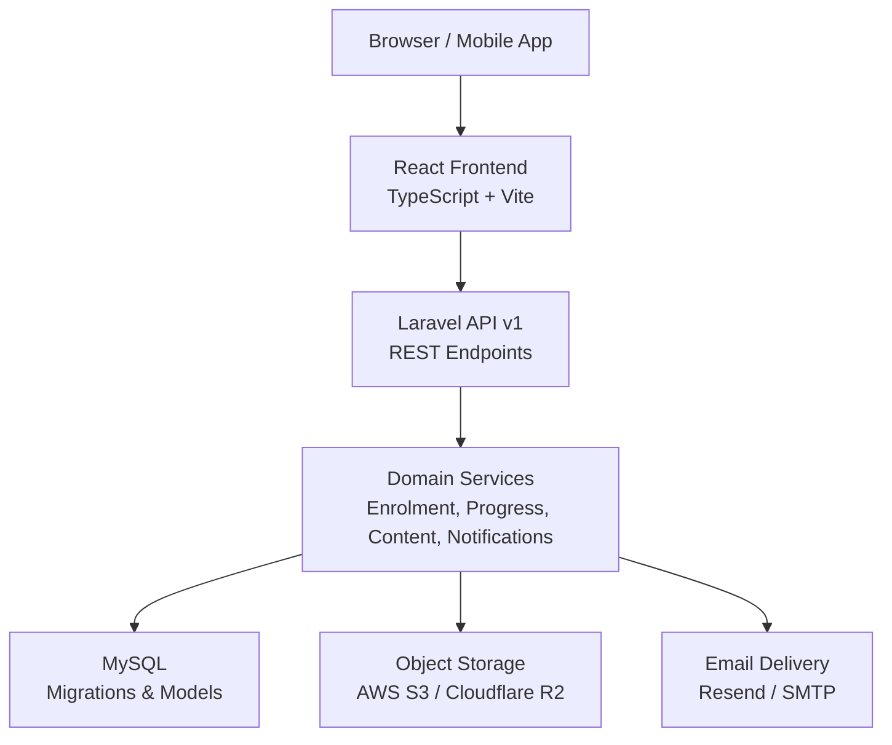
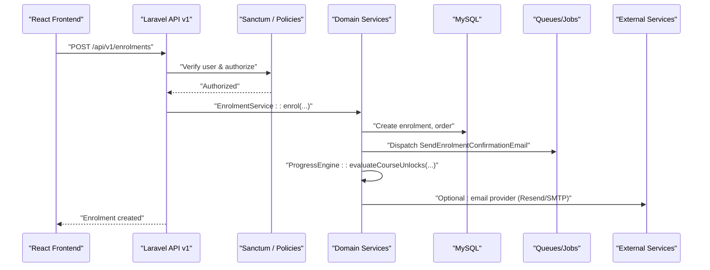
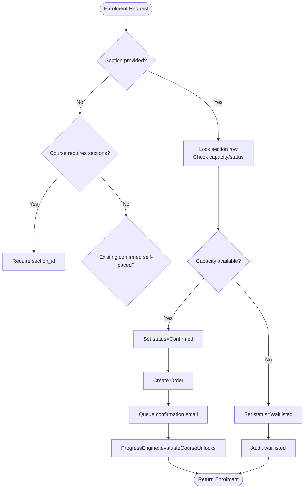
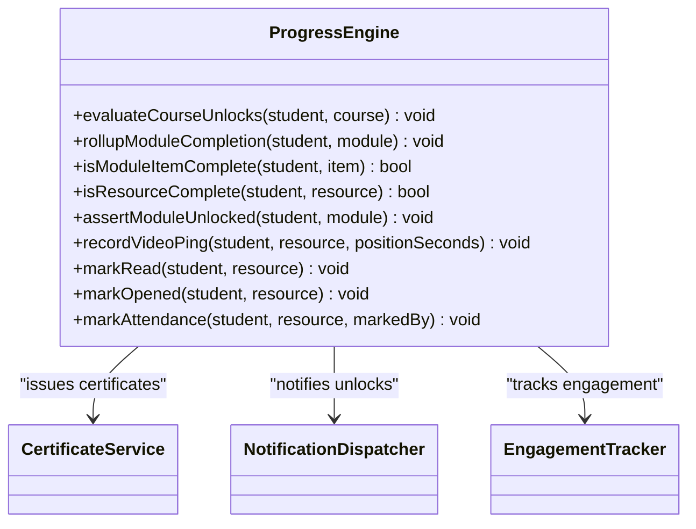
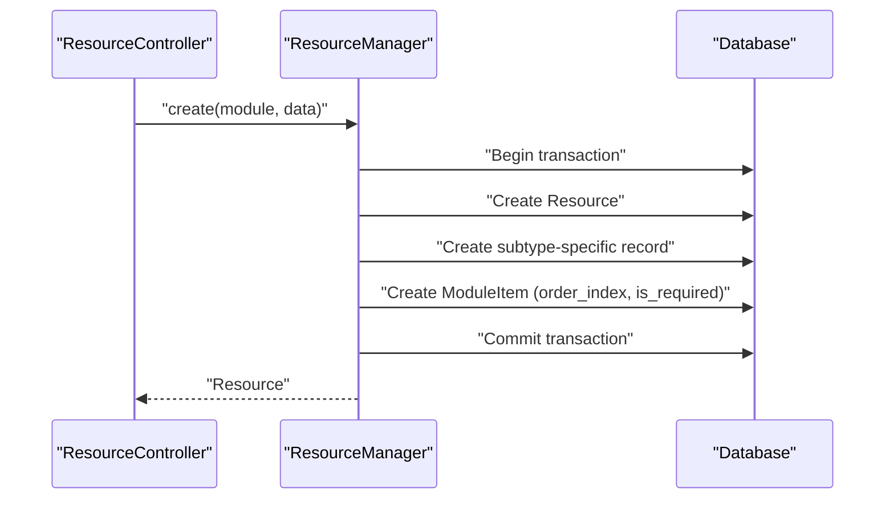
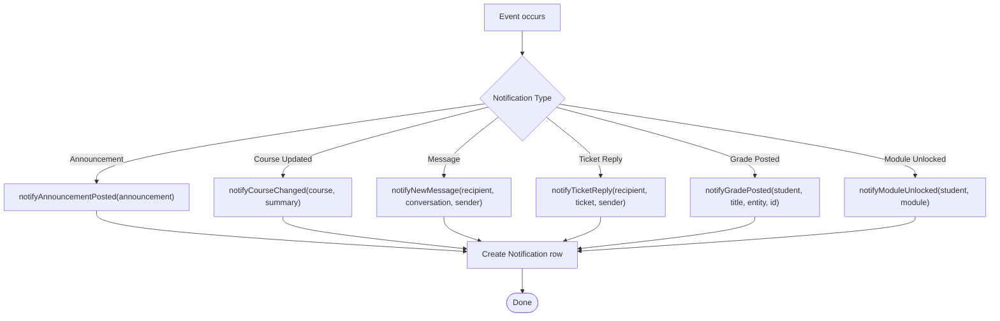
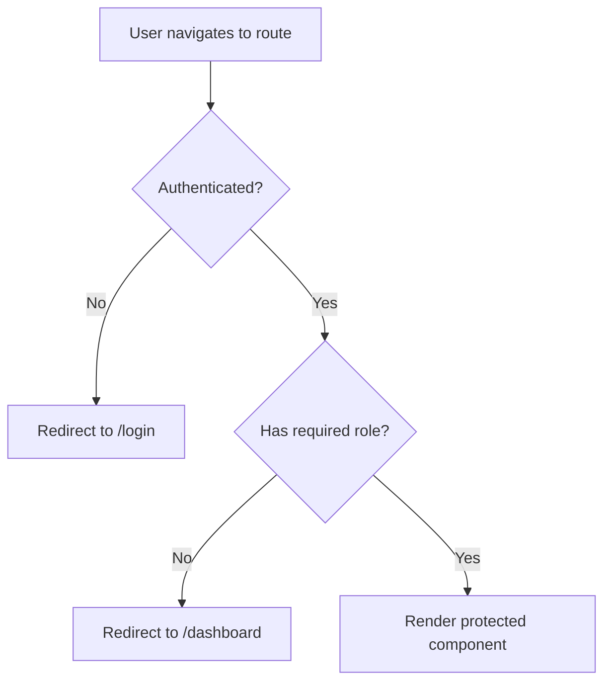
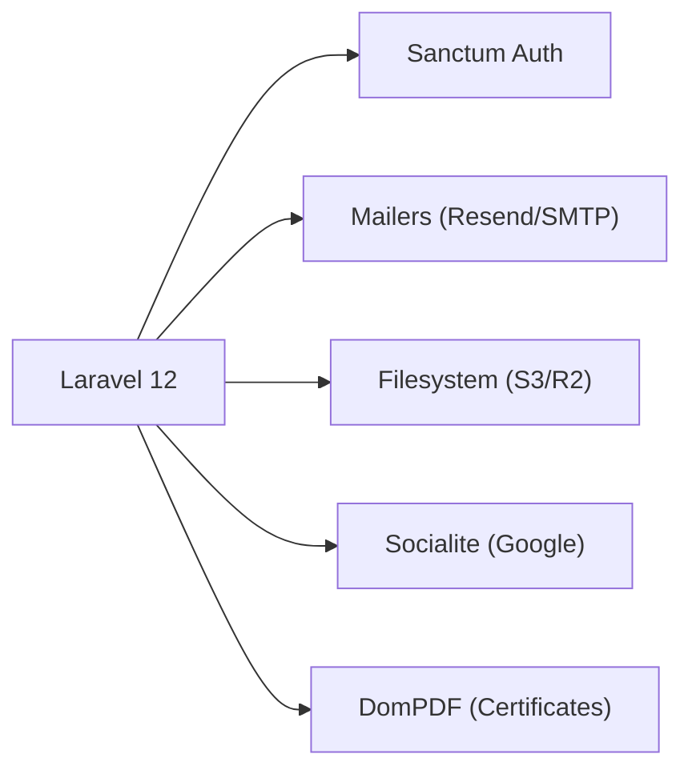

# System Overview

<cite>
**Referenced Files in This Document**
- [composer.json](file://composer.json)
- [frontend/package.json](file://frontend/package.json)
- [config/app.php](file://config/app.php)
- [config/services.php](file://config/services.php)
- [config/filesystems.php](file://config/filesystems.php)
- [config/mail.php](file://config/mail.php)
- [routes/api.php](file://routes/api.php)
- [app/Providers/AppServiceProvider.php](file://app/Providers/AppServiceProvider.php)
- [app/Services/Enrolment/EnrolmentService.php](file://app/Services/Enrolment/EnrolmentService.php)
- [app/Services/Progress/ProgressEngine.php](file://app/Services/Progress/ProgressEngine.php)
- [app/Services/Content/ResourceManager.php](file://app/Services/Content/ResourceManager.php)
- [app/Services/Notifications/NotificationDispatcher.php](file://app/Services/Notifications/NotificationDispatcher.php)
- [frontend/src/components/layout/ProtectedRoute.tsx](file://frontend/src/components/layout/ProtectedRoute.tsx)
</cite>

## Table of Contents
1. [Introduction](#introduction)
2. [Project Structure](#project-structure)
3. [Core Components](#core-components)
4. [Architecture Overview](#architecture-overview)
5. [Detailed Component Analysis](#detailed-component-analysis)
6. [Dependency Analysis](#dependency-analysis)
7. [Performance Considerations](#performance-considerations)
8. [Troubleshooting Guide](#troubleshooting-guide)
9. [Conclusion](#conclusion)

## Introduction
ResNet Academy LMS is a full-stack Learning Management System that supports both traditional self-paced online courses and cohort-based learning programs. The backend is built with Laravel 12 on PHP 8.2+, exposing a REST API consumed by a React 19 frontend written in TypeScript. The system models course content as modules containing resources (videos, documents, readings, external links, SCORM packages, live sessions, downloadable files), assessments (assignments and evaluations), and structured progression rules. Cohort features include course sections with capacity management, waitlisting, and scheduled unlocks tied to section start dates.

The platform integrates:
- AWS S3-compatible storage (including Cloudflare R2) for media and documents
- Resend email service for transactional emails
- Social authentication via Laravel Socialite (e.g., Google)
- A payment model with orders and payment submissions (gateway integration deferred)

Key architectural patterns:
- Service-Oriented Architecture: business logic is encapsulated in domain services under app/Services
- Policy-Based Authorization: fine-grained access control per model via Policies
- Event-Driven Processing: background jobs and queued notifications decouple heavy work from request paths

These patterns improve maintainability by isolating concerns, and scalability by enabling asynchronous processing and clear boundaries between components.

**Section sources**
- [composer.json:8-18](file://composer.json#L8-L18)
- [frontend/package.json:18-60](file://frontend/package.json#L18-L60)
- [config/services.php:17-42](file://config/services.php#L17-L42)
- [config/filesystems.php:31-86](file://config/filesystems.php#L31-L86)
- [config/mail.php:38-66](file://config/mail.php#L38-L66)

## Project Structure
The repository follows a conventional Laravel structure with a separate frontend project:
- Backend (Laravel): routes, controllers, services, models, policies, jobs, mail, config
- Frontend (React + TypeScript + Vite): feature-based components, pages, and API clients
- Database: migrations, factories, seeders
- Storage: local/public disks and cloud disks (S3/R2)

**Diagram sources**
- [routes/api.php:49-241](file://routes/api.php#L49-L241)
- [config/filesystems.php:31-86](file://config/filesystems.php#L31-L86)
- [config/mail.php:38-66](file://config/mail.php#L38-L66)

**Section sources**
- [routes/api.php:49-241](file://routes/api.php#L49-L241)
- [config/app.php:16-68](file://config/app.php#L16-L68)

## Core Components
- Enrolment Service: handles student enrollment into courses and cohorts, including capacity checks, waitlisting, order creation, delayed confirmation emails, and progress initialization.
- Progress Engine: the single owner of module unlock/completion logic; evaluates schedule constraints, required items, and resource completion signals; triggers certificate issuance upon course completion.
- Resource Manager: unified CRUD over seven resource types, maintaining module item ordering and requirement flags within transactions.
- Notification Dispatcher: centralizes in-app notifications for events like course updates, announcements, messages, tickets, grades, module unlocks, and at-risk reminders.

These components are orchestrated by thin API controllers and enforced by Policies for authorization.

**Section sources**
- [app/Services/Enrolment/EnrolmentService.php:44-147](file://app/Services/Enrolment/EnrolmentService.php#L44-L147)
- [app/Services/Progress/ProgressEngine.php:50-81](file://app/Services/Progress/ProgressEngine.php#L50-L81)
- [app/Services/Content/ResourceManager.php:33-59](file://app/Services/Content/ResourceManager.php#L33-L59)
- [app/Services/Notifications/NotificationDispatcher.php:27-39](file://app/Services/Notifications/NotificationDispatcher.php#L27-L39)

## Architecture Overview
ResNet Academy uses a layered architecture:
- Presentation: React SPA with protected routes and role-based navigation guards
- API Layer: versioned REST endpoints grouped by feature area
- Domain Services: cohesive business logic per domain (enrolment, progress, content, communication, analytics)
- Data Access: Eloquent models backed by MySQL
- Integrations: object storage, email, social auth, payments (deferred)

**Diagram sources**
- [routes/api.php:94-96](file://routes/api.php#L94-L96)
- [app/Services/Enrolment/EnrolmentService.php:44-147](file://app/Services/Enrolment/EnrolmentService.php#L44-L147)
- [app/Services/Progress/ProgressEngine.php:50-81](file://app/Services/Progress/ProgressEngine.php#L50-L81)
- [config/mail.php:38-66](file://config/mail.php#L38-L66)

## Detailed Component Analysis

### Enrolment Service
Responsibilities:
- Validate section availability and status
- Prevent duplicate self-paced enrollments
- Create orders and manage waitlist promotion
- Queue delayed confirmation emails
- Initialize progress and audit changes

**Diagram sources**
- [app/Services/Enrolment/EnrolmentService.php:44-147](file://app/Services/Enrolment/EnrolmentService.php#L44-L147)
- [app/Services/Enrolment/EnrolmentService.php:157-200](file://app/Services/Enrolment/EnrolmentService.php#L157-L200)
- [app/Services/Enrolment/EnrolmentService.php:208-248](file://app/Services/Enrolment/EnrolmentService.php#L208-L248)

**Section sources**
- [app/Services/Enrolment/EnrolmentService.php:44-147](file://app/Services/Enrolment/EnrolmentService.php#L44-L147)
- [app/Services/Enrolment/EnrolmentService.php:157-200](file://app/Services/Enrolment/EnrolmentService.php#L157-L200)
- [app/Services/Enrolment/EnrolmentService.php:208-248](file://app/Services/Enrolment/EnrolmentService.php#L208-L248)

### Progress Engine
Responsibilities:
- Evaluate module unlocks based on schedule and prerequisites
- Compute completion per resource type and assessment outcome
- Roll up module completion and trigger next steps (certificate issuance)
- Guard progress actions against locked modules

**Diagram sources**
- [app/Services/Progress/ProgressEngine.php:50-81](file://app/Services/Progress/ProgressEngine.php#L50-L81)
- [app/Services/Progress/ProgressEngine.php:126-152](file://app/Services/Progress/ProgressEngine.php#L126-L152)
- [app/Services/Progress/ProgressEngine.php:154-205](file://app/Services/Progress/ProgressEngine.php#L154-L205)
- [app/Services/Progress/ProgressEngine.php:218-286](file://app/Services/Progress/ProgressEngine.php#L218-L286)

**Section sources**
- [app/Services/Progress/ProgressEngine.php:50-81](file://app/Services/Progress/ProgressEngine.php#L50-L81)
- [app/Services/Progress/ProgressEngine.php:126-152](file://app/Services/Progress/ProgressEngine.php#L126-L152)
- [app/Services/Progress/ProgressEngine.php:154-205](file://app/Services/Progress/ProgressEngine.php#L154-L205)
- [app/Services/Progress/ProgressEngine.php:218-286](file://app/Services/Progress/ProgressEngine.php#L218-L286)

### Resource Manager
Responsibilities:
- Unified create/update/delete across seven resource subtypes
- Maintain module item ordering and requirement flags
- Ensure consistency between resource and module item rows within transactions

**Diagram sources**
- [app/Services/Content/ResourceManager.php:33-59](file://app/Services/Content/ResourceManager.php#L33-L59)
- [app/Services/Content/ResourceManager.php:64-83](file://app/Services/Content/ResourceManager.php#L64-L83)
- [app/Services/Content/ResourceManager.php:86-96](file://app/Services/Content/ResourceManager.php#L86-L96)
- [app/Services/Content/ResourceManager.php:101-142](file://app/Services/Content/ResourceManager.php#L101-L142)

**Section sources**
- [app/Services/Content/ResourceManager.php:33-59](file://app/Services/Content/ResourceManager.php#L33-L59)
- [app/Services/Content/ResourceManager.php:64-83](file://app/Services/Content/ResourceManager.php#L64-L83)
- [app/Services/Content/ResourceManager.php:86-96](file://app/Services/Content/ResourceManager.php#L86-L96)
- [app/Services/Content/ResourceManager.php:101-142](file://app/Services/Content/ResourceManager.php#L101-L142)

### Notification Dispatcher
Responsibilities:
- Centralized in-app notification writes
- Broadcasts for announcements, course updates, messages, tickets, grades, module unlocks, and at-risk reminders
- Provides extensibility points for future channels (email/SMS/push)

**Diagram sources**
- [app/Services/Notifications/NotificationDispatcher.php:27-39](file://app/Services/Notifications/NotificationDispatcher.php#L27-L39)
- [app/Services/Notifications/NotificationDispatcher.php:45-59](file://app/Services/Notifications/NotificationDispatcher.php#L45-L59)
- [app/Services/Notifications/NotificationDispatcher.php:81-91](file://app/Services/Notifications/NotificationDispatcher.php#L81-L91)
- [app/Services/Notifications/NotificationDispatcher.php:98-107](file://app/Services/Notifications/NotificationDispatcher.php#L98-L107)
- [app/Services/Notifications/NotificationDispatcher.php:113-122](file://app/Services/Notifications/NotificationDispatcher.php#L113-L122)
- [app/Services/Notifications/NotificationDispatcher.php:142-156](file://app/Services/Notifications/NotificationDispatcher.php#L142-L156)
- [app/Services/Notifications/NotificationDispatcher.php:163-172](file://app/Services/Notifications/NotificationDispatcher.php#L163-L172)
- [app/Services/Notifications/NotificationDispatcher.php:179-188](file://app/Services/Notifications/NotificationDispatcher.php#L179-L188)

**Section sources**
- [app/Services/Notifications/NotificationDispatcher.php:27-39](file://app/Services/Notifications/NotificationDispatcher.php#L27-L39)
- [app/Services/Notifications/NotificationDispatcher.php:45-59](file://app/Services/Notifications/NotificationDispatcher.php#L45-L59)
- [app/Services/Notifications/NotificationDispatcher.php:81-91](file://app/Services/Notifications/NotificationDispatcher.php#L81-L91)
- [app/Services/Notifications/NotificationDispatcher.php:98-107](file://app/Services/Notifications/NotificationDispatcher.php#L98-L107)
- [app/Services/Notifications/NotificationDispatcher.php:113-122](file://app/Services/Notifications/NotificationDispatcher.php#L113-L122)
- [app/Services/Notifications/NotificationDispatcher.php:142-156](file://app/Services/Notifications/NotificationDispatcher.php#L142-L156)
- [app/Services/Notifications/NotificationDispatcher.php:163-172](file://app/Services/Notifications/NotificationDispatcher.php#L163-L172)
- [app/Services/Notifications/NotificationDispatcher.php:179-188](file://app/Services/Notifications/NotificationDispatcher.php#L179-L188)

### Frontend Authorization and Routing
- ProtectedRoute enforces client-side authentication and role-based navigation as a UX convenience
- Server-side authorization remains the source of truth via Laravel Policies

**Diagram sources**
- [frontend/src/components/layout/ProtectedRoute.tsx:17-34](file://frontend/src/components/layout/ProtectedRoute.tsx#L17-L34)

**Section sources**
- [frontend/src/components/layout/ProtectedRoute.tsx:17-34](file://frontend/src/components/layout/ProtectedRoute.tsx#L17-L34)

## Dependency Analysis
Key dependencies and integrations:
- Laravel 12 framework and Sanctum for API authentication
- Resend for email delivery, with fallback mailers configured
- AWS S3 and Cloudflare R2 for object storage
- Socialite for OAuth providers (e.g., Google)
- PDF generation for certificates

**Diagram sources**
- [composer.json:8-18](file://composer.json#L8-L18)
- [config/services.php:17-42](file://config/services.php#L17-L42)
- [config/filesystems.php:31-86](file://config/filesystems.php#L31-L86)
- [config/mail.php:38-66](file://config/mail.php#L38-L66)

**Section sources**
- [composer.json:8-18](file://composer.json#L8-L18)
- [config/services.php:17-42](file://config/services.php#L17-L42)
- [config/filesystems.php:31-86](file://config/filesystems.php#L31-L86)
- [config/mail.php:38-66](file://config/mail.php#L38-L66)

## Performance Considerations
- Use database transactions around multi-step operations (e.g., resource creation, enrolment workflows) to ensure consistency and reduce partial writes.
- Prefer pessimistic locking when updating shared counters like section capacity to avoid race conditions during concurrent enrollments.
- Keep controllers thin and delegate logic to services to minimize request-time overhead and improve testability.
- Offload heavy or non-critical tasks (emails, certificate PDF generation) to queued jobs to keep API responses fast.
- Avoid N+1 queries by eager-loading relationships in list endpoints; monitor query counts in development tools.

[No sources needed since this section provides general guidance]

## Troubleshooting Guide
Common issues and where to look:
- Password reset link mismatch: verify custom URL builder used by password reset notifications aligns with frontend routes.
- Enrollment conflicts: check validation exceptions for duplicate self-paced enrollments and section requirements.
- Module locks: ensure ProgressEngine guards are applied before recording progress; confirm schedule reachability for sections with offsets.
- Notification gaps: verify NotificationDispatcher calls are invoked for all relevant events (announcements, course updates, messages, tickets, grades, unlocks).

**Section sources**
- [app/Providers/AppServiceProvider.php:24-30](file://app/Providers/AppServiceProvider.php#L24-L30)
- [app/Services/Enrolment/EnrolmentService.php:72-93](file://app/Services/Enrolment/EnrolmentService.php#L72-L93)
- [app/Services/Progress/ProgressEngine.php:211-216](file://app/Services/Progress/ProgressEngine.php#L211-L216)
- [app/Services/Notifications/NotificationDispatcher.php:45-59](file://app/Services/Notifications/NotificationDispatcher.php#L45-L59)

## Conclusion
ResNet Academy LMS combines a robust Laravel backend with a modern React frontend to deliver a scalable, maintainable platform for both self-paced and cohort-based learning. The Service-Oriented Architecture centralizes business logic, Policy-Based Authorization ensures secure access, and Event-Driven Processing improves responsiveness through asynchronous operations. With integrated storage, email, and authentication services, the system is well-positioned to support growth and evolving pedagogical needs.

[No sources needed since this section summarizes without analyzing specific files]