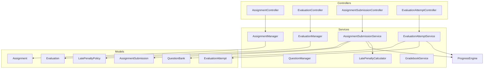
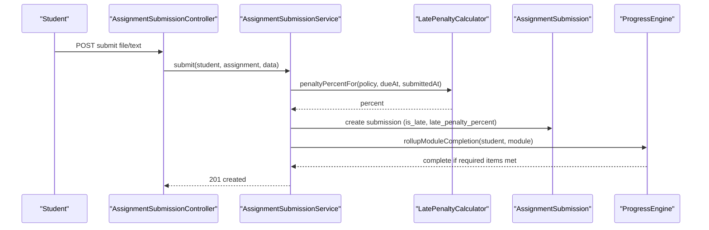
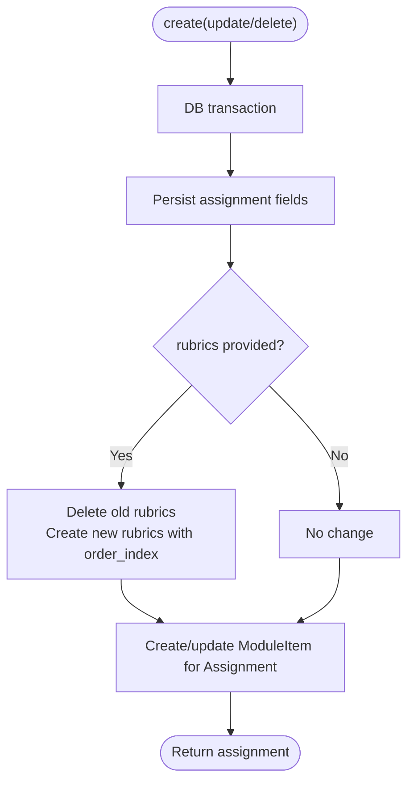
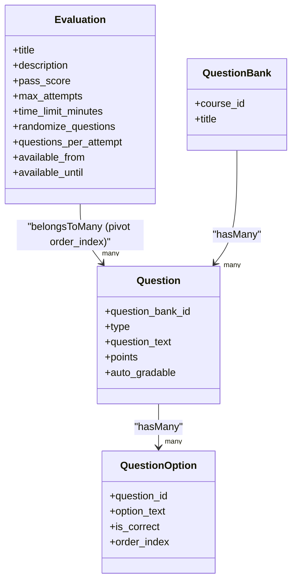
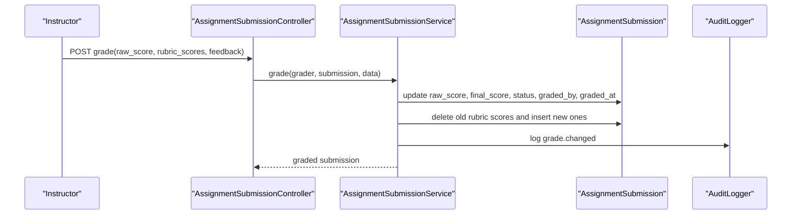
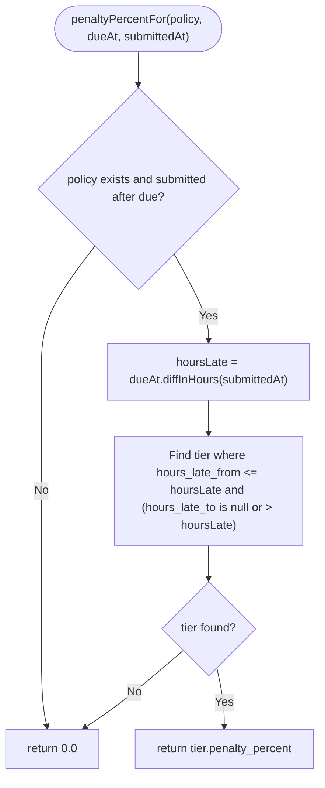
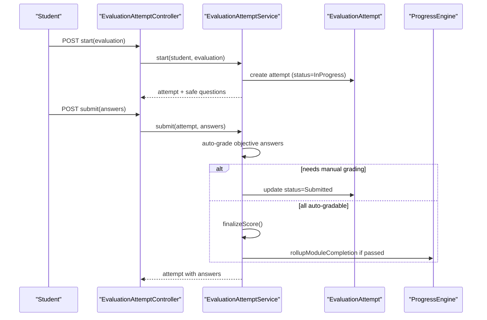
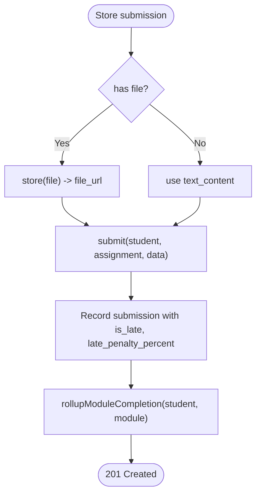
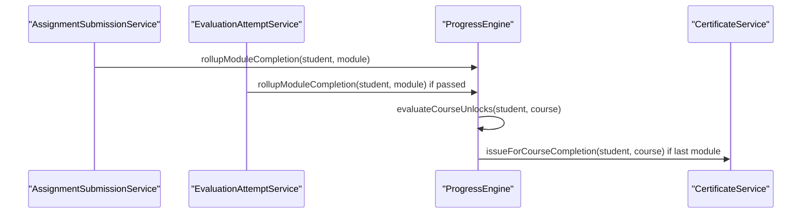
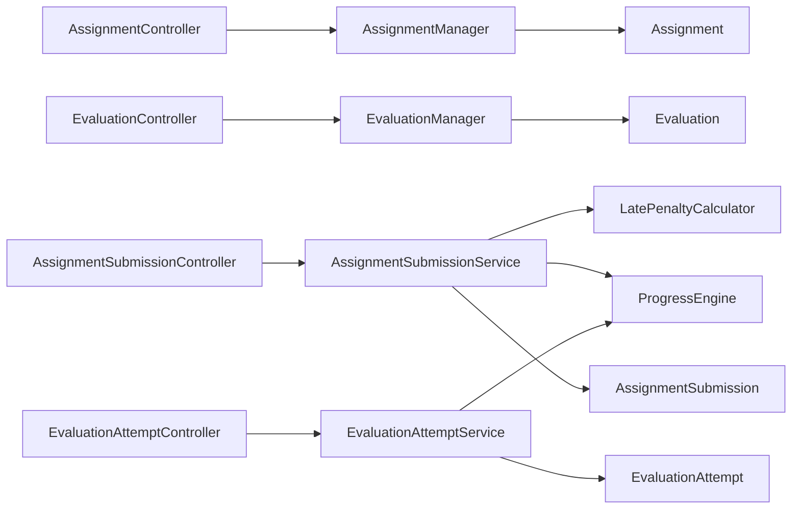

# Assessment & Evaluation System

<cite>
**Referenced Files in This Document**
- [AssignmentManager.php](file://app/Services/Assessment/AssignmentManager.php)
- [EvaluationManager.php](file://app/Services/Assessment/EvaluationManager.php)
- [LatePenaltyCalculator.php](file://app/Services/Assessment/LatePenaltyCalculator.php)
- [QuestionManager.php](file://app/Services/Assessment/QuestionManager.php)
- [AssignmentSubmissionService.php](file://app/Services/Assessment/AssignmentSubmissionService.php)
- [EvaluationAttemptService.php](file://app/Services/Assessment/EvaluationAttemptService.php)
- [GradebookService.php](file://app/Services/Assessment/GradebookService.php)
- [ProgressEngine.php](file://app/services/Progress/ProgressEngine.php)
- [Assignment.php](file://app/Models/Assignment.php)
- [AssignmentSubmission.php](file://app/Models/AssignmentSubmission.php)
- [Evaluation.php](file://app/Models/Evaluation.php)
- [EvaluationAttempt.php](file://app/Models/EvaluationAttempt.php)
- [LatePenaltyPolicy.php](file://app/Models/LatePenaltyPolicy.php)
- [QuestionBank.php](file://app/Models/QuestionBank.php)
- [AssignmentController.php](file://app/Http/Controllers/Api/V1/AssignmentController.php)
- [EvaluationController.php](file://app/Http/Controllers/Api/V1/EvaluationController.php)
- [AssignmentSubmissionController.php](file://app/Http/Controllers/Api/V1/AssignmentSubmissionController.php)
- [EvaluationAttemptController.php](file://app/Http/Controllers/Api/V1/EvaluationAttemptController.php)
</cite>

## Table of Contents
1. Introduction
2. Project Structure
3. Core Components
4. Architecture Overview
5. Detailed Component Analysis
6. Dependency Analysis
7. Performance Considerations
8. Troubleshooting Guide
9. Conclusion

## Introduction
This document explains the Assessment & Evaluation System sub-feature with a focus on:
- Assignment management and rubric-based grading
- Evaluation creation, attempt lifecycle, and automated scoring
- Question bank organization and reuse
- Late penalty calculation for submissions
- Submission handling and grading workflows
- Automated scoring for objective questions
- Integration with progress tracking and certificate generation

The system is implemented as a set of service classes that encapsulate business rules, backed by Eloquent models and exposed through API controllers.

## Project Structure
The assessment feature spans services, models, and HTTP controllers organized by responsibility:
- Services: AssignmentManager, EvaluationManager, QuestionManager, AssignmentSubmissionService, EvaluationAttemptService, LatePenaltyCalculator, GradebookService
- Models: Assignment, AssignmentSubmission, Evaluation, EvaluationAttempt, LatePenaltyPolicy, QuestionBank
- Controllers: AssignmentController, EvaluationController, AssignmentSubmissionController, EvaluationAttemptController
- Progress integration: ProgressEngine (module completion and unlocking)

**Diagram sources**
- [AssignmentController.php:1-48](file://app/Http/Controllers/Api/V1/AssignmentController.php#L1-L48)
- [EvaluationController.php:1-50](file://app/Http/Controllers/Api/V1/EvaluationController.php#L1-L50)
- [AssignmentSubmissionController.php:1-59](file://app/Http/Controllers/Api/V1/AssignmentSubmissionController.php#L1-L59)
- [EvaluationAttemptController.php:1-84](file://app/Http/Controllers/Api/V1/EvaluationAttemptController.php#L1-L84)
- [AssignmentManager.php:1-115](file://app/Services/Assessment/AssignmentManager.php#L1-L115)
- [EvaluationManager.php:1-104](file://app/Services/Assessment/EvaluationManager.php#L1-L104)
- [QuestionManager.php:1-55](file://app/Services/Assessment/QuestionManager.php#L1-L55)
- [AssignmentSubmissionService.php:1-117](file://app/Services/Assessment/AssignmentSubmissionService.php#L1-L117)
- [EvaluationAttemptService.php:1-219](file://app/Services/Assessment/EvaluationAttemptService.php#L1-L219)
- [LatePenaltyCalculator.php:1-36](file://app/Services/Assessment/LatePenaltyCalculator.php#L1-L36)
- [ProgressEngine.php:1-288](file://app/services/Progress/ProgressEngine.php#L1-L288)

**Section sources**
- [AssignmentController.php:1-48](file://app/Http/Controllers/Api/V1/AssignmentController.php#L1-L48)
- [EvaluationController.php:1-50](file://app/Http/Controllers/Api/V1/EvaluationController.php#L1-L50)
- [AssignmentSubmissionController.php:1-59](file://app/Http/Controllers/Api/V1/AssignmentSubmissionController.php#L1-L59)
- [EvaluationAttemptController.php:1-84](file://app/Http/Controllers/Api/V1/EvaluationAttemptController.php#L1-L84)
- [AssignmentManager.php:1-115](file://app/Services/Assessment/AssignmentManager.php#L1-L115)
- [EvaluationManager.php:1-104](file://app/Services/Assessment/EvaluationManager.php#L1-L104)
- [QuestionManager.php:1-55](file://app/Services/Assessment/QuestionManager.php#L1-L55)
- [AssignmentSubmissionService.php:1-117](file://app/Services/Assessment/AssignmentSubmissionService.php#L1-L117)
- [EvaluationAttemptService.php:1-219](file://app/Services/Assessment/EvaluationAttemptService.php#L1-L219)
- [LatePenaltyCalculator.php:1-36](file://app/Services/Assessment/LatePenaltyCalculator.php#L1-L36)
- [ProgressEngine.php:1-288](file://app/services/Progress/ProgressEngine.php#L1-L288)

## Core Components
- AssignmentManager: Creates, updates, and deletes assignments within a module, including syncing assignment rubrics and module item slots.
- EvaluationManager: Creates, updates, and deletes evaluations within a module, including syncing question sets and module item slots.
- QuestionManager: Creates questions in a question bank with options; auto-grading capability is derived from question type.
- AssignmentSubmissionService: Handles student submission of assignments, calculates late penalties, records rubric scores during instructor grading, and triggers progress rollup.
- EvaluationAttemptService: Manages evaluation attempts, enforces availability/attempts/time limits, randomizes/subsets questions, auto-grades objective answers, supports manual grading queues, finalizes scores, and triggers progress rollup when passed.
- LatePenaltyCalculator: Computes late penalty percentage based on configured tiers per policy.
- GradebookService: Aggregates assignment scores and best evaluation attempts to compute per-student final grades.

**Section sources**
- [AssignmentManager.php:1-115](file://app/Services/Assessment/AssignmentManager.php#L1-L115)
- [EvaluationManager.php:1-104](file://app/Services/Assessment/EvaluationManager.php#L1-L104)
- [QuestionManager.php:1-55](file://app/Services/Assessment/QuestionManager.php#L1-L55)
- [AssignmentSubmissionService.php:1-117](file://app/Services/Assessment/AssignmentSubmissionService.php#L1-L117)
- [EvaluationAttemptService.php:1-219](file://app/Services/Assessment/EvaluationAttemptService.php#L1-L219)
- [LatePenaltyCalculator.php:1-36](file://app/Services/Assessment/LatePenaltyCalculator.php#L1-L36)
- [GradebookService.php:1-121](file://app/Services/Assessment/GradebookService.php#L1-L121)

## Architecture Overview
The system follows a layered design:
- Controllers validate requests and delegate to services
- Services enforce business rules, coordinate models, and integrate with cross-cutting concerns (notifications, audit logs, engagement tracking, progress engine)
- Models represent domain entities and relationships
- ProgressEngine centralizes module completion and unlocking logic, which is triggered by assessment outcomes

**Diagram sources**
- [AssignmentSubmissionController.php:38-50](file://app/Http/Controllers/Api/V1/AssignmentSubmissionController.php#L38-L50)
- [AssignmentSubmissionService.php:37-67](file://app/Services/Assessment/AssignmentSubmissionService.php#L37-L67)
- [LatePenaltyCalculator.php:17-34](file://app/Services/Assessment/LatePenaltyCalculator.php#L17-L34)
- [ProgressEngine.php:126-152](file://app/services/Progress/ProgressEngine.php#L126-L152)

## Detailed Component Analysis

### Assignment Management
Responsibilities:
- Create an assignment within a module, persisting assignment fields and creating a corresponding module item slot
- Sync assignment rubrics as a replace-all set to ensure consistent grading criteria
- Update assignment metadata and optional module item settings
- Delete assignment and its module item slot

Key behaviors:
- Rubrics are replaced entirely on create/update to avoid incremental diff complexity
- Module item ordering and requirement flags are managed alongside assignment lifecycle

**Diagram sources**
- [AssignmentManager.php:26-50](file://app/Services/Assessment/AssignmentManager.php#L26-L50)
- [AssignmentManager.php:55-80](file://app/Services/Assessment/AssignmentManager.php#L55-L80)
- [AssignmentManager.php:97-113](file://app/Services/Assessment/AssignmentManager.php#L97-L113)

**Section sources**
- [AssignmentManager.php:1-115](file://app/Services/Assessment/AssignmentManager.php#L1-L115)
- [AssignmentController.php:20-46](file://app/Http/Controllers/Api/V1/AssignmentController.php#L20-L46)
- [Assignment.php:14-71](file://app/Models/Assignment.php#L14-L71)

### Evaluation Creation and Question Bank Organization
Responsibilities:
- Create an evaluation within a module, persisting configuration such as pass score, max attempts, time limit, availability window, and question selection behavior
- Sync the evaluation’s question set with explicit ordering
- Update evaluation metadata and optionally reorder or change required/module item flags
- Delete evaluation and its module item slot

Question bank integration:
- Questions are created within a QuestionBank via QuestionManager
- Auto-grading capability is determined by question type (e.g., multiple choice, true/false), not client input
- Options are stored per question and used for automated scoring

**Diagram sources**
- [EvaluationManager.php:28-49](file://app/Services/Assessment/EvaluationManager.php#L28-L49)
- [EvaluationManager.php:93-102](file://app/Services/Assessment/EvaluationManager.php#L93-L102)
- [Evaluation.php:14-63](file://app/Models/Evaluation.php#L14-L63)
- [QuestionManager.php:24-47](file://app/Services/Assessment/QuestionManager.php#L24-L47)
- [QuestionBank.php:13-41](file://app/Models/QuestionBank.php#L13-L41)

**Section sources**
- [EvaluationManager.php:1-104](file://app/Services/Assessment/EvaluationManager.php#L1-L104)
- [QuestionManager.php:1-55](file://app/Services/Assessment/QuestionManager.php#L1-L55)
- [EvaluationController.php:20-48](file://app/Http/Controllers/Api/V1/EvaluationController.php#L20-L48)
- [Evaluation.php:14-63](file://app/Models/Evaluation.php#L14-L63)
- [QuestionBank.php:13-41](file://app/Models/QuestionBank.php#L13-L41)

### Rubric-Based Grading for Assignments
Workflow:
- Instructor grades a submission by providing raw score, feedback, and per-rubric criterion scores
- Final score is computed by applying the late penalty percentage recorded at submission time
- Rubric scores are persisted per submission and notifications/audit logs are emitted

**Diagram sources**
- [AssignmentSubmissionController.php:52-57](file://app/Http/Controllers/Api/V1/AssignmentSubmissionController.php#L52-L57)
- [AssignmentSubmissionService.php:72-115](file://app/Services/Assessment/AssignmentSubmissionService.php#L72-L115)

**Section sources**
- [AssignmentSubmissionService.php:69-115](file://app/Services/Assessment/AssignmentSubmissionService.php#L69-L115)
- [AssignmentSubmission.php:15-89](file://app/Models/AssignmentSubmission.php#L15-L89)

### Late Penalty Calculation
Behavior:
- Late penalty is calculated at submission time using the assignment’s policy and tiered thresholds
- The resulting percentage is stored on the submission and applied when computing final score during grading
- If no policy or submission is on time, penalty is zero

**Diagram sources**
- [LatePenaltyCalculator.php:17-34](file://app/Services/Assessment/LatePenaltyCalculator.php#L17-L34)
- [LatePenaltyPolicy.php:12-39](file://app/Models/LatePenaltyPolicy.php#L12-L39)

**Section sources**
- [LatePenaltyCalculator.php:1-36](file://app/Services/Assessment/LatePenaltyCalculator.php#L1-L36)
- [LatePenaltyPolicy.php:1-39](file://app/Models/LatePenaltyPolicy.php#L1-L39)
- [AssignmentSubmissionService.php:37-67](file://app/Services/Assessment/AssignmentSubmissionService.php#L37-L67)

### Evaluation Attempt Lifecycle and Automated Scoring
Lifecycle:
- Start: validates availability window, prevents duplicate in-progress attempts, enforces max attempts, creates attempt record
- Questions: loads evaluation questions, optionally shuffles and subsets them per configuration
- Submit: enforces time limit, persists answers, auto-grades objective questions, marks attempt as Submitted if any answer requires manual grading, otherwise finalizes immediately
- Manual grading: allows instructors to grade short-answer/essay responses, then finalizes score
- Finalization: computes score percent, determines pass/fail, notifies student, and triggers progress rollup if passed

**Diagram sources**
- [EvaluationAttemptController.php:40-82](file://app/Http/Controllers/Api/V1/EvaluationAttemptController.php#L40-L82)
- [EvaluationAttemptService.php:35-78](file://app/Services/Assessment/EvaluationAttemptService.php#L35-L78)
- [EvaluationAttemptService.php:102-148](file://app/Services/Assessment/EvaluationAttemptService.php#L102-L148)
- [EvaluationAttemptService.php:154-180](file://app/Services/Assessment/EvaluationAttemptService.php#L154-L180)
- [EvaluationAttemptService.php:183-206](file://app/Services/Assessment/EvaluationAttemptService.php#L183-L206)
- [ProgressEngine.php:126-152](file://app/services/Progress/ProgressEngine.php#L126-L152)

**Section sources**
- [EvaluationAttemptService.php:1-219](file://app/Services/Assessment/EvaluationAttemptService.php#L1-L219)
- [EvaluationAttempt.php:14-64](file://app/Models/EvaluationAttempt.php#L14-L64)
- [EvaluationAttemptController.php:1-84](file://app/Http/Controllers/Api/V1/EvaluationAttemptController.php#L1-L84)

### Submission Handling and Grading Workflows
- Student submits either a file or text content; controller stores files via storage service and passes URL to service
- Service records submission timestamp, detects lateness, computes penalty, increments attempt number, and sets initial status
- Progress rollup is triggered immediately upon submission so module completion reflects submission presence
- Instructor grading writes rubric-level detail and applies late penalty to derive final score

**Diagram sources**
- [AssignmentSubmissionController.php:38-50](file://app/Http/Controllers/Api/V1/AssignmentSubmissionController.php#L38-L50)
- [AssignmentSubmissionService.php:37-67](file://app/Services/Assessment/AssignmentSubmissionService.php#L37-L67)

**Section sources**
- [AssignmentSubmissionController.php:1-59](file://app/Http/Controllers/Api/V1/AssignmentSubmissionController.php#L1-L59)
- [AssignmentSubmissionService.php:1-117](file://app/Services/Assessment/AssignmentSubmissionService.php#L1-L117)

### Relationship with Progress Tracking and Certificate Generation
- Assignment submissions count toward module completion regardless of grade; this is enforced by ProgressEngine’s item completion check for assignments
- Evaluation attempts only count toward completion when passed; ProgressEngine checks passed flag for evaluation items
- When all required items are complete, the module is marked completed and course unlocks are evaluated; completing the last applicable module triggers certificate issuance

**Diagram sources**
- [AssignmentSubmissionService.php:62-67](file://app/Services/Assessment/AssignmentSubmissionService.php#L62-L67)
- [EvaluationAttemptService.php:183-206](file://app/Services/Assessment/EvaluationAttemptService.php#L183-L206)
- [ProgressEngine.php:126-152](file://app/services/Progress/ProgressEngine.php#L126-L152)

**Section sources**
- [ProgressEngine.php:126-152](file://app/services/Progress/ProgressEngine.php#L126-L152)
- [AssignmentSubmissionService.php:37-67](file://app/Services/Assessment/AssignmentSubmissionService.php#L37-L67)
- [EvaluationAttemptService.php:183-206](file://app/Services/Assessment/EvaluationAttemptService.php#L183-L206)

## Dependency Analysis
Key dependencies and coupling:
- Controllers depend on managers and services for validation delegation and response shaping
- Managers depend on models and module item infrastructure to keep assessments linked to course structure
- Submission and attempt services depend on LatePenaltyCalculator, ProgressEngine, NotificationDispatcher, EngagementTracker, and AuditLogger
- GradebookService depends on Assignment, Evaluation, Enrollment, and related models to aggregate scores

**Diagram sources**
- [AssignmentController.php:1-48](file://app/Http/Controllers/Api/V1/AssignmentController.php#L1-L48)
- [EvaluationController.php:1-50](file://app/Http/Controllers/Api/V1/EvaluationController.php#L1-L50)
- [AssignmentSubmissionController.php:1-59](file://app/Http/Controllers/Api/V1/AssignmentSubmissionController.php#L1-L59)
- [EvaluationAttemptController.php:1-84](file://app/Http/Controllers/Api/V1/EvaluationAttemptController.php#L1-L84)
- [AssignmentManager.php:1-115](file://app/Services/Assessment/AssignmentManager.php#L1-L115)
- [EvaluationManager.php:1-104](file://app/Services/Assessment/EvaluationManager.php#L1-L104)
- [AssignmentSubmissionService.php:1-117](file://app/Services/Assessment/AssignmentSubmissionService.php#L1-L117)
- [EvaluationAttemptService.php:1-219](file://app/Services/Assessment/EvaluationAttemptService.php#L1-L219)
- [LatePenaltyCalculator.php:1-36](file://app/Services/Assessment/LatePenaltyCalculator.php#L1-L36)
- [ProgressEngine.php:1-288](file://app/services/Progress/ProgressEngine.php#L1-L288)

**Section sources**
- [AssignmentManager.php:1-115](file://app/Services/Assessment/AssignmentManager.php#L1-L115)
- [EvaluationManager.php:1-104](file://app/Services/Assessment/EvaluationManager.php#L1-L104)
- [AssignmentSubmissionService.php:1-117](file://app/Services/Assessment/AssignmentSubmissionService.php#L1-L117)
- [EvaluationAttemptService.php:1-219](file://app/Services/Assessment/EvaluationAttemptService.php#L1-L219)
- [LatePenaltyCalculator.php:1-36](file://app/Services/Assessment/LatePenaltyCalculator.php#L1-L36)
- [ProgressEngine.php:1-288](file://app/services/Progress/ProgressEngine.php#L1-L288)

## Performance Considerations
- Use database transactions for multi-step operations (assignment/rubric sync, evaluation/question sync, grading) to maintain consistency and reduce partial writes
- Prefer bulk operations where possible (e.g., replacing rubrics in one pass, syncing question sets)
- Avoid N+1 queries in gradebook aggregation by loading collections and grouping in memory
- Keep evaluation question retrieval efficient by leveraging eager loading and limiting result sets via questions_per_attempt
- Offload heavy work (notifications, audits, engagement tracking) to background jobs if needed to reduce request latency

[No sources needed since this section provides general guidance]

## Troubleshooting Guide
Common issues and diagnostics:
- Evaluation not available: Ensure availability window is correct and attempts have not exceeded max_attempts; controller will abort with appropriate messages
- Time limit exceeded: Attempt submission will be rejected if past deadline; verify started_at and evaluation time_limit_minutes
- Manual grading queue: Attempts with short-answer/essay remain in Submitted until graded; use the grading endpoint to finalize
- Late penalty not applied: Confirm assignment has a valid late penalty policy and due_at; verify submission timestamp and penalty calculation path
- Module not completing: For assignments, submission must exist; for evaluations, attempt must be passed; check ProgressEngine’s item completion logic

**Section sources**
- [EvaluationAttemptService.php:35-78](file://app/Services/Assessment/EvaluationAttemptService.php#L35-L78)
- [EvaluationAttemptService.php:102-148](file://app/Services/Assessment/EvaluationAttemptService.php#L102-L148)
- [LatePenaltyCalculator.php:17-34](file://app/Services/Assessment/LatePenaltyCalculator.php#L17-L34)
- [ProgressEngine.php:154-168](file://app/services/Progress/ProgressEngine.php#L154-L168)

## Conclusion
The Assessment & Evaluation System provides robust support for both subjective and objective assessments:
- Assignments support flexible rubric-based grading with late penalties and immediate progress impact upon submission
- Evaluations offer configurable attempts, time limits, randomized subsets, and automatic scoring for objective questions with a manual grading pathway for essays
- Question banks enable reusable, auto-gradable question assets
- Progress integration ensures accurate module completion and course unlocking, culminating in certificate issuance upon course completion
- Gradebook aggregation offers a clear view of student performance across assignments and evaluations

[No sources needed since this section summarizes without analyzing specific files]