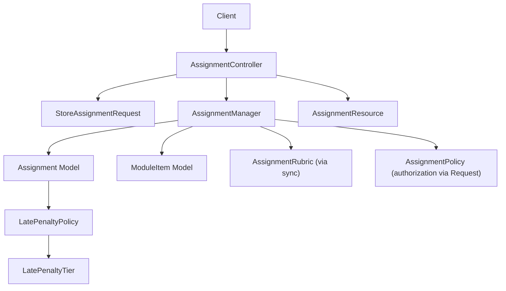
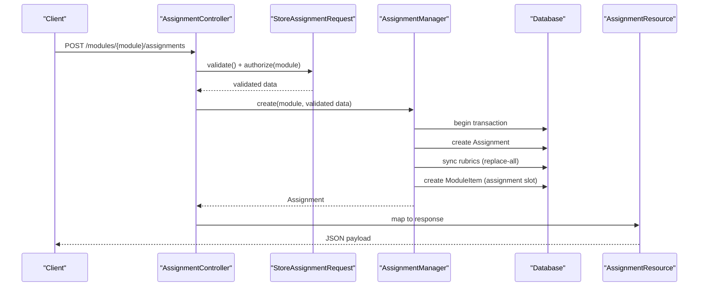
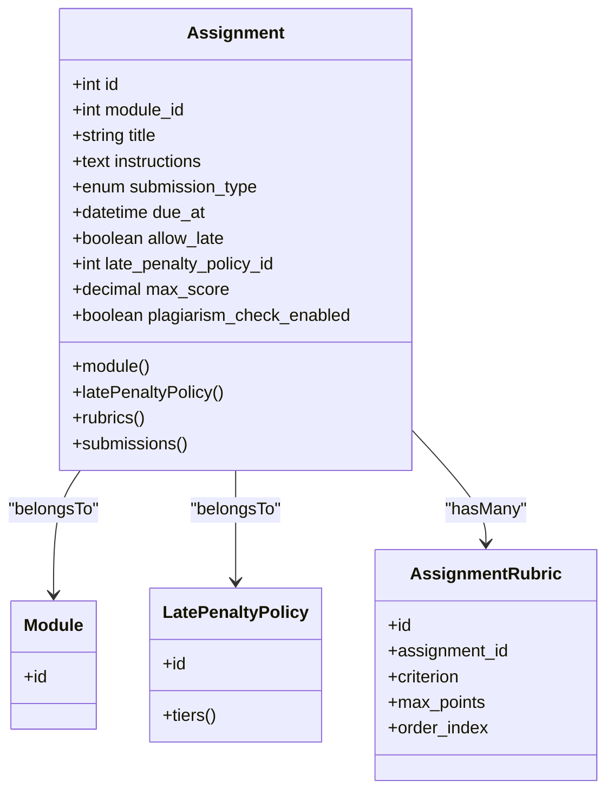
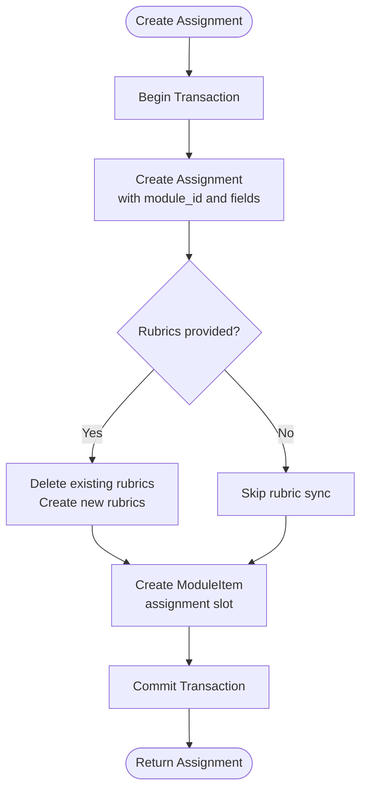
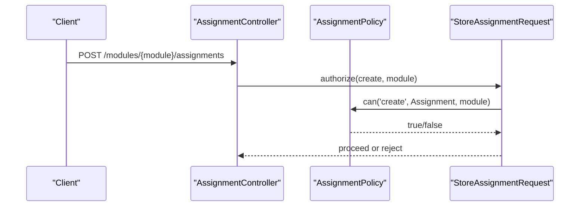
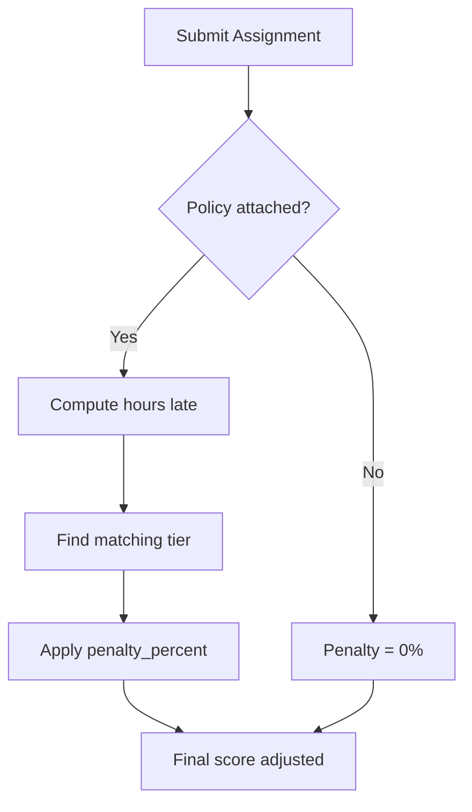
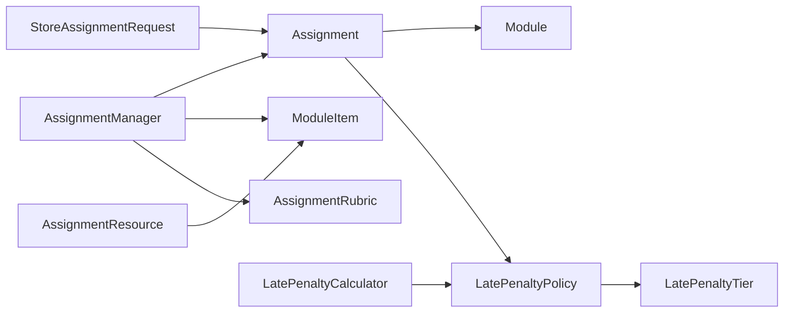

# Assignment Creation & Configuration

<cite>
**Referenced Files in This Document**
- [Assignment.php](file://app/Models/Assignment.php)
- [AssignmentSubmissionType.php](file://app/Enums/AssignmentSubmissionType.php)
- [StoreAssignmentRequest.php](file://app/Http/Requests/Api/V1/StoreAssignmentRequest.php)
- [AssignmentManager.php](file://app/Services/Assessment/AssignmentManager.php)
- [AssignmentController.php](file://app/Http/Controllers/Api/V1/AssignmentController.php)
- [AssignmentPolicy.php](file://app/Policies/AssignmentPolicy.php)
- [ModuleItem.php](file://app/Models/ModuleItem.php)
- [ModuleItemType.php](file://app/Enums/ModuleItemType.php)
- [LatePenaltyPolicy.php](file://app/Models/LatePenaltyPolicy.php)
- [LatePenaltyTier.php](file://app/Models/LatePenaltyTier.php)
- [LatePenaltyCalculator.php](file://app/Services/Assessment/LatePenaltyCalculator.php)
- [AssignmentResource.php](file://app/Http/Resources/AssignmentResource.php)
- [2024_01_01_000132_create_assignments_table.php](file://database/migrations/2024_01_01_000132_create_assignments_table.php)
</cite>

## Table of Contents
1. Introduction
2. Project Structure
3. Core Components
4. Architecture Overview
5. Detailed Component Analysis
6. Dependency Analysis
7. Performance Considerations
8. Troubleshooting Guide
9. Conclusion

## Introduction
This document explains how assignments are created and configured in the system, focusing on the Assignment model fields, submission types, validation rules, business logic for creation, late penalty policies, scoring configuration, visibility controls, and access permissions. It is intended for developers integrating with or extending assignment features.

## Project Structure
Assignment-related functionality spans models, enums, requests, services, controllers, policies, resources, and database migrations:
- Models define data structure and relationships (Assignment, ModuleItem, LatePenaltyPolicy, LatePenaltyTier).
- Enums standardize submission type and module item type.
- Requests enforce input validation and authorization.
- Services encapsulate business logic for creating/updating assignments and managing rubrics.
- Controllers expose API endpoints that orchestrate request handling and service calls.
- Policies control who can create/update/delete assignments based on course ownership and roles.
- Resources shape API responses, including derived visibility flags from ModuleItem.
- Migrations define the schema for assignments and related tables.

**Diagram sources**
- [AssignmentController.php:25-30](file://app/Http/Controllers/Api/V1/AssignmentController.php#L25-L30)
- [StoreAssignmentRequest.php:15-36](file://app/Http/Requests/Api/V1/StoreAssignmentRequest.php#L15-L36)
- [AssignmentManager.php:26-49](file://app/Services/Assessment/AssignmentManager.php#L26-L49)
- [Assignment.php:19-37](file://app/Models/Assignment.php#L19-L37)
- [ModuleItem.php:21-33](file://app/Models/ModuleItem.php#L21-L33)
- [LatePenaltyPolicy.php:19-37](file://app/Models/LatePenaltyPolicy.php#L19-L37)
- [LatePenaltyTier.php:19-28](file://app/Models/LatePenaltyTier.php#L19-L28)
- [AssignmentResource.php:16-39](file://app/Http/Resources/AssignmentResource.php#L16-L39)

**Section sources**
- [AssignmentController.php:25-30](file://app/Http/Controllers/Api/V1/AssignmentController.php#L25-L30)
- [StoreAssignmentRequest.php:15-36](file://app/Http/Requests/Api/V1/StoreAssignmentRequest.php#L15-L36)
- [AssignmentManager.php:26-49](file://app/Services/Assessment/AssignmentManager.php#L26-L49)
- [Assignment.php:19-37](file://app/Models/Assignment.php#L19-L37)
- [ModuleItem.php:21-33](file://app/Models/ModuleItem.php#L21-L33)
- [LatePenaltyPolicy.php:19-37](file://app/Models/LatePenaltyPolicy.php#L19-L37)
- [LatePenaltyTier.php:19-28](file://app/Models/LatePenaltyTier.php#L19-L28)
- [AssignmentResource.php:16-39](file://app/Http/Resources/AssignmentResource.php#L16-L39)

## Core Components
- Assignment model defines core fields and casts, including module association, submission type enum, due date, late submission settings, late penalty policy reference, max score, and plagiarism check flag.
- AssignmentSubmissionType enum enumerates allowed submission modes.
- StoreAssignmentRequest validates incoming assignment creation payloads and enforces authorization against a module context.
- AssignmentManager creates assignments within a transaction, persists rubrics, and links the assignment into the module’s item list with ordering and required flags.
- AssignmentPolicy governs who can manage assignments based on role and course teaching relationship.
- LatePenaltyPolicy and LatePenaltyTier define configurable late penalties applied at grading time.
- AssignmentResource exposes assignment details plus derived visibility flags from ModuleItem.

**Section sources**
- [Assignment.php:19-37](file://app/Models/Assignment.php#L19-L37)
- [AssignmentSubmissionType.php:7-12](file://app/Enums/AssignmentSubmissionType.php#L7-L12)
- [StoreAssignmentRequest.php:15-36](file://app/Http/Requests/Api/V1/StoreAssignmentRequest.php#L15-L36)
- [AssignmentManager.php:26-49](file://app/Services/Assessment/AssignmentManager.php#L26-L49)
- [AssignmentPolicy.php:15-42](file://app/Policies/AssignmentPolicy.php#L15-L42)
- [LatePenaltyPolicy.php:19-37](file://app/Models/LatePenaltyPolicy.php#L19-L37)
- [LatePenaltyTier.php:19-28](file://app/Models/LatePenaltyTier.php#L19-L28)
- [AssignmentResource.php:16-39](file://app/Http/Resources/AssignmentResource.php#L16-L39)

## Architecture Overview
The assignment creation flow integrates request validation, authorization, service-level business logic, and persistence across multiple entities.

**Diagram sources**
- [AssignmentController.php:25-30](file://app/Http/Controllers/Api/V1/AssignmentController.php#L25-L30)
- [StoreAssignmentRequest.php:15-36](file://app/Http/Requests/Api/V1/StoreAssignmentRequest.php#L15-L36)
- [AssignmentManager.php:26-49](file://app/Services/Assessment/AssignmentManager.php#L26-L49)
- [AssignmentResource.php:16-39](file://app/Http/Resources/AssignmentResource.php#L16-L39)

## Detailed Component Analysis

### Assignment Model and Schema
- Fields include module_id, title, instructions, submission_type, due_at, allow_late, late_penalty_policy_id, max_score, plagiarism_check_enabled.
- Casts ensure proper typing: submission_type maps to an enum; due_at is datetime; booleans and decimal for scoring.
- Relationships: belongs-to Module, belongs-to LatePenaltyPolicy, has-many rubrics and submissions.
- Database migration defines column types, defaults, and foreign keys.

**Diagram sources**
- [Assignment.php:19-69](file://app/Models/Assignment.php#L19-L69)
- [2024_01_01_000132_create_assignments_table.php:13-24](file://database/migrations/2024_01_01_000132_create_assignments_table.php#L13-L24)

**Section sources**
- [Assignment.php:19-69](file://app/Models/Assignment.php#L19-L69)
- [2024_01_01_000132_create_assignments_table.php:13-24](file://database/migrations/2024_01_01_000132_create_assignments_table.php#L13-L24)

### Submission Types
- The AssignmentSubmissionType enum defines allowed submission modes.
- Use cases:
  - File: when students must upload documents or media.
  - Text: when students paste text answers directly.
  - Both: when either file or text submissions are acceptable.

**Section sources**
- [AssignmentSubmissionType.php:7-12](file://app/Enums/AssignmentSubmissionType.php#L7-L12)

### Validation Rules and Authorization (StoreAssignmentRequest)
- Authorization checks that the current user can create an assignment for the given module.
- Validation rules:
  - title: required string, max length.
  - instructions: optional text.
  - submission_type: required enum value.
  - due_at: optional date.
  - allow_late: optional boolean.
  - late_penalty_policy_id: optional integer referencing existing policy.
  - max_score: optional numeric, non-negative.
  - plagiarism_check_enabled: optional boolean.
  - is_required: optional boolean controlling whether completion is mandatory.
  - order_index: optional integer for ordering within the module.
  - rubrics: optional array with criterion and max_points per rubric.

**Section sources**
- [StoreAssignmentRequest.php:15-36](file://app/Http/Requests/Api/V1/StoreAssignmentRequest.php#L15-L36)

### Business Logic for Creating Assignments (AssignmentManager::create)
- Runs inside a database transaction to ensure consistency.
- Creates the Assignment with selected fields and associates it with the provided module.
- Syncs rubrics by replacing all existing rubrics with the provided set (replace-all semantics).
- Creates a ModuleItem entry linking the assignment into the module’s sequence, setting order_index and is_required if provided.
- Returns the persisted Assignment.

**Diagram sources**
- [AssignmentManager.php:26-49](file://app/Services/Assessment/AssignmentManager.php#L26-L49)
- [AssignmentManager.php:97-113](file://app/Services/Assessment/AssignmentManager.php#L97-L113)

**Section sources**
- [AssignmentManager.php:26-49](file://app/Services/Assessment/AssignmentManager.php#L26-L49)
- [AssignmentManager.php:97-113](file://app/Services/Assessment/AssignmentManager.php#L97-L113)

### Visibility Controls and Access Permissions
- Visibility within a module is controlled by ModuleItem fields:
  - is_required: indicates whether the assignment is mandatory for module completion.
  - order_index: determines display order among module items.
- AssignmentResource derives these values when returning assignment data.
- Access permissions are enforced by AssignmentPolicy:
  - Only admins or instructors teaching the course can create, update, delete, or grade assignments.
  - Authorization is checked during store via StoreAssignmentRequest and destroy via controller authorization.

**Diagram sources**
- [StoreAssignmentRequest.php:15-18](file://app/Http/Requests/Api/V1/StoreAssignmentRequest.php#L15-L18)
- [AssignmentPolicy.php:15-18](file://app/Policies/AssignmentPolicy.php#L15-L18)
- [AssignmentController.php:39-45](file://app/Http/Controllers/Api/V1/AssignmentController.php#L39-L45)

**Section sources**
- [ModuleItem.php:21-33](file://app/Models/ModuleItem.php#L21-L33)
- [AssignmentResource.php:16-39](file://app/Http/Resources/AssignmentResource.php#L16-L39)
- [AssignmentPolicy.php:15-42](file://app/Policies/AssignmentPolicy.php#L15-L42)
- [StoreAssignmentRequest.php:15-18](file://app/Http/Requests/Api/V1/StoreAssignmentRequest.php#L15-L18)
- [AssignmentController.php:39-45](file://app/Http/Controllers/Api/V1/AssignmentController.php#L39-L45)

### Late Penalties and Scoring Configuration
- LatePenaltyPolicy groups tiers that define percentage penalties for different lateness windows.
- LatePenaltyTier specifies hours ranges and corresponding penalty percentages.
- LatePenaltyCalculator computes the applicable penalty percent based on due_at and submitted_at timestamps using the assigned policy.
- Assignment.max_score sets the maximum points available for the assignment.
- allow_late indicates whether late submissions are permitted; plagiarism_check_enabled toggles plagiarism detection for submissions.

**Diagram sources**
- [LatePenaltyCalculator.php:17-34](file://app/Services/Assessment/LatePenaltyCalculator.php#L17-L34)
- [LatePenaltyPolicy.php:19-37](file://app/Models/LatePenaltyPolicy.php#L19-L37)
- [LatePenaltyTier.php:19-28](file://app/Models/LatePenaltyTier.php#L19-L28)

**Section sources**
- [LatePenaltyCalculator.php:17-34](file://app/Services/Assessment/LatePenaltyCalculator.php#L17-L34)
- [LatePenaltyPolicy.php:19-37](file://app/Models/LatePenaltyPolicy.php#L19-L37)
- [LatePenaltyTier.php:19-28](file://app/Models/LatePenaltyTier.php#L19-L28)
- [Assignment.php:19-37](file://app/Models/Assignment.php#L19-L37)

### Example Scenarios
- File-only assignment:
  - Set submission_type to file.
  - Provide due_at in the future.
  - Optionally attach a late_penalty_policy_id and set allow_late to true.
  - Configure max_score and plagiarism_check_enabled as needed.
- Text-only assignment:
  - Set submission_type to text.
  - Provide instructions describing expected answer format.
  - Configure due_at and scoring similarly.
- Both submission types:
  - Set submission_type to both to accept either files or text.
  - Ensure instructions clarify acceptable formats.
- Required vs optional:
  - Set is_required to true to make the assignment mandatory for module progression.
  - Adjust order_index to place the assignment appropriately in the module sequence.
- Late submission with penalties:
  - Attach a late_penalty_policy_id with defined tiers.
  - Keep allow_late enabled to permit late submissions with calculated penalties.
- Plagiarism detection:
  - Enable plagiarism_check_enabled to trigger plagiarism checks on submissions.

[No sources needed since this section provides conceptual examples]

## Dependency Analysis
Key dependencies and relationships:
- Assignment depends on Module and LatePenaltyPolicy.
- AssignmentManager orchestrates Assignment, ModuleItem, and AssignmentRubric creation/sync.
- StoreAssignmentRequest depends on AssignmentSubmissionType and references Module for authorization.
- AssignmentResource reads ModuleItem to derive visibility and ordering.
- LatePenaltyCalculator depends on LatePenaltyPolicy and LatePenaltyTier to compute penalties.

**Diagram sources**
- [Assignment.php:42-69](file://app/Models/Assignment.php#L42-L69)
- [AssignmentManager.php:26-49](file://app/Services/Assessment/AssignmentManager.php#L26-L49)
- [StoreAssignmentRequest.php:15-36](file://app/Http/Requests/Api/V1/StoreAssignmentRequest.php#L15-L36)
- [AssignmentResource.php:16-39](file://app/Http/Resources/AssignmentResource.php#L16-L39)
- [LatePenaltyCalculator.php:17-34](file://app/Services/Assessment/LatePenaltyCalculator.php#L17-L34)

**Section sources**
- [Assignment.php:42-69](file://app/Models/Assignment.php#L42-L69)
- [AssignmentManager.php:26-49](file://app/Services/Assessment/AssignmentManager.php#L26-L49)
- [StoreAssignmentRequest.php:15-36](file://app/Http/Requests/Api/V1/StoreAssignmentRequest.php#L15-L36)
- [AssignmentResource.php:16-39](file://app/Http/Resources/AssignmentResource.php#L16-L39)
- [LatePenaltyCalculator.php:17-34](file://app/Services/Assessment/LatePenaltyCalculator.php#L17-L34)

## Performance Considerations
- Assignment creation uses a single database transaction to minimize round-trips and ensure atomicity across Assignment, rubrics, and ModuleItem.
- Rubric synchronization replaces all rubrics in one operation, avoiding incremental diffs and reducing complexity.
- AssignmentResource performs a targeted lookup for ModuleItem to derive visibility flags; consider eager loading where appropriate in read-heavy contexts.
- Late penalty calculation is O(1) per submission after tier lookup; ensure policies and tiers are indexed appropriately for performance.

[No sources needed since this section provides general guidance]

## Troubleshooting Guide
- Validation errors:
  - Missing or invalid submission_type will fail enum validation.
  - Invalid late_penalty_policy_id will fail existence check.
  - Non-numeric or negative max_score will be rejected.
- Authorization failures:
  - Users without admin or instructor rights for the course cannot create assignments; verify role and course teaching relationship.
- Visibility issues:
  - If an assignment does not appear in module order, ensure ModuleItem was created with correct order_index and is_required flags.
- Late penalties not applied:
  - Confirm that a valid late_penalty_policy_id is attached and allow_late is enabled; verify due_at and submitted_at timestamps.
- Rubrics not updating:
  - Rubrics are replaced entirely on create/update; ensure the full desired set is provided each time.

**Section sources**
- [StoreAssignmentRequest.php:20-36](file://app/Http/Requests/Api/V1/StoreAssignmentRequest.php#L20-L36)
- [AssignmentPolicy.php:15-42](file://app/Policies/AssignmentPolicy.php#L15-L42)
- [AssignmentManager.php:26-49](file://app/Services/Assessment/AssignmentManager.php#L26-L49)
- [AssignmentManager.php:97-113](file://app/Services/Assessment/AssignmentManager.php#L97-L113)
- [LatePenaltyCalculator.php:17-34](file://app/Services/Assessment/LatePenaltyCalculator.php#L17-L34)

## Conclusion
Assignment creation combines robust validation, clear authorization, and transactional business logic to persist assignments, link them into modules, and manage rubrics. Submission types support flexible assessment needs, while late penalty policies and scoring configurations provide granular control over grading behavior. Visibility and permissions ensure only authorized users can manage assignments and that module sequencing reflects instructional intent.

[No sources needed since this section summarizes without analyzing specific files]