# Assignment Management

<cite>
**Referenced Files in This Document**
- [Assignment.php](file://app/Models/Assignment.php)
- [AssignmentSubmission.php](file://app/Models/AssignmentSubmission.php)
- [AssignmentRubric.php](file://app/Models/AssignmentRubric.php)
- [LatePenaltyPolicy.php](file://app/Models/LatePenaltyPolicy.php)
- [PlagiarismReport.php](file://app/Models/PlagiarismReport.php)
- [AssignmentSubmissionType.php](file://app/Enums/AssignmentSubmissionType.php)
- [AssignmentManager.php](file://app\Services/Assessment/AssignmentManager.php)
- [AssignmentSubmissionService.php](file://app\Services/Assessment/AssignmentSubmissionService.php)
- [LatePenaltyCalculator.php](file://app/services/Assessment/LatePenaltyCalculator.php)
- [AssignmentController.php](file://app/Http/Controllers/Api/V1/AssignmentController.php)
- [AssignmentSubmissionController.php](file://app/Http/Controllers/Api/V1/AssignmentSubmissionController.php)
- [AssignmentResource.php](file://app/Http/Resources/AssignmentResource.php)
- [AssignmentSubmissionResource.php](file://app/Http/Resources/AssignmentSubmissionResource.php)
- [AssignmentPolicy.php](file://app/Policies/AssignmentPolicy.php)
- [AssignmentSubmissionPolicy.php](file://app/Policies/AssignmentSubmissionPolicy.php)
</cite>

## Table of Contents
1. Introduction
2. Project Structure
3. Core Components
4. Architecture Overview
5. Detailed Component Analysis
6. Dependency Analysis
7. Performance Considerations
8. Troubleshooting Guide
9. Conclusion

## Introduction
This document explains the Assignment Management system, covering the Assignment model structure, submission types (file upload, text, URL via file storage), due date handling, and late submission policies. It documents the AssignmentManager service methods for creating, updating, and managing assignments; assignment creation workflows; submission handling processes; integration points with plagiarism detection; relationships between assignments and modules; rubric configuration and scoring mechanisms; visibility controls and access permissions; and student submission workflows.

## Project Structure
The Assignment feature spans models, services, controllers, resources, and policies:
- Models define data structures and relationships (Assignment, AssignmentSubmission, AssignmentRubric, LatePenaltyPolicy, PlagiarismReport).
- Services encapsulate business logic (AssignmentManager for CRUD and module item management; AssignmentSubmissionService for submissions and grading; LatePenaltyCalculator for penalty computation).
- Controllers expose API endpoints and delegate to services and policies for authorization.
- Resources serialize responses for clients.
- Policies enforce role-based and enrollment-based access.

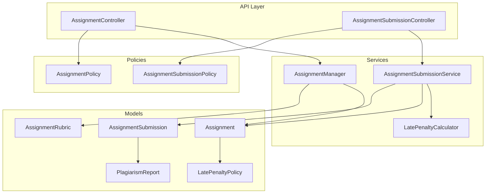

**Diagram sources**
- [AssignmentController.php:1-48](file://app/Http/Controllers/Api/V1/AssignmentController.php#L1-L48)
- [AssignmentSubmissionController.php:1-59](file://app/Http/Controllers/Api/V1/AssignmentSubmissionController.php#L1-L59)
- [AssignmentManager.php:1-115](file://app/Services/Assessment/AssignmentManager.php#L1-L115)
- [AssignmentSubmissionService.php:1-117](file://app/Services/Assessment/AssignmentSubmissionService.php#L1-L117)
- [LatePenaltyCalculator.php:1-36](file://app/services/Assessment/LatePenaltyCalculator.php#L1-L36)
- [Assignment.php:1-71](file://app/Models/Assignment.php#L1-L71)
- [AssignmentSubmission.php:1-89](file://app/Models/AssignmentSubmission.php#L1-L89)
- [AssignmentRubric.php:1-47](file://app/Models/AssignmentRubric.php#L1-L47)
- [LatePenaltyPolicy.php:1-39](file://app/Models/LatePenaltyPolicy.php#L1-L39)
- [PlagiarismReport.php:1-34](file://app/Models/PlagiarismReport.php#L1-L34)
- [AssignmentPolicy.php:1-44](file://app/Policies/AssignmentPolicy.php#L1-L44)
- [AssignmentSubmissionPolicy.php:1-42](file://app/Policies/AssignmentSubmissionPolicy.php#L1-L42)

**Section sources**
- [AssignmentController.php:1-48](file://app/Http/Controllers/Api/V1/AssignmentController.php#L1-L48)
- [AssignmentSubmissionController.php:1-59](file://app/Http/Controllers/Api/V1/AssignmentSubmissionController.php#L1-L59)
- [AssignmentManager.php:1-115](file://app/Services/Assessment/AssignmentManager.php#L1-L115)
- [AssignmentSubmissionService.php:1-117](file://app/Services/Assessment/AssignmentSubmissionService.php#L1-L117)

## Core Components
- Assignment model: stores module linkage, title, instructions, submission type, due date, late policy reference, max score, and plagiarism check flag. Casts ensure proper types for dates, booleans, decimals, and enum values.
- AssignmentSubmission model: records per-attempt submissions including file URL or text content, timestamps, lateness flags, penalties, status, scores, feedback, grader identity, and grading timestamp.
- AssignmentRubric model: defines criteria and maximum points per criterion for an assignment.
- LatePenaltyPolicy model: groups tiers that define percentage deductions based on hours late.
- PlagiarismReport model: stores similarity score, report URL, and check timestamp linked to a submission.
- AssignmentSubmissionType enum: enumerates allowed submission modes (file, text, both).

Key relationships:
- Assignment belongs to Module and LatePenaltyPolicy; has many Rubrics and Submissions.
- AssignmentSubmission belongs to Assignment, Student (User), GradedBy (User); has many RubricScores and one PlagiarismReport.
- AssignmentRubric belongs to Assignment; has many RubricScores.

**Section sources**
- [Assignment.php:1-71](file://app/Models/Assignment.php#L1-L71)
- [AssignmentSubmission.php:1-89](file://app/Models/AssignmentSubmission.php#L1-L89)
- [AssignmentRubric.php:1-47](file://app/Models/AssignmentRubric.php#L1-L47)
- [LatePenaltyPolicy.php:1-39](file://app/Models/LatePenaltyPolicy.php#L1-L39)
- [PlagiarismReport.php:1-34](file://app/Models/PlagiarismReport.php#L1-L34)
- [AssignmentSubmissionType.php:1-13](file://app/Enums/AssignmentSubmissionType.php#L1-L13)

## Architecture Overview
The system separates concerns across layers:
- Controllers handle HTTP requests, validate inputs, enforce policies, and delegate to services.
- Services implement domain logic:
  - AssignmentManager creates/updates/deletes assignments and synchronizes rubrics and module items atomically.
  - AssignmentSubmissionService handles submission lifecycle, computes lateness and penalties, updates progress, and manages grading with rubric scores and notifications.
  - LatePenaltyCalculator computes penalty percentages based on configured tiers.
- Models represent entities and relationships.
- Resources format API responses.
- Policies enforce access control based on roles and enrollment.

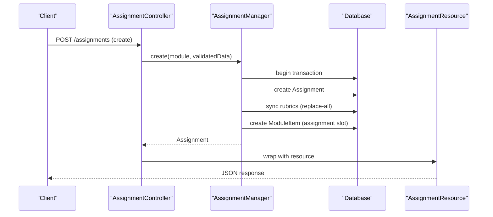

**Diagram sources**
- [AssignmentController.php:20-30](file://app/Http/Controllers/Api/V1/AssignmentController.php#L20-L30)
- [AssignmentManager.php:26-50](file://app/Services/Assessment/AssignmentManager.php#L26-L50)
- [AssignmentResource.php:16-40](file://app/Http/Resources/AssignmentResource.php#L16-L40)

## Detailed Component Analysis

### Assignment Model and Relationships
- Fields include module linkage, title, instructions, submission_type, due_at, allow_late, late_penalty_policy_id, max_score, plagiarism_check_enabled.
- Relationships:
  - module(): belongs to Module.
  - latePenaltyPolicy(): belongs to LatePenaltyPolicy.
  - rubrics(): has many AssignmentRubric.
  - submissions(): has many AssignmentSubmission.

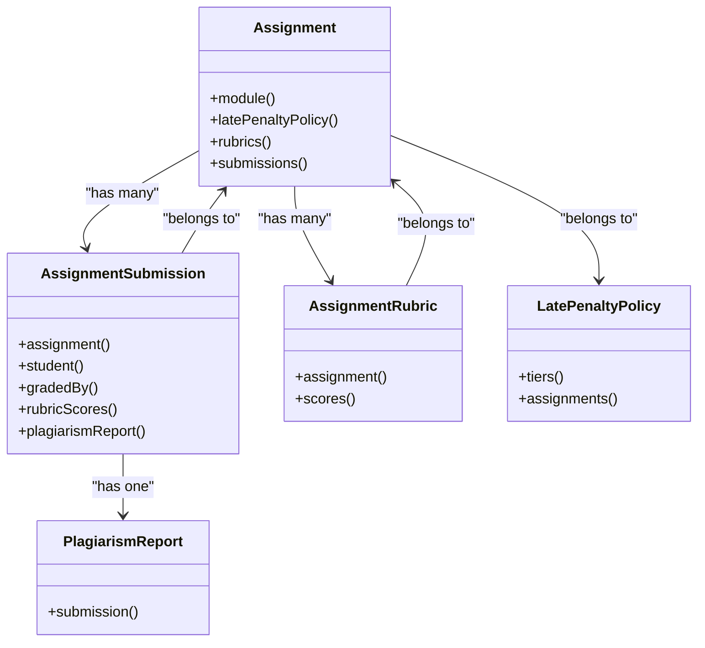

**Diagram sources**
- [Assignment.php:39-69](file://app/Models/Assignment.php#L39-L69)
- [AssignmentSubmission.php:49-87](file://app/Models/AssignmentSubmission.php#L49-L87)
- [AssignmentRubric.php:31-45](file://app/Models/AssignmentRubric.php#L31-L45)
- [LatePenaltyPolicy.php:23-37](file://app/Models/LatePenaltyPolicy.php#L23-L37)
- [PlagiarismReport.php:26-32](file://app/Models/PlagiarismReport.php#L26-L32)

**Section sources**
- [Assignment.php:19-37](file://app/Models/Assignment.php#L19-L37)
- [Assignment.php:39-69](file://app/Models/Assignment.php#L39-L69)

### Submission Types and Handling
- Submission types are enumerated as file, text, or both.
- The controller accepts optional file uploads and persists them via MediaStorageService, storing a file_url in the submission record. Text submissions store content directly.
- The submission service records attempt_number, submitted_at, is_late, late_penalty_percent, and status.

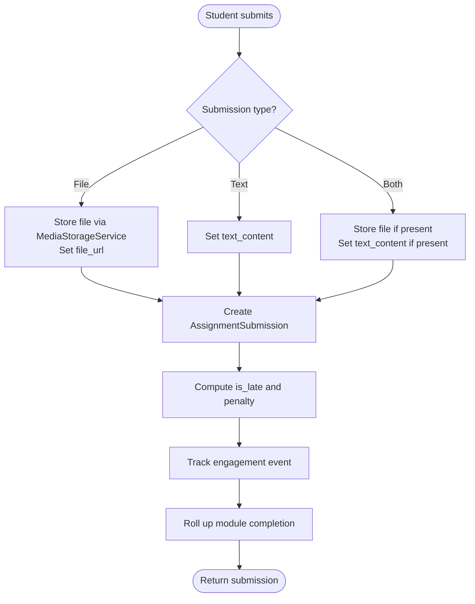

**Diagram sources**
- [AssignmentSubmissionController.php:38-50](file://app/Http/Controllers/Api/V1/AssignmentSubmissionController.php#L38-L50)
- [AssignmentSubmissionService.php:37-67](file://app/Services/Assessment/AssignmentSubmissionService.php#L37-L67)
- [AssignmentSubmissionType.php:7-12](file://app/Enums/AssignmentSubmissionType.php#L7-L12)

**Section sources**
- [AssignmentSubmissionController.php:38-50](file://app/Http/Controllers/Api/V1/AssignmentSubmissionController.php#L38-L50)
- [AssignmentSubmissionService.php:37-67](file://app/Services/Assessment/AssignmentSubmissionService.php#L37-L67)
- [AssignmentSubmissionType.php:7-12](file://app/Enums/AssignmentSubmissionType.php#L7-L12)

### Due Date Handling and Late Submission Policies
- On submission, the service compares submitted_at with assignment.due_at to determine is_late.
- If late, the LatePenaltyCalculator determines penalty_percent based on the assignment’s LatePenaltyPolicy tiers.
- Final score calculation applies the penalty percentage during grading.

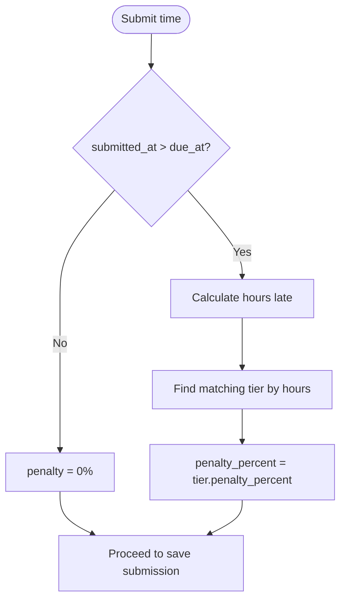

**Diagram sources**
- [AssignmentSubmissionService.php:39-43](file://app/Services/Assessment/AssignmentSubmissionService.php#L39-L43)
- [LatePenaltyCalculator.php:17-34](file://app/services/Assessment/LatePenaltyCalculator.php#L17-L34)

**Section sources**
- [AssignmentSubmissionService.php:39-43](file://app/Services/Assessment/AssignmentSubmissionService.php#L39-L43)
- [LatePenaltyCalculator.php:17-34](file://app/services/Assessment/LatePenaltyCalculator.php#L17-L34)

### AssignmentManager Service Methods
- create(module, data):
  - Creates Assignment with selected fields and module linkage.
  - Syncs rubrics by replacing all existing rubrics with provided list.
  - Creates a ModuleItem entry to register the assignment within the module ordering and requirement settings.
- update(assignment, data):
  - Updates assignment fields.
  - Optionally replaces rubrics when rubrics are provided.
  - Updates associated ModuleItem fields (is_required, order_index) if present.
- delete(assignment):
  - Removes the corresponding ModuleItem and then deletes the assignment.

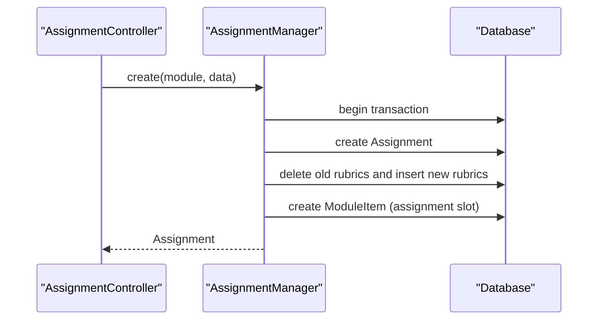

**Diagram sources**
- [AssignmentManager.php:26-50](file://app/Services/Assessment/AssignmentManager.php#L26-L50)
- [AssignmentManager.php:55-80](file://app/Services/Assessment/AssignmentManager.php#L55-L80)
- [AssignmentManager.php:82-92](file://app/Services/Assessment/AssignmentManager.php#L82-L92)

**Section sources**
- [AssignmentManager.php:26-50](file://app/Services/Assessment/AssignmentManager.php#L26-L50)
- [AssignmentManager.php:55-80](file://app/Services/Assessment/AssignmentManager.php#L55-L80)
- [AssignmentManager.php:82-92](file://app/Services/Assessment/AssignmentManager.php#L82-L92)

### Grading Workflow and Rubric Scoring
- Grading sets raw_score, final_score (raw_score adjusted by late_penalty_percent), feedback, status, grader identity, and grading timestamp.
- Rubric scores are replaced atomically per grade to ensure consistency.
- Notifications and audit logs are recorded upon grading.

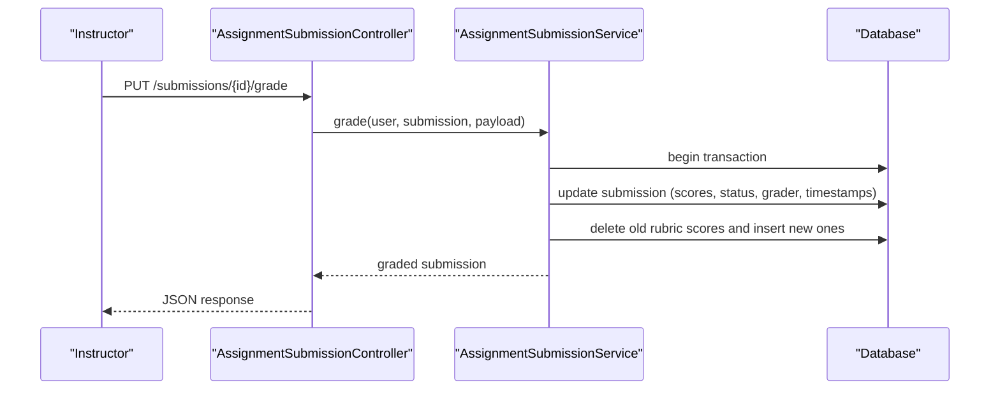

**Diagram sources**
- [AssignmentSubmissionController.php:52-57](file://app/Http/Controllers/Api/V1/AssignmentSubmissionController.php#L52-L57)
- [AssignmentSubmissionService.php:72-115](file://app/Services/Assessment/AssignmentSubmissionService.php#L72-L115)

**Section sources**
- [AssignmentSubmissionService.php:72-115](file://app/Services/Assessment/AssignmentSubmissionService.php#L72-L115)

### Integration with Plagiarism Detection
- Assignments can enable plagiarism checks via a boolean flag.
- Submissions have a one-to-one relationship with PlagiarismReport, which stores similarity_score, report_url, and checked_at.
- While the current code does not trigger external checks automatically, the model supports storing results from an external plagiarism service.

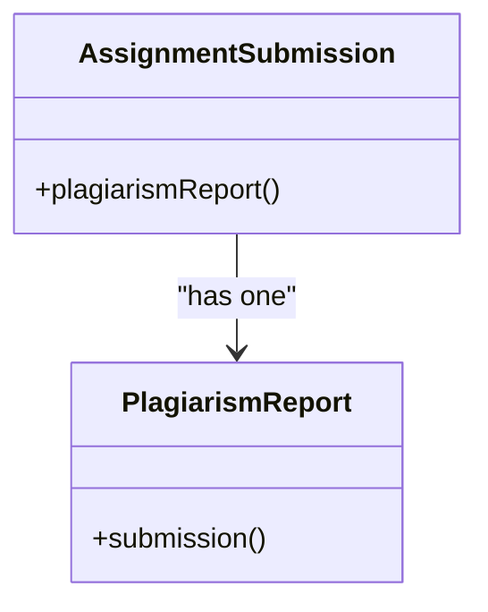

**Diagram sources**
- [AssignmentSubmission.php:81-87](file://app/Models/AssignmentSubmission.php#L81-L87)
- [PlagiarismReport.php:26-32](file://app/Models/PlagiarismReport.php#L26-L32)

**Section sources**
- [AssignmentSubmission.php:81-87](file://app/Models/AssignmentSubmission.php#L81-L87)
- [PlagiarismReport.php:14-24](file://app/Models/PlagiarismReport.php#L14-L24)

### Visibility Controls and Access Permissions
- AssignmentPolicy:
  - create/update/delete require admin or instructor teaching the course.
  - grade permission mirrors management rights over the course.
- AssignmentSubmissionPolicy:
  - Students can submit only if enrolled and confirmed in the course.
  - Viewing a submission is allowed for admins, the student who owns it, or instructors teaching the course.

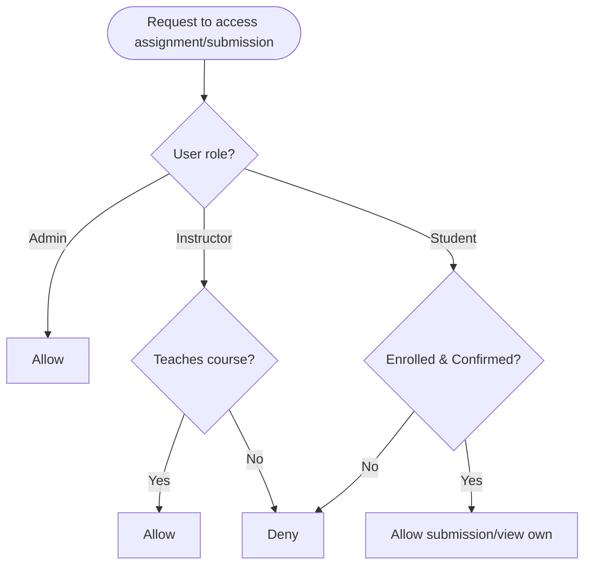

**Diagram sources**
- [AssignmentPolicy.php:15-42](file://app/Policies/AssignmentPolicy.php#L15-L42)
- [AssignmentSubmissionPolicy.php:15-40](file://app/Policies/AssignmentSubmissionPolicy.php#L15-L40)

**Section sources**
- [AssignmentPolicy.php:15-42](file://app/Policies/AssignmentPolicy.php#L15-L42)
- [AssignmentSubmissionPolicy.php:15-40](file://app/Policies/AssignmentSubmissionPolicy.php#L15-L40)

### Relationship Between Assignments and Modules
- Each assignment is tied to a Module via module_id.
- AssignmentManager ensures a ModuleItem entry exists to reflect the assignment’s position and requirement status within the module.
- AssignmentResource includes derived visibility fields (is_required, order_index) by querying ModuleItem.

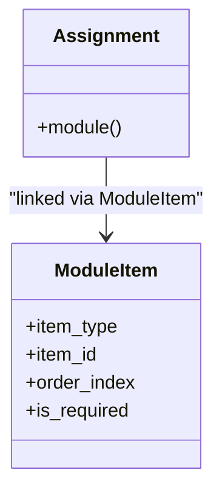

**Diagram sources**
- [AssignmentManager.php:40-46](file://app/Services/Assessment/AssignmentManager.php#L40-L46)
- [AssignmentResource.php:18-38](file://app/Http/Resources/AssignmentResource.php#L18-L38)

**Section sources**
- [AssignmentManager.php:40-46](file://app/Services/Assessment/AssignmentManager.php#L40-L46)
- [AssignmentResource.php:18-38](file://app/Http/Resources/AssignmentResource.php#L18-L38)

### Student Submission Workflows
- Students submit once per attempt; attempt_number increments per student per assignment.
- Submissions may be late; penalties are computed and stored.
- Progress is rolled up immediately upon submission to mark module completion as per design.

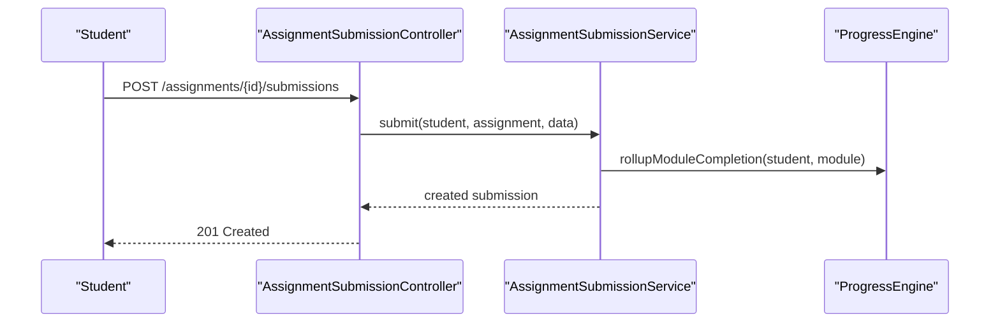

**Diagram sources**
- [AssignmentSubmissionController.php:38-50](file://app/Http/Controllers/Api/V1/AssignmentSubmissionController.php#L38-L50)
- [AssignmentSubmissionService.php:37-67](file://app/Services/Assessment/AssignmentSubmissionService.php#L37-L67)

**Section sources**
- [AssignmentSubmissionController.php:38-50](file://app/Http/Controllers/Api/V1/AssignmentSubmissionController.php#L38-L50)
- [AssignmentSubmissionService.php:37-67](file://app/Services/Assessment/AssignmentSubmissionService.php#L37-L67)

## Dependency Analysis
- Controllers depend on services for business logic and on policies for authorization.
- AssignmentManager depends on ModuleItem and AssignmentRubric to maintain module structure and grading criteria.
- AssignmentSubmissionService depends on LatePenaltyCalculator for penalty computation and integrates with ProgressEngine, NotificationDispatcher, EngagementTracker, and AuditLogger for side effects.
- Models form a cohesive graph linking assignments, submissions, rubrics, policies, and reports.

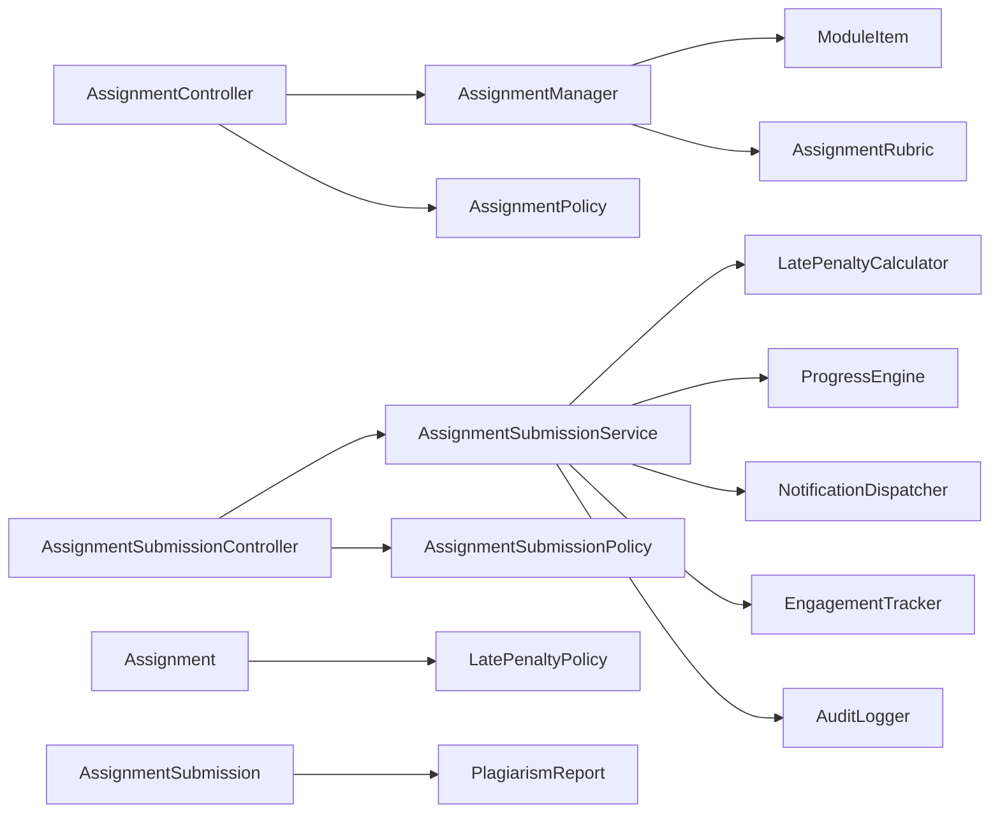

**Diagram sources**
- [AssignmentController.php:1-48](file://app/Http/Controllers/Api/V1/AssignmentController.php#L1-L48)
- [AssignmentSubmissionController.php:1-59](file://app/Http/Controllers/Api/V1/AssignmentSubmissionController.php#L1-L59)
- [AssignmentManager.php:1-115](file://app/Services/Assessment/AssignmentManager.php#L1-L115)
- [AssignmentSubmissionService.php:1-117](file://app/Services/Assessment/AssignmentSubmissionService.php#L1-L117)
- [LatePenaltyCalculator.php:1-36](file://app/services/Assessment/LatePenaltyCalculator.php#L1-L36)
- [Assignment.php:1-71](file://app/Models/Assignment.php#L1-L71)
- [AssignmentSubmission.php:1-89](file://app/Models/AssignmentSubmission.php#L1-L89)

**Section sources**
- [AssignmentController.php:1-48](file://app/Http/Controllers/Api/V1/AssignmentController.php#L1-L48)
- [AssignmentSubmissionController.php:1-59](file://app/Http/Controllers/Api/V1/AssignmentSubmissionController.php#L1-L59)
- [AssignmentManager.php:1-115](file://app/Services/Assessment/AssignmentManager.php#L1-L115)
- [AssignmentSubmissionService.php:1-117](file://app/Services/Assessment/AssignmentSubmissionService.php#L1-L117)

## Performance Considerations
- Use database transactions in AssignmentManager and AssignmentSubmissionService to ensure atomicity of related writes (assignment/rubrics/module items; submission/rubric scores).
- Replace-all strategy for rubrics simplifies concurrency and avoids complex diffs.
- Pagination on submissions listing prevents large payloads.
- Avoid eager loading unnecessary relations in index endpoints; load only required associations.
- Consider caching module item metadata if frequently accessed.

[No sources needed since this section provides general guidance]

## Troubleshooting Guide
- Authorization failures:
  - Ensure the user has appropriate role and enrollment status. Verify AssignmentPolicy and AssignmentSubmissionPolicy rules.
- Late penalty not applied:
  - Confirm assignment.due_at is set and LatePenaltyPolicy tiers exist. Check LatePenaltyCalculator logic and hours difference.
- Rubric scores mismatch:
  - Verify grading payload contains correct rubric_ids and scores; rubric scores are replaced atomically.
- File submission issues:
  - Validate file presence and storage path; ensure MediaStorageService returns a valid URL.
- Plagiarism report missing:
  - Confirm plagiarism_check_enabled is set and that an external process populates PlagiarismReport.

**Section sources**
- [AssignmentPolicy.php:15-42](file://app/Policies/AssignmentPolicy.php#L15-L42)
- [AssignmentSubmissionPolicy.php:15-40](file://app/Policies/AssignmentSubmissionPolicy.php#L15-L40)
- [LatePenaltyCalculator.php:17-34](file://app/services/Assessment/LatePenaltyCalculator.php#L17-L34)
- [AssignmentSubmissionService.php:72-115](file://app/Services/Assessment/AssignmentSubmissionService.php#L72-L115)
- [AssignmentSubmissionController.php:38-50](file://app/Http/Controllers/Api/V1/AssignmentSubmissionController.php#L38-L50)
- [PlagiarismReport.php:14-24](file://app/Models/PlagiarismReport.php#L14-L24)

## Conclusion
The Assignment Management system provides a robust framework for defining assignments, managing submissions, applying late penalties, and grading with rubrics. Clear separation of concerns across controllers, services, models, and policies ensures maintainability and scalability. Integration points for plagiarism detection and progress tracking support comprehensive assessment workflows while enforcing strict access controls.

[No sources needed since this section summarizes without analyzing specific files]