# Assignment Workflows & Lifecycle

<cite>
**Referenced Files in This Document**
- [AssignmentManager.php](file://app/Services/Assessment/AssignmentManager.php)
- [AssignmentController.php](file://app/Http/Controllers/Api/V1/AssignmentController.php)
- [AssignmentSubmissionController.php](file://app/Http/Controllers/Api/V1/AssignmentSubmissionController.php)
- [Assignment.php](file://app/Models/Assignment.php)
- [AssignmentSubmission.php](file://app/Models/AssignmentSubmission.php)
- [LatePenaltyPolicy.php](file://app/Models/LatePenaltyPolicy.php)
- [LatePenaltyTier.php](file://app/Models/LatePenaltyTier.php)
- [LatePenaltyCalculator.php](file://app/Services/Assessment/LatePenaltyCalculator.php)
- [AssignmentSubmissionService.php](file://app/Services/Assessment/AssignmentSubmissionService.php)
- [AssignmentPolicy.php](file://app/Policies/AssignmentPolicy.php)
- [AssignmentSubmissionType.php](file://app/Enums/AssignmentSubmissionType.php)
- [SubmissionStatus.php](file://app/Enums/SubmissionStatus.php)
- [2024_01_01_000132_create_assignments_table.php](file://database/migrations/2024_01_01_000132_create_assignments_table.php)
- [2024_01_01_000134_create_assignment_submissions_table.php](file://database/migrations/2024_01_01_000134_create_assignment_submissions_table.php)
</cite>

## Table of Contents
1. [Introduction](#introduction)
2. [Project Structure](#project-structure)
3. [Core Components](#core-components)
4. [Architecture Overview](#architecture-overview)
5. [Detailed Component Analysis](#detailed-component-analysis)
6. [Dependency Analysis](#dependency-analysis)
7. [Performance Considerations](#performance-considerations)
8. [Troubleshooting Guide](#troubleshooting-guide)
9. [Conclusion](#conclusion)

## Introduction
This document explains the complete assignment lifecycle and workflow management in the system, focusing on how assignments are created, managed, submitted, graded, and penalized for lateness. It covers:
- Assignment creation and updates through AssignmentManager
- Submission handling and grading via AssignmentSubmissionService
- Late submission enforcement and automatic penalties using LatePenaltyPolicy and LatePenaltyCalculator
- Access control through AssignmentPolicy
- Data model relationships and database schema for assignments and submissions
- Practical workflows such as publishing an assignment to a module, submitting late work, and grading with rubrics

Note: The current implementation does not include explicit assignment states like draft/published/active/archived at the Assignment model level. Instead, assignments become visible to students when they are added as module items, and their availability is governed by due dates and module structure.

## Project Structure
The assignment feature spans controllers, services, models, policies, enums, and migrations:
- Controllers expose REST endpoints for creating/updating assignments and handling submissions and grading
- Services encapsulate business logic for assignment lifecycle and submission processing
- Models define data structures and relationships
- Policies enforce role-based access control
- Enums standardize submission types and statuses
- Migrations define persistent schema for assignments and submissions

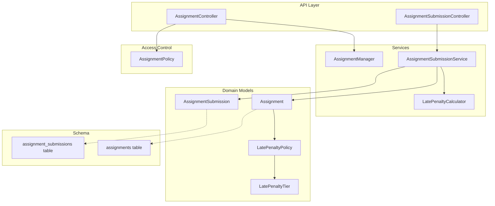

**Diagram sources**
- [AssignmentController.php:16-46](file://app/Http/Controllers/Api/V1/AssignmentController.php#L16-L46)
- [AssignmentSubmissionController.php:19-58](file://app/Http/Controllers/Api/V1/AssignmentSubmissionController.php#L19-L58)
- [AssignmentManager.php:21-113](file://app/Services/Assessment/AssignmentManager.php#L21-L113)
- [AssignmentSubmissionService.php:24-116](file://app/Services/Assessment/AssignmentSubmissionService.php#L24-L116)
- [LatePenaltyCalculator.php:15-35](file://app/Services/Assessment/LatePenaltyCalculator.php#L15-L35)
- [Assignment.php:14-70](file://app/Models/Assignment.php#L14-L70)
- [AssignmentSubmission.php:15-88](file://app/Models/AssignmentSubmission.php#L15-L88)
- [LatePenaltyPolicy.php:12-38](file://app/Models/LatePenaltyPolicy.php#L12-L38)
- [LatePenaltyTier.php:12-37](file://app/Models/LatePenaltyTier.php#L12-L37)
- [AssignmentPolicy.php:13-43](file://app/Policies/AssignmentPolicy.php#L13-L43)
- [2024_01_01_000132_create_assignments_table.php:11-25](file://database/migrations/2024_01_01_000132_create_assignments_table.php#L11-L25)
- [2024_01_01_000134_create_assignment_submissions_table.php:11-32](file://database/migrations/2024_01_01_000134_create_assignment_submissions_table.php#L11-L32)

**Section sources**
- [AssignmentController.php:16-46](file://app/Http/Controllers/Api/V1/AssignmentController.php#L16-L46)
- [AssignmentSubmissionController.php:19-58](file://app/Http/Controllers/Api/V1/AssignmentSubmissionController.php#L19-L58)
- [AssignmentManager.php:21-113](file://app/Services/Assessment/AssignmentManager.php#L21-L113)
- [AssignmentSubmissionService.php:24-116](file://app/Services/Assessment/AssignmentSubmissionService.php#L24-L116)
- [LatePenaltyCalculator.php:15-35](file://app/Services/Assessment/LatePenaltyCalculator.php#L15-L35)
- [Assignment.php:14-70](file://app/Models/Assignment.php#L14-L70)
- [AssignmentSubmission.php:15-88](file://app/Models/AssignmentSubmission.php#L15-L88)
- [LatePenaltyPolicy.php:12-38](file://app/Models/LatePenaltyPolicy.php#L12-L38)
- [LatePenaltyTier.php:12-37](file://app/Models/LatePenaltyTier.php#L12-L37)
- [AssignmentPolicy.php:13-43](file://app/Policies/AssignmentPolicy.php#L13-L43)
- [2024_01_01_000132_create_assignments_table.php:11-25](file://database/migrations/2024_01_01_000132_create_assignments_table.php#L11-L25)
- [2024_01_01_000134_create_assignment_submissions_table.php:11-32](file://database/migrations/2024_01_01_000134_create_assignment_submissions_table.php#L11-L32)

## Core Components
- AssignmentManager: Creates, updates, and deletes assignments within a module, including syncing rubrics and managing module item slots.
- AssignmentSubmissionService: Handles student submissions (file/text), calculates late penalties, records attempts, triggers progress rollups, and processes grading with rubric scores.
- LatePenaltyCalculator: Computes penalty percentages based on configured LatePenaltyPolicy tiers and hours late.
- AssignmentPolicy: Enforces that only admins or instructors teaching the course can manage assignments and grade submissions.
- Models: Assignment, AssignmentSubmission, LatePenaltyPolicy, LatePenaltyTier define data and relationships.
- Enums: AssignmentSubmissionType and SubmissionStatus standardize input/output values.

Key responsibilities:
- Creation and update of assignments with due dates, submission type, max score, plagiarism check flag, and late penalty policy linkage
- Submission recording with attempt numbering, file/text content, timestamps, and late flags
- Grading with raw/final score computation and rubric scoring
- Policy checks for authorization across operations

**Section sources**
- [AssignmentManager.php:21-113](file://app/Services/Assessment/AssignmentManager.php#L21-L113)
- [AssignmentSubmissionService.php:24-116](file://app/Services/Assessment/AssignmentSubmissionService.php#L24-L116)
- [LatePenaltyCalculator.php:15-35](file://app/Services/Assessment/LatePenaltyCalculator.php#L15-L35)
- [AssignmentPolicy.php:13-43](file://app/Policies/AssignmentPolicy.php#L13-L43)
- [Assignment.php:14-70](file://app/Models/Assignment.php#L14-L70)
- [AssignmentSubmission.php:15-88](file://app/Models/AssignmentSubmission.php#L15-L88)
- [LatePenaltyPolicy.php:12-38](file://app/Models/LatePenaltyPolicy.php#L12-L38)
- [LatePenaltyTier.php:12-37](file://app/Models/LatePenaltyTier.php#L12-L37)
- [AssignmentSubmissionType.php:7-12](file://app/Enums/AssignmentSubmissionType.php#L7-L12)
- [SubmissionStatus.php:7-11](file://app/Enums/SubmissionStatus.php#L7-L11)

## Architecture Overview
The assignment workflow integrates API controllers with domain services and models, enforcing policies and applying late penalties consistently.

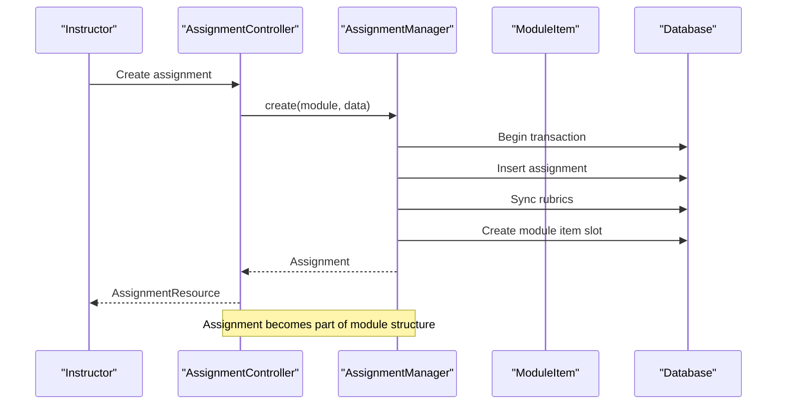

**Diagram sources**
- [AssignmentController.php:25-30](file://app/Http/Controllers/Api/V1/AssignmentController.php#L25-L30)
- [AssignmentManager.php:26-49](file://app/Services/Assessment/AssignmentManager.php#L26-L49)

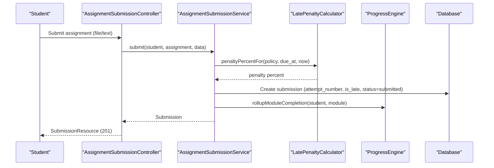

**Diagram sources**
- [AssignmentSubmissionController.php:38-50](file://app/Http/Controllers/Api/V1/AssignmentSubmissionController.php#L38-L50)
- [AssignmentSubmissionService.php:37-67](file://app/Services/Assessment/AssignmentSubmissionService.php#L37-L67)
- [LatePenaltyCalculator.php:17-34](file://app/Services/Assessment/LatePenaltyCalculator.php#L17-L34)

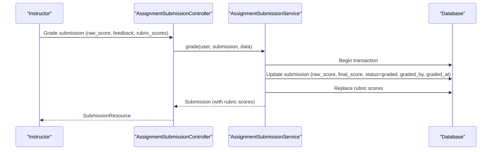

**Diagram sources**
- [AssignmentSubmissionController.php:52-57](file://app/Http/Controllers/Api/V1/AssignmentSubmissionController.php#L52-L57)
- [AssignmentSubmissionService.php:72-114](file://app/Services/Assessment/AssignmentSubmissionService.php#L72-L114)

## Detailed Component Analysis

### AssignmentManager
Responsibilities:
- Create assignments within a module, persisting core fields and syncing rubrics
- Update assignments, optionally replacing rubrics and adjusting module item properties
- Delete assignments along with their module item slots

Key behaviors:
- Uses database transactions to ensure atomicity
- Syncs rubrics by deleting existing ones and recreating from provided data
- Manages module item association with order index and required flag

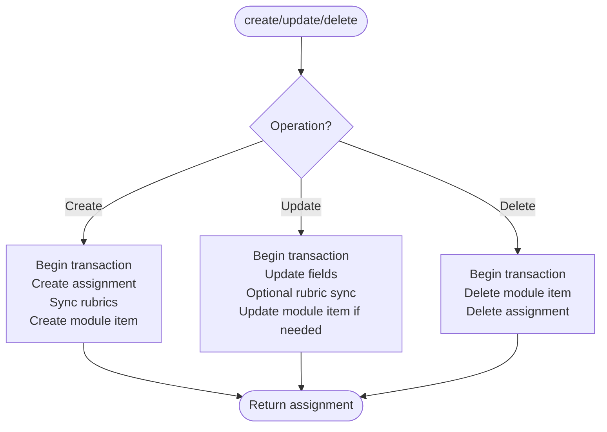

**Diagram sources**
- [AssignmentManager.php:26-49](file://app/Services/Assessment/AssignmentManager.php#L26-L49)
- [AssignmentManager.php:55-79](file://app/Services/Assessment/AssignmentManager.php#L55-L79)
- [AssignmentManager.php:82-92](file://app/Services/Assessment/AssignmentManager.php#L82-L92)

**Section sources**
- [AssignmentManager.php:26-113](file://app/Services/Assessment/AssignmentManager.php#L26-L113)

### AssignmentSubmissionService
Responsibilities:
- Record student submissions with attempt tracking, file/text content, and timestamps
- Determine lateness and compute penalty percentage using LatePenaltyCalculator
- Trigger progress rollup upon submission
- Process grading, compute final score after penalty, store rubric scores, and notify

Key behaviors:
- Attempt number increments per student per assignment
- Late penalty applied to final score during grading
- Status transitions from submitted to graded
- Notifications and audit logging on grade changes

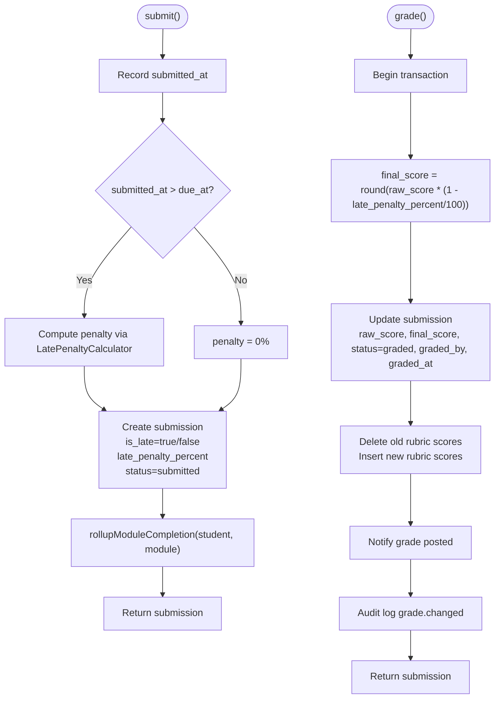

**Diagram sources**
- [AssignmentSubmissionService.php:37-67](file://app/Services/Assessment/AssignmentSubmissionService.php#L37-L67)
- [AssignmentSubmissionService.php:72-114](file://app/Services/Assessment/AssignmentSubmissionService.php#L72-L114)

**Section sources**
- [AssignmentSubmissionService.php:37-114](file://app/Services/Assessment/AssignmentSubmissionService.php#L37-L114)

### LatePenaltyCalculator
Responsibilities:
- Calculate penalty percentage based on LatePenaltyPolicy tiers and hours late
- Return zero penalty if no policy or submission is on time

Algorithm:
- Compute hours between due_at and submitted_at
- Find matching tier where hours_late_from <= hoursLate and (hours_late_to is null or hours_late_to > hoursLate)
- Return tier.penalty_percent or 0.0

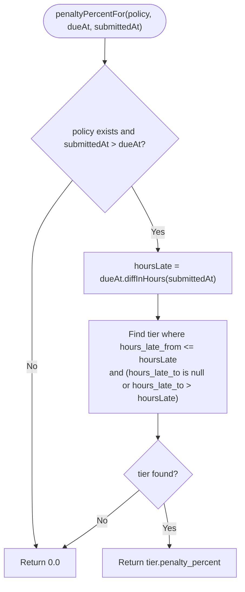

**Diagram sources**
- [LatePenaltyCalculator.php:17-34](file://app/Services/Assessment/LatePenaltyCalculator.php#L17-L34)

**Section sources**
- [LatePenaltyCalculator.php:17-34](file://app/Services/Assessment/LatePenaltyCalculator.php#L17-L34)

### AssignmentPolicy
Responsibilities:
- Enforce that only admins or instructors teaching the course can create, update, delete, and grade assignments

Rules:
- create/update/delete require instructor/admin rights for the course associated with the assignment’s module
- grade requires same “teaches this course” check

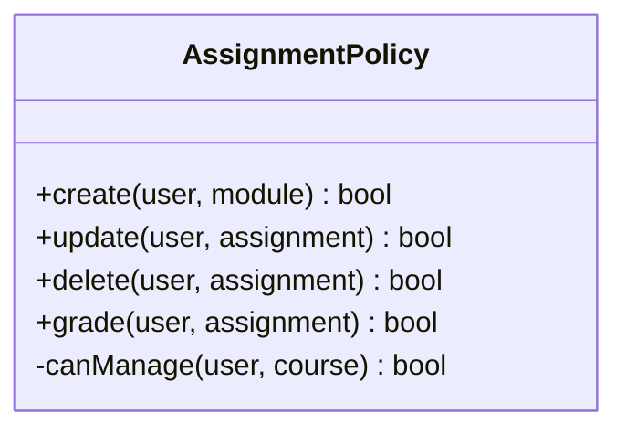

**Diagram sources**
- [AssignmentPolicy.php:13-43](file://app/Policies/AssignmentPolicy.php#L13-L43)

**Section sources**
- [AssignmentPolicy.php:13-43](file://app/Policies/AssignmentPolicy.php#L13-L43)

### Data Model Relationships
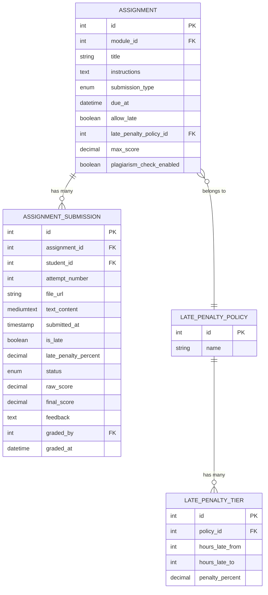

**Diagram sources**
- [Assignment.php:14-70](file://app/Models/Assignment.php#L14-L70)
- [AssignmentSubmission.php:15-88](file://app/Models/AssignmentSubmission.php#L15-L88)
- [LatePenaltyPolicy.php:12-38](file://app/Models/LatePenaltyPolicy.php#L12-L38)
- [LatePenaltyTier.php:12-37](file://app/Models/LatePenaltyTier.php#L12-L37)
- [2024_01_01_000132_create_assignments_table.php:11-25](file://database/migrations/2024_01_01_000132_create_assignments_table.php#L11-L25)
- [2024_01_01_000134_create_assignment_submissions_table.php:11-32](file://database/migrations/2024_01_01_000134_create_assignment_submissions_table.php#L11-L32)

**Section sources**
- [Assignment.php:14-70](file://app/Models/Assignment.php#L14-L70)
- [AssignmentSubmission.php:15-88](file://app/Models/AssignmentSubmission.php#L15-L88)
- [LatePenaltyPolicy.php:12-38](file://app/Models/LatePenaltyPolicy.php#L12-L38)
- [LatePenaltyTier.php:12-37](file://app/Models/LatePenaltyTier.php#L12-L37)
- [2024_01_01_000132_create_assignments_table.php:11-25](file://database/migrations/2024_01_01_000132_create_assignments_table.php#L11-L25)
- [2024_01_01_000134_create_assignment_submissions_table.php:11-32](file://database/migrations/2024_01_01_000134_create_assignment_submissions_table.php#L11-L32)

### Workflow Examples

#### Publishing an Assignment to a Module
- Instructors create assignments via AssignmentController, which delegates to AssignmentManager
- AssignmentManager creates the assignment and adds it as a module item, making it part of the module structure
- Students see the assignment when browsing the module; visibility is tied to module structure rather than an explicit assignment state

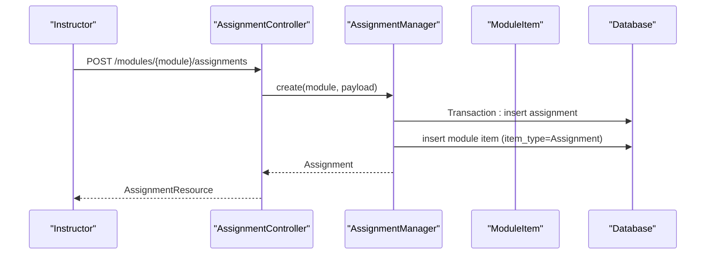

**Diagram sources**
- [AssignmentController.php:25-30](file://app/Http/Controllers/Api/V1/AssignmentController.php#L25-L30)
- [AssignmentManager.php:26-49](file://app/Services/Assessment/AssignmentManager.php#L26-L49)

**Section sources**
- [AssignmentController.php:25-30](file://app/Http/Controllers/Api/V1/AssignmentController.php#L25-L30)
- [AssignmentManager.php:26-49](file://app/Services/Assessment/AssignmentManager.php#L26-L49)

#### Late Submission Handling and Automatic Penalties
- Student submits via AssignmentSubmissionController -> AssignmentSubmissionService
- Service determines if submission is late and computes penalty using LatePenaltyCalculator
- Penalty percentage stored on submission and applied during grading to compute final score

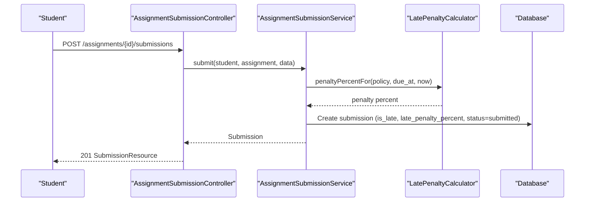

**Diagram sources**
- [AssignmentSubmissionController.php:38-50](file://app/Http/Controllers/Api/V1/AssignmentSubmissionController.php#L38-L50)
- [AssignmentSubmissionService.php:37-67](file://app/Services/Assessment/AssignmentSubmissionService.php#L37-L67)
- [LatePenaltyCalculator.php:17-34](file://app/Services/Assessment/LatePenaltyCalculator.php#L17-L34)

**Section sources**
- [AssignmentSubmissionController.php:38-50](file://app/Http/Controllers/Api/V1/AssignmentSubmissionController.php#L38-L50)
- [AssignmentSubmissionService.php:37-67](file://app/Services/Assessment/AssignmentSubmissionService.php#L37-L67)
- [LatePenaltyCalculator.php:17-34](file://app/Services/Assessment/LatePenaltyCalculator.php#L17-L34)

#### Grading with Rubrics
- Instructor grades via AssignmentSubmissionController -> AssignmentSubmissionService
- Service computes final score after penalty, replaces rubric scores, sets status to graded, and notifies

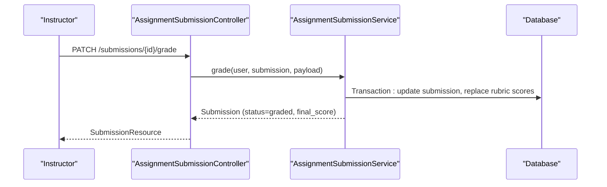

**Diagram sources**
- [AssignmentSubmissionController.php:52-57](file://app/Http/Controllers/Api/V1/AssignmentSubmissionController.php#L52-L57)
- [AssignmentSubmissionService.php:72-114](file://app/Services/Assessment/AssignmentSubmissionService.php#L72-L114)

**Section sources**
- [AssignmentSubmissionController.php:52-57](file://app/Http/Controllers/Api/V1/AssignmentSubmissionController.php#L52-L57)
- [AssignmentSubmissionService.php:72-114](file://app/Services/Assessment/AssignmentSubmissionService.php#L72-L114)

### Bulk Operations and Automated Scheduling
- Bulk operations: The current codebase does not implement bulk assignment operations; each assignment is created/updated individually via AssignmentManager
- Automated scheduling: There is no built-in scheduler for assignments; availability is driven by module structure and due dates. Background jobs are referenced elsewhere for other features, but assignment scheduling is not implemented here

[No sources needed since this section provides general guidance]

### Access Control and Visibility
- Access control: AssignmentPolicy ensures only admins or instructors teaching the course can manage assignments and grade submissions
- Student visibility: Assignments are visible when added as module items; there is no explicit assignment state controlling visibility
- Instructor management: Instructors can create, update, delete, and grade assignments for courses they teach

**Section sources**
- [AssignmentPolicy.php:13-43](file://app/Policies/AssignmentPolicy.php#L13-L43)
- [AssignmentManager.php:26-49](file://app/Services/Assessment/AssignmentManager.php#L26-L49)

## Dependency Analysis
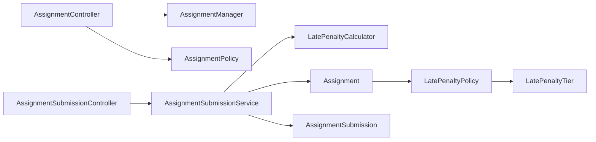

**Diagram sources**
- [AssignmentController.php:16-46](file://app/Http/Controllers/Api/V1/AssignmentController.php#L16-L46)
- [AssignmentSubmissionController.php:19-58](file://app/Http/Controllers/Api/V1/AssignmentSubmissionController.php#L19-L58)
- [AssignmentManager.php:21-113](file://app/Services/Assessment/AssignmentManager.php#L21-L113)
- [AssignmentSubmissionService.php:24-116](file://app/Services/Assessment/AssignmentSubmissionService.php#L24-L116)
- [LatePenaltyCalculator.php:15-35](file://app/Services/Assessment/LatePenaltyCalculator.php#L15-L35)
- [Assignment.php:14-70](file://app/Models/Assignment.php#L14-L70)
- [AssignmentSubmission.php:15-88](file://app/Models/AssignmentSubmission.php#L15-L88)
- [LatePenaltyPolicy.php:12-38](file://app/Models/LatePenaltyPolicy.php#L12-L38)
- [LatePenaltyTier.php:12-37](file://app/Models/LatePenaltyTier.php#L12-L37)

**Section sources**
- [AssignmentController.php:16-46](file://app/Http/Controllers/Api/V1/AssignmentController.php#L16-L46)
- [AssignmentSubmissionController.php:19-58](file://app/Http/Controllers/Api/V1/AssignmentSubmissionController.php#L19-L58)
- [AssignmentManager.php:21-113](file://app/Services/Assessment/AssignmentManager.php#L21-L113)
- [AssignmentSubmissionService.php:24-116](file://app/Services/Assessment/AssignmentSubmissionService.php#L24-L116)
- [LatePenaltyCalculator.php:15-35](file://app/Services/Assessment/LatePenaltyCalculator.php#L15-L35)
- [Assignment.php:14-70](file://app/Models/Assignment.php#L14-L70)
- [AssignmentSubmission.php:15-88](file://app/Models/AssignmentSubmission.php#L15-L88)
- [LatePenaltyPolicy.php:12-38](file://app/Models/LatePenaltyPolicy.php#L12-L38)
- [LatePenaltyTier.php:12-37](file://app/Models/LatePenaltyTier.php#L12-L37)

## Performance Considerations
- Database transactions are used in AssignmentManager and AssignmentSubmissionService to ensure consistency during multi-step operations
- Rubric synchronization replaces all rubrics atomically to avoid incremental diff complexity
- Late penalty calculation is O(n) over tiers per submission; keep tier count reasonable
- Pagination is used for listing submissions to avoid large result sets
- Avoid unnecessary eager loading; load only required relations in controllers

[No sources needed since this section provides general guidance]

## Troubleshooting Guide
Common issues and resolutions:
- Authorization failures: Ensure the user is an admin or an instructor teaching the course; AssignmentPolicy gates create/update/delete/grade
- Late penalty not applied: Verify assignment has a due_at date and a linked LatePenaltyPolicy; LatePenaltyCalculator returns 0 if no policy or submission is on time
- Final score mismatch: Confirm late_penalty_percent is set correctly on submission; final score is computed as raw_score * (1 - late_penalty_percent/100)
- Rubric scores not updating: Grading replaces rubric scores; ensure rubric_scores payload matches assignment rubrics

**Section sources**
- [AssignmentPolicy.php:13-43](file://app/Policies/AssignmentPolicy.php#L13-L43)
- [LatePenaltyCalculator.php:17-34](file://app/Services/Assessment/LatePenaltyCalculator.php#L17-L34)
- [AssignmentSubmissionService.php:72-114](file://app/Services/Assessment/AssignmentSubmissionService.php#L72-L114)

## Conclusion
The assignment lifecycle is centered around robust service-layer logic:
- AssignmentManager handles creation, updates, and deletion with rubric synchronization and module item management
- AssignmentSubmissionService manages submissions, late penalties, progress rollups, and grading with rubrics
- LatePenaltyCalculator applies configurable tiered penalties based on LatePenaltyPolicy
- AssignmentPolicy enforces role-based access for instructors and admins
- The data model supports flexible submission types and clear status progression from submitted to graded

While explicit assignment states like draft/published/active/archived are not present, assignments become visible through module structure and are governed by due dates and policies. Future enhancements could introduce explicit states, bulk operations, and automated scheduling to further streamline assignment workflows.

[No sources needed since this section summarizes without analyzing specific files]