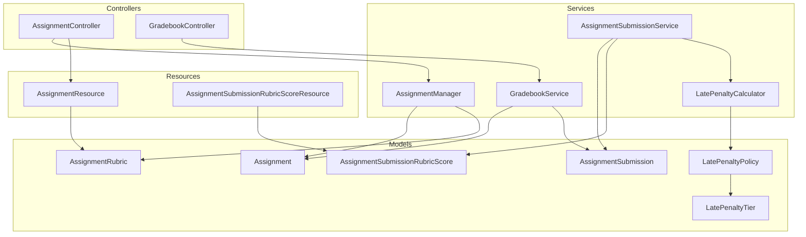
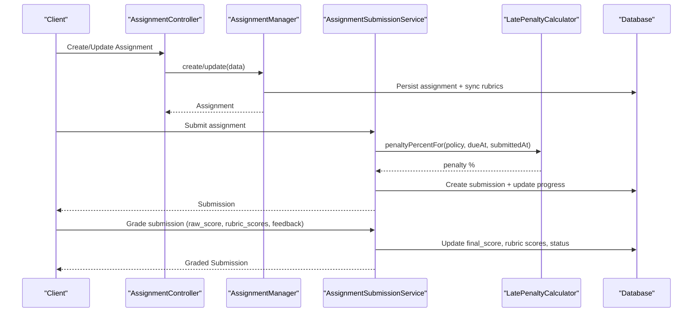
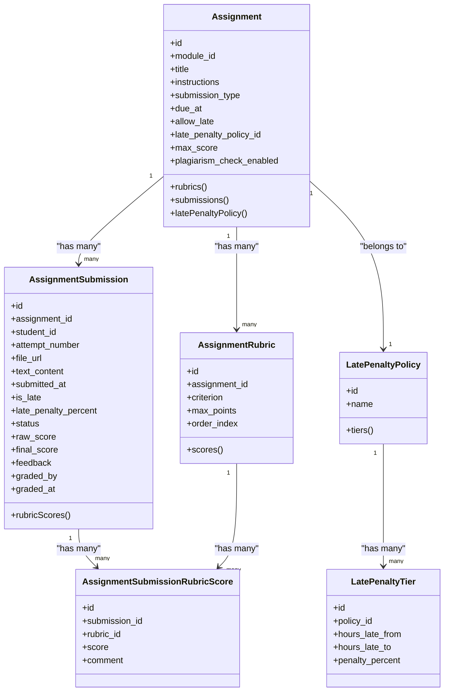
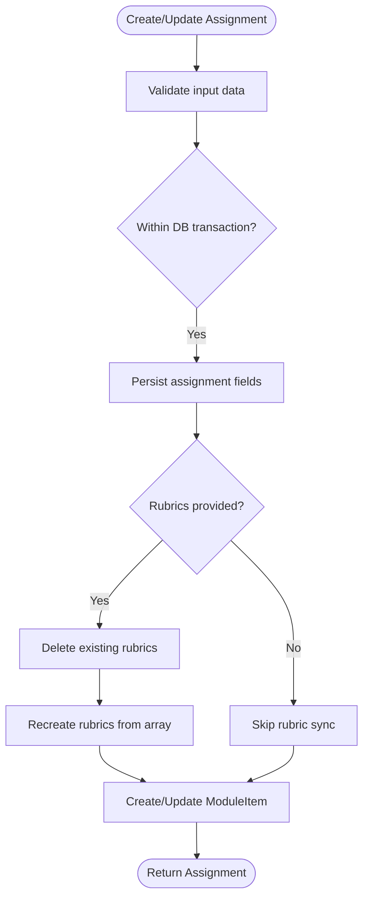
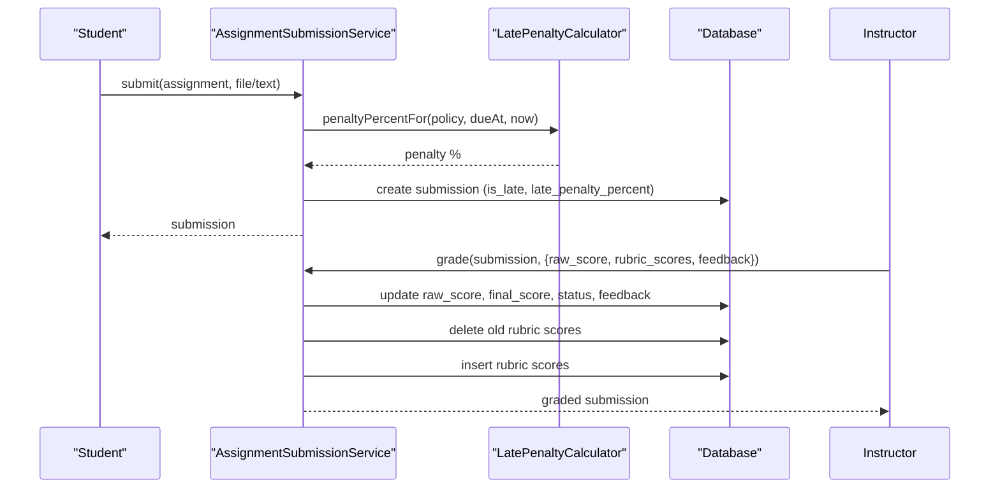
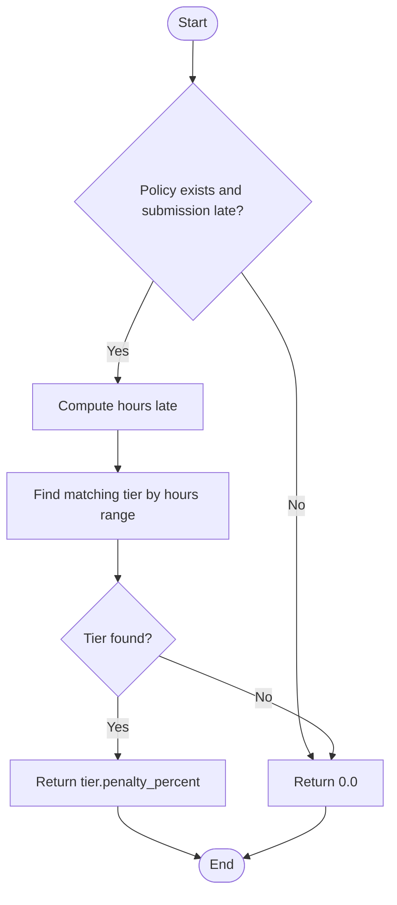
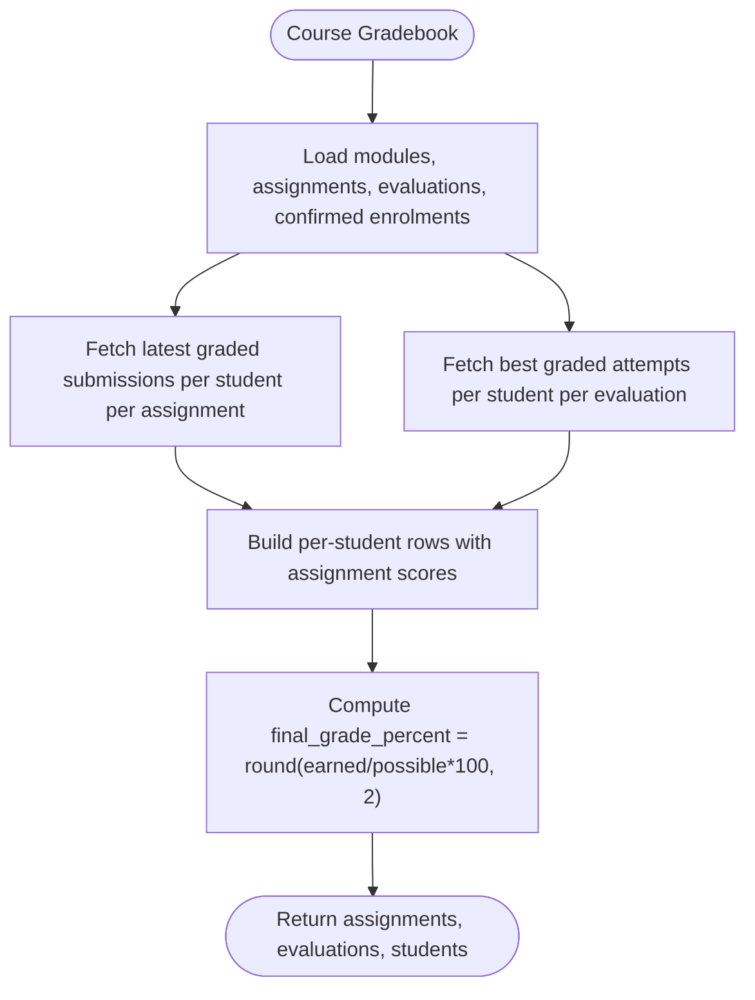
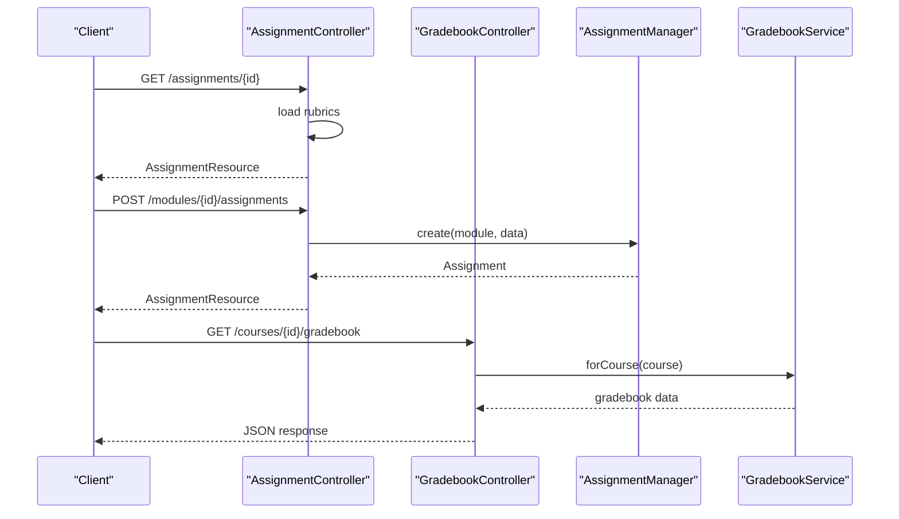
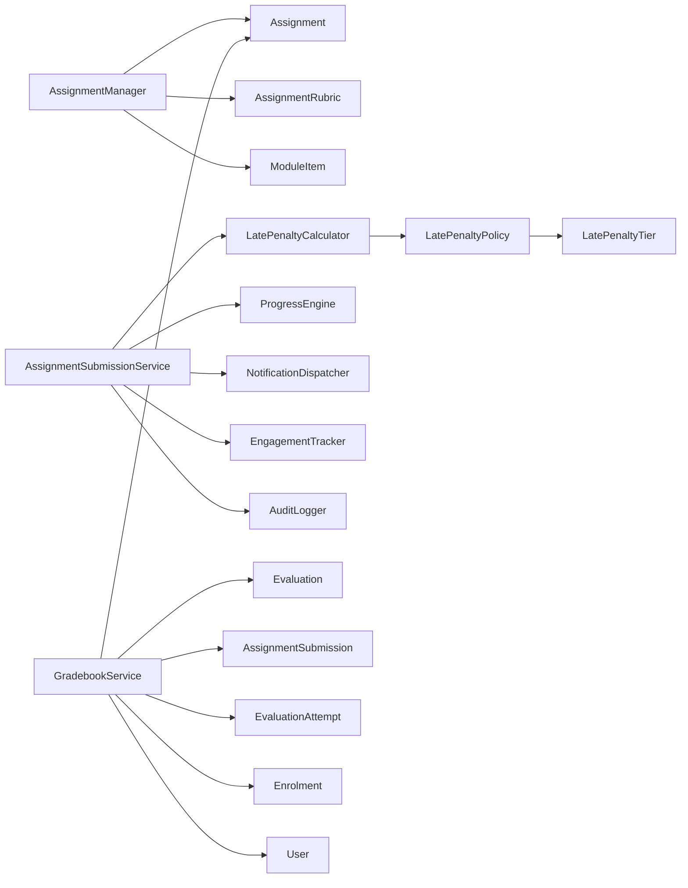

# Grading & Rubrics

<cite>
**Referenced Files in This Document**
- [Assignment.php](file://app/Models/Assignment.php)
- [AssignmentRubric.php](file://app/Models/AssignmentRubric.php)
- [AssignmentSubmission.php](file://app/Models/AssignmentSubmission.php)
- [AssignmentSubmissionRubricScore.php](file://app/Models/AssignmentSubmissionRubricScore.php)
- [LatePenaltyPolicy.php](file://app/Models/LatePenaltyPolicy.php)
- [LatePenaltyTier.php](file://app/Models/LatePenaltyTier.php)
- [AssignmentManager.php](file://app/Services/Assessment/AssignmentManager.php)
- [AssignmentSubmissionService.php](file://app/Services/Assessment/AssignmentSubmissionService.php)
- [LatePenaltyCalculator.php](file://app/Services/Assessment/LatePenaltyCalculator.php)
- [GradebookService.php](file://app/Services/Assessment/GradebookService.php)
- [AssignmentController.php](file://app/Http/Controllers/Api/V1/AssignmentController.php)
- [GradebookController.php](file://app/Http/Controllers/Api/V1/GradebookController.php)
- [AssignmentResource.php](file://app/Http/Resources/AssignmentResource.php)
- [AssignmentSubmissionRubricScoreResource.php](file://app/Http/Resources/AssignmentSubmissionRubricScoreResource.php)
</cite>

## Table of Contents
1. Introduction
2. Project Structure
3. Core Components
4. Architecture Overview
5. Detailed Component Analysis
6. Dependency Analysis
7. Performance Considerations
8. Troubleshooting Guide
9. Conclusion
10. Appendices

## Introduction
This document explains the assignment grading and rubric-based assessment system. It covers how instructors define grading criteria with AssignmentRubric, record per-criterion scores via AssignmentSubmissionRubricScore, calculate final grades including late penalties, integrate results into the gradebook, and deliver feedback to students. It also documents the AssignmentManager methods for managing assignments and their rubrics, and provides examples for setting up rubrics, applying scores, and generating grade reports.

## Project Structure
The grading and rubric features span models, services, controllers, and resources:
- Models define the data structures for assignments, submissions, rubrics, and late penalty policies.
- Services implement business logic for submission, grading, late penalty calculation, and gradebook aggregation.
- Controllers expose API endpoints for creating/updating assignments and retrieving course gradebooks.
- Resources serialize domain objects for API responses.

**Diagram sources**
- [Assignment.php:14-71](file://app/Models/Assignment.php#L14-L71)
- [AssignmentRubric.php:13-46](file://app/Models/AssignmentRubric.php#L13-L46)
- [AssignmentSubmission.php:15-89](file://app/Models/AssignmentSubmission.php#L15-L89)
- [AssignmentSubmissionRubricScore.php:10-41](file://app/Models/AssignmentSubmissionRubricScore.php#L10-L41)
- [LatePenaltyPolicy.php:12-39](file://app/Models/LatePenaltyPolicy.php#L12-L39)
- [LatePenaltyTier.php:12-38](file://app/Models/LatePenaltyTier.php#L12-L38)
- [AssignmentManager.php:21-115](file://app/Services/Assessment/AssignmentManager.php#L21-L115)
- [AssignmentSubmissionService.php:24-117](file://app/Services/Assessment/AssignmentSubmissionService.php#L24-L117)
- [LatePenaltyCalculator.php:15-36](file://app/Services/Assessment/LatePenaltyCalculator.php#L15-L36)
- [GradebookService.php:18-121](file://app/Services/Assessment/GradebookService.php#L18-L121)
- [AssignmentController.php:16-48](file://app/Http/Controllers/Api/V1/AssignmentController.php#L16-L48)
- [GradebookController.php:12-23](file://app/Http/Controllers/Api/V1/GradebookController.php#L12-L23)
- [AssignmentResource.php:11-42](file://app/Http/Resources/AssignmentResource.php#L11-L42)
- [AssignmentSubmissionRubricScoreResource.php:10-24](file://app/Http/Resources/AssignmentSubmissionRubricScoreResource.php#L10-L24)

**Section sources**
- [Assignment.php:14-71](file://app/Models/Assignment.php#L14-L71)
- [AssignmentRubric.php:13-46](file://app/Models/AssignmentRubric.php#L13-L46)
- [AssignmentSubmission.php:15-89](file://app/Models/AssignmentSubmission.php#L15-L89)
- [AssignmentSubmissionRubricScore.php:10-41](file://app/Models/AssignmentSubmissionRubricScore.php#L10-L41)
- [LatePenaltyPolicy.php:12-39](file://app/Models/LatePenaltyPolicy.php#L12-L39)
- [LatePenaltyTier.php:12-38](file://app/Models/LatePenaltyTier.php#L12-L38)
- [AssignmentManager.php:21-115](file://app/Services/Assessment/AssignmentManager.php#L21-L115)
- [AssignmentSubmissionService.php:24-117](file://app/Services/Assessment/AssignmentSubmissionService.php#L24-L117)
- [LatePenaltyCalculator.php:15-36](file://app/Services/Assessment/LatePenaltyCalculator.php#L15-L36)
- [GradebookService.php:18-121](file://app/Services/Assessment/GradebookService.php#L18-L121)
- [AssignmentController.php:16-48](file://app/Http/Controllers/Api/V1/AssignmentController.php#L16-L48)
- [GradebookController.php:12-23](file://app/Http/Controllers/Api/V1/GradebookController.php#L12-L23)
- [AssignmentResource.php:11-42](file://app/Http/Resources/AssignmentResource.php#L11-L42)
- [AssignmentSubmissionRubricScoreResource.php:10-24](file://app/Http/Resources/AssignmentSubmissionRubricScoreResource.php#L10-L24)

## Core Components
- AssignmentRubric defines grading criteria per assignment (criterion name, maximum points, order).
- AssignmentSubmissionRubricScore records a student’s score and optional comment per criterion on a specific submission.
- AssignmentSubmission stores submission metadata, raw/final scores, late penalty percent, status, and instructor feedback.
- LatePenaltyPolicy and LatePenaltyTier configure tiered deductions based on hours late.
- AssignmentManager creates/updates assignments and synchronizes rubrics as a complete set.
- AssignmentSubmissionService handles student submission, late penalty calculation, grading, rubric score persistence, notifications, and audit logging.
- GradebookService aggregates assignment and evaluation scores into a per-student report with final grade percentage.

**Section sources**
- [AssignmentRubric.php:13-46](file://app/Models/AssignmentRubric.php#L13-L46)
- [AssignmentSubmissionRubricScore.php:10-41](file://app/Models/AssignmentSubmissionRubricScore.php#L10-L41)
- [AssignmentSubmission.php:15-89](file://app/Models/AssignmentSubmission.php#L15-L89)
- [LatePenaltyPolicy.php:12-39](file://app/Models/LatePenaltyPolicy.php#L12-L39)
- [LatePenaltyTier.php:12-38](file://app/Models/LatePenaltyTier.php#L12-L38)
- [AssignmentManager.php:21-115](file://app/Services/Assessment/AssignmentManager.php#L21-L115)
- [AssignmentSubmissionService.php:24-117](file://app/Services/Assessment/AssignmentSubmissionService.php#L24-L117)
- [GradebookService.php:18-121](file://app/Services/Assessment/GradebookService.php#L18-L121)

## Architecture Overview
The system separates concerns across layers:
- Controllers accept requests and delegate to managers/services.
- Services encapsulate business rules (submission flow, grading, late penalties, gradebook aggregation).
- Models represent persistent entities and relationships.
- Resources format API payloads.

**Diagram sources**
- [AssignmentController.php:16-48](file://app/Http/Controllers/Api/V1/AssignmentController.php#L16-L48)
- [AssignmentManager.php:21-115](file://app/Services/Assessment/AssignmentManager.php#L21-L115)
- [AssignmentSubmissionService.php:24-117](file://app/Services/Assessment/AssignmentSubmissionService.php#L24-L117)
- [LatePenaltyCalculator.php:15-36](file://app/Services/Assessment/LatePenaltyCalculator.php#L15-L36)

## Detailed Component Analysis

### Data Model Relationships

**Diagram sources**
- [Assignment.php:14-71](file://app/Models/Assignment.php#L14-L71)
- [AssignmentRubric.php:13-46](file://app/Models/AssignmentRubric.php#L13-L46)
- [AssignmentSubmission.php:15-89](file://app/Models/AssignmentSubmission.php#L15-L89)
- [AssignmentSubmissionRubricScore.php:10-41](file://app/Models/AssignmentSubmissionRubricScore.php#L10-L41)
- [LatePenaltyPolicy.php:12-39](file://app/Models/LatePenaltyPolicy.php#L12-L39)
- [LatePenaltyTier.php:12-38](file://app/Models/LatePenaltyTier.php#L12-L38)

**Section sources**
- [Assignment.php:14-71](file://app/Models/Assignment.php#L14-L71)
- [AssignmentRubric.php:13-46](file://app/Models/AssignmentRubric.php#L13-L46)
- [AssignmentSubmission.php:15-89](file://app/Models/AssignmentSubmission.php#L15-L89)
- [AssignmentSubmissionRubricScore.php:10-41](file://app/Models/AssignmentSubmissionRubricScore.php#L10-L41)
- [LatePenaltyPolicy.php:12-39](file://app/Models/LatePenaltyPolicy.php#L12-L39)
- [LatePenaltyTier.php:12-38](file://app/Models/LatePenaltyTier.php#L12-L38)

### Rubric Management Workflow (AssignmentManager)
- Creates an assignment within a transaction, then synchronizes rubrics by deleting existing ones and recreating from the provided list.
- Updates assignment fields and optionally replaces rubrics when rubrics are present in the update payload.
- Ensures module item linkage is created or updated alongside assignment changes.

**Diagram sources**
- [AssignmentManager.php:26-80](file://app/Services/Assessment/AssignmentManager.php#L26-L80)
- [AssignmentManager.php:97-113](file://app/Services/Assessment/AssignmentManager.php#L97-L113)

**Section sources**
- [AssignmentManager.php:26-80](file://app/Services/Assessment/AssignmentManager.php#L26-L80)
- [AssignmentManager.php:97-113](file://app/Services/Assessment/AssignmentManager.php#L97-L113)

### Submission and Grading Workflow (AssignmentSubmissionService)
- On submit: determines if late, calculates penalty percent using LatePenaltyCalculator, persists submission, tracks engagement, and updates module completion.
- On grade: computes final_score by applying late penalty to raw_score, persists rubric scores and feedback, notifies the student, logs the change, and returns the refreshed submission.

**Diagram sources**
- [AssignmentSubmissionService.php:37-67](file://app/Services/Assessment/AssignmentSubmissionService.php#L37-L67)
- [AssignmentSubmissionService.php:72-115](file://app/Services/Assessment/AssignmentSubmissionService.php#L72-L115)
- [LatePenaltyCalculator.php:17-34](file://app/Services/Assessment/LatePenaltyCalculator.php#L17-L34)

**Section sources**
- [AssignmentSubmissionService.php:37-67](file://app/Services/Assessment/AssignmentSubmissionService.php#L37-L67)
- [AssignmentSubmissionService.php:72-115](file://app/Services/Assessment/AssignmentSubmissionService.php#L72-L115)
- [LatePenaltyCalculator.php:17-34](file://app/Services/Assessment/LatePenaltyCalculator.php#L17-L34)

### Late Penalty Calculation (LatePenaltyCalculator)
- Returns zero penalty if no policy or submission is not late.
- Computes hours late and selects the matching tier by range boundaries; returns the tier’s penalty percent.

**Diagram sources**
- [LatePenaltyCalculator.php:17-34](file://app/Services/Assessment/LatePenaltyCalculator.php#L17-L34)
- [LatePenaltyPolicy.php:23-29](file://app/Models/LatePenaltyPolicy.php#L23-L29)
- [LatePenaltyTier.php:19-28](file://app/Models/LatePenaltyTier.php#L19-L28)

**Section sources**
- [LatePenaltyCalculator.php:17-34](file://app/Services/Assessment/LatePenaltyCalculator.php#L17-L34)
- [LatePenaltyPolicy.php:23-29](file://app/Models/LatePenaltyPolicy.php#L23-L29)
- [LatePenaltyTier.php:19-28](file://app/Models/LatePenaltyTier.php#L19-L28)

### Gradebook Integration (GradebookService)
- Aggregates latest graded submissions per assignment and best attempts per evaluation per student.
- Computes earned vs possible points and rounds the final grade percentage to two decimals.
- Exposes assignments, evaluations, and per-student rows for UI rendering.

**Diagram sources**
- [GradebookService.php:31-119](file://app/Services/Assessment/GradebookService.php#L31-L119)

**Section sources**
- [GradebookService.php:31-119](file://app/Services/Assessment/GradebookService.php#L31-L119)

### API Entry Points
- AssignmentController exposes show/store/update/destroy for assignments, loading rubrics where needed.
- GradebookController exposes a course-level gradebook endpoint that authorizes access and delegates to GradebookService.

**Diagram sources**
- [AssignmentController.php:16-48](file://app/Http/Controllers/Api/V1/AssignmentController.php#L16-L48)
- [GradebookController.php:12-23](file://app/Http/Controllers/Api/V1/GradebookController.php#L12-L23)
- [AssignmentManager.php:26-80](file://app/Services/Assessment/AssignmentManager.php#L26-L80)
- [GradebookService.php:31-119](file://app/Services/Assessment/GradebookService.php#L31-L119)

**Section sources**
- [AssignmentController.php:16-48](file://app/Http/Controllers/Api/V1/AssignmentController.php#L16-L48)
- [GradebookController.php:12-23](file://app/Http/Controllers/Api/V1/GradebookController.php#L12-L23)

## Dependency Analysis
- AssignmentManager depends on Assignment, AssignmentRubric, and ModuleItem to persist assignments and synchronize rubrics atomically.
- AssignmentSubmissionService depends on LatePenaltyCalculator, ProgressEngine, NotificationDispatcher, EngagementTracker, and AuditLogger to manage the full lifecycle of submissions and grading.
- LatePenaltyCalculator depends on LatePenaltyPolicy and LatePenaltyTier to compute tiered penalties.
- GradebookService depends on Assignment, Evaluation, AssignmentSubmission, EvaluationAttempt, Enrolment, and User to build the course-wide gradebook.

**Diagram sources**
- [AssignmentManager.php:21-115](file://app/Services/Assessment/AssignmentManager.php#L21-L115)
- [AssignmentSubmissionService.php:24-117](file://app/Services/Assessment/AssignmentSubmissionService.php#L24-L117)
- [LatePenaltyCalculator.php:15-36](file://app/Services/Assessment/LatePenaltyCalculator.php#L15-L36)
- [LatePenaltyPolicy.php:12-39](file://app/Models/LatePenaltyPolicy.php#L12-L39)
- [LatePenaltyTier.php:12-38](file://app/Models/LatePenaltyTier.php#L12-L38)
- [GradebookService.php:18-121](file://app/Services/Assessment/GradebookService.php#L18-L121)

**Section sources**
- [AssignmentManager.php:21-115](file://app/Services/Assessment/AssignmentManager.php#L21-L115)
- [AssignmentSubmissionService.php:24-117](file://app/Services/Assessment/AssignmentSubmissionService.php#L24-L117)
- [LatePenaltyCalculator.php:15-36](file://app/Services/Assessment/LatePenaltyCalculator.php#L15-L36)
- [LatePenaltyPolicy.php:12-39](file://app/Models/LatePenaltyPolicy.php#L12-L39)
- [LatePenaltyTier.php:12-38](file://app/Models/LatePenaltyTier.php#L12-L38)
- [GradebookService.php:18-121](file://app/Services/Assessment/GradebookService.php#L18-L121)

## Performance Considerations
- Rubric synchronization deletes all existing rubrics and recreates them in a loop; this is simple and safe but can be optimized for large rubric sets by batching inserts.
- Gradebook queries use groupBy and sorting to fetch latest/best records efficiently; ensure appropriate indexes exist on foreign keys and status columns.
- Late penalty calculation performs a single tier lookup per submission; consider caching policy tiers if frequently accessed.

[No sources needed since this section provides general guidance]

## Troubleshooting Guide
- Missing rubric scores after grading: Ensure rubric_scores are included in the grade request; the service deletes previous rubric scores before inserting new ones.
- Incorrect final score: Verify raw_score and late_penalty_percent; final_score is computed as raw_score adjusted by the stored late penalty percentage.
- No gradebook data: Confirm submissions have a non-null final_score and evaluations have a graded status; only these are aggregated.
- Late penalty not applied: Confirm the assignment has a valid late_penalty_policy_id and the submission time exceeds due_at; otherwise penalty is zero.

**Section sources**
- [AssignmentSubmissionService.php:72-115](file://app/Services/Assessment/AssignmentSubmissionService.php#L72-L115)
- [GradebookService.php:49-65](file://app/Services/Assessment/GradebookService.php#L49-L65)
- [LatePenaltyCalculator.php:17-34](file://app/Services/Assessment/LatePenaltyCalculator.php#L17-L34)

## Conclusion
The system provides a robust rubric-based grading workflow:
- Instructors define criteria via rubrics and assign maximum points per criterion.
- Students submit work; late penalties are calculated using configurable tiers.
- Instructors apply rubric scores and feedback; final scores incorporate late penalties.
- The gradebook aggregates results across assignments and evaluations to produce a final percentage per student.

[No sources needed since this section summarizes without analyzing specific files]

## Appendices

### Examples

- Setting up rubrics for an assignment:
  - Use the assignment creation/update endpoints to include a rubrics array with criterion and max_points; rubrics are replaced atomically.
  - Reference: [AssignmentManager.php:26-80](file://app/Services/Assessment/AssignmentManager.php#L26-L80), [AssignmentManager.php:97-113](file://app/Services/Assessment/AssignmentManager.php#L97-L113)

- Applying scores to a submission:
  - Call the grading endpoint with raw_score, optional rubric_scores (rubric_id, score, comment), and feedback; the service computes final_score and persists rubric scores.
  - Reference: [AssignmentSubmissionService.php:72-115](file://app/Services/Assessment/AssignmentSubmissionService.php#L72-L115)

- Generating grade reports:
  - Request the course gradebook endpoint; the service returns assignments, evaluations, and per-student rows with final_grade_percent.
  - Reference: [GradebookController.php:16-21](file://app/Http/Controllers/Api/V1/GradebookController.php#L16-L21), [GradebookService.php:31-119](file://app/Services/Assessment/GradebookService.php#L31-L119)

- Late penalty configuration:
  - Define a LatePenaltyPolicy with one or more LatePenaltyTier entries specifying hour ranges and penalty percentages; assignments reference the policy.
  - Reference: [LatePenaltyPolicy.php:12-39](file://app/Models/LatePenaltyPolicy.php#L12-L39), [LatePenaltyTier.php:12-38](file://app/Models/LatePenaltyTier.php#L12-L38), [LatePenaltyCalculator.php:17-34](file://app/Services/Assessment/LatePenaltyCalculator.php#L17-L34)

- Feedback mechanisms:
  - Instructors provide feedback during grading; it is persisted on the submission and visible via resources.
  - Reference: [AssignmentSubmission.php:22-47](file://app/Models/AssignmentSubmission.php#L22-L47), [AssignmentSubmissionRubricScoreResource.php:15-22](file://app/Http/Resources/AssignmentSubmissionRubricScoreResource.php#L15-L22)

**Section sources**
- [AssignmentManager.php:26-80](file://app/Services/Assessment/AssignmentManager.php#L26-L80)
- [AssignmentManager.php:97-113](file://app/Services/Assessment/AssignmentManager.php#L97-L113)
- [AssignmentSubmissionService.php:72-115](file://app/Services/Assessment/AssignmentSubmissionService.php#L72-L115)
- [GradebookController.php:16-21](file://app/Http/Controllers/Api/V1/GradebookController.php#L16-L21)
- [GradebookService.php:31-119](file://app/Services/Assessment/GradebookService.php#L31-L119)
- [LatePenaltyPolicy.php:12-39](file://app/Models/LatePenaltyPolicy.php#L12-L39)
- [LatePenaltyTier.php:12-38](file://app/Models/LatePenaltyTier.php#L12-L38)
- [LatePenaltyCalculator.php:17-34](file://app/Services/Assessment/LatePenaltyCalculator.php#L17-L34)
- [AssignmentSubmission.php:22-47](file://app/Models/AssignmentSubmission.php#L22-L47)
- [AssignmentSubmissionRubricScoreResource.php:15-22](file://app/Http/Resources/AssignmentSubmissionRubricScoreResource.php#L15-L22)