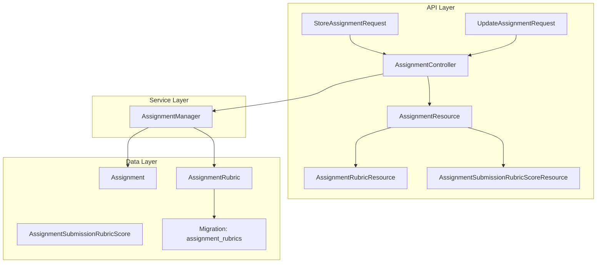
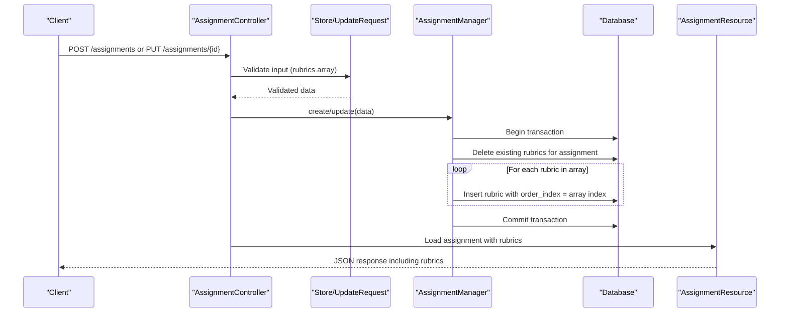
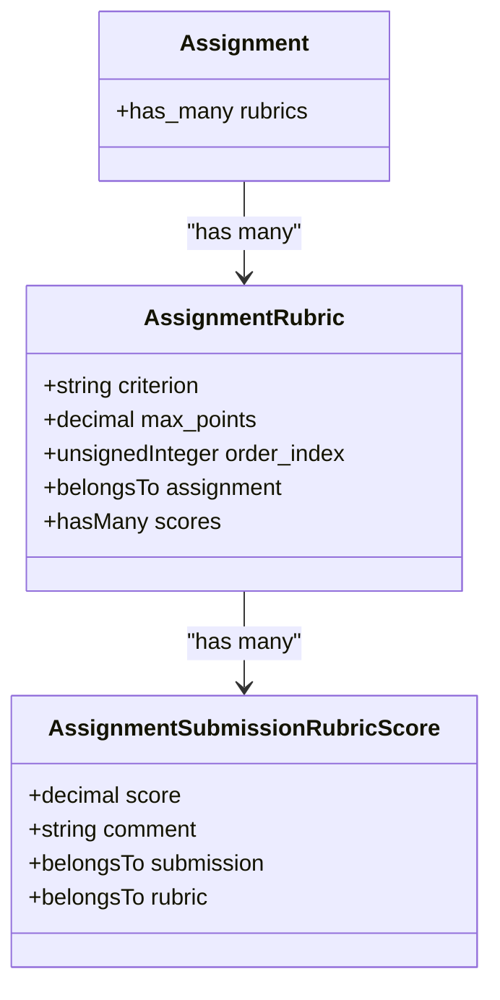
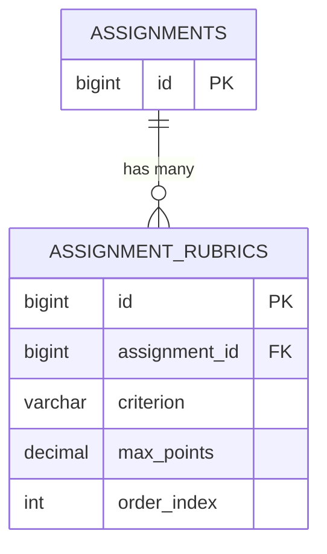
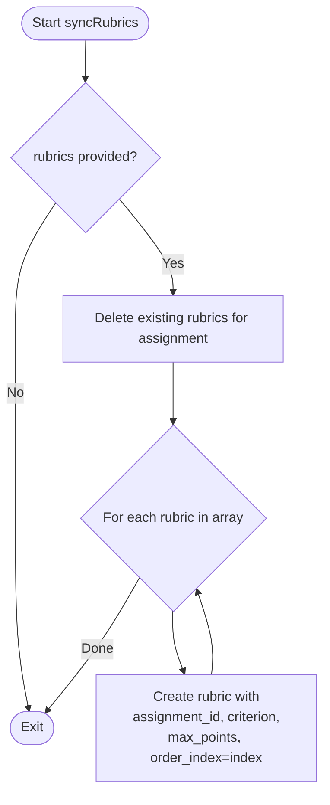
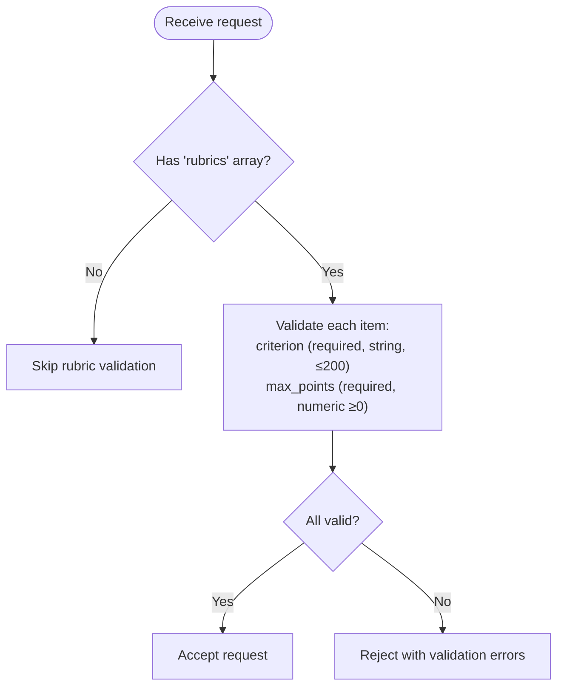
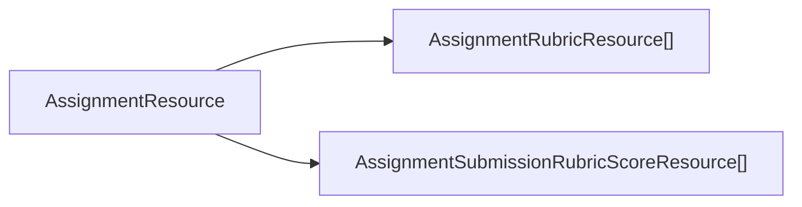
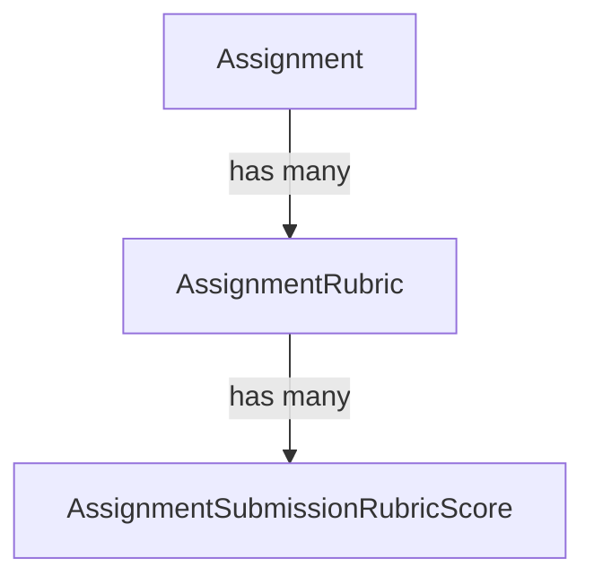
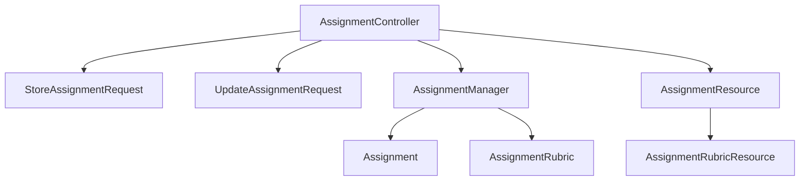

# Rubric Configuration

<cite>
**Referenced Files in This Document**
- [AssignmentRubric.php](file://app/Models/AssignmentRubric.php)
- [Assignment.php](file://app/Models/Assignment.php)
- [AssignmentSubmissionRubricScore.php](file://app/Models/AssignmentSubmissionRubricScore.php)
- [2024_01_01_000133_create_assignment_rubrics_table.php](file://database/migrations/2024_01_01_000133_create_assignment_rubrics_table.php)
- [AssignmentManager.php](file://app/Services/Assessment/AssignmentManager.php)
- [AssignmentController.php](file://app/Http/Controllers/Api/V1/AssignmentController.php)
- [StoreAssignmentRequest.php](file://app/Http/Requests/Api/V1/StoreAssignmentRequest.php)
- [UpdateAssignmentRequest.php](file://app/Http/Requests/Api/V1/UpdateAssignmentRequest.php)
- [AssignmentResource.php](file://app/Http/Resources/AssignmentResource.php)
- [AssignmentRubricResource.php](file://app/Http/Resources/AssignmentRubricResource.php)
- [AssignmentSubmissionRubricScoreResource.php](file://app/Http/Resources/AssignmentSubmissionRubricScoreResource.php)
- [AssignmentRubricFactory.php](file://database/factories/AssignmentRubricFactory.php)
</cite>

## Table of Contents
1. [Introduction](#introduction)
2. [Project Structure](#project-structure)
3. [Core Components](#core-components)
4. [Architecture Overview](#architecture-overview)
5. [Detailed Component Analysis](#detailed-component-analysis)
6. [Dependency Analysis](#dependency-analysis)
7. [Performance Considerations](#performance-considerations)
8. [Troubleshooting Guide](#troubleshooting-guide)
9. [Conclusion](#conclusion)
10. [Appendices](#appendices)

## Introduction
This document explains how to configure grading rubrics for assignments in the system. It focuses on the AssignmentRubric model and its fields (criterion, max_points, order_index), how to create and manage criteria with proper point allocation, and how multiple criteria relate to a single assignment. It also covers validation rules, ordering behavior, and best practices for building effective rubrics. The guidance applies to both holistic and analytic rubric styles by structuring criteria and points appropriately.

## Project Structure
Rubric configuration spans models, migrations, services, controllers, request validators, and API resources:
- Models define data structure and relationships.
- Migration defines the database schema for rubrics.
- Service orchestrates creation/update and ensures atomic sync of rubrics.
- Controller exposes endpoints that load and return rubrics.
- Request classes validate incoming rubric inputs.
- Resources serialize rubrics for API responses.

**Diagram sources**
- [AssignmentController.php:20-37](file://app/Http/Controllers/Api/V1/AssignmentController.php#L20-L37)
- [AssignmentManager.php:26-80](file://app/Services/Assessment/AssignmentManager.php#L26-L80)
- [Assignment.php:55-61](file://app/Models/Assignment.php#L55-L61)
- [AssignmentRubric.php:13-45](file://app/Models/AssignmentRubric.php#L13-L45)
- [2024_01_01_000133_create_assignment_rubrics_table.php:11-19](file://database/migrations/2024_01_01_000133_create_assignment_rubrics_table.php#L11-L19)
- [AssignmentResource.php:16-40](file://app/Http/Resources/AssignmentResource.php#L16-L40)
- [AssignmentRubricResource.php:15-22](file://app/Http/Resources/AssignmentRubricResource.php#L15-L22)
- [AssignmentSubmissionRubricScoreResource.php:15-21](file://app/Http/Resources/AssignmentSubmissionRubricScoreResource.php#L15-L21)

**Section sources**
- [AssignmentController.php:20-37](file://app/Http/Controllers/Api/V1/AssignmentController.php#L20-L37)
- [AssignmentManager.php:26-80](file://app/Services/Assessment/AssignmentManager.php#L26-L80)
- [Assignment.php:55-61](file://app/Models/Assignment.php#L55-L61)
- [AssignmentRubric.php:13-45](file://app/Models/AssignmentRubric.php#L13-L45)
- [2024_01_01_000133_create_assignment_rubrics_table.php:11-19](file://database/migrations/2024_01_01_000133_create_assignment_rubrics_table.php#L11-L19)
- [AssignmentResource.php:16-40](file://app/Http/Resources/AssignmentResource.php#L16-L40)
- [AssignmentRubricResource.php:15-22](file://app/Http/Resources/AssignmentRubricResource.php#L15-L22)
- [AssignmentSubmissionRubricScoreResource.php:15-21](file://app/Http/Resources/AssignmentSubmissionRubricScoreResource.php#L15-L21)

## Core Components
- AssignmentRubric model:
  - Fields: assignment_id, criterion, max_points, order_index.
  - Casts: max_points as decimal(6,2).
  - Relationships: belongs to Assignment; has many scores via AssignmentSubmissionRubricScore.
- Assignment model:
  - Has many rubrics through AssignmentRubric.
- Database schema:
  - assignment_rubrics table with foreign key to assignments, string criterion, decimal max_points, unsigned integer order_index defaulting to 0.
- Service layer:
  - AssignmentManager.syncRubrics replaces all rubrics for an assignment atomically and assigns order_index based on array index.
- Validation:
  - StoreAssignmentRequest and UpdateAssignmentRequest require rubrics.*.criterion and rubrics.*.max_points when rubrics are provided, with appropriate types and constraints.
- API resources:
  - AssignmentResource includes rubrics collection.
  - AssignmentRubricResource serializes id, criterion, max_points, order_index.
  - AssignmentSubmissionRubricScoreResource serializes rubric_id, score, comment.

**Section sources**
- [AssignmentRubric.php:20-45](file://app/Models/AssignmentRubric.php#L20-L45)
- [Assignment.php:55-61](file://app/Models/Assignment.php#L55-L61)
- [2024_01_01_000133_create_assignment_rubrics_table.php:11-19](file://database/migrations/2024_01_01_000133_create_assignment_rubrics_table.php#L11-L19)
- [AssignmentManager.php:94-113](file://app/Services/Assessment/AssignmentManager.php#L94-L113)
- [StoreAssignmentRequest.php:20-36](file://app/Http/Requests/Api/V1/StoreAssignmentRequest.php#L20-L36)
- [UpdateAssignmentRequest.php:19-35](file://app/Http/Requests/Api/V1/UpdateAssignmentRequest.php#L19-L35)
- [AssignmentResource.php:16-40](file://app/Http/Resources/AssignmentResource.php#L16-L40)
- [AssignmentRubricResource.php:15-22](file://app/Http/Resources/AssignmentRubricResource.php#L15-L22)
- [AssignmentSubmissionRubricScoreResource.php:15-21](file://app/Http/Resources/AssignmentSubmissionRubricScoreResource.php#L15-L21)

## Architecture Overview
The rubric lifecycle is managed through a transactional service that replaces all criteria for an assignment on create or update. Controllers expose endpoints that accept validated requests and return serialized rubrics.

**Diagram sources**
- [AssignmentController.php:25-37](file://app/Http/Controllers/Api/V1/AssignmentController.php#L25-L37)
- [StoreAssignmentRequest.php:20-36](file://app/Http/Requests/Api/V1/StoreAssignmentRequest.php#L20-L36)
- [UpdateAssignmentRequest.php:19-35](file://app/Http/Requests/Api/V1/UpdateAssignmentRequest.php#L19-L35)
- [AssignmentManager.php:26-80](file://app/Services/Assessment/AssignmentManager.php#L26-L80)
- [AssignmentManager.php:94-113](file://app/Services/Assessment/AssignmentManager.php#L94-L113)
- [AssignmentResource.php:16-40](file://app/Http/Resources/AssignmentResource.php#L16-L40)

## Detailed Component Analysis

### AssignmentRubric Model
- Purpose: Represents a single grading criterion for an assignment.
- Key fields:
  - criterion: descriptive label for the criterion.
  - max_points: maximum points achievable for this criterion.
  - order_index: display/order position assigned automatically from array index during sync.
- Relationships:
  - Belongs to Assignment.
  - Has many AssignmentSubmissionRubricScore entries for graded submissions.

**Diagram sources**
- [Assignment.php:55-61](file://app/Models/Assignment.php#L55-L61)
- [AssignmentRubric.php:20-45](file://app/Models/AssignmentRubric.php#L20-L45)
- [AssignmentSubmissionRubricScore.php:14-39](file://app/Models/AssignmentSubmissionRubricScore.php#L14-L39)

**Section sources**
- [AssignmentRubric.php:20-45](file://app/Models/AssignmentRubric.php#L20-L45)
- [AssignmentSubmissionRubricScore.php:14-39](file://app/Models/AssignmentSubmissionRubricScore.php#L14-L39)

### Database Schema for Rubrics
- Table: assignment_rubrics
- Columns:
  - id (primary key)
  - assignment_id (foreign key to assignments, cascade delete)
  - criterion (string, length 200)
  - max_points (decimal 6,2)
  - order_index (unsigned integer, default 0)

**Diagram sources**
- [2024_01_01_000133_create_assignment_rubrics_table.php:11-19](file://database/migrations/2024_01_01_000133_create_assignment_rubrics_table.php#L11-L19)

**Section sources**
- [2024_01_01_000133_create_assignment_rubrics_table.php:11-19](file://database/migrations/2024_01_01_000133_create_assignment_rubrics_table.php#L11-L19)

### Rubric Sync Logic (Create/Update)
- Behavior:
  - On assignment create or update, if rubrics are provided, all existing rubrics are deleted and replaced with the new set.
  - order_index is derived from the array index (0-based) of the submitted rubrics list.
- Transaction safety:
  - All operations occur within a database transaction to ensure consistency.

**Diagram sources**
- [AssignmentManager.php:94-113](file://app/Services/Assessment/AssignmentManager.php#L94-L113)

**Section sources**
- [AssignmentManager.php:26-80](file://app/Services/Assessment/AssignmentManager.php#L26-L80)
- [AssignmentManager.php:94-113](file://app/Services/Assessment/AssignmentManager.php#L94-L113)

### Validation Rules for Rubrics
- When rubrics are included:
  - Each item must have:
    - criterion: required string, max length 200.
    - max_points: required numeric, minimum 0.
- Optional:
  - rubrics field itself is nullable; if omitted, no changes are made to rubrics on update.

**Diagram sources**
- [StoreAssignmentRequest.php:20-36](file://app/Http/Requests/Api/V1/StoreAssignmentRequest.php#L20-L36)
- [UpdateAssignmentRequest.php:19-35](file://app/Http/Requests/Api/V1/UpdateAssignmentRequest.php#L19-L35)

**Section sources**
- [StoreAssignmentRequest.php:20-36](file://app/Http/Requests/Api/V1/StoreAssignmentRequest.php#L20-L36)
- [UpdateAssignmentRequest.php:19-35](file://app/Http/Requests/Api/V1/UpdateAssignmentRequest.php#L19-L35)

### API Responses and Serialization
- AssignmentResource includes:
  - Assignment details and a rubrics collection when loaded.
- AssignmentRubricResource serializes:
  - id, criterion, max_points, order_index.
- AssignmentSubmissionRubricScoreResource serializes:
  - rubric_id, score, comment.

**Diagram sources**
- [AssignmentResource.php:16-40](file://app/Http/Resources/AssignmentResource.php#L16-L40)
- [AssignmentRubricResource.php:15-22](file://app/Http/Resources/AssignmentRubricResource.php#L15-L22)
- [AssignmentSubmissionRubricScoreResource.php:15-21](file://app/Http/Resources/AssignmentSubmissionRubricScoreResource.php#L15-L21)

**Section sources**
- [AssignmentResource.php:16-40](file://app/Http/Resources/AssignmentResource.php#L16-L40)
- [AssignmentRubricResource.php:15-22](file://app/Http/Resources/AssignmentRubricResource.php#L15-L22)
- [AssignmentSubmissionRubricScoreResource.php:15-21](file://app/Http/Resources/AssignmentSubmissionRubricScoreResource.php#L15-L21)

### Creating and Managing Criteria with Point Allocation
- How to create:
  - Provide an array of rubrics under the rubrics key when creating or updating an assignment.
  - Each element must include criterion and max_points.
- Ordering:
  - order_index is automatically set to the array index; maintain desired order in the request payload.
- Point totals:
  - There is no enforced total sum at the rubric level; ensure your business logic aligns with assignment-level max_score if needed.
- Best practices:
  - Keep criterion names concise and meaningful.
  - Use consistent max_points across similar criteria for clarity.
  - Maintain stable ordering to avoid unnecessary reordering on updates.

**Section sources**
- [StoreAssignmentRequest.php:20-36](file://app/Http/Requests/Api/V1/StoreAssignmentRequest.php#L20-L36)
- [UpdateAssignmentRequest.php:19-35](file://app/Http/Requests/Api/V1/UpdateAssignmentRequest.php#L19-L35)
- [AssignmentManager.php:94-113](file://app/Services/Assessment/AssignmentManager.php#L94-L113)

### Relationship Between Assignments and Rubrics
- One-to-many:
  - An assignment can have multiple rubric criteria.
- Deletion behavior:
  - Deleting an assignment cascades deletion of its rubrics due to foreign key constraint.
- Scoring:
  - Each rubric can accumulate multiple scores via AssignmentSubmissionRubricScore for different submissions.

**Diagram sources**
- [Assignment.php:55-61](file://app/Models/Assignment.php#L55-L61)
- [AssignmentRubric.php:40-45](file://app/Models/AssignmentRubric.php#L40-L45)
- [AssignmentSubmissionRubricScore.php:25-39](file://app/Models/AssignmentSubmissionRubricScore.php#L25-L39)
- [2024_01_01_000133_create_assignment_rubrics_table.php:15](file://database/migrations/2024_01_01_000133_create_assignment_rubrics_table.php#L15)

**Section sources**
- [Assignment.php:55-61](file://app/Models/Assignment.php#L55-L61)
- [AssignmentRubric.php:40-45](file://app/Models/AssignmentRubric.php#L40-L45)
- [AssignmentSubmissionRubricScore.php:25-39](file://app/Models/AssignmentSubmissionRubricScore.php#L25-L39)
- [2024_01_01_000133_create_assignment_rubrics_table.php:15](file://database/migrations/2024_01_01_000133_create_assignment_rubrics_table.php#L15)

### Examples: Holistic vs Analytic Rubrics
- Holistic rubric:
  - Define a small number of broad criteria (e.g., “Overall quality”, “Clarity”) with higher max_points to reflect global assessment.
- Analytic rubric:
  - Define multiple specific criteria (e.g., “Structure”, “Evidence”, “Presentation”) with smaller max_points per criterion to allow detailed feedback.
- Point distribution:
  - Distribute max_points to reflect relative importance of each criterion.
  - Ensure the sum of criterion points aligns with your intended total where applicable.

[No sources needed since this section provides conceptual guidance]

## Dependency Analysis
- Controller depends on:
  - Request validators for input validation.
  - AssignmentManager for business logic.
  - Resources for serialization.
- Manager depends on:
  - Assignment and AssignmentRubric models.
  - Database transactions for atomicity.
- Models depend on:
  - Eloquent relationships and casts.
- Migration defines schema constraints and defaults.

**Diagram sources**
- [AssignmentController.php:20-37](file://app/Http/Controllers/Api/V1/AssignmentController.php#L20-L37)
- [StoreAssignmentRequest.php:20-36](file://app/Http/Requests/Api/V1/StoreAssignmentRequest.php#L20-L36)
- [UpdateAssignmentRequest.php:19-35](file://app/Http/Requests/Api/V1/UpdateAssignmentRequest.php#L19-L35)
- [AssignmentManager.php:26-80](file://app/Services/Assessment/AssignmentManager.php#L26-L80)
- [Assignment.php:55-61](file://app/Models/Assignment.php#L55-L61)
- [AssignmentRubric.php:20-45](file://app/Models/AssignmentRubric.php#L20-L45)
- [AssignmentResource.php:16-40](file://app/Http/Resources/AssignmentResource.php#L16-L40)
- [AssignmentRubricResource.php:15-22](file://app/Http/Resources/AssignmentRubricResource.php#L15-L22)

**Section sources**
- [AssignmentController.php:20-37](file://app/Http/Controllers/Api/V1/AssignmentController.php#L20-L37)
- [AssignmentManager.php:26-80](file://app/Services/Assessment/AssignmentManager.php#L26-L80)
- [Assignment.php:55-61](file://app/Models/Assignment.php#L55-L61)
- [AssignmentRubric.php:20-45](file://app/Models/AssignmentRubric.php#L20-L45)
- [AssignmentResource.php:16-40](file://app/Http/Resources/AssignmentResource.php#L16-L40)
- [AssignmentRubricResource.php:15-22](file://app/Http/Resources/AssignmentRubricResource.php#L15-L22)

## Performance Considerations
- Replace-all strategy:
  - Rubrics are deleted and recreated on each update; keep payloads minimal to reduce write overhead.
- Transactions:
  - Operations are wrapped in transactions to prevent partial states.
- Indexing:
  - Foreign key assignment_id supports efficient lookups and cascade deletes.
- Decimal precision:
  - max_points uses decimal(6,2); ensure values fit within range and precision.

[No sources needed since this section provides general guidance]

## Troubleshooting Guide
- Validation errors:
  - Missing or invalid rubrics.*.criterion or rubrics.*.max_points will cause request rejection.
- Unexpected ordering:
  - order_index reflects array index; ensure correct order in the request payload.
- No rubrics returned:
  - Ensure rubrics are loaded in the controller response path; AssignmentResource returns rubrics when loaded.
- Data not persisting:
  - Confirm transaction commits; check for exceptions in service layer.

**Section sources**
- [StoreAssignmentRequest.php:20-36](file://app/Http/Requests/Api/V1/StoreAssignmentRequest.php#L20-L36)
- [UpdateAssignmentRequest.php:19-35](file://app/Http/Requests/Api/V1/UpdateAssignmentRequest.php#L19-L35)
- [AssignmentManager.php:26-80](file://app/Services/Assessment/AssignmentManager.php#L26-L80)
- [AssignmentResource.php:16-40](file://app/Http/Resources/AssignmentResource.php#L16-L40)

## Conclusion
Rubric configuration centers on the AssignmentRubric model and a replace-all sync strategy orchestrated by AssignmentManager. Inputs are validated strictly, order is preserved via array indices, and relationships enable granular scoring per criterion. Follow best practices for clear criteria and sensible point distributions to build effective holistic or analytic rubrics.

[No sources needed since this section summarizes without analyzing specific files]

## Appendices

### API Payload Reference
- Create/Update assignment with rubrics:
  - rubrics: array of objects
    - criterion: string, required when rubrics present, max 200 characters
    - max_points: numeric, required when rubrics present, minimum 0
- Response includes:
  - assignment details
  - rubrics: array of { id, criterion, max_points, order_index }

**Section sources**
- [StoreAssignmentRequest.php:20-36](file://app/Http/Requests/Api/V1/StoreAssignmentRequest.php#L20-L36)
- [UpdateAssignmentRequest.php:19-35](file://app/Http/Requests/Api/V1/UpdateAssignmentRequest.php#L19-L35)
- [AssignmentResource.php:16-40](file://app/Http/Resources/AssignmentResource.php#L16-L40)
- [AssignmentRubricResource.php:15-22](file://app/Http/Resources/AssignmentRubricResource.php#L15-L22)

### Development Helpers
- Factory:
  - AssignmentRubricFactory generates sample rubrics with default max_points and order_index for testing.

**Section sources**
- [AssignmentRubricFactory.php:18-25](file://database/factories/AssignmentRubricFactory.php#L18-L25)