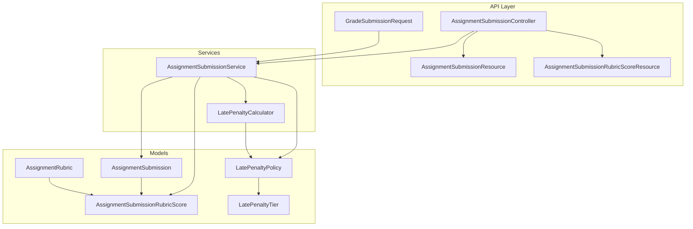
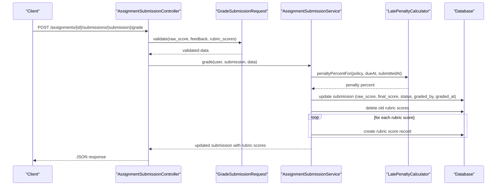
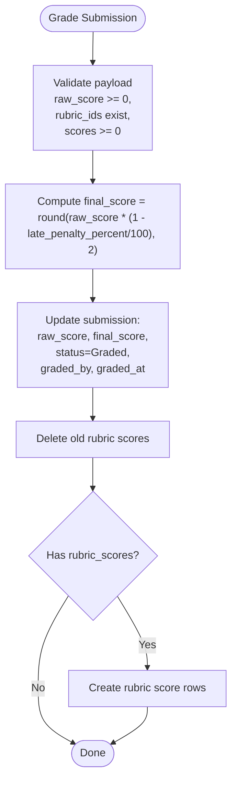
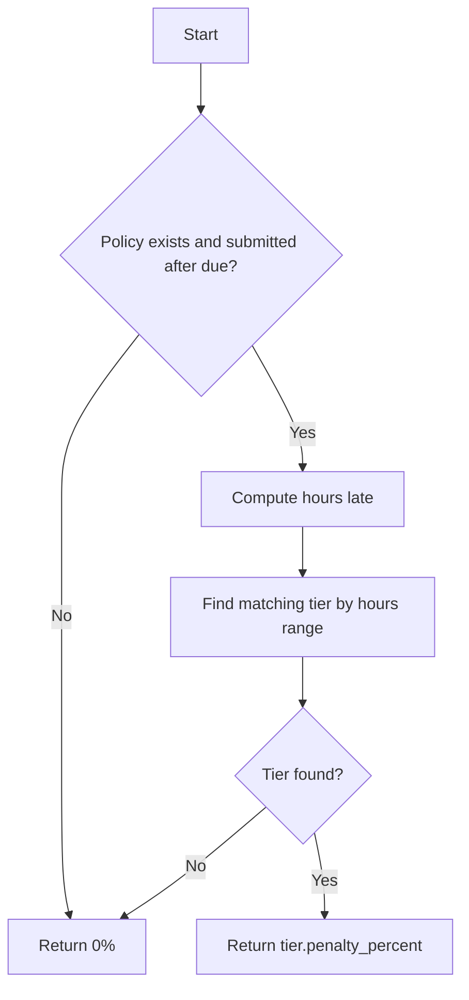
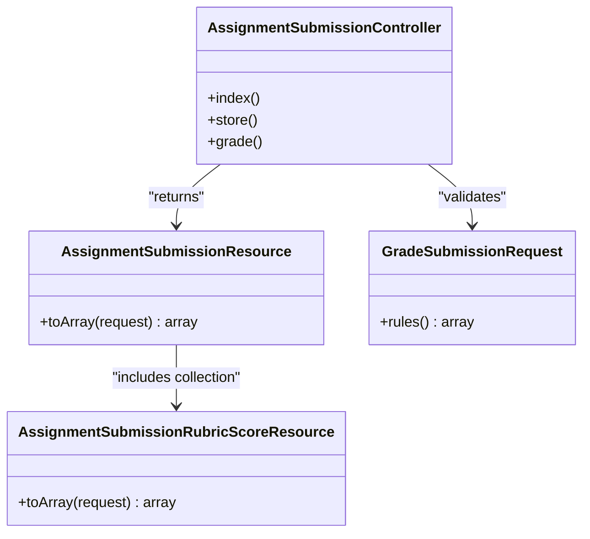
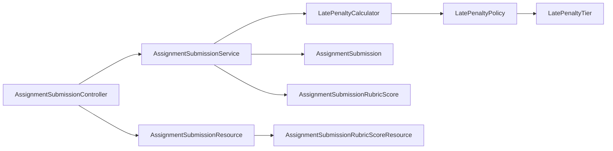

# Score Calculation & Management

<cite>
**Referenced Files in This Document**
- [AssignmentSubmissionRubricScore.php](file://app/Models/AssignmentSubmissionRubricScore.php)
- [AssignmentSubmission.php](file://app/Models/AssignmentSubmission.php)
- [AssignmentRubric.php](file://app/Models/AssignmentRubric.php)
- [LatePenaltyPolicy.php](file://app/Models/LatePenaltyPolicy.php)
- [LatePenaltyTier.php](file://app/Models/LatePenaltyTier.php)
- [AssignmentManager.php](file://app/Services/Assessment/AssignmentManager.php)
- [AssignmentSubmissionService.php](file://app/Services/Assessment/AssignmentSubmissionService.php)
- [LatePenaltyCalculator.php](file://app/Services/Assessment/LatePenaltyCalculator.php)
- [AssignmentSubmissionController.php](file://app/Http/Controllers/Api/V1/AssignmentSubmissionController.php)
- [GradeSubmissionRequest.php](file://app/Http/Requests/Api/V1/GradeSubmissionRequest.php)
- [AssignmentSubmissionResource.php](file://app/Http/Resources/AssignmentSubmissionResource.php)
- [AssignmentSubmissionRubricScoreResource.php](file://app/Http/Resources/AssignmentSubmissionRubricScoreResource.php)
- [2024_01_01_000135_create_assignment_submission_rubric_scores_table.php](file://database/migrations/2024_01_01_000135_create_assignment_submission_rubric_scores_table.php)
</cite>

## Table of Contents
1. [Introduction](#introduction)
2. [Project Structure](#project-structure)
3. [Core Components](#core-components)
4. [Architecture Overview](#architecture-overview)
5. [Detailed Component Analysis](#detailed-component-analysis)
6. [Dependency Analysis](#dependency-analysis)
7. [Performance Considerations](#performance-considerations)
8. [Troubleshooting Guide](#troubleshooting-guide)
9. [Conclusion](#conclusion)

## Introduction
This document explains how scores are calculated and managed for assignment submissions, focusing on:
- Recording per-criterion rubric scores for each submission
- Aggregating criterion scores into final grades
- Applying late penalties and rounding behavior
- Handling edge cases such as partial credit, validation constraints, and multiple instructor grading attempts

The system uses a clear separation between data models (rubrics and scores), service logic (submission and grading flows), and API boundaries (controllers and request validation).

## Project Structure
The scoring workflow spans models, services, controllers, requests, resources, and migrations:
- Models define the entities: Assignment, Rubric, Submission, Rubric Scores, Late Penalty Policy/Tiers
- Services implement business rules: submitting work, grading with rubrics, calculating late penalties
- Controllers expose endpoints to submit and grade
- Requests validate inputs before processing
- Resources serialize responses including rubric scores
- Migrations define database schema and constraints

**Diagram sources**
- [AssignmentSubmissionController.php:29-57](file://app/Http/Controllers/Api/V1/AssignmentSubmissionController.php#L29-L57)
- [AssignmentSubmissionService.php:37-115](file://app/Services/Assessment/AssignmentSubmissionService.php#L37-L115)
- [LatePenaltyCalculator.php:17-34](file://app/Services/Assessment/LatePenaltyCalculator.php#L17-L34)
- [AssignmentSubmission.php:22-88](file://app/Models/AssignmentSubmission.php#L22-L88)
- [AssignmentRubric.php:20-45](file://app/Models/AssignmentRubric.php#L20-L45)
- [AssignmentSubmissionRubricScore.php:14-39](file://app/Models/AssignmentSubmissionRubricScore.php#L14-L39)
- [LatePenaltyPolicy.php:19-37](file://app/Models/LatePenaltyPolicy.php#L19-L37)
- [LatePenaltyTier.php:19-36](file://app/Models/LatePenaltyTier.php#L19-L36)

**Section sources**
- [AssignmentSubmissionController.php:29-57](file://app/Http/Controllers/Api/V1/AssignmentSubmissionController.php#L29-L57)
- [AssignmentSubmissionService.php:37-115](file://app/Services/Assessment/AssignmentSubmissionService.php#L37-L115)
- [LatePenaltyCalculator.php:17-34](file://app/Services/Assessment/LatePenaltyCalculator.php#L17-L34)
- [AssignmentSubmission.php:22-88](file://app/Models/AssignmentSubmission.php#L22-L88)
- [AssignmentRubric.php:20-45](file://app/Models/AssignmentRubric.php#L20-L45)
- [AssignmentSubmissionRubricScore.php:14-39](file://app/Models/AssignmentSubmissionRubricScore.php#L14-L39)
- [LatePenaltyPolicy.php:19-37](file://app/Models/LatePenaltyPolicy.php#L19-L37)
- [LatePenaltyTier.php:19-36](file://app/Models/LatePenaltyTier.php#L19-L36)

## Core Components
- AssignmentSubmissionRubricScore: Stores per-criterion scores and comments for a submission; enforces one score per rubric per submission via a unique constraint.
- AssignmentSubmission: Holds raw_score, final_score, late_penalty_percent, status, and relationships to rubric scores and graded-by user.
- AssignmentRubric: Defines criteria and max_points for an assignment’s grading rubric.
- LatePenaltyPolicy and LatePenaltyTier: Define time-based penalty bands used to compute late deductions.
- AssignmentSubmissionService: Orchestrates submission creation, late penalty calculation, grading, rubric score persistence, notifications, and audit logging.
- LatePenaltyCalculator: Computes the applicable penalty percentage based on hours late and configured tiers.
- AssignmentSubmissionController: Exposes endpoints to list, submit, and grade submissions.
- GradeSubmissionRequest: Validates grading payloads, ensuring numeric non-negative scores and valid rubric IDs.
- Resources: Serialize submission and rubric score data for API responses.

**Section sources**
- [AssignmentSubmissionRubricScore.php:14-39](file://app/Models/AssignmentSubmissionRubricScore.php#L14-L39)
- [AssignmentSubmission.php:22-88](file://app/Models/AssignmentSubmission.php#L22-L88)
- [AssignmentRubric.php:20-45](file://app/Models/AssignmentRubric.php#L20-L45)
- [LatePenaltyPolicy.php:19-37](file://app/Models/LatePenaltyPolicy.php#L19-L37)
- [LatePenaltyTier.php:19-36](file://app/Models/LatePenaltyTier.php#L19-L36)
- [AssignmentSubmissionService.php:37-115](file://app/Services/Assessment/AssignmentSubmissionService.php#L37-L115)
- [LatePenaltyCalculator.php:17-34](file://app/Services/Assessment/LatePenaltyCalculator.php#L17-L34)
- [AssignmentSubmissionController.php:29-57](file://app/Http/Controllers/Api/V1/AssignmentSubmissionController.php#L29-L57)
- [GradeSubmissionRequest.php:21-31](file://app/Http/Requests/Api/V1/GradeSubmissionRequest.php#L21-L31)
- [AssignmentSubmissionResource.php:16-34](file://app/Http/Resources/AssignmentSubmissionResource.php#L16-L34)
- [AssignmentSubmissionRubricScoreResource.php:15-21](file://app/Http/Resources/AssignmentSubmissionRubricScoreResource.php#L15-L21)

## Architecture Overview
The grading flow is transactional and audited:
- Instructor submits grading payload through the controller
- Request validation ensures safe inputs
- Service computes final score from raw score and late penalty
- Service persists rubric scores by replacing previous ones
- Service records who graded and when, updates status, notifies student, and logs changes

**Diagram sources**
- [AssignmentSubmissionController.php:52-57](file://app/Http/Controllers/Api/V1/AssignmentSubmissionController.php#L52-L57)
- [GradeSubmissionRequest.php:21-31](file://app/Http/Requests/Api/V1/GradeSubmissionRequest.php#L21-L31)
- [AssignmentSubmissionService.php:72-115](file://app/Services/Assessment/AssignmentSubmissionService.php#L72-L115)
- [LatePenaltyCalculator.php:17-34](file://app/Services/Assessment/LatePenaltyCalculator.php#L17-L34)

## Detailed Component Analysis

### AssignmentSubmissionRubricScore Model
Purpose:
- Records a single score and optional comment per rubric criterion for a given submission
- Enforces uniqueness so only one score exists per rubric per submission

Key behaviors:
- Decimal precision for score values
- Relationships to submission and rubric for querying and reporting

Data integrity:
- Unique constraint on (submission_id, rubric_id) prevents duplicate rubric scores

Usage:
- Created during grading; replaced entirely on each grade to ensure consistency

**Section sources**
- [AssignmentSubmissionRubricScore.php:14-39](file://app/Models/AssignmentSubmissionRubricScore.php#L14-L39)
- [2024_01_01_000135_create_assignment_submission_rubric_scores_table.php:13-20](file://database/migrations/2024_01_01_000135_create_assignment_submission_rubric_scores_table.php#L13-L20)

### Scoring Process: From Rubric Scores to Final Grade
Flow:
- Grading payload includes raw_score and optional rubric_scores array
- Service calculates final_score by applying late penalty percentage to raw_score
- Service deletes existing rubric scores and inserts new ones from the payload
- Status transitions to graded, with grader identity and timestamp recorded

Aggregation:
- The system stores both raw_score and final_score on the submission
- Rubric scores are stored per criterion; aggregation to raw_score is not enforced here but can be derived by summing rubric scores if needed

Rounding:
- final_score is rounded to two decimal places after applying the late penalty

Edge cases:
- If no rubric_scores are provided, the submission is still graded using raw_score and late penalty
- Validation ensures rubric_ids exist and scores are non-negative

**Diagram sources**
- [AssignmentSubmissionService.php:72-115](file://app/Services/Assessment/AssignmentSubmissionService.php#L72-L115)
- [GradeSubmissionRequest.php:21-31](file://app/Http/Requests/Api/V1/GradeSubmissionRequest.php#L21-L31)

**Section sources**
- [AssignmentSubmissionService.php:72-115](file://app/Services/Assessment/AssignmentSubmissionService.php#L72-L115)
- [GradeSubmissionRequest.php:21-31](file://app/Http/Requests/Api/V1/GradeSubmissionRequest.php#L21-L31)

### Late Penalties and Rounding
Late penalty calculation:
- Based on hours late and configured policy tiers
- Returns 0% if no policy or submission is on time
- Uses tier ranges to find the correct penalty percentage

Application:
- Applied at grading time to convert raw_score to final_score
- Stored separately on submission for transparency

Rounding:
- final_score is rounded to two decimals after penalty application

**Diagram sources**
- [LatePenaltyCalculator.php:17-34](file://app/Services/Assessment/LatePenaltyCalculator.php#L17-L34)
- [LatePenaltyPolicy.php:19-37](file://app/Models/LatePenaltyPolicy.php#L19-L37)
- [LatePenaltyTier.php:19-36](file://app/Models/LatePenaltyTier.php#L19-L36)

**Section sources**
- [LatePenaltyCalculator.php:17-34](file://app/Services/Assessment/LatePenaltyCalculator.php#L17-L34)
- [AssignmentSubmissionService.php:37-67](file://app/Services/Assessment/AssignmentSubmissionService.php#L37-L67)
- [AssignmentSubmissionService.php:72-115](file://app/Services/Assessment/AssignmentSubmissionService.php#L72-L115)

### Rubric Management and Weighted Totals
Rubric definition:
- Rubrics are created/updated as a complete set per assignment
- Each rubric has a criterion name and max_points

Weighted totals:
- The current implementation does not enforce that rubric max_points sum to the assignment’s max_score
- To compute weighted totals, multiply each rubric score by its weight (score/max_points) and sum across rubrics
- This can be implemented in a service or resource layer without changing storage

Example approach:
- For each rubric score, compute contribution = score / rubric.max_points
- Sum contributions to get a normalized total (0–1 scale)
- Multiply by assignment max_score to get a weighted total if desired

Note:
- Ensure rubric_ids in grading payload match those defined for the assignment

**Section sources**
- [AssignmentManager.php:97-113](file://app/Services/Assessment/AssignmentManager.php#L97-L113)
- [AssignmentRubric.php:20-45](file://app/Models/AssignmentRubric.php#L20-L45)

### API Endpoints and Data Contracts
Endpoints:
- List submissions for an assignment (with rubric scores)
- Submit a new assignment submission (file/text)
- Grade a submission (raw_score, feedback, rubric_scores)

Validation:
- raw_score required and numeric, minimum 0
- rubric_scores optional array; each item requires rubric_id and score (>=0); rubric_id must exist in assignment_rubrics

Response serialization:
- Includes submission fields and rubric scores when loaded

**Diagram sources**
- [AssignmentSubmissionController.php:29-57](file://app/Http/Controllers/Api/V1/AssignmentSubmissionController.php#L29-L57)
- [GradeSubmissionRequest.php:21-31](file://app/Http/Requests/Api/V1/GradeSubmissionRequest.php#L21-L31)
- [AssignmentSubmissionResource.php:16-34](file://app/Http/Resources/AssignmentSubmissionResource.php#L16-L34)
- [AssignmentSubmissionRubricScoreResource.php:15-21](file://app/Http/Resources/AssignmentSubmissionRubricScoreResource.php#L15-L21)

**Section sources**
- [AssignmentSubmissionController.php:29-57](file://app/Http/Controllers/Api/V1/AssignmentSubmissionController.php#L29-L57)
- [GradeSubmissionRequest.php:21-31](file://app/Http/Requests/Api/V1/GradeSubmissionRequest.php#L21-L31)
- [AssignmentSubmissionResource.php:16-34](file://app/Http/Resources/AssignmentSubmissionResource.php#L16-L34)
- [AssignmentSubmissionRubricScoreResource.php:15-21](file://app/Http/Resources/AssignmentSubmissionRubricScoreResource.php#L15-L21)

## Dependency Analysis
Key dependencies:
- Controller depends on service and resources
- Service depends on late penalty calculator, models, and external services (notifications, audit, progress)
- Late penalty calculator depends on policy and tiers
- Models have well-defined relationships enabling efficient queries

Potential coupling:
- Grading logic is centralized in the service, reducing duplication
- Validation is isolated in request classes, improving maintainability

**Diagram sources**
- [AssignmentSubmissionController.php:29-57](file://app/Http/Controllers/Api/V1/AssignmentSubmissionController.php#L29-L57)
- [AssignmentSubmissionService.php:37-115](file://app/Services/Assessment/AssignmentSubmissionService.php#L37-L115)
- [LatePenaltyCalculator.php:17-34](file://app/Services/Assessment/LatePenaltyCalculator.php#L17-L34)
- [AssignmentSubmission.php:22-88](file://app/Models/AssignmentSubmission.php#L22-L88)
- [AssignmentSubmissionRubricScore.php:14-39](file://app/Models/AssignmentSubmissionRubricScore.php#L14-L39)
- [LatePenaltyPolicy.php:19-37](file://app/Models/LatePenaltyPolicy.php#L19-L37)
- [LatePenaltyTier.php:19-36](file://app/Models/LatePenaltyTier.php#L19-L36)
- [AssignmentSubmissionResource.php:16-34](file://app/Http/Resources/AssignmentSubmissionResource.php#L16-L34)
- [AssignmentSubmissionRubricScoreResource.php:15-21](file://app/Http/Resources/AssignmentSubmissionRubricScoreResource.php#L15-L21)

**Section sources**
- [AssignmentSubmissionController.php:29-57](file://app/Http/Controllers/Api/V1/AssignmentSubmissionController.php#L29-L57)
- [AssignmentSubmissionService.php:37-115](file://app/Services/Assessment/AssignmentSubmissionService.php#L37-L115)
- [LatePenaltyCalculator.php:17-34](file://app/Services/Assessment/LatePenaltyCalculator.php#L17-L34)

## Performance Considerations
- Transactional grading: All updates (submission fields and rubric scores) occur within a single transaction to ensure consistency and reduce partial writes.
- Efficient queries: Loading rubric scores with submissions avoids N+1 queries in listing endpoints.
- Minimal writes: Rubric scores are deleted and re-inserted as a batch per grade; consider batching operations for large rubric sets if needed.
- Indexing: Database constraints and foreign keys support fast lookups and referential integrity.

[No sources needed since this section provides general guidance]

## Troubleshooting Guide
Common issues and resolutions:
- Invalid rubric_id in rubric_scores: Validation rejects unknown rubric IDs; ensure rubric_ids match those defined for the assignment.
- Negative or zero scores: Validation enforces non-negative scores; adjust input accordingly.
- Duplicate rubric scores: Unique constraint prevents duplicates; grading replaces previous scores automatically.
- Multiple instructors grading the same submission: Later grading overwrites earlier results; the latest grade is persisted with updated graded_by and graded_at. Use audit logs to review history.
- Late penalty not applied: Verify assignment has a due date and late penalty policy; confirm submission time is after due date.

Operational checks:
- Confirm submission status transitions to Graded upon successful grading
- Verify final_score reflects raw_score adjusted by late penalty and rounded to two decimals
- Inspect rubric_scores collection in responses to ensure all criteria were scored

**Section sources**
- [GradeSubmissionRequest.php:21-31](file://app/Http/Requests/Api/V1/GradeSubmissionRequest.php#L21-L31)
- [2024_01_01_000135_create_assignment_submission_rubric_scores_table.php:13-20](file://database/migrations/2024_01_01_000135_create_assignment_submission_rubric_scores_table.php#L13-L20)
- [AssignmentSubmissionService.php:72-115](file://app/Services/Assessment/AssignmentSubmissionService.php#L72-L115)
- [AssignmentSubmissionResource.php:16-34](file://app/Http/Resources/AssignmentSubmissionResource.php#L16-L34)

## Conclusion
The assignment grading workflow provides a robust mechanism for recording per-criterion rubric scores and computing final grades with late penalties. The design emphasizes data integrity through validation and constraints, transactional updates, and clear separation of concerns across controllers, services, and models. While rubric weights are not enforced at write time, they can be computed at read time for weighted totals. The system supports multiple grading attempts with the latest grade prevailing, while preserving change history via audit logs.