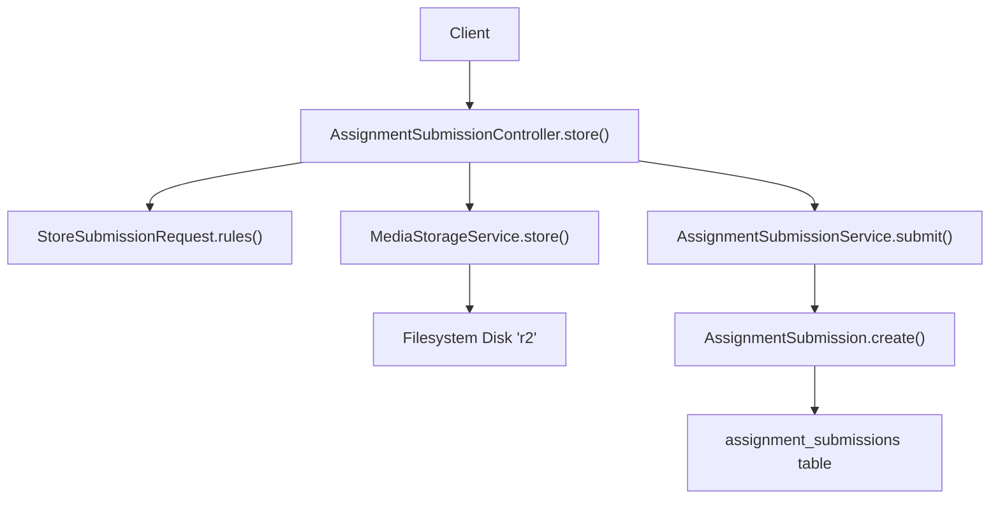
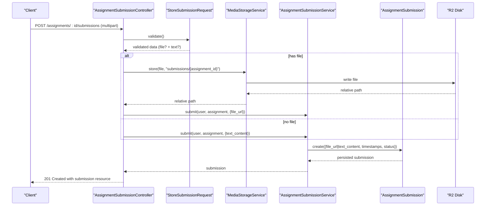
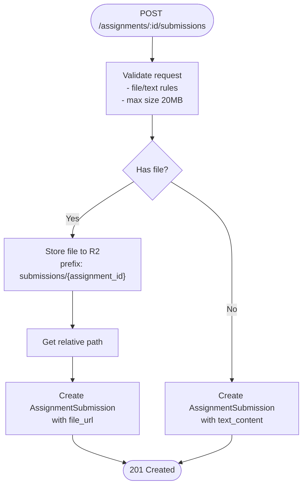
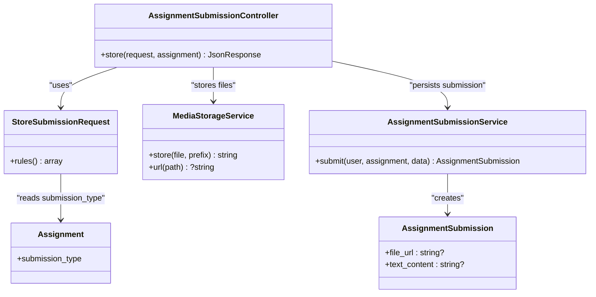

# File Upload Processing

<cite>
**Referenced Files in This Document**
- [AssignmentSubmissionController.php](file://app/Http/Controllers/Api/V1/AssignmentSubmissionController.php)
- [StoreSubmissionRequest.php](file://app/Http/Requests/Api/V1/StoreSubmissionRequest.php)
- [AssignmentSubmissionService.php](file://app/Services/Assessment/AssignmentSubmissionService.php)
- [MediaStorageService.php](file://app/Services/Storage/MediaStorageService.php)
- [AssignmentSubmission.php](file://app/Models/AssignmentSubmission.php)
- [Assignment.php](file://app/Models/Assignment.php)
- [AssignmentSubmissionType.php](file://app/Enums/AssignmentSubmissionType.php)
- [filesystems.php](file://config/filesystems.php)
- [2024_01_01_000134_create_assignment_submissions_table.php](file://database/migrations/2024_01_01_000134_create_assignment_submissions_table.php)
- [AssignmentSubmissionTest.php](file://tests/Feature/Assessment/AssignmentSubmissionTest.php)
</cite>

## Table of Contents
1. [Introduction](#introduction)
2. [Project Structure](#project-structure)
3. [Core Components](#core-components)
4. [Architecture Overview](#architecture-overview)
5. [Detailed Component Analysis](#detailed-component-analysis)
6. [Dependency Analysis](#dependency-analysis)
7. [Performance Considerations](#performance-considerations)
8. [Troubleshooting Guide](#troubleshooting-guide)
9. [Conclusion](#conclusion)

## Introduction
This document explains how assignment submissions handle file uploads end-to-end: client request, server-side validation, storage to Cloudflare R2, URL generation, and persistence in the AssignmentSubmission model. It also covers supported submission types, size limits, error handling for failed uploads, and the workflow from upload to final storage.

## Project Structure
The file upload flow spans controllers, request validators, services, models, and configuration:
- Controller receives multipart/form-data with an optional file field and delegates to a service.
- Request validator enforces rules based on the assignment’s submission type.
- Storage service persists files to the configured disk and returns relative paths.
- Model stores the relative path in file_url; URLs are resolved when needed.
- Configuration defines the storage disk (R2) and its public URL base.

**Diagram sources**
- [AssignmentSubmissionController.php:38-50](file://app/Http/Controllers/Api/V1/AssignmentSubmissionController.php#L38-L50)
- [StoreSubmissionRequest.php:19-36](file://app/Http/Requests/Api/V1/StoreSubmissionRequest.php#L19-L36)
- [MediaStorageService.php:32-41](file://app/Services/Storage/MediaStorageService.php#L32-L41)
- [AssignmentSubmissionService.php:37-67](file://app/Services/Assessment/AssignmentSubmissionService.php#L37-L67)
- [filesystems.php:75-86](file://config/filesystems.php#L75-L86)

**Section sources**
- [AssignmentSubmissionController.php:38-50](file://app/Http/Controllers/Api/V1/AssignmentSubmissionController.php#L38-L50)
- [StoreSubmissionRequest.php:19-36](file://app/Http/Requests/Api/V1/StoreSubmissionRequest.php#L19-L36)
- [MediaStorageService.php:32-41](file://app/Services/Storage/MediaStorageService.php#L32-L41)
- [AssignmentSubmissionService.php:37-67](file://app/Services/Assessment/AssignmentSubmissionService.php#L37-L67)
- [filesystems.php:75-86](file://config/filesystems.php#L75-L86)

## Core Components
- AssignmentSubmissionController.store(): Validates input via StoreSubmissionRequest, stores uploaded files via MediaStorageService, then delegates to AssignmentSubmissionService to persist the submission.
- StoreSubmissionRequest.rules(): Enforces required fields and file constraints based on AssignmentSubmissionType.
- MediaStorageService.store(): Stores files to the R2 disk under a prefix and returns a relative path; throws on failure.
- AssignmentSubmissionService.submit(): Creates the AssignmentSubmission record with file_url or text_content, calculates late penalties, and triggers progress updates.
- AssignmentSubmission model: Holds file_url as a string column; relationships to assignment, student, grader, rubric scores, and plagiarism report.
- filesystems.php: Defines the R2 disk driver and public URL base used to resolve stored paths to URLs.

Key behaviors:
- Submission type determines whether file or text is required or both are allowed.
- Uploaded files are stored under submissions/{assignment_id}/... and only relative paths are persisted.
- Late penalty calculation occurs at submission time; grading applies it to final score.

**Section sources**
- [AssignmentSubmissionController.php:38-50](file://app/Http/Controllers/Api/V1/AssignmentSubmissionController.php#L38-L50)
- [StoreSubmissionRequest.php:19-36](file://app/Http/Requests/Api/V1/StoreSubmissionRequest.php#L19-L36)
- [MediaStorageService.php:32-41](file://app/Services/Storage/MediaStorageService.php#L32-L41)
- [AssignmentSubmissionService.php:37-67](file://app/Services/Assessment/AssignmentSubmissionService.php#L37-L67)
- [AssignmentSubmission.php:22-47](file://app/Models/AssignmentSubmission.php#L22-L47)
- [filesystems.php:75-86](file://config/filesystems.php#L75-L86)

## Architecture Overview
The upload architecture centralizes storage through a single service and uses Laravel’s filesystem abstraction to target Cloudflare R2. The controller orchestrates validation, storage, and persistence while keeping business logic in the service layer.

**Diagram sources**
- [AssignmentSubmissionController.php:38-50](file://app/Http/Controllers/Api/V1/AssignmentSubmissionController.php#L38-L50)
- [StoreSubmissionRequest.php:19-36](file://app/Http/Requests/Api/V1/StoreSubmissionRequest.php#L19-L36)
- [MediaStorageService.php:32-41](file://app/Services/Storage/MediaStorageService.php#L32-L41)
- [AssignmentSubmissionService.php:37-67](file://app/Services/Assessment/AssignmentSubmissionService.php#L37-L67)

## Detailed Component Analysis

### Request Validation and Submission Types
- Rules depend on the assignment’s submission_type:
  - File-only: file is required.
  - Text-only: text_content is required.
  - Both: either file or text_content must be present.
- File constraints:
  - Must be a file.
  - Maximum size: 20 MB (20480 KB).
  - No explicit MIME whitelist; any file type is accepted by the validator.
- Authorization:
  - Requires ability to create AssignmentSubmission for the given assignment.

Supported submission types:
- File, Text, Both (enum values).

Error handling:
- Validation errors return standard Laravel validation responses.
- Missing required fields produce field-specific messages.

**Section sources**
- [StoreSubmissionRequest.php:19-36](file://app/Http/Requests/Api/V1/StoreSubmissionRequest.php#L19-L36)
- [AssignmentSubmissionType.php:7-12](file://app/Enums/AssignmentSubmissionType.php#L7-L12)

### Storage Mechanism and URL Generation
- All uploads go through MediaStorageService.store(), which writes to the R2 disk under a prefix like submissions/{assignment_id}.
- Returns a relative path that is saved into AssignmentSubmission.file_url.
- URL resolution:
  - When reading back, external URLs (http/https) are passed through unchanged.
  - Relative paths are converted to absolute URLs using the R2 disk’s configured url (R2_URL).
- Failure mode:
  - If storage fails, a runtime exception is thrown.

Configuration:
- R2 disk uses S3-compatible driver with endpoint, bucket, access key, secret, and public URL base.

**Section sources**
- [MediaStorageService.php:32-41](file://app/Services/Storage/MediaStorageService.php#L32-L41)
- [MediaStorageService.php:68-79](file://app/Services/Storage/MediaStorageService.php#L68-L79)
- [filesystems.php:75-86](file://config/filesystems.php#L75-L86)

### AssignmentSubmission Model and Persistence
- file_url is a nullable string column (up to 500 characters).
- text_content is a mediumText field for inline answers.
- Additional metadata includes submitted_at, is_late, late_penalty_percent, status, raw_score, final_score, feedback, graded_by, graded_at.
- Relationships:
  - belongsTo Assignment, User (student), User (gradedBy).
  - hasMany rubricScores.
  - hasOne plagiarismReport.

Persistence flow:
- Service creates the record with file_url or text_content depending on the request.
- Status is set to Submitted upon creation.

**Section sources**
- [AssignmentSubmission.php:22-47](file://app/Models/AssignmentSubmission.php#L22-L47)
- [2024_01_01_000134_create_assignment_submissions_table.php:13-32](file://database/migrations/2024_01_01_000134_create_assignment_submissions_table.php#L13-L32)
- [AssignmentSubmissionService.php:50-60](file://app/Services/Assessment/AssignmentSubmissionService.php#L50-L60)

### Workflow: From Client Request to Final Storage

**Diagram sources**
- [AssignmentSubmissionController.php:38-50](file://app/Http/Controllers/Api/V1/AssignmentSubmissionController.php#L38-L50)
- [StoreSubmissionRequest.php:19-36](file://app/Http/Requests/Api/V1/StoreSubmissionRequest.php#L19-L36)
- [MediaStorageService.php:32-41](file://app/Services/Storage/MediaStorageService.php#L32-L41)
- [AssignmentSubmissionService.php:50-60](file://app/Services/Assessment/AssignmentSubmissionService.php#L50-L60)

### Error Handling for Failed Uploads
- Validation failures:
  - Missing required file/text_content based on submission type.
  - File exceeds maximum size (20 MB).
- Storage failures:
  - If storing to R2 fails, a runtime exception is thrown by MediaStorageService.store().
  - Controllers do not catch this explicitly, so it will propagate as a server error response.
- Authorization failures:
  - If the user cannot create a submission for the assignment, authorization denies the request.

Testing confirms:
- Successful upload to R2 and URL presence in response.
- Forbidden response for unauthorized users.

**Section sources**
- [StoreSubmissionRequest.php:19-36](file://app/Http/Requests/Api/V1/StoreSubmissionRequest.php#L19-L36)
- [MediaStorageService.php:32-41](file://app/Services/Storage/MediaStorageService.php#L32-L41)
- [AssignmentSubmissionTest.php:113-128](file://tests/Feature/Assessment/AssignmentSubmissionTest.php#L113-L128)
- [AssignmentSubmissionTest.php:130-142](file://tests/Feature/Assessment/AssignmentSubmissionTest.php#L130-L142)

## Dependency Analysis

**Diagram sources**
- [AssignmentSubmissionController.php:21-24](file://app/Http/Controllers/Api/V1/AssignmentSubmissionController.php#L21-L24)
- [StoreSubmissionRequest.php:19-36](file://app/Http/Requests/Api/V1/StoreSubmissionRequest.php#L19-L36)
- [MediaStorageService.php:32-41](file://app/Services/Storage/MediaStorageService.php#L32-L41)
- [AssignmentSubmissionService.php:37-67](file://app/Services/Assessment/AssignmentSubmissionService.php#L37-L67)
- [AssignmentSubmission.php:22-47](file://app/Models/AssignmentSubmission.php#L22-L47)
- [Assignment.php:19-37](file://app/Models/Assignment.php#L19-L37)

**Section sources**
- [AssignmentSubmissionController.php:21-24](file://app/Http/Controllers/Api/V1/AssignmentSubmissionController.php#L21-L24)
- [StoreSubmissionRequest.php:19-36](file://app/Http/Requests/Api/V1/StoreSubmissionRequest.php#L19-L36)
- [MediaStorageService.php:32-41](file://app/Services/Storage/MediaStorageService.php#L32-L41)
- [AssignmentSubmissionService.php:37-67](file://app/Services/Assessment/AssignmentSubmissionService.php#L37-L67)
- [AssignmentSubmission.php:22-47](file://app/Models/AssignmentSubmission.php#L22-L47)
- [Assignment.php:19-37](file://app/Models/Assignment.php#L19-L37)

## Performance Considerations
- Single storage service reduces duplication and centralizes disk configuration.
- Storing relative paths keeps database records small; URLs are generated on read.
- Large file uploads (up to 20 MB) should consider server timeouts and memory limits; ensure PHP and web server settings accommodate expected payloads.
- Using R2 provides scalable object storage; ensure network latency and credentials are optimized.

[No sources needed since this section provides general guidance]

## Troubleshooting Guide
Common issues and resolutions:
- Validation errors:
  - Ensure the correct field is provided based on assignment submission type (file vs text vs either).
  - Verify file size does not exceed 20 MB.
- Storage failures:
  - Check R2 disk configuration (access keys, bucket, endpoint, URL).
  - Confirm network connectivity and permissions to the R2 bucket.
  - A runtime exception indicates storage write failure; inspect logs around the store call.
- Authorization errors:
  - Confirm the user has permission to create submissions for the assignment.

Relevant implementation references:
- Validation rules and size limit.
- Storage service exceptions and URL resolution.
- Test cases demonstrating successful upload and forbidden access.

**Section sources**
- [StoreSubmissionRequest.php:19-36](file://app/Http/Requests/Api/V1/StoreSubmissionRequest.php#L19-L36)
- [MediaStorageService.php:32-41](file://app/Services/Storage/MediaStorageService.php#L32-L41)
- [MediaStorageService.php:68-79](file://app/Services/Storage/MediaStorageService.php#L68-L79)
- [AssignmentSubmissionTest.php:113-128](file://tests/Feature/Assessment/AssignmentSubmissionTest.php#L113-L128)
- [AssignmentSubmissionTest.php:130-142](file://tests/Feature/Assessment/AssignmentSubmissionTest.php#L130-L142)

## Conclusion
Assignment submission file uploads are handled through a clear pipeline: validated requests, centralized storage to R2, and persistent storage of relative paths in the AssignmentSubmission model. The system supports file, text, or combined submissions with a 20 MB size limit and robust error handling. URL generation is abstracted behind the storage service, enabling seamless integration with external storage providers.

[No sources needed since this section summarizes without analyzing specific files]