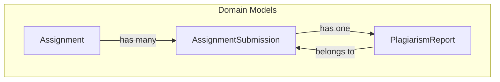
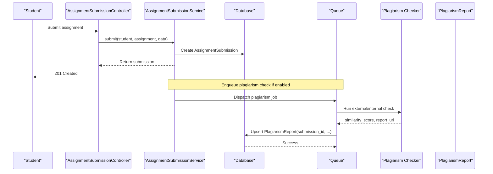
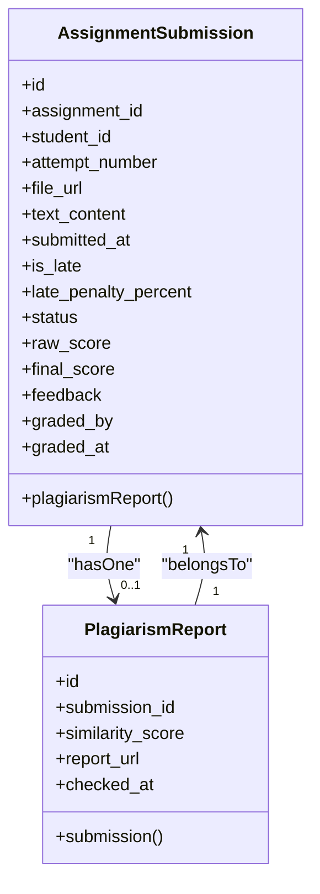
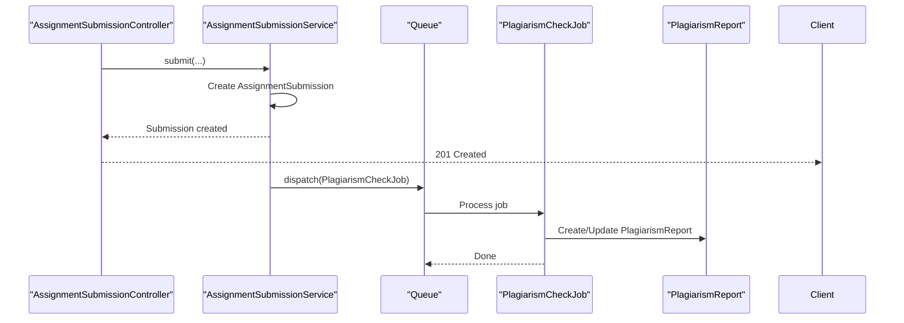
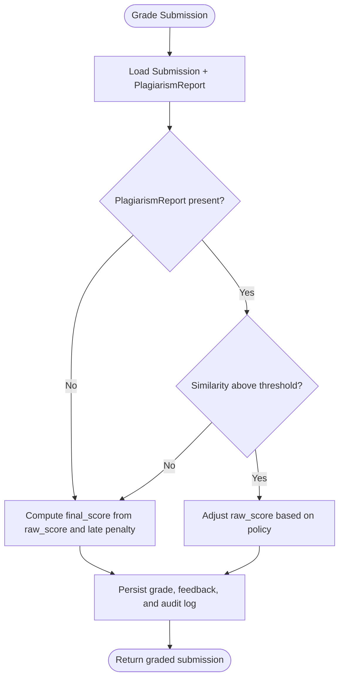
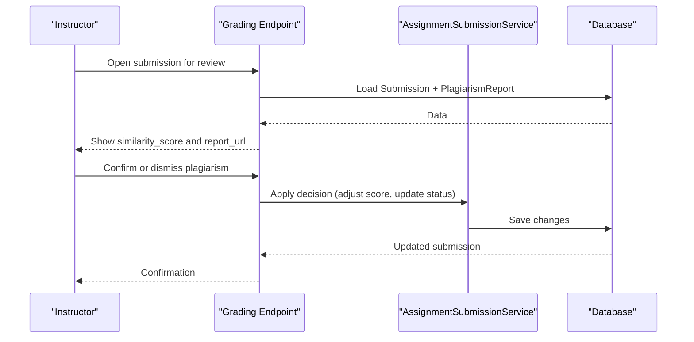
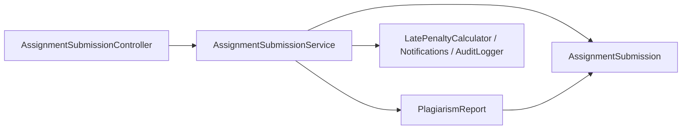

# Plagiarism Detection Integration

<cite>
**Referenced Files in This Document**
- [PlagiarismReport.php](file://app/Models/PlagiarismReport.php)
- [AssignmentSubmission.php](file://app/Models/AssignmentSubmission.php)
- [Assignment.php](file://app/Models/Assignment.php)
- [2024_01_01_000136_create_plagiarism_reports_table.php](file://database/migrations/2024_01_01_000136_create_plagiarism_reports_table.php)
- [2024_01_01_000134_create_assignment_submissions_table.php](file://database/migrations/2024_01_01_000134_create_assignment_submissions_table.php)
- [AssignmentSubmissionController.php](file://app/Http/Controllers/Api/V1/AssignmentSubmissionController.php)
- [AssignmentSubmissionService.php](file://app/Services/Assessment/AssignmentSubmissionService.php)
- [ai-workflow-rules.md](file://.agents/context/ai-workflow-rules.md)
</cite>

## Table of Contents
1. [Introduction](#introduction)
2. [Project Structure](#project-structure)
3. [Core Components](#core-components)
4. [Architecture Overview](#architecture-overview)
5. [Detailed Component Analysis](#detailed-component-analysis)
6. [Dependency Analysis](#dependency-analysis)
7. [Performance Considerations](#performance-considerations)
8. [Troubleshooting Guide](#troubleshooting-guide)
9. [Conclusion](#conclusion)

## Introduction
This document explains how plagiarism detection integrates with assignment submissions in the system. It focuses on the data model for plagiarism reports, its relationship to assignment submissions, and where integration points exist within the submission and grading workflows. It also outlines recommended processes for automated checks triggered by submissions, manual review flows for flagged submissions, and how similarity scores can influence grading decisions.

## Project Structure
The plagiarism feature is centered around:
- A dedicated report model and table that link to a specific assignment submission
- An assignment-level flag to enable or disable plagiarism checks
- Submission and grading services that provide natural hooks for triggering checks and applying score adjustments

**Diagram sources**
- [Assignment.php:14-71](file://app/Models/Assignment.php#L14-L71)
- [AssignmentSubmission.php:15-89](file://app/Models/AssignmentSubmission.php#L15-L89)
- [PlagiarismReport.php:10-33](file://app/Models/PlagiarismReport.php#L10-L33)

**Section sources**
- [Assignment.php:14-71](file://app/Models/Assignment.php#L14-L71)
- [AssignmentSubmission.php:15-89](file://app/Models/AssignmentSubmission.php#L15-L89)
- [PlagiarismReport.php:10-33](file://app/Models/PlagiarismReport.php#L10-L33)

## Core Components
- AssignmentSubmission: Represents a student’s attempt at an assignment, including file/text content, timestamps, status, and scoring fields.
- PlagiarismReport: Stores the result of a plagiarism check for a submission, including similarity score, optional report URL, and timestamp when checked.
- Assignment: Holds configuration such as whether plagiarism checks are enabled for the assignment.

Key relationships:
- Assignment has many AssignmentSubmissions
- AssignmentSubmission has one PlagiarismReport (one-to-one per submission)
- PlagiarismReport belongs to AssignmentSubmission

These models provide the foundation for both automated and manual plagiarism workflows.

**Section sources**
- [AssignmentSubmission.php:15-89](file://app/Models/AssignmentSubmission.php#L15-L89)
- [PlagiarismReport.php:10-33](file://app/Models/PlagiarismReport.php#L10-L33)
- [Assignment.php:14-71](file://app/Models/Assignment.php#L14-L71)

## Architecture Overview
The integration spans three layers:
- Data layer: Eloquent models and database schema define the entities and relationships.
- Service layer: The submission service orchestrates creating submissions and grading them; it is the ideal place to enqueue plagiarism checks and apply score adjustments.
- API layer: Controllers expose endpoints for submitting and grading assignments.

**Diagram sources**
- [AssignmentSubmissionController.php:38-50](file://app/Http/Controllers/Api/V1/AssignmentSubmissionController.php#L38-L50)
- [AssignmentSubmissionService.php:37-67](file://app/Services/Assessment/AssignmentSubmissionService.php#L37-L67)
- [ai-workflow-rules.md:104-117](file://.agents/context/ai-workflow-rules.md#L104-L117)

## Detailed Component Analysis

### Data Model: PlagiarismReport
- Purpose: Records the outcome of a plagiarism check for a single submission.
- Fields:
  - submission_id: Foreign key linking to AssignmentSubmission
  - similarity_score: Numeric similarity percentage (decimal)
  - report_url: Optional link to a detailed report
  - checked_at: Timestamp when the check was performed
- Relationship: Belongs to AssignmentSubmission via submission_id

**Diagram sources**
- [AssignmentSubmission.php:15-89](file://app/Models/AssignmentSubmission.php#L15-L89)
- [PlagiarismReport.php:10-33](file://app/Models/PlagiarismReport.php#L10-L33)

**Section sources**
- [PlagiarismReport.php:10-33](file://app/Models/PlagiarismReport.php#L10-L33)
- [2024_01_01_000136_create_plagiarism_reports_table.php:11-19](file://database/migrations/2024_01_01_000136_create_plagiarism_reports_table.php#L11-L19)

### Data Model: AssignmentSubmission
- Purpose: Captures each student attempt, including file/text content, timing, late penalty, status, and scoring.
- Key fields for plagiarism integration:
  - text_content and file_url: Content to be analyzed
  - status: Can be used to gate manual review states
  - raw_score and final_score: Where plagiarism-related adjustments may be applied

**Section sources**
- [AssignmentSubmission.php:15-89](file://app/Models/AssignmentSubmission.php#L15-L89)
- [2024_01_01_000134_create_assignment_submissions_table.php:11-32](file://database/migrations/2024_01_01_000134_create_assignment_submissions_table.php#L11-L32)

### Assignment Configuration: plagiarism_check_enabled
- The Assignment model includes a boolean flag to enable or disable plagiarism checks per assignment.
- Use this flag to decide whether to trigger automated checks upon submission.

**Section sources**
- [Assignment.php:14-71](file://app/Models/Assignment.php#L14-L71)

### Submission Workflow and Automated Check Trigger
- The controller accepts submissions and delegates to the service.
- The service creates the submission record and returns it.
- Recommended integration point: After successful submission creation, enqueue a background job to run plagiarism checks if the assignment has plagiarism checks enabled.

**Diagram sources**
- [AssignmentSubmissionController.php:38-50](file://app/Http/Controllers/Api/V1/AssignmentSubmissionController.php#L38-L50)
- [AssignmentSubmissionService.php:37-67](file://app/Services/Assessment/AssignmentSubmissionService.php#L37-L67)
- [ai-workflow-rules.md:104-117](file://.agents/context/ai-workflow-rules.md#L104-L117)

**Section sources**
- [AssignmentSubmissionController.php:38-50](file://app/Http/Controllers/Api/V1/AssignmentSubmissionController.php#L38-L50)
- [AssignmentSubmissionService.php:37-67](file://app/Services/Assessment/AssignmentSubmissionService.php#L37-L67)
- [ai-workflow-rules.md:104-117](file://.agents/context/ai-workflow-rules.md#L104-L117)

### Grading Workflow and Score Adjustments
- The grading service computes final_score from raw_score and late penalty.
- To integrate plagiarism into grading:
  - If a PlagiarismReport exists with a high similarity_score, adjust raw_score or final_score according to policy before persisting.
  - Record the rationale in feedback or audit logs to maintain transparency.

[No diagram sources needed since this flow illustrates recommended logic rather than existing code]

### Manual Review Process for Flagged Submissions
- When similarity_score exceeds a configured threshold, mark the submission for manual review:
  - Update submission status to a review state (e.g., pending review) if your workflow requires it.
  - Provide access to the PlagiarismReport details (similarity_score, report_url) for instructors.
  - Instructors can then confirm or dismiss the finding and finalize grading.

[No diagram sources needed since this sequence describes a recommended workflow]

### Example Scenarios
- Automated check after submission:
  - On submit(), enqueue a job to run plagiarism analysis if the assignment has plagiarism checks enabled.
  - On completion, create/update PlagiarismReport with similarity_score and report_url.
- Score adjustment example:
  - If similarity_score >= threshold, reduce raw_score by a policy-defined amount or percentage before computing final_score.
  - Include a note in feedback explaining the adjustment.
- Handling detected plagiarism:
  - If confirmed by instructor, keep the adjusted score and retain the report for auditability.
  - If dismissed, revert any temporary adjustments and leave the original score intact.

[No sources needed since these are illustrative scenarios]

## Dependency Analysis
- AssignmentSubmission depends on Assignment and User (student, grader).
- PlagiarismReport depends on AssignmentSubmission via foreign key.
- Controllers depend on services for business logic.
- Services depend on other services (e.g., late penalty calculation, notifications, audit logging).

**Diagram sources**
- [AssignmentSubmissionController.php:19-57](file://app/Http/Controllers/Api/V1/AssignmentSubmissionController.php#L19-L57)
- [AssignmentSubmissionService.php:24-117](file://app/Services/Assessment/AssignmentSubmissionService.php#L24-L117)
- [AssignmentSubmission.php:15-89](file://app/Models/AssignmentSubmission.php#L15-L89)
- [PlagiarismReport.php:10-33](file://app/Models/PlagiarismReport.php#L10-L33)

**Section sources**
- [AssignmentSubmissionController.php:19-57](file://app/Http/Controllers/Api/V1/AssignmentSubmissionController.php#L19-L57)
- [AssignmentSubmissionService.php:24-117](file://app/Services/Assessment/AssignmentSubmissionService.php#L24-L117)

## Performance Considerations
- Always queue plagiarism checks to avoid blocking request/response cycles.
- Ensure idempotency for queued jobs to handle retries safely.
- Cache or index frequently accessed fields (e.g., submission_id) to speed up queries during grading and review.
- Batch updates when processing multiple submissions to reduce database load.

[No sources needed since this section provides general guidance]

## Troubleshooting Guide
- Missing PlagiarismReport:
  - Verify that the submission exists and that the job ran successfully.
  - Check logs for errors in the plagiarism checker or job queue.
- Incorrect similarity_score:
  - Validate input content (text/file) and ensure the checker received the correct data.
  - Re-run the check if necessary and compare results.
- Grade not updated after confirmation:
  - Confirm that the grading endpoint applies the intended policy and persists changes within a transaction.
  - Inspect audit logs for grade changes and actor information.

[No sources needed since this section provides general guidance]

## Conclusion
The system provides a solid foundation for integrating plagiarism detection with assignment submissions through clear data models and well-defined service boundaries. By enqueuing plagiarism checks after submission and applying policy-driven score adjustments during grading, the platform can support both automated and manual review workflows while maintaining transparency and auditability.