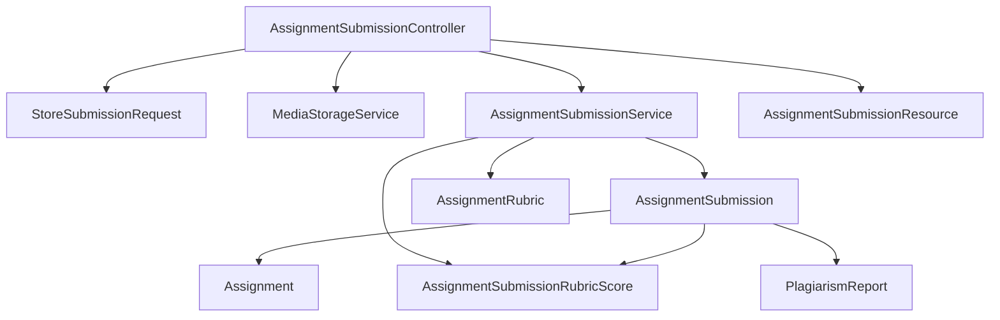
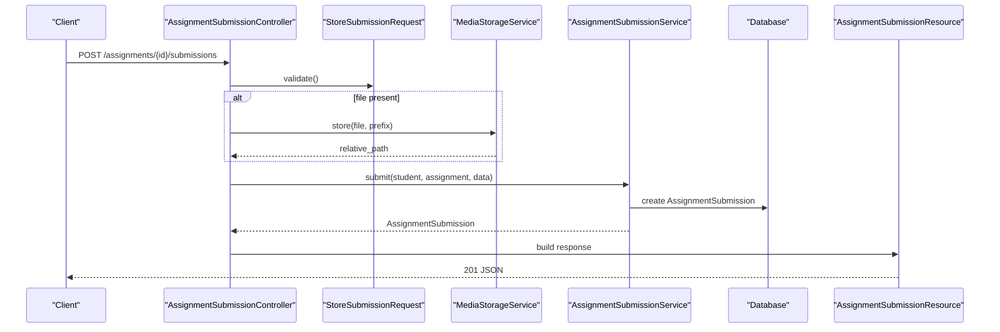
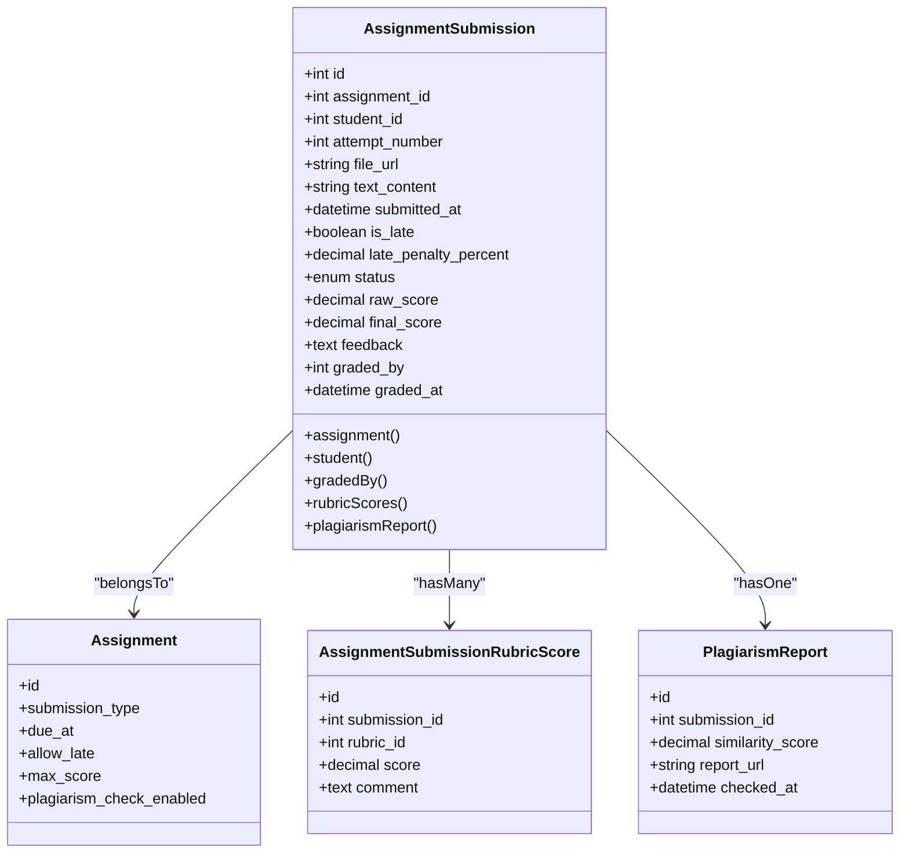
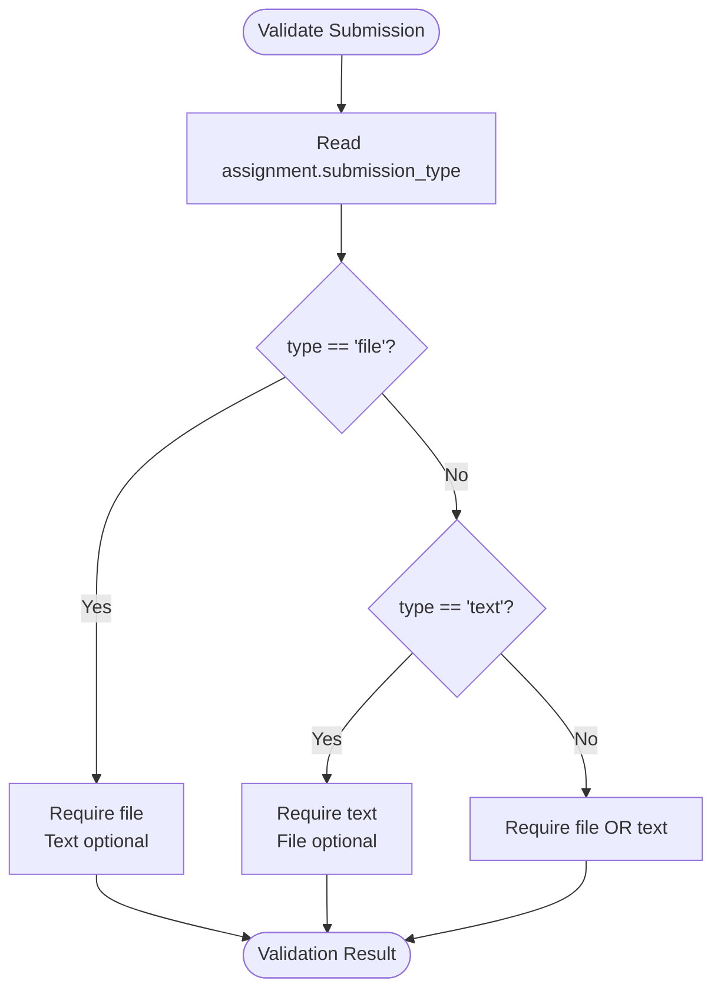
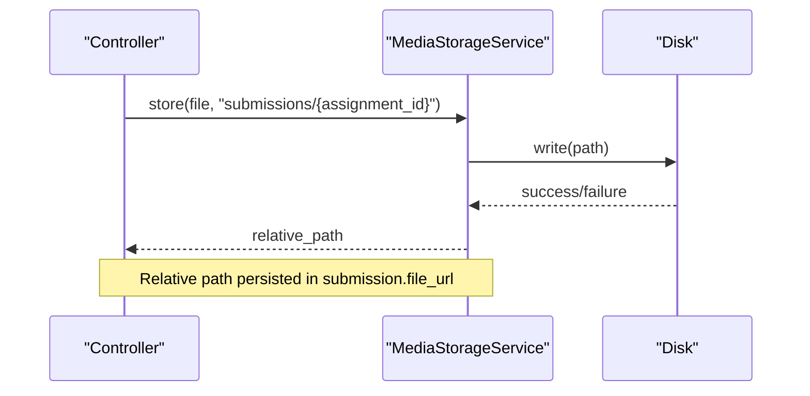
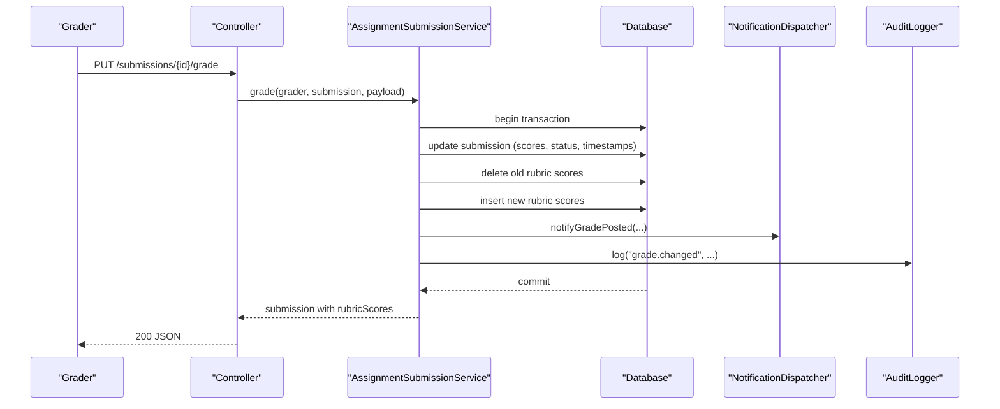
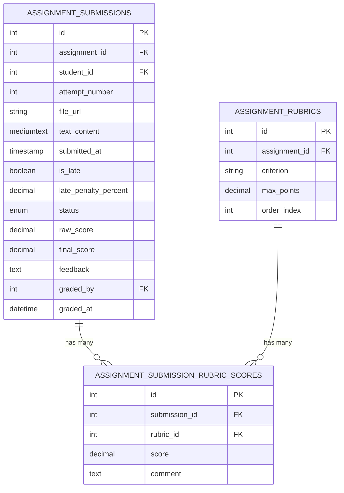
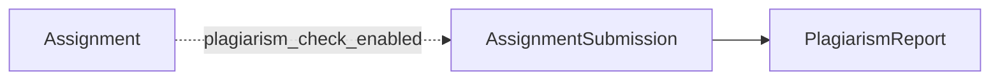
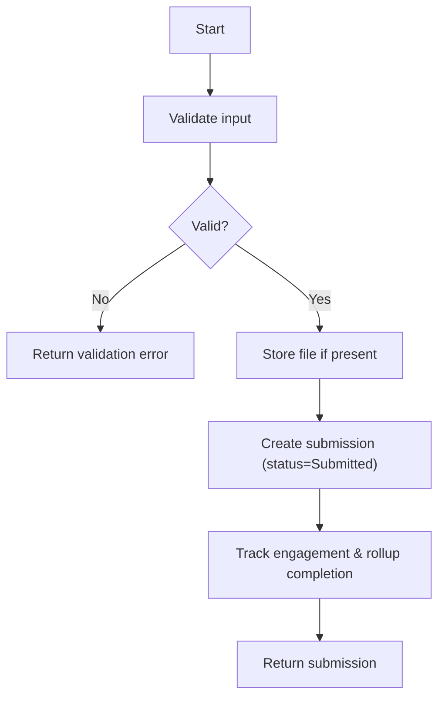
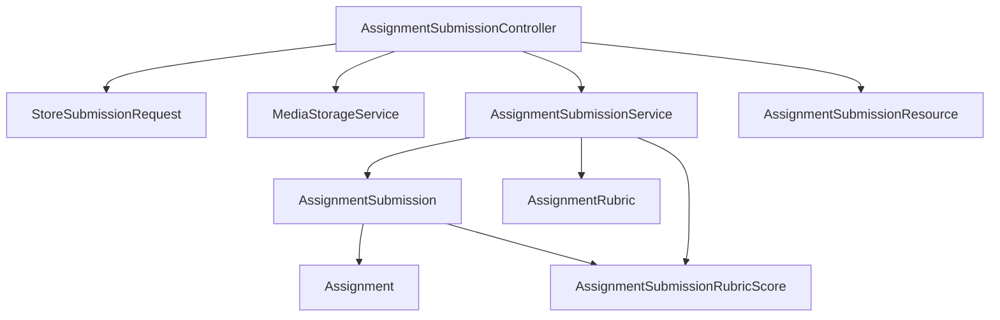

# Student Submissions

<cite>
**Referenced Files in This Document**
- [AssignmentSubmission.php](file://app/Models/AssignmentSubmission.php)
- [AssignmentSubmissionRubricScore.php](file://app/Models/AssignmentSubmissionRubricScore.php)
- [AssignmentRubric.php](file://app/Models/AssignmentRubric.php)
- [PlagiarismReport.php](file://app/Models/PlagiarismReport.php)
- [Assignment.php](file://app/Models/Assignment.php)
- [AssignmentSubmissionType.php](file://app/Enums/AssignmentSubmissionType.php)
- [SubmissionStatus.php](file://app/Enums/SubmissionStatus.php)
- [AssignmentSubmissionService.php](file://app/Services/Assessment/AssignmentSubmissionService.php)
- [AssignmentSubmissionController.php](file://app/Http/Controllers/Api/V1/AssignmentSubmissionController.php)
- [StoreSubmissionRequest.php](file://app/Http/Requests/Api/V1/StoreSubmissionRequest.php)
- [AssignmentSubmissionResource.php](file://app/Http/Resources/AssignmentSubmissionResource.php)
- [AssignmentSubmissionRubricScoreResource.php](file://app/Http/Resources/AssignmentSubmissionRubricScoreResource.php)
- [MediaStorageService.php](file://app/Services/Storage/MediaStorageService.php)
- [2024_01_01_000134_create_assignment_submissions_table.php](file://database/migrations/2024_01_01_000134_create_assignment_submissions_table.php)
- [2024_01_01_000135_create_assignment_submission_rubric_scores_table.php](file://database/migrations/2024_01_01_000135_create_assignment_submission_rubric_scores_table.php)
- [2024_01_01_000132_create_assignments_table.php](file://database/migrations/2024_01_01_000132_create_assignments_table.php)
- [AssignmentSubmissionPolicy.php](file://app/Policies/AssignmentSubmissionPolicy.php)
</cite>

## Table of Contents
1. Introduction
2. Project Structure
3. Core Components
4. Architecture Overview
5. Detailed Component Analysis
6. Dependency Analysis
7. Performance Considerations
8. Troubleshooting Guide
9. Conclusion

## Introduction
This document explains how student assignment submissions are modeled, validated, stored, graded, and reported in the system. It covers the AssignmentSubmission model, submission types (file, text, or both), file storage via a centralized storage service, grading with rubric scores, plagiarism reporting integration points, status tracking, timestamps, versioning through attempts, and end-to-end workflows from submission to grading.

## Project Structure
The submission feature spans models, services, controllers, requests, resources, enums, policies, and database migrations:
- Models define entities and relationships for submissions, rubrics, and plagiarism reports.
- Services encapsulate business logic for submitting and grading.
- Controllers expose API endpoints and orchestrate validation, storage, and service calls.
- Requests enforce input rules based on assignment configuration.
- Resources serialize responses including resolved URLs and nested rubric scores.
- Enums standardize submission type and status values.
- Policies enforce authorization for creating/viewing submissions.
- Migrations define persistent schema for submissions and rubric scores.

**Diagram sources**
- [AssignmentSubmissionController.php](file://app/Http/Controllers/Api/V1/AssignmentSubmissionController.php)
- [StoreSubmissionRequest.php](file://app/Http/Requests/Api/V1/StoreSubmissionRequest.php)
- [MediaStorageService.php](file://app/Services/Storage/MediaStorageService.php)
- [AssignmentSubmissionService.php](file://app/Services/Assessment/AssignmentSubmissionService.php)
- [AssignmentSubmission.php](file://app/Models/AssignmentSubmission.php)
- [Assignment.php](file://app/Models/Assignment.php)
- [AssignmentRubric.php](file://app/Models/AssignmentRubric.php)
- [AssignmentSubmissionRubricScore.php](file://app/Models/AssignmentSubmissionRubricScore.php)
- [PlagiarismReport.php](file://app/Models/PlagiarismReport.php)
- [AssignmentSubmissionResource.php](file://app/Http/Resources/AssignmentSubmissionResource.php)

**Section sources**
- [AssignmentSubmissionController.php](file://app/Http/Controllers/Api/V1/AssignmentSubmissionController.php)
- [StoreSubmissionRequest.php](file://app/Http/Requests/Api/V1/StoreSubmissionRequest.php)
- [MediaStorageService.php](file://app/Services/Storage/MediaStorageService.php)
- [AssignmentSubmissionService.php](file://app/Services/Assessment/AssignmentSubmissionService.php)
- [AssignmentSubmission.php](file://app/Models/AssignmentSubmission.php)
- [Assignment.php](file://app/Models/Assignment.php)
- [AssignmentRubric.php](file://app/Models/AssignmentRubric.php)
- [AssignmentSubmissionRubricScore.php](file://app/Models/AssignmentSubmissionRubricScore.php)
- [PlagiarismReport.php](file://app/Models/PlagiarismReport.php)
- [AssignmentSubmissionResource.php](file://app/Http/Resources/AssignmentSubmissionResource.php)

## Core Components
- AssignmentSubmission model: Represents a single attempt by a student for an assignment, storing file URL or text content, timestamps, late penalty flags, status, scores, feedback, and grader info. It relates to the assignment, student user, graded-by user, rubric scores, and optional plagiarism report.
- AssignmentSubmissionRubricScore model: Stores per-criterion scores and comments linked to a submission and rubric.
- AssignmentRubric model: Defines scoring criteria for an assignment; submissions score against these criteria.
- PlagiarismReport model: Optional report attached to a submission with similarity metrics and report URL.
- Assignment model: Holds assignment metadata including submission type, due date, late policy, max score, and whether plagiarism checks are enabled.
- Enums: AssignmentSubmissionType defines allowed submission modes (file, text, both); SubmissionStatus tracks lifecycle state (submitted, graded).
- MediaStorageService: Centralized upload and URL resolution for files stored on a cloud disk.
- StoreSubmissionRequest: Validates inputs dynamically based on assignment submission_type.
- AssignmentSubmissionResource: Serializes submission data, resolves file URLs, and includes rubric scores when loaded.
- AssignmentSubmissionPolicy: Enforces that only enrolled students can create submissions and controls view permissions.

**Section sources**
- [AssignmentSubmission.php](file://app/Models/AssignmentSubmission.php)
- [AssignmentSubmissionRubricScore.php](file://app/Models/AssignmentSubmissionRubricScore.php)
- [AssignmentRubric.php](file://app/Models/AssignmentRubric.php)
- [PlagiarismReport.php](file://app/Models/PlagiarismReport.php)
- [Assignment.php](file://app/Models/Assignment.php)
- [AssignmentSubmissionType.php](file://app/Enums/AssignmentSubmissionType.php)
- [SubmissionStatus.php](file://app/Enums/SubmissionStatus.php)
- [MediaStorageService.php](file://app/Services/Storage/MediaStorageService.php)
- [StoreSubmissionRequest.php](file://app/Http/Requests/Api/V1/StoreSubmissionRequest.php)
- [AssignmentSubmissionResource.php](file://app/Http/Resources/AssignmentSubmissionResource.php)
- [AssignmentSubmissionPolicy.php](file://app/Policies/AssignmentSubmissionPolicy.php)

## Architecture Overview
End-to-end flows:
- Student submits: controller validates request, stores uploaded file if present, delegates to service to persist submission, track engagement, and update module completion.
- Instructor grades: controller receives grade payload, service applies late penalty to compute final score, persists rubric scores, updates status, notifies student, and logs audit event.
- File storage: all uploads go through a single storage service which writes to a configured disk and returns relative paths; URLs are resolved at read time.
- Rubric scoring: each submission can have multiple criterion-level scores tied to the assignment’s rubric items.
- Plagiarism integration: a one-to-one link exists between submission and plagiarism report; creation is not enforced by the service but can be added by external processes.

**Diagram sources**
- [AssignmentSubmissionController.php](file://app/Http/Controllers/Api/V1/AssignmentSubmissionController.php)
- [StoreSubmissionRequest.php](file://app/Http/Requests/Api/V1/StoreSubmissionRequest.php)
- [MediaStorageService.php](file://app/Services/Storage/MediaStorageService.php)
- [AssignmentSubmissionService.php](file://app/Services/Assessment/AssignmentSubmissionService.php)
- [AssignmentSubmissionResource.php](file://app/Http/Resources/AssignmentSubmissionResource.php)

## Detailed Component Analysis

### AssignmentSubmission Model
- Purpose: Captures a single submission attempt with content (file or text), timing, penalties, status, scores, feedback, and grader context.
- Key fields: assignment_id, student_id, attempt_number, file_url, text_content, submitted_at, is_late, late_penalty_percent, status, raw_score, final_score, feedback, graded_by, graded_at.
- Relationships: belongs to Assignment and User (student, graded_by); has many rubric scores; has one plagiarism report.
- Versioning: attempt_number increments per student per assignment to support resubmissions.
- Status tracking: transitions from Submitted to Graded upon grading.
- Timestamps: submitted_at set on creation; graded_at set on grading.

**Diagram sources**
- [AssignmentSubmission.php](file://app/Models/AssignmentSubmission.php)
- [Assignment.php](file://app/Models/Assignment.php)
- [AssignmentSubmissionRubricScore.php](file://app/Models/AssignmentSubmissionRubricScore.php)
- [PlagiarismReport.php](file://app/Models/PlagiarismReport.php)

**Section sources**
- [AssignmentSubmission.php](file://app/Models/AssignmentSubmission.php)
- [2024_01_01_000134_create_assignment_submissions_table.php](file://database/migrations/2024_01_01_000134_create_assignment_submissions_table.php)

### Submission Types Handling
- Supported types: file, text, both.
- Validation behavior:
  - If type is file: file required, text optional.
  - If type is text: text required, file optional.
  - If type is both: either file or text must be provided (mutual requirement).
- Enforcement: StoreSubmissionRequest reads the assignment’s submission_type and applies conditional rules accordingly.

**Diagram sources**
- [StoreSubmissionRequest.php](file://app/Http/Requests/Api/V1/StoreSubmissionRequest.php)
- [AssignmentSubmissionType.php](file://app/Enums/AssignmentSubmissionType.php)

**Section sources**
- [StoreSubmissionRequest.php](file://app/Http/Requests/Api/V1/StoreSubmissionRequest.php)
- [AssignmentSubmissionType.php](file://app/Enums/AssignmentSubmissionType.php)

### File Storage Mechanisms
- All uploads route through MediaStorageService, which:
  - Stores files to a configured disk under a given prefix and returns a relative path.
  - Provides URL resolution that handles both internal paths and external URLs.
  - Deletes files safely, ignoring nulls and external URLs.
- Controller uses this service to persist uploaded files before creating the submission record.
- Resource layer resolves stored paths to public URLs when serializing responses.

**Diagram sources**
- [AssignmentSubmissionController.php](file://app/Http/Controllers/Api/V1/AssignmentSubmissionController.php)
- [MediaStorageService.php](file://app/Services/Storage/MediaStorageService.php)
- [AssignmentSubmissionResource.php](file://app/Http/Resources/AssignmentSubmissionResource.php)

**Section sources**
- [AssignmentSubmissionController.php](file://app/Http/Controllers/Api/V1/AssignmentSubmissionController.php)
- [MediaStorageService.php](file://app/Services/Storage/MediaStorageService.php)
- [AssignmentSubmissionResource.php](file://app/Http/Resources/AssignmentSubmissionResource.php)

### AssignmentSubmissionService Methods
- submit(student, assignment, data):
  - Computes submission timestamp and determines if late using assignment.due_at.
  - Calculates late penalty percentage via LatePenaltyCalculator.
  - Determines next attempt_number by querying existing submissions for the same assignment and student.
  - Creates AssignmentSubmission with status Submitted and relevant metadata.
  - Tracks engagement and rolls up module completion for the student.
- grade(grader, submission, data):
  - Within a database transaction:
    - Computes final_score by applying late penalty to raw_score.
    - Updates submission fields: raw_score, final_score, feedback, status to Graded, graded_by, graded_at.
    - Replaces rubric scores for the submission with new ones provided in the request.
    - Dispatches notification to the student about the posted grade.
    - Logs an audit event for the grade change.
    - Returns fresh submission with rubric scores.

**Diagram sources**
- [AssignmentSubmissionService.php](file://app/Services/Assessment/AssignmentSubmissionService.php)
- [AssignmentSubmissionController.php](file://app/Http/Controllers/Api/V1/AssignmentSubmissionController.php)

**Section sources**
- [AssignmentSubmissionService.php](file://app/Services/Assessment/AssignmentSubmissionService.php)

### Relationship Between Submissions and Rubric Scores
- Each submission can have multiple rubric scores, one per rubric criterion defined for the assignment.
- The unique constraint on (submission_id, rubric_id) ensures one score per criterion per submission.
- During grading, previous rubric scores are deleted and replaced with the new set, ensuring consistency.

**Diagram sources**
- [2024_01_01_000134_create_assignment_submissions_table.php](file://database/migrations/2024_01_01_000134_create_assignment_submissions_table.php)
- [2024_01_01_000135_create_assignment_submission_rubric_scores_table.php](file://database/migrations/2024_01_01_000135_create_assignment_submission_rubric_scores_table.php)
- [AssignmentSubmissionRubricScore.php](file://app/Models/AssignmentSubmissionRubricScore.php)
- [AssignmentRubric.php](file://app/Models/AssignmentRubric.php)

**Section sources**
- [2024_01_01_000135_create_assignment_submission_rubric_scores_table.php](file://database/migrations/2024_01_01_000135_create_assignment_submission_rubric_scores_table.php)
- [AssignmentSubmissionRubricScore.php](file://app/Models/AssignmentSubmissionRubricScore.php)
- [AssignmentRubric.php](file://app/Models/AssignmentRubric.php)

### Integration With Plagiarism Detection Systems
- The system provides a PlagiarismReport model linked to a submission with fields for similarity_score, report_url, and checked_at.
- No automatic check is triggered by the service; integration points exist to attach a report after an external plagiarism scan completes.
- The assignment model includes a flag to enable/disable plagiarism checks, allowing configuration per assignment.

**Diagram sources**
- [PlagiarismReport.php](file://app/Models/PlagiarismReport.php)
- [Assignment.php](file://app/Models/Assignment.php)

**Section sources**
- [PlagiarismReport.php](file://app/Models/PlagiarismReport.php)
- [Assignment.php](file://app/Models/Assignment.php)

### Submission Workflows and Error Handling
- Submission workflow:
  - Validate request based on assignment submission_type.
  - Store file if present; capture relative path.
  - Create submission with computed late penalty and initial status Submitted.
  - Track engagement and update module completion.
- Grading workflow:
  - Compute final score with late penalty applied.
  - Persist rubric scores and update status to Graded.
  - Notify student and log audit event.
- Error handling:
  - Input validation errors returned by framework for invalid payloads.
  - Storage failures raise runtime exceptions during file upload.
  - Policy enforcement prevents unauthorized submissions or views.

**Diagram sources**
- [StoreSubmissionRequest.php](file://app/Http/Requests/Api/V1/StoreSubmissionRequest.php)
- [AssignmentSubmissionController.php](file://app/Http/Controllers/Api/V1/AssignmentSubmissionController.php)
- [AssignmentSubmissionService.php](file://app/Services/Assessment/AssignmentSubmissionService.php)
- [MediaStorageService.php](file://app/Services/Storage/MediaStorageService.php)

**Section sources**
- [StoreSubmissionRequest.php](file://app/Http/Requests/Api/V1/StoreSubmissionRequest.php)
- [AssignmentSubmissionController.php](file://app/Http/Controllers/Api/V1/AssignmentSubmissionController.php)
- [AssignmentSubmissionService.php](file://app/Services/Assessment/AssignmentSubmissionService.php)
- [MediaStorageService.php](file://app/Services/Storage/MediaStorageService.php)
- [AssignmentSubmissionPolicy.php](file://app/Policies/AssignmentSubmissionPolicy.php)

## Dependency Analysis
Key dependencies and coupling:
- Controller depends on Request, Storage, Service, and Resource layers.
- Service depends on domain models and auxiliary services (late penalty calculator, progress engine, notifications, engagement tracker, audit logger).
- Models depend on enums and related models for relationships.
- Resources depend on storage service for URL resolution.

**Diagram sources**
- [AssignmentSubmissionController.php](file://app/Http/Controllers/Api/V1/AssignmentSubmissionController.php)
- [StoreSubmissionRequest.php](file://app/Http/Requests/Api/V1/StoreSubmissionRequest.php)
- [MediaStorageService.php](file://app/Services/Storage/MediaStorageService.php)
- [AssignmentSubmissionService.php](file://app/Services/Assessment/AssignmentSubmissionService.php)
- [AssignmentSubmission.php](file://app/Models/AssignmentSubmission.php)
- [Assignment.php](file://app/Models/Assignment.php)
- [AssignmentRubric.php](file://app/Models/AssignmentRubric.php)
- [AssignmentSubmissionRubricScore.php](file://app/Models/AssignmentSubmissionRubricScore.php)
- [AssignmentSubmissionResource.php](file://app/Http/Resources/AssignmentSubmissionResource.php)

**Section sources**
- [AssignmentSubmissionController.php](file://app/Http/Controllers/Api/V1/AssignmentSubmissionController.php)
- [AssignmentSubmissionService.php](file://app/Services/Assessment/AssignmentSubmissionService.php)
- [AssignmentSubmission.php](file://app/Models/AssignmentSubmission.php)
- [AssignmentSubmissionResource.php](file://app/Http/Resources/AssignmentSubmissionResource.php)

## Performance Considerations
- Use eager loading for related data when listing submissions to avoid N+1 queries (e.g., load student and rubricScores).
- Pagination is already applied when listing submissions to limit payload size.
- Database transactions ensure atomicity during grading operations.
- Avoid unnecessary recalculations by relying on stored late_penalty_percent and final_score.
- Centralized storage service reduces duplication and simplifies URL resolution overhead.

[No sources needed since this section provides general guidance]

## Troubleshooting Guide
Common issues and resolutions:
- Invalid submission payload:
  - Ensure file/text requirements match assignment submission_type.
  - Check maximum file size constraints and content type.
- File upload failures:
  - Verify storage disk configuration and credentials.
  - Inspect runtime exceptions thrown by storage service.
- Unauthorized access:
  - Confirm student enrollment status and role-based policies.
- Missing rubric scores:
  - Ensure rubric scores are provided for all criteria during grading.
  - Check unique constraint violations on (submission_id, rubric_id).
- Plagiarism reports not appearing:
  - Confirm that a report is created and linked to the submission after scanning.

**Section sources**
- [StoreSubmissionRequest.php](file://app/Http/Requests/Api/V1/StoreSubmissionRequest.php)
- [MediaStorageService.php](file://app/Services/Storage/MediaStorageService.php)
- [AssignmentSubmissionPolicy.php](file://app/Policies/AssignmentSubmissionPolicy.php)
- [2024_01_01_000135_create_assignment_submission_rubric_scores_table.php](file://database/migrations/2024_01_01_000135_create_assignment_submission_rubric_scores_table.php)
- [PlagiarismReport.php](file://app/Models/PlagiarismReport.php)

## Conclusion
The submission system provides a robust, extensible foundation for collecting and evaluating student work across different formats. It enforces validation based on assignment configuration, centralizes file storage, supports versioned attempts, computes late penalties, records detailed rubric-based scores, and integrates with plagiarism reporting. Clear separation of concerns across controllers, services, models, and resources ensures maintainability and scalability.

[No sources needed since this section summarizes without analyzing specific files]