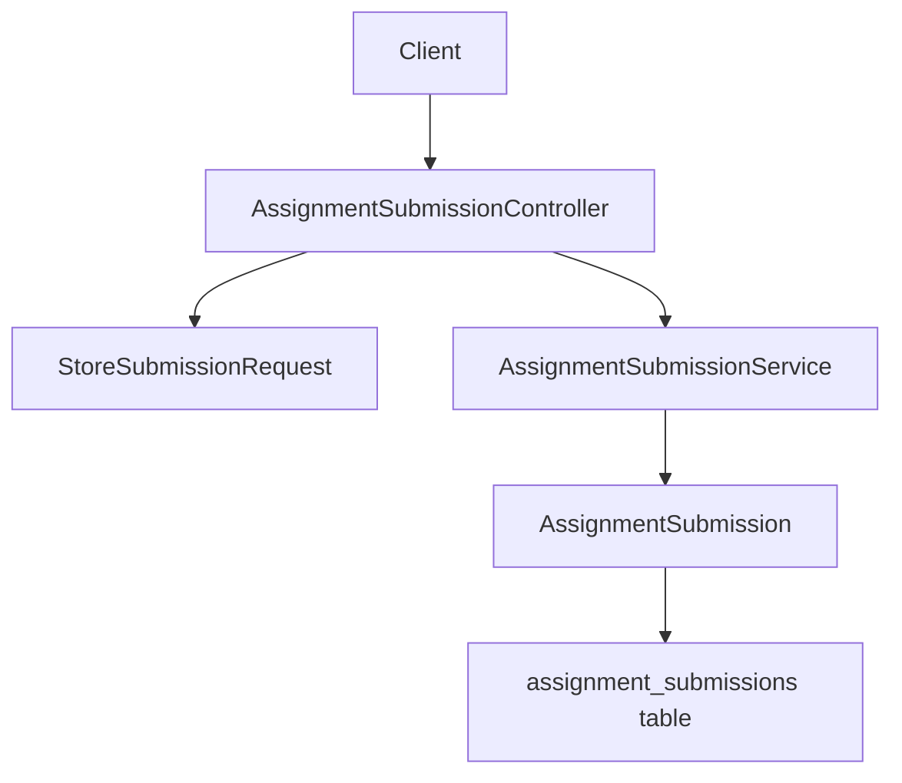
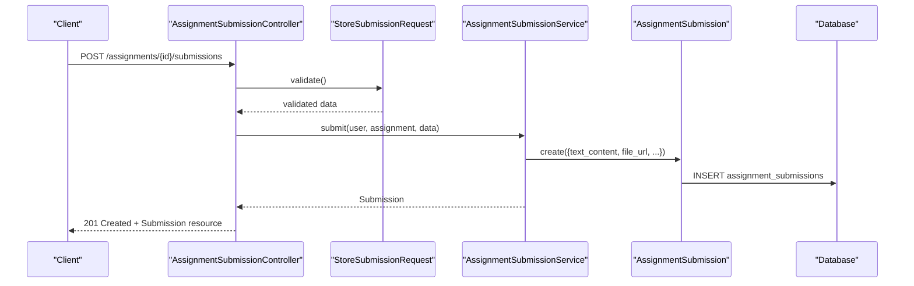
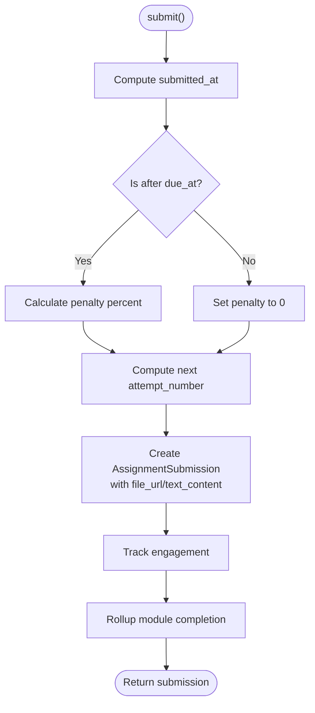
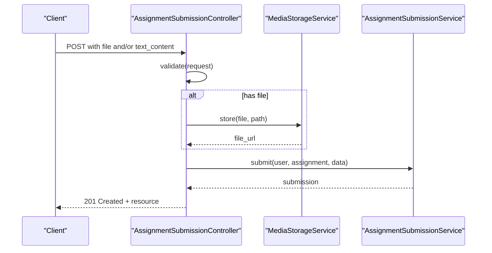
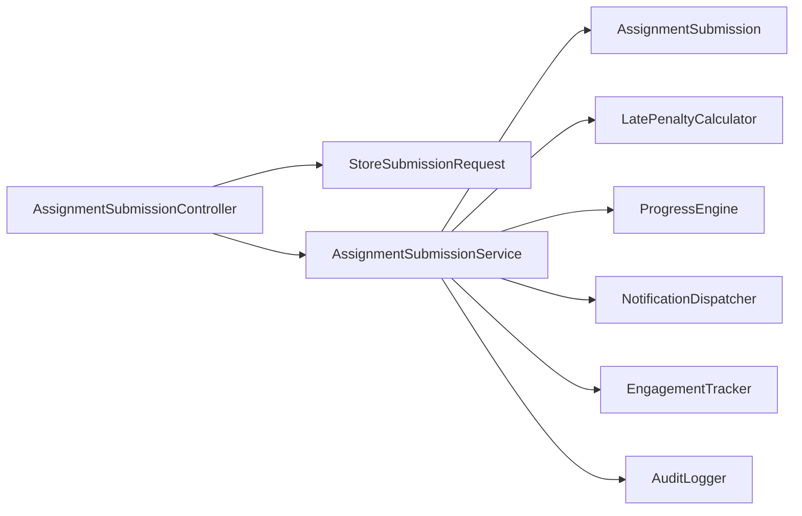

# Text and URL Submissions

<cite>
**Referenced Files in This Document**
- [AssignmentSubmission.php](file://app/Models/AssignmentSubmission.php)
- [AssignmentSubmissionType.php](file://app/Enums/AssignmentSubmissionType.php)
- [AssignmentSubmissionController.php](file://app/Http/Controllers/Api/V1/AssignmentSubmissionController.php)
- [StoreSubmissionRequest.php](file://app/Http/Requests/Api/V1/StoreSubmissionRequest.php)
- [AssignmentSubmissionService.php](file://app/Services/Assessment/AssignmentSubmissionService.php)
- [Assignment.php](file://app/Models/Assignment.php)
- [2024_01_01_000134_create_assignment_submissions_table.php](file://database/migrations/2024_01_01_000134_create_assignment_submissions_table.php)
- [AssignmentSubmissionTest.php](file://tests/Feature/Assessment/AssignmentSubmissionTest.php)
</cite>

## Table of Contents
1. [Introduction](#introduction)
2. [Project Structure](#project-structure)
3. [Core Components](#core-components)
4. [Architecture Overview](#architecture-overview)
5. [Detailed Component Analysis](#detailed-component-analysis)
6. [Dependency Analysis](#dependency-analysis)
7. [Performance Considerations](#performance-considerations)
8. [Troubleshooting Guide](#troubleshooting-guide)
9. [Conclusion](#conclusion)

## Introduction
This document explains how text and URL-based assignment submissions are handled in the system, focusing on the AssignmentSubmission model’s text_content field for inline responses and how URLs can be embedded within that content. It details validation rules by submission type, character limits, sanitization behavior, and processing workflows from request to persistence and grading.

## Project Structure
The submission flow spans a controller, a request validator, a service, and an Eloquent model backed by a database migration. The assignment defines which content types are allowed (file, text, or both), and the request layer enforces those constraints at runtime.

**Diagram sources**
- [AssignmentSubmissionController.php:21-50](file://app/Http/Controllers/Api/V1/AssignmentSubmissionController.php#L21-L50)
- [StoreSubmissionRequest.php:19-36](file://app/Http/Requests/Api/V1/StoreSubmissionRequest.php#L19-L36)
- [AssignmentSubmissionService.php:37-67](file://app/Services/Assessment/AssignmentSubmissionService.php#L37-L67)
- [AssignmentSubmission.php:22-47](file://app/Models/AssignmentSubmission.php#L22-L47)
- [2024_01_01_000134_create_assignment_submissions_table.php:13-32](file://database/migrations/2024_01_01_000134_create_assignment_submissions_table.php#L13-L32)

**Section sources**
- [AssignmentSubmissionController.php:21-50](file://app/Http/Controllers/Api/V1/AssignmentSubmissionController.php#L21-L50)
- [StoreSubmissionRequest.php:19-36](file://app/Http/Requests/Api/V1/StoreSubmissionRequest.php#L19-L36)
- [AssignmentSubmissionService.php:37-67](file://app/Services/Assessment/AssignmentSubmissionService.php#L37-L67)
- [AssignmentSubmission.php:22-47](file://app/Models/AssignmentSubmission.php#L22-L47)
- [2024_01_01_000134_create_assignment_submissions_table.php:13-32](file://database/migrations/2024_01_01_000134_create_assignment_submissions_table.php#L13-L32)

## Core Components
- AssignmentSubmission model: stores file_url and text_content along with submission metadata such as timestamps, status, scores, and feedback.
- AssignmentSubmissionType enum: defines allowed submission modes per assignment (file, text, both).
- StoreSubmissionRequest: validates incoming submissions based on the assignment’s configured submission_type.
- AssignmentSubmissionService: persists submissions, computes late penalties, updates progress, and handles grading.
- Database schema: mediumText for text_content and string for file_url with length constraints.

Key responsibilities:
- Enforce required fields depending on assignment configuration.
- Persist text_content and file_url safely.
- Track engagement and module completion upon submission.
- Apply late penalty logic during grading.

**Section sources**
- [AssignmentSubmission.php:22-47](file://app/Models/AssignmentSubmission.php#L22-L47)
- [AssignmentSubmissionType.php:7-12](file://app/Enums/AssignmentSubmissionType.php#L7-L12)
- [StoreSubmissionRequest.php:19-36](file://app/Http/Requests/Api/V1/StoreSubmissionRequest.php#L19-L36)
- [AssignmentSubmissionService.php:37-67](file://app/Services/Assessment/AssignmentSubmissionService.php#L37-L67)
- [2024_01_01_000134_create_assignment_submissions_table.php:13-32](file://database/migrations/2024_01_01_000134_create_assignment_submissions_table.php#L13-L32)

## Architecture Overview
The submission lifecycle is driven by the API controller, validated by the request class, processed by the service, and persisted via the model.

**Diagram sources**
- [AssignmentSubmissionController.php:38-50](file://app/Http/Controllers/Api/V1/AssignmentSubmissionController.php#L38-L50)
- [StoreSubmissionRequest.php:19-36](file://app/Http/Requests/Api/V1/StoreSubmissionRequest.php#L19-L36)
- [AssignmentSubmissionService.php:37-67](file://app/Services/Assessment/AssignmentSubmissionService.php#L37-L67)
- [AssignmentSubmission.php:50-60](file://app/Models/AssignmentSubmission.php#L50-L60)

## Detailed Component Analysis

### AssignmentSubmission Model
- Stores both file_url and text_content; either can be used depending on assignment configuration.
- Uses casts for dates, booleans, decimals, and status enum.
- Relationships link to Assignment, User (student and grader), rubric scores, and optional plagiarism report.

Validation and storage notes:
- text_content is stored as mediumText, allowing large inline responses.
- file_url is a string with a maximum length constraint.

**Section sources**
- [AssignmentSubmission.php:22-47](file://app/Models/AssignmentSubmission.php#L22-L47)
- [2024_01_01_000134_create_assignment_submissions_table.php:13-32](file://database/migrations/2024_01_01_000134_create_assignment_submissions_table.php#L13-L32)

### AssignmentSubmissionType Enum
- Defines three modes:
  - File: only file uploads allowed.
  - Text: only inline text allowed.
  - Both: either file or text required (mutually exclusive requirement).

This enum drives validation in the request layer.

**Section sources**
- [AssignmentSubmissionType.php:7-12](file://app/Enums/AssignmentSubmissionType.php#L7-L12)

### StoreSubmissionRequest Validation Rules
- Validates presence of file or text_content based on assignment submission_type:
  - File-only: file required, text_content nullable.
  - Text-only: text_content required, file nullable.
  - Both: requires at least one of file or text_content.
- File size limit enforced via max rule.
- text_content must be a string when present.

These rules ensure assignments accept only permitted content types and sizes.

**Section sources**
- [StoreSubmissionRequest.php:19-36](file://app/Http/Requests/Api/V1/StoreSubmissionRequest.php#L19-L36)

### AssignmentSubmissionService Processing Logic
- Computes submission timestamp, determines if late, calculates penalty percentage using policy.
- Increments attempt_number per student per assignment.
- Persists submission with file_url and/or text_content.
- Tracks engagement and rolls up module completion immediately upon submission.
- Grading path applies late penalty to final score and records rubric scores and feedback.

**Diagram sources**
- [AssignmentSubmissionService.php:37-67](file://app/Services/Assessment/AssignmentSubmissionService.php#L37-L67)

**Section sources**
- [AssignmentSubmissionService.php:37-67](file://app/Services/Assessment/AssignmentSubmissionService.php#L37-L67)

### Controller Flow and File Handling
- Accepts validated payload, removes raw file from data array.
- If a file is provided, stores it via MediaStorageService and sets file_url.
- Delegates creation to the service and returns a resource response.

**Diagram sources**
- [AssignmentSubmissionController.php:38-50](file://app/Http/Controllers/Api/V1/AssignmentSubmissionController.php#L38-L50)

**Section sources**
- [AssignmentSubmissionController.php:38-50](file://app/Http/Controllers/Api/V1/AssignmentSubmissionController.php#L38-L50)

### Data Schema and Limits
- text_content: mediumText column, suitable for large inline answers.
- file_url: string with a fixed maximum length.
- Status defaults to submitted; graded transitions occur later.

These constraints define capacity and storage characteristics for submissions.

**Section sources**
- [2024_01_01_000134_create_assignment_submissions_table.php:13-32](file://database/migrations/2024_01_01_000134_create_assignment_submissions_table.php#L13-L32)

### Relationship Between Assignment Types and Workflows
- AssignmentSubmissionType controls which fields are required at the request layer.
- The service treats text_content and file_url symmetrically for persistence; the difference lies in validation and client expectations.
- Tests demonstrate text-only submissions and file-only submissions working according to assignment configuration.

**Section sources**
- [Assignment.php:19-37](file://app/Models/Assignment.php#L19-L37)
- [StoreSubmissionRequest.php:19-36](file://app/Http/Requests/Api/V1/StoreSubmissionRequest.php#L19-L36)
- [AssignmentSubmissionTest.php:62-128](file://tests/Feature/Assessment/AssignmentSubmissionTest.php#L62-L128)

## Dependency Analysis
- Controller depends on StoreSubmissionRequest for validation and on AssignmentSubmissionService for business logic.
- Service depends on late penalty calculation, progress engine, notification dispatcher, engagement tracker, and audit logger.
- Model depends on enums and relationships to other domain entities.

**Diagram sources**
- [AssignmentSubmissionController.php:21-24](file://app/Http/Controllers/Api/V1/AssignmentSubmissionController.php#L21-L24)
- [AssignmentSubmissionService.php:26-32](file://app/Services/Assessment/AssignmentSubmissionService.php#L26-L32)

**Section sources**
- [AssignmentSubmissionController.php:21-24](file://app/Http/Controllers/Api/V1/AssignmentSubmissionController.php#L21-L24)
- [AssignmentSubmissionService.php:26-32](file://app/Services/Assessment/AssignmentSubmissionService.php#L26-L32)

## Performance Considerations
- text_content uses mediumText; very large payloads may increase storage and query costs. Ensure client-side limits align with server-side capabilities.
- File uploads are stored externally and referenced by URL; keep file size within the configured limit to avoid overhead.
- Module completion rollup occurs on every submission; consider batching or caching strategies if high-frequency submissions are expected.

[No sources needed since this section provides general guidance]

## Troubleshooting Guide
Common issues and resolutions:
- Validation errors for missing content:
  - If assignment is text-only, text_content is required.
  - If assignment is file-only, file is required.
  - If assignment allows both, at least one of file or text_content must be present.
- Unexpected empty text_content:
  - Ensure the client sends text_content as a string when required.
- Large text payloads:
  - Verify that the mediumText column can accommodate the size; monitor storage usage.
- Late penalty not applied:
  - Confirm assignment due_at and late penalty policy are set; check service logic for penalty calculation.

Evidence from tests:
- Text-only submission creates a submission and completes the module.
- File-only submission uploads to storage and returns a full URL.
- Unauthorized students are denied access.

**Section sources**
- [StoreSubmissionRequest.php:19-36](file://app/Http/Requests/Api/V1/StoreSubmissionRequest.php#L19-L36)
- [AssignmentSubmissionTest.php:62-143](file://tests/Feature/Assessment/AssignmentSubmissionTest.php#L62-L143)

## Conclusion
The system supports flexible assignment submissions through text_content and file_url, governed by assignment-level configuration. Validation ensures only permitted content types are accepted, while the service standardizes persistence, timing, and scoring workflows. For URL embedding, include URLs directly within text_content; no separate URL-specific field exists for submissions. When building clients, respect the assignment’s submission_type and send either text_content or file as required.