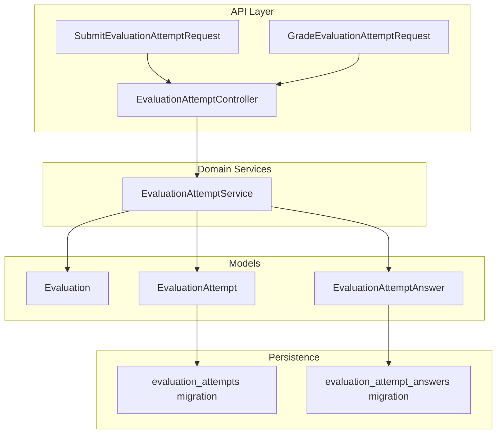
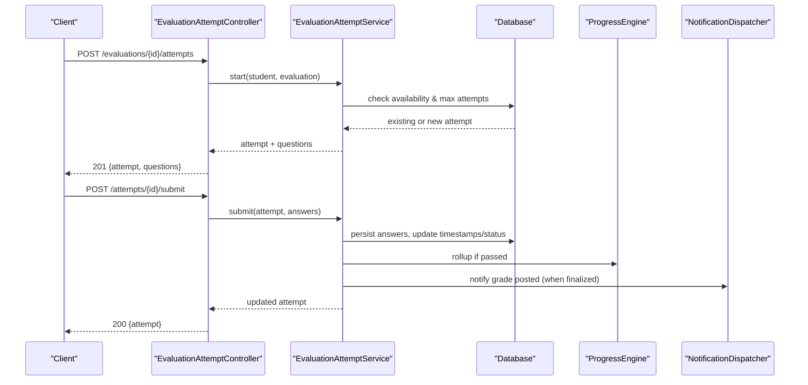
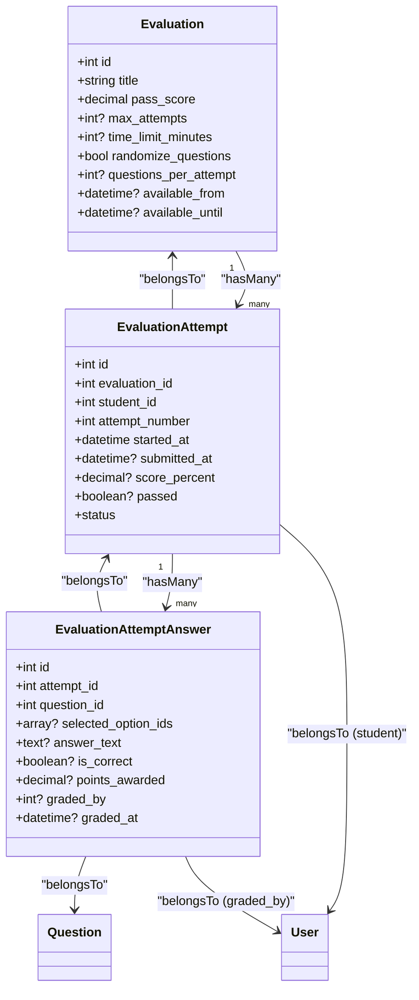
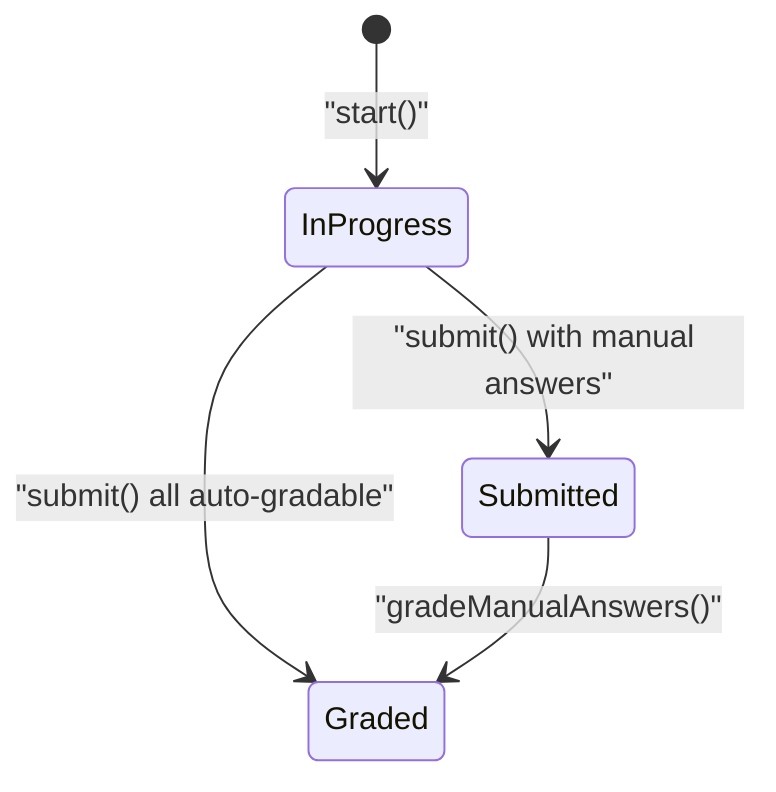
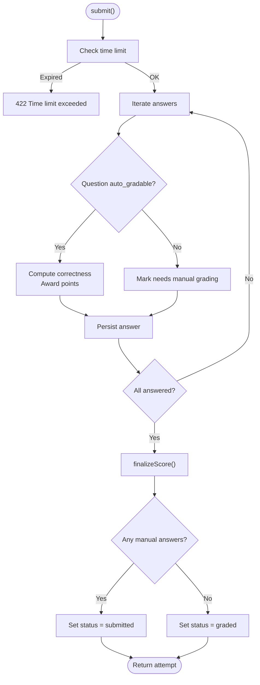
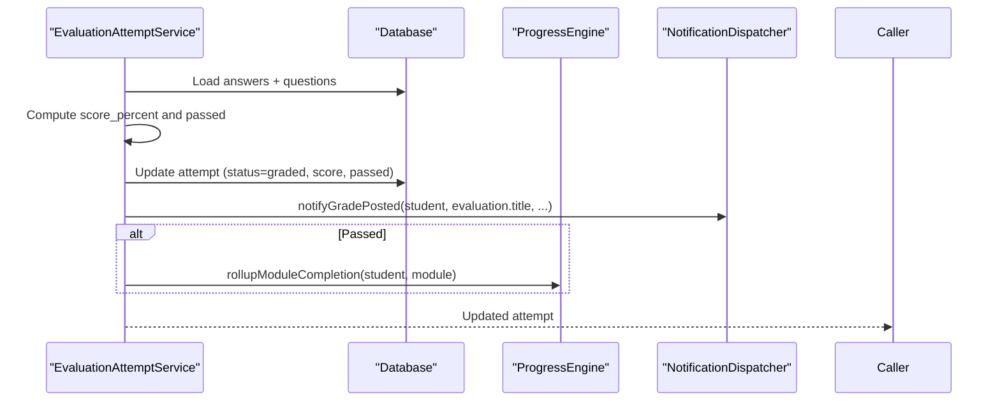
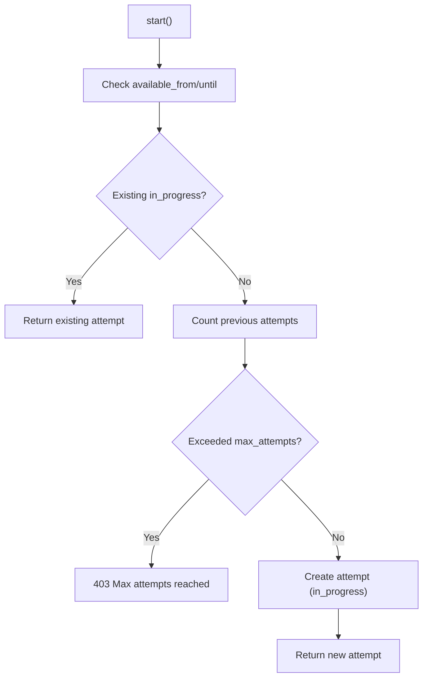
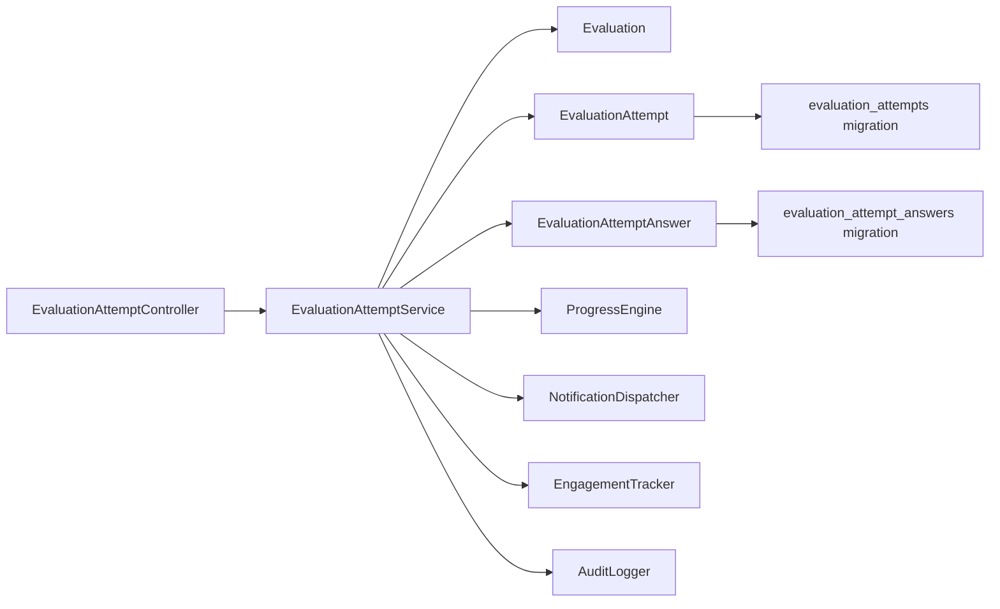

# Attempt Management & Tracking

<cite>
**Referenced Files in This Document**
- [EvaluationAttempt.php](file://app/Models/EvaluationAttempt.php)
- [EvaluationAttemptAnswer.php](file://app/Models/EvaluationAttemptAnswer.php)
- [Evaluation.php](file://app/Models/Evaluation.php)
- [EvaluationAttemptStatus.php](file://app/Enums/EvaluationAttemptStatus.php)
- [EvaluationAttemptController.php](file://app/Http/Controllers/Api/V1/EvaluationAttemptController.php)
- [EvaluationAttemptService.php](file://app/Services/Assessment/EvaluationAttemptService.php)
- [SubmitEvaluationAttemptRequest.php](file://app/Http/Requests/Api/V1/SubmitEvaluationAttemptRequest.php)
- [GradeEvaluationAttemptRequest.php](file://app/Http/Requests/Api/V1/GradeEvaluationAttemptRequest.php)
- [EvaluationAttemptPolicy.php](file://app/Policies/EvaluationAttemptPolicy.php)
- [EvaluationAttemptResource.php](file://app/Http/Resources/EvaluationAttemptResource.php)
- [EvaluationAttemptAnswerResource.php](file://app/Http/Resources/EvaluationAttemptAnswerResource.php)
- [2024_01_01_000145_create_evaluation_attempts_table.php](file://database/migrations/2024_01_01_000145_create_evaluation_attempts_table.php)
- [2024_01_01_000146_create_evaluation_attempt_answers_table.php](file://database/migrations/2024_01_01_000146_create_evaluation_attempt_answers_table.php)
- [EvaluationAttemptTest.php](file://tests/Feature/Assessment/EvaluationAttemptTest.php)
</cite>

## Table of Contents
1. Introduction
2. Project Structure
3. Core Components
4. Architecture Overview
5. Detailed Component Analysis
6. Dependency Analysis
7. Performance Considerations
8. Troubleshooting Guide
9. Conclusion

## Introduction
This document explains how evaluation attempts are created, tracked, submitted, graded, and completed. It covers the EvaluationAttempt model, its relationship with answers, state transitions, time limits, attempt restrictions, and progress rollup to module completion. It also provides practical examples for attempting evaluations, handling multiple attempts, enforcing time limits, and managing attempt restrictions.

## Project Structure
The evaluation attempt feature spans models, services, controllers, requests, policies, resources, and database migrations:
- Models define entities and relationships (attempts, answers, evaluation).
- The service encapsulates business logic for starting, submitting, grading, and finalizing attempts.
- The controller exposes API endpoints and delegates to the service.
- Requests validate inputs for submission and grading.
- Policies enforce access control for viewing and grading attempts.
- Resources shape JSON responses for clients.
- Migrations define persistent storage for attempts and answers.

**Diagram sources**
- [EvaluationAttemptController.php:23-82](file://app/Http/Controllers/Api/V1/EvaluationAttemptController.php#L23-L82)
- [EvaluationAttemptService.php:35-206](file://app/Services/Assessment/EvaluationAttemptService.php#L35-L206)
- [Evaluation.php:19-61](file://app/Models/Evaluation.php#L19-L61)
- [EvaluationAttempt.php:21-62](file://app/Models/EvaluationAttempt.php#L21-L62)
- [EvaluationAttemptAnswer.php:14-54](file://app/Models/EvaluationAttemptAnswer.php#L14-L54)
- [2024_01_01_000145_create_evaluation_attempts_table.php:13-24](file://database/migrations/2024_01_01_000145_create_evaluation_attempts_table.php#L13-L24)
- [2024_01_01_000146_create_evaluation_attempt_answers_table.php:13-23](file://database/migrations/2024_01_01_000146_create_evaluation_attempt_answers_table.php#L13-L23)

**Section sources**
- [EvaluationAttemptController.php:23-82](file://app/Http/Controllers/Api/V1/EvaluationAttemptController.php#L23-L82)
- [EvaluationAttemptService.php:35-206](file://app/Services/Assessment/EvaluationAttemptService.php#L35-L206)
- [Evaluation.php:19-61](file://app/Models/Evaluation.php#L19-L61)
- [EvaluationAttempt.php:21-62](file://app/Models/EvaluationAttempt.php#L21-L62)
- [EvaluationAttemptAnswer.php:14-54](file://app/Models/EvaluationAttemptAnswer.php#L14-L54)
- [2024_01_01_000145_create_evaluation_attempts_table.php:13-24](file://database/migrations/2024_01_01_000145_create_evaluation_attempts_table.php#L13-L24)
- [2024_01_01_000146_create_evaluation_attempt_answers_table.php:13-23](file://database/migrations/2024_01_01_000146_create_evaluation_attempt_answers_table.php#L13-L23)

## Core Components
- EvaluationAttempt: Represents a student’s attempt on an evaluation with lifecycle fields (started_at, submitted_at), scoring (score_percent, passed), and status.
- EvaluationAttemptAnswer: Records per-question answers, correctness, points awarded, and manual grading metadata.
- EvaluationAttemptStatus: Enumerates states in_progress, submitted, graded.
- EvaluationAttemptService: Orchestrates start, question selection, submit, manual grading, score finalization, notifications, and progress rollup.
- EvaluationAttemptController: Exposes REST endpoints for listing, starting, viewing, submitting, and grading attempts.
- Request validators: Ensure safe and correct payloads for submission and grading.
- Policy: Controls who can view or grade attempts.
- Resources: Shape JSON responses for attempts and answers.

Key responsibilities:
- Start: Validate availability windows, enforce max attempts, resume existing in-progress attempts, create new attempt with status in_progress.
- Submit: Enforce time limit, persist answers, auto-grade objective questions, queue manual grading when needed, finalize scores when fully graded.
- Grade: Update manual answer grades, finalize score, notify student, and roll up module completion if passed.

**Section sources**
- [EvaluationAttempt.php:21-62](file://app/Models/EvaluationAttempt.php#L21-L62)
- [EvaluationAttemptAnswer.php:14-54](file://app/Models/EvaluationAttemptAnswer.php#L14-L54)
- [EvaluationAttemptStatus.php:7-12](file://app/Enums/EvaluationAttemptStatus.php#L7-L12)
- [EvaluationAttemptService.php:35-206](file://app/Services/Assessment/EvaluationAttemptService.php#L35-L206)
- [EvaluationAttemptController.php:23-82](file://app/Http/Controllers/Api/V1/EvaluationAttemptController.php#L23-L82)
- [SubmitEvaluationAttemptRequest.php:21-29](file://app/Http/Requests/Api/V1/SubmitEvaluationAttemptRequest.php#L21-L29)
- [GradeEvaluationAttemptRequest.php:21-28](file://app/Http/Requests/Api/V1/GradeEvaluationAttemptRequest.php#L21-L28)
- [EvaluationAttemptPolicy.php:13-26](file://app/Policies/EvaluationAttemptPolicy.php#L13-L26)
- [EvaluationAttemptResource.php:15-28](file://app/Http/Resources/EvaluationAttemptResource.php#L15-L28)
- [EvaluationAttemptAnswerResource.php:15-24](file://app/Http/Resources/EvaluationAttemptAnswerResource.php#L15-L24)

## Architecture Overview
The system follows a layered architecture:
- API layer (controller + request validation) handles HTTP concerns and authorization.
- Service layer implements domain rules for attempt lifecycle, grading, and integration points.
- Model layer defines data structures and relationships.
- Persistence via Eloquent backed by migrations.
- Cross-cutting integrations: engagement tracking, audit logging, notifications, and progress engine.

**Diagram sources**
- [EvaluationAttemptController.php:40-74](file://app/Http/Controllers/Api/V1/EvaluationAttemptController.php#L40-L74)
- [EvaluationAttemptService.php:35-148](file://app/Services/Assessment/EvaluationAttemptService.php#L35-L148)
- [EvaluationAttemptService.php:183-206](file://app/Services/Assessment/EvaluationAttemptService.php#L183-L206)

## Detailed Component Analysis

### Data Model and Relationships
- EvaluationAttempt belongs to Evaluation and User (student), has many EvaluationAttemptAnswer.
- EvaluationAttemptAnswer belongs to EvaluationAttempt and Question, optionally to User (graded_by).
- Status is enforced via enum casting.

**Diagram sources**
- [Evaluation.php:19-61](file://app/Models/Evaluation.php#L19-L61)
- [EvaluationAttempt.php:21-62](file://app/Models/EvaluationAttempt.php#L21-L62)
- [EvaluationAttemptAnswer.php:14-54](file://app/Models/EvaluationAttemptAnswer.php#L14-L54)

**Section sources**
- [Evaluation.php:19-61](file://app/Models/Evaluation.php#L19-L61)
- [EvaluationAttempt.php:21-62](file://app/Models/EvaluationAttempt.php#L21-L62)
- [EvaluationAttemptAnswer.php:14-54](file://app/Models/EvaluationAttemptAnswer.php#L14-L54)

### Attempt Lifecycle and State Transitions
States:
- in_progress: Created when starting; may be resumed if one exists.
- submitted: When answers include non-auto-gradable items awaiting instructor review.
- graded: When all answers have been scored (auto or manual) and final score computed.

Transitions:
- Start -> in_progress
- Submit -> submitted (if any manual answers) or graded (if all auto-gradable)
- Manual grading updates -> graded

**Diagram sources**
- [EvaluationAttemptService.php:35-77](file://app/Services/Assessment/EvaluationAttemptService.php#L35-L77)
- [EvaluationAttemptService.php:102-148](file://app/Services/Assessment/EvaluationAttemptService.php#L102-L148)
- [EvaluationAttemptService.php:154-180](file://app/Services/Assessment/EvaluationAttemptService.php#L154-L180)
- [EvaluationAttemptStatus.php:7-12](file://app/Enums/EvaluationAttemptStatus.php#L7-L12)

**Section sources**
- [EvaluationAttemptService.php:35-77](file://app/Services/Assessment/EvaluationAttemptService.php#L35-L77)
- [EvaluationAttemptService.php:102-148](file://app/Services/Assessment/EvaluationAttemptService.php#L102-L148)
- [EvaluationAttemptService.php:154-180](file://app/Services/Assessment/EvaluationAttemptService.php#L154-L180)
- [EvaluationAttemptStatus.php:7-12](file://app/Enums/EvaluationAttemptStatus.php#L7-L12)

### Submission Processing and Auto-Grading
Submission flow:
- Validates time limit against started_at and evaluation.time_limit_minutes.
- For each answer:
  - If auto_gradable: determine correctness and award points.
  - Else: mark for manual grading.
- Persist answers, set submitted_at, and either transition to submitted or finalize score immediately.

**Diagram sources**
- [EvaluationAttemptService.php:102-148](file://app/Services/Assessment/EvaluationAttemptService.php#L102-L148)
- [EvaluationAttemptService.php:183-206](file://app/Services/Assessment/EvaluationAttemptService.php#L183-L206)

**Section sources**
- [EvaluationAttemptService.php:102-148](file://app/Services/Assessment/EvaluationAttemptService.php#L102-L148)
- [EvaluationAttemptService.php:183-206](file://app/Services/Assessment/EvaluationAttemptService.php#L183-L206)

### Completion Workflow and Progress Rollup
When an attempt reaches graded status:
- Compute total and earned points, derive score_percent and passed flag.
- Update attempt status to graded.
- Notify the student that a grade was posted.
- If passed, roll up module completion so the module item becomes complete.

**Diagram sources**
- [EvaluationAttemptService.php:183-206](file://app/Services/Assessment/EvaluationAttemptService.php#L183-L206)

**Section sources**
- [EvaluationAttemptService.php:183-206](file://app/Services/Assessment/EvaluationAttemptService.php#L183-L206)

### Attempt Creation, Validation, and Restrictions
Creation:
- Resumes an existing in_progress attempt if present.
- Enforces evaluation availability windows (available_from/until).
- Enforces max_attempts by counting prior attempts for the same evaluation and student.

Validation:
- Submission payload validated for required answers, valid question IDs, and option IDs where applicable.
- Grading payload validated for answer IDs and points constraints.

Access:
- Students can view their own attempts; instructors/admins can view based on course ownership.

**Diagram sources**
- [EvaluationAttemptService.php:35-77](file://app/Services/Assessment/EvaluationAttemptService.php#L35-L77)
- [SubmitEvaluationAttemptRequest.php:21-29](file://app/Http/Requests/Api/V1/SubmitEvaluationAttemptRequest.php#L21-L29)
- [GradeEvaluationAttemptRequest.php:21-28](file://app/Http/Requests/Api/V1/GradeEvaluationAttemptRequest.php#L21-L28)
- [EvaluationAttemptPolicy.php:13-26](file://app/Policies/EvaluationAttemptPolicy.php#L13-L26)

**Section sources**
- [EvaluationAttemptService.php:35-77](file://app/Services/Assessment/EvaluationAttemptService.php#L35-L77)
- [SubmitEvaluationAttemptRequest.php:21-29](file://app/Http/Requests/Api/V1/SubmitEvaluationAttemptRequest.php#L21-L29)
- [GradeEvaluationAttemptRequest.php:21-28](file://app/Http/Requests/Api/V1/GradeEvaluationAttemptRequest.php#L21-L28)
- [EvaluationAttemptPolicy.php:13-26](file://app/Policies/EvaluationAttemptPolicy.php#L13-L26)

### Example Workflows

#### Example: Attempting an Evaluation
- Call start to obtain an attempt and questions without exposing answer keys.
- Answer questions locally and submit via submit endpoint.
- Receive updated attempt with status and score (or submitted pending manual grading).

References:
- Start and submit endpoints and response shaping: [EvaluationAttemptController.php:40-74](file://app/Http/Controllers/Api/V1/EvaluationAttemptController.php#L40-L74), [EvaluationAttemptResource.php:15-28](file://app/Http/Resources/EvaluationAttemptResource.php#L15-L28)

#### Example: Handling Multiple Attempts
- Retakes are allowed unless max_attempts is configured.
- Module completion remains achieved if any attempt passes; later failed attempts do not un-complete the module.

References:
- Max attempts enforcement and behavior: [EvaluationAttemptService.php:60-69](file://app/Services/Assessment/EvaluationAttemptService.php#L60-L69), [EvaluationAttemptService.php:201-203](file://app/Services/Assessment/EvaluationAttemptService.php#L201-L203)
- Test coverage: [EvaluationAttemptTest.php:104-125](file://tests/Feature/Assessment/EvaluationAttemptTest.php#L104-L125), [EvaluationAttemptTest.php:135-147](file://tests/Feature/Assessment/EvaluationAttemptTest.php#L135-L147)

#### Example: Enforcing Time Limits
- On submit, the system checks whether the current time exceeds started_at plus time_limit_minutes.
- If expired, submission is rejected.

References:
- Time limit enforcement: [EvaluationAttemptService.php:107-110](file://app/Services/Assessment/EvaluationAttemptService.php#L107-L110)

#### Example: Managing Attempt Restrictions
- Availability windows restrict when students can start attempts.
- Max attempts restricts the number of times a student can attempt the evaluation.

References:
- Availability checks: [EvaluationAttemptService.php:39-48](file://app/Services/Assessment/EvaluationAttemptService.php#L39-L48)
- Max attempts: [EvaluationAttemptService.php:60-69](file://app/Services/Assessment/EvaluationAttemptService.php#L60-L69)

**Section sources**
- [EvaluationAttemptController.php:40-74](file://app/Http/Controllers/Api/V1/EvaluationAttemptController.php#L40-L74)
- [EvaluationAttemptResource.php:15-28](file://app/Http/Resources/EvaluationAttemptResource.php#L15-L28)
- [EvaluationAttemptService.php:39-69](file://app/Services/Assessment/EvaluationAttemptService.php#L39-L69)
- [EvaluationAttemptService.php:107-110](file://app/Services/Assessment/EvaluationAttemptService.php#L107-L110)
- [EvaluationAttemptTest.php:104-147](file://tests/Feature/Assessment/EvaluationAttemptTest.php#L104-L147)

## Dependency Analysis
Key dependencies:
- Controller depends on service for business logic and uses policy for authorization.
- Service depends on models, enums, and cross-cutting services (progress, notifications, analytics, audit).
- Models depend on migrations for schema and relationships.

**Diagram sources**
- [EvaluationAttemptController.php:23-82](file://app/Http/Controllers/Api/V1/EvaluationAttemptController.php#L23-L82)
- [EvaluationAttemptService.php:28-33](file://app/Services/Assessment/EvaluationAttemptService.php#L28-L33)
- [EvaluationAttemptService.php:35-206](file://app/Services/Assessment/EvaluationAttemptService.php#L35-L206)
- [2024_01_01_000145_create_evaluation_attempts_table.php:13-24](file://database/migrations/2024_01_01_000145_create_evaluation_attempts_table.php#L13-L24)
- [2024_01_01_000146_create_evaluation_attempt_answers_table.php:13-23](file://database/migrations/2024_01_01_000146_create_evaluation_attempt_answers_table.php#L13-L23)

**Section sources**
- [EvaluationAttemptController.php:23-82](file://app/Http/Controllers/Api/V1/EvaluationAttemptController.php#L23-L82)
- [EvaluationAttemptService.php:28-33](file://app/Services/Assessment/EvaluationAttemptService.php#L28-L33)
- [EvaluationAttemptService.php:35-206](file://app/Services/Assessment/EvaluationAttemptService.php#L35-L206)
- [2024_01_01_000145_create_evaluation_attempts_table.php:13-24](file://database/migrations/2024_01_01_000145_create_evaluation_attempts_table.php#L13-L24)
- [2024_01_01_000146_create_evaluation_attempt_answers_table.php:13-23](file://database/migrations/2024_01_01_000146_create_evaluation_attempt_answers_table.php#L13-L23)

## Performance Considerations
- Use eager loading for related data in list/show endpoints to reduce N+1 queries (e.g., load student and answers).
- Keep transactions around submit and grade operations to ensure consistency when writing multiple answers and updating attempt state.
- Indexes on student_id and attempt_id improve lookup performance for resuming attempts and fetching answers.
- Avoid returning sensitive data (answer keys) to students; only expose necessary fields via resources.

[No sources needed since this section provides general guidance]

## Troubleshooting Guide
Common issues and resolutions:
- Cannot start evaluation:
  - Check availability windows and max attempts configuration.
  - Verify user authorization and enrollment context.
- Submission rejected due to time limit:
  - Confirm started_at and time_limit_minutes; client should track deadline and prevent late submissions.
- Attempt stuck in submitted:
  - Ensure all manual answers are graded; after grading, status transitions to graded and score finalizes.
- Module not completing after passing:
  - Verify that finalizeScore sets passed=true and triggers progress rollup; confirm pass_score threshold.

Relevant validations and error handling:
- Availability and attempt limits: [EvaluationAttemptService.php:39-69](file://app/Services/Assessment/EvaluationAttemptService.php#L39-L69)
- Time limit enforcement: [EvaluationAttemptService.php:107-110](file://app/Services/Assessment/EvaluationAttemptService.php#L107-L110)
- Manual grading updates: [EvaluationAttemptService.php:154-180](file://app/Services/Assessment/EvaluationAttemptService.php#L154-L180)
- Access control: [EvaluationAttemptPolicy.php:13-26](file://app/Policies/EvaluationAttemptPolicy.php#L13-L26)

**Section sources**
- [EvaluationAttemptService.php:39-69](file://app/Services/Assessment/EvaluationAttemptService.php#L39-L69)
- [EvaluationAttemptService.php:107-110](file://app/Services/Assessment/EvaluationAttemptService.php#L107-L110)
- [EvaluationAttemptService.php:154-180](file://app/Services/Assessment/EvaluationAttemptService.php#L154-L180)
- [EvaluationAttemptPolicy.php:13-26](file://app/Policies/EvaluationAttemptPolicy.php#L13-L26)

## Conclusion
The evaluation attempt system provides a robust lifecycle for creating, submitting, grading, and completing assessments with clear state transitions and safeguards for time limits and attempt restrictions. It integrates with progress tracking to reflect module completion upon passing, supports both auto-grading and manual grading workflows, and enforces secure access controls. The design ensures data integrity through transactions and consistent persistence via well-defined models and migrations.

[No sources needed since this section summarizes without analyzing specific files]