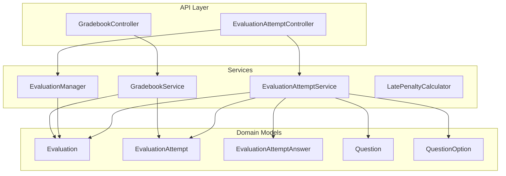
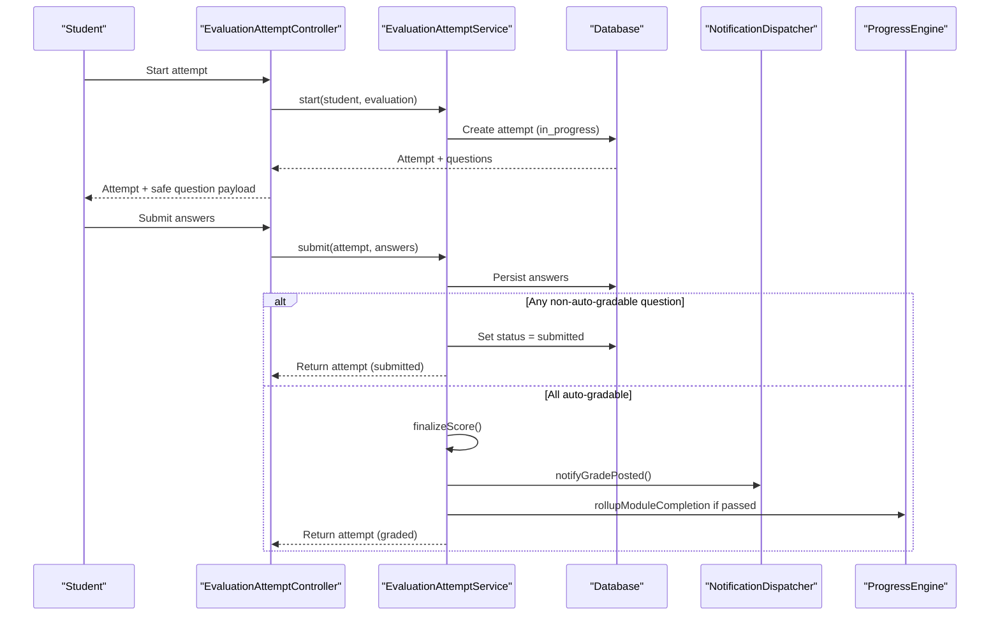
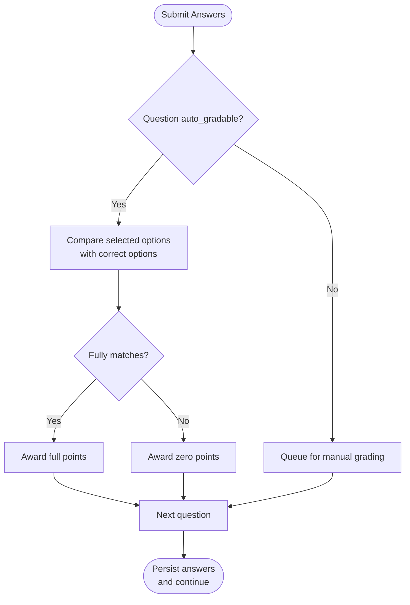
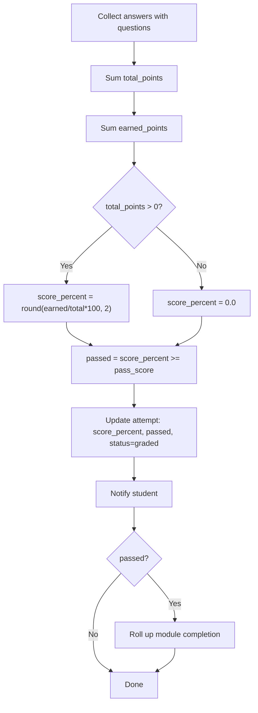
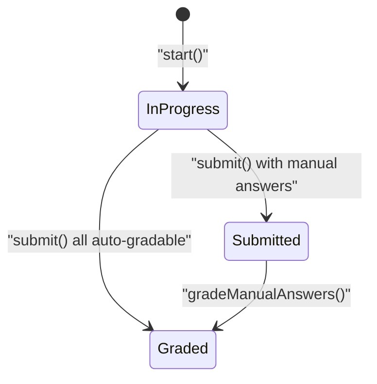
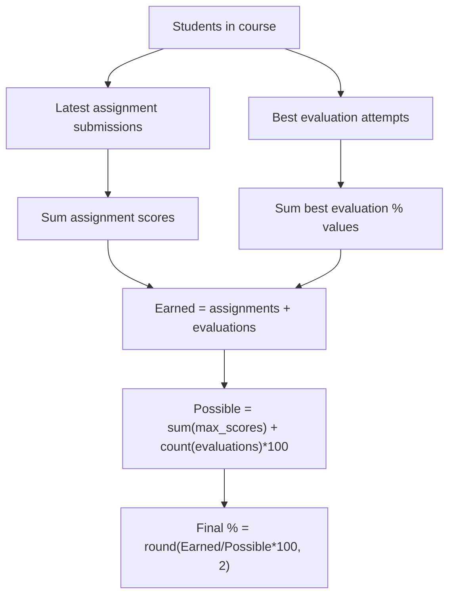
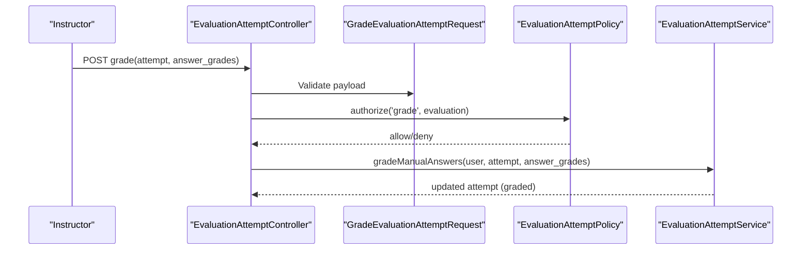
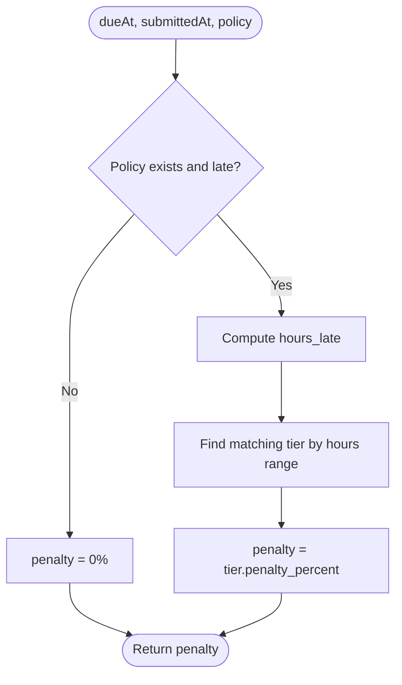
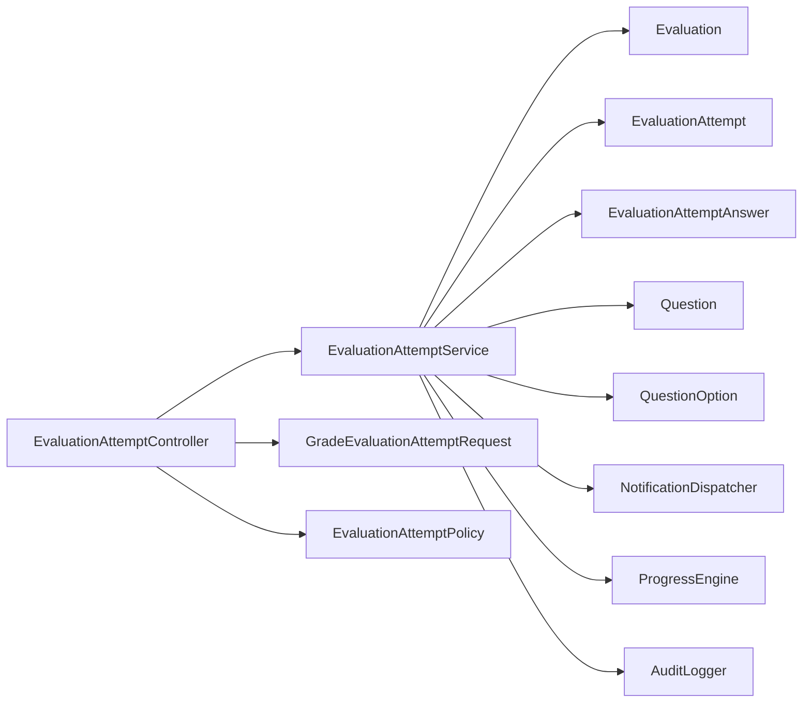

# Automated Scoring & Grading

<cite>
**Referenced Files in This Document**
- [EvaluationAttemptService.php](file://app/Services/Assessment/EvaluationAttemptService.php)
- [EvaluationManager.php](file://app/Services/Assessment/EvaluationManager.php)
- [GradebookService.php](file://app/Services/Assessment/GradebookService.php)
- [LatePenaltyCalculator.php](file://app/Services/Assessment/LatePenaltyCalculator.php)
- [EvaluationAttemptController.php](file://app/Http/Controllers/Api/V1/EvaluationAttemptController.php)
- [GradebookController.php](file://app/Http/Controllers/Api/V1/GradebookController.php)
- [EvaluationAttemptPolicy.php](file://app/Policies/EvaluationAttemptPolicy.php)
- [GradeEvaluationAttemptRequest.php](file://app/Http/Requests/Api/V1/GradeEvaluationAttemptRequest.php)
- [EvaluationAttempt.php](file://app/Models/EvaluationAttempt.php)
- [EvaluationAttemptAnswer.php](file://app/Models/EvaluationAttemptAnswer.php)
- [Evaluation.php](file://app/Models/Evaluation.php)
- [Question.php](file://app/Models/Question.php)
- [QuestionOption.php](file://app/Models/QuestionOption.php)
- [QuestionType.php](file://app/Enums/QuestionType.php)
- [EvaluationAttemptStatus.php](file://app/Enums/EvaluationAttemptStatus.php)
</cite>

## Table of Contents
1. Introduction
2. Project Structure
3. Core Components
4. Architecture Overview
5. Detailed Component Analysis
6. Dependency Analysis
7. Performance Considerations
8. Troubleshooting Guide
9. Conclusion

## Introduction
This document explains how automated scoring and grading work for evaluations (quizzes/tests). It covers:
- Automatic scoring for objective question types (multiple choice, true/false)
- Manual grading workflows for short answer and essay questions
- Partial credit calculation and pass/fail determination using evaluation-level thresholds
- Attempt lifecycle, status transitions, and result generation
- Gradebook aggregation and performance metrics
- Manual override capabilities and grading policies

## Project Structure
The automated scoring system is implemented across services, models, controllers, requests, and policies:
- Services orchestrate attempt lifecycle, auto-grading logic, manual grading, score finalization, notifications, and progress updates
- Models define the data structures for evaluations, attempts, answers, questions, and options
- Controllers expose API endpoints to start, submit, view, and grade attempts
- Requests validate inputs for submission and grading
- Policies enforce who can view or grade attempts

**Diagram sources**
- [EvaluationAttemptController.php:1-84](file://app/Http/Controllers/Api/V1/EvaluationAttemptController.php#L1-L84)
- [GradebookController.php:1-23](file://app/Http/Controllers/Api/V1/GradebookController.php#L1-L23)
- [EvaluationAttemptService.php:1-219](file://app/Services/Assessment/EvaluationAttemptService.php#L1-L219)
- [EvaluationManager.php:1-104](file://app/Services/Assessment/EvaluationManager.php#L1-L104)
- [GradebookService.php:1-121](file://app/Services/Assessment/GradebookService.php#L1-L121)
- [LatePenaltyCalculator.php:1-35](file://app/Services/Assessment/LatePenaltyCalculator.php#L1-L35)
- [Evaluation.php:1-63](file://app/Models/Evaluation.php#L1-L63)
- [EvaluationAttempt.php:1-64](file://app/Models/EvaluationAttempt.php#L1-L64)
- [EvaluationAttemptAnswer.php:1-56](file://app/Models/EvaluationAttemptAnswer.php#L1-L56)
- [Question.php:1-60](file://app/Models/Question.php#L1-L60)
- [QuestionOption.php:1-38](file://app/Models/QuestionOption.php#L1-L38)

**Section sources**
- [EvaluationAttemptController.php:1-84](file://app/Http/Controllers/Api/V1/EvaluationAttemptController.php#L1-L84)
- [EvaluationAttemptService.php:1-219](file://app/Services/Assessment/EvaluationAttemptService.php#L1-L219)
- [EvaluationManager.php:1-104](file://app/Services/Assessment/EvaluationManager.php#L1-L104)
- [GradebookService.php:1-121](file://app/Services/Assessment/GradebookService.php#L1-L121)
- [LatePenaltyCalculator.php:1-35](file://app/Services/Assessment/LatePenaltyCalculator.php#L1-L35)
- [Evaluation.php:1-63](file://app/Models/Evaluation.php#L1-L63)
- [EvaluationAttempt.php:1-64](file://app/Models/EvaluationAttempt.php#L1-L64)
- [EvaluationAttemptAnswer.php:1-56](file://app/Models/EvaluationAttemptAnswer.php#L1-L56)
- [Question.php:1-60](file://app/Models/Question.php#L1-L60)
- [QuestionOption.php:1-38](file://app/Models/QuestionOption.php#L1-L38)

## Core Components
- EvaluationAttemptService: Starts/resumes attempts, enforces time/attempts limits, auto-grades objective answers, queues manual grading when needed, finalizes scores, notifies students, and updates module completion on pass.
- EvaluationManager: Creates/updates/deletes evaluations and syncs their questions into the evaluation-question relationship.
- GradebookService: Aggregates assignment scores and best evaluation attempt scores per student to compute a course-level final grade percentage.
- LatePenaltyCalculator: Applies tiered late penalties based on configured policy tiers.
- EvaluationAttemptController: Exposes endpoints to list attempts, start an attempt, submit answers, show attempt details, and grade manually.
- GradebookController: Returns aggregated gradebook data for a course.
- Policies and Requests: Enforce permissions and validate grading payloads.

Key data entities:
- Evaluation: defines pass_score, max_attempts, time_limit_minutes, randomize_questions, questions_per_attempt, availability windows.
- Question and QuestionOption: store type, points, and correct option flags; supports multiple correct options for multi-select.
- EvaluationAttempt and EvaluationAttemptAnswer: capture attempt metadata, per-answer correctness and awarded points, grader identity, and timestamps.

**Section sources**
- [EvaluationAttemptService.php:35-219](file://app/Services/Assessment/EvaluationAttemptService.php#L35-L219)
- [EvaluationManager.php:20-104](file://app/Services/Assessment/EvaluationManager.php#L20-L104)
- [GradebookService.php:18-121](file://app/Services/Assessment/GradebookService.php#L18-L121)
- [LatePenaltyCalculator.php:10-35](file://app/Services/Assessment/LatePenaltyCalculator.php#L10-L35)
- [EvaluationAttemptController.php:19-84](file://app/Http/Controllers/Api/V1/EvaluationAttemptController.php#L19-L84)
- [GradebookController.php:12-23](file://app/Http/Controllers/Api/V1/GradebookController.php#L12-L23)
- [Evaluation.php:14-63](file://app/Models/Evaluation.php#L14-L63)
- [Question.php:15-60](file://app/Models/Question.php#L15-L60)
- [QuestionOption.php:12-38](file://app/Models/QuestionOption.php#L12-L38)
- [EvaluationAttempt.php:14-64](file://app/Models/EvaluationAttempt.php#L14-L64)
- [EvaluationAttemptAnswer.php:10-56](file://app/Models/EvaluationAttemptAnswer.php#L10-L56)

## Architecture Overview
End-to-end flow from student submission to graded result:

**Diagram sources**
- [EvaluationAttemptController.php:36-82](file://app/Http/Controllers/Api/V1/EvaluationAttemptController.php#L36-L82)
- [EvaluationAttemptService.php:35-206](file://app/Services/Assessment/EvaluationAttemptService.php#L35-L206)

## Detailed Component Analysis

### Auto-Scoring Algorithms by Question Type
- Multiple choice single/multi and True/False:
  - Objective answers are auto-gradable when the question is marked auto_gradable.
  - Correctness is determined by comparing selected option IDs with all options marked correct for that question.
  - Points awarded equal the question’s points if fully correct; otherwise zero.
- Short answer and Essay:
  - Not auto-gradable by default; they enter a manual grading queue.
  - After manual grading, scores are finalized similarly to auto-graded items.

**Diagram sources**
- [EvaluationAttemptService.php:114-148](file://app/Services/Assessment/EvaluationAttemptService.php#L114-L148)
- [EvaluationAttemptService.php:211-217](file://app/Services/Assessment/EvaluationAttemptService.php#L211-L217)
- [Question.php:22-34](file://app/Models/Question.php#L22-L34)
- [QuestionOption.php:19-28](file://app/Models/QuestionOption.php#L19-L28)

**Section sources**
- [EvaluationAttemptService.php:114-148](file://app/Services/Assessment/EvaluationAttemptService.php#L114-L148)
- [EvaluationAttemptService.php:211-217](file://app/Services/Assessment/EvaluationAttemptService.php#L211-L217)
- [QuestionType.php:7-14](file://app/Enums/QuestionType.php#L7-L14)
- [Question.php:22-34](file://app/Models/Question.php#L22-L34)
- [QuestionOption.php:19-28](file://app/Models/QuestionOption.php#L19-L28)

### Score Finalization and Pass/Fail Determination
- Total possible points: sum of points across all answered questions in the attempt.
- Earned points: sum of points_awarded per answer (zero if not yet graded).
- Percentage: earned / total * 100, rounded to two decimals.
- Passed: true if percentage >= evaluation.pass_score.
- Status transitions:
  - If any answer requires manual grading: status becomes submitted.
  - Once all answers are graded (auto or manual), status becomes graded and score_percent/passed are set.
- Side effects:
  - Notification sent to the student.
  - If passed, module completion is rolled up via the progress engine.

**Diagram sources**
- [EvaluationAttemptService.php:183-206](file://app/Services/Assessment/EvaluationAttemptService.php#L183-L206)
- [Evaluation.php:19-37](file://app/Models/Evaluation.php#L19-L37)

**Section sources**
- [EvaluationAttemptService.php:183-206](file://app/Services/Assessment/EvaluationAttemptService.php#L183-L206)
- [Evaluation.php:19-37](file://app/Models/Evaluation.php#L19-L37)

### Attempt Lifecycle and Status Updates
- Start:
  - Validates availability window and attempt limits.
  - Creates or resumes an in-progress attempt.
- Submit:
  - Validates time limit if configured.
  - Persists answers; sets status to submitted if any require manual grading; otherwise finalizes immediately.
- Manual grading:
  - Instructors/admins update is_correct and points_awarded per answer.
  - After updating, scores are re-finalized and audit logs recorded.

**Diagram sources**
- [EvaluationAttemptService.php:35-78](file://app/Services/Assessment/EvaluationAttemptService.php#L35-L78)
- [EvaluationAttemptService.php:102-148](file://app/Services/Assessment/EvaluationAttemptService.php#L102-L148)
- [EvaluationAttemptService.php:154-181](file://app/Services/Assessment/EvaluationAttemptService.php#L154-L181)
- [EvaluationAttemptStatus.php:7-12](file://app/Enums/EvaluationAttemptStatus.php#L7-L12)

**Section sources**
- [EvaluationAttemptService.php:35-78](file://app/Services/Assessment/EvaluationAttemptService.php#L35-L78)
- [EvaluationAttemptService.php:102-148](file://app/Services/Assessment/EvaluationAttemptService.php#L102-L148)
- [EvaluationAttemptService.php:154-181](file://app/Services/Assessment/EvaluationAttemptService.php#L154-L181)
- [EvaluationAttemptStatus.php:7-12](file://app/Enums/EvaluationAttemptStatus.php#L7-L12)

### Gradebook Aggregation and Final Grade Calculation
- For each student in a course:
  - Collect latest scored submissions per assignment.
  - Collect best graded attempt per evaluation (highest score_percent).
  - Compute earned points as sum of assignment final_scores plus sum of best evaluation percentages.
  - Compute possible points as sum of assignment max_scores plus number_of_evaluations * 100 (each evaluation weighted equally at 100).
  - Final grade percent = earned / possible * 100.

**Diagram sources**
- [GradebookService.php:31-105](file://app/Services/Assessment/GradebookService.php#L31-L105)

**Section sources**
- [GradebookService.php:18-121](file://app/Services/Assessment/GradebookService.php#L18-L121)

### Manual Override Capabilities and Grading Policies
- Manual grading endpoint allows instructors/admins to set per-answer correctness and points awarded.
- Validation ensures only existing answers are graded and points are non-negative.
- Permissions enforced via policy checks before grading.
- Audit logging records changes to grades including new score_percent and passed flag.

**Diagram sources**
- [EvaluationAttemptController.php:77-82](file://app/Http/Controllers/Api/V1/EvaluationAttemptController.php#L77-L82)
- [GradeEvaluationAttemptRequest.php:11-31](file://app/Http/Requests/Api/V1/GradeEvaluationAttemptRequest.php#L11-L31)
- [EvaluationAttemptPolicy.php:11-28](file://app/Policies/EvaluationAttemptPolicy.php#L11-L28)
- [EvaluationAttemptService.php:154-181](file://app/Services/Assessment/EvaluationAttemptService.php#L154-L181)

**Section sources**
- [EvaluationAttemptController.php:77-82](file://app/Http/Controllers/Api/V1/EvaluationAttemptController.php#L77-L82)
- [GradeEvaluationAttemptRequest.php:11-31](file://app/Http/Requests/Api/V1/GradeEvaluationAttemptRequest.php#L11-L31)
- [EvaluationAttemptPolicy.php:11-28](file://app/Policies/EvaluationAttemptPolicy.php#L11-L28)
- [EvaluationAttemptService.php:154-181](file://app/Services/Assessment/EvaluationAttemptService.php#L154-L181)

### Late Penalties (Assignments)
- LatePenaltyCalculator applies tiered deductions based on hours late relative to due date and configured policy tiers.
- While this primarily affects assignments, it illustrates the pattern for configurable penalty bands.

**Diagram sources**
- [LatePenaltyCalculator.php:10-35](file://app/Services/Assessment/LatePenaltyCalculator.php#L10-L35)

**Section sources**
- [LatePenaltyCalculator.php:10-35](file://app/Services/Assessment/LatePenaltyCalculator.php#L10-L35)

## Dependency Analysis
- Controllers depend on services for business logic and on policies/requests for authorization/validation.
- Services depend on domain models and external services (notifications, progress, analytics, audit).
- Models encapsulate relationships between evaluations, attempts, answers, questions, and options.

**Diagram sources**
- [EvaluationAttemptController.php:19-84](file://app/Http/Controllers/Api/V1/EvaluationAttemptController.php#L19-L84)
- [EvaluationAttemptService.php:28-33](file://app/Services/Assessment/EvaluationAttemptService.php#L28-L33)
- [Evaluation.php:14-63](file://app/Models/Evaluation.php#L14-L63)
- [EvaluationAttempt.php:14-64](file://app/Models/EvaluationAttempt.php#L14-L64)
- [EvaluationAttemptAnswer.php:10-56](file://app/Models/EvaluationAttemptAnswer.php#L10-L56)
- [Question.php:15-60](file://app/Models/Question.php#L15-L60)
- [QuestionOption.php:12-38](file://app/Models/QuestionOption.php#L12-L38)

**Section sources**
- [EvaluationAttemptController.php:19-84](file://app/Http/Controllers/Api/V1/EvaluationAttemptController.php#L19-L84)
- [EvaluationAttemptService.php:28-33](file://app/Services/Assessment/EvaluationAttemptService.php#L28-L33)

## Performance Considerations
- Batch operations:
  - Questions retrieval uses eager loading of options to minimize N+1 queries.
  - Finalization aggregates sums over collections efficiently.
- Indexing:
  - Database indexes on student_id and evaluation_id improve lookup performance for attempts and answers.
- Transactions:
  - Submission and manual grading use database transactions to ensure consistency.
- Avoid unnecessary recalculations:
  - Only recalculate scores after all answers are graded or when manual grades change.

[No sources needed since this section provides general guidance]

## Troubleshooting Guide
Common issues and resolutions:
- Time limit exceeded on submit:
  - Ensure the current time is within the allowed window calculated from started_at plus time_limit_minutes.
- Attempt limit reached:
  - Verify evaluation.max_attempts and current attempt count for the student.
- Manual grading queue not visible:
  - Confirm that at least one answer has is_correct null; such attempts remain in submitted status until graded.
- Incorrect auto-grade:
  - Check that question.auto_gradable is true and that correct options are properly marked in QuestionOption.
- Gradebook shows unexpected final grade:
  - Review assignment max_score vs final_score and ensure best evaluation attempts are used.

**Section sources**
- [EvaluationAttemptService.php:35-78](file://app/Services/Assessment/EvaluationAttemptService.php#L35-L78)
- [EvaluationAttemptService.php:102-148](file://app/Services/Assessment/EvaluationAttemptService.php#L102-L148)
- [EvaluationAttemptService.php:154-181](file://app/Services/Assessment/EvaluationAttemptService.php#L154-L181)
- [EvaluationAttemptService.php:183-206](file://app/Services/Assessment/EvaluationAttemptService.php#L183-L206)
- [GradebookService.php:31-105](file://app/Services/Assessment/GradebookService.php#L31-L105)

## Conclusion
The system provides robust automated scoring for objective questions, a clear manual grading workflow for subjective responses, and consistent finalization rules tied to evaluation thresholds. Attempts are governed by time and attempt limits, with statuses reflecting progress through submission and grading. The gradebook aggregates results across assignments and evaluations to produce a final course grade. Policies and validation ensure secure and accurate grading operations, while audit logging preserves accountability for changes.