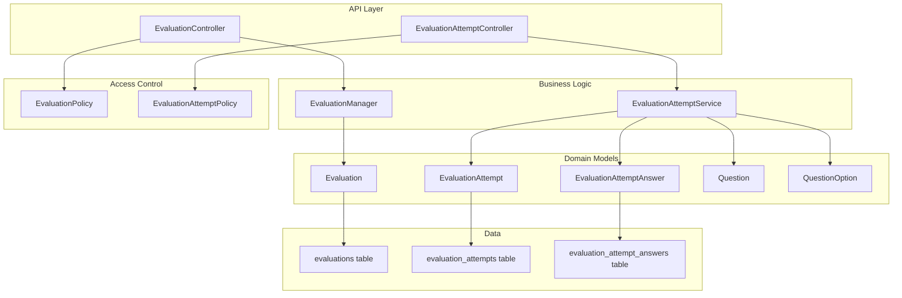
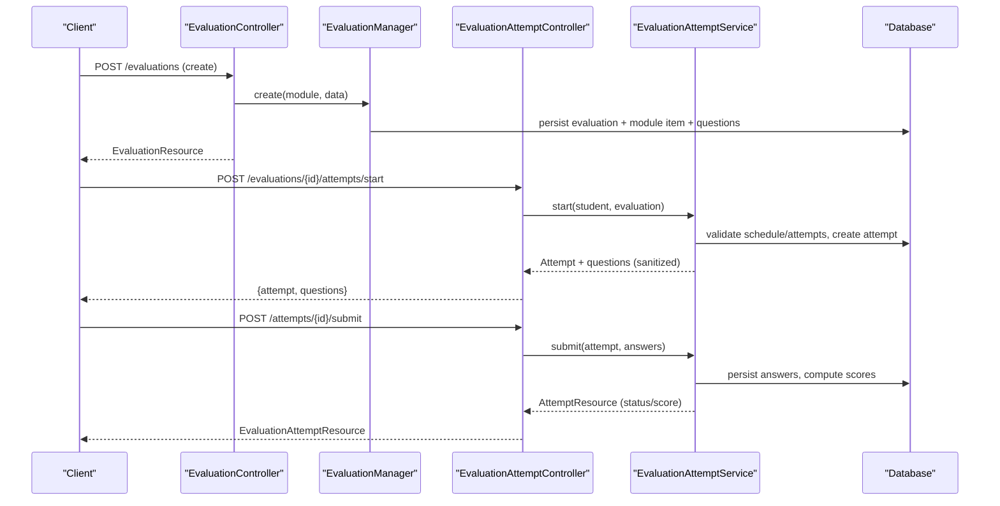
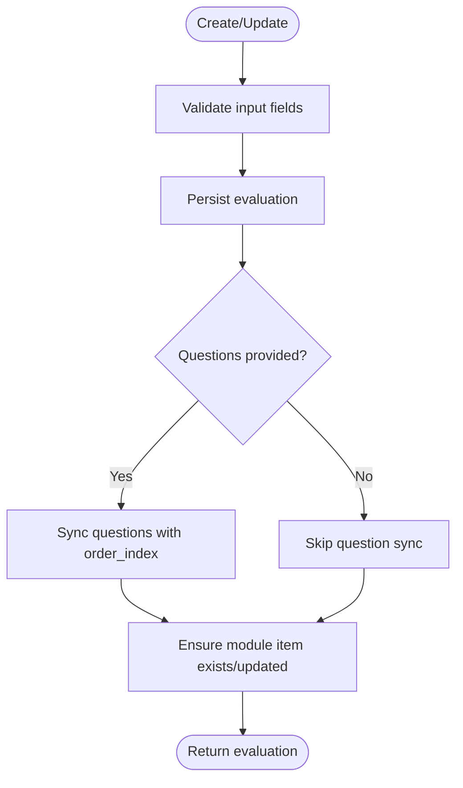
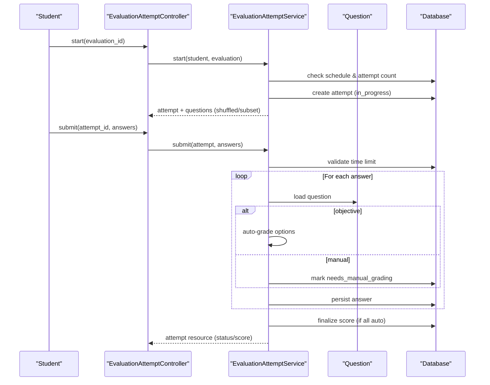
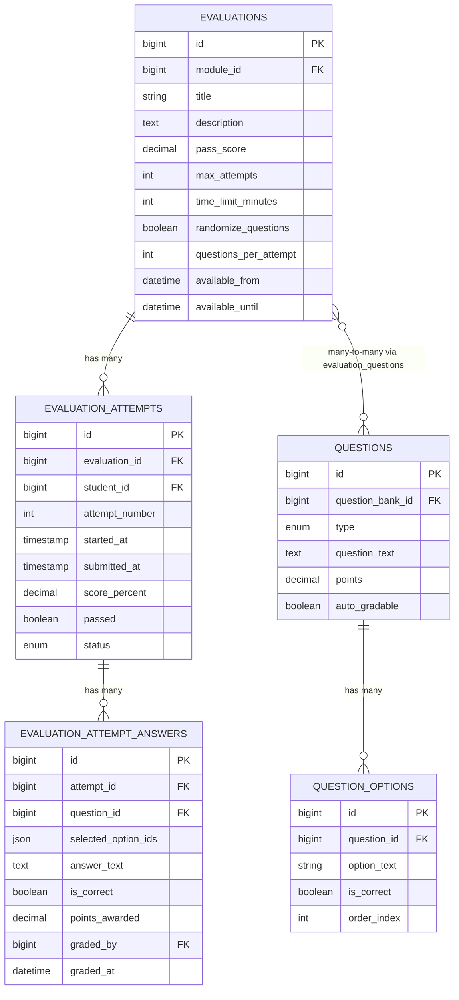
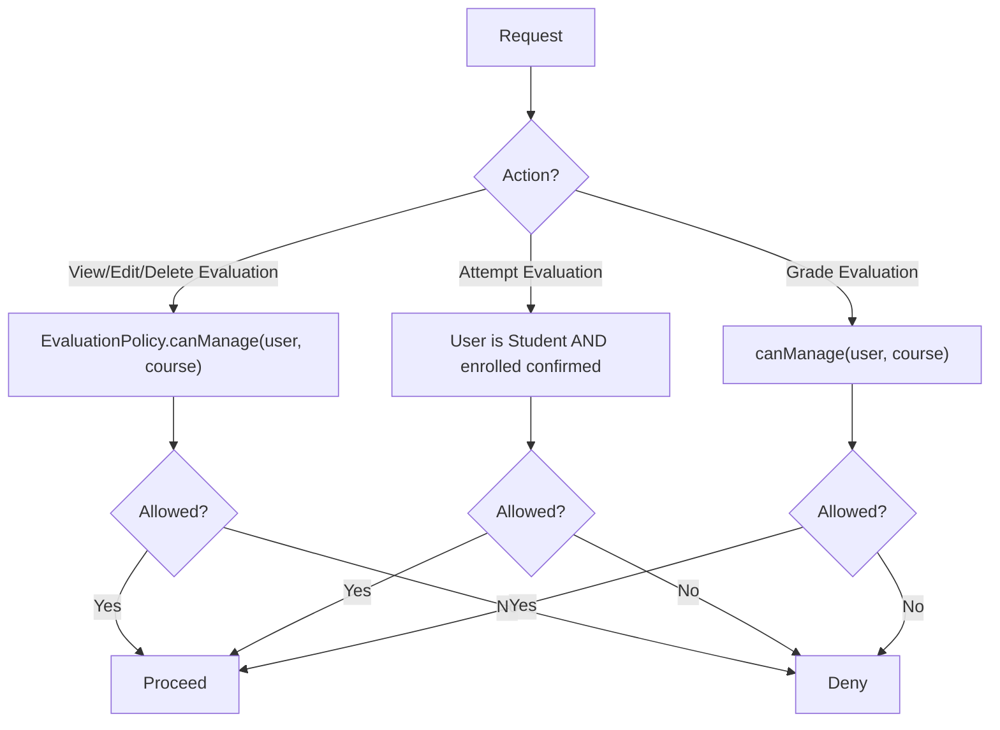
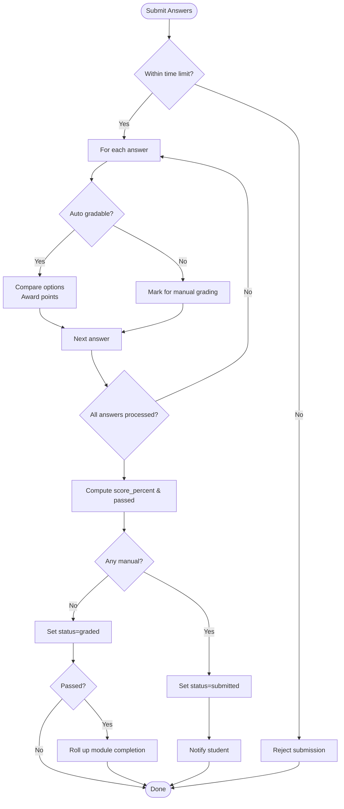
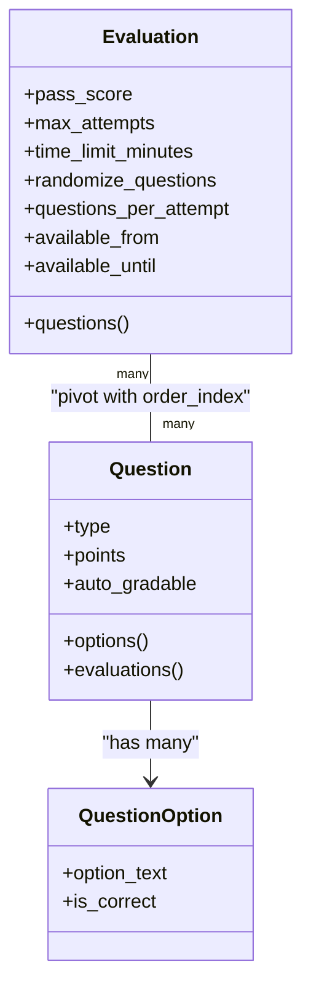
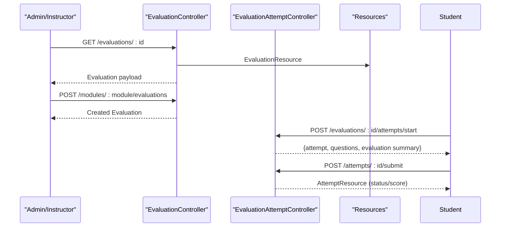
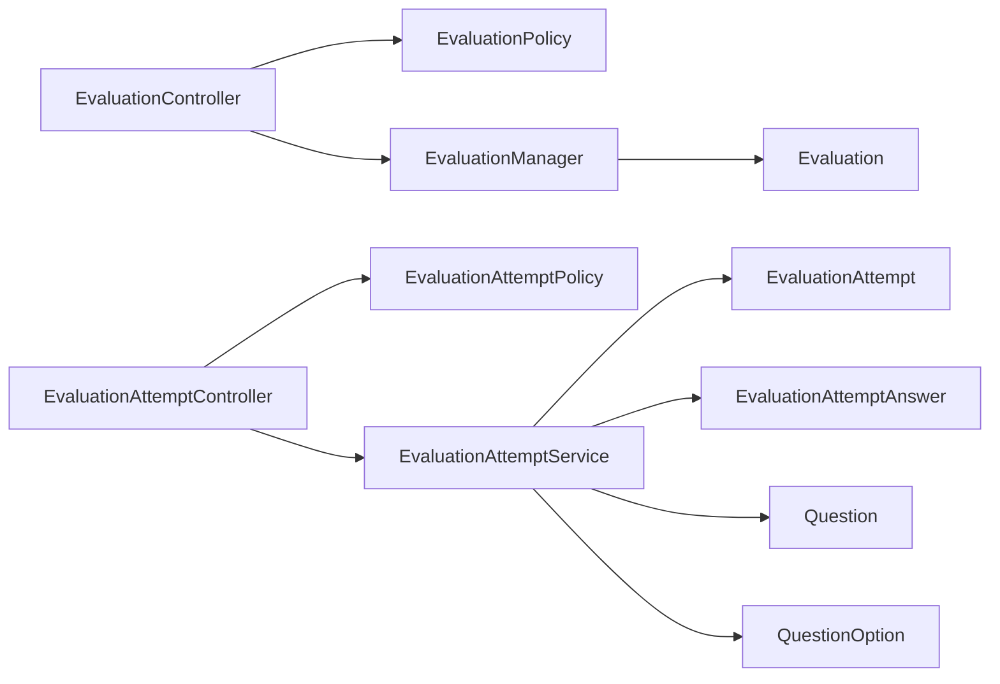

# Evaluation & Quiz System

<cite>
**Referenced Files in This Document**
- [EvaluationManager.php](file://app/Services/Assessment/EvaluationManager.php)
- [EvaluationAttemptService.php](file://app/Services/Assessment/EvaluationAttemptService.php)
- [EvaluationController.php](file://app/Http/Controllers/Api/V1/EvaluationController.php)
- [EvaluationAttemptController.php](file://app/Http/Controllers/Api/V1/EvaluationAttemptController.php)
- [Evaluation.php](file://app/Models/Evaluation.php)
- [EvaluationAttempt.php](file://app/Models/EvaluationAttempt.php)
- [EvaluationAttemptAnswer.php](file://app/Models/EvaluationAttemptAnswer.php)
- [Question.php](file://app/Models/Question.php)
- [QuestionOption.php](file://app/Models/QuestionOption.php)
- [QuestionType.php](file://app/Enums/QuestionType.php)
- [EvaluationPolicy.php](file://app/Policies/EvaluationPolicy.php)
- [EvaluationAttemptPolicy.php](file://app/Policies/EvaluationAttemptPolicy.php)
- [EvaluationResource.php](file://app/Http/Resources/EvaluationResource.php)
- [EvaluationAttemptResource.php](file://app/Http/Resources/EvaluationAttemptResource.php)
- [2024_01_01_000143_create_evaluations_table.php](file://database/migrations/2024_01_01_000143_create_evaluations_table.php)
- [2024_01_01_000145_create_evaluation_attempts_table.php](file://database/migrations/2024_01_01_000145_create_evaluation_attempts_table.php)
- [2024_01_01_000146_create_evaluation_attempt_answers_table.php](file://database/migrations/2024_01_01_000146_create_evaluation_attempt_answers_table.php)
</cite>

## Table of Contents
1. Introduction
2. Project Structure
3. Core Components
4. Architecture Overview
5. Detailed Component Analysis
6. Dependency Analysis
7. Performance Considerations
8. Troubleshooting Guide
9. Conclusion

## Introduction
This document explains the Evaluation and Quiz system used to create, administer, and grade assessments within modules. It covers evaluation creation, question types (multiple choice single/multi, true/false, short answer/essay), attempt tracking, automated scoring for objective questions, manual grading workflows, scheduling and access controls, randomization and subsetting of questions, and result reporting. The core orchestration is implemented by the EvaluationManager for evaluation administration and the EvaluationAttemptService for attempt lifecycle management and scoring.

## Project Structure
The evaluation feature spans models, services, controllers, policies, resources, and database migrations:
- Models define evaluations, attempts, answers, questions, and options.
- Services encapsulate business logic for creating evaluations and managing attempts.
- Controllers expose API endpoints with authorization via policies.
- Resources shape responses for clients.
- Migrations define the persistent schema.

**Diagram sources**
- [EvaluationController.php:1-50](file://app/Http/Controllers/Api/V1/EvaluationController.php#L1-L50)
- [EvaluationAttemptController.php:1-84](file://app/Http/Controllers/Api/V1/EvaluationAttemptController.php#L1-L84)
- [EvaluationManager.php:1-104](file://app/Services/Assessment/EvaluationManager.php#L1-L104)
- [EvaluationAttemptService.php:1-219](file://app/Services/Assessment/EvaluationAttemptService.php#L1-L219)
- [Evaluation.php:1-63](file://app/Models/Evaluation.php#L1-L63)
- [EvaluationAttempt.php:1-64](file://app/Models/EvaluationAttempt.php#L1-L64)
- [EvaluationAttemptAnswer.php:1-56](file://app/Models/EvaluationAttemptAnswer.php#L1-L56)
- [Question.php:1-60](file://app/Models/Question.php#L1-L60)
- [QuestionOption.php:1-38](file://app/Models/QuestionOption.php#L1-L38)
- [EvaluationPolicy.php:1-63](file://app/Policies/EvaluationPolicy.php#L1-L63)
- [EvaluationAttemptPolicy.php:1-28](file://app/Policies/EvaluationAttemptPolicy.php#L1-L28)
- [2024_01_01_000143_create_evaluations_table.php:1-34](file://database/migrations/2024_01_01_000143_create_evaluations_table.php#L1-L34)
- [2024_01_01_000145_create_evaluation_attempts_table.php:1-32](file://database/migrations/2024_01_01_000145_create_evaluation_attempts_table.php#L1-L32)
- [2024_01_01_000146_create_evaluation_attempt_answers_table.php:1-31](file://database/migrations/2024_01_01_000146_create_evaluation_attempt_answers_table.php#L1-L31)

**Section sources**
- [EvaluationController.php:1-50](file://app/Http/Controllers/Api/V1/EvaluationController.php#L1-L50)
- [EvaluationAttemptController.php:1-84](file://app/Http/Controllers/Api/V1/EvaluationAttemptController.php#L1-L84)
- [EvaluationManager.php:1-104](file://app/Services/Assessment/EvaluationManager.php#L1-L104)
- [EvaluationAttemptService.php:1-219](file://app/Services/Assessment/EvaluationAttemptService.php#L1-L219)
- [Evaluation.php:1-63](file://app/Models/Evaluation.php#L1-L63)
- [EvaluationAttempt.php:1-64](file://app/Models/EvaluationAttempt.php#L1-L64)
- [EvaluationAttemptAnswer.php:1-56](file://app/Models/EvaluationAttemptAnswer.php#L1-L56)
- [Question.php:1-60](file://app/Models/Question.php#L1-L60)
- [QuestionOption.php:1-38](file://app/Models/QuestionOption.php#L1-L38)
- [EvaluationPolicy.php:1-63](file://app/Policies/EvaluationPolicy.php#L1-L63)
- [EvaluationAttemptPolicy.php:1-28](file://app/Policies/EvaluationAttemptPolicy.php#L1-L28)
- [2024_01_01_000143_create_evaluations_table.php:1-34](file://database/migrations/2024_01_01_000143_create_evaluations_table.php#L1-L34)
- [2024_01_01_000145_create_evaluation_attempts_table.php:1-32](file://database/migrations/2024_01_01_000145_create_evaluation_attempts_table.php#L1-L32)
- [2024_01_01_000146_create_evaluation_attempt_answers_table.php:1-31](file://database/migrations/2024_01_01_000146_create_evaluation_attempt_answers_table.php#L1-L31)

## Core Components
- EvaluationManager: Creates, updates, and deletes evaluations as a unit together with their module item slot and linked questions. Supports pass score, max attempts, time limits, randomization, and per-attempt question subsets.
- EvaluationAttemptService: Manages the full attempt lifecycle: start (with scheduling and attempt limits), question selection (randomization/subset), submission (time limit enforcement, auto-grading for objective questions), manual grading workflow, final scoring, notifications, and progress rollup on pass.
- Models: Evaluation, EvaluationAttempt, EvaluationAttemptAnswer, Question, QuestionOption define data structures and relationships.
- Policies: Enforce role-based access for viewing/editing evaluations, attempting, and grading.
- Controllers: Expose REST endpoints for evaluation CRUD and attempt operations, delegating to services and enforcing policies.
- Resources: Shape API payloads for evaluations and attempts, including safe student-facing views without answer keys.

Key capabilities:
- Question types supported via enum: mcq_single, mcq_multi, true_false, short_answer, essay.
- Objective questions are auto-graded; short answer/essay require manual grading.
- Attempts enforce availability windows, max attempts, and time limits.
- Randomization and question subset per attempt are supported.
- Passing triggers module completion rollup and notifies students.

**Section sources**
- [EvaluationManager.php:1-104](file://app/Services/Assessment/EvaluationManager.php#L1-L104)
- [EvaluationAttemptService.php:1-219](file://app/Services/Assessment/EvaluationAttemptService.php#L1-L219)
- [QuestionType.php:1-15](file://app/Enums/QuestionType.php#L1-L15)
- [EvaluationPolicy.php:1-63](file://app/Policies/EvaluationPolicy.php#L1-L63)
- [EvaluationAttemptPolicy.php:1-28](file://app/Policies/EvaluationAttemptPolicy.php#L1-L28)
- [EvaluationResource.php:1-44](file://app/Http/Resources/EvaluationResource.php#L1-L44)
- [EvaluationAttemptResource.php:1-31](file://app/Http/Resources/EvaluationAttemptResource.php#L1-L31)

## Architecture Overview
The system follows a layered architecture:
- API layer (controllers) validates requests and delegates to services.
- Services implement domain rules (scheduling, attempt limits, scoring).
- Models represent entities and relationships.
- Policies gate access based on roles and enrollment.
- Resources format responses for clients.

**Diagram sources**
- [EvaluationController.php:1-50](file://app/Http/Controllers/Api/V1/EvaluationController.php#L1-L50)
- [EvaluationManager.php:1-104](file://app/Services/Assessment/EvaluationManager.php#L1-L104)
- [EvaluationAttemptController.php:1-84](file://app/Http/Controllers/Api/V1/EvaluationAttemptController.php#L1-L84)
- [EvaluationAttemptService.php:1-219](file://app/Services/Assessment/EvaluationAttemptService.php#L1-L219)

## Detailed Component Analysis

### EvaluationManager
Responsibilities:
- Create/update/delete evaluations atomically with their module item slot and linked questions.
- Sync question order and membership via pivot table.
- Support fields: title, description, pass_score, max_attempts, time_limit_minutes, randomize_questions, questions_per_attempt, available_from, available_until.

Key behaviors:
- Creation persists evaluation and creates a ModuleItem of type evaluation with ordering and required flag.
- Update can change evaluation fields, re-sync questions if provided, and update module item flags.
- Deletion removes the module item and then the evaluation.

**Diagram sources**
- [EvaluationManager.php:28-76](file://app/Services/Assessment/EvaluationManager.php#L28-L76)

**Section sources**
- [EvaluationManager.php:1-104](file://app/Services/Assessment/EvaluationManager.php#L1-L104)

### EvaluationAttemptService
Responsibilities:
- Start attempts with schedule checks, attempt count limits, and resume in-progress attempts.
- Provide questions for an attempt with optional randomization and subset sizing.
- Submit answers, enforce time limits, auto-grade objective questions, record manual answers, finalize scores, notify students, and roll up module completion on pass.
- Grade manual answers and finalize scores.

Key behaviors:
- Scheduling: blocks start before available_from or after available_until.
- Attempt limits: enforces max_attempts; allows unlimited when null.
- Time limit: rejects submission after deadline computed from started_at plus time_limit_minutes.
- Auto-grading: compares selected options against correct options for objective questions; marks non-objective as needing manual grading.
- Finalization: computes score_percent and passed status, sets status to graded, notifies student, and rolls up module completion if passed.

**Diagram sources**
- [EvaluationAttemptController.php:36-75](file://app/Http/Controllers/Api/V1/EvaluationAttemptController.php#L36-L75)
- [EvaluationAttemptService.php:35-149](file://app/Services/Assessment/EvaluationAttemptService.php#L35-L149)

**Section sources**
- [EvaluationAttemptService.php:1-219](file://app/Services/Assessment/EvaluationAttemptService.php#L1-L219)

### Data Model Relationships

**Diagram sources**
- [2024_01_01_000143_create_evaluations_table.php:1-34](file://database/migrations/2024_01_01_000143_create_evaluations_table.php#L1-L34)
- [2024_01_01_000145_create_evaluation_attempts_table.php:1-32](file://database/migrations/2024_01_01_000145_create_evaluation_attempts_table.php#L1-L32)
- [2024_01_01_000146_create_evaluation_attempt_answers_table.php:1-31](file://database/migrations/2024_01_01_000146_create_evaluation_attempt_answers_table.php#L1-L31)
- [Question.php:1-60](file://app/Models/Question.php#L1-L60)
- [QuestionOption.php:1-38](file://app/Models/QuestionOption.php#L1-L38)
- [Evaluation.php:1-63](file://app/Models/Evaluation.php#L1-L63)
- [EvaluationAttempt.php:1-64](file://app/Models/EvaluationAttempt.php#L1-L64)
- [EvaluationAttemptAnswer.php:1-56](file://app/Models/EvaluationAttemptAnswer.php#L1-L56)

### Access Controls and Policies
- EvaluationPolicy: restricts create/view/update/delete to admins/instructors teaching the course; attempt policy ensures only enrolled students can attempt; grading restricted to instructors/admins.
- EvaluationAttemptPolicy: allows admin, the student who owns the attempt, or the course instructor to view attempts.

**Diagram sources**
- [EvaluationPolicy.php:16-56](file://app/Policies/EvaluationPolicy.php#L16-L56)
- [EvaluationAttemptPolicy.php:13-26](file://app/Policies/EvaluationAttemptPolicy.php#L13-L26)

**Section sources**
- [EvaluationPolicy.php:1-63](file://app/Policies/EvaluationPolicy.php#L1-L63)
- [EvaluationAttemptPolicy.php:1-28](file://app/Policies/EvaluationAttemptPolicy.php#L1-L28)

### Scoring and Feedback Flow
- Auto-grading: For objective questions, compare selected options with correct options; award full points if match, otherwise zero.
- Manual grading: Short answer/essay remain pending until graded; once graded, finalize score.
- Finalization: Compute score_percent from earned vs total points; set passed if score meets pass_score; set status to graded; notify student; roll up module completion if passed.

**Diagram sources**
- [EvaluationAttemptService.php:102-206](file://app/Services/Assessment/EvaluationAttemptService.php#L102-L206)

**Section sources**
- [EvaluationAttemptService.php:102-206](file://app/Services/Assessment/EvaluationAttemptService.php#L102-L206)

### Question Bank Integration and Types
- Questions belong to a QuestionBank and have multiple options.
- Supported types include mcq_single, mcq_multi, true_false, short_answer, essay.
- Evaluations link to questions via a pivot table preserving order; randomization and per-attempt subset are configurable at evaluation level.

**Diagram sources**
- [Question.php:1-60](file://app/Models/Question.php#L1-L60)
- [QuestionOption.php:1-38](file://app/Models/QuestionOption.php#L1-L38)
- [Evaluation.php:1-63](file://app/Models/Evaluation.php#L1-L63)
- [QuestionType.php:1-15](file://app/Enums/QuestionType.php#L1-L15)

**Section sources**
- [Question.php:1-60](file://app/Models/Question.php#L1-L60)
- [QuestionOption.php:1-38](file://app/Models/QuestionOption.php#L1-L38)
- [Evaluation.php:1-63](file://app/Models/Evaluation.php#L1-L63)
- [QuestionType.php:1-15](file://app/Enums/QuestionType.php#L1-L15)

### API Surface and Responses
- EvaluationController: show/store/update/destroy evaluations with authorization and resource shaping.
- EvaluationAttemptController: index attempts (grading queue), start attempt (returns sanitized questions), show attempt, submit answers, grade manual answers.
- Resources: EvaluationResource includes metadata and optional questions; EvaluationAttemptResource includes attempt details and answers.

**Diagram sources**
- [EvaluationController.php:20-48](file://app/Http/Controllers/Api/V1/EvaluationController.php#L20-L48)
- [EvaluationAttemptController.php:27-82](file://app/Http/Controllers/Api/V1/EvaluationAttemptController.php#L27-L82)
- [EvaluationResource.php:16-41](file://app/Http/Resources/EvaluationResource.php#L16-L41)
- [EvaluationAttemptResource.php:15-28](file://app/Http/Resources/EvaluationAttemptResource.php#L15-L28)

**Section sources**
- [EvaluationController.php:1-50](file://app/Http/Controllers/Api/V1/EvaluationController.php#L1-L50)
- [EvaluationAttemptController.php:1-84](file://app/Http/Controllers/Api/V1/EvaluationAttemptController.php#L1-L84)
- [EvaluationResource.php:1-44](file://app/Http/Resources/EvaluationResource.php#L1-L44)
- [EvaluationAttemptResource.php:1-31](file://app/Http/Resources/EvaluationAttemptResource.php#L1-L31)

## Dependency Analysis
- Controllers depend on services for business logic and on policies for authorization.
- Services depend on models and external services (progress engine, notification dispatcher, engagement tracker, audit logger).
- Models define relationships to other domain entities and pivot tables.
- Migrations define the relational schema that underpins model relationships.

**Diagram sources**
- [EvaluationController.php:1-50](file://app/Http/Controllers/Api/V1/EvaluationController.php#L1-L50)
- [EvaluationAttemptController.php:1-84](file://app/Http/Controllers/Api/V1/EvaluationAttemptController.php#L1-L84)
- [EvaluationManager.php:1-104](file://app/Services/Assessment/EvaluationManager.php#L1-L104)
- [EvaluationAttemptService.php:1-219](file://app/Services/Assessment/EvaluationAttemptService.php#L1-L219)
- [EvaluationPolicy.php:1-63](file://app/Policies/EvaluationPolicy.php#L1-L63)
- [EvaluationAttemptPolicy.php:1-28](file://app/Policies/EvaluationAttemptPolicy.php#L1-L28)

**Section sources**
- [EvaluationController.php:1-50](file://app/Http/Controllers/Api/V1/EvaluationController.php#L1-L50)
- [EvaluationAttemptController.php:1-84](file://app/Http/Controllers/Api/V1/EvaluationAttemptController.php#L1-L84)
- [EvaluationManager.php:1-104](file://app/Services/Assessment/EvaluationManager.php#L1-L104)
- [EvaluationAttemptService.php:1-219](file://app/Services/Assessment/EvaluationAttemptService.php#L1-L219)
- [EvaluationPolicy.php:1-63](file://app/Policies/EvaluationPolicy.php#L1-L63)
- [EvaluationAttemptPolicy.php:1-28](file://app/Policies/EvaluationAttemptPolicy.php#L1-L28)

## Performance Considerations
- Use transactions for atomicity during evaluation creation/update and attempt submission to avoid partial writes.
- Minimize N+1 queries by eager loading related data in controllers/resources where needed.
- Keep question lists small for large banks by leveraging questions_per_attempt and randomization to reduce payload size.
- Avoid heavy computations in request paths; offload notifications and analytics tracking to background jobs if necessary.
- Index frequently queried columns such as student_id and evaluation_id for fast lookups.

[No sources needed since this section provides general guidance]

## Troubleshooting Guide
Common issues and resolutions:
- Cannot start evaluation: Ensure user is enrolled and evaluation is within available_from/available_until window; verify max_attempts not exceeded.
- Submission rejected due to time limit: Confirm started_at and time_limit_minutes; ensure client submits before deadline.
- Objective answers marked incorrect: Verify selected_option_ids match exactly the set of correct options; order does not matter but values must match.
- Manual grading not finalized: Ensure all manual answers are graded; after grading, finalize score to move to graded status.
- Module completion not updated: Only passes trigger rollup; confirm pass_score threshold and that finalization runs.

Operational checks:
- Review attempt status transitions: in_progress -> submitted (manual) or graded (auto); ensure status reflects current state.
- Inspect answers for missing is_correct or points_awarded for manual items until graded.

**Section sources**
- [EvaluationAttemptService.php:35-149](file://app/Services/Assessment/EvaluationAttemptService.php#L35-L149)
- [EvaluationAttemptStatus.php:1-13](file://app/Enums/EvaluationAttemptStatus.php#L1-L13)

## Conclusion
The Evaluation and Quiz system provides a robust framework for creating assessments, managing attempts with strict scheduling and limits, supporting diverse question types, automating scoring for objective items, handling manual grading workflows, and integrating with progress and notification systems. The clear separation between controllers, services, models, and policies ensures maintainability and security, while flexible configuration supports randomized quizzes, time limits, and per-attempt question subsets.

[No sources needed since this section summarizes without analyzing specific files]