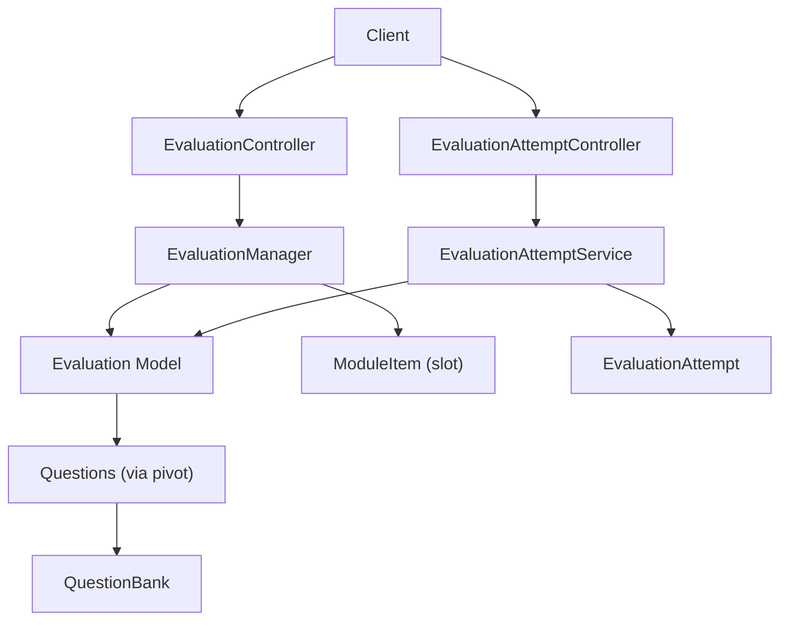
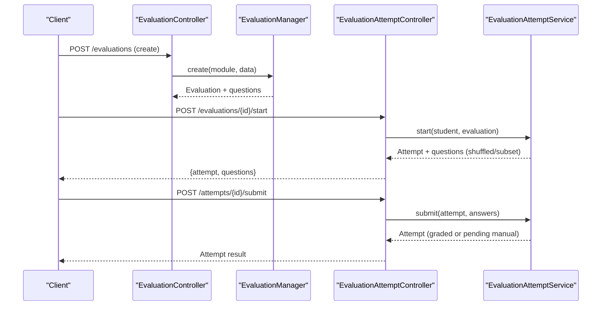
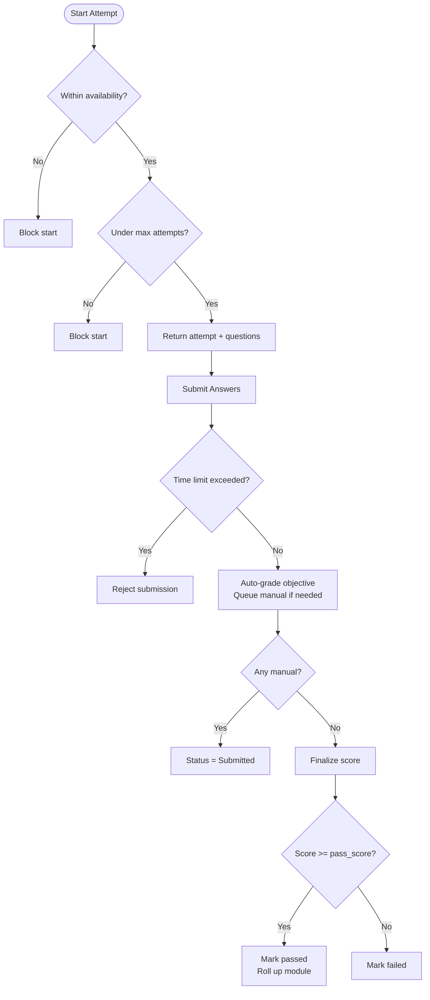
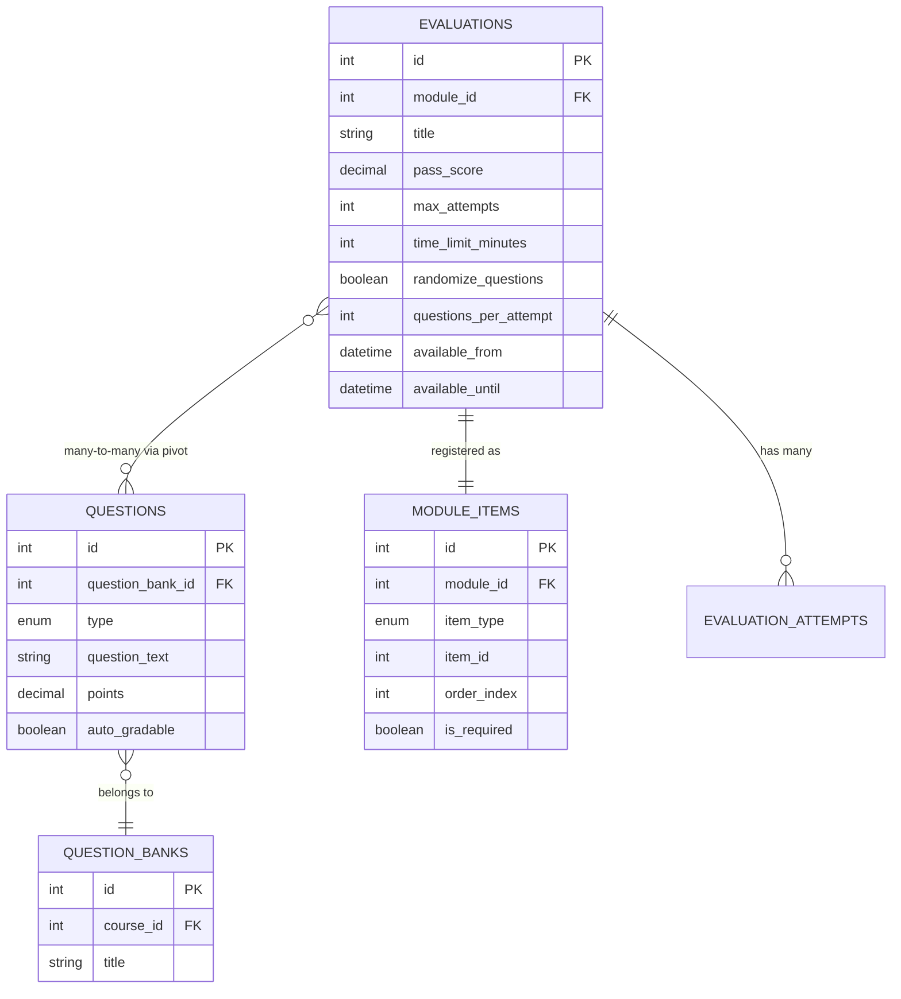
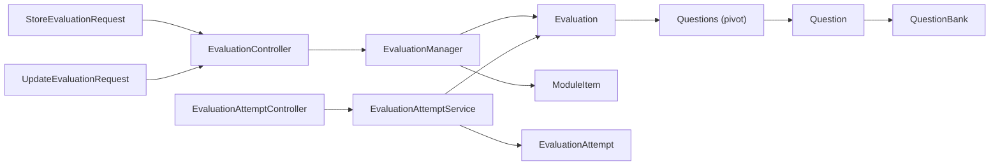

# Evaluation Creation & Configuration

<cite>
**Referenced Files in This Document**
- [Evaluation.php](file://app/Models/Evaluation.php)
- [EvaluationController.php](file://app/Http/Controllers/Api/V1/EvaluationController.php)
- [StoreEvaluationRequest.php](file://app/Http/Requests/Api/V1/StoreEvaluationRequest.php)
- [UpdateEvaluationRequest.php](file://app/Http/Requests/Api/V1/UpdateEvaluationRequest.php)
- [EvaluationManager.php](file://app/Services/Assessment/EvaluationManager.php)
- [Question.php](file://app/Models/Question.php)
- [QuestionType.php](file://app/Enums/QuestionType.php)
- [QuestionController.php](file://app/Http/Controllers/Api/V1/QuestionController.php)
- [QuestionManager.php](file://app/Services/Assessment/QuestionManager.php)
- [QuestionBank.php](file://app/Models/QuestionBank.php)
- [EvaluationAttempt.php](file://app/Models/EvaluationAttempt.php)
- [EvaluationAttemptController.php](file://app/Http/Controllers/Api/V1/EvaluationAttemptController.php)
- [EvaluationAttemptService.php](file://app/Services/Assessment/EvaluationAttemptService.php)
- [EvaluationResource.php](file://app/Http/Resources/EvaluationResource.php)
- [2024_01_01_000143_create_evaluations_table.php](file://database/migrations/2024_01_01_000143_create_evaluations_table.php)
</cite>

## Table of Contents
1. [Introduction](#introduction)
2. [Project Structure](#project-structure)
3. [Core Components](#core-components)
4. [Architecture Overview](#architecture-overview)
5. [Detailed Component Analysis](#detailed-component-analysis)
6. [Dependency Analysis](#dependency-analysis)
7. [Performance Considerations](#performance-considerations)
8. [Troubleshooting Guide](#troubleshooting-guide)
9. [Conclusion](#conclusion)
10. [Appendices](#appendices)

## Introduction
This document explains how to create and configure evaluations (quizzes) in the system, including supported question types, pass scores, time limits, availability windows, attempt rules, and integration with question banks and modules. It also covers API usage patterns, validation rules, and best practices for quiz design.

## Project Structure
Evaluations are managed through a controller, request validators, a service manager, and Eloquent models. Evaluations belong to modules and link to questions from question banks. Attempts capture student interactions and scoring.

**Diagram sources**
- [EvaluationController.php:20-48](file://app/Http/Controllers/Api/V1/EvaluationController.php#L20-L48)
- [EvaluationManager.php:28-87](file://app/Services/Assessment/EvaluationManager.php#L28-L87)
- [Evaluation.php:42-60](file://app/Models/Evaluation.php#L42-L60)
- [Question.php:39-57](file://app/Models/Question.php#L39-L57)
- [QuestionBank.php:28-38](file://app/Models/QuestionBank.php#L28-L38)
- [EvaluationAttemptController.php:27-82](file://app/Http/Controllers/Api/V1/EvaluationAttemptController.php#L27-L82)
- [EvaluationAttemptService.php:35-205](file://app/Services/Assessment/EvaluationAttemptService.php#L35-L205)

**Section sources**
- [EvaluationController.php:20-48](file://app/Http/Controllers/Api/V1/EvaluationController.php#L20-L48)
- [EvaluationManager.php:28-87](file://app/Services/Assessment/EvaluationManager.php#L28-L87)
- [Evaluation.php:19-60](file://app/Models/Evaluation.php#L19-L60)
- [EvaluationAttemptController.php:27-82](file://app/Http/Controllers/Api/V1/EvaluationAttemptController.php#L27-L82)
- [EvaluationAttemptService.php:35-205](file://app/Services/Assessment/EvaluationAttemptService.php#L35-L205)

## Core Components
- Evaluation model defines configuration fields such as pass_score, max_attempts, time_limit_minutes, randomize_questions, questions_per_attempt, and availability windows.
- EvaluationManager orchestrates creation/update/deletion and syncs linked questions and module item slot metadata.
- Request validators enforce input constraints for creating/updating evaluations.
- Question and QuestionBank models support multiple question types and options; auto-grading is derived from type.
- EvaluationAttemptService enforces attempt limits, time limits, availability windows, randomization/subsetting, auto-grading, manual grading flow, and final scoring.

Key properties on the Evaluation model include:
- pass_score: decimal percentage required to pass
- max_attempts: integer or null for unlimited retakes
- time_limit_minutes: integer minutes per attempt
- randomize_questions: boolean to shuffle order
- questions_per_attempt: integer to limit subset per attempt
- available_from / available_until: datetime window for opening/closing

**Section sources**
- [Evaluation.php:19-37](file://app/Models/Evaluation.php#L19-L37)
- [EvaluationManager.php:20-23](file://app/Services/Assessment/EvaluationManager.php#L20-L23)
- [StoreEvaluationRequest.php:18-34](file://app/Http/Requests/Api/V1/StoreEvaluationRequest.php#L18-L34)
- [UpdateEvaluationRequest.php:17-33](file://app/Http/Requests/Api/V1/UpdateEvaluationRequest.php#L17-L33)
- [Question.php:22-34](file://app/Models/Question.php#L22-L34)
- [QuestionType.php:7-14](file://app/Enums/QuestionType.php#L7-L14)
- [EvaluationAttemptService.php:35-97](file://app/Services/Assessment/EvaluationAttemptService.php#L35-L97)

## Architecture Overview
The evaluation lifecycle spans creation, configuration, and attempts:
- Create/update evaluations via EvaluationController using EvaluationManager.
- Link questions from question banks by IDs; order is preserved via pivot.
- Students start an attempt via EvaluationAttemptController; service validates availability, attempt limits, and returns randomized/subsetted questions.
- Submission triggers auto-grading for objective questions; short answer/essay require manual grading.
- Final score computed against pass_score; passing updates progress.

**Diagram sources**
- [EvaluationController.php:27-38](file://app/Http/Controllers/Api/V1/EvaluationController.php#L27-L38)
- [EvaluationManager.php:28-75](file://app/Services/Assessment/EvaluationManager.php#L28-L75)
- [EvaluationAttemptController.php:40-74](file://app/Http/Controllers/Api/V1/EvaluationAttemptController.php#L40-L74)
- [EvaluationAttemptService.php:35-148](file://app/Services/Assessment/EvaluationAttemptService.php#L35-L148)

## Detailed Component Analysis

### Evaluation Model and Scheduling
- Fields: title, description, pass_score, max_attempts, time_limit_minutes, randomize_questions, questions_per_attempt, available_from, available_until.
- Casting ensures numeric and boolean correctness and datetime parsing.
- Relationships: belongs to Module; many-to-many with Question via evaluation_questions pivot storing order_index; has many EvaluationAttempts.

Best practices:
- Use available_from/available_until to control when students can start attempts.
- Set max_attempts to allow retakes or lock after first try.
- Use time_limit_minutes to enforce exam timing.
- Use randomize_questions and questions_per_attempt to vary difficulty and reduce memorization.

**Section sources**
- [Evaluation.php:19-60](file://app/Models/Evaluation.php#L19-L60)
- [2024_01_01_000143_create_evaluations_table.php:13-25](file://database/migrations/2024_01_01_000143_create_evaluations_table.php#L13-L25)

### Creating and Updating Evaluations via API
- Endpoint: POST /modules/{module}/evaluations creates an evaluation and its module item slot.
- Endpoint: PUT /evaluations/{evaluation} updates configuration and optionally re-syncs questions and slot metadata.
- Validation rules ensure safe ranges and relationships.

Validation highlights:
- pass_score must be between 0 and 100.
- max_attempts and time_limit_minutes must be positive integers if provided.
- available_until must be after available_from if both set.
- question_ids must exist in the questions table.

Example setup steps:
1. Create questions in a question bank (see next section).
2. Create an evaluation under a module with desired settings.
3. Attach questions by IDs; order is preserved.
4. Optionally mark as required and set ordering within the module.

**Section sources**
- [EvaluationController.php:27-38](file://app/Http/Controllers/Api/V1/EvaluationController.php#L27-L38)
- [StoreEvaluationRequest.php:18-34](file://app/Http/Requests/Api/V1/StoreEvaluationRequest.php#L18-L34)
- [UpdateEvaluationRequest.php:17-33](file://app/Http/Requests/Api/V1/UpdateEvaluationRequest.php#L17-L33)
- [EvaluationManager.php:28-75](file://app/Services/Assessment/EvaluationManager.php#L28-L75)

### Question Types and Auto-Grading
Supported types:
- mcq_single: single correct option
- mcq_multi: multiple correct options
- true_false: binary choice
- short_answer: requires manual grading
- essay: requires manual grading

Auto-grading behavior:
- Objective types (mcq_single, mcq_multi, true_false) are auto-gradable; correct answers are determined by matching selected options to correct options.
- Short answer and essay are not auto-gradable and enter a manual grading queue until graded.

Creating questions:
- Use the question controller to add questions to a question bank with type, text, points, and options where applicable.

**Section sources**
- [QuestionType.php:7-14](file://app/Enums/QuestionType.php#L7-L14)
- [QuestionManager.php:19-47](file://app/Services/Assessment/QuestionManager.php#L19-L47)
- [QuestionController.php:19-23](file://app/Http/Controllers/Api/V1/QuestionController.php#L19-L23)
- [EvaluationAttemptService.php:114-148](file://app/Services/Assessment/EvaluationAttemptService.php#L114-L148)

### Attempt Flow, Time Limits, and Availability
- Start attempt: validates availability window and attempt limits; returns attempt and questions (shuffled/subsetted if configured).
- Submit attempt: enforces time limit if set; auto-grades objective questions; marks status Submitted if any manual grading needed; otherwise finalizes immediately.
- Manual grading: instructors grade short answer/essay responses; upon completion, final score is calculated and notifications sent.

Availability and limits:
- If current time is outside available_from/available_until, starting is blocked.
- If max_attempts reached, starting is blocked.
- If time_limit_minutes exceeded at submission, submission is rejected.

Scoring:
- Score percent = earned points / total points * 100.
- Passed if score_percent >= pass_score.
- Passing triggers module completion rollup.

**Diagram sources**
- [EvaluationAttemptService.php:35-97](file://app/Services/Assessment/EvaluationAttemptService.php#L35-L97)
- [EvaluationAttemptService.php:102-148](file://app/Services/Assessment/EvaluationAttemptService.php#L102-L148)
- [EvaluationAttemptService.php:183-205](file://app/Services/Assessment/EvaluationAttemptService.php#L183-L205)

**Section sources**
- [EvaluationAttemptController.php:40-82](file://app/Http/Controllers/Api/V1/EvaluationAttemptController.php#L40-L82)
- [EvaluationAttemptService.php:35-205](file://app/Services/Assessment/EvaluationAttemptService.php#L35-L205)

### Integration with Question Banks and Modules
- Questions belong to a QuestionBank and can be linked to evaluations by ID.
- EvaluationManager syncs question IDs into the pivot table with order_index to preserve sequence.
- Each evaluation is also registered as a ModuleItem so it appears in the module structure and can be marked required or ordered.

**Diagram sources**
- [2024_01_01_000143_create_evaluations_table.php:13-25](file://database/migrations/2024_01_01_000143_create_evaluations_table.php#L13-L25)
- [Question.php:22-57](file://app/Models/Question.php#L22-L57)
- [QuestionBank.php:20-38](file://app/Models/QuestionBank.php#L20-L38)
- [EvaluationManager.php:37-45](file://app/Services/Assessment/EvaluationManager.php#L37-L45)

**Section sources**
- [EvaluationManager.php:37-75](file://app/Services/Assessment/EvaluationManager.php#L37-L75)
- [Question.php:39-57](file://app/Models/Question.php#L39-L57)
- [QuestionBank.php:28-38](file://app/Models/QuestionBank.php#L28-L38)

## Dependency Analysis
- Controllers depend on services for business logic and authorization.
- Services coordinate models and external services (progress, notifications, audit).
- Models define relationships and casts that drive behavior.
- Requests encapsulate validation and authorization checks.

**Diagram sources**
- [StoreEvaluationRequest.php:13-34](file://app/Http/Requests/Api/V1/StoreEvaluationRequest.php#L13-L34)
- [UpdateEvaluationRequest.php:12-33](file://app/Http/Requests/Api/V1/UpdateEvaluationRequest.php#L12-L33)
- [EvaluationController.php:20-48](file://app/Http/Controllers/Api/V1/EvaluationController.php#L20-L48)
- [EvaluationManager.php:28-87](file://app/Services/Assessment/EvaluationManager.php#L28-L87)
- [Evaluation.php:42-60](file://app/Models/Evaluation.php#L42-L60)
- [Question.php:39-57](file://app/Models/Question.php#L39-L57)
- [QuestionBank.php:28-38](file://app/Models/QuestionBank.php#L28-L38)
- [EvaluationAttemptController.php:27-82](file://app/Http/Controllers/Api/V1/EvaluationAttemptController.php#L27-L82)
- [EvaluationAttemptService.php:35-205](file://app/Services/Assessment/EvaluationAttemptService.php#L35-L205)

**Section sources**
- [EvaluationController.php:20-48](file://app/Http/Controllers/Api/V1/EvaluationController.php#L20-L48)
- [EvaluationManager.php:28-87](file://app/Services/Assessment/EvaluationManager.php#L28-L87)
- [EvaluationAttemptController.php:27-82](file://app/Http/Controllers/Api/V1/EvaluationAttemptController.php#L27-L82)
- [EvaluationAttemptService.php:35-205](file://app/Services/Assessment/EvaluationAttemptService.php#L35-L205)

## Performance Considerations
- Use questions_per_attempt to limit question load for large banks.
- Enable randomize_questions to diversify attempts without duplicating content.
- Keep pass_score and max_attempts aligned with assessment goals to avoid excessive retries.
- Avoid overly broad time windows; use available_from/available_until to concentrate activity.
- For large classes, prefer objective questions to leverage auto-grading and reduce manual workload.

[No sources needed since this section provides general guidance]

## Troubleshooting Guide
Common issues and resolutions:
- Cannot start attempt due to availability: Ensure current time falls within available_from and available_until.
- Max attempts reached: Increase max_attempts or wait for policy changes.
- Submission rejected due to time limit: Reduce time_limit_minutes or ensure timely submission.
- Mixed objective and subjective questions: Expect manual grading queue; finalize only after instructor grades short answer/essay.
- Incorrect auto-grading results: Verify question options and correct flags; ensure mcq_multi matches all correct options.

Operational tips:
- Use the attempt index endpoint to review submissions and statuses.
- After manual grading, verify final score and passed flag.
- Confirm module completion rollup occurs when passed.

**Section sources**
- [EvaluationAttemptService.php:35-97](file://app/Services/Assessment/EvaluationAttemptService.php#L35-L97)
- [EvaluationAttemptService.php:102-148](file://app/Services/Assessment/EvaluationAttemptService.php#L102-L148)
- [EvaluationAttemptService.php:154-180](file://app/Services/Assessment/EvaluationAttemptService.php#L154-L180)
- [EvaluationAttemptService.php:183-205](file://app/Services/Assessment/EvaluationAttemptService.php#L183-L205)

## Conclusion
Evaluations provide a flexible assessment mechanism with configurable pass thresholds, attempt limits, time limits, and availability windows. They integrate tightly with question banks and module structures, supporting both automated and manual grading workflows. By following the validation rules and best practices outlined here, you can design effective quizzes that align with learning objectives and operational needs.

[No sources needed since this section summarizes without analyzing specific files]

## Appendices

### API Endpoints Summary
- Create evaluation: POST /modules/{module}/evaluations
- Update evaluation: PUT /evaluations/{evaluation}
- View evaluation: GET /evaluations/{evaluation}
- Delete evaluation: DELETE /evaluations/{evaluation}
- Start attempt: POST /evaluations/{evaluation}/start
- List attempts: GET /evaluations/{evaluation}/attempts
- Show attempt: GET /attempts/{attempt}
- Submit attempt: POST /attempts/{attempt}/submit
- Grade manual answers: PATCH/POST /attempts/{attempt}/grade

These endpoints are implemented by EvaluationController and EvaluationAttemptController and validated by their respective request classes.

**Section sources**
- [EvaluationController.php:20-48](file://app/Http/Controllers/Api/V1/EvaluationController.php#L20-L48)
- [EvaluationAttemptController.php:27-82](file://app/Http/Controllers/Api/V1/EvaluationAttemptController.php#L27-L82)
- [StoreEvaluationRequest.php:18-34](file://app/Http/Requests/Api/V1/StoreEvaluationRequest.php#L18-L34)
- [UpdateEvaluationRequest.php:17-33](file://app/Http/Requests/Api/V1/UpdateEvaluationRequest.php#L17-L33)

### Best Practices for Quiz Design
- Use mcq_single for quick knowledge checks; mcq_multi for comprehensive understanding; true_false sparingly; short_answer/essay for deeper reflection.
- Limit questions_per_attempt to focus assessment and reduce fatigue.
- Randomize questions to mitigate sharing and encourage mastery.
- Set realistic time_limit_minutes based on cognitive load and question count.
- Define clear pass_score thresholds aligned with competency levels.
- Leverage availability windows to schedule assessments during focused periods.
- Prefer objective questions for scalability; reserve manual grading for higher-order tasks.

[No sources needed since this section provides general guidance]