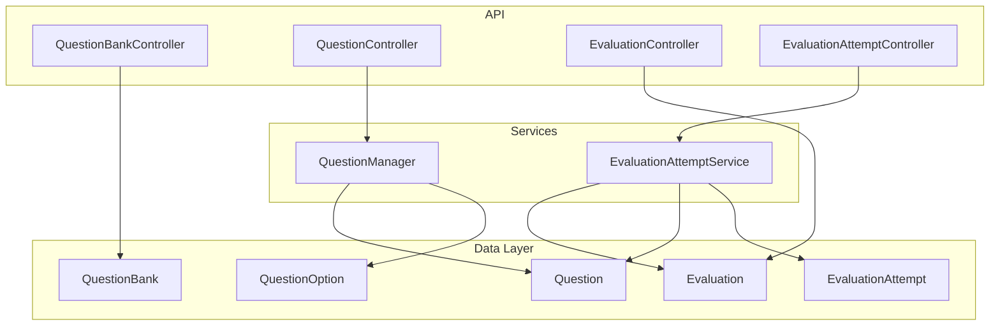
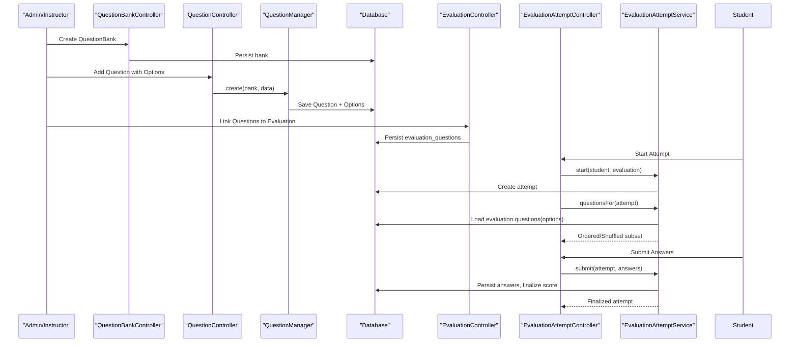
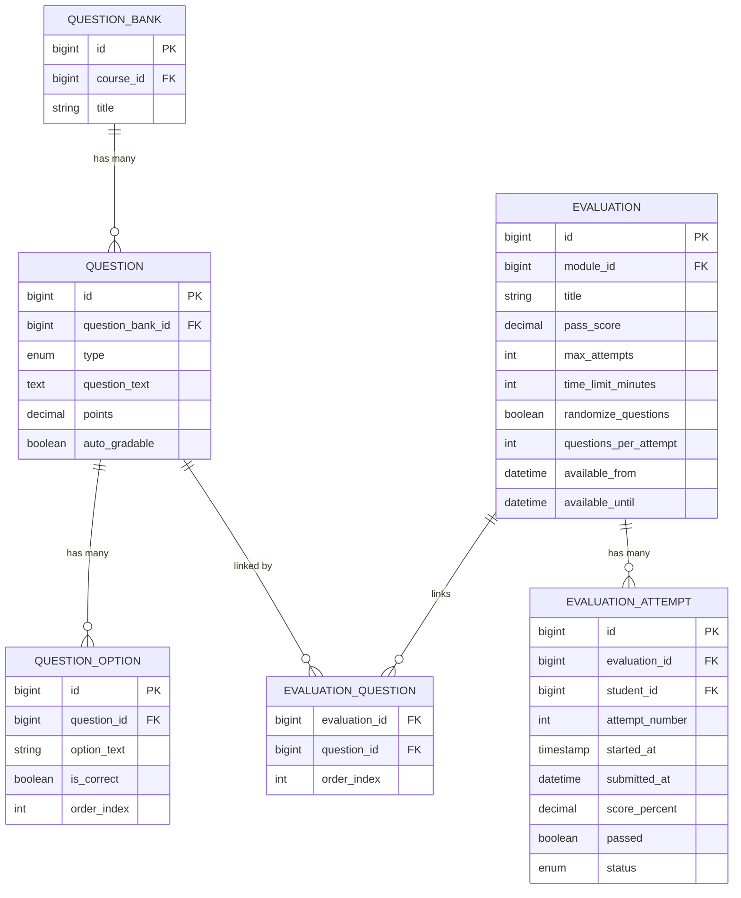
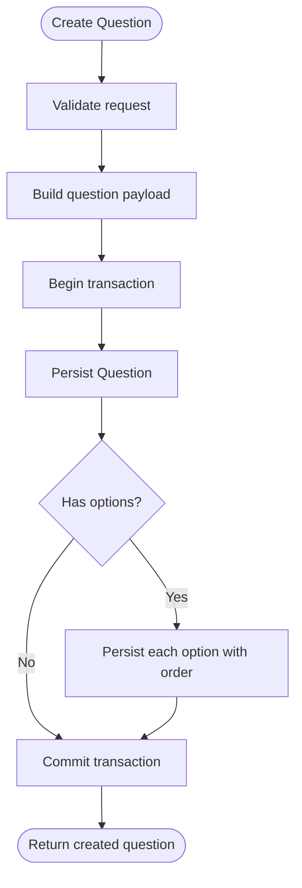
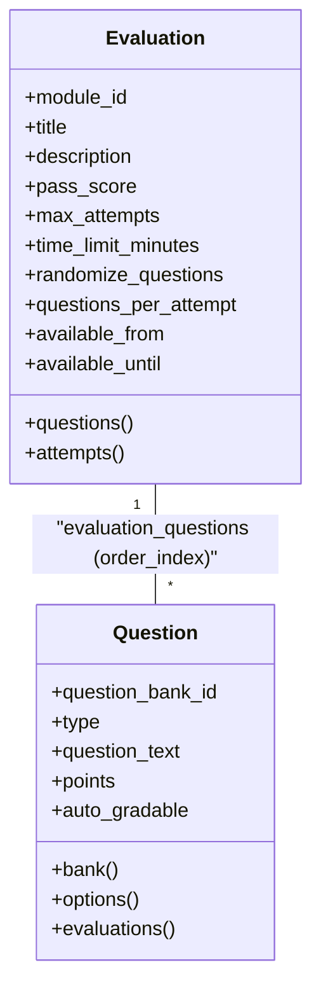
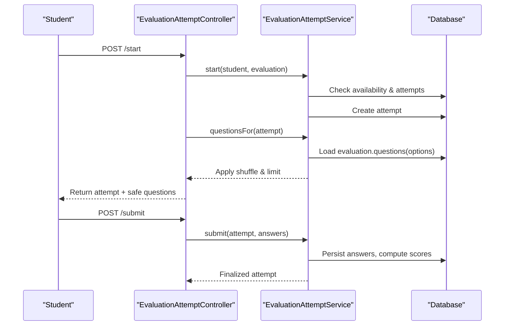
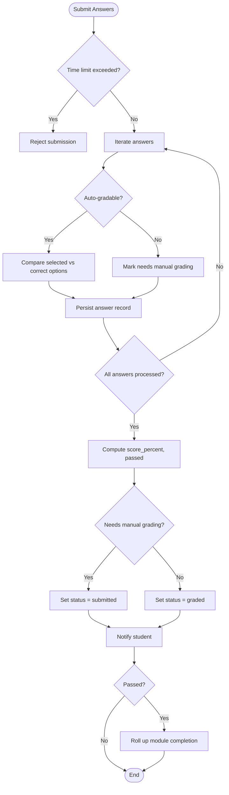
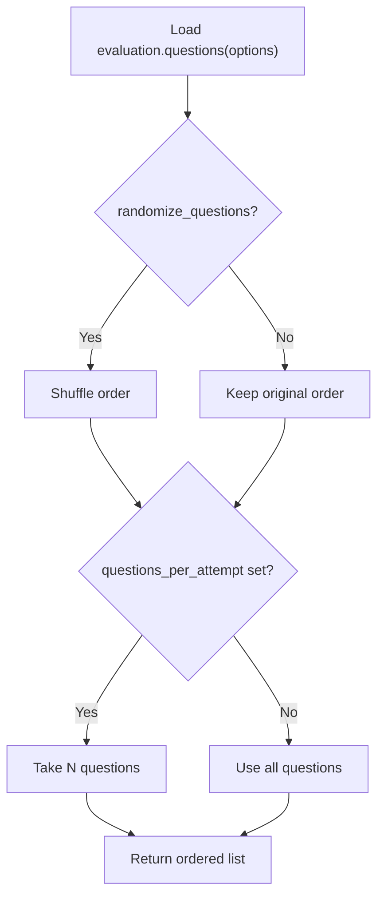
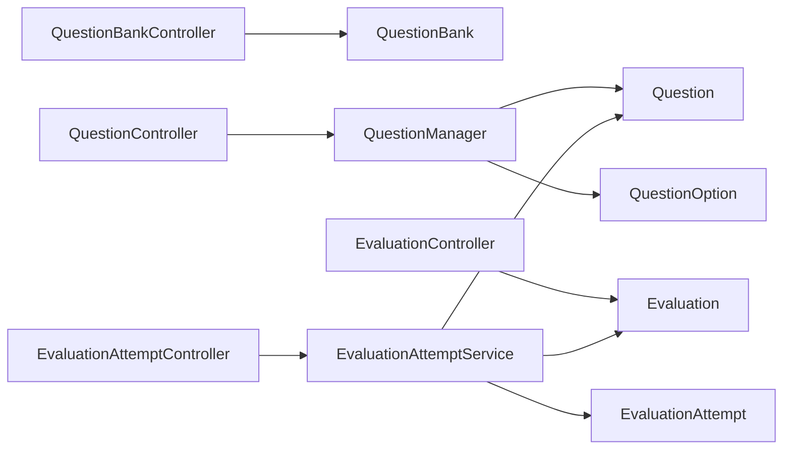

# Question Bank Integration

<cite>
**Referenced Files in This Document**
- [Question.php](file://app/Models/Question.php)
- [QuestionBank.php](file://app/Models/QuestionBank.php)
- [QuestionOption.php](file://app/Models/QuestionOption.php)
- [Evaluation.php](file://app/Models/Evaluation.php)
- [QuestionType.php](file://app/Enums/QuestionType.php)
- [QuestionManager.php](file://app\Services\Assessment\QuestionManager.php)
- [EvaluationAttemptService.php](file://app\Services\Assessment\EvaluationAttemptService.php)
- [QuestionBankController.php](file://app/Http/Controllers/Api/V1/QuestionBankController.php)
- [QuestionController.php](file://app/Http/Controllers/Api/V1/QuestionController.php)
- [EvaluationController.php](file://app/Http/Controllers/Api/V1/EvaluationController.php)
- [EvaluationAttemptController.php](file://app/Http/Controllers/Api/V1/EvaluationAttemptController.php)
- [2024_01_01_000141_create_questions_table.php](file://database/migrations/2024_01_01_000141_create_questions_table.php)
- [2024_01_01_000143_create_evaluations_table.php](file://database/migrations/2024_01_01_000143_create_evaluations_table.php)
- [2024_01_01_000144_create_evaluation_questions_table.php](file://database/migrations/2024_01_01_000144_create_evaluation_questions_table.php)
- [2024_01_01_000145_create_evaluation_attempts_table.php](file://database/migrations/2024_01_01_000145_create_evaluation_attempts_table.php)
</cite>

## Table of Contents
1. [Introduction](#introduction)
2. [Project Structure](#project-structure)
3. [Core Components](#core-components)
4. [Architecture Overview](#architecture-overview)
5. [Detailed Component Analysis](#detailed-component-analysis)
6. [Dependency Analysis](#dependency-analysis)
7. [Performance Considerations](#performance-considerations)
8. [Troubleshooting Guide](#troubleshooting-guide)
9. [Conclusion](#conclusion)
10. [Appendices](#appendices)

## Introduction
This document explains how questions are organized in question banks, retrieved for evaluations, and managed across assessments. It covers the data model for questions and options, supported question types, randomization and selection behavior during attempts, and the end-to-end flow from creating a bank to linking questions with an evaluation and running attempts. It also addresses versioning considerations, reuse patterns, and quality assurance practices grounded in the codebase.

## Project Structure
The question bank integration spans models, services, controllers, and database migrations:
- Models define entities: Question, QuestionBank, QuestionOption, Evaluation, and attempt-related tables via migrations.
- Services encapsulate business logic: QuestionManager for CRUD on questions and options; EvaluationAttemptService for starting attempts, selecting questions, submitting answers, grading, and finalizing scores.
- Controllers expose API endpoints for managing banks/questions and for attempting evaluations.
- Migrations define schema for questions, options, evaluations, and attempt artifacts.

**Diagram sources**
- [Question.php:15-58](file://app/Models/Question.php#L15-L58)
- [QuestionBank.php:13-39](file://app/Models/QuestionBank.php#L13-L39)
- [QuestionOption.php:12-36](file://app/Models/QuestionOption.php#L12-L36)
- [Evaluation.php:14-61](file://app/Models/Evaluation.php#L14-L61)
- [QuestionManager.php:17-53](file://app/Services/Assessment/QuestionManager.php#L17-L53)
- [EvaluationAttemptService.php:26-218](file://app/Services/Assessment/EvaluationAttemptService.php#L26-L218)
- [QuestionBankController.php:15-39](file://app/Http/Controllers/Api/V1/QuestionBankController.php#L15-L39)
- [QuestionController.php:15-34](file://app/Http/Controllers/Api/V1/QuestionController.php#L15-L34)
- [EvaluationController.php:16-49](file://app/Http/Controllers/Api/V1/EvaluationController.php#L16-L49)
- [EvaluationAttemptController.php:19-83](file://app/Http/Controllers/Api/V1/EvaluationAttemptController.php#L19-L83)

**Section sources**
- [Question.php:15-58](file://app/Models/Question.php#L15-L58)
- [QuestionBank.php:13-39](file://app/Models/QuestionBank.php#L13-L39)
- [QuestionOption.php:12-36](file://app/Models/QuestionOption.php#L12-L36)
- [Evaluation.php:14-61](file://app/Models/Evaluation.php#L14-L61)
- [QuestionManager.php:17-53](file://app/Services/Assessment/QuestionManager.php#L17-L53)
- [EvaluationAttemptService.php:26-218](file://app/Services/Assessment/EvaluationAttemptService.php#L26-L218)
- [QuestionBankController.php:15-39](file://app/Http/Controllers/Api/V1/QuestionBankController.php#L15-L39)
- [QuestionController.php:15-34](file://app/Http/Controllers/Api/V1/QuestionController.php#L15-L34)
- [EvaluationController.php:16-49](file://app/Http/Controllers/Api/V1/EvaluationController.php#L16-L49)
- [EvaluationAttemptController.php:19-83](file://app/Http/Controllers/Api/V1/EvaluationAttemptController.php#L19-L83)

## Core Components
- Question: Represents a single assessment item with type, text, points, and auto-grading capability. Linked to a QuestionBank and to Evaluations through a pivot table that preserves order.
- QuestionBank: A container of questions scoped to a course.
- QuestionOption: Multiple-choice or true/false options attached to a question, including correctness flags and ordering.
- Evaluation: An assessment linked to a module with configuration such as pass score, max attempts, time limit, randomization, and per-attempt question count.
- EvaluationAttempt: A student’s attempt at an evaluation, tracking timing, status, and scoring.

Key relationships:
- Question belongs to QuestionBank; has many QuestionOptions; belongs to many Evaluations via evaluation_questions with order_index.
- Evaluation belongs to Module; has many Questions (pivot); has many Attempts.
- Attempt belongs to Evaluation and Student; stores attempt_number, started_at, submitted_at, score_percent, passed, status.

Supported question types:
- mcq_single, mcq_multi, true_false, short_answer, essay. Auto-grading is enabled only for objective types (mcq_single, mcq_multi, true_false).

**Section sources**
- [Question.php:15-58](file://app/Models/Question.php#L15-L58)
- [QuestionBank.php:13-39](file://app/Models/QuestionBank.php#L13-L39)
- [QuestionOption.php:12-36](file://app/Models/QuestionOption.php#L12-L36)
- [Evaluation.php:14-61](file://app/Models/Evaluation.php#L14-L61)
- [QuestionType.php:7-14](file://app/Enums/QuestionType.php#L7-L14)
- [2024_01_01_000141_create_questions_table.php:11-21](file://database/migrations/2024_01_01_000141_create_questions_table.php#L11-L21)
- [2024_01_01_000143_create_evaluations_table.php:11-25](file://database/migrations/2024_01_01_000143_create_evaluations_table.php#L11-L25)
- [2024_01_01_000144_create_evaluation_questions_table.php:11-18](file://database/migrations/2024_01_01_000144_create_evaluation_questions_table.php#L11-L18)
- [2024_01_01_000145_create_evaluation_attempts_table.php:11-24](file://database/migrations/2024_01_01_000145_create_evaluation_attempts_table.php#L11-L24)

## Architecture Overview
The system separates content authoring (banks and questions) from assessment execution (evaluations and attempts). Authors create banks and add questions with options. Instructors link questions to evaluations and configure attempt behavior. Students start attempts, receive a randomized or ordered set of questions based on evaluation settings, submit answers, and receive scores. Manual grading applies to non-auto-gradable questions.

**Diagram sources**
- [QuestionBankController.php:17-28](file://app/Http/Controllers/Api/V1/QuestionBankController.php#L17-L28)
- [QuestionController.php:19-23](file://app/Http/Controllers/Api/V1/QuestionController.php#L19-L23)
- [QuestionManager.php:24-47](file://app/Services/Assessment/QuestionManager.php#L24-L47)
- [EvaluationController.php:20-38](file://app/Http/Controllers/Api/V1/EvaluationController.php#L20-L38)
- [EvaluationAttemptController.php:40-74](file://app/Http/Controllers/Api/V1/EvaluationAttemptController.php#L40-L74)
- [EvaluationAttemptService.php:35-97](file://app/Services/Assessment/EvaluationAttemptService.php#L35-L97)
- [EvaluationAttemptService.php:102-148](file://app/Services/Assessment/EvaluationAttemptService.php#L102-L148)

## Detailed Component Analysis

### Data Model and Relationships
- QuestionBank owns multiple Questions.
- Question holds type, text, points, and auto_gradable flag; links to options and evaluations.
- QuestionOption stores option_text, is_correct, and order_index per question.
- Evaluation configures attempt behavior and links to questions via evaluation_questions with order_index.
- EvaluationAttempt records per-student attempts with status transitions and scoring.

**Diagram sources**
- [QuestionBank.php:13-39](file://app/Models/QuestionBank.php#L13-L39)
- [Question.php:15-58](file://app/Models/Question.php#L15-L58)
- [QuestionOption.php:12-36](file://app/Models/QuestionOption.php#L12-L36)
- [Evaluation.php:14-61](file://app/Models/Evaluation.php#L14-L61)
- [2024_01_01_000141_create_questions_table.php:11-21](file://database/migrations/2024_01_01_000141_create_questions_table.php#L11-L21)
- [2024_01_01_000143_create_evaluations_table.php:11-25](file://database/migrations/2024_01_01_000143_create_evaluations_table.php#L11-L25)
- [2024_01_01_000144_create_evaluation_questions_table.php:11-18](file://database/migrations/2024_01_01_000144_create_evaluation_questions_table.php#L11-L18)
- [2024_01_01_000145_create_evaluation_attempts_table.php:11-24](file://database/migrations/2024_01_01_000145_create_evaluation_attempts_table.php#L11-L24)

**Section sources**
- [Question.php:15-58](file://app/Models/Question.php#L15-L58)
- [QuestionBank.php:13-39](file://app/Models/QuestionBank.php#L13-L39)
- [QuestionOption.php:12-36](file://app/Models/QuestionOption.php#L12-L36)
- [Evaluation.php:14-61](file://app/Models/Evaluation.php#L14-L61)
- [2024_01_01_000141_create_questions_table.php:11-21](file://database/migrations/2024_01_01_000141_create_questions_table.php#L11-L21)
- [2024_01_01_000143_create_evaluations_table.php:11-25](file://database/migrations/2024_01_01_000143_create_evaluations_table.php#L11-L25)
- [2024_01_01_000144_create_evaluation_questions_table.php:11-18](file://database/migrations/2024_01_01_000144_create_evaluation_questions_table.php#L11-L18)
- [2024_01_01_000145_create_evaluation_attempts_table.php:11-24](file://database/migrations/2024_01_01_000145_create_evaluation_attempts_table.php#L11-L24)

### Question Creation and Option Management
- Creating a question: The controller delegates to QuestionManager::create, which persists the question and its options within a transaction. Auto-grading is derived from the question type, not client input.
- Options: Each option includes text, correctness, and order. Correctness determines auto-grading outcomes for objective questions.

**Diagram sources**
- [QuestionController.php:19-23](file://app/Http/Controllers/Api/V1/QuestionController.php#L19-L23)
- [QuestionManager.php:24-47](file://app/Services/Assessment/QuestionManager.php#L24-L47)

**Section sources**
- [QuestionController.php:19-23](file://app/Http/Controllers/Api/V1/QuestionController.php#L19-L23)
- [QuestionManager.php:24-47](file://app/Services/Assessment/QuestionManager.php#L24-L47)

### Evaluation Configuration and Question Linking
- Evaluations are scoped to modules and include pass score, attempt limits, time limits, randomization, and per-attempt question count.
- Questions are linked to evaluations via a pivot table that preserves order.

**Diagram sources**
- [Evaluation.php:14-61](file://app/Models/Evaluation.php#L14-L61)
- [Question.php:15-58](file://app/Models/Question.php#L15-L58)
- [2024_01_01_000144_create_evaluation_questions_table.php:11-18](file://database/migrations/2024_01_01_000144_create_evaluation_questions_table.php#L11-L18)

**Section sources**
- [Evaluation.php:14-61](file://app/Models/Evaluation.php#L14-L61)
- [2024_01_01_000144_create_evaluation_questions_table.php:11-18](file://database/migrations/2024_01_01_000144_create_evaluation_questions_table.php#L11-L18)

### Attempt Lifecycle and Question Selection
- Starting an attempt validates availability windows, enforces max attempts, and creates an in-progress attempt.
- Question selection loads all linked questions with options, optionally shuffles them if configured, and truncates to questions_per_attempt when set.
- Submission validates time limits, auto-grades objective questions, queues manual grading for others, and finalizes scores.

**Diagram sources**
- [EvaluationAttemptController.php:40-74](file://app/Http/Controllers/Api/V1/EvaluationAttemptController.php#L40-L74)
- [EvaluationAttemptService.php:35-97](file://app/Services/Assessment/EvaluationAttemptService.php#L35-L97)
- [EvaluationAttemptService.php:102-148](file://app/Services/Assessment/EvaluationAttemptService.php#L102-L148)

**Section sources**
- [EvaluationAttemptController.php:40-74](file://app/Http/Controllers/Api/V1/EvaluationAttemptController.php#L40-L74)
- [EvaluationAttemptService.php:35-97](file://app/Services/Assessment/EvaluationAttemptService.php#L35-L97)
- [EvaluationAttemptService.php:102-148](file://app/Services/Assessment/EvaluationAttemptService.php#L102-L148)

### Grading and Scoring
- Objective questions (mcq_single, mcq_multi, true_false) are auto-graded by comparing selected options to correct options.
- Non-objective questions (short_answer, essay) require manual grading; attempts transition to submitted until graded.
- Finalization computes percentage, determines pass/fail against pass_score, updates status, notifies students, and rolls up module completion when passed.

**Diagram sources**
- [EvaluationAttemptService.php:102-148](file://app/Services/Assessment/EvaluationAttemptService.php#L102-L148)
- [EvaluationAttemptService.php:183-205](file://app/Services/Assessment/EvaluationAttemptService.php#L183-L205)
- [EvaluationAttemptService.php:211-217](file://app/Services/Assessment/EvaluationAttemptService.php#L211-L217)

**Section sources**
- [EvaluationAttemptService.php:102-148](file://app/Services/Assessment/EvaluationAttemptService.php#L102-L148)
- [EvaluationAttemptService.php:183-205](file://app/Services/Assessment/EvaluationAttemptService.php#L183-L205)
- [EvaluationAttemptService.php:211-217](file://app/Services/Assessment/EvaluationAttemptService.php#L211-L217)

### Randomization and Question Subsetting
- Randomization: When enabled, questions are shuffled before delivery to the student.
- Subsetting: If questions_per_attempt is set, only that number of questions are presented per attempt.
- These behaviors are applied after loading all linked questions with their options.

**Diagram sources**
- [EvaluationAttemptService.php:83-97](file://app/Services/Assessment/EvaluationAttemptService.php#L83-L97)

**Section sources**
- [EvaluationAttemptService.php:83-97](file://app/Services/Assessment/EvaluationAttemptService.php#L83-L97)

### Versioning, Reuse, and Quality Assurance
- Versioning: The current schema does not include explicit version fields on questions or options. Changes to a question affect all evaluations referencing it. To support versioning, consider adding versioned snapshots or immutable question IDs per evaluation linkage.
- Reuse: Questions are reusable across evaluations via the evaluation_questions pivot. Order can be preserved per evaluation using order_index.
- Quality assurance:
  - Auto-grading is enforced server-side based on question type, preventing client manipulation.
  - Transactional writes ensure consistency when creating questions/options and submitting attempts.
  - Availability windows and attempt limits protect assessment integrity.
  - Manual grading workflow ensures coverage for subjective items.

[No sources needed since this section synthesizes policy and design implications without quoting specific lines]

## Dependency Analysis
- Controllers depend on services for business rules; services depend on models and database transactions.
- Models define relationships that drive query composition for attempt flows.
- Migrations define constraints and indexes that underpin performance and referential integrity.

**Diagram sources**
- [QuestionBankController.php:15-39](file://app/Http/Controllers/Api/V1/QuestionBankController.php#L15-L39)
- [QuestionController.php:15-34](file://app/Http/Controllers/Api/V1/QuestionController.php#L15-L34)
- [QuestionManager.php:17-53](file://app/Services/Assessment/QuestionManager.php#L17-L53)
- [EvaluationController.php:16-49](file://app/Http/Controllers/Api/V1/EvaluationController.php#L16-L49)
- [EvaluationAttemptController.php:19-83](file://app/Http/Controllers/Api/V1/EvaluationAttemptController.php#L19-L83)
- [EvaluationAttemptService.php:26-218](file://app/Services/Assessment/EvaluationAttemptService.php#L26-L218)

**Section sources**
- [QuestionBankController.php:15-39](file://app/Http/Controllers/Api/V1/QuestionBankController.php#L15-L39)
- [QuestionController.php:15-34](file://app/Http/Controllers/Api/V1/QuestionController.php#L15-L34)
- [QuestionManager.php:17-53](file://app/Services/Assessment/QuestionManager.php#L17-L53)
- [EvaluationController.php:16-49](file://app/Http/Controllers/Api/V1/EvaluationController.php#L16-L49)
- [EvaluationAttemptController.php:19-83](file://app/Http/Controllers/Api/V1/EvaluationAttemptController.php#L19-L83)
- [EvaluationAttemptService.php:26-218](file://app/Services/Assessment/EvaluationAttemptService.php#L26-L218)

## Performance Considerations
- Loading questions with options: Ensure eager loading to avoid N+1 queries when rendering attempts or admin views.
- Shuffling large question sets: For very large banks, consider pagination or sampling strategies to reduce memory usage during shuffle.
- Indexes: The attempts table includes a student index to optimize lookup for active attempts and counts.
- Transactions: Use transactions for multi-step operations like creating questions/options and submitting attempts to maintain consistency.

[No sources needed since this section provides general guidance]

## Troubleshooting Guide
Common issues and resolutions:
- Attempt blocked due to availability window: Verify evaluation.available_from and available_until.
- Max attempts reached: Check evaluation.max_attempts and existing attempts count.
- Time limit exceeded on submit: Confirm evaluation.time_limit_minutes and attempt.started_at.
- Manual grading required: Short answer/essay questions will leave attempts in submitted status until graded.
- Incorrect auto-grading results: Ensure options have correct is_correct flags and that question type supports auto-grading.

Operational checks:
- Review attempt status transitions and timestamps to diagnose where the process halted.
- Inspect evaluation configuration for randomization and subsetting to confirm expected question sets.

**Section sources**
- [EvaluationAttemptService.php:35-77](file://app/Services/Assessment/EvaluationAttemptService.php#L35-L77)
- [EvaluationAttemptService.php:102-148](file://app/Services/Assessment/EvaluationAttemptService.php#L102-L148)
- [EvaluationAttemptService.php:183-205](file://app/Services/Assessment/EvaluationAttemptService.php#L183-L205)

## Conclusion
The question bank integration provides a robust foundation for organizing questions, linking them to evaluations, and executing attempts with configurable randomization and subsetting. Auto-grading for objective questions streamlines scoring, while manual grading accommodates subjective items. The current design emphasizes reusability and simplicity; future enhancements could introduce explicit versioning and advanced difficulty balancing mechanisms.

[No sources needed since this section summarizes without analyzing specific files]

## Appendices

### Example Workflows

- Create a question bank and add questions:
  - Create a bank under a course.
  - Add questions with appropriate types and options.
  - Reference: [QuestionBankController.php:17-28](file://app/Http/Controllers/Api/V1/QuestionBankController.php#L17-L28), [QuestionController.php:19-23](file://app/Http/Controllers/Api/V1/QuestionController.php#L19-L23), [QuestionManager.php:24-47](file://app/Services/Assessment/QuestionManager.php#L24-L47)

- Link questions to an evaluation:
  - Configure evaluation settings (pass score, attempts, time limit, randomization, per-attempt count).
  - Associate questions with the evaluation to preserve order.
  - Reference: [EvaluationController.php:20-38](file://app/Http/Controllers/Api/V1/EvaluationController.php#L20-L38), [2024_01_01_000144_create_evaluation_questions_table.php:11-18](file://database/migrations/2024_01_01_000144_create_evaluation_questions_table.php#L11-L18)

- Run an attempt:
  - Start an attempt to receive a safe question set.
  - Submit answers; objective questions auto-grade; subjective items await manual grading.
  - Reference: [EvaluationAttemptController.php:40-74](file://app/Http/Controllers/Api/V1/EvaluationAttemptController.php#L40-L74), [EvaluationAttemptService.php:35-97](file://app/Services/Assessment/EvaluationAttemptService.php#L35-L97), [EvaluationAttemptService.php:102-148](file://app/Services/Assessment/EvaluationAttemptService.php#L102-L148)