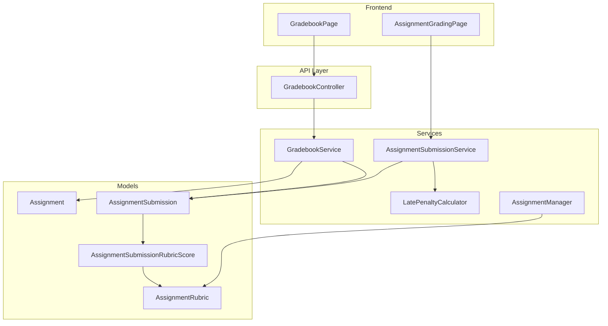
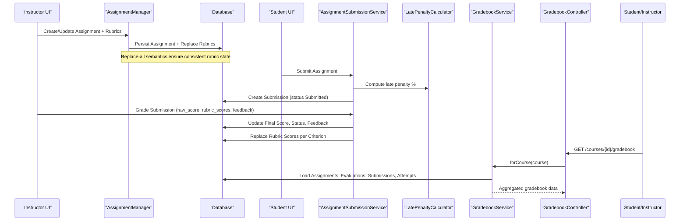
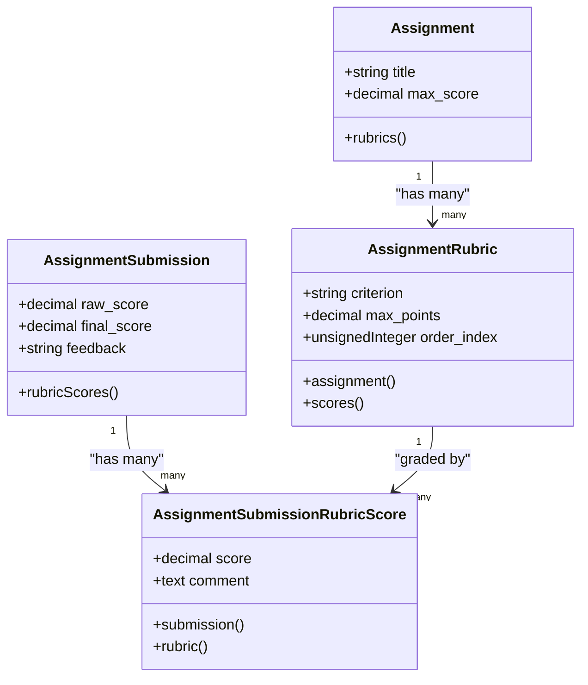
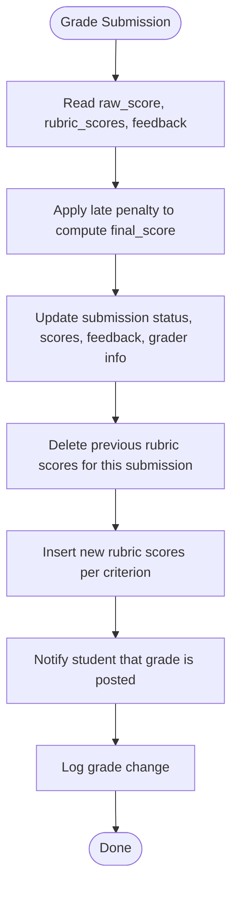
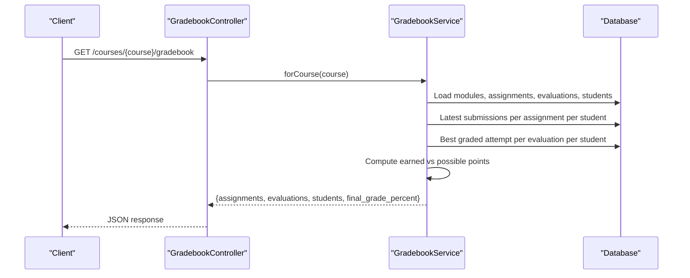
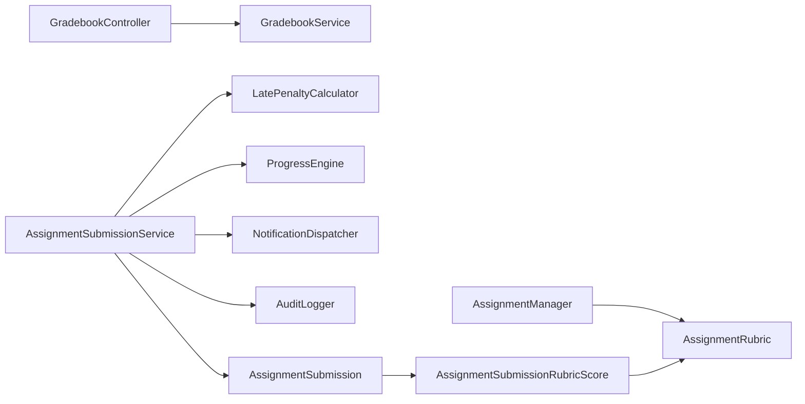

# Grading & Rubrics

<cite>
**Referenced Files in This Document**
- [GradebookService.php](file://app/Services/Assessment/GradebookService.php)
- [AssignmentSubmissionService.php](file://app/Services/Assessment/AssignmentSubmissionService.php)
- [LatePenaltyCalculator.php](file://app/Services/Assessment/LatePenaltyCalculator.php)
- [AssignmentManager.php](file://app/Services/Assessment/AssignmentManager.php)
- [GradebookController.php](file://app/Http/Controllers/Api/V1/GradebookController.php)
- [AssignmentRubric.php](file://app/Models/AssignmentRubric.php)
- [AssignmentSubmission.php](file://app/Models/AssignmentSubmission.php)
- [AssignmentSubmissionRubricScore.php](file://app/Models/AssignmentSubmissionRubricScore.php)
- [AssignmentRubricResource.php](file://app/Http/Resources/AssignmentRubricResource.php)
- [AssignmentSubmissionRubricScoreResource.php](file://app/Http/Resources/AssignmentSubmissionRubricScoreResource.php)
- [2024_01_01_000133_create_assignment_rubrics_table.php](file://database/migrations/2024_01_01_000133_create_assignment_rubrics_table.php)
- [2024_01_01_000135_create_assignment_submission_rubric_scores_table.php](file://database/migrations/2024_01_01_000135_create_assignment_submission_rubric_scores_table.php)
- [AssignmentGradingPage.tsx](file://frontend/src/features/assessment/AssignmentGradingPage.tsx)
- [GradebookPage.tsx](file://frontend/src/features/assessment/GradebookPage.tsx)
</cite>

## Table of Contents
1. Introduction
2. Project Structure
3. Core Components
4. Architecture Overview
5. Detailed Component Analysis
6. Dependency Analysis
7. Performance Considerations
8. Troubleshooting Guide
9. Conclusion
10. Appendices

## Introduction
This document explains the Grading and Rubrics system for assignments and evaluations, focusing on rubric creation, criteria definition, score calculation, and final grade determination. It covers the GradebookService implementation for computing per-student grades across a course, weighted scoring via assignment max scores and evaluation percent scores, manual grading workflows with rubric-based feedback, late penalties, and the gradebook view consumed by the frontend. It also outlines how to extend the system for automated grading, partial credit allocation, grade overrides, export functionality, and integration with institutional systems.

## Project Structure
The grading and rubrics feature spans services, models, resources, controllers, migrations, and frontend pages:
- Services: Assignment submission lifecycle, late penalty calculation, assignment management (including rubric sync), and course-grade aggregation.
- Models: Assignment, Submission, Rubric, and Rubric Score entities with relationships.
- Resources: JSON serialization for rubrics and rubric scores.
- Controller: API endpoint to fetch the course gradebook.
- Migrations: Schema for rubrics and per-submission rubric scores.
- Frontend: Instructor grading page and student/course gradebook view.

**Diagram sources**
- [GradebookController.php:16-21](file://app/Http/Controllers/Api/V1/GradebookController.php#L16-L21)
- [GradebookService.php:31-119](file://app/Services/Assessment/GradebookService.php#L31-L119)
- [AssignmentSubmissionService.php:37-115](file://app/Services/Assessment/AssignmentSubmissionService.php#L37-L115)
- [LatePenaltyCalculator.php:17-34](file://app/Services/Assessment/LatePenaltyCalculator.php#L17-L34)
- [AssignmentManager.php:26-113](file://app/Services/Assessment/AssignmentManager.php#L26-L113)
- [AssignmentRubric.php:13-46](file://app/Models/AssignmentRubric.php#L13-L46)
- [AssignmentSubmission.php:15-89](file://app/Models/AssignmentSubmission.php#L15-L89)
- [AssignmentSubmissionRubricScore.php:10-41](file://app/Models/AssignmentSubmissionRubricScore.php#L10-L41)
- [AssignmentGradingPage.tsx:40-74](file://frontend/src/features/assessment/AssignmentGradingPage.tsx#L40-L74)
- [GradebookPage.tsx:56-83](file://frontend/src/features/assessment/GradebookPage.tsx#L56-L83)

**Section sources**
- [GradebookController.php:16-21](file://app/Http/Controllers/Api/V1/GradebookController.php#L16-L21)
- [GradebookService.php:31-119](file://app/Services/Assessment/GradebookService.php#L31-L119)
- [AssignmentSubmissionService.php:37-115](file://app/Services/Assessment/AssignmentSubmissionService.php#L37-L115)
- [LatePenaltyCalculator.php:17-34](file://app/Services/Assessment/LatePenaltyCalculator.php#L17-L34)
- [AssignmentManager.php:26-113](file://app/Services/Assessment/AssignmentManager.php#L26-L113)
- [AssignmentRubric.php:13-46](file://app/Models/AssignmentRubric.php#L13-L46)
- [AssignmentSubmission.php:15-89](file://app/Models/AssignmentSubmission.php#L15-L89)
- [AssignmentSubmissionRubricScore.php:10-41](file://app/Models/AssignmentSubmissionRubricScore.php#L10-L41)
- [AssignmentGradingPage.tsx:40-74](file://frontend/src/features/assessment/AssignmentGradingPage.tsx#L40-L74)
- [GradebookPage.tsx:56-83](file://frontend/src/features/assessment/GradebookPage.tsx#L56-L83)

## Core Components
- Rubric model and persistence: Defines criteria and maximum points per criterion; linked to assignments and graded per submission.
- Submission grading: Computes raw and final scores, applies late penalties, stores rubric-based scores and instructor feedback.
- Rubric synchronization: Replaces all rubric criteria atomically when creating or updating an assignment.
- Gradebook aggregation: Builds a per-course view combining assignment scores and evaluation attempts into a final percentage.

Key responsibilities:
- AssignmentManager: Creates/updates assignments and synchronizes rubric criteria as a replace-all set.
- AssignmentSubmissionService: Handles submission lifecycle, late penalty application, grading, rubric score storage, notifications, audit logging.
- LatePenaltyCalculator: Determines penalty percentage based on configured tiers.
- GradebookService: Aggregates latest assignment submissions and best evaluation attempts to compute final grade percentages.

**Section sources**
- [AssignmentManager.php:26-113](file://app/Services/Assessment/AssignmentManager.php#L26-L113)
- [AssignmentSubmissionService.php:37-115](file://app/Services/Assessment/AssignmentSubmissionService.php#L37-L115)
- [LatePenaltyCalculator.php:17-34](file://app/Services/Assessment/LatePenaltyCalculator.php#L17-L34)
- [GradebookService.php:31-119](file://app/Services/Assessment/GradebookService.php#L31-L119)

## Architecture Overview
The system supports two primary flows:
- Rubric creation and assignment authoring: Instructors define criteria and point allocations; these are persisted and later used during grading.
- Grading and aggregation: Students submit work; instructors grade using rubrics; the gradebook aggregates results across assignments and evaluations.

**Diagram sources**
- [AssignmentManager.php:26-113](file://app/Services/Assessment/AssignmentManager.php#L26-L113)
- [AssignmentSubmissionService.php:37-115](file://app/Services/Assessment/AssignmentSubmissionService.php#L37-L115)
- [LatePenaltyCalculator.php:17-34](file://app/Services/Assessment/LatePenaltyCalculator.php#L17-L34)
- [GradebookController.php:16-21](file://app/Http/Controllers/Api/V1/GradebookController.php#L16-L21)
- [GradebookService.php:31-119](file://app/Services/Assessment/GradebookService.php#L31-L119)

## Detailed Component Analysis

### Rubric Creation and Criteria Definition
- Rubric criteria include a human-readable label and maximum points; order is preserved via index.
- When creating or updating an assignment, rubrics are replaced entirely to avoid drift between criteria and grading expectations.
- The database schema enforces foreign keys and uniqueness constraints for rubric-score entries per submission.

**Diagram sources**
- [AssignmentRubric.php:13-46](file://app/Models/AssignmentRubric.php#L13-L46)
- [AssignmentSubmission.php:15-89](file://app/Models/AssignmentSubmission.php#L15-L89)
- [AssignmentSubmissionRubricScore.php:10-41](file://app/Models/AssignmentSubmissionRubricScore.php#L10-L41)

**Section sources**
- [AssignmentManager.php:26-113](file://app/Services/Assessment/AssignmentManager.php#L26-L113)
- [2024_01_01_000133_create_assignment_rubrics_table.php:13-19](file://database/migrations/2024_01_01_000133_create_assignment_rubrics_table.php#L13-L19)
- [2024_01_01_000135_create_assignment_submission_rubric_scores_table.php:13-20](file://database/migrations/2024_01_01_000135_create_assignment_submission_rubric_scores_table.php#L13-L20)

### Manual Grading Workflow with Rubrics
- Instructors enter a raw score and optional rubric-based scores per criterion along with feedback.
- The service computes final score by applying late penalty percentage to the raw score.
- Rubric scores are replaced atomically to reflect the current grading session.

**Diagram sources**
- [AssignmentSubmissionService.php:72-115](file://app/Services/Assessment/AssignmentSubmissionService.php#L72-L115)
- [LatePenaltyCalculator.php:17-34](file://app/Services/Assessment/LatePenaltyCalculator.php#L17-L34)

**Section sources**
- [AssignmentSubmissionService.php:72-115](file://app/Services/Assessment/AssignmentSubmissionService.php#L72-L115)
- [AssignmentGradingPage.tsx:40-74](file://frontend/src/features/assessment/AssignmentGradingPage.tsx#L40-L74)

### Automated Grading Scenarios
- For objective question types in evaluations, auto-grading can be applied at submission time.
- For short-answer/essay items, a manual grading queue remains available.
- To integrate automated grading for assignments (e.g., code checks), add a post-submit step that calculates a raw score and invokes the same grading path to apply late penalties and store rubric scores consistently.

[No sources needed since this section provides general guidance]

### Partial Credit Allocation
- Rubric criteria enable granular partial credit by assigning scores per dimension (e.g., correctness, clarity).
- Ensure each criterion’s score does not exceed its max_points; aggregate rubric scores for transparency while final_score reflects overall assessment including late penalties.

**Section sources**
- [AssignmentSubmissionRubricScore.php:10-41](file://app/Models/AssignmentSubmissionRubricScore.php#L10-L41)
- [AssignmentSubmissionRubricScoreResource.php:15-22](file://app/Http/Resources/AssignmentSubmissionRubricScoreResource.php#L15-L22)

### Grade Override Capabilities
- The current flow updates final_score and status on grade(). To support overrides:
  - Add an explicit override flag or reason field on submissions if necessary.
  - Provide an API method to re-grade with a different raw_score and preserve audit logs.
  - Consider locking overrides to specific roles via policies.

[No sources needed since this section proposes enhancements]

### Gradebook Service: Weighted Scoring and Final Grade Determination
- Assignments contribute their final_score up to max_score.
- Evaluations contribute their best graded attempt’s score_percent, treated as a fixed weight per evaluation.
- Final grade percent = (sum of assignment final_scores + sum of evaluation best_score_percent) / (sum of assignment max_scores + number_of_evaluations * fixed_evaluation_weight) * 100.

**Diagram sources**
- [GradebookController.php:16-21](file://app/Http/Controllers/Api/V1/GradebookController.php#L16-L21)
- [GradebookService.php:31-119](file://app/Services/Assessment/GradebookService.php#L31-L119)

**Section sources**
- [GradebookService.php:31-119](file://app/Services/Assessment/GradebookService.php#L31-L119)

### Instructor Feedback Entry
- Instructors provide free-form feedback alongside numeric scores.
- Feedback is stored on the submission and surfaced to students upon grading.

**Section sources**
- [AssignmentSubmission.php:22-47](file://app/Models/AssignmentSubmission.php#L22-L47)
- [AssignmentSubmissionService.php:72-115](file://app/Services/Assessment/AssignmentSubmissionService.php#L72-L115)

### Grade Distribution Analysis
- The gradebook returns per-student rows with assignment and evaluation scores plus final_grade_percent, enabling distribution analysis on the client side or via analytics integrations.
- You can compute histograms, quartiles, and pass rates from the returned dataset.

**Section sources**
- [GradebookService.php:67-119](file://app/Services/Assessment/GradebookService.php#L67-L119)
- [GradebookPage.tsx:56-83](file://frontend/src/features/assessment/GradebookPage.tsx#L56-L83)

## Dependency Analysis
- Controllers depend on services for business logic and authorization.
- Services depend on models and external helpers (late penalty calculator, progress engine, notification dispatcher, audit logger).
- Frontend pages consume API responses and trigger service calls through HTTP clients.

**Diagram sources**
- [GradebookController.php:16-21](file://app/Http/Controllers/Api/V1/GradebookController.php#L16-L21)
- [GradebookService.php:31-119](file://app/Services/Assessment/GradebookService.php#L31-L119)
- [AssignmentSubmissionService.php:26-32](file://app/Services/Assessment/AssignmentSubmissionService.php#L26-L32)
- [AssignmentManager.php:26-113](file://app/Services/Assessment/AssignmentManager.php#L26-L113)
- [AssignmentRubric.php:13-46](file://app/Models/AssignmentRubric.php#L13-L46)
- [AssignmentSubmission.php:15-89](file://app/Models/AssignmentSubmission.php#L15-L89)
- [AssignmentSubmissionRubricScore.php:10-41](file://app/Models/AssignmentSubmissionRubricScore.php#L10-L41)

**Section sources**
- [AssignmentSubmissionService.php:26-32](file://app/Services/Assessment/AssignmentSubmissionService.php#L26-L32)
- [AssignmentManager.php:26-113](file://app/Services/Assessment/AssignmentManager.php#L26-L113)

## Performance Considerations
- Gradebook queries use grouped collections to select latest submissions and best attempts efficiently per student.
- Avoid N+1 queries by eager loading where appropriate (e.g., enrolment.student).
- Consider caching the gradebook for a course within a short TTL if accessed frequently by instructors.
- Keep rubric score replacement atomic to prevent inconsistent states under concurrent grading.

[No sources needed since this section provides general guidance]

## Troubleshooting Guide
- Late penalty not applied: Verify due_at and submitted_at timestamps and that a policy exists with applicable tiers.
- Rubric scores missing: Ensure rubric_ids match active rubrics for the assignment and that the grading request includes rubric_scores.
- Final grade incorrect: Confirm assignment max_score values and that evaluation attempts are marked as graded and have valid score_percent.
- Gradebook empty: Check that enrolments are confirmed and that submissions/evaluations exist for the course modules.

**Section sources**
- [LatePenaltyCalculator.php:17-34](file://app/Services/Assessment/LatePenaltyCalculator.php#L17-L34)
- [AssignmentSubmissionService.php:72-115](file://app/Services/Assessment/AssignmentSubmissionService.php#L72-L115)
- [GradebookService.php:31-119](file://app/Services/Assessment/GradebookService.php#L31-L119)

## Conclusion
The Grading and Rubrics system provides a robust foundation for assignment and evaluation assessment:
- Rubrics enable detailed, criterion-based grading with partial credit.
- Late penalties are configurable and automatically applied.
- The gradebook aggregates assignment and evaluation performance into a final percentage for transparent reporting.
Extensibility points include automated grading hooks, grade override mechanisms, export capabilities, and integrations with institutional LMS or SIS systems.

[No sources needed since this section summarizes without analyzing specific files]

## Appendices

### API and Data Contracts
- Course gradebook endpoint: Returns assignments, evaluations, and per-student scores with final_grade_percent.
- Rubric resource: Exposes id, criterion, max_points, order_index.
- Rubric score resource: Exposes rubric_id, score, comment.

**Section sources**
- [GradebookController.php:16-21](file://app/Http/Controllers/Api/V1/GradebookController.php#L16-L21)
- [AssignmentRubricResource.php:15-22](file://app/Http/Resources/AssignmentRubricResource.php#L15-L22)
- [AssignmentSubmissionRubricScoreResource.php:15-22](file://app/Http/Resources/AssignmentSubmissionRubricScoreResource.php#L15-L22)

### Database Schema Highlights
- Rubrics table: assignment_id, criterion, max_points, order_index.
- Rubric scores table: submission_id, rubric_id, score, comment with unique constraint per submission/rubric pair.

**Section sources**
- [2024_01_01_000133_create_assignment_rubrics_table.php:13-19](file://database/migrations/2024_01_01_000133_create_assignment_rubrics_table.php#L13-L19)
- [2024_01_01_000135_create_assignment_submission_rubric_scores_table.php:13-20](file://database/migrations/2024_01_01_000135_create_assignment_submission_rubric_scores_table.php#L13-L20)

### Frontend Integration Points
- Instructor grading page sends raw_score, feedback, and rubric_scores to the grading endpoint.
- Gradebook page renders per-student rows with assignment and evaluation columns and final percentage.

**Section sources**
- [AssignmentGradingPage.tsx:40-74](file://frontend/src/features/assessment/AssignmentGradingPage.tsx#L40-L74)
- [GradebookPage.tsx:56-83](file://frontend/src/features/assessment/GradebookPage.tsx#L56-L83)