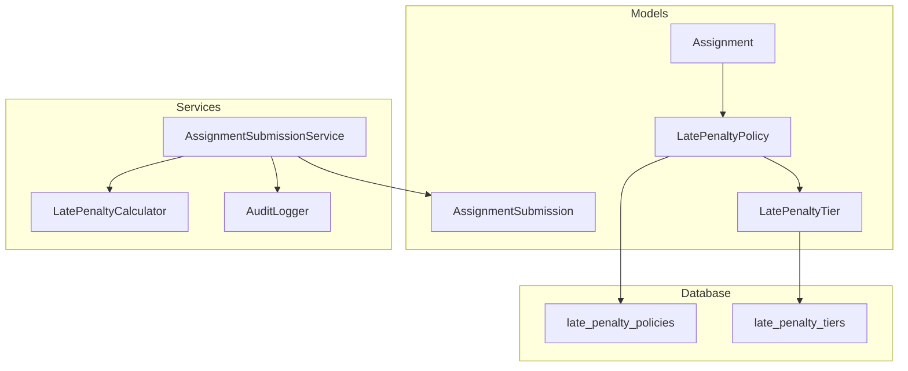
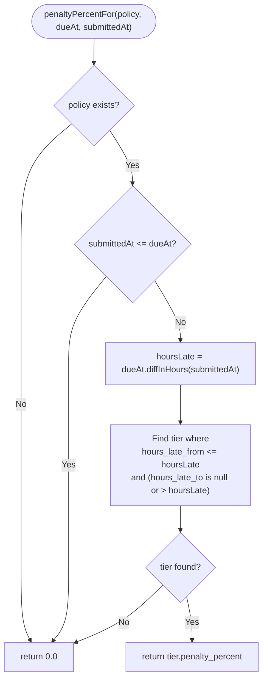
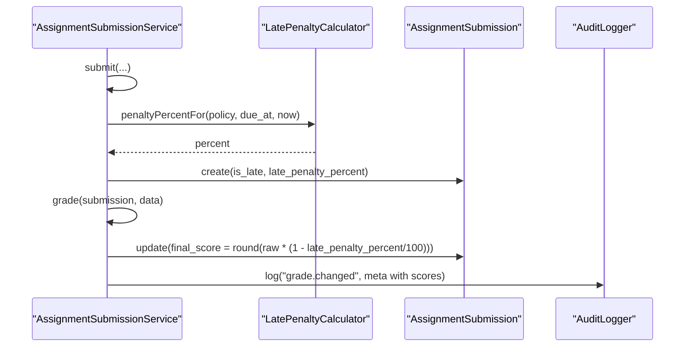
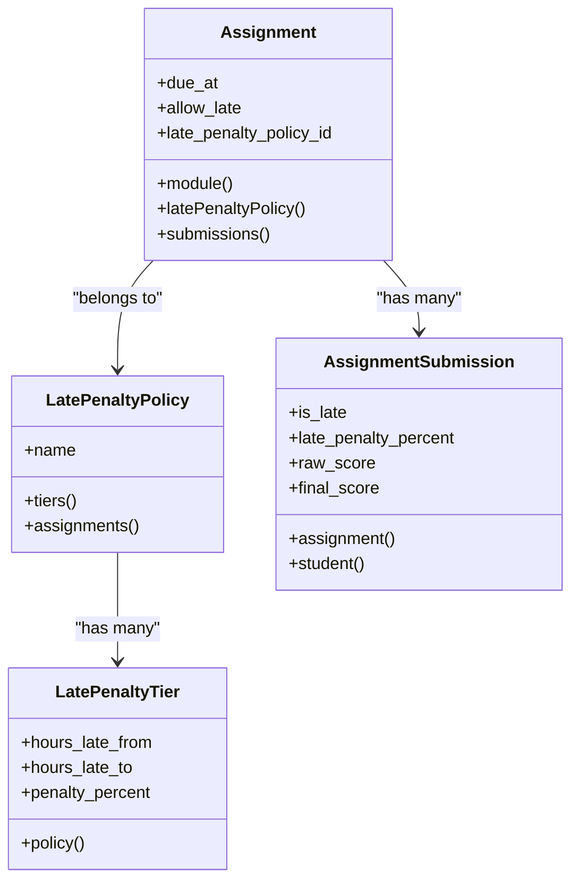
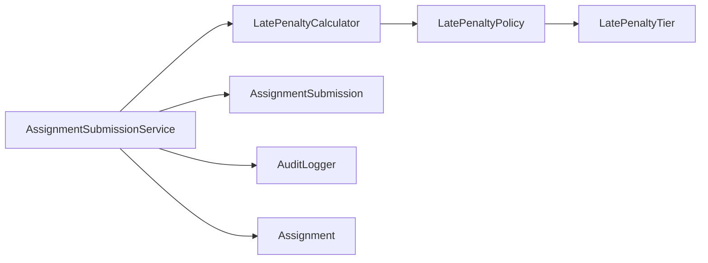

# Late Penalty Calculation

<cite>
**Referenced Files in This Document**
- [LatePenaltyCalculator.php](file://app/Services/Assessment/LatePenaltyCalculator.php)
- [AssignmentSubmissionService.php](file://app/Services/Assessment/AssignmentSubmissionService.php)
- [LatePenaltyPolicy.php](file://app/Models/LatePenaltyPolicy.php)
- [LatePenaltyTier.php](file://app/Models/LatePenaltyTier.php)
- [Assignment.php](file://app/Models/Assignment.php)
- [AssignmentSubmission.php](file://app/Models/AssignmentSubmission.php)
- [AuditLogger.php](file://app/Services/Audit/AuditLogger.php)
- [2024_01_01_000130_create_late_penalty_policies_table.php](file://database/migrations/2024_01_01_000130_create_late_penalty_policies_table.php)
- [2024_01_01_000131_create_late_penalty_tiers_table.php](file://database/migrations/2024_01_01_000131_create_late_penalty_tiers_table.php)
- [LatePenaltyCalculatorTest.php](file://tests/Feature/Assessment/LatePenaltyCalculatorTest.php)
</cite>

## Table of Contents
1. [Introduction](#introduction)
2. [Project Structure](#project-structure)
3. [Core Components](#core-components)
4. [Architecture Overview](#architecture-overview)
5. [Detailed Component Analysis](#detailed-component-analysis)
6. [Dependency Analysis](#dependency-analysis)
7. [Performance Considerations](#performance-considerations)
8. [Troubleshooting Guide](#troubleshooting-guide)
9. [Conclusion](#conclusion)

## Introduction
This document explains the Late Penalty Calculation system used for assignments. It covers how penalty policies are configured, how tier-based deductions are computed based on submission timing, and how penalties are automatically applied during grading. It also documents the LatePenaltyCalculator service methods, policy inheritance via assignment-level configuration, transparency to students, appeal considerations, and audit logging around grade changes.

## Project Structure
The late penalty feature spans models, a dedicated calculator service, integration into the assignment submission workflow, and database migrations that define the policy and tier structures. Tests validate boundary behavior across penalty bands.



**Diagram sources**
- [Assignment.php:19-53](file://app/Models/Assignment.php#L19-L53)
- [LatePenaltyPolicy.php:19-37](file://app/Models/LatePenaltyPolicy.php#L19-L37)
- [LatePenaltyTier.php:19-36](file://app/Models/LatePenaltyTier.php#L19-L36)
- [AssignmentSubmissionService.php:26-67](file://app/Services/Assessment/AssignmentSubmissionService.php#L26-L67)
- [LatePenaltyCalculator.php:17-34](file://app/Services/Assessment/LatePenaltyCalculator.php#L17-L34)
- [AuditLogger.php:18-27](file://app/Services/Audit/AuditLogger.php#L18-L27)
- [2024_01_01_000130_create_late_penalty_policies_table.php:13-17](file://database/migrations/2024_01_01_000130_create_late_penalty_policies_table.php#L13-L17)
- [2024_01_01_000131_create_late_penalty_tiers_table.php:13-19](file://database/migrations/2024_01_01_000131_create_late_penalty_tiers_table.php#L13-L19)

**Section sources**
- [Assignment.php:19-53](file://app/Models/Assignment.php#L19-L53)
- [LatePenaltyPolicy.php:19-37](file://app/Models/LatePenaltyPolicy.php#L19-L37)
- [LatePenaltyTier.php:19-36](file://app/Models/LatePenaltyTier.php#L19-L36)
- [AssignmentSubmissionService.php:26-67](file://app/Services/Assessment/AssignmentSubmissionService.php#L26-L67)
- [LatePenaltyCalculator.php:17-34](file://app/Services/Assessment/LatePenaltyCalculator.php#L17-L34)
- [AuditLogger.php:18-27](file://app/Services/Audit/AuditLogger.php#L18-L27)
- [2024_01_01_000130_create_late_penalty_policies_table.php:13-17](file://database/migrations/2024_01_01_000130_create_late_penalty_policies_table.php#L13-L17)
- [2024_01_01_000131_create_late_penalty_tiers_table.php:13-19](file://database/migrations/2024_01_01_000131_create_late_penalty_tiers_table.php#L13-L19)

## Core Components
- LatePenaltyCalculator: Computes the penalty percentage based on hours late and the active policy’s tiers.
- AssignmentSubmissionService: Orchestrates submission, calculates whether it is late, applies the penalty percentage at grading time, and logs grade changes.
- LatePenaltyPolicy and LatePenaltyTier: Define configurable penalty bands per policy.
- Assignment: Links an assignment to a specific late penalty policy (enables course/module-level overrides).
- AuditLogger: Records sensitive mutations such as grade changes.

Key behaviors:
- No penalty if no policy or submitted on/before due date.
- Tier selection by matching hours late against configured bands.
- Final score derived from raw score minus the stored late penalty percent.

**Section sources**
- [LatePenaltyCalculator.php:17-34](file://app/Services/Assessment/LatePenaltyCalculator.php#L17-L34)
- [AssignmentSubmissionService.php:37-67](file://app/Services/Assessment/AssignmentSubmissionService.php#L37-L67)
- [AssignmentSubmissionService.php:72-115](file://app/Services/Assessment/AssignmentSubmissionService.php#L72-L115)
- [LatePenaltyPolicy.php:19-37](file://app/Models/LatePenaltyPolicy.php#L19-L37)
- [LatePenaltyTier.php:19-36](file://app/Models/LatePenaltyTier.php#L19-L36)
- [Assignment.php:19-53](file://app/Models/Assignment.php#L19-L53)
- [AuditLogger.php:18-27](file://app/Services/Audit/AuditLogger.php#L18-L27)

## Architecture Overview
The late penalty calculation is invoked during assignment submission and finalized during grading. The flow ensures consistent application of configured policies and records audit events for grade changes.

```mermaid
sequenceDiagram
participant Student as "Student"
participant Service as "AssignmentSubmissionService"
participant Calc as "LatePenaltyCalculator"
participant Policy as "LatePenaltyPolicy"
participant Sub as "AssignmentSubmission"
participant Audit as "AuditLogger"
Student->>Service : submit(assignment, data)
Service->>Service : determine isLate(due_at vs now)
alt isLate
Service->>Calc : penaltyPercentFor(policy, due_at, submitted_at)
Calc->>Policy : query tiers()
Policy-->>Calc : matching tier(s)
Calc-->>Service : penalty percent
else not late
Service-->>Service : penalty = 0
end
Service->>Sub : create with is_late, late_penalty_percent
Note over Service,Sub : Submission recorded; progress updated elsewhere
Service-->>Student : submission created
Note over Service : Later, when graded...
Service->>Sub : update final_score using late_penalty_percent
Service->>Audit : log grade.changed with scores
Audit-->>Service : persisted
```

**Diagram sources**
- [AssignmentSubmissionService.php:37-67](file://app/Services/Assessment/AssignmentSubmissionService.php#L37-L67)
- [AssignmentSubmissionService.php:72-115](file://app/Services/Assessment/AssignmentSubmissionService.php#L72-L115)
- [LatePenaltyCalculator.php:17-34](file://app/Services/Assessment/LatePenaltyCalculator.php#L17-L34)
- [LatePenaltyPolicy.php:23-37](file://app/Models/LatePenaltyPolicy.php#L23-L37)
- [AuditLogger.php:18-27](file://app/Services/Audit/AuditLogger.php#L18-L27)

## Detailed Component Analysis

### LatePenaltyCalculator
Responsibilities:
- Determine if a submission is late relative to the assignment due date.
- Select the correct tier from the policy based on hours late.
- Return the penalty percentage for use in scoring.

Algorithm overview:
- If no policy or not late, return zero.
- Compute hours late.
- Query tiers where hours_late_from <= hoursLate and (hours_late_to is null or > hoursLate).
- Pick the highest matching band (descending order by hours_late_from).
- Return the tier’s penalty_percent or zero if none found.



**Diagram sources**
- [LatePenaltyCalculator.php:17-34](file://app/Services/Assessment/LatePenaltyCalculator.php#L17-L34)

**Section sources**
- [LatePenaltyCalculator.php:17-34](file://app/Services/Assessment/LatePenaltyCalculator.php#L17-L34)

### AssignmentSubmissionService Integration
Responsibilities:
- On submission: detect lateness, compute penalty percent, persist submission with flags and penalty.
- On grading: apply late penalty to derive final score and record audit event.

Key points:
- Lateness determined by comparing current time to assignment due date.
- Penalty percent obtained from LatePenaltyCalculator using the assignment’s policy.
- Final score computed as raw score adjusted by the stored late penalty percent.
- Grade change logged via AuditLogger.



**Diagram sources**
- [AssignmentSubmissionService.php:37-67](file://app/Services/Assessment/AssignmentSubmissionService.php#L37-L67)
- [AssignmentSubmissionService.php:72-115](file://app/Services/Assessment/AssignmentSubmissionService.php#L72-L115)

**Section sources**
- [AssignmentSubmissionService.php:37-67](file://app/Services/Assessment/AssignmentSubmissionService.php#L37-L67)
- [AssignmentSubmissionService.php:72-115](file://app/Services/Assessment/AssignmentSubmissionService.php#L72-L115)

### Data Model Relationships


**Diagram sources**
- [Assignment.php:19-53](file://app/Models/Assignment.php#L19-L53)
- [LatePenaltyPolicy.php:19-37](file://app/Models/LatePenaltyPolicy.php#L19-L37)
- [LatePenaltyTier.php:19-36](file://app/Models/LatePenaltyTier.php#L19-L36)
- [AssignmentSubmission.php:22-47](file://app/Models/AssignmentSubmission.php#L22-L47)

**Section sources**
- [Assignment.php:19-53](file://app/Models/Assignment.php#L19-L53)
- [LatePenaltyPolicy.php:19-37](file://app/Models/LatePenaltyPolicy.php#L19-L37)
- [LatePenaltyTier.php:19-36](file://app/Models/LatePenaltyTier.php#L19-L36)
- [AssignmentSubmission.php:22-47](file://app/Models/AssignmentSubmission.php#L22-L47)

### Database Schema for Policies and Tiers
- late_penalty_policies: stores named policies.
- late_penalty_tiers: defines bands with start/end hours and penalty percentage; end hour can be null for unbounded upper ranges.

**Section sources**
- [2024_01_01_000130_create_late_penalty_policies_table.php:13-17](file://database/migrations/2024_01_01_000130_create_late_penalty_policies_table.php#L13-L17)
- [2024_01_01_000131_create_late_penalty_tiers_table.php:13-19](file://database/migrations/2024_01_01_000131_create_late_penalty_tiers_table.php#L13-L19)

### Examples of Penalty Strategies
- Fixed percentage: Configure a single tier covering all late hours with a constant penalty percent.
- Graduated scales: Add multiple tiers with increasing penalty percentages as hours late increase.
- Grace periods: Set the first tier to start after a grace window (e.g., hours_late_from > 0) so submissions within the grace period incur no penalty.

Implementation notes:
- All strategies are implemented purely through tier configuration; no code changes are required.
- Use hours_late_to to cap bands or leave it null for open-ended bands.

**Section sources**
- [LatePenaltyTier.php:19-36](file://app/Models/LatePenaltyTier.php#L19-L36)
- [LatePenaltyCalculator.php:23-33](file://app/Services/Assessment/LatePenaltyCalculator.php#L23-L33)

### Policy Inheritance and Course-Level Overrides
- Assignments link to a LatePenaltyPolicy via late_penalty_policy_id.
- To override a default policy at the course or module level, assign a different policy to assignments under that scope.
- The calculator uses the assignment’s policy at submission time, ensuring per-assignment control.

**Section sources**
- [Assignment.php:19-53](file://app/Models/Assignment.php#L19-L53)
- [LatePenaltyPolicy.php:31-37](file://app/Models/LatePenaltyPolicy.php#L31-L37)

### Exception Handling and Edge Cases
- No policy provided: returns zero penalty.
- Submitted on or before due date: returns zero penalty.
- No matching tier: returns zero penalty (defensive fallback).
- Boundary handling: tests verify exact boundaries at 24h and 48h.

**Section sources**
- [LatePenaltyCalculator.php:17-34](file://app/Services/Assessment/LatePenaltyCalculator.php#L17-L34)
- [LatePenaltyCalculatorTest.php:19-51](file://tests/Feature/Assessment/LatePenaltyCalculatorTest.php#L19-L51)

### Transparency to Students
- The submission process records whether a submission is late and the applicable penalty percent.
- Frontend surfaces a note when late submissions are not allowed; penalty details can be surfaced in student-facing views by exposing is_late and late_penalty_percent from the submission resource.

[No sources needed since this section provides general guidance]

### Appeal Processes
- Appeals should target the assignment’s grading outcome. Since final_score is computed deterministically from raw_score and late_penalty_percent, appeals typically involve re-evaluating raw_score or adjusting policy/tier configuration retroactively with proper controls.
- Any manual adjustments should be audited via the same logging path used for grade changes.

[No sources needed since this section provides general guidance]

### Audit Logging of Penalty Calculations
- Grade changes are logged with action, entity type, entity id, actor id, and metadata including raw and final scores.
- While penalty calculation itself is deterministic and does not mutate state, any subsequent grade adjustment is captured in audit logs.

**Section sources**
- [AssignmentSubmissionService.php:72-115](file://app/Services/Assessment/AssignmentSubmissionService.php#L72-L115)
- [AuditLogger.php:18-27](file://app/Services/Audit/AuditLogger.php#L18-L27)

## Dependency Analysis


**Diagram sources**
- [AssignmentSubmissionService.php:26-67](file://app/Services/Assessment/AssignmentSubmissionService.php#L26-L67)
- [LatePenaltyCalculator.php:17-34](file://app/Services/Assessment/LatePenaltyCalculator.php#L17-L34)
- [LatePenaltyPolicy.php:23-37](file://app/Models/LatePenaltyPolicy.php#L23-L37)
- [LatePenaltyTier.php:30-36](file://app/Models/LatePenaltyTier.php#L30-L36)
- [Assignment.php:47-53](file://app/Models/Assignment.php#L47-L53)
- [AssignmentSubmission.php:49-55](file://app/Models/AssignmentSubmission.php#L49-L55)
- [AuditLogger.php:18-27](file://app/Services/Audit/AuditLogger.php#L18-L27)

**Section sources**
- [AssignmentSubmissionService.php:26-67](file://app/Services/Assessment/AssignmentSubmissionService.php#L26-L67)
- [LatePenaltyCalculator.php:17-34](file://app/Services/Assessment/LatePenaltyCalculator.php#L17-L34)
- [LatePenaltyPolicy.php:23-37](file://app/Models/LatePenaltyPolicy.php#L23-L37)
- [LatePenaltyTier.php:30-36](file://app/Models/LatePenaltyTier.php#L30-L36)
- [Assignment.php:47-53](file://app/Models/Assignment.php#L47-L53)
- [AssignmentSubmission.php:49-55](file://app/Models/AssignmentSubmission.php#L49-L55)
- [AuditLogger.php:18-27](file://app/Services/Audit/AuditLogger.php#L18-L27)

## Performance Considerations
- Tier lookup is a simple filtered query ordered by hours_late_from descending; ensure indexes on hours_late_from and hours_late_to for efficient range matching.
- Avoid repeated recalculations by caching the selected tier for a given submission context if needed.
- Keep policy updates infrequent and versioned to avoid reprocessing historical submissions.

[No sources needed since this section provides general guidance]

## Troubleshooting Guide
Common issues and checks:
- Zero penalty unexpectedly: verify policy exists and submission timestamp is after due date.
- Wrong tier applied: confirm tier ranges cover the expected hours and ordering is correct.
- Final score mismatch: check late_penalty_percent stored on submission and the formula used during grading.
- Missing audit entries: ensure grade changes go through the service method that logs them.

Validation references:
- Boundary cases validated by tests for 0–24h, 24–48h, and 48h+ bands.

**Section sources**
- [LatePenaltyCalculatorTest.php:19-51](file://tests/Feature/Assessment/LatePenaltyCalculatorTest.php#L19-L51)
- [AssignmentSubmissionService.php:72-115](file://app/Services/Assessment/AssignmentSubmissionService.php#L72-L115)

## Conclusion
The Late Penalty Calculation system provides a flexible, policy-driven approach to penalizing late submissions. Policies and tiers are fully configurable, enabling fixed, graduated, and grace-period strategies without code changes. The LatePenaltyCalculator encapsulates the business rule, while AssignmentSubmissionService integrates it into the submission and grading workflows. Audit logging captures grade changes, supporting transparency and accountability. Proper indexing and careful tier configuration ensure correctness and performance.