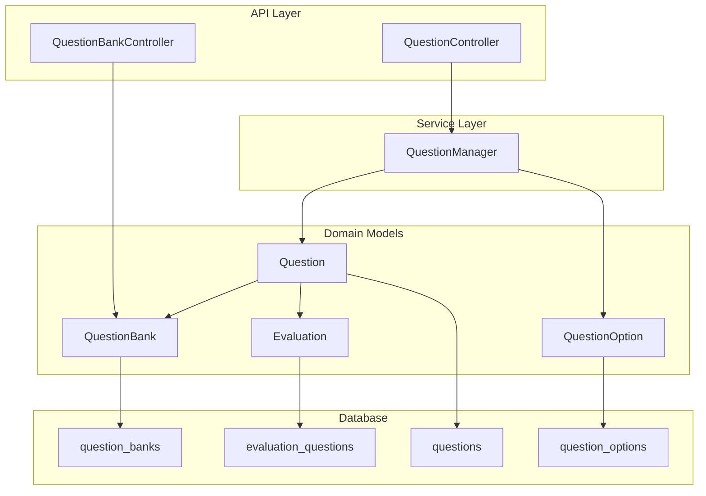
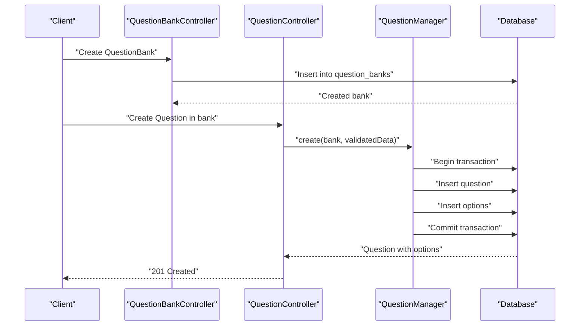
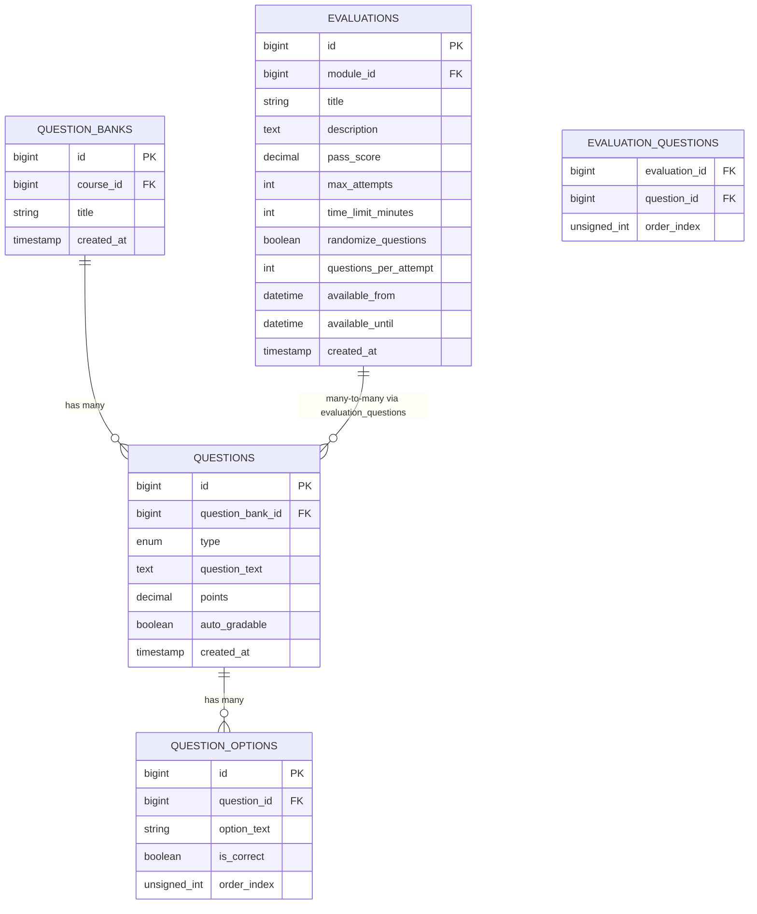
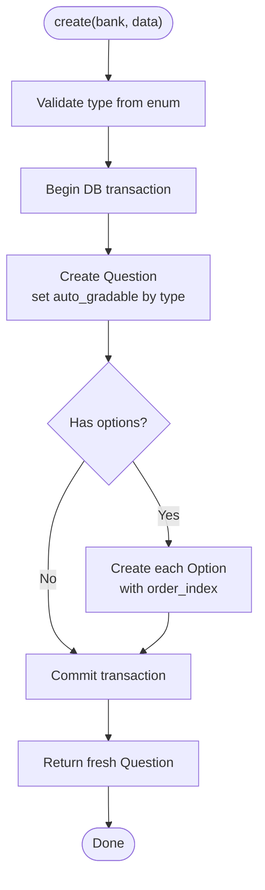
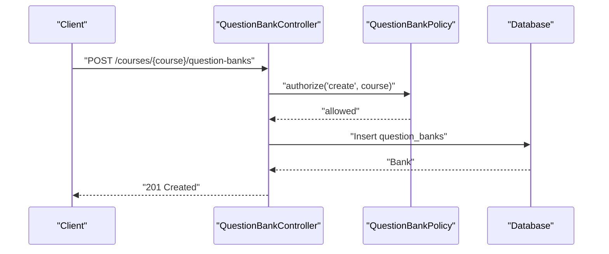
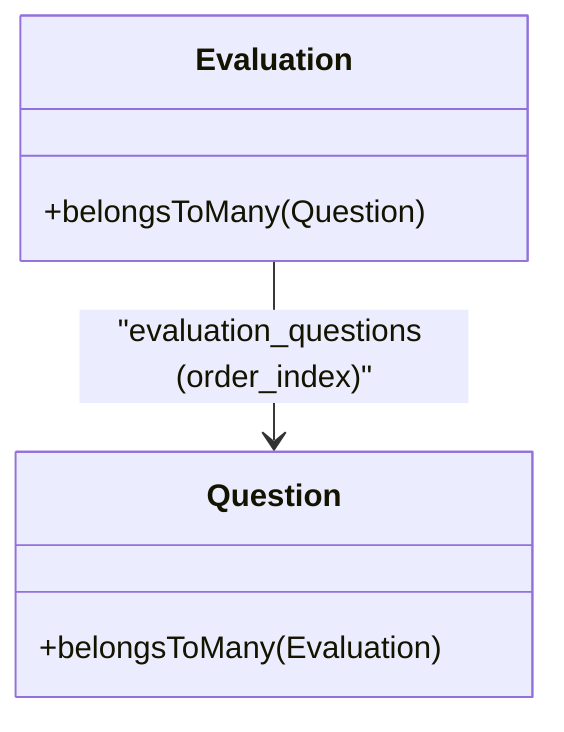
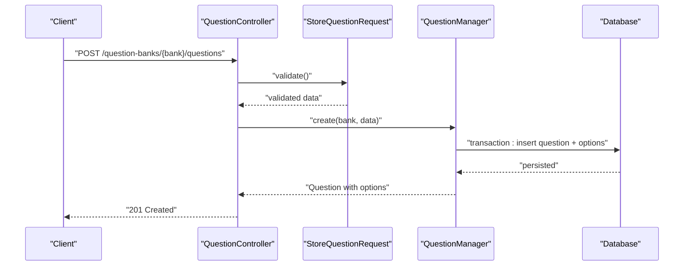
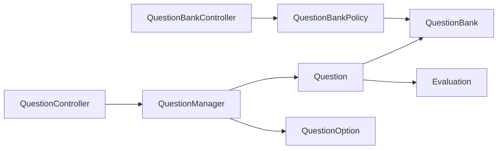

# Question Bank Management

<cite>
**Referenced Files in This Document**
- [Question.php](file://app/Models/Question.php)
- [QuestionBank.php](file://app/Models/QuestionBank.php)
- [QuestionOption.php](file://app/Models/QuestionOption.php)
- [Evaluation.php](file://app/Models/Evaluation.php)
- [QuestionType.php](file://app/Enums/QuestionType.php)
- [QuestionManager.php](file://app/Services/Assessment/QuestionManager.php)
- [QuestionController.php](file://app/Http/Controllers/Api/V1/QuestionController.php)
- [QuestionBankController.php](file://app/Http/Controllers/Api/V1/QuestionBankController.php)
- [StoreQuestionRequest.php](file://app/Http/Requests/Api/V1/StoreQuestionRequest.php)
- [StoreQuestionBankRequest.php](file://app/Http/Requests/Api/V1/StoreQuestionBankRequest.php)
- [QuestionBankPolicy.php](file://app/Policies/QuestionBankPolicy.php)
- [2024_01_01_000140_create_question_banks_table.php](file://database/migrations/2024_01_01_000140_create_question_banks_table.php)
- [2024_01_01_000141_create_questions_table.php](file://database/migrations/2024_01_01_000141_create_questions_table.php)
- [2024_01_01_000142_create_question_options_table.php](file://database/migrations/2024_01_01_000142_create_question_options_table.php)
- [2024_01_01_000144_create_evaluation_questions_table.php](file://database/migrations/2024_01_01_000144_create_evaluation_questions_table.php)
</cite>

## Table of Contents
1. Introduction
2. Project Structure
3. Core Components
4. Architecture Overview
5. Detailed Component Analysis
6. Dependency Analysis
7. Performance Considerations
8. Troubleshooting Guide
9. Conclusion

## Introduction
This document explains the Question Bank Management system for organizing, categorizing, and reusing questions across evaluations. It covers question organization by banks, supported question types, CRUD operations via the QuestionManager service, validation rules, permissions, and integration with evaluations. It also clarifies versioning, metadata, search capabilities, and best practices for building workflows such as creation, bulk import/export, and reuse.

## Project Structure
The Question Bank feature is implemented using a layered approach:
- Models define entities and relationships (Question, QuestionBank, QuestionOption, Evaluation).
- Enums define supported question types.
- Services encapsulate business logic (QuestionManager).
- Controllers expose API endpoints and delegate to services and policies.
- Request classes validate incoming data.
- Migrations define the database schema and relationships.

**Diagram sources**
- [QuestionBankController.php:15-39](file://app/Http/Controllers/Api/V1/QuestionBankController.php#L15-L39)
- [QuestionController.php:15-34](file://app/Http/Controllers/Api/V1/QuestionController.php#L15-L34)
- [QuestionManager.php:17-54](file://app/Services/Assessment/QuestionManager.php#L17-L54)
- [QuestionBank.php:13-39](file://app/Models/QuestionBank.php#L13-L39)
- [Question.php:15-58](file://app/Models/Question.php#L15-L58)
- [QuestionOption.php:12-36](file://app/Models/QuestionOption.php#L12-L36)
- [Evaluation.php:14-62](file://app/Models/Evaluation.php#L14-L62)
- [2024_01_01_000140_create_question_banks_table.php:11-18](file://database/migrations/2024_01_01_000140_create_question_banks_table.php#L11-L18)
- [2024_01_01_000141_create_questions_table.php:11-21](file://database/migrations/2024_01_01_000141_create_questions_table.php#L11-L21)
- [2024_01_01_000142_create_question_options_table.php:11-19](file://database/migrations/2024_01_01_000142_create_question_options_table.php#L11-L19)
- [2024_01_01_000144_create_evaluation_questions_table.php:11-18](file://database/migrations/2024_01_01_000144_create_evaluation_questions_table.php#L11-L18)

**Section sources**
- [QuestionBankController.php:15-39](file://app/Http/Controllers/Api/V1/QuestionBankController.php#L15-L39)
- [QuestionController.php:15-34](file://app/Http/Controllers/Api/V1/QuestionController.php#L15-L34)
- [QuestionManager.php:17-54](file://app/Services/Assessment/QuestionManager.php#L17-L54)
- [QuestionBank.php:13-39](file://app/Models/QuestionBank.php#L13-L39)
- [Question.php:15-58](file://app/Models/Question.php#L15-L58)
- [QuestionOption.php:12-36](file://app/Models/QuestionOption.php#L12-L36)
- [Evaluation.php:14-62](file://app/Models/Evaluation.php#L14-L62)
- [2024_01_01_000140_create_question_banks_table.php:11-18](file://database/migrations/2024_01_01_000140_create_question_banks_table.php#L11-L18)
- [2024_01_01_000141_create_questions_table.php:11-21](file://database/migrations/2024_01_01_000141_create_questions_table.php#L11-L21)
- [2024_01_01_000142_create_question_options_table.php:11-19](file://database/migrations/2024_01_01_000142_create_question_options_table.php#L11-L19)
- [2024_01_01_000144_create_evaluation_questions_table.php:11-18](file://database/migrations/2024_01_01_000144_create_evaluation_questions_table.php#L11-L18)

## Core Components
- QuestionBank: Groups questions per course; owns many Questions.
- Question: Represents an assessment item with type, text, points, and auto_gradable flag; belongs to a bank and links to options and evaluations.
- QuestionOption: Stores selectable choices for objective questions; linked to a Question.
- Evaluation: Links multiple Questions via a pivot table to assemble assessments; supports configuration like randomization and attempt limits.
- QuestionManager: Encapsulates creation and deletion of questions with transactional safety and automatic derivation of auto_gradable based on type.
- QuestionType enum: Defines supported types (mcq_single, mcq_multi, true_false, short_answer, essay).

Key responsibilities:
- Organization: Questions are organized under a QuestionBank scoped to a Course.
- Categorization: By bank membership and question type.
- Reuse: Questions can be linked to multiple Evaluations through the evaluation_questions pivot.

**Section sources**
- [QuestionBank.php:13-39](file://app/Models/QuestionBank.php#L13-L39)
- [Question.php:15-58](file://app/Models/Question.php#L15-L58)
- [QuestionOption.php:12-36](file://app/Models/QuestionOption.php#L12-L36)
- [Evaluation.php:14-62](file://app/Models/Evaluation.php#L14-L62)
- [QuestionManager.php:17-54](file://app/Services/Assessment/QuestionManager.php#L17-L54)
- [QuestionType.php:7-14](file://app/Enums/QuestionType.php#L7-L14)

## Architecture Overview
The API layer exposes endpoints to manage QuestionBanks and Questions. Controllers authorize actions via policies, validate input via request classes, and delegate to QuestionManager for persistence. The database schema enforces referential integrity between banks, questions, options, and evaluations.

**Diagram sources**
- [QuestionBankController.php:17-28](file://app/Http/Controllers/Api/V1/QuestionBankController.php#L17-L28)
- [QuestionController.php:19-24](file://app/Http/Controllers/Api/V1/QuestionController.php#L19-L24)
- [QuestionManager.php:24-47](file://app/Services/Assessment/QuestionManager.php#L24-L47)
- [2024_01_01_000140_create_question_banks_table.php:11-18](file://database/migrations/2024_01_01_000140_create_question_banks_table.php#L11-L18)
- [2024_01_01_000141_create_questions_table.php:11-21](file://database/migrations/2024_01_01_000141_create_questions_table.php#L11-L21)
- [2024_01_01_000142_create_question_options_table.php:11-19](file://database/migrations/2024_01_01_000142_create_question_options_table.php#L11-L19)

## Detailed Component Analysis

### Data Model and Relationships
- QuestionBank belongs to a Course and has many Questions.
- Question belongs to a QuestionBank, has many QuestionOptions, and belongs to many Evaluations via a pivot that preserves order.
- QuestionOption belongs to a Question.
- Evaluation has many Questions through evaluation_questions and many Attempts.

**Diagram sources**
- [2024_01_01_000140_create_question_banks_table.php:11-18](file://database/migrations/2024_01_01_000140_create_question_banks_table.php#L11-L18)
- [2024_01_01_000141_create_questions_table.php:11-21](file://database/migrations/2024_01_01_000141_create_questions_table.php#L11-L21)
- [2024_01_01_000142_create_question_options_table.php:11-19](file://database/migrations/2024_01_01_000142_create_question_options_table.php#L11-L19)
- [2024_01_01_000144_create_evaluation_questions_table.php:11-18](file://database/migrations/2024_01_01_000144_create_evaluation_questions_table.php#L11-L18)
- [Question.php:39-58](file://app/Models/Question.php#L39-L58)
- [QuestionBank.php:28-39](file://app/Models/QuestionBank.php#L28-L39)
- [QuestionOption.php:33-36](file://app/Models/QuestionOption.php#L33-L36)
- [Evaluation.php:49-62](file://app/Models/Evaluation.php#L49-L62)

**Section sources**
- [Question.php:15-58](file://app/Models/Question.php#L15-L58)
- [QuestionBank.php:13-39](file://app/Models/QuestionBank.php#L13-L39)
- [QuestionOption.php:12-36](file://app/Models/QuestionOption.php#L12-L36)
- [Evaluation.php:14-62](file://app/Models/Evaluation.php#L14-L62)
- [2024_01_01_000140_create_question_banks_table.php:11-18](file://database/migrations/2024_01_01_000140_create_question_banks_table.php#L11-L18)
- [2024_01_01_000141_create_questions_table.php:11-21](file://database/migrations/2024_01_01_000141_create_questions_table.php#L11-L21)
- [2024_01_01_000142_create_question_options_table.php:11-19](file://database/migrations/2024_01_01_000142_create_question_options_table.php#L11-L19)
- [2024_01_01_000144_create_evaluation_questions_table.php:11-18](file://database/migrations/2024_01_01_000144_create_evaluation_questions_table.php#L11-L18)

### QuestionManager Service (CRUD)
- create: Validates type from enum, creates a Question within a database transaction, derives auto_gradable based on type, and persists associated options with ordering.
- delete: Removes a Question.

**Diagram sources**
- [QuestionManager.php:24-47](file://app/Services/Assessment/QuestionManager.php#L24-L47)
- [QuestionType.php:7-14](file://app/Enums/QuestionType.php#L7-L14)

**Section sources**
- [QuestionManager.php:17-54](file://app/Services/Assessment/QuestionManager.php#L17-L54)
- [QuestionType.php:7-14](file://app/Enums/QuestionType.php#L7-L14)

### API Endpoints and Validation
- QuestionBankController:
  - List banks for a course (authorized).
  - Create a bank under a course.
  - Delete a bank (authorized).
- QuestionController:
  - Create a question in a bank (authorized and validated).
  - Delete a question (authorized).

Validation rules:
- StoreQuestionRequest enforces type enumeration, required text, optional non-negative points, conditional options array for objective types, and option constraints.
- StoreQuestionBankRequest enforces a required title with length limit.

Authorization:
- Policies enforce that only admins or instructors teaching the course can manage banks and their questions.

**Diagram sources**
- [QuestionBankController.php:17-28](file://app/Http/Controllers/Api/V1/QuestionBankController.php#L17-L28)
- [StoreQuestionBankRequest.php:12-21](file://app/Http/Requests/Api/V1/StoreQuestionBankRequest.php#L12-L21)
- [QuestionBankPolicy.php:14-37](file://app/Policies/QuestionBankPolicy.php#L14-L37)

**Section sources**
- [QuestionBankController.php:15-39](file://app/Http/Controllers/Api/V1/QuestionBankController.php#L15-L39)
- [QuestionController.php:15-34](file://app/Http/Controllers/Api/V1/QuestionController.php#L15-L34)
- [StoreQuestionRequest.php:12-33](file://app/Http/Requests/Api/V1/StoreQuestionRequest.php#L12-L33)
- [StoreQuestionBankRequest.php:12-21](file://app/Http/Requests/Api/V1/StoreQuestionBankRequest.php#L12-L21)
- [QuestionBankPolicy.php:14-37](file://app/Policies/QuestionBankPolicy.php#L14-L37)

### Supported Question Types and Auto-grading
- Types: mcq_single, mcq_multi, true_false, short_answer, essay.
- Auto-grading: Derived from type; objective types are auto_gradable, while short_answer and essay require manual grading.

**Section sources**
- [QuestionType.php:7-14](file://app/Enums/QuestionType.php#L7-L14)
- [QuestionManager.php:19-35](file://app/Services/Assessment/QuestionManager.php#L19-L35)
- [2024_01_01_000141_create_questions_table.php:16-19](file://database/migrations/2024_01_01_000141_create_questions_table.php#L16-L19)

### Integration with Evaluations (Reuse Across Assessments)
- Questions are reusable across evaluations via a many-to-many relationship stored in evaluation_questions with an order index.
- Evaluations configure behavior such as randomization, attempts, and time limits.

**Diagram sources**
- [Evaluation.php:49-62](file://app/Models/Evaluation.php#L49-L62)
- [Question.php:53-58](file://app/Models/Question.php#L53-L58)
- [2024_01_01_000144_create_evaluation_questions_table.php:11-18](file://database/migrations/2024_01_01_000144_create_evaluation_questions_table.php#L11-L18)

**Section sources**
- [Evaluation.php:14-62](file://app/Models/Evaluation.php#L14-L62)
- [Question.php:53-58](file://app/Models/Question.php#L53-L58)
- [2024_01_01_000144_create_evaluation_questions_table.php:11-18](file://database/migrations/2024_01_01_000144_create_evaluation_questions_table.php#L11-L18)

### Permissions Model
- Ownership and access are scoped to Courses.
- Admins and instructors who teach the course can view, create, update, and delete question banks and their questions.
- Deletion of a question requires authorization against the owning bank.

**Section sources**
- [QuestionBankPolicy.php:14-37](file://app/Policies/QuestionBankPolicy.php#L14-L37)
- [QuestionController.php:26-33](file://app/Http/Controllers/Api/V1/QuestionController.php#L26-L33)

### Versioning
- Models disable updated_at timestamps, indicating no built-in versioning at the model level.
- Audit logs exist elsewhere in the application but are not part of the question models shown here.

**Section sources**
- [Question.php:20-20](file://app/Models/Question.php#L20-L20)
- [QuestionBank.php:18-18](file://app/Models/QuestionBank.php#L18-L18)

### Metadata, Difficulty, Tags, and Search
- Current schema includes basic metadata: type, question_text, points, auto_gradable, and creation timestamp.
- There is no explicit difficulty level or tags fields in the current models or migrations.
- No dedicated search endpoint is present in the analyzed files; listing endpoints return full collections without filtering parameters.

Recommendations for future enhancements:
- Add fields for difficulty and tags if needed.
- Implement query filters and search endpoints for efficient retrieval.

**Section sources**
- [2024_01_01_000141_create_questions_table.php:13-21](file://database/migrations/2024_01_01_000141_create_questions_table.php#L13-L21)
- [Question.php:22-34](file://app/Models/Question.php#L22-L34)
- [QuestionBankController.php:17-22](file://app/Http/Controllers/Api/V1/QuestionBankController.php#L17-L22)

### Workflows

#### Creating a Question
- Authorize via policy and validate input via request class.
- Use QuestionManager to create the question and options in a transaction.
- Return the created question with its options.

**Diagram sources**
- [QuestionController.php:19-24](file://app/Http/Controllers/Api/V1/QuestionController.php#L19-L24)
- [StoreQuestionRequest.php:22-31](file://app/Http/Requests/Api/V1/StoreQuestionRequest.php#L22-L31)
- [QuestionManager.php:24-47](file://app/Services/Assessment/QuestionManager.php#L24-L47)

**Section sources**
- [QuestionController.php:19-24](file://app/Http/Controllers/Api/V1/QuestionController.php#L19-L24)
- [StoreQuestionRequest.php:22-31](file://app/Http/Requests/Api/V1/StoreQuestionRequest.php#L22-L31)
- [QuestionManager.php:24-47](file://app/Services/Assessment/QuestionManager.php#L24-L47)

#### Bulk Import/Export
- No bulk import/export endpoints are present in the analyzed controllers or services.
- A practical approach would be to:
  - Export: Iterate over a QuestionBank’s questions and options and serialize them.
  - Import: Parse a file (e.g., CSV), validate entries, and use QuestionManager to create questions in batches within transactions.

[No sources needed since this section provides general guidance]

#### Reusing Questions Across Evaluations
- Link a Question to an Evaluation via the evaluation_questions pivot, preserving order.
- Configure evaluation settings (randomization, attempts, time limits) to control how questions are presented.

**Section sources**
- [Evaluation.php:49-62](file://app/Models/Evaluation.php#L49-L62)
- [Question.php:53-58](file://app/Models/Question.php#L53-L58)
- [2024_01_01_000144_create_evaluation_questions_table.php:11-18](file://database/migrations/2024_01_01_000144_create_evaluation_questions_table.php#L11-L18)

## Dependency Analysis
- Controllers depend on Services (QuestionManager) and Policies for authorization.
- Services depend on Models and Enums.
- Models define relationships to other domain entities (Course, Evaluation).
- Database migrations enforce referential integrity.

**Diagram sources**
- [QuestionController.php:15-34](file://app/Http/Controllers/Api/V1/QuestionController.php#L15-L34)
- [QuestionBankController.php:15-39](file://app/Http/Controllers/Api/V1/QuestionBankController.php#L15-L39)
- [QuestionManager.php:17-54](file://app/Services/Assessment/QuestionManager.php#L17-L54)
- [QuestionBankPolicy.php:14-37](file://app/Policies/QuestionBankPolicy.php#L14-L37)
- [Question.php:15-58](file://app/Models/Question.php#L15-L58)
- [QuestionOption.php:12-36](file://app/Models/QuestionOption.php#L12-L36)
- [QuestionBank.php:13-39](file://app/Models/QuestionBank.php#L13-L39)
- [Evaluation.php:14-62](file://app/Models/Evaluation.php#L14-L62)

**Section sources**
- [QuestionController.php:15-34](file://app/Http/Controllers/Api/V1/QuestionController.php#L15-L34)
- [QuestionBankController.php:15-39](file://app/Http/Controllers/Api/V1/QuestionBankController.php#L15-L39)
- [QuestionManager.php:17-54](file://app/Services/Assessment/QuestionManager.php#L17-L54)
- [QuestionBankPolicy.php:14-37](file://app/Policies/QuestionBankPolicy.php#L14-L37)
- [Question.php:15-58](file://app/Models/Question.php#L15-L58)
- [QuestionOption.php:12-36](file://app/Models/QuestionOption.php#L12-L36)
- [QuestionBank.php:13-39](file://app/Models/QuestionBank.php#L13-L39)
- [Evaluation.php:14-62](file://app/Models/Evaluation.php#L14-L62)

## Performance Considerations
- Use transactions for creating questions with multiple options to ensure consistency and reduce partial writes.
- Avoid loading all options eagerly unless necessary; paginate or filter when listing large banks.
- Consider indexing frequently queried fields (e.g., type, question_text) if search/filtering is added later.
- For bulk operations, process in batches and commit periodically to avoid long-running transactions.

[No sources needed since this section provides general guidance]

## Troubleshooting Guide
Common issues and resolutions:
- Validation errors: Ensure type matches one of the supported enums; options are required for objective types; option texts must meet length constraints.
- Authorization failures: Verify the user role and instructor assignment to the course; deletion of questions requires permission on the owning bank.
- Transaction failures: If option insertion fails after question creation, the transaction rolls back; retry the operation.

**Section sources**
- [StoreQuestionRequest.php:22-31](file://app/Http/Requests/Api/V1/StoreQuestionRequest.php#L22-L31)
- [QuestionBankPolicy.php:14-37](file://app/Policies/QuestionBankPolicy.php#L14-L37)
- [QuestionController.php:26-33](file://app/Http/Controllers/Api/V1/QuestionController.php#L26-L33)
- [QuestionManager.php:24-47](file://app/Services/Assessment/QuestionManager.php#L24-L47)

## Conclusion
The Question Bank Management system provides a robust foundation for organizing questions by banks, supporting multiple question types, and reusing questions across evaluations. The QuestionManager service ensures safe and consistent creation of questions and options. Permissions are enforced at the course level, allowing admins and instructors to manage content securely. While versioning, difficulty levels, tags, and search are not currently implemented in the analyzed components, the architecture allows straightforward extension. Future enhancements can include advanced search, tagging, difficulty levels, and bulk import/export capabilities to support larger-scale content management.