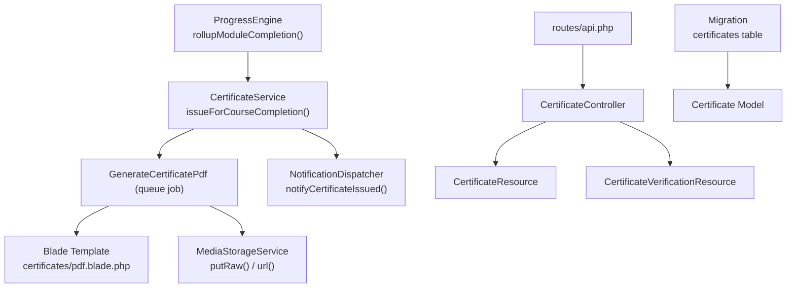
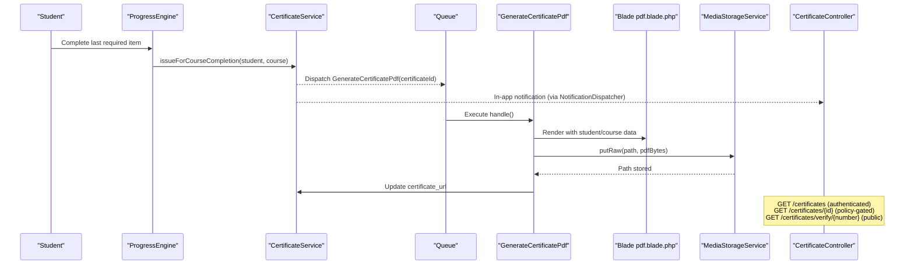
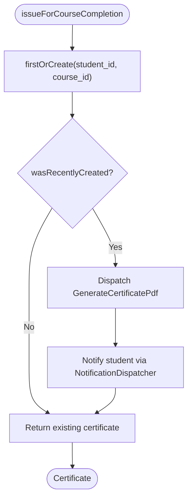
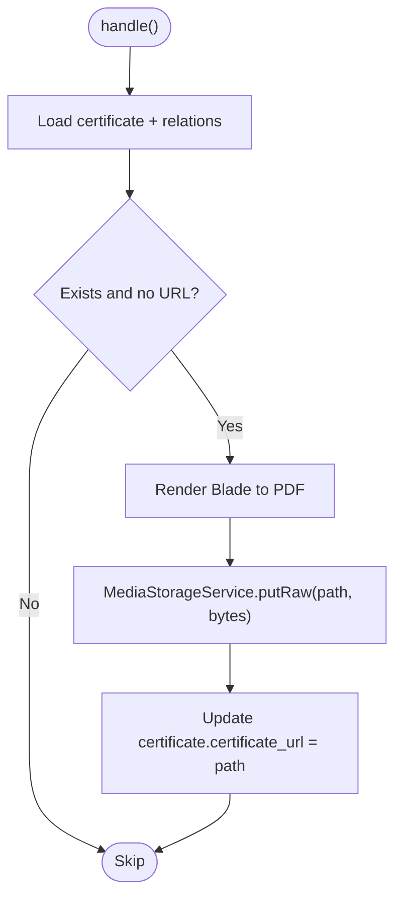
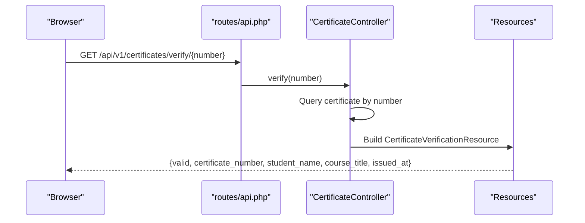
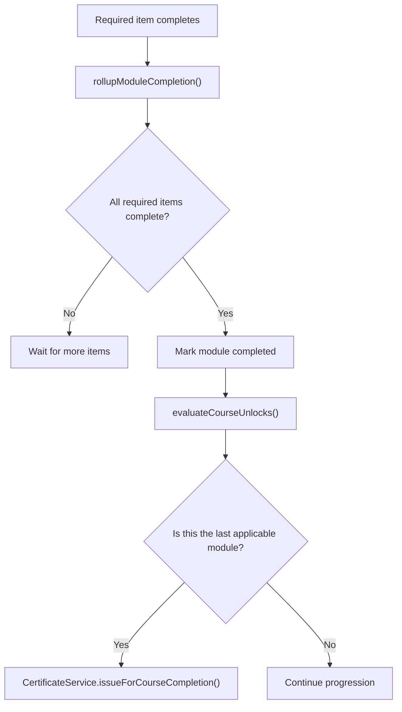
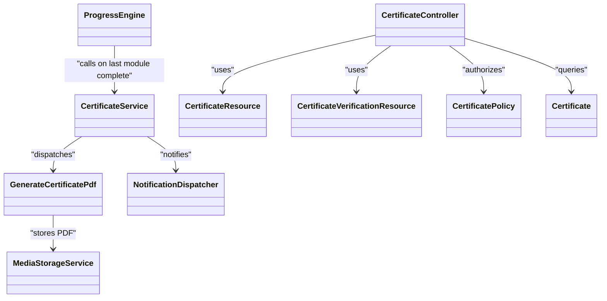

# Certification System

<cite>
**Referenced Files in This Document**
- [CertificateService.php](file://app/Services/Certification/CertificateService.php)
- [GenerateCertificatePdf.php](file://app/Jobs/GenerateCertificatePdf.php)
- [CertificateController.php](file://app/Http/Controllers/Api/V1/CertificateController.php)
- [Certificate.php](file://app/Models/Certificate.php)
- [CertificateResource.php](file://app/Http/Resources/CertificateResource.php)
- [CertificateVerificationResource.php](file://app/Http/Resources/CertificateVerificationResource.php)
- [CertificatePolicy.php](file://app/Policies/CertificatePolicy.php)
- [pdf.blade.php](file://resources/views/certificates/pdf.blade.php)
- [ProgressEngine.php](file://app/Services/Progress/ProgressEngine.php)
- [NotificationDispatcher.php](file://app/Services/Notifications/NotificationDispatcher.php)
- [MediaStorageService.php](file://app/Services/Storage/MediaStorageService.php)
- [api.php](file://routes/api.php)
- [2024_01_01_000160_create_certificates_table.php](file://database/migrations/2024_01_01_000160_create_certificates_table.php)
- [CertificateIssuanceTest.php](file://tests/Feature/Certification/CertificateIssuanceTest.php)
- [CertificateVerificationTest.php](file://tests/Feature/Certification/CertificateVerificationTest.php)
- [CertificateVerifyPage.tsx](file://frontend/src/features/progress/CertificateVerifyPage.tsx)
- [api.ts](file://frontend/src/features/progress/api.ts)
</cite>

## Table of Contents
1. Introduction
2. Project Structure
3. Core Components
4. Architecture Overview
5. Detailed Component Analysis
6. Dependency Analysis
7. Performance Considerations
8. Troubleshooting Guide
9. Conclusion

## Introduction
This document explains the Certification System sub-feature end-to-end: how certificates are issued when a student completes a course, how PDFs are generated and stored, how verification works for anyone with a certificate number, and how this integrates with progress tracking and student achievements. It focuses on the CertificateService implementation, Blade-based PDF rendering, queue-driven generation, API endpoints, and the relationship to module completion and course sections.

## Project Structure
The certification feature spans models, services, jobs, controllers, resources, policies, views, routes, migrations, tests, and frontend pages. The key pieces are:
- Issuance trigger: ProgressEngine detects last-module completion and calls CertificateService.
- Issuance logic: CertificateService creates or retrieves a certificate and dispatches a background job.
- PDF generation: GenerateCertificatePdf renders a Blade template and stores the PDF via MediaStorageService.
- Access and verification: CertificateController exposes authenticated list/show and a public verify endpoint.
- Data model: Certificate model with unique constraints ensuring one certificate per student per course.
- Frontend: A public verification page that calls the public verify endpoint.

**Diagram sources**
- [ProgressEngine.php:126-151](file://app/Services/Progress/ProgressEngine.php#L126-L151)
- [CertificateService.php:23-35](file://app/Services/Certification/CertificateService.php#L23-L35)
- [GenerateCertificatePdf.php:36-57](file://app/Jobs/GenerateCertificatePdf.php#L36-L57)
- [pdf.blade.php:1-28](file://resources/views/certificates/pdf.blade.php#L1-L28)
- [MediaStorageService.php:46-79](file://app/Services/Storage/MediaStorageService.php#L46-L79)
- [CertificateController.php:16-46](file://app/Http/Controllers/Api/V1/CertificateController.php#L16-L46)
- [CertificateResource.php:16-29](file://app/Http/Resources/CertificateResource.php#L16-L29)
- [CertificateVerificationResource.php:20-29](file://app/Http/Resources/CertificateVerificationResource.php#L20-L29)
- [api.php:64-66](file://routes/api.php#L64-L66)
- [2024_01_01_000160_create_certificates_table.php:13-22](file://database/migrations/2024_01_01_000160_create_certificates_table.php#L13-L22)

**Section sources**
- [ProgressEngine.php:126-151](file://app/Services/Progress/ProgressEngine.php#L126-L151)
- [CertificateService.php:23-35](file://app/Services/Certification/CertificateService.php#L23-L35)
- [GenerateCertificatePdf.php:36-57](file://app/Jobs/GenerateCertificatePdf.php#L36-L57)
- [CertificateController.php:16-46](file://app/Http/Controllers/Api/V1/CertificateController.php#L16-L46)
- [CertificateResource.php:16-29](file://app/Http/Resources/CertificateResource.php#L16-L29)
- [CertificateVerificationResource.php:20-29](file://app/Http/Resources/CertificateVerificationResource.php#L20-L29)
- [api.php:64-66](file://routes/api.php#L64-L66)
- [2024_01_01_000160_create_certificates_table.php:13-22](file://database/migrations/2024_01_01_000160_create_certificates_table.php#L13-L22)

## Core Components
- CertificateService: Creates or retrieves a certificate for a student/course pair; dispatches PDF generation and sends an in-app notification only when a new certificate is created.
- GenerateCertificatePdf: Queue job that renders the Blade template into a PDF, stores it via MediaStorageService, and updates the certificate record with the storage path.
- CertificateController: Provides authenticated listing and detail endpoints for students/admins, plus a public verification endpoint by certificate number.
- Resources: CertificateResource returns full details with resolved URLs; CertificateVerificationResource returns a minimal, safe shape for public verification.
- Policy: Restricts viewing to certificate owners and admins.
- Model and Migration: Enforce uniqueness at the database level (student+course and certificate_number).

Key behaviors:
- Exactly-once issuance per student per course via firstOrCreate and a unique constraint.
- Asynchronous PDF generation to avoid blocking user requests.
- Public verification without authentication.
- URL resolution happens at read time through MediaStorageService.

**Section sources**
- [CertificateService.php:23-45](file://app/Services/Certification/CertificateService.php#L23-L45)
- [GenerateCertificatePdf.php:36-65](file://app/Jobs/GenerateCertificatePdf.php#L36-L65)
- [CertificateController.php:16-46](file://app/Http/Controllers/Api/V1/CertificateController.php#L16-L46)
- [CertificateResource.php:16-29](file://app/Http/Resources/CertificateResource.php#L16-L29)
- [CertificateVerificationResource.php:20-29](file://app/Http/Resources/CertificateVerificationResource.php#L20-L29)
- [CertificatePolicy.php:13-16](file://app/Policies/CertificatePolicy.php#L13-L16)
- [Certificate.php:19-45](file://app/Models/Certificate.php#L19-L45)
- [2024_01_01_000160_create_certificates_table.php:13-22](file://database/migrations/2024_01_01_000160_create_certificates_table.php#L13-L22)

## Architecture Overview
The system ties course completion to certification:
- When all required items in the last applicable module complete, ProgressEngine rolls up the module as completed and triggers certificate issuance.
- CertificateService ensures idempotent creation and dispatches a background job for PDF rendering.
- The job renders a Blade template into a PDF and persists it using MediaStorageService; the certificate record stores the relative storage path.
- Clients can list/download their certificates via authenticated endpoints and anyone can verify a certificate publicly by its number.

**Diagram sources**
- [ProgressEngine.php:126-151](file://app/Services/Progress/ProgressEngine.php#L126-L151)
- [CertificateService.php:23-35](file://app/Services/Certification/CertificateService.php#L23-L35)
- [GenerateCertificatePdf.php:36-57](file://app/Jobs/GenerateCertificatePdf.php#L36-L57)
- [pdf.blade.php:14-25](file://resources/views/certificates/pdf.blade.php#L14-L25)
- [MediaStorageService.php:46-79](file://app/Services/Storage/MediaStorageService.php#L46-L79)
- [CertificateController.php:16-46](file://app/Http/Controllers/Api/V1/CertificateController.php#L16-L46)

## Detailed Component Analysis

### CertificateService
Responsibilities:
- Create or retrieve a certificate for a given student/course pair.
- Generate a unique certificate number.
- On first creation, dispatch the PDF generation job and send an in-app notification.

Design notes:
- Uses firstOrCreate to guarantee exactly one certificate per student per course.
- Generates a random, unique certificate number with collision checking.
- Decouples PDF rendering from the request cycle via a queued job.

**Diagram sources**
- [CertificateService.php:23-35](file://app/Services/Certification/CertificateService.php#L23-L35)
- [CertificateService.php:38-45](file://app/Services/Certification/CertificateService.php#L38-L45)

**Section sources**
- [CertificateService.php:23-45](file://app/Services/Certification/CertificateService.php#L23-L45)

### GenerateCertificatePdf Job
Responsibilities:
- Load the certificate with related student and course.
- Skip if already processed or missing.
- Render the Blade template to PDF.
- Store the PDF bytes under a deterministic path and update the certificate record.

Reliability:
- Implements ShouldBeUnique keyed by certificate ID to prevent duplicate renders on retries.
- Configured with tries and backoff; logs failures.

**Diagram sources**
- [GenerateCertificatePdf.php:36-57](file://app/Jobs/GenerateCertificatePdf.php#L36-L57)
- [GenerateCertificatePdf.php:59-65](file://app/Jobs/GenerateCertificatePdf.php#L59-L65)

**Section sources**
- [GenerateCertificatePdf.php:36-65](file://app/Jobs/GenerateCertificatePdf.php#L36-L65)

### Blade Template Rendering
The PDF uses a simple Blade view with CSS styling and dynamic fields:
- Student name, course title, certificate number, and formatted issue date.
- Not served as a web page; used exclusively as a PDF renderer by the job.

**Section sources**
- [pdf.blade.php:1-28](file://resources/views/certificates/pdf.blade.php#L1-L28)

### Storage and URL Resolution
- The job stores the PDF using MediaStorageService.putRaw with a relative path under certificates/.
- At read time, CertificateResource resolves the stored path to a full URL via MediaStorageService.url, which handles both external URLs and disk-generated URLs consistently.

**Section sources**
- [GenerateCertificatePdf.php:51-56](file://app/Jobs/GenerateCertificatePdf.php#L51-L56)
- [CertificateResource.php:16-29](file://app/Http/Resources/CertificateResource.php#L16-L29)
- [MediaStorageService.php:46-79](file://app/Services/Storage/MediaStorageService.php#L46-L79)

### API Endpoints and Verification
Endpoints:
- GET /api/v1/certificates: List current user’s certificates (authenticated).
- GET /api/v1/certificates/{certificate}: Show certificate details (policy-gated: owner or admin).
- GET /api/v1/certificates/verify/{certificateNumber}: Public verification returning minimal data.

Verification behavior:
- Public endpoint requires no authentication.
- Returns valid=true with certificate_number, student_name, course_title, and issued_at.
- Unknown numbers return not found.

Frontend integration:
- A public page allows users to enter a certificate number and call the verify endpoint.
- Error handling displays messages for invalid inputs or network errors.

**Diagram sources**
- [api.php:64-66](file://routes/api.php#L64-L66)
- [CertificateController.php:38-46](file://app/Http/Controllers/Api/V1/CertificateController.php#L38-L46)
- [CertificateVerificationResource.php:20-29](file://app/Http/Resources/CertificateVerificationResource.php#L20-L29)

**Section sources**
- [CertificateController.php:16-46](file://app/Http/Controllers/Api/V1/CertificateController.php#L16-L46)
- [CertificateVerificationResource.php:20-29](file://app/Http/Resources/CertificateVerificationResource.php#L20-L29)
- [api.php:64-66](file://routes/api.php#L64-L66)
- [CertificateVerifyPage.tsx:14-35](file://frontend/src/features/progress/CertificateVerifyPage.tsx#L14-L35)
- [api.ts:9-18](file://frontend/src/features/progress/api.ts#L9-L18)

### Relationship with Course Completion and Progress Tracking
- Trigger point: ProgressEngine.rollupModuleCompletion marks a module completed when all required items are done, then evaluates unlocks and checks if the completed module is the last applicable one for the course. If so, it issues a certificate.
- Module applicability considers groups and section-based unlock offsets.
- Resource completion rules include video watch percentage thresholds, mark-as-read for documents/readings/SCORM, opened for external links/downloadable files, and attendance for live sessions.

**Diagram sources**
- [ProgressEngine.php:126-151](file://app/Services/Progress/ProgressEngine.php#L126-L151)
- [ProgressEngine.php:154-205](file://app/Services/Progress/ProgressEngine.php#L154-L205)
- [ProgressEngine.php:218-286](file://app/Services/Progress/ProgressEngine.php#L218-L286)

**Section sources**
- [ProgressEngine.php:126-151](file://app/Services/Progress/ProgressEngine.php#L126-L151)
- [ProgressEngine.php:154-205](file://app/Services/Progress/ProgressEngine.php#L154-L205)
- [ProgressEngine.php:218-286](file://app/Services/Progress/ProgressEngine.php#L218-L286)

### Data Model and Constraints
- The certificates table enforces:
  - Unique certificate_number.
  - Unique composite key (student_id, course_id) to ensure one certificate per student per course.
- The model defines relationships to User (student) and Course, and casts issued_at to datetime.

**Section sources**
- [2024_01_01_000160_create_certificates_table.php:13-22](file://database/migrations/2024_01_01_000160_create_certificates_table.php#L13-L22)
- [Certificate.php:19-45](file://app/Models/Certificate.php#L19-L45)

### Notifications
- Upon certificate issuance, an in-app notification is created for the student with type certificate_issued, including the certificate number and course title.

**Section sources**
- [CertificateService.php:30-33](file://app/Services/Certification/CertificateService.php#L30-L33)
- [NotificationDispatcher.php:66-76](file://app/Services/Notifications/NotificationDispatcher.php#L66-L76)

## Dependency Analysis

**Diagram sources**
- [ProgressEngine.php:126-151](file://app/Services/Progress/ProgressEngine.php#L126-L151)
- [CertificateService.php:23-35](file://app/Services/Certification/CertificateService.php#L23-L35)
- [GenerateCertificatePdf.php:36-57](file://app/Jobs/GenerateCertificatePdf.php#L36-L57)
- [CertificateController.php:16-46](file://app/Http/Controllers/Api/V1/CertificateController.php#L16-L46)
- [CertificateResource.php:16-29](file://app/Http/Resources/CertificateResource.php#L16-L29)
- [CertificateVerificationResource.php:20-29](file://app/Http/Resources/CertificateVerificationResource.php#L20-L29)
- [CertificatePolicy.php:13-16](file://app/Policies/CertificatePolicy.php#L13-L16)
- [Certificate.php:19-45](file://app/Models/Certificate.php#L19-L45)
- [MediaStorageService.php:46-79](file://app/Services/Storage/MediaStorageService.php#L46-L79)

**Section sources**
- [ProgressEngine.php:126-151](file://app/Services/Progress/ProgressEngine.php#L126-L151)
- [CertificateService.php:23-35](file://app/Services/Certification/CertificateService.php#L23-L35)
- [GenerateCertificatePdf.php:36-57](file://app/Jobs/GenerateCertificatePdf.php#L36-L57)
- [CertificateController.php:16-46](file://app/Http/Controllers/Api/V1/CertificateController.php#L16-L46)
- [CertificateResource.php:16-29](file://app/Http/Resources/CertificateResource.php#L16-L29)
- [CertificateVerificationResource.php:20-29](file://app/Http/Resources/CertificateVerificationResource.php#L20-L29)
- [CertificatePolicy.php:13-16](file://app/Policies/CertificatePolicy.php#L13-L16)
- [Certificate.php:19-45](file://app/Models/Certificate.php#L19-L45)
- [MediaStorageService.php:46-79](file://app/Services/Storage/MediaStorageService.php#L46-L79)

## Performance Considerations
- PDF generation is offloaded to a queue job to keep request latency low.
- ShouldBeUnique prevents duplicate work on retries or duplicate dispatches.
- Database-level unique constraints enforce idempotency at the data layer.
- URL resolution occurs at read time, avoiding heavy processing during issuance.

[No sources needed since this section provides general guidance]

## Troubleshooting Guide
Common issues and diagnostics:
- Certificate not issued:
  - Ensure the completed module is the last applicable module for the course.
  - Verify required items are marked complete per resource-type rules.
  - Confirm the job was dispatched and not blocked by queue workers.
- PDF not available:
  - Check job execution logs for failures; the job logs errors with certificate context.
  - Verify storage disk configuration and permissions for writing certificate files.
  - Confirm certificate_url is set after job completion and that MediaStorageService.url resolves correctly.
- Verification fails:
  - Public endpoint returns not found for unknown certificate numbers.
  - Ensure the certificate_number matches exactly what is printed on the certificate.

**Section sources**
- [GenerateCertificatePdf.php:59-65](file://app/Jobs/GenerateCertificatePdf.php#L59-L65)
- [CertificateVerificationTest.php:21-25](file://tests/Feature/Certification/CertificateVerificationTest.php#L21-L25)
- [CertificateIssuanceTest.php:72-95](file://tests/Feature/Certification/CertificateIssuanceTest.php#L72-L95)

## Conclusion
The Certification System integrates tightly with course progress to award certificates upon completion of the final applicable module. It guarantees exactly-once issuance, generates PDFs asynchronously, and exposes both authenticated and public APIs for access and verification. The design emphasizes reliability (unique constraints, idempotent operations), performance (queued PDF generation), and clarity (minimal public verification payload). Tests validate core behaviors around issuance, duplication prevention, storage, and access control.

[No sources needed since this section summarizes without analyzing specific files]