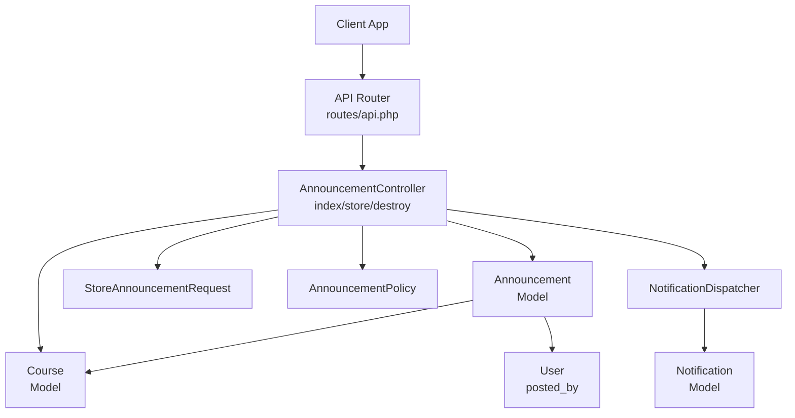
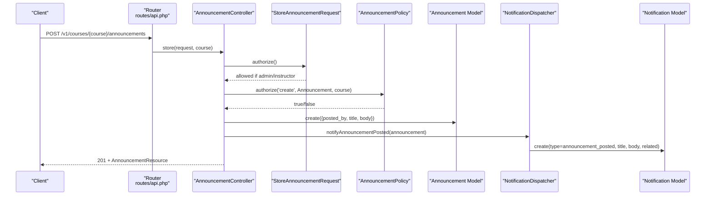
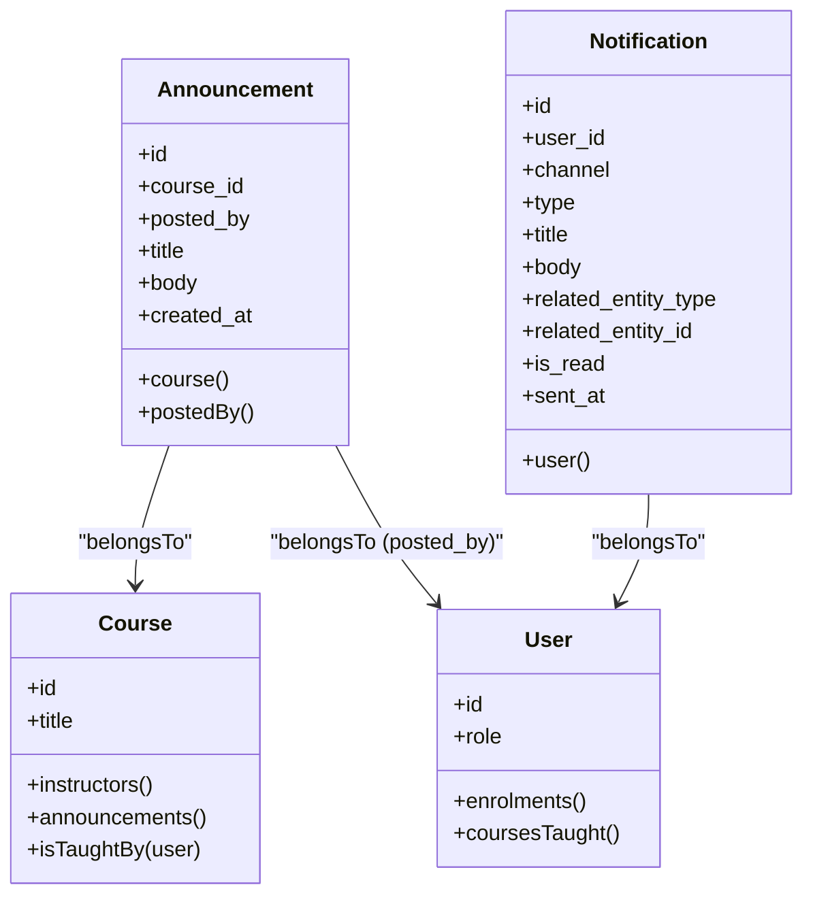
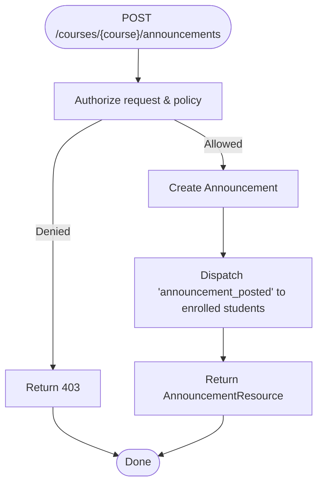
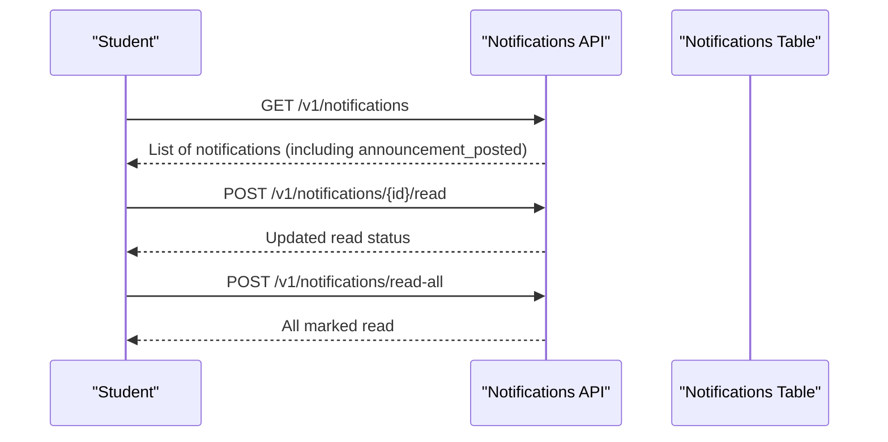
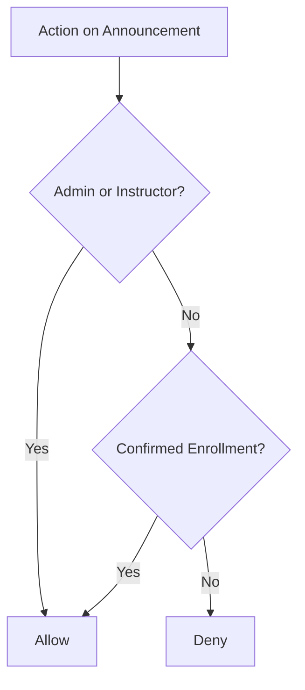
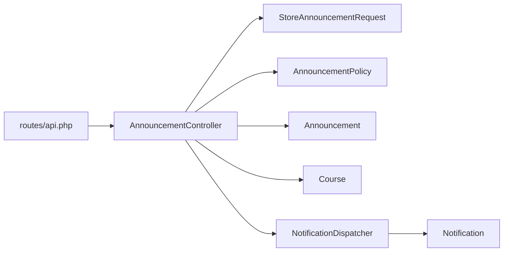

# Announcement System

<cite>
**Referenced Files in This Document**
- [Announcement.php](file://app/Models/Announcement.php)
- [Course.php](file://app/Models/Course.php)
- [User.php](file://app/Models/User.php)
- [Notification.php](file://app/Models/Notification.php)
- [AnnouncementController.php](file://app/Http/Controllers/Api/V1/AnnouncementController.php)
- [StoreAnnouncementRequest.php](file://app/Http/Requests/Api/V1/StoreAnnouncementRequest.php)
- [AnnouncementResource.php](file://app/Http/Resources/AnnouncementResource.php)
- [AnnouncementPolicy.php](file://app/Policies/AnnouncementPolicy.php)
- [NotificationDispatcher.php](file://app/Services/Notifications/NotificationDispatcher.php)
- [api.php](file://routes/api.php)
- [2024_01_01_000175_create_announcements_table.php](file://database/migrations/2024_01_01_000175_create_announcements_table.php)
- [AnnouncementTest.php](file://tests/Feature/Communication/AnnouncementTest.php)
</cite>

## Table of Contents
1. [Introduction](#introduction)
2. [Project Structure](#project-structure)
3. [Core Components](#core-components)
4. [Architecture Overview](#architecture-overview)
5. [Detailed Component Analysis](#detailed-component-analysis)
6. [Dependency Analysis](#dependency-analysis)
7. [Performance Considerations](#performance-considerations)
8. [Troubleshooting Guide](#troubleshooting-guide)
9. [Conclusion](#conclusion)

## Introduction
This document explains the Announcement System: how announcements are created, who can create them, how they are broadcast to target audiences, and how delivery is tracked via in-app notifications. It covers the end-to-end workflow from content creation through scheduling (as supported by the current implementation), distribution to specific users or groups, and read tracking. It also clarifies formatting, attachments, and integration with course contexts.

## Project Structure
The Announcement System spans models, controllers, requests, resources, policies, services, routes, and tests:
- Models define data and relationships (Announcement, Course, User, Notification).
- Controller handles API endpoints for listing, creating, and deleting announcements.
- Request class validates input and enforces authorization at request time.
- Resource formats responses for clients.
- Policy defines who can view, create, and delete announcements based on roles and enrollment.
- NotificationDispatcher fans out in-app notifications to confirmed-enrolled students when an announcement is posted.
- Routes expose REST endpoints under a versioned API namespace.
- Migration defines the announcements table schema.
- Tests validate behavior and permissions.

**Diagram sources**
- [api.php:231-234](file://routes/api.php#L231-L234)
- [AnnouncementController.php:20-49](file://app/Http/Controllers/Api/V1/AnnouncementController.php#L20-L49)
- [StoreAnnouncementRequest.php:13-26](file://app/Http/Requests/Api/V1/StoreAnnouncementRequest.php#L13-L26)
- [AnnouncementPolicy.php:15-35](file://app/Policies/AnnouncementPolicy.php#L15-L35)
- [NotificationDispatcher.php:142-156](file://app/Services/Notifications/NotificationDispatcher.php#L142-L156)
- [Announcement.php:12-40](file://app/Models/Announcement.php#L12-L40)
- [Course.php:155-161](file://app/Models/Course.php#L155-L161)
- [User.php:79-93](file://app/Models/User.php#L79-L93)
- [Notification.php:13-45](file://app/Models/Notification.php#L13-L45)

**Section sources**
- [api.php:231-234](file://routes/api.php#L231-L234)
- [AnnouncementController.php:20-49](file://app/Http/Controllers/Api/V1/AnnouncementController.php#L20-L49)
- [StoreAnnouncementRequest.php:13-26](file://app/Http/Requests/Api/V1/StoreAnnouncementRequest.php#L13-L26)
- [AnnouncementPolicy.php:15-35](file://app/Policies/AnnouncementPolicy.php#L15-L35)
- [NotificationDispatcher.php:142-156](file://app/Services/Notifications/NotificationDispatcher.php#L142-L156)
- [Announcement.php:12-40](file://app/Models/Announcement.php#L12-L40)
- [Course.php:155-161](file://app/Models/Course.php#L155-L161)
- [User.php:79-93](file://app/Models/User.php#L79-L93)
- [Notification.php:13-45](file://app/Models/Notification.php#L13-L45)

## Core Components
- Announcement model: stores title, body, course context, and author; no updates timestamp; belongs to Course and User (poster).
- Course model: owns many announcements; provides instructor checks used by policies.
- User model: holds role and enrollment relationships used for access control and notification targeting.
- Notification model: stores per-user in-app notifications with type, title, body, and related entity references.
- AnnouncementController: lists announcements for a course, creates new ones, and deletes existing ones.
- StoreAnnouncementRequest: validates title and body and enforces authorization to create within a course.
- AnnouncementResource: serializes announcement data including poster info when loaded.
- AnnouncementPolicy: controls who can view, create, and delete announcements based on admin/instructor status or confirmed enrollment.
- NotificationDispatcher: broadcasts announcement_posted notifications to all confirmed-enrolled students in the course.

Key behaviors:
- Creation writes an announcement tied to a course and posts it immediately.
- Broadcasting fans out in-app notifications to confirmed-enrolled students only.
- Read tracking is handled by the separate notifications inbox (read/unread APIs exist in routes).

**Section sources**
- [Announcement.php:12-40](file://app/Models/Announcement.php#L12-L40)
- [Course.php:155-161](file://app/Models/Course.php#L155-L161)
- [User.php:79-93](file://app/Models/User.php#L79-L93)
- [Notification.php:13-45](file://app/Models/Notification.php#L13-L45)
- [AnnouncementController.php:20-49](file://app/Http/Controllers/Api/V1/AnnouncementController.php#L20-L49)
- [StoreAnnouncementRequest.php:13-26](file://app/Http/Requests/Api/V1/StoreAnnouncementRequest.php#L13-L26)
- [AnnouncementResource.php:15-25](file://app/Http/Resources/AnnouncementResource.php#L15-L25)
- [AnnouncementPolicy.php:15-35](file://app/Policies/AnnouncementPolicy.php#L15-L35)
- [NotificationDispatcher.php:142-156](file://app/Services/Notifications/NotificationDispatcher.php#L142-L156)

## Architecture Overview
The system exposes REST endpoints for announcements scoped to a course. Authorized instructors or admins can create announcements. On creation, the controller persists the announcement and triggers notification dispatching to all confirmed-enrolled students. Students retrieve announcements via a course-scoped list endpoint. The notifications inbox supports marking individual or all notifications as read.

**Diagram sources**
- [api.php:231-234](file://routes/api.php#L231-L234)
- [AnnouncementController.php:29-39](file://app/Http/Controllers/Api/V1/AnnouncementController.php#L29-L39)
- [StoreAnnouncementRequest.php:13-19](file://app/Http/Requests/Api/V1/StoreAnnouncementRequest.php#L13-L19)
- [AnnouncementPolicy.php:27-30](file://app/Policies/AnnouncementPolicy.php#L27-L30)
- [Announcement.php:19-24](file://app/Models/Announcement.php#L19-L24)
- [NotificationDispatcher.php:142-156](file://app/Services/Notifications/NotificationDispatcher.php#L142-L156)
- [Notification.php:20-36](file://app/Models/Notification.php#L20-L36)

## Detailed Component Analysis

### Data Model and Relationships
- Announcement belongs to Course and User (poster). No updated_at; created_at tracks publication time.
- Course has many Announcements and provides instructor checks used by policies.
- User has enrollments and roles used for access and targeting.
- Notification stores per-user in-app messages with type, title, body, and related entity metadata.

**Diagram sources**
- [Announcement.php:12-40](file://app/Models/Announcement.php#L12-L40)
- [Course.php:155-161](file://app/Models/Course.php#L155-L161)
- [User.php:79-93](file://app/Models/User.php#L79-L93)
- [Notification.php:13-45](file://app/Models/Notification.php#L13-L45)

**Section sources**
- [Announcement.php:12-40](file://app/Models/Announcement.php#L12-L40)
- [Course.php:155-161](file://app/Models/Course.php#L155-L161)
- [User.php:79-93](file://app/Models/User.php#L79-L93)
- [Notification.php:13-45](file://app/Models/Notification.php#L13-L45)

### API Endpoints and Workflow
- List announcements for a course: GET /v1/courses/{course}/announcements
- Create an announcement: POST /v1/courses/{course}/announcements
- Delete an announcement: DELETE /v1/announcements/{announcement}
- Notifications inbox: GET /v1/notifications, mark read, mark all read

Workflow highlights:
- Listing returns announcements ordered newest first with poster details when loaded.
- Creating requires authorization via policy and request-level authorization.
- Deleting requires permission over the announcement’s course.
- After creation, in-app notifications are dispatched to confirmed-enrolled students.

**Diagram sources**
- [api.php:231-234](file://routes/api.php#L231-L234)
- [AnnouncementController.php:29-39](file://app/Http/Controllers/Api/V1/AnnouncementController.php#L29-L39)
- [StoreAnnouncementRequest.php:13-26](file://app/Http/Requests/Api/V1/StoreAnnouncementRequest.php#L13-L26)
- [AnnouncementPolicy.php:27-30](file://app/Policies/AnnouncementPolicy.php#L27-L30)
- [NotificationDispatcher.php:142-156](file://app/Services/Notifications/NotificationDispatcher.php#L142-L156)

**Section sources**
- [api.php:231-234](file://routes/api.php#L231-L234)
- [AnnouncementController.php:20-49](file://app/Http/Controllers/Api/V1/AnnouncementController.php#L20-L49)
- [StoreAnnouncementRequest.php:13-26](file://app/Http/Requests/Api/V1/StoreAnnouncementRequest.php#L13-L26)
- [AnnouncementPolicy.php:15-35](file://app/Policies/AnnouncementPolicy.php#L15-L35)
- [NotificationDispatcher.php:142-156](file://app/Services/Notifications/NotificationDispatcher.php#L142-L156)

### Target Audience Selection and Delivery
- Target audience: all confirmed-enrolled students in the course where the announcement was posted.
- Delivery method: in-app notifications of type announcement_posted with title and body, linked to the announcement entity.
- Read tracking: notifications support marking individual or all as read via dedicated endpoints.

**Diagram sources**
- [api.php:236-240](file://routes/api.php#L236-L240)
- [NotificationDispatcher.php:142-156](file://app/Services/Notifications/NotificationDispatcher.php#L142-L156)
- [Notification.php:20-36](file://app/Models/Notification.php#L20-L36)

**Section sources**
- [NotificationDispatcher.php:142-156](file://app/Services/Notifications/NotificationDispatcher.php#L142-L156)
- [api.php:236-240](file://routes/api.php#L236-L240)
- [Notification.php:20-36](file://app/Models/Notification.php#L20-L36)

### Formatting, Attachments, and Context
- Content fields: title and body stored as strings/text. No rich-text or attachment columns in the announcements table.
- Attachments: not supported by the current announcement model or migration.
- Context: each announcement is scoped to a course via course_id, enabling course-specific visibility and listing.

**Section sources**
- [2024_01_01_000175_create_announcements_table.php:13-20](file://database/migrations/2024_01_01_000175_create_announcements_table.php#L13-L20)
- [Announcement.php:19-24](file://app/Models/Announcement.php#L19-L24)
- [Course.php:155-161](file://app/Models/Course.php#L155-L161)

### Policies and Visibility
- View any: Admins, instructors teaching the course, or students with confirmed enrollment can list announcements.
- Create: Admins or instructors teaching the course.
- Delete: Same as create (requires authority over the course).

**Diagram sources**
- [AnnouncementPolicy.php:15-35](file://app/Policies/AnnouncementPolicy.php#L15-L35)

**Section sources**
- [AnnouncementPolicy.php:15-35](file://app/Policies/AnnouncementPolicy.php#L15-L35)

### Examples and Usage Scenarios
- Create an announcement: An instructor posts a message for a course; the system persists it and notifies all confirmed-enrolled students.
- Target specific audiences: Currently, announcements target all confirmed-enrolled students in the course; there is no per-group or per-student scoping in this implementation.
- Manage visibility: Only authorized users can create/delete; students can view announcements for courses they are confirmed-enrolled in.

Validation and response shape:
- Input validation ensures required title and body.
- Responses serialize announcement data including poster information when loaded.

**Section sources**
- [StoreAnnouncementRequest.php:21-26](file://app/Http/Requests/Api/V1/StoreAnnouncementRequest.php#L21-L26)
- [AnnouncementResource.php:15-25](file://app/Http/Resources/AnnouncementResource.php#L15-L25)
- [AnnouncementController.php:29-39](file://app/Http/Controllers/Api/V1/AnnouncementController.php#L29-L39)
- [AnnouncementTest.php:11-27](file://tests/Feature/Communication/AnnouncementTest.php#L11-L27)
- [AnnouncementTest.php:29-39](file://tests/Feature/Communication/AnnouncementTest.php#L29-L39)

## Dependency Analysis
- Controller depends on Request for validation/authorization, Policy for business rules, Model for persistence, and Service for broadcasting.
- NotificationDispatcher depends on Course enrollment data to determine recipients and writes to Notification model.
- Routes bind endpoints to controller methods and group them under authentication middleware.

**Diagram sources**
- [api.php:231-234](file://routes/api.php#L231-L234)
- [AnnouncementController.php:20-49](file://app/Http/Controllers/Api/V1/AnnouncementController.php#L20-L49)
- [StoreAnnouncementRequest.php:13-26](file://app/Http/Requests/Api/V1/StoreAnnouncementRequest.php#L13-L26)
- [AnnouncementPolicy.php:15-35](file://app/Policies/AnnouncementPolicy.php#L15-L35)
- [NotificationDispatcher.php:142-156](file://app/Services/Notifications/NotificationDispatcher.php#L142-L156)

**Section sources**
- [api.php:231-234](file://routes/api.php#L231-L234)
- [AnnouncementController.php:20-49](file://app/Http/Controllers/Api/V1/AnnouncementController.php#L20-L49)
- [NotificationDispatcher.php:142-156](file://app/Services/Notifications/NotificationDispatcher.php#L142-L156)

## Performance Considerations
- Broadcasting fan-out: Each announcement triggers one notification per confirmed-enrolled student. For large cohorts, consider queuing notification creation to avoid blocking the request.
- Eager loading: When listing announcements, eager-load poster details to reduce N+1 queries.
- Indexes: Ensure indexes on course_id and user_id in relevant tables for efficient filtering and joins.

[No sources needed since this section provides general guidance]

## Troubleshooting Guide
Common issues and resolutions:
- Forbidden when posting announcements: Verify the user is an admin or assigned as an instructor for the course; otherwise, creation is denied by policy.
- No notifications received: Confirm the recipient has a confirmed enrollment in the course; only confirmed-enrolled students receive announcement notifications.
- Cannot delete an announcement: Deletion requires the same authority as creation (admin or instructor of the course).
- Missing poster info in responses: Ensure the response includes the poster relationship when loading announcements.

**Section sources**
- [AnnouncementPolicy.php:15-35](file://app/Policies/AnnouncementPolicy.php#L15-L35)
- [NotificationDispatcher.php:142-156](file://app/Services/Notifications/NotificationDispatcher.php#L142-L156)
- [AnnouncementController.php:20-49](file://app/Http/Controllers/Api/V1/AnnouncementController.php#L20-L49)

## Conclusion
The Announcement System provides a course-scoped mechanism for instructors and admins to publish announcements that are immediately delivered as in-app notifications to all confirmed-enrolled students. It integrates tightly with course membership and roles to enforce visibility and permissions. While attachments and advanced formatting are not currently supported, the system offers a clear foundation for future enhancements such as scheduled publishing, targeted distribution to groups, and richer content types.