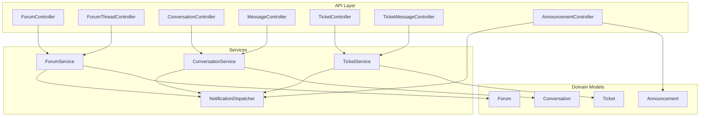
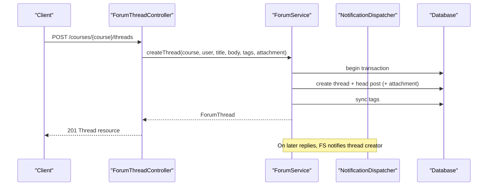
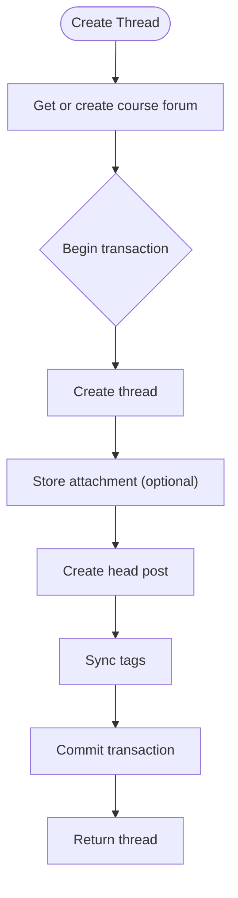
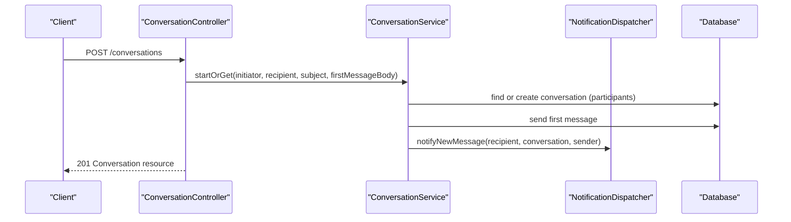
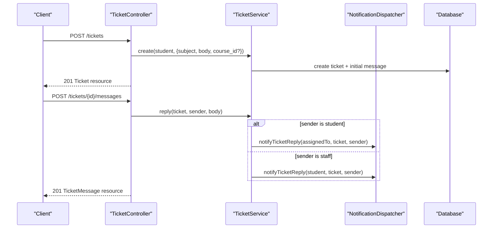
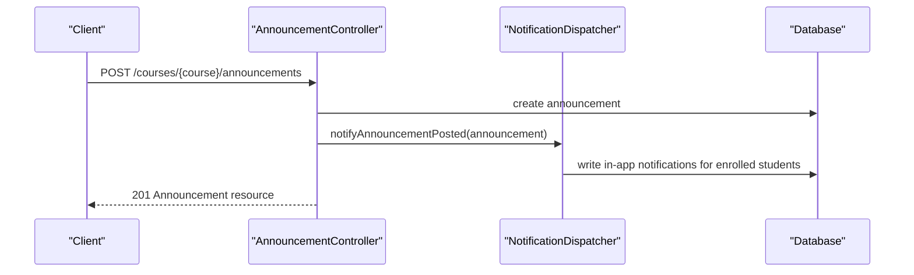
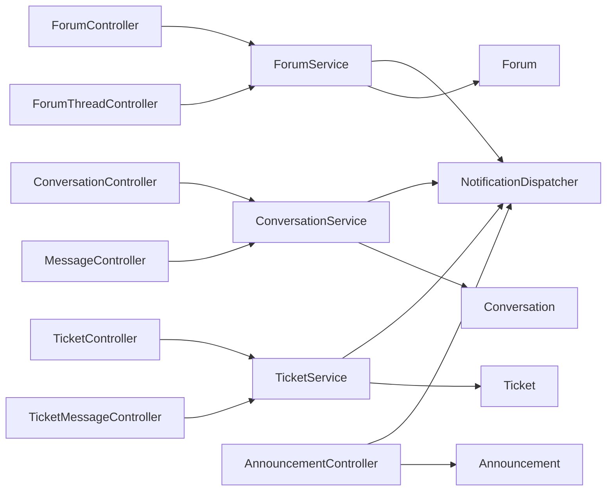

# Communication Platform

<cite>
**Referenced Files in This Document**
- [ForumService.php](file://app/Services/Communication/ForumService.php)
- [ConversationService.php](file://app/Services/Communication/ConversationService.php)
- [TicketService.php](file://app/Services/Communication/TicketService.php)
- [ForumController.php](file://app/Http/Controllers/Api/V1/ForumController.php)
- [ForumThreadController.php](file://app/Http/Controllers/Api/V1/ForumThreadController.php)
- [ConversationController.php](file://app/Http/Controllers/Api/V1/ConversationController.php)
- [MessageController.php](file://app/Http/Controllers/Api/V1/MessageController.php)
- [TicketController.php](file://app/Http/Controllers/Api/V1/TicketController.php)
- [TicketMessageController.php](file://app/Http/Controllers/Api/V1/TicketMessageController.php)
- [AnnouncementController.php](file://app/Http/Controllers/Api/V1/AnnouncementController.php)
- [NotificationDispatcher.php](file://app/Services/Notifications/NotificationDispatcher.php)
- [Forum.php](file://app/Models/Forum.php)
- [Conversation.php](file://app/Models/Conversation.php)
- [Ticket.php](file://app/Models/Ticket.php)
- [Announcement.php](file://app/Models/Announcement.php)
- [ForumThreadPolicy.php](file://app/Policies/ForumThreadPolicy.php)
- [ConversationPolicy.php](file://app/Policies/ConversationPolicy.php)
- [TicketPolicy.php](file://app/Policies/TicketPolicy.php)
</cite>

## Table of Contents
1. Introduction
2. Project Structure
3. Core Components
4. Architecture Overview
5. Detailed Component Analysis
6. Dependency Analysis
7. Performance Considerations
8. Troubleshooting Guide
9. Conclusion

## Introduction
This document explains the Communication Platform sub-feature, covering forum discussions, direct messaging, support tickets, and announcement broadcasting. It focuses on the service layer implementations (ForumService, ConversationService, TicketService), real-time notification patterns via NotificationDispatcher, message threading for forums, and end-to-end workflows exposed by API controllers. It also clarifies how user roles and permissions govern access to course-specific communication channels.

## Project Structure
The Communication Platform is implemented as a set of domain services under app/Services/Communication, coordinated by API controllers under app/Http/Controllers/Api/V1, with models and policies defining data relationships and authorization rules. Notifications are centralized in a dispatcher that writes in-app notifications for all communication events.

**Diagram sources**
- [ForumController.php:1-100](file://app/Http/Controllers/Api/V1/ForumController.php#L1-L100)
- [ForumThreadController.php:1-115](file://app/Http/Controllers/Api/V1/ForumThreadController.php#L1-L115)
- [ConversationController.php:1-63](file://app/Http/Controllers/Api/V1/ConversationController.php#L1-L63)
- [MessageController.php:1-24](file://app/Http/Controllers/Api/V1/MessageController.php#L1-L24)
- [TicketController.php:1-63](file://app/Http/Controllers/Api/V1/TicketController.php#L1-L63)
- [TicketMessageController.php:1-24](file://app/Http/Controllers/Api/V1/TicketMessageController.php#L1-L24)
- [AnnouncementController.php:1-51](file://app/Http/Controllers/Api/V1/AnnouncementController.php#L1-L51)
- [ForumService.php:1-223](file://app/Services/Communication/ForumService.php#L1-L223)
- [ConversationService.php:1-164](file://app/Services/Communication/ConversationService.php#L1-L164)
- [TicketService.php:1-88](file://app/Services/Communication/TicketService.php#L1-L88)
- [NotificationDispatcher.php:1-206](file://app/Services/Notifications/NotificationDispatcher.php#L1-L206)
- [Forum.php:1-41](file://app/Models/Forum.php#L1-L41)
- [Conversation.php:1-41](file://app/Models/Conversation.php#L1-L41)
- [Ticket.php:1-67](file://app/Models/Ticket.php#L1-L67)
- [Announcement.php:1-42](file://app/Models/Announcement.php#L1-L42)

**Section sources**
- [ForumController.php:1-100](file://app/Http/Controllers/Api/V1/ForumController.php#L1-L100)
- [ForumThreadController.php:1-115](file://app/Http/Controllers/Api/V1/ForumThreadController.php#L1-L115)
- [ConversationController.php:1-63](file://app/Http/Controllers/Api/V1/ConversationController.php#L1-L63)
- [MessageController.php:1-24](file://app/Http/Controllers/Api/V1/MessageController.php#L1-L24)
- [TicketController.php:1-63](file://app/Http/Controllers/Api/V1/TicketController.php#L1-L63)
- [TicketMessageController.php:1-24](file://app/Http/Controllers/Api/V1/TicketMessageController.php#L1-L24)
- [AnnouncementController.php:1-51](file://app/Http/Controllers/Api/V1/AnnouncementController.php#L1-L51)
- [ForumService.php:1-223](file://app/Services/Communication/ForumService.php#L1-L223)
- [ConversationService.php:1-164](file://app/Services/Communication/ConversationService.php#L1-L164)
- [TicketService.php:1-88](file://app/Services/Communication/TicketService.php#L1-L88)
- [NotificationDispatcher.php:1-206](file://app/Services/Notifications/NotificationDispatcher.php#L1-L206)
- [Forum.php:1-41](file://app/Models/Forum.php#L1-L41)
- [Conversation.php:1-41](file://app/Models/Conversation.php#L1-L41)
- [Ticket.php:1-67](file://app/Models/Ticket.php#L1-L67)
- [Announcement.php:1-42](file://app/Models/Announcement.php#L1-L42)

## Core Components
- ForumService: Creates or retrieves a per-course forum, creates threads with optional attachments, handles replies, tags, read tracking, moderation (mark solved), and post updates/deletes.
- ConversationService: Enforces role-based pairing rules for 1:1 conversations, reuses existing conversation pairs, sends messages, marks messages read, and lists contactable users based on enrollment and roles.
- TicketService: Manages student support tickets with status lifecycle, assignment, and threaded replies; notifies appropriate parties on each reply.
- NotificationDispatcher: Centralized in-app notification writer for new messages, ticket replies, forum replies, thread solved, announcements, and other system events.

Key behaviors:
- Course-scoped forums created lazily per course.
- Threaded discussions with head post and replies; tags and read tracking.
- Strict 1:1 messaging with role-pair validation and enrollment checks.
- Support tickets scoped to students and staff with assignment and status management.
- Announcements broadcast to confirmed-enrolled students in a course.

**Section sources**
- [ForumService.php:39-153](file://app/Services/Communication/ForumService.php#L39-L153)
- [ConversationService.php:27-162](file://app/Services/Communication/ConversationService.php#L27-L162)
- [TicketService.php:25-86](file://app/Services/Communication/TicketService.php#L25-L86)
- [NotificationDispatcher.php:78-156](file://app/Services/Notifications/NotificationDispatcher.php#L78-L156)

## Architecture Overview
The API controllers orchestrate requests through services, which persist data and trigger notifications. Policies enforce role-based access at controller boundaries. Models define relationships between entities like forums, threads, posts, conversations, messages, tickets, and announcements.

**Diagram sources**
- [ForumThreadController.php:71-84](file://app/Http/Controllers/Api/V1/ForumThreadController.php#L71-L84)
- [ForumService.php:50-86](file://app/Services/Communication/ForumService.php#L50-L86)
- [NotificationDispatcher.php:113-136](file://app/Services/Notifications/NotificationDispatcher.php#L113-L136)

**Section sources**
- [ForumThreadController.php:1-115](file://app/Http/Controllers/Api/V1/ForumThreadController.php#L1-L115)
- [ForumService.php:1-223](file://app/Services/Communication/ForumService.php#L1-L223)
- [NotificationDispatcher.php:1-206](file://app/Services/Notifications/NotificationDispatcher.php#L1-L206)

## Detailed Component Analysis

### Forum Discussions
ForumService provides:
- Lazy per-course forum creation.
- Thread creation with optional attachments and tag synchronization.
- Text-only replies that update thread activity timestamps.
- Staff-only mark-solved with notification to thread creator.
- Read tracking per user-thread pair.
- Post updates with attachment handling and deletion cascading for head posts.

Real-world flows:
- Create a discussion thread with tags and an attachment.
- Reply to a thread; thread creator receives a notification if not the replier.
- Mark thread solved (staff only); creator receives a notification.
- List threads with search, filters, sorting, and unread counts.

**Diagram sources**
- [ForumService.php:50-86](file://app/Services/Communication/ForumService.php#L50-L86)

**Section sources**
- [ForumService.php:39-223](file://app/Services/Communication/ForumService.php#L39-L223)
- [ForumThreadController.php:30-115](file://app/Http/Controllers/Api/V1/ForumThreadController.php#L30-L115)
- [ForumController.php:32-97](file://app/Http/Controllers/Api/V1/ForumController.php#L32-L97)
- [ForumThreadPolicy.php:15-49](file://app/Policies/ForumThreadPolicy.php#L15-L49)

### Direct Messaging (Conversations)
ConversationService enforces:
- Role-pair rules: Admin can message anyone; Instructor can message their enrolled students; Student can message admins and their instructors; Student-to-Student is disallowed.
- Reuse of existing 1:1 conversation between two users.
- Message sending with notifications to non-sender participants.
- Read receipts marking all unread messages from others as read.
- Contactable user discovery based on enrollment and roles.

**Diagram sources**
- [ConversationController.php:40-52](file://app/Http/Controllers/Api/V1/ConversationController.php#L40-L52)
- [ConversationService.php:50-97](file://app/Services/Communication/ConversationService.php#L50-L97)
- [NotificationDispatcher.php:78-91](file://app/Services/Notifications/NotificationDispatcher.php#L78-L91)

**Section sources**
- [ConversationService.php:27-162](file://app/Services/Communication/ConversationService.php#L27-L162)
- [ConversationController.php:21-61](file://app/Http/Controllers/Api/V1/ConversationController.php#L21-L61)
- [MessageController.php:17-22](file://app/Http/Controllers/Api/V1/MessageController.php#L17-L22)
- [ConversationPolicy.php:12-26](file://app/Policies/ConversationPolicy.php#L12-L26)

### Ticket System
TicketService manages:
- Creation of tickets with optional course scoping and initial message.
- Replies that notify either the assigned staff member or the student depending on who replied.
- Status transitions (Open/Resolved/Closed) with resolved_at timestamping.
- Assignment changes.

**Diagram sources**
- [TicketController.php:42-61](file://app/Http/Controllers/Api/V1/TicketController.php#L42-L61)
- [TicketService.php:25-62](file://app/Services/Communication/TicketService.php#L25-L62)
- [NotificationDispatcher.php:93-107](file://app/Services/Notifications/NotificationDispatcher.php#L93-L107)

**Section sources**
- [TicketService.php:25-86](file://app/Services/Communication/TicketService.php#L25-L86)
- [TicketController.php:25-61](file://app/Http/Controllers/Api/V1/TicketController.php#L25-L61)
- [TicketMessageController.php:17-22](file://app/Http/Controllers/Api/V1/TicketMessageController.php#L17-L22)
- [TicketPolicy.php:13-39](file://app/Policies/TicketPolicy.php#L13-L39)

### Announcement Broadcasting
AnnouncementController persists announcements scoped to a course and triggers a broadcast to all confirmed-enrolled students via NotificationDispatcher.

**Diagram sources**
- [AnnouncementController.php:29-40](file://app/Http/Controllers/Api/V1/AnnouncementController.php#L29-L40)
- [NotificationDispatcher.php:138-156](file://app/Services/Notifications/NotificationDispatcher.php#L138-L156)

**Section sources**
- [AnnouncementController.php:20-40](file://app/Http/Controllers/Api/V1/AnnouncementController.php#L20-L40)
- [NotificationDispatcher.php:138-156](file://app/Services/Notifications/NotificationDispatcher.php#L138-L156)
- [Announcement.php:12-42](file://app/Models/Announcement.php#L12-L42)

## Dependency Analysis
- Controllers depend on services for business logic and on policies for authorization.
- Services depend on NotificationDispatcher for consistent in-app notifications.
- Models encapsulate relationships and casts; enums drive state machines (e.g., TicketStatus).
- Policies centralize role-based access control across features.

**Diagram sources**
- [ForumController.php:1-100](file://app/Http/Controllers/Api/V1/ForumController.php#L1-L100)
- [ForumThreadController.php:1-115](file://app/Http/Controllers/Api/V1/ForumThreadController.php#L1-L115)
- [ConversationController.php:1-63](file://app/Http/Controllers/Api/V1/ConversationController.php#L1-L63)
- [MessageController.php:1-24](file://app/Http/Controllers/Api/V1/MessageController.php#L1-L24)
- [TicketController.php:1-63](file://app/Http/Controllers/Api/V1/TicketController.php#L1-L63)
- [TicketMessageController.php:1-24](file://app/Http/Controllers/Api/V1/TicketMessageController.php#L1-L24)
- [AnnouncementController.php:1-51](file://app/Http/Controllers/Api/V1/AnnouncementController.php#L1-L51)
- [ForumService.php:1-223](file://app/Services/Communication/ForumService.php#L1-L223)
- [ConversationService.php:1-164](file://app/Services/Communication/ConversationService.php#L1-L164)
- [TicketService.php:1-88](file://app/Services/Communication/TicketService.php#L1-L88)
- [NotificationDispatcher.php:1-206](file://app/Services/Notifications/NotificationDispatcher.php#L1-L206)
- [Forum.php:1-41](file://app/Models/Forum.php#L1-L41)
- [Conversation.php:1-41](file://app/Models/Conversation.php#L1-L41)
- [Ticket.php:1-67](file://app/Models/Ticket.php#L1-L67)
- [Announcement.php:1-42](file://app/Models/Announcement.php#L1-L42)

**Section sources**
- [ForumService.php:1-223](file://app/Services/Communication/ForumService.php#L1-L223)
- [ConversationService.php:1-164](file://app/Services/Communication/ConversationService.php#L1-L164)
- [TicketService.php:1-88](file://app/Services/Communication/TicketService.php#L1-L88)
- [NotificationDispatcher.php:1-206](file://app/Services/Notifications/NotificationDispatcher.php#L1-L206)

## Performance Considerations
- Use transactions when creating multiple related records (e.g., thread + head post + tags) to ensure consistency and reduce round-trips.
- Paginate thread listings and limit eager loading to avoid N+1 queries.
- Leverage full-text search on post bodies for efficient thread search.
- Batch notification writes where possible; consider background jobs for high-volume broadcasts (e.g., announcements).
- Avoid unnecessary joins by using exists() checks for enrollment validations.

[No sources needed since this section provides general guidance]

## Troubleshooting Guide
Common issues and resolutions:
- Permission denied when accessing forums: Ensure the user has confirmed enrollment or is an instructor/admin for the course. Check policy enforcement in the forum thread policy.
- Cannot start a conversation: Verify role-pair rules; Student-to-Student is disallowed. Confirm enrollment linkage for Instructor-Student pairs.
- No notifications received: Confirm NotificationDispatcher is invoked and notifications table is writable. Validate related entity IDs and types.
- Ticket replies not notifying correct party: Ensure assignment is set when student replies; verify sender identity and notification dispatch path.
- Attachments missing after update: Confirm storage service paths and deletion logic during post updates.

**Section sources**
- [ForumThreadPolicy.php:15-49](file://app/Policies/ForumThreadPolicy.php#L15-L49)
- [ConversationService.php:27-44](file://app/Services/Communication/ConversationService.php#L27-L44)
- [NotificationDispatcher.php:27-39](file://app/Services/Notifications/NotificationDispatcher.php#L27-L39)
- [TicketService.php:45-62](file://app/Services/Communication/TicketService.php#L45-L62)
- [ForumService.php:155-221](file://app/Services/Communication/ForumService.php#L155-L221)

## Conclusion
The Communication Platform integrates forums, direct messaging, support tickets, and announcements into a cohesive system governed by clear role-based policies and centralized notifications. Services encapsulate core workflows, while controllers expose well-scoped APIs. The design supports course-specific channels, real-time-like updates via in-app notifications, and scalable patterns for future enhancements such as email/SMS/push fan-out.

[No sources needed since this section summarizes without analyzing specific files]