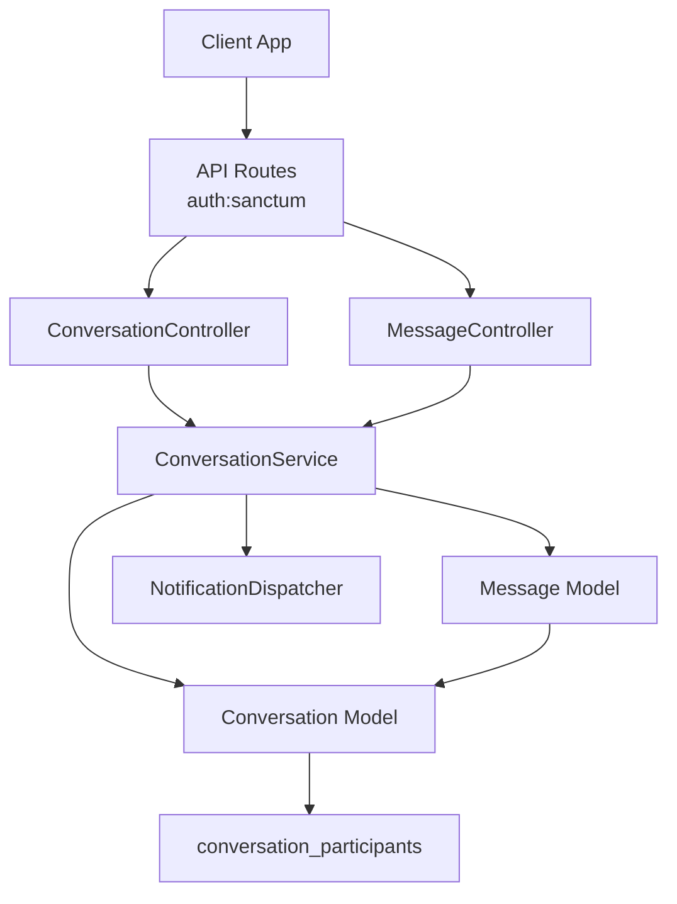
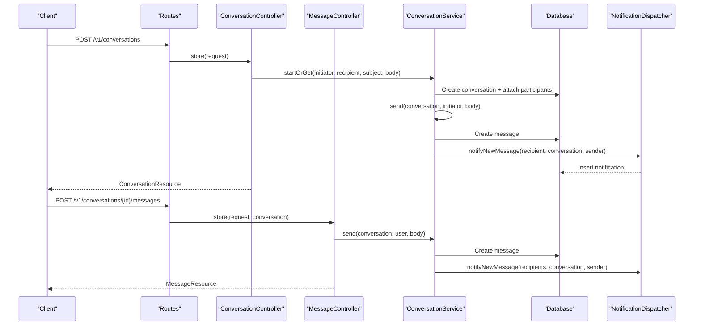
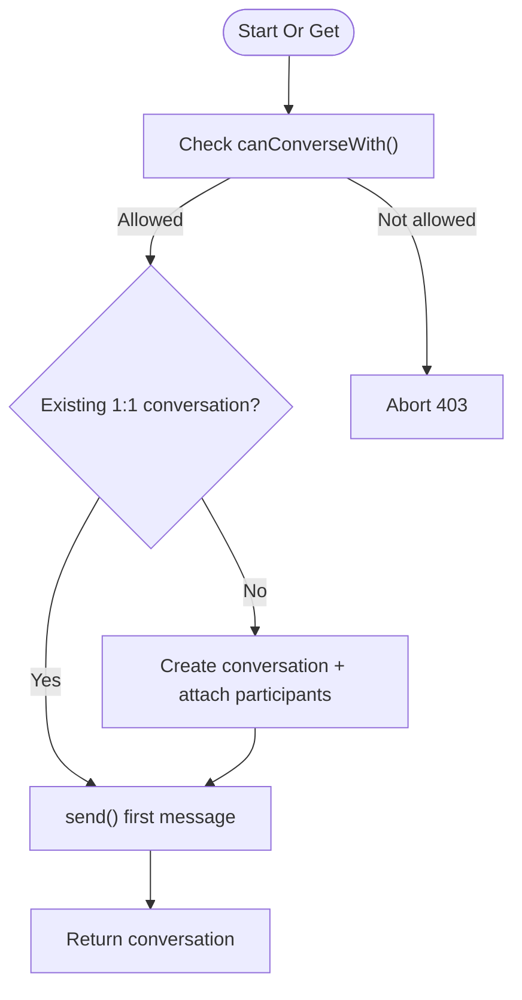
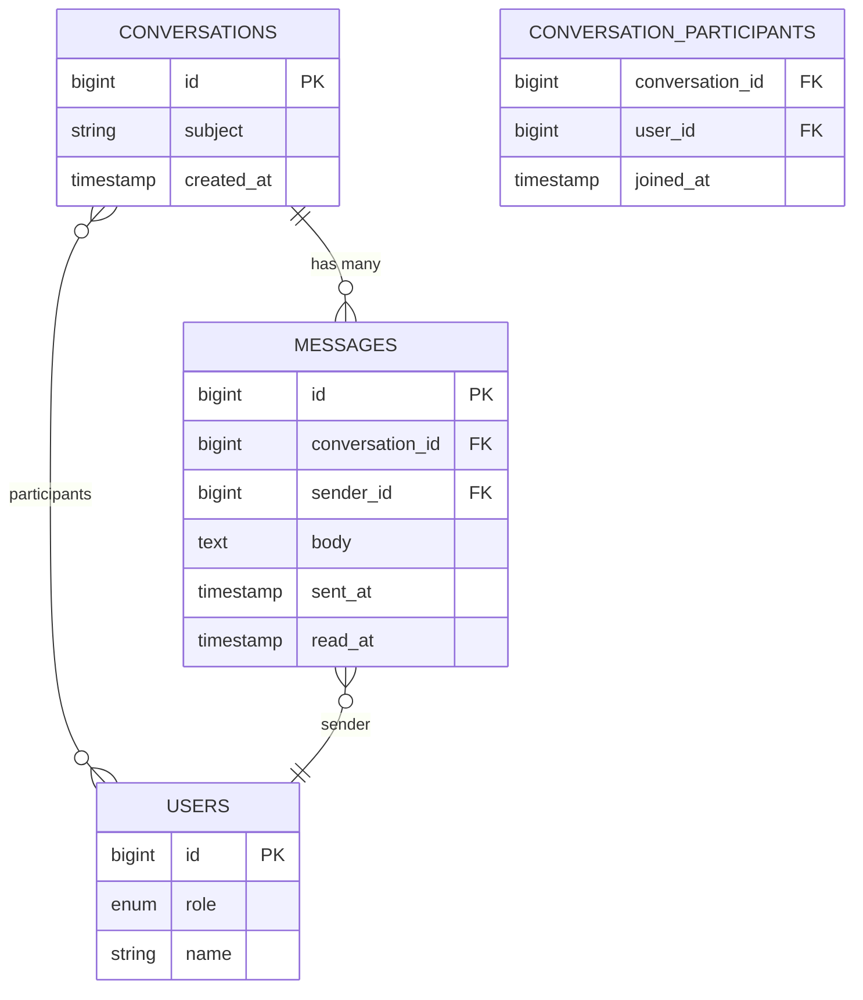
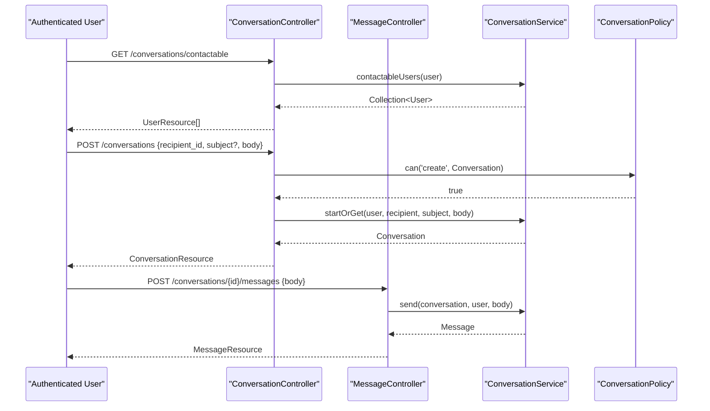
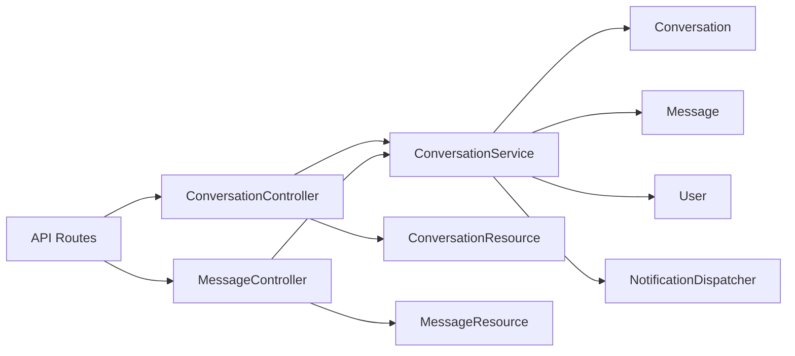

# Direct Messaging

<cite>
**Referenced Files in This Document**
- [ConversationService.php](file://app/Services/Communication/ConversationService.php)
- [ConversationController.php](file://app/Http/Controllers/Api/V1/ConversationController.php)
- [MessageController.php](file://app/Http/Controllers/Api/V1/MessageController.php)
- [Conversation.php](file://app/Models/Conversation.php)
- [Message.php](file://app/Models/Message.php)
- [User.php](file://app/Models/User.php)
- [ConversationPolicy.php](file://app/Policies/ConversationPolicy.php)
- [StoreConversationRequest.php](file://app/Http/Requests/Api/V1/StoreConversationRequest.php)
- [StoreMessageRequest.php](file://app/Http/Requests/Api/V1/StoreMessageRequest.php)
- [NotificationDispatcher.php](file://app/Services/Notifications/NotificationDispatcher.php)
- [ConversationResource.php](file://app/Http/Resources/ConversationResource.php)
- [api.php](file://routes/api.php)
- [2024_01_01_000170_create_conversations_table.php](file://database/migrations/2024_01_01_000170_create_conversations_table.php)
- [2024_01_01_000171_create_conversation_participants_table.php](file://database/migrations/2024_01_01_000171_create_conversation_participants_table.php)
- [2024_01_01_000172_create_messages_table.php](file://database/migrations/2024_01_01_000172_create_messages_table.php)
</cite>

## Table of Contents
1. [Introduction](#introduction)
2. [Project Structure](#project-structure)
3. [Core Components](#core-components)
4. [Architecture Overview](#architecture-overview)
5. [Detailed Component Analysis](#detailed-component-analysis)
6. [Dependency Analysis](#dependency-analysis)
7. [Performance Considerations](#performance-considerations)
8. [Troubleshooting Guide](#troubleshooting-guide)
9. [Conclusion](#conclusion)

## Introduction
This document explains the Direct Messaging system implemented for one-to-one conversations between users with specific role relationships (Admin, Instructor, Student). It covers conversation creation and reuse, message sending/receiving, participant management, read receipts, access control, and notification delivery. The system is designed around a single ConversationService that encapsulates business rules, while controllers expose REST endpoints and models define data relationships. Notifications are written to an in-app inbox via NotificationDispatcher.

## Project Structure
The messaging feature spans services, models, controllers, requests, policies, resources, routes, and database migrations:
- Service layer: ConversationService handles all business logic for conversations and messages.
- Models: Conversation and Message define entities and relationships; User provides roles and course context.
- Controllers: ConversationController and MessageController expose REST endpoints under authenticated routes.
- Requests: StoreConversationRequest and StoreMessageRequest validate inputs and authorize actions.
- Policies: ConversationPolicy enforces view permissions based on participation.
- Resources: ConversationResource formats responses including unread counts and last message.
- Routes: API routes group messaging endpoints under auth:sanctum.
- Migrations: Define conversations, conversation_participants, and messages tables.

**Diagram sources**
- [api.php:198-204](file://routes/api.php#L198-L204)
- [ConversationController.php:17-61](file://app/Http/Controllers/Api/V1/ConversationController.php#L17-L61)
- [MessageController.php:13-22](file://app/Http/Controllers/Api/V1/MessageController.php#L13-L22)
- [ConversationService.php:23-163](file://app/Services/Communication/ConversationService.php#L23-L163)
- [Conversation.php:13-40](file://app/Models/Conversation.php#L13-L40)
- [Message.php:12-47](file://app/Models/Message.php#L12-L47)
- [NotificationDispatcher.php:25-91](file://app/Services/Notifications/NotificationDispatcher.php#L25-L91)

**Section sources**
- [api.php:198-204](file://routes/api.php#L198-L204)
- [ConversationController.php:17-61](file://app/Http/Controllers/Api/V1/ConversationController.php#L17-L61)
- [MessageController.php:13-22](file://app/Http/Controllers/Api/V1/MessageController.php#L13-L22)
- [ConversationService.php:23-163](file://app/Services/Communication/ConversationService.php#L23-L163)
- [Conversation.php:13-40](file://app/Models/Conversation.php#L13-L40)
- [Message.php:12-47](file://app/Models/Message.php#L12-L47)
- [NotificationDispatcher.php:25-91](file://app/Services/Notifications/NotificationDispatcher.php#L25-L91)

## Core Components
- ConversationService: Central orchestrator for creating or reusing 1:1 conversations, sending messages, marking messages as read, and determining contactable users based on roles and course enrollments.
- Conversation and Message models: Define entities, relationships, and attributes such as subject, participants, body, timestamps, and read status.
- Controllers: Provide REST endpoints for listing conversations, fetching contactable users, starting conversations, viewing a conversation (with read receipt), and posting messages.
- Request classes: Validate payloads and enforce authorization before controller actions.
- Policy: Ensures only participants can view a conversation.
- Resource: Formats conversation responses including unread counts and last message.
- NotificationDispatcher: Writes in-app notifications for new messages.

**Section sources**
- [ConversationService.php:23-163](file://app/Services/Communication/ConversationService.php#L23-L163)
- [Conversation.php:13-40](file://app/Models/Conversation.php#L13-L40)
- [Message.php:12-47](file://app/Models/Message.php#L12-L47)
- [ConversationController.php:17-61](file://app/Http/Controllers/Api/V1/ConversationController.php#L17-L61)
- [MessageController.php:13-22](file://app/Http/Controllers/Api/V1/MessageController.php#L13-L22)
- [StoreConversationRequest.php:11-26](file://app/Http/Requests/Api/V1/StoreConversationRequest.php#L11-L26)
- [StoreMessageRequest.php:10-26](file://app/Http/Requests/Api/V1/StoreMessageRequest.php#L10-L26)
- [ConversationPolicy.php:10-27](file://app/Policies/ConversationPolicy.php#L10-L27)
- [ConversationResource.php:14-39](file://app/Http/Resources/ConversationResource.php#L14-L39)
- [NotificationDispatcher.php:25-91](file://app/Services/Notifications/NotificationDispatcher.php#L25-L91)

## Architecture Overview
The messaging architecture follows a layered approach:
- HTTP layer: Authenticated routes delegate to controllers.
- Controller layer: Validates input via request classes and delegates to service.
- Service layer: Enforces business rules (role-based permissions, enrollment checks), persists data, and triggers notifications.
- Data layer: Eloquent models interact with database tables defined by migrations.
- Notification layer: In-app notifications are created for recipients upon new messages.

**Diagram sources**
- [api.php:198-204](file://routes/api.php#L198-L204)
- [ConversationController.php:40-61](file://app/Http/Controllers/Api/V1/ConversationController.php#L40-L61)
- [MessageController.php:17-22](file://app/Http/Controllers/Api/V1/MessageController.php#L17-L22)
- [ConversationService.php:50-97](file://app/Services/Communication/ConversationService.php#L50-L97)
- [NotificationDispatcher.php:81-91](file://app/Services/Notifications/NotificationDispatcher.php#L81-L91)

## Detailed Component Analysis

### ConversationService
Responsibilities:
- Permission checks: Determines if two users can converse based on roles and enrollment relationships.
- Conversation lifecycle: Reuses existing 1:1 conversations or creates new ones with initial message.
- Message handling: Creates messages and notifies non-sender participants.
- Read receipts: Marks unread messages from others as read when a conversation is viewed.
- Contactable users: Returns users eligible for messaging based on roles and course enrollments.

Key behaviors:
- Role-based gating: Admins can message any role; Instructors can message students enrolled in their courses; Students can message instructors teaching them and admins.
- Transactional creation: Conversation creation and first message are wrapped in a transaction to ensure consistency.
- Notification dispatch: For each message, a notification is created for every other participant.

**Diagram sources**
- [ConversationService.php:27-79](file://app/Services/Communication/ConversationService.php#L27-L79)

**Section sources**
- [ConversationService.php:27-163](file://app/Services/Communication/ConversationService.php#L27-L163)

### Models: Conversation and Message
- Conversation:
  - Has many messages.
  - Many-to-many relationship with users via conversation_participants with joined_at pivot.
- Message:
  - Belongs to conversation and sender.
  - Tracks sent_at and optional read_at for read receipts.

**Diagram sources**
- [Conversation.php:13-40](file://app/Models/Conversation.php#L13-L40)
- [Message.php:12-47](file://app/Models/Message.php#L12-L47)
- [2024_01_01_000170_create_conversations_table.php:11-18](file://database/migrations/2024_01_01_000170_create_conversations_table.php#L11-L18)
- [2024_01_01_000171_create_conversation_participants_table.php:11-18](file://database/migrations/2024_01_01_000171_create_conversation_participants_table.php#L11-L18)
- [2024_01_01_000172_create_messages_table.php:11-21](file://database/migrations/2024_01_01_000172_create_messages_table.php#L11-L21)

**Section sources**
- [Conversation.php:13-40](file://app/Models/Conversation.php#L13-L40)
- [Message.php:12-47](file://app/Models/Message.php#L12-L47)
- [2024_01_01_000170_create_conversations_table.php:11-18](file://database/migrations/2024_01_01_000170_create_conversations_table.php#L11-L18)
- [2024_01_01_000171_create_conversation_participants_table.php:11-18](file://database/migrations/2024_01_01_000171_create_conversation_participants_table.php#L11-L18)
- [2024_01_01_000172_create_messages_table.php:11-21](file://database/migrations/2024_01_01_000172_create_messages_table.php#L11-L21)

### Controllers and Requests
- ConversationController:
  - Lists conversations for the current user.
  - Provides contactable users list.
  - Starts or resumes a conversation and sends the first message.
  - Shows a conversation and marks messages as read.
- MessageController:
  - Sends a message to a conversation.
- StoreConversationRequest:
  - Validates recipient_id, subject, and body; authorizes via policy.
- StoreMessageRequest:
  - Validates body; authorizes by checking view permission on the conversation.

**Diagram sources**
- [ConversationController.php:21-61](file://app/Http/Controllers/Api/V1/ConversationController.php#L21-L61)
- [MessageController.php:17-22](file://app/Http/Controllers/Api/V1/MessageController.php#L17-L22)
- [StoreConversationRequest.php:11-26](file://app/Http/Requests/Api/V1/StoreConversationRequest.php#L11-L26)
- [StoreMessageRequest.php:10-26](file://app/Http/Requests/Api/V1/StoreMessageRequest.php#L10-L26)
- [ConversationPolicy.php:10-27](file://app/Policies/ConversationPolicy.php#L10-L27)
- [ConversationService.php:50-97](file://app/Services/Communication/ConversationService.php#L50-L97)

**Section sources**
- [ConversationController.php:21-61](file://app/Http/Controllers/Api/V1/ConversationController.php#L21-L61)
- [MessageController.php:17-22](file://app/Http/Controllers/Api/V1/MessageController.php#L17-L22)
- [StoreConversationRequest.php:11-26](file://app/Http/Requests/Api/V1/StoreConversationRequest.php#L11-L26)
- [StoreMessageRequest.php:10-26](file://app/Http/Requests/Api/V1/StoreMessageRequest.php#L10-L26)
- [ConversationPolicy.php:10-27](file://app/Policies/ConversationPolicy.php#L10-L27)

### Access Control and Privacy
- View policy: Only participants can view a conversation.
- Creation policy: Allows creation attempts; actual role-pair validation occurs in ConversationService::canConverseWith().
- Participant privacy: Conversations are strictly 1:1; no group messaging in this MVP.
- Enrollment-based gating: Instructor-student messaging requires confirmed enrollment in a course taught by the instructor.

**Section sources**
- [ConversationPolicy.php:10-27](file://app/Policies/ConversationPolicy.php#L10-L27)
- [ConversationService.php:27-44](file://app/Services/Communication/ConversationService.php#L27-L44)
- [ConversationService.php:119-148](file://app/Services/Communication/ConversationService.php#L119-L148)

### Real-time Communication Patterns
- Current implementation writes in-app notifications for new messages; there is no WebSocket or server-push mechanism in the analyzed code.
- Clients should poll or use long polling for updates, or integrate a real-time layer later.
- Read receipts are updated on show(), reducing unread counts client-side after fetching the conversation.

[No sources needed since this section provides general guidance]

### Integration with User Profiles and Course Contexts
- Users have roles and profile fields; role drives messaging permissions.
- Course context: Instructor-student messaging relies on confirmed enrollments and courses taught by the instructor.
- Contactable users endpoint returns eligible contacts based on these relationships.

**Section sources**
- [User.php:19-99](file://app/Models/User.php#L19-L99)
- [ConversationService.php:119-148](file://app/Services/Communication/ConversationService.php#L119-L148)

## Dependency Analysis
- Controllers depend on ConversationService for business logic.
- ConversationService depends on:
  - Models: Conversation, Message, User, Enrolment.
  - NotificationDispatcher for writing notifications.
  - Database transactions for atomic operations.
- Policies gate access at request level.
- Resources format responses consumed by clients.
- Routes register endpoints under authentication middleware.

**Diagram sources**
- [api.php:198-204](file://routes/api.php#L198-L204)
- [ConversationController.php:17-61](file://app/Http/Controllers/Api/V1/ConversationController.php#L17-L61)
- [MessageController.php:13-22](file://app/Http/Controllers/Api/V1/MessageController.php#L13-L22)
- [ConversationService.php:23-163](file://app/Services/Communication/ConversationService.php#L23-L163)
- [Conversation.php:13-40](file://app/Models/Conversation.php#L13-L40)
- [Message.php:12-47](file://app/Models/Message.php#L12-L47)
- [NotificationDispatcher.php:25-91](file://app/Services/Notifications/NotificationDispatcher.php#L25-L91)

**Section sources**
- [api.php:198-204](file://routes/api.php#L198-L204)
- [ConversationController.php:17-61](file://app/Http/Controllers/Api/V1/ConversationController.php#L17-L61)
- [MessageController.php:13-22](file://app/Http/Controllers/Api/V1/MessageController.php#L13-L22)
- [ConversationService.php:23-163](file://app/Services/Communication/ConversationService.php#L23-L163)

## Performance Considerations
- Use eager loading for participants and messages where appropriate to reduce N+1 queries.
- Indexes exist on messages for conversation_id and sent_at to optimize ordering and filtering.
- Marking read updates all unread messages for a conversation in a single query.
- Avoid unnecessary serialization in resources; load only required relations per endpoint.

[No sources needed since this section provides general guidance]

## Troubleshooting Guide
Common issues and resolutions:
- Forbidden when starting a conversation: Ensure both users satisfy role-pair rules; check canConverseWith() logic and enrollment status.
- Cannot send message: Verify the user has view permission on the conversation via StoreMessageRequest authorization.
- Unread count not updating: Confirm show() is called to mark messages as read; verify read_at updates.
- No notifications received: Check NotificationDispatcher::notifyNewMessage() is invoked and notifications table receives entries.

**Section sources**
- [ConversationService.php:27-44](file://app/Services/Communication/ConversationService.php#L27-L44)
- [StoreMessageRequest.php:10-26](file://app/Http/Requests/Api/V1/StoreMessageRequest.php#L10-L26)
- [ConversationController.php:54-61](file://app/Http/Controllers/Api/V1/ConversationController.php#L54-L61)
- [NotificationDispatcher.php:81-91](file://app/Services/Notifications/NotificationDispatcher.php#L81-L91)

## Conclusion
The Direct Messaging system provides secure, role-gated one-to-one conversations with clear separation of concerns across controllers, services, models, and policies. It supports conversation reuse, message threading within a conversation, participant management, read receipts, and in-app notifications. Access controls rely on user roles and course enrollments, ensuring privacy and appropriate communication channels. Future enhancements may include real-time updates via WebSockets and expanded group messaging capabilities.