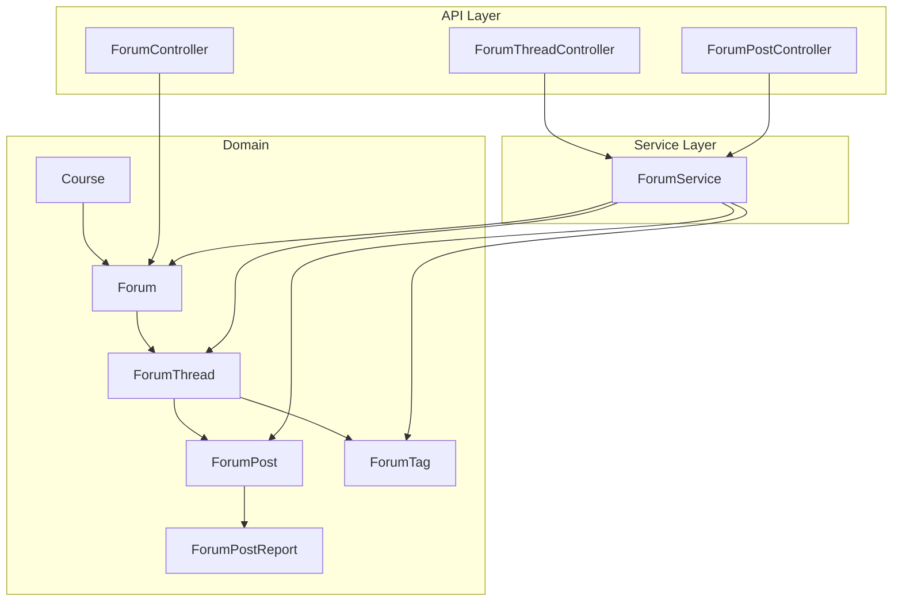
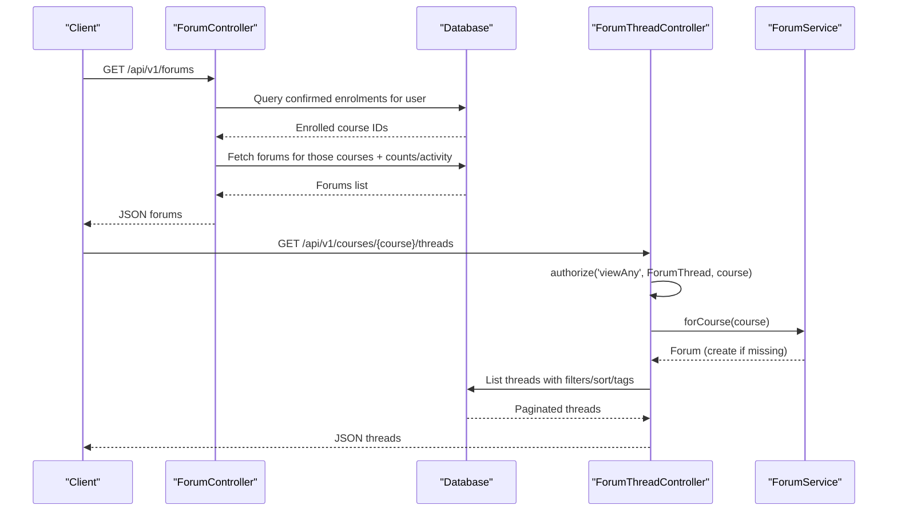
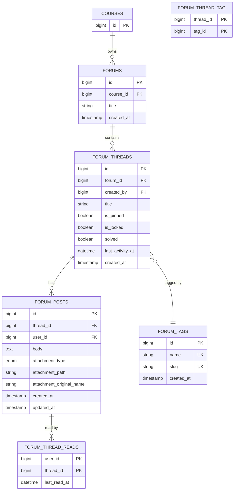
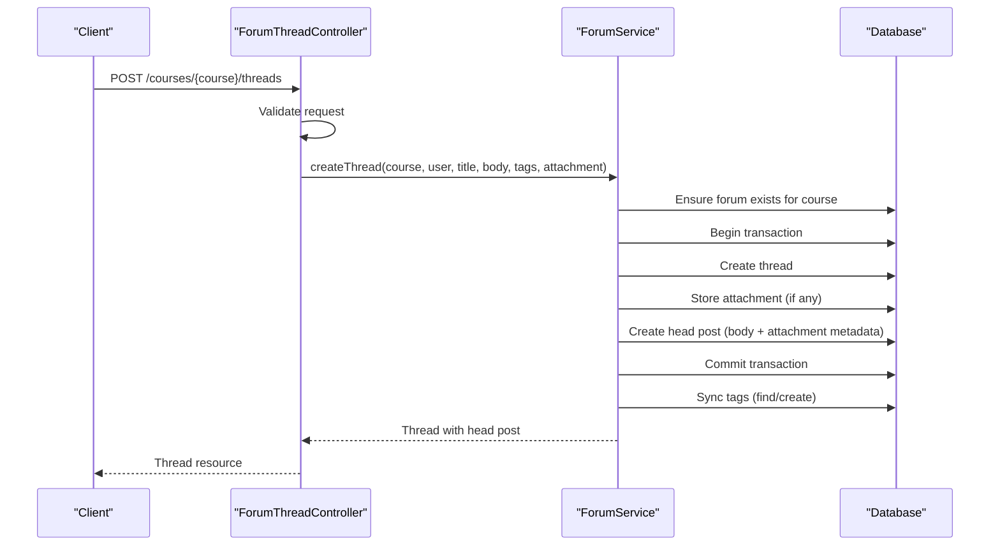
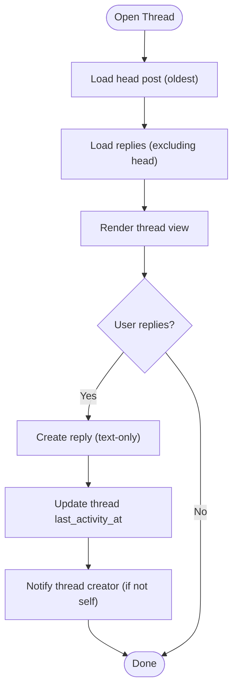
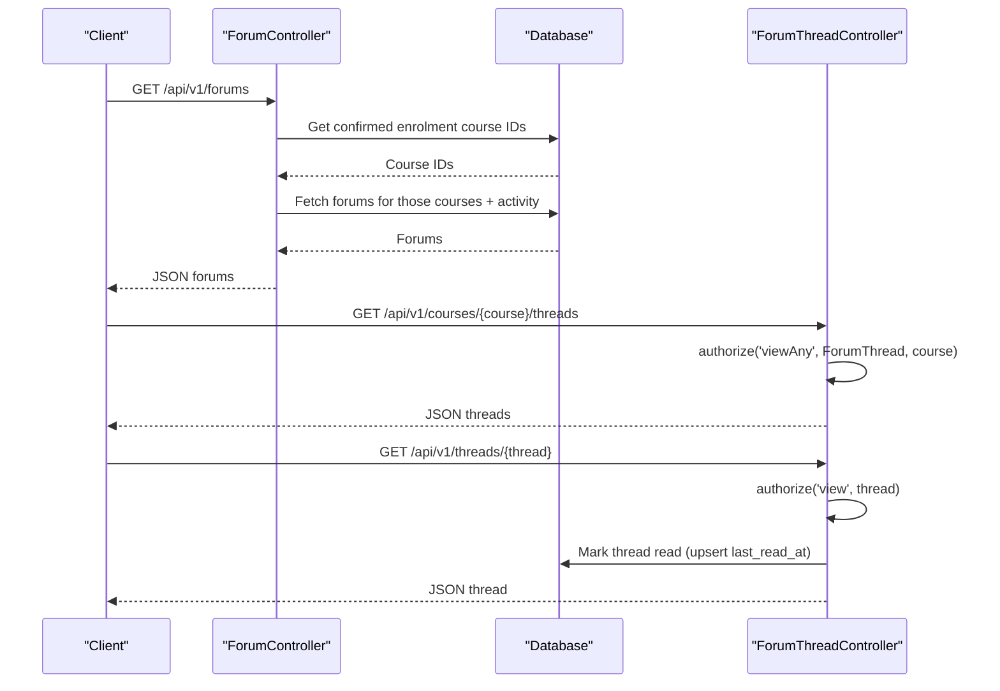
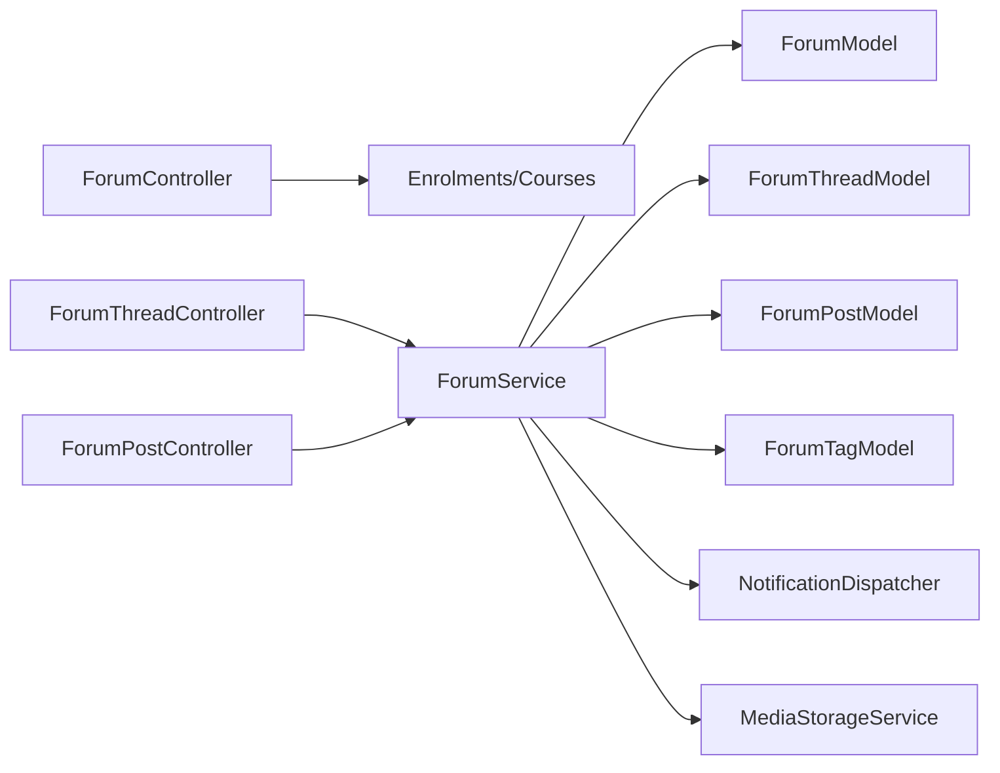

# Forum Structure & Hierarchy

<cite>
**Referenced Files in This Document**
- [Forum.php](file://app/Models/Forum.php)
- [ForumThread.php](file://app/Models/ForumThread.php)
- [ForumPost.php](file://app/Models/ForumPost.php)
- [Course.php](file://app/Models/Course.php)
- [ForumTag.php](file://app/Models/ForumTag.php)
- [ForumPostReport.php](file://app/Models/ForumPostReport.php)
- [ForumService.php](file://app/Services/Communication/ForumService.php)
- [ForumController.php](file://app/Http/Controllers/Api/V1/ForumController.php)
- [ForumThreadController.php](file://app/Http/Controllers/Api/V1/ForumThreadController.php)
- [ForumPostController.php](file://app/Http/Controllers/Api/V1/ForumPostController.php)
- [2024_01_01_000176_create_forums_table.php](file://database/migrations/2024_01_01_000176_create_forums_table.php)
- [2024_01_01_000177_create_forum_threads_table.php](file://database/migrations/2024_01_01_000177_create_forum_threads_table.php)
- [2024_01_01_000178_create_forum_posts_table.php](file://database/migrations/2024_01_01_000178_create_forum_posts_table.php)
- [2026_07_23_100000_add_solved_and_last_activity_to_forum_threads_table.php](file://database/migrations/2026_07_23_100000_add_solved_and_last_activity_to_forum_threads_table.php)
- [2026_07_23_100001_create_forum_tags_table.php](file://database/migrations/2026_07_23_100001_create_forum_tags_table.php)
- [2026_07_23_100002_create_forum_thread_reads_table.php](file://database/migrations/2026_07_23_100002_create_forum_thread_reads_table.php)
</cite>

## Table of Contents
1. Introduction
2. Project Structure
3. Core Components
4. Architecture Overview
5. Detailed Component Analysis
6. Dependency Analysis
7. Performance Considerations
8. Troubleshooting Guide
9. Conclusion

## Introduction
This document explains the three-tier forum architecture (forums → threads → posts) and how it integrates with courses. It covers data models, database schema, relationships, thread creation workflows, post organization patterns, visibility and access control, and course-specific isolation. The goal is to help developers understand how forums are scoped per course, how discussions are organized into threads, and how posts form threaded conversations within each thread.

## Project Structure
The forum feature spans Eloquent models, API controllers, a domain service, and migrations:
- Models define entities and relationships for forums, threads, posts, tags, and reports.
- Controllers expose REST endpoints for listing forums, managing threads, and handling posts.
- A service encapsulates business logic such as creating threads, replying, marking solved, and managing read state.
- Migrations define the database schema and indexes that support efficient queries and referential integrity.

**Diagram sources**
- [Forum.php:20-39](file://app/Models/Forum.php#L20-L39)
- [ForumThread.php:22-92](file://app/Models/ForumThread.php#L22-L92)
- [ForumPost.php:19-54](file://app/Models/ForumPost.php#L19-L54)
- [Course.php:17-179](file://app/Models/Course.php#L17-L179)
- [ForumTag.php:19-30](file://app/Models/ForumTag.php#L19-L30)
- [ForumPostReport.php:20-45](file://app/Models/ForumPostReport.php#L20-L45)
- [ForumController.php:14-98](file://app/Http/Controllers/Api/V1/ForumController.php#L14-L98)
- [ForumThreadController.php:19-113](file://app/Http/Controllers/Api/V1/ForumThreadController.php#L19-L113)
- [ForumPostController.php:18-69](file://app/Http/Controllers/Api/V1/ForumPostController.php#L18-L69)
- [ForumService.php:20-223](file://app/Services/Communication/ForumService.php#L20-L223)

**Section sources**
- [Forum.php:20-39](file://app/Models/Forum.php#L20-L39)
- [ForumThread.php:22-92](file://app/Models/ForumThread.php#L22-L92)
- [ForumPost.php:19-54](file://app/Models/ForumPost.php#L19-L54)
- [Course.php:17-179](file://app/Models/Course.php#L17-L179)
- [ForumTag.php:19-30](file://app/Models/ForumTag.php#L19-L30)
- [ForumPostReport.php:20-45](file://app/Models/ForumPostReport.php#L20-L45)
- [ForumController.php:14-98](file://app/Http/Controllers/Api/V1/ForumController.php#L14-L98)
- [ForumThreadController.php:19-113](file://app/Http/Controllers/Api/V1/ForumThreadController.php#L19-L113)
- [ForumPostController.php:18-69](file://app/Http/Controllers/Api/V1/ForumPostController.php#L18-L69)
- [ForumService.php:20-223](file://app/Services/Communication/ForumService.php#L20-L223)

## Core Components
- Forum: Represents a discussion area scoped to a single course. It belongs to a Course and has many Threads.
- ForumThread: A discussion within a Forum. Owned by a user (creator), can be pinned or locked, optionally marked solved, and tracks last activity time. Has many Posts and optional Tags. Provides headPost (oldest post) and latestPost relations for UI.
- ForumPost: A message within a Thread. Belongs to a Thread and a User. Supports attachments via typed fields and can be reported.
- ForumTag: Global tags shared across courses; many-to-many with threads.
- ForumPostReport: Moderation artifact linked to a post and reporter.

Key relationships:
- Course → Forum (one-to-one in practice via lazy creation)
- Forum → ForumThread (one-to-many)
- ForumThread → ForumPost (one-to-many)
- ForumThread ↔ ForumTag (many-to-many)
- ForumPost → ForumPostReport (one-to-many)

**Section sources**
- [Forum.php:20-39](file://app/Models/Forum.php#L20-L39)
- [ForumThread.php:22-92](file://app/Models/ForumThread.php#L22-L92)
- [ForumPost.php:19-54](file://app/Models/ForumPost.php#L19-L54)
- [ForumTag.php:19-30](file://app/Models/ForumTag.php#L19-L30)
- [ForumPostReport.php:20-45](file://app/Models/ForumPostReport.php#L20-L45)

## Architecture Overview
The system enforces course-scoped forums and uses policies for authorization. Access to forums is gated by confirmed enrolments, ensuring only enrolled users see forums for their courses.

**Diagram sources**
- [ForumController.php:32-98](file://app/Http/Controllers/Api/V1/ForumController.php#L32-L98)
- [ForumThreadController.php:30-69](file://app/Http/Controllers/Api/V1/ForumThreadController.php#L30-L69)
- [ForumService.php:39-45](file://app/Services/Communication/ForumService.php#L39-L45)

**Section sources**
- [ForumController.php:32-98](file://app/Http/Controllers/Api/V1/ForumController.php#L32-L98)
- [ForumThreadController.php:30-69](file://app/Http/Controllers/Api/V1/ForumThreadController.php#L30-L69)
- [ForumService.php:39-45](file://app/Services/Communication/ForumService.php#L39-L45)

## Detailed Component Analysis

### Database Schema and Constraints
- forums
  - Columns: id, course_id (FK to courses, cascade delete), title (default “General Discussion”), created_at
  - Purpose: One forum per course (created lazily), scoped by course_id
- forum_threads
  - Columns: id, forum_id (FK to forums, cascade delete), created_by (FK to users, cascade delete), title, is_pinned, is_locked, created_at, solved (boolean), last_activity_at (datetime, nullable but always set by service), index on forum_id and last_activity_at
  - Purpose: Discussions within a forum; supports pinning, locking, solving, and activity-based sorting
- forum_posts
  - Columns: id, thread_id (FK to forum_threads, cascade delete), user_id (FK to users, cascade delete), body (text), timestamps, full-text index on body, plus attachment columns added later (attachment_type, attachment_path, attachment_original_name)
  - Purpose: Messages within a thread; supports search via full-text index and attachments
- forum_tags and forum_thread_tag
  - forum_tags: id, name (unique), slug (unique), created_at
  - forum_thread_tag: composite primary key (thread_id, tag_id), FKs to forum_threads and forum_tags with cascade delete
  - Purpose: Global tagging of threads
- forum_thread_reads
  - Composite primary key (user_id, thread_id), last_read_at
  - Purpose: Per-user read tracking to compute unread status

Constraints and integrity:
- Foreign keys enforce referential integrity with cascade deletes where appropriate.
- Unique constraints on tag name and slug prevent duplicates.
- Full-text index on forum_posts.body enables efficient content search.
- Indexes on forum_id and last_activity_at optimize common queries.

**Section sources**
- [2024_01_01_000176_create_forums_table.php:11-24](file://database/migrations/2024_01_01_000176_create_forums_table.php#L11-L24)
- [2024_01_01_000177_create_forum_threads_table.php:11-28](file://database/migrations/2024_01_01_000177_create_forum_threads_table.php#L11-L28)
- [2024_01_01_000178_create_forum_posts_table.php:11-27](file://database/migrations/2024_01_01_000178_create_forum_posts_table.php#L11-L27)
- [2026_07_23_100000_add_solved_and_last_activity_to_forum_threads_table.php:17-39](file://database/migrations/2026_07_23_100000_add_solved_and_last_activity_to_forum_threads_table.php#L17-L39)
- [2026_07_23_100001_create_forum_tags_table.php:17-38](file://database/migrations/2026_07_23_100001_create_forum_tags_table.php#L17-L38)
- [2026_07_23_100002_create_forum_thread_reads_table.php:17-31](file://database/migrations/2026_07_23_100002_create_forum_thread_reads_table.php#L17-L31)

### Model Relationships and Data Flow
- Course to Forum: Courses own forums; forums are created lazily per course.
- Forum to Thread: Each forum contains multiple threads.
- Thread to Post: Each thread contains multiple posts; the oldest post is treated as the head post for feed display.
- Thread to Tag: Many-to-many relationship via forum_thread_tag pivot table.
- Post to Report: Posts can be reported; reports link to the post and reporter.

**Diagram sources**
- [Forum.php:20-39](file://app/Models/Forum.php#L20-L39)
- [ForumThread.php:22-92](file://app/Models/ForumThread.php#L22-L92)
- [ForumPost.php:19-54](file://app/Models/ForumPost.php#L19-L54)
- [ForumTag.php:19-30](file://app/Models/ForumTag.php#L19-L30)
- [2024_01_01_000176_create_forums_table.php:11-24](file://database/migrations/2024_01_01_000176_create_forums_table.php#L11-L24)
- [2024_01_01_000177_create_forum_threads_table.php:11-28](file://database/migrations/2024_01_01_000177_create_forum_threads_table.php#L11-L28)
- [2024_01_01_000178_create_forum_posts_table.php:11-27](file://database/migrations/2024_01_01_000178_create_forum_posts_table.php#L11-L27)
- [2026_07_23_100001_create_forum_tags_table.php:17-38](file://database/migrations/2026_07_23_100001_create_forum_tags_table.php#L17-L38)
- [2026_07_23_100002_create_forum_thread_reads_table.php:17-31](file://database/migrations/2026_07_23_100002_create_forum_thread_reads_table.php#L17-L31)

### Thread Creation Workflow
Creating a thread involves validating input, ensuring the forum exists for the course, persisting the thread and its initial post, attaching files if provided, syncing tags, and returning the resource.

**Diagram sources**
- [ForumThreadController.php:71-84](file://app/Http/Controllers/Api/V1/ForumThreadController.php#L71-L84)
- [ForumService.php:50-86](file://app/Services/Communication/ForumService.php#L50-L86)
- [ForumService.php:136-153](file://app/Services/Communication/ForumService.php#L136-L153)

**Section sources**
- [ForumThreadController.php:71-84](file://app/Http/Controllers/Api/V1/ForumThreadController.php#L71-L84)
- [ForumService.php:50-86](file://app/Services/Communication/ForumService.php#L50-L86)
- [ForumService.php:136-153](file://app/Services/Communication/ForumService.php#L136-L153)

### Post Organization Patterns
- Head post vs replies: The oldest post in a thread is the head post; subsequent posts are replies.
- Pagination: Replies are paginated separately from the head post to support “lazy load” reading order.
- Attachments: Only the head post supports attachments; replies are text-only.
- Updates and deletion: Updating a post can change or remove attachments; deleting the head post removes the entire thread.

**Diagram sources**
- [ForumPostController.php:26-46](file://app/Http/Controllers/Api/V1/ForumPostController.php#L26-L46)
- [ForumService.php:92-107](file://app/Services/Communication/ForumService.php#L92-L107)
- [ForumService.php:187-202](file://app/Services/Communication/ForumService.php#L187-L202)

**Section sources**
- [ForumPostController.php:26-46](file://app/Http/Controllers/Api/V1/ForumPostController.php#L26-L46)
- [ForumService.php:92-107](file://app/Services/Communication/ForumService.php#L92-L107)
- [ForumService.php:187-202](file://app/Services/Communication/ForumService.php#L187-L202)

### Visibility, Access Control, and Course Isolation
- Course isolation: Forums belong to courses; only forums for courses the user is enrolled in (confirmed status) are returned in the global forums list.
- Authorization: Thread listing requires authorization against the course context; individual thread views require permission on the thread itself.
- Read state: Marking a thread as read updates per-user read timestamps used to compute unread counts.

**Diagram sources**
- [ForumController.php:32-98](file://app/Http/Controllers/Api/V1/ForumController.php#L32-L98)
- [ForumThreadController.php:30-93](file://app/Http/Controllers/Api/V1/ForumThreadController.php#L30-L93)
- [ForumService.php:122-128](file://app/Services/Communication/ForumService.php#L122-L128)

**Section sources**
- [ForumController.php:32-98](file://app/Http/Controllers/Api/V1/ForumController.php#L32-L98)
- [ForumThreadController.php:30-93](file://app/Http/Controllers/Api/V1/ForumThreadController.php#L30-L93)
- [ForumService.php:122-128](file://app/Services/Communication/ForumService.php#L122-L128)

## Dependency Analysis
- Controllers depend on services for business operations (thread creation, replies, moderation).
- Services depend on models and external services (notifications, media storage).
- Models rely on database schema defined by migrations and enums for type safety.
- Policies enforce authorization at controller boundaries.

**Diagram sources**
- [ForumController.php:32-98](file://app/Http/Controllers/Api/V1/ForumController.php#L32-L98)
- [ForumThreadController.php:19-113](file://app/Http/Controllers/Api/V1/ForumThreadController.php#L19-L113)
- [ForumPostController.php:18-69](file://app/Http/Controllers/Api/V1/ForumPostController.php#L18-L69)
- [ForumService.php:20-223](file://app/Services/Communication/ForumService.php#L20-L223)

**Section sources**
- [ForumController.php:32-98](file://app/Http/Controllers/Api/V1/ForumController.php#L32-L98)
- [ForumThreadController.php:19-113](file://app/Http/Controllers/Api/V1/ForumThreadController.php#L19-L113)
- [ForumPostController.php:18-69](file://app/Http/Controllers/Api/V1/ForumPostController.php#L18-L69)
- [ForumService.php:20-223](file://app/Services/Communication/ForumService.php#L20-L223)

## Performance Considerations
- Use indexes on forum_id and last_activity_at to optimize thread listing and sorting.
- Full-text search on forum_posts.body enables efficient content queries across threads.
- Paginate threads and replies to limit payload size and improve rendering performance.
- Eager-load minimal relations (headPost.user, latestPost.user, tags) to avoid N+1 queries.
- Mark threads read via upsert to minimize writes while maintaining accurate unread counts.

[No sources needed since this section provides general guidance]

## Troubleshooting Guide
Common issues and resolutions:
- Unread count mismatch: Ensure last_activity_at is updated on every new reply and that forum_thread_reads are upserted when viewing a thread.
- Missing forum for a course: The service creates a forum lazily on first access; verify the course ID passed to the service is correct.
- Attachment not saved: Confirm the attachment is present and stored via the media storage service; ensure attachment metadata fields are persisted.
- Search not finding posts: Verify full-text index exists on forum_posts.body and that search queries use full-text mode.
- Unauthorized access: Check policy enforcement in controllers; ensure user is enrolled (confirmed) for course-level listings and authorized for thread-level actions.

**Section sources**
- [ForumService.php:92-107](file://app/Services/Communication/ForumService.php#L92-L107)
- [ForumService.php:122-128](file://app/Services/Communication/ForumService.php#L122-L128)
- [ForumService.php:207-221](file://app/Services/Communication/ForumService.php#L207-L221)
- [ForumThreadController.php:30-69](file://app/Http/Controllers/Api/V1/ForumThreadController.php#L30-L69)
- [ForumController.php:32-98](file://app/Http/Controllers/Api/V1/ForumController.php#L32-L98)

## Conclusion
The forum subsystem implements a clear three-tier hierarchy (forums → threads → posts) tightly integrated with courses. Forums are course-scoped and created lazily, threads organize discussions with rich metadata (pin, lock, solve, activity), and posts structure conversations with head post semantics and attachments. Access control leverages enrolment checks and policies to ensure course isolation and secure interactions. The schema includes necessary indexes and constraints to support performant queries and reliable data integrity.

[No sources needed since this section summarizes without analyzing specific files]