# Forum System

<cite>
**Referenced Files in This Document**
- [ForumService.php](file://app/Services/Communication/ForumService.php)
- [ForumController.php](file://app/Http/Controllers/Api/V1/ForumController.php)
- [ForumThreadController.php](file://app/Http/Controllers/Api/V1/ForumThreadController.php)
- [ForumPostController.php](file://app/Http/Controllers/Api/V1/ForumPostController.php)
- [Forum.php](file://app/Models/Forum.php)
- [ForumThread.php](file://app/Models/ForumThread.php)
- [ForumPost.php](file://app/Models/ForumPost.php)
- [ForumTag.php](file://app/Models/ForumTag.php)
- [ForumThreadPolicy.php](file://app/Policies/ForumThreadPolicy.php)
- [ForumPostPolicy.php](file://app/Policies/ForumPostPolicy.php)
- [2024_01_01_000176_create_forums_table.php](file://database/migrations/2024_01_01_000176_create_forums_table.php)
- [2024_01_01_000177_create_forum_threads_table.php](file://database/migrations/2024_01_01_000177_create_forum_threads_table.php)
- [2024_01_01_000178_create_forum_posts_table.php](file://database/migrations/2024_01_01_000178_create_forum_posts_table.php)
- [2026_07_23_100000_add_solved_and_last_activity_to_forum_threads_table.php](file://database/migrations/2026_07_23_100000_add_solved_and_last_activity_to_forum_threads_table.php)
- [2026_07_23_100001_create_forum_tags_table.php](file://database/migrations/2026_07_23_100001_create_forum_tags_table.php)
- [2026_07_23_100002_create_forum_thread_reads_table.php](file://database/migrations/2026_07_23_100002_create_forum_thread_reads_table.php)
</cite>

## Table of Contents
1. [Introduction](#introduction)
2. [Project Structure](#project-structure)
3. [Core Components](#core-components)
4. [Architecture Overview](#architecture-overview)
5. [Detailed Component Analysis](#detailed-component-analysis)
6. [Dependency Analysis](#dependency-analysis)
7. [Performance Considerations](#performance-considerations)
8. [Troubleshooting Guide](#troubleshooting-guide)
9. [Conclusion](#conclusion)

## Introduction
This document explains the Forum System component, covering the forum hierarchy (forums → threads → posts), thread management, post creation and moderation, tagging system, read tracking, solved status, last activity tracking, and attachment support. It focuses on the ForumService implementation and how controllers orchestrate user-facing workflows with policies for permissions.

## Project Structure
The Forum System is implemented as a layered feature:
- Models define entities and relationships for forums, threads, posts, tags, and read tracking.
- Controllers expose REST endpoints for listing forums, browsing threads, creating discussions, posting replies, updating/deleting posts, and moderating threads.
- The ForumService encapsulates business logic for thread creation, replies, tag synchronization, solved marking, read tracking, and attachments.
- Policies enforce access control based on enrollment, course teaching roles, and admin privileges.
- Migrations define the schema including core tables and later additions for solved status, last activity, tags, and per-user read state.

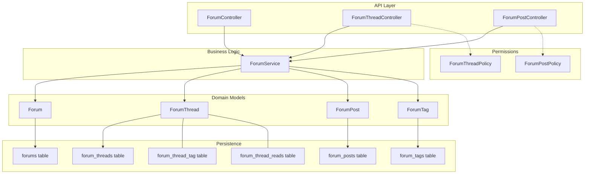

**Diagram sources**
- [ForumController.php:1-100](file://app/Http/Controllers/Api/V1/ForumController.php#L1-L100)
- [ForumThreadController.php:1-115](file://app/Http/Controllers/Api/V1/ForumThreadController.php#L1-L115)
- [ForumPostController.php:1-70](file://app/Http/Controllers/Api/V1/ForumPostController.php#L1-L70)
- [ForumService.php:1-223](file://app/Services/Communication/ForumService.php#L1-L223)
- [Forum.php:1-41](file://app/Models/Forum.php#L1-L41)
- [ForumThread.php:1-94](file://app/Models/ForumThread.php#L1-L94)
- [ForumPost.php:1-56](file://app/Models/ForumPost.php#L1-L56)
- [ForumTag.php:1-32](file://app/Models/ForumTag.php#L1-L32)
- [ForumThreadPolicy.php:1-51](file://app/Policies/ForumThreadPolicy.php#L1-L51)
- [ForumPostPolicy.php:1-43](file://app/Policies/ForumPostPolicy.php#L1-L43)
- [2024_01_01_000176_create_forums_table.php:1-26](file://database/migrations/2024_01_01_000176_create_forums_table.php#L1-L26)
- [2024_01_01_000177_create_forum_threads_table.php:1-30](file://database/migrations/2024_01_01_000177_create_forum_threads_table.php#L1-L30)
- [2024_01_01_000178_create_forum_posts_table.php:1-29](file://database/migrations/2024_01_01_000178_create_forum_posts_table.php#L1-L29)
- [2026_07_23_100000_add_solved_and_last_activity_to_forum_threads_table.php:1-40](file://database/migrations/2026_07_23_100000_add_solved_and_last_activity_to_forum_threads_table.php#L1-L40)
- [2026_07_23_100001_create_forum_tags_table.php:1-39](file://database/migrations/2026_07_23_100001_create_forum_tags_table.php#L1-L39)
- [2026_07_23_100002_create_forum_thread_reads_table.php:1-32](file://database/migrations/2026_07_23_100002_create_forum_thread_reads_table.php#L1-L32)

**Section sources**
- [ForumController.php:1-100](file://app/Http/Controllers/Api/V1/ForumController.php#L1-L100)
- [ForumThreadController.php:1-115](file://app/Http/Controllers/Api/V1/ForumThreadController.php#L1-L115)
- [ForumPostController.php:1-70](file://app/Http/Controllers/Api/V1/ForumPostController.php#L1-L70)
- [ForumService.php:1-223](file://app/Services/Communication/ForumService.php#L1-L223)
- [Forum.php:1-41](file://app/Models/Forum.php#L1-L41)
- [ForumThread.php:1-94](file://app/Models/ForumThread.php#L1-L94)
- [ForumPost.php:1-56](file://app/Models/ForumPost.php#L1-L56)
- [ForumTag.php:1-32](file://app/Models/ForumTag.php#L1-L32)
- [ForumThreadPolicy.php:1-51](file://app/Policies/ForumThreadPolicy.php#L1-L51)
- [ForumPostPolicy.php:1-43](file://app/Policies/ForumPostPolicy.php#L1-L43)
- [2024_01_01_000176_create_forums_table.php:1-26](file://database/migrations/2024_01_01_000176_create_forums_table.php#L1-L26)
- [2024_01_01_000177_create_forum_threads_table.php:1-30](file://database/migrations/2024_01_01_000177_create_forum_threads_table.php#L1-L30)
- [2024_01_01_000178_create_forum_posts_table.php:1-29](file://database/migrations/2024_01_01_000178_create_forum_posts_table.php#L1-L29)
- [2026_07_23_100000_add_solved_and_last_activity_to_forum_threads_table.php:1-40](file://database/migrations/2026_07_23_100000_add_solved_and_last_activity_to_forum_threads_table.php#L1-L40)
- [2026_07_23_100001_create_forum_tags_table.php:1-39](file://database/migrations/2026_07_23_100001_create_forum_tags_table.php#L1-L39)
- [2026_07_23_100002_create_forum_thread_reads_table.php:1-32](file://database/migrations/2026_07_23_100002_create_forum_thread_reads_table.php#L1-L32)

## Core Components
- Forum: Represents a discussion area scoped to a course.
- ForumThread: A discussion within a forum, with metadata such as pinned, locked, solved, and last activity timestamp.
- ForumPost: A message within a thread; the oldest post is treated as the “head post” representing the original discussion content.
- ForumTag: Global tags that can be attached to threads for categorization and filtering.
- ForumService: Orchestrates thread creation, replies, tag synchronization, solved marking, read tracking, and post updates/deletes with attachment handling.
- Controllers: Provide API endpoints for listing forums, browsing threads, creating discussions, posting replies, and moderation actions.
- Policies: Enforce who can view, create, update, or delete forum content based on enrollment and role.

Key responsibilities:
- Thread lifecycle: creation, listing, searching, sorting, filtering by tags, and moderation (pin/lock/solved).
- Post lifecycle: reply creation, pagination of replies, editing, and deletion (with cascade behavior for head post).
- Tagging: find-or-create tags by name and sync them to threads.
- Read tracking: mark threads as read per user and compute unread counts.
- Attachments: store and remove files associated with posts.

**Section sources**
- [ForumService.php:39-153](file://app/Services/Communication/ForumService.php#L39-L153)
- [ForumThreadController.php:30-113](file://app/Http/Controllers/Api/V1/ForumThreadController.php#L30-L113)
- [ForumPostController.php:22-68](file://app/Http/Controllers/Api/V1/ForumPostController.php#L22-L68)
- [Forum.php:13-39](file://app/Models/Forum.php#L13-L39)
- [ForumThread.php:15-92](file://app/Models/ForumThread.php#L15-L92)
- [ForumPost.php:14-54](file://app/Models/ForumPost.php#L14-L54)
- [ForumTag.php:12-29](file://app/Models/ForumTag.php#L12-L29)
- [ForumThreadPolicy.php:13-49](file://app/Policies/ForumThreadPolicy.php#L13-L49)
- [ForumPostPolicy.php:12-41](file://app/Policies/ForumPostPolicy.php#L12-L41)

## Architecture Overview
The Forum System follows a clean separation between presentation (controllers), business logic (service), domain models, and persistence (database). Policies gate access at controller boundaries.

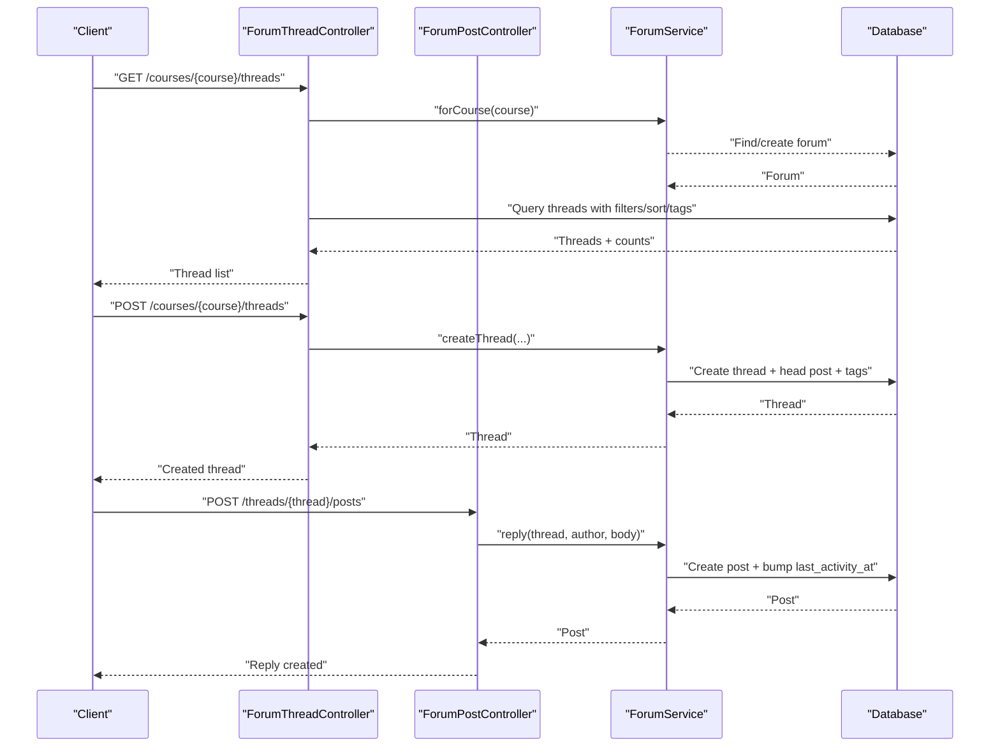

**Diagram sources**
- [ForumThreadController.php:30-84](file://app/Http/Controllers/Api/V1/ForumThreadController.php#L30-L84)
- [ForumPostController.php:41-46](file://app/Http/Controllers/Api/V1/ForumPostController.php#L41-L46)
- [ForumService.php:50-107](file://app/Services/Communication/ForumService.php#L50-L107)

## Detailed Component Analysis

### Forum Hierarchy and Data Model
- Forums belong to courses and contain many threads.
- Threads belong to forums and have many posts; the oldest post is the head post.
- Posts belong to threads and users; they may carry attachments.
- Tags are global and linked to threads via a pivot table.
- Read tracking is stored per user-thread pair with a last-read timestamp.

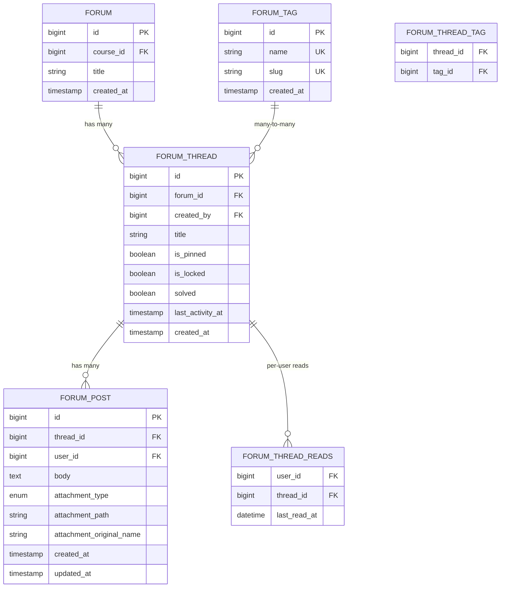

**Diagram sources**
- [2024_01_01_000176_create_forums_table.php:11-18](file://database/migrations/2024_01_01_000176_create_forums_table.php#L11-L18)
- [2024_01_01_000177_create_forum_threads_table.php:11-22](file://database/migrations/2024_01_01_000177_create_forum_threads_table.php#L11-L22)
- [2024_01_01_000178_create_forum_posts_table.php:11-21](file://database/migrations/2024_01_01_000178_create_forum_posts_table.php#L11-L21)
- [2026_07_23_100000_add_solved_and_last_activity_to_forum_threads_table.php:17-29](file://database/migrations/2026_07_23_100000_add_solved_and_last_activity_to_forum_threads_table.php#L17-L29)
- [2026_07_23_100001_create_forum_tags_table.php:17-30](file://database/migrations/2026_07_23_100001_create_forum_tags_table.php#L17-L30)
- [2026_07_23_100002_create_forum_thread_reads_table.php:17-24](file://database/migrations/2026_07_23_100002_create_forum_thread_reads_table.php#L17-L24)

**Section sources**
- [Forum.php:13-39](file://app/Models/Forum.php#L13-L39)
- [ForumThread.php:15-92](file://app/Models/ForumThread.php#L15-L92)
- [ForumPost.php:14-54](file://app/Models/ForumPost.php#L14-L54)
- [ForumTag.php:12-29](file://app/Models/ForumTag.php#L12-L29)
- [2024_01_01_000176_create_forums_table.php:11-18](file://database/migrations/2024_01_01_000176_create_forums_table.php#L11-L18)
- [2024_01_01_000177_create_forum_threads_table.php:11-22](file://database/migrations/2024_01_01_000177_create_forum_threads_table.php#L11-L22)
- [2024_01_01_000178_create_forum_posts_table.php:11-21](file://database/migrations/2024_01_01_000178_create_forum_posts_table.php#L11-L21)
- [2026_07_23_100000_add_solved_and_last_activity_to_forum_threads_table.php:17-29](file://database/migrations/2026_07_23_100000_add_solved_and_last_activity_to_forum_threads_table.php#L17-L29)
- [2026_07_23_100001_create_forum_tags_table.php:17-30](file://database/migrations/2026_07_23_100001_create_forum_tags_table.php#L17-L30)
- [2026_07_23_100002_create_forum_thread_reads_table.php:17-24](file://database/migrations/2026_07_23_100002_create_forum_thread_reads_table.php#L17-L24)

### ForumService Implementation
Responsibilities:
- Ensure a forum exists for a course and retrieve it.
- Create a thread with an initial post and optional attachment; synchronize tags.
- Allow users to reply to threads; update last activity and notify the thread creator when appropriate.
- Mark threads as solved (staff-only workflow) and notify the thread creator.
- Track per-user read state for threads.
- Update posts with optional new attachments or removal of existing ones.
- Delete posts; deleting the head post removes the entire thread.

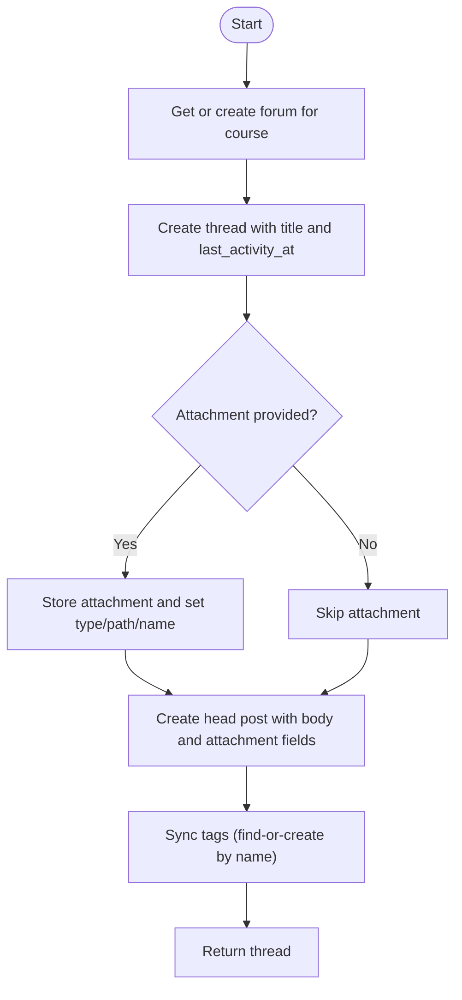

**Diagram sources**
- [ForumService.php:39-86](file://app/Services/Communication/ForumService.php#L39-L86)

**Section sources**
- [ForumService.php:39-223](file://app/Services/Communication/ForumService.php#L39-L223)

### Thread Management
- Listing threads supports search across titles and post bodies, filtering by tags, scoping to current user’s threads, and sorting by latest activity, newest, or most replies. Pinned threads sort first.
- Reading a thread marks it as read for the current user and returns enriched thread data.
- Moderation allows pinning, locking, and solving threads; only instructors or admins can moderate.

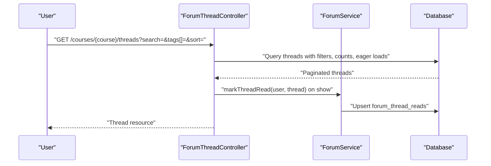

**Diagram sources**
- [ForumThreadController.php:30-93](file://app/Http/Controllers/Api/V1/ForumThreadController.php#L30-L93)
- [ForumService.php:122-128](file://app/Services/Communication/ForumService.php#L122-L128)

**Section sources**
- [ForumThreadController.php:30-113](file://app/Http/Controllers/Api/V1/ForumThreadController.php#L30-L113)
- [ForumService.php:122-128](file://app/Services/Communication/ForumService.php#L122-L128)

### Post Creation and Moderation
- Replies are text-only and append to the thread; they update last activity and optionally notify the thread creator if not replying to oneself.
- Editing posts allows changing body and attachment type; attachments can be replaced or removed.
- Deleting a post removes its attachment; deleting the head post deletes the entire thread due to cascade behavior.

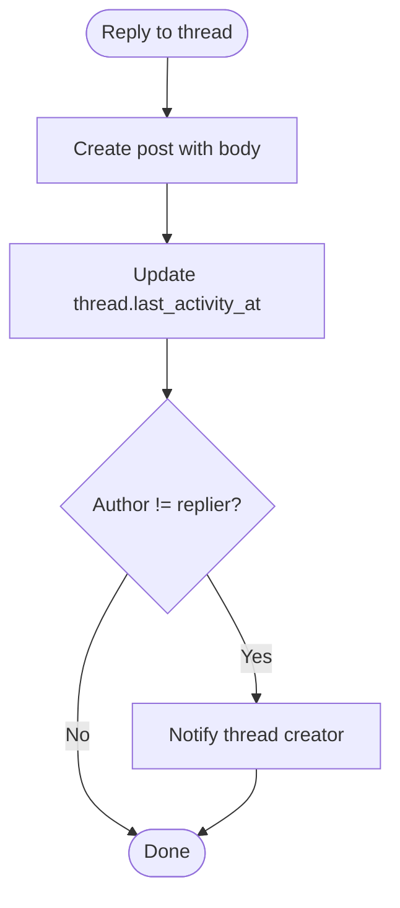

**Diagram sources**
- [ForumService.php:92-107](file://app/Services/Communication/ForumService.php#L92-L107)

**Section sources**
- [ForumService.php:92-202](file://app/Services/Communication/ForumService.php#L92-L202)
- [ForumPostController.php:22-68](file://app/Http/Controllers/Api/V1/ForumPostController.php#L22-L68)

### Tagging System
- Tags are global and case-insensitive; names are trimmed and deduplicated.
- On thread creation or update, tags are synchronized: existing tags are reused, new tags are created with slugs, and the thread’s tag set is replaced atomically.

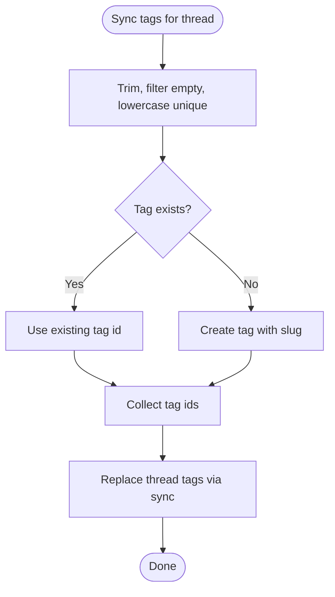

**Diagram sources**
- [ForumService.php:136-153](file://app/Services/Communication/ForumService.php#L136-L153)

**Section sources**
- [ForumService.php:136-153](file://app/Services/Communication/ForumService.php#L136-L153)
- [2026_07_23_100001_create_forum_tags_table.php:17-30](file://database/migrations/2026_07_23_100001_create_forum_tags_table.php#L17-L30)

### Read Tracking and Unread Counts
- When a user views a thread, their last-read timestamp is upserted.
- Unread counts for a forum are computed by comparing thread last_activity_at against each user’s last_read_at or absence of a read record.

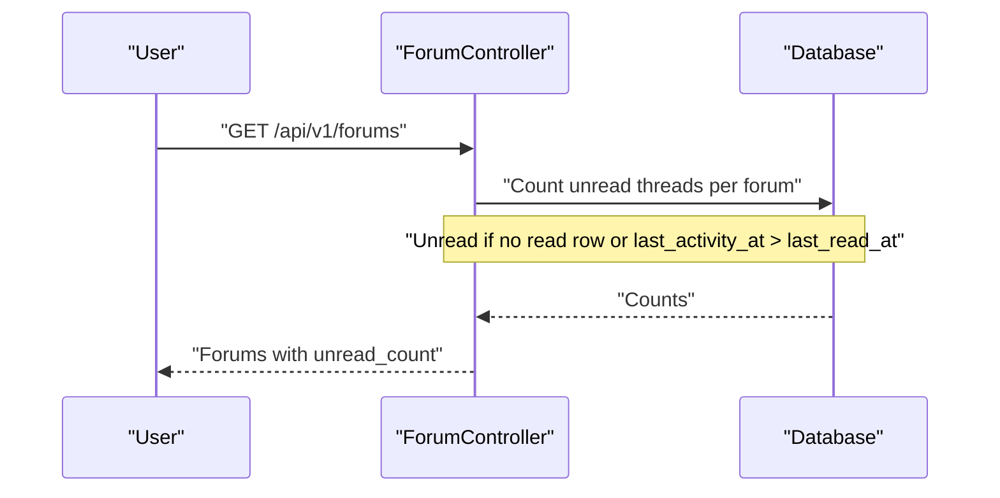

**Diagram sources**
- [ForumController.php:32-97](file://app/Http/Controllers/Api/V1/ForumController.php#L32-L97)
- [ForumService.php:122-128](file://app/Services/Communication/ForumService.php#L122-L128)

**Section sources**
- [ForumController.php:32-97](file://app/Http/Controllers/Api/V1/ForumController.php#L32-L97)
- [ForumService.php:122-128](file://app/Services/Communication/ForumService.php#L122-L128)

### Attachment Support
- Head posts can include attachments; replies remain text-only per design.
- Attachments are stored under a course-scoped path and tracked with type and original filename.
- Updates can replace or remove attachments; deletions also remove stored files.

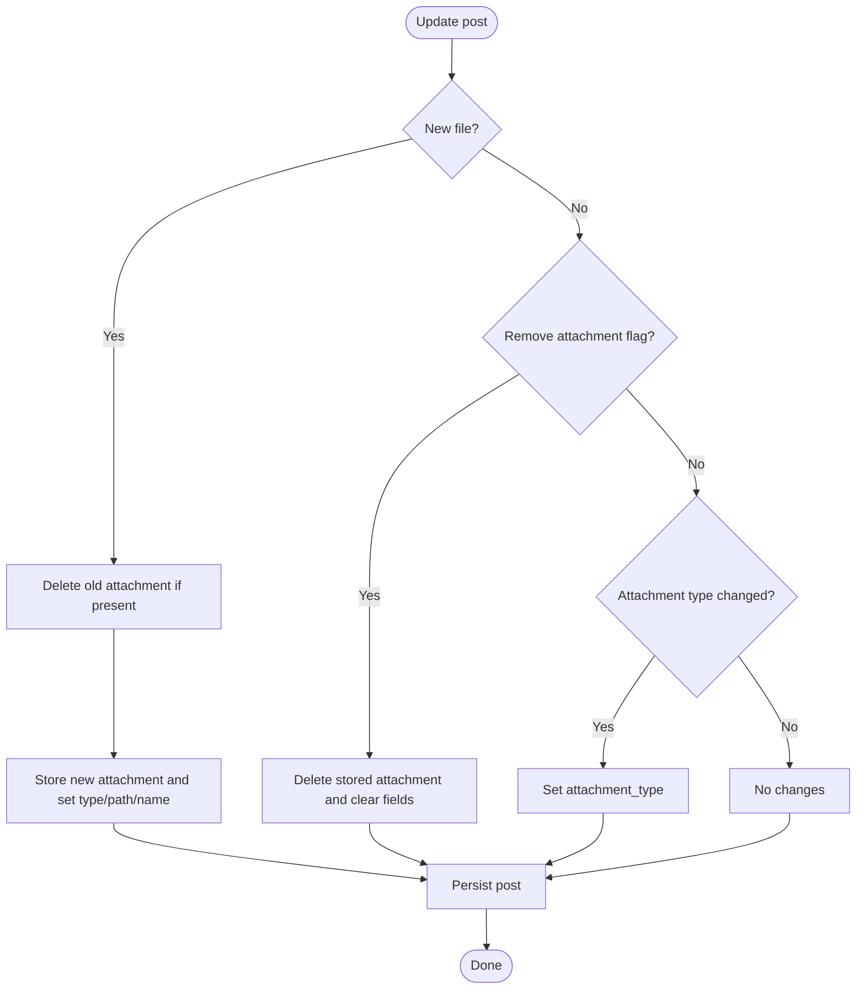

**Diagram sources**
- [ForumService.php:155-185](file://app/Services/Communication/ForumService.php#L155-L185)
- [ForumService.php:207-221](file://app/Services/Communication/ForumService.php#L207-L221)

**Section sources**
- [ForumService.php:155-221](file://app/Services/Communication/ForumService.php#L155-L221)

### Permissions and Moderation Workflows
- Viewing and creating threads require confirmed enrollment, course instructor, or admin role.
- Moderation (pin/lock/solved) is restricted to instructors or admins.
- Creating replies requires access to the thread and disallows posting in locked threads.
- Deleting posts is allowed by the post author or moderators; editing is author-only.

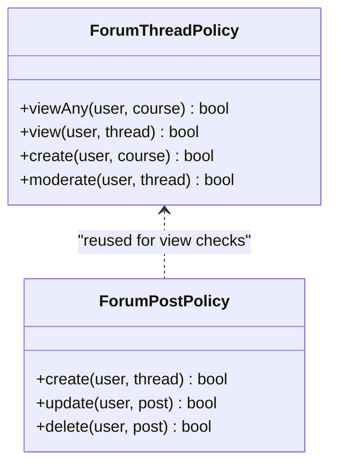

**Diagram sources**
- [ForumThreadPolicy.php:13-49](file://app/Policies/ForumThreadPolicy.php#L13-L49)
- [ForumPostPolicy.php:12-41](file://app/Policies/ForumPostPolicy.php#L12-L41)

**Section sources**
- [ForumThreadPolicy.php:13-49](file://app/Policies/ForumThreadPolicy.php#L13-L49)
- [ForumPostPolicy.php:12-41](file://app/Policies/ForumPostPolicy.php#L12-L41)

### Concrete Examples
- Create a forum: Not required explicitly; the service ensures a forum exists for a course on first use.
- Start a discussion: Call the thread creation endpoint with title, body, optional tags, and optional attachment; the service creates the thread, head post, and synchronizes tags.
- Post a reply: Send a reply to a thread; the service creates the post, updates last activity, and notifies the thread creator if needed.
- Manage tags: Include tag names in thread creation; the service finds or creates tags and attaches them to the thread.
- Handle permissions: Access is enforced by policies; only enrolled students, instructors, or admins can interact with forums, and moderation actions are restricted to instructors/admins.

[No sources needed since this section provides usage guidance without analyzing specific files]

## Dependency Analysis
- Controllers depend on the ForumService for business operations and on policies for authorization.
- ForumService depends on models and external services for notifications and media storage.
- Models define relationships and casts that align with migration-defined schema.
- Migrations introduce schema elements used throughout the system (e.g., solved, last_activity_at, tags, reads).

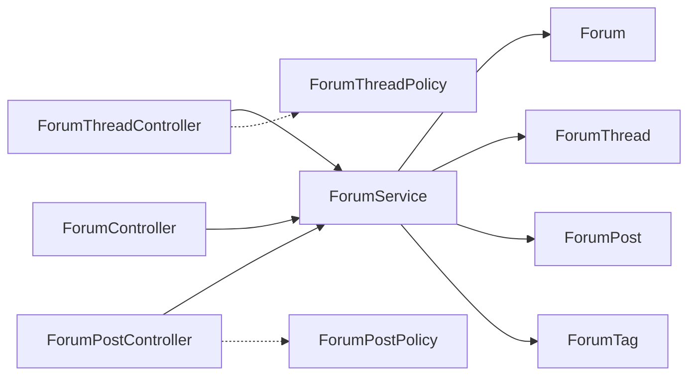

**Diagram sources**
- [ForumThreadController.php:1-115](file://app/Http/Controllers/Api/V1/ForumThreadController.php#L1-L115)
- [ForumPostController.php:1-70](file://app/Http/Controllers/Api/V1/ForumPostController.php#L1-L70)
- [ForumController.php:1-100](file://app/Http/Controllers/Api/V1/ForumController.php#L1-L100)
- [ForumService.php:1-223](file://app/Services/Communication/ForumService.php#L1-L223)
- [ForumThreadPolicy.php:1-51](file://app/Policies/ForumThreadPolicy.php#L1-L51)
- [ForumPostPolicy.php:1-43](file://app/Policies/ForumPostPolicy.php#L1-L43)

**Section sources**
- [ForumThreadController.php:1-115](file://app/Http/Controllers/Api/V1/ForumThreadController.php#L1-L115)
- [ForumPostController.php:1-70](file://app/Http/Controllers/Api/V1/ForumPostController.php#L1-L70)
- [ForumController.php:1-100](file://app/Http/Controllers/Api/V1/ForumController.php#L1-L100)
- [ForumService.php:1-223](file://app/Services/Communication/ForumService.php#L1-L223)
- [ForumThreadPolicy.php:1-51](file://app/Policies/ForumThreadPolicy.php#L1-L51)
- [ForumPostPolicy.php:1-43](file://app/Policies/ForumPostPolicy.php#L1-L43)

## Performance Considerations
- Full-text search on post bodies enables efficient content discovery across threads.
- Paginated lists reduce payload size and improve responsiveness for large discussions.
- Eager loading of related entities (creator, head post, latest post, tags) minimizes N+1 queries.
- Indexes on foreign keys and frequently filtered columns (e.g., last_activity_at) support fast queries.
- Per-user read tracking uses upserts to avoid duplicate rows and keep lookups efficient.

[No sources needed since this section provides general guidance]

## Troubleshooting Guide
- If threads do not appear in listings, verify enrollment status and policy checks for viewing.
- If unread counts are incorrect, ensure last_activity_at is updated on replies and that read records are upserted when viewing threads.
- If tags are duplicated, confirm that tag synchronization normalizes names and uses case-insensitive matching.
- If attachments fail to save or persist, check storage configuration and paths used by the media storage service.
- If moderation actions fail, validate that the actor has instructor or admin privileges.

**Section sources**
- [ForumThreadPolicy.php:13-49](file://app/Policies/ForumThreadPolicy.php#L13-L49)
- [ForumPostPolicy.php:12-41](file://app/Policies/ForumPostPolicy.php#L12-L41)
- [ForumService.php:122-153](file://app/Services/Communication/ForumService.php#L122-L153)
- [ForumService.php:207-221](file://app/Services/Communication/ForumService.php#L207-L221)

## Conclusion
The Forum System provides a robust, scalable foundation for threaded discussions within courses. It enforces clear permissions, supports rich features like tagging, attachments, solved status, and read tracking, and offers efficient querying and pagination. The separation of concerns between controllers, service, models, and policies makes the system maintainable and extensible.

[No sources needed since this section summarizes without analyzing specific files]