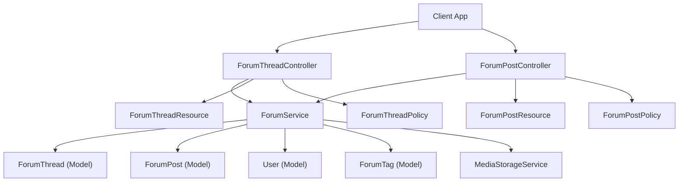
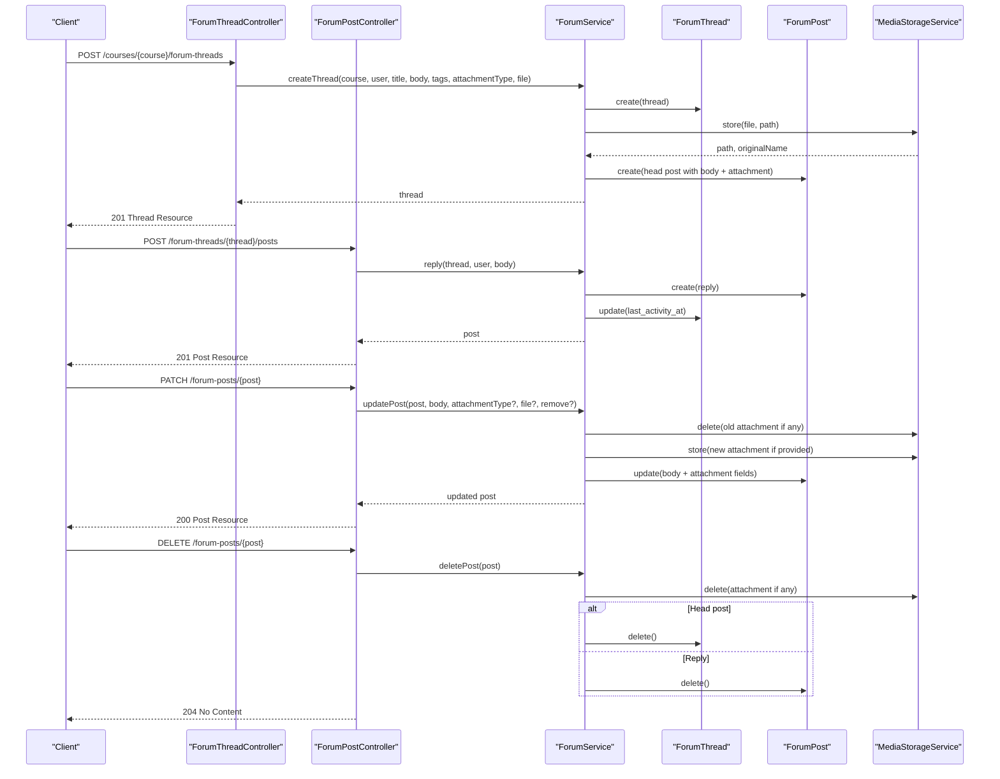
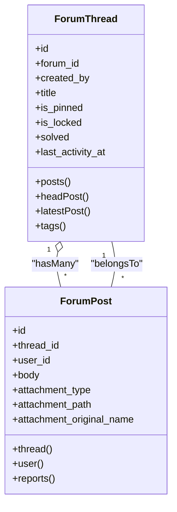
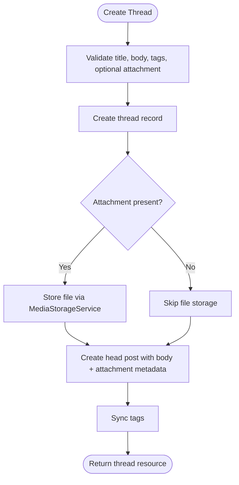
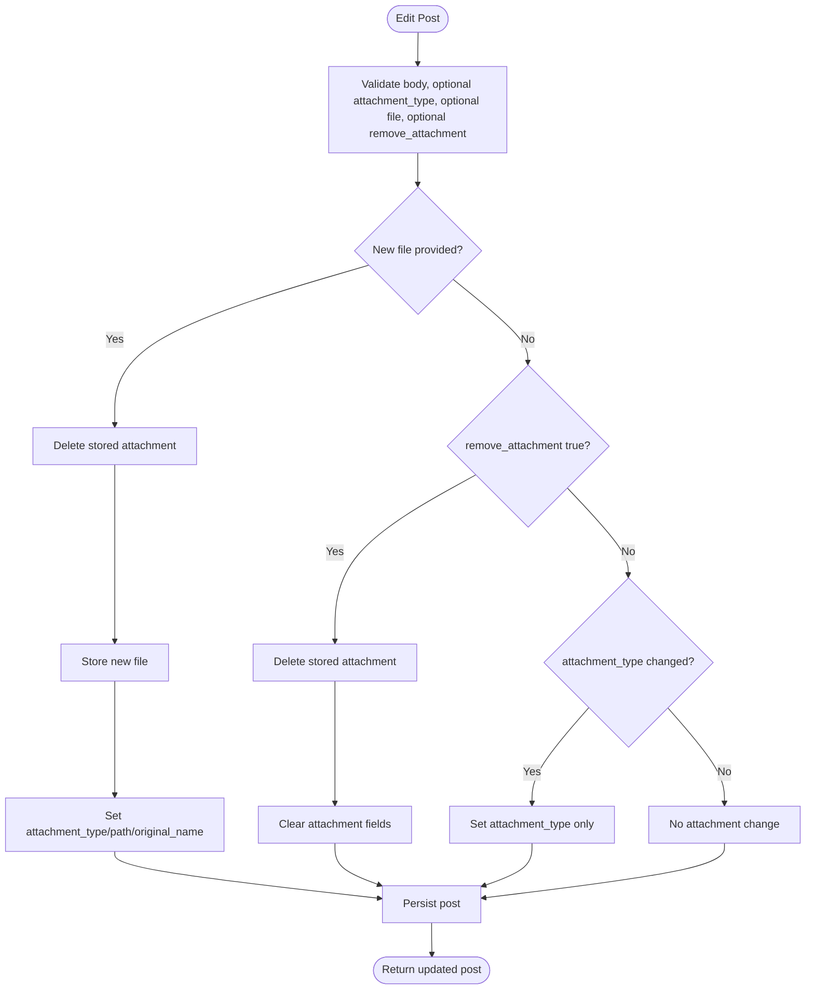
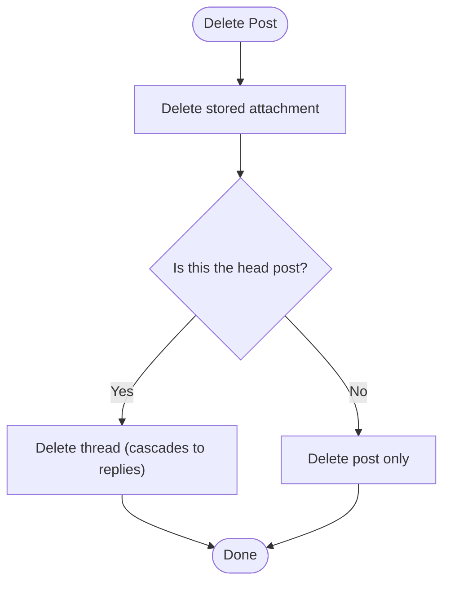
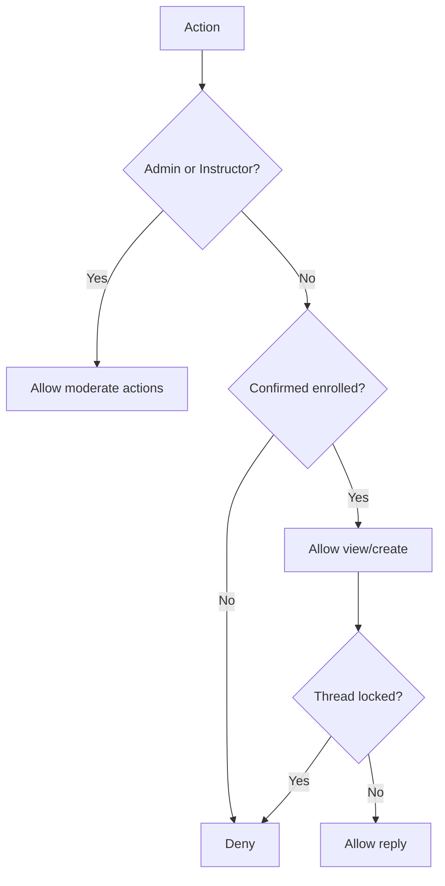
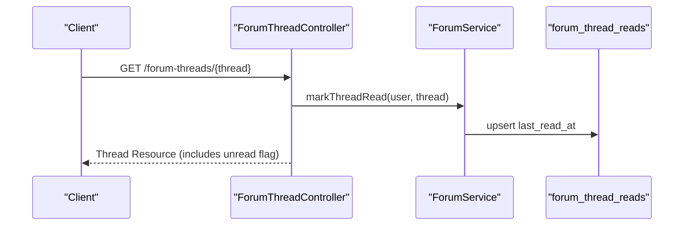
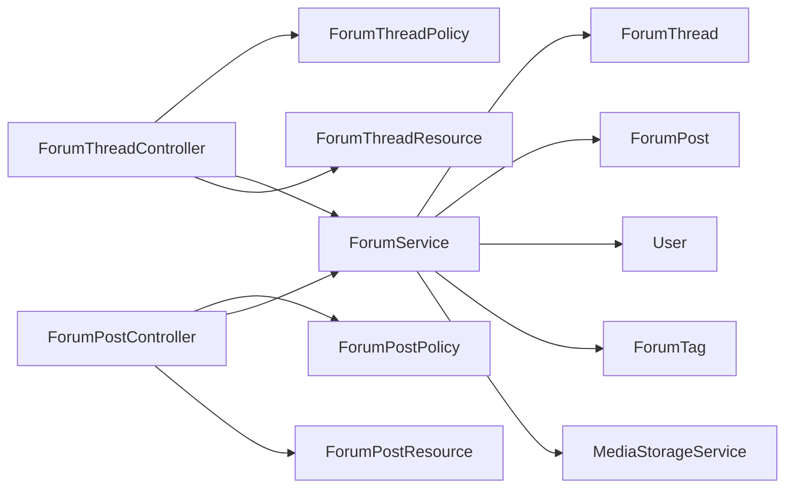

# Post System

<cite>
**Referenced Files in This Document**
- [ForumPost.php](file://app/Models/ForumPost.php)
- [ForumThread.php](file://app/Models/ForumThread.php)
- [ForumPostController.php](file://app/Http/Controllers/Api/V1/ForumPostController.php)
- [ForumThreadController.php](file://app/Http/Controllers/Api/V1/ForumThreadController.php)
- [ForumService.php](file://app/Services/Communication/ForumService.php)
- [ForumPostPolicy.php](file://app/Policies/ForumPostPolicy.php)
- [ForumThreadPolicy.php](file://app/Policies/ForumThreadPolicy.php)
- [StoreForumPostRequest.php](file://app/Http/Requests/Api/V1/StoreForumPostRequest.php)
- [UpdateForumPostRequest.php](file://app/Http/Requests/Api/V1/UpdateForumPostRequest.php)
- [ForumPostResource.php](file://app/Http/Resources/ForumPostResource.php)
- [ForumThreadResource.php](file://app/Http/Resources/ForumThreadResource.php)
- [ForumPostAttachmentType.php](file://app/Enums/ForumPostAttachmentType.php)
- [add_attachment_columns_to_forum_posts_table.php](file://database/migrations/2026_07_21_195856_add_attachment_columns_to_forum_posts_table.php)
</cite>

## Table of Contents
1. [Introduction](#introduction)
2. [Project Structure](#project-structure)
3. [Core Components](#core-components)
4. [Architecture Overview](#architecture-overview)
5. [Detailed Component Analysis](#detailed-component-analysis)
6. [Dependency Analysis](#dependency-analysis)
7. [Performance Considerations](#performance-considerations)
8. [Troubleshooting Guide](#troubleshooting-guide)
9. [Conclusion](#conclusion)

## Introduction
This document explains the Post System for course forums, focusing on how posts are created, edited, and deleted within threads; how attachments are handled; how ordering and threading work; and how permissions, moderation, and engagement signals are implemented. It also provides practical examples for common workflows such as creating a thread with an attachment, editing a post to change or remove its attachment, managing visibility via thread pin/lock/solved flags, and working with rich text content.

## Project Structure
The Post System is built around:
- Models that define data relationships (threads, posts, users, tags).
- Controllers that expose REST endpoints for listing, creating, updating, and deleting posts and threads.
- A service layer that encapsulates business logic (creating threads, replying, marking solved, handling attachments, syncing tags).
- Policies that enforce permissions for viewing, creating, editing, deleting, and moderating.
- Request validators that ensure safe inputs and authorize actions.
- Resources that shape API responses, including computed fields like edit indicators and unread status.
- Migrations that add attachment support to posts.

**Diagram sources**
- [ForumThreadController.php:23-113](file://app/Http/Controllers/Api/V1/ForumThreadController.php#L23-L113)
- [ForumPostController.php:22-68](file://app/Http/Controllers/Api/V1/ForumPostController.php#L22-L68)
- [ForumService.php:39-221](file://app/Services/Communication/ForumService.php#L39-L221)
- [ForumThread.php:39-92](file://app/Models/ForumThread.php#L39-L92)
- [ForumPost.php:19-54](file://app/Models/ForumPost.php#L19-L54)
- [ForumThreadResource.php:23-50](file://app/Http/Resources/ForumThreadResource.php#L23-L50)
- [ForumPostResource.php:16-34](file://app/Http/Resources/ForumPostResource.php#L16-L34)
- [ForumThreadPolicy.php:15-49](file://app/Policies/ForumThreadPolicy.php#L15-L49)
- [ForumPostPolicy.php:14-41](file://app/Policies/ForumPostPolicy.php#L14-L41)

**Section sources**
- [ForumThreadController.php:23-113](file://app/Http/Controllers/Api/V1/ForumThreadController.php#L23-L113)
- [ForumPostController.php:22-68](file://app/Http/Controllers/Api/V1/ForumPostController.php#L22-L68)
- [ForumService.php:39-221](file://app/Services/Communication/ForumService.php#L39-L221)
- [ForumThread.php:39-92](file://app/Models/ForumThread.php#L39-L92)
- [ForumPost.php:19-54](file://app/Models/ForumPost.php#L19-L54)
- [ForumThreadResource.php:23-50](file://app/Http/Resources/ForumThreadResource.php#L23-L50)
- [ForumPostResource.php:16-34](file://app/Http/Resources/ForumPostResource.php#L16-L34)
- [ForumThreadPolicy.php:15-49](file://app/Policies/ForumThreadPolicy.php#L15-L49)
- [ForumPostPolicy.php:14-41](file://app/Policies/ForumPostPolicy.php#L14-L41)

## Core Components
- ForumThread model: Represents a discussion with title, creator, pinned/locked/solved flags, last activity timestamp, and relations to forum, creator, posts, head post, latest post, and tags.
- ForumPost model: Represents a message within a thread, including optional attachment metadata and relations to thread, user, and reports.
- ForumService: Encapsulates domain operations such as creating threads (with optional attachment), replying (text-only), marking solved, marking read, syncing tags, updating posts (including attachment changes), and deleting posts (cascading to thread when deleting the head post).
- Controllers: Expose endpoints for listing threads, creating threads, showing a thread (marking read), updating thread moderation flags, listing replies, creating replies, updating posts (body and attachments), and deleting posts.
- Policies: Enforce who can view/create/edit/delete/moderate threads and posts based on enrollment, role, and ownership.
- Requests: Validate input for creating/updating posts and enforce authorization at request time.
- Resources: Shape API payloads, compute derived fields like edit indicator and unread status, and provide URLs for attachments.
- Migration: Adds attachment type, path, and original name columns to posts.

**Section sources**
- [ForumThread.php:15-92](file://app/Models/ForumThread.php#L15-L92)
- [ForumPost.php:14-54](file://app/Models/ForumPost.php#L14-L54)
- [ForumService.php:39-221](file://app/Services/Communication/ForumService.php#L39-L221)
- [ForumThreadController.php:23-113](file://app/Http/Controllers/Api/V1/ForumThreadController.php#L23-L113)
- [ForumPostController.php:22-68](file://app/Http/Controllers/Api/V1/ForumPostController.php#L22-L68)
- [ForumThreadPolicy.php:15-49](file://app/Policies/ForumThreadPolicy.php#L15-L49)
- [ForumPostPolicy.php:14-41](file://app/Policies/ForumPostPolicy.php#L14-L41)
- [StoreForumPostRequest.php:11-27](file://app/Http/Requests/Api/V1/StoreForumPostRequest.php#L11-L27)
- [UpdateForumPostRequest.php:11-39](file://app/Http/Requests/Api/V1/UpdateForumPostRequest.php#L11-L39)
- [ForumThreadResource.php:23-50](file://app/Http/Resources/ForumThreadResource.php#L23-L50)
- [ForumPostResource.php:16-34](file://app/Http/Resources/ForumPostResource.php#L16-L34)
- [add_attachment_columns_to_forum_posts_table.php:15-29](file://database/migrations/2026_07_21_195856_add_attachment_columns_to_forum_posts_table.php#L15-L29)

## Architecture Overview
The system follows a layered architecture:
- HTTP controllers handle routing, authorization checks, and request/response mapping.
- Service layer centralizes business rules, transactions, notifications, and storage interactions.
- Models define relationships and query helpers (e.g., head post, latest post).
- Policies enforce access control consistently across create/view/update/delete/moderate actions.
- Resources format outputs and compute derived fields for clients.

**Diagram sources**
- [ForumThreadController.php:71-113](file://app/Http/Controllers/Api/V1/ForumThreadController.php#L71-L113)
- [ForumPostController.php:41-68](file://app/Http/Controllers/Api/V1/ForumPostController.php#L41-L68)
- [ForumService.php:50-202](file://app/Services/Communication/ForumService.php#L50-L202)
- [ForumThread.php:55-84](file://app/Models/ForumThread.php#L55-L84)
- [ForumPost.php:19-54](file://app/Models/ForumPost.php#L19-L54)

## Detailed Component Analysis

### Threading and Ordering
- Each thread has a “head post” which is the oldest post in the thread; it represents the discussion’s initial content and attachment.
- Replies are all other posts in the thread and are ordered oldest-first for reading order.
- Threads track last activity and support sorting by latest activity, newest, or most replies.
- Tags can be attached to threads for filtering.

**Diagram sources**
- [ForumThread.php:55-92](file://app/Models/ForumThread.php#L55-L92)
- [ForumPost.php:19-54](file://app/Models/ForumPost.php#L19-L54)

**Section sources**
- [ForumThread.php:55-92](file://app/Models/ForumThread.php#L55-L92)
- [ForumThreadController.php:30-68](file://app/Http/Controllers/Api/V1/ForumThreadController.php#L30-L68)
- [ForumPostController.php:26-38](file://app/Http/Controllers/Api/V1/ForumPostController.php#L26-L38)

### Post Creation Workflows
- Creating a thread: The controller validates input, delegates to the service, which creates the thread, stores an optional attachment, and creates the head post with the provided body and attachment metadata. Tags are synced afterward.
- Replying to a thread: Only text is allowed for replies; the service creates the post and updates the thread’s last activity timestamp. If the replier is not the thread creator, a notification is dispatched.

**Diagram sources**
- [ForumThreadController.php:71-84](file://app/Http/Controllers/Api/V1/ForumThreadController.php#L71-L84)
- [ForumService.php:50-86](file://app/Services/Communication/ForumService.php#L50-L86)

**Section sources**
- [ForumThreadController.php:71-84](file://app/Http/Controllers/Api/V1/ForumThreadController.php#L71-L84)
- [ForumService.php:50-86](file://app/Services/Communication/ForumService.php#L50-L86)
- [StoreForumPostRequest.php:21-27](file://app/Http/Requests/Api/V1/StoreForumPostRequest.php#L21-L27)

### Editing Posts and Attachments
- Editing a post allows changing the body and optionally replacing or removing an attachment.
- Attachment types include image, video, audio, and article. Article mode toggles without requiring a file.
- Validation enforces file size limits and MIME types per attachment type.
- When updating, existing attachments are deleted before storing new ones; removal clears attachment fields.

**Diagram sources**
- [UpdateForumPostRequest.php:21-39](file://app/Http/Requests/Api/V1/UpdateForumPostRequest.php#L21-L39)
- [ForumService.php:155-185](file://app/Services/Communication/ForumService.php#L155-L185)

**Section sources**
- [UpdateForumPostRequest.php:21-39](file://app/Http/Requests/Api/V1/UpdateForumPostRequest.php#L21-L39)
- [ForumService.php:155-185](file://app/Services/Communication/ForumService.php#L155-L185)
- [ForumPostAttachmentType.php:7-13](file://app/Enums/ForumPostAttachmentType.php#L7-L13)

### Deletion and Cascading Behavior
- Deleting a post removes its attachment.
- If the deleted post is the thread’s head post, the entire thread is deleted (which cascades to all replies via foreign key constraints).
- Deleting any other post removes only that reply.

**Diagram sources**
- [ForumService.php:191-202](file://app/Services/Communication/ForumService.php#L191-L202)

**Section sources**
- [ForumService.php:191-202](file://app/Services/Communication/ForumService.php#L191-L202)

### Permissions and Moderation Controls
- Viewing and posting in a course forum requires confirmed enrollment, being a course instructor, or being an admin.
- Creating a post requires permission to view the thread and the thread must not be locked.
- Editing a post is author-only; staff cannot rewrite others’ posts but can delete problematic posts.
- Moderation (pin/lock/solved) is restricted to admins or course instructors.

**Diagram sources**
- [ForumThreadPolicy.php:15-49](file://app/Policies/ForumThreadPolicy.php#L15-L49)
- [ForumPostPolicy.php:14-41](file://app/Policies/ForumPostPolicy.php#L14-L41)

**Section sources**
- [ForumThreadPolicy.php:15-49](file://app/Policies/ForumThreadPolicy.php#L15-L49)
- [ForumPostPolicy.php:14-41](file://app/Policies/ForumPostPolicy.php#L14-L41)

### Engagement Signals and Read Tracking
- Threads track last activity timestamps to support “most recent activity” sorting.
- Reading a thread records the viewer’s last-read timestamp, enabling unread indicators in thread listings.
- Reply counts exclude the head post to reflect actual replies.

**Diagram sources**
- [ForumThreadController.php:86-93](file://app/Http/Controllers/Api/V1/ForumThreadController.php#L86-L93)
- [ForumService.php:122-128](file://app/Services/Communication/ForumService.php#L122-L128)
- [ForumThreadResource.php:42-49](file://app/Http/Resources/ForumThreadResource.php#L42-L49)

**Section sources**
- [ForumThreadController.php:86-93](file://app/Http/Controllers/Api/V1/ForumThreadController.php#L86-L93)
- [ForumService.php:122-128](file://app/Services/Communication/ForumService.php#L122-L128)
- [ForumThreadResource.php:42-49](file://app/Http/Resources/ForumThreadResource.php#L42-L49)

### Rich Text and Content Formatting
- Posts carry a body field intended for rich text content from the client-side editor.
- The server does not alter or sanitize the body beyond validation; formatting is preserved as provided by the client.
- The “article” attachment type can be used to toggle long-form text mode without attaching a file.

**Section sources**
- [ForumPost.php:19-29](file://app/Models/ForumPost.php#L19-L29)
- [ForumPostAttachmentType.php:7-13](file://app/Enums/ForumPostAttachmentType.php#L7-L13)
- [ForumService.php:177-180](file://app/Services/Communication/ForumService.php#L177-L180)

### Examples

- Create a thread with an image attachment:
  - Send a POST to the threads endpoint with title, body, optional tags, and an attachment file with attachment_type set to image. The service will store the file and create the head post with attachment metadata.
  - See: [ForumThreadController.php:71-84](file://app/Http/Controllers/Api/V1/ForumThreadController.php#L71-L84), [ForumService.php:50-86](file://app/Services/Communication/ForumService.php#L50-L86)

- Reply to a thread (text-only):
  - Send a POST to the posts endpoint under the target thread with the reply body. The service creates the reply and updates the thread’s last activity.
  - See: [ForumPostController.php:41-46](file://app/Http/Controllers/Api/V1/ForumPostController.php#L41-L46), [ForumService.php:92-107](file://app/Services/Communication/ForumService.php#L92-L107)

- Edit an existing post to replace an attachment:
  - Send a PATCH to the post endpoint with a new file and appropriate attachment_type. The service deletes the old attachment and stores the new one.
  - See: [ForumPostController.php:48-59](file://app/Http/Controllers/Api/V1/ForumPostController.php#L48-L59), [ForumService.php:155-185](file://app/Services/Communication/ForumService.php#L155-L185)

- Remove an attachment from a post:
  - Send a PATCH with remove_attachment set to true. The service deletes the stored file and clears attachment fields.
  - See: [UpdateForumPostRequest.php:21-39](file://app/Http/Requests/Api/V1/UpdateForumPostRequest.php#L21-L39), [ForumService.php:172-180](file://app/Services/Communication/ForumService.php#L172-L180)

- Manage visibility and moderation:
  - Pin/lock/unpin/unlock: Use the thread update endpoint to toggle is_pinned and is_locked.
  - Mark as solved: Use the thread update endpoint with solved flag; staff-only action triggers a notification when not self-solved.
  - See: [ForumThreadController.php:95-113](file://app/Http/Controllers/Api/V1/ForumThreadController.php#L95-L113), [ForumService.php:113-120](file://app/Services/Communication/ForumService.php#L113-L120)

- View thread and mark as read:
  - GET a thread to retrieve details and automatically mark it as read for the current user; the response includes unread status based on last activity vs last read.
  - See: [ForumThreadController.php:86-93](file://app/Http/Controllers/Api/V1/ForumThreadController.php#L86-L93), [ForumService.php:122-128](file://app/Services/Communication/ForumService.php#L122-L128), [ForumThreadResource.php:42-49](file://app/Http/Resources/ForumThreadResource.php#L42-L49)

**Section sources**
- [ForumThreadController.php:71-113](file://app/Http/Controllers/Api/V1/ForumThreadController.php#L71-L113)
- [ForumPostController.php:41-59](file://app/Http/Controllers/Api/V1/ForumPostController.php#L41-L59)
- [ForumService.php:92-120](file://app/Services/Communication/ForumService.php#L92-L120)
- [UpdateForumPostRequest.php:21-39](file://app/Http/Requests/Api/V1/UpdateForumPostRequest.php#L21-L39)
- [ForumThreadResource.php:42-49](file://app/Http/Resources/ForumThreadResource.php#L42-L49)

## Dependency Analysis
- Controllers depend on policies for authorization and services for business logic.
- Services depend on models for persistence and on MediaStorageService for file operations.
- Resources depend on models and services to compute derived fields (e.g., attachment URL, edit indicator, unread status).
- Policies depend on user roles, enrollment status, and course relationships.

**Diagram sources**
- [ForumThreadController.php:23-113](file://app/Http/Controllers/Api/V1/ForumThreadController.php#L23-L113)
- [ForumPostController.php:22-68](file://app/Http/Controllers/Api/V1/ForumPostController.php#L22-L68)
- [ForumService.php:39-221](file://app/Services/Communication/ForumService.php#L39-L221)
- [ForumThreadPolicy.php:15-49](file://app/Policies/ForumThreadPolicy.php#L15-L49)
- [ForumPostPolicy.php:14-41](file://app/Policies/ForumPostPolicy.php#L14-L41)
- [ForumThreadResource.php:23-50](file://app/Http/Resources/ForumThreadResource.php#L23-L50)
- [ForumPostResource.php:16-34](file://app/Http/Resources/ForumPostResource.php#L16-L34)

**Section sources**
- [ForumThreadController.php:23-113](file://app/Http/Controllers/Api/V1/ForumThreadController.php#L23-L113)
- [ForumPostController.php:22-68](file://app/Http/Controllers/Api/V1/ForumPostController.php#L22-L68)
- [ForumService.php:39-221](file://app/Services/Communication/ForumService.php#L39-L221)
- [ForumThreadPolicy.php:15-49](file://app/Policies/ForumThreadPolicy.php#L15-L49)
- [ForumPostPolicy.php:14-41](file://app/Policies/ForumPostPolicy.php#L14-L41)
- [ForumThreadResource.php:23-50](file://app/Http/Resources/ForumThreadResource.php#L23-L50)
- [ForumPostResource.php:16-34](file://app/Http/Resources/ForumPostResource.php#L16-L34)

## Performance Considerations
- Pagination: Replies are paginated to avoid loading full thread histories in list views.
- Eager loading: Thread listings eagerly load creator, head post user, latest post user, and tags to minimize N+1 queries.
- Full-text search: Thread search uses full-text indexing on post bodies for efficient matching across discussions and replies.
- Read tracking: Last-read updates use upsert semantics to avoid excessive writes while maintaining accurate unread states.
- Attachment handling: File storage is delegated to a dedicated service, keeping controllers and services focused on orchestration.

[No sources needed since this section provides general guidance]

## Troubleshooting Guide
- Authorization failures:
  - Ensure the user is confirmed-enrolled, an instructor, or admin to view/create in a course forum.
  - Verify the thread is not locked before attempting to create a reply.
  - Editing is restricted to the post author; deletion is allowed by authors, instructors, or admins.
  - See: [ForumThreadPolicy.php:15-49](file://app/Policies/ForumThreadPolicy.php#L15-L49), [ForumPostPolicy.php:14-41](file://app/Policies/ForumPostPolicy.php#L14-L41)

- Validation errors:
  - Body is required for both creating threads and posts.
  - Attachment validation enforces size limits and MIME types based on attachment_type.
  - See: [StoreForumPostRequest.php:21-27](file://app/Http/Requests/Api/V1/StoreForumPostRequest.php#L21-L27), [UpdateForumPostRequest.php:21-39](file://app/Http/Requests/Api/V1/UpdateForumPostRequest.php#L21-L39)

- Attachment issues:
  - Confirm the correct attachment_type is set; article mode does not require a file.
  - On update, ensure old attachments are deleted before storing new ones to avoid orphaned files.
  - See: [ForumService.php:155-185](file://app/Services/Communication/ForumService.php#L155-L185), [ForumService.php:207-221](file://app/Services/Communication/ForumService.php#L207-L221)

- Unread state inconsistencies:
  - Ensure the show endpoint is called to mark threads as read; unread flags rely on last activity vs last read timestamps.
  - See: [ForumThreadController.php:86-93](file://app/Http/Controllers/Api/V1/ForumThreadController.php#L86-L93), [ForumService.php:122-128](file://app/Services/Communication/ForumService.php#L122-L128), [ForumThreadResource.php:42-49](file://app/Http/Resources/ForumThreadResource.php#L42-L49)

**Section sources**
- [ForumThreadPolicy.php:15-49](file://app/Policies/ForumThreadPolicy.php#L15-L49)
- [ForumPostPolicy.php:14-41](file://app/Policies/ForumPostPolicy.php#L14-L41)
- [StoreForumPostRequest.php:21-27](file://app/Http/Requests/Api/V1/StoreForumPostRequest.php#L21-L27)
- [UpdateForumPostRequest.php:21-39](file://app/Http/Requests/Api/V1/UpdateForumPostRequest.php#L21-L39)
- [ForumService.php:155-221](file://app/Services/Communication/ForumService.php#L155-L221)
- [ForumThreadController.php:86-93](file://app/Http/Controllers/Api/V1/ForumThreadController.php#L86-L93)
- [ForumThreadResource.php:42-49](file://app/Http/Resources/ForumThreadResource.php#L42-L49)

## Conclusion
The Post System provides a robust, policy-driven foundation for threaded discussions within courses. It supports rich text bodies, flexible attachment handling, clear ordering and pagination, and reliable engagement signals like read tracking. Permissions and moderation controls ensure appropriate access and oversight, while the service layer centralizes complex workflows and integrates with storage and notifications. This design enables scalable and maintainable forum functionality aligned with educational collaboration needs.

[No sources needed since this section summarizes without analyzing specific files]