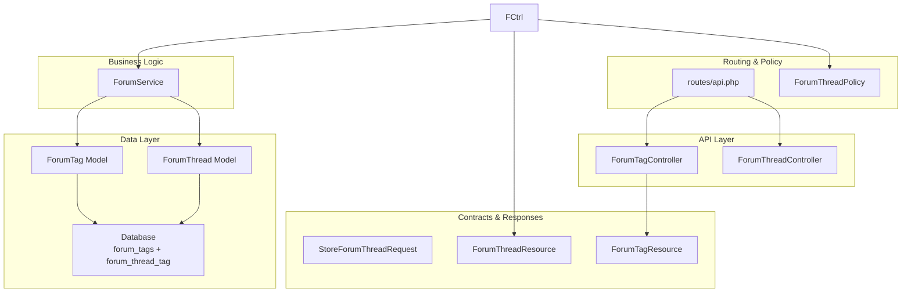
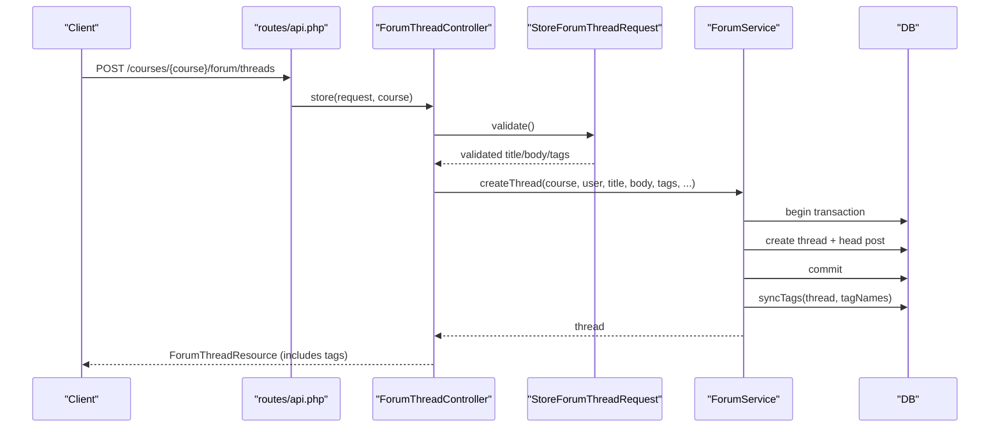
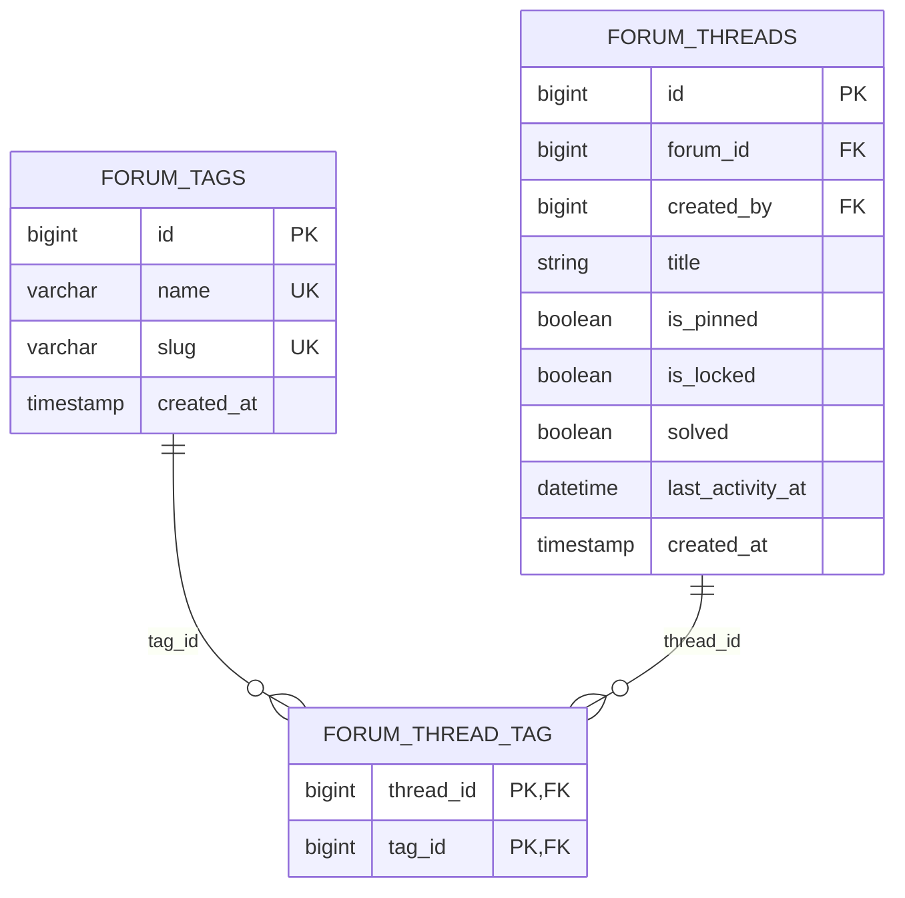
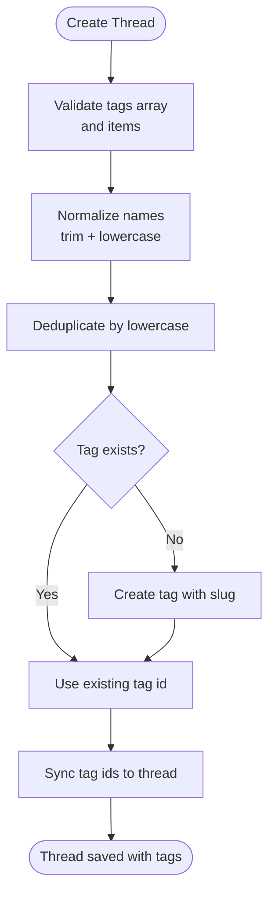
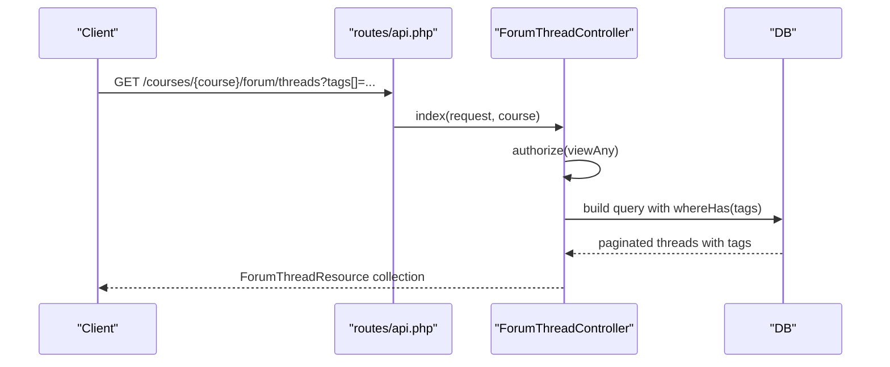
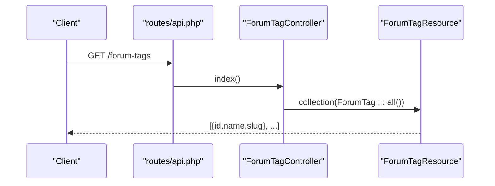
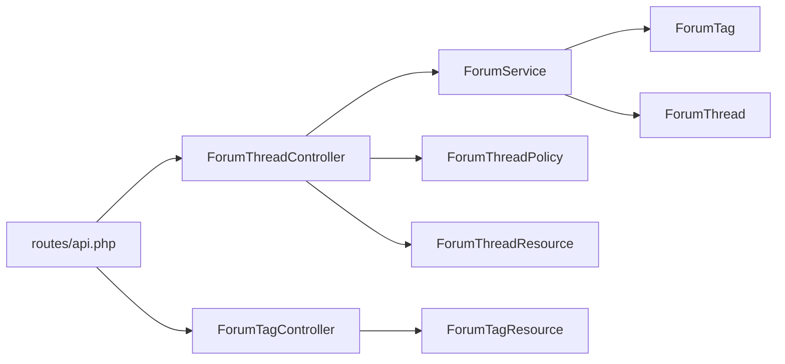

# Tagging System

<cite>
**Referenced Files in This Document**
- [ForumTag.php](file://app/Models/ForumTag.php)
- [ForumThread.php](file://app/Models/ForumThread.php)
- [ForumTagController.php](file://app/Http/Controllers/Api/V1/ForumTagController.php)
- [ForumThreadController.php](file://app/Http/Controllers/Api/V1/ForumThreadController.php)
- [ForumTagResource.php](file://app/Http/Resources/ForumTagResource.php)
- [ForumThreadResource.php](file://app/Http/Resources/ForumThreadResource.php)
- [ForumService.php](file://app/Services/Communication/ForumService.php)
- [StoreForumThreadRequest.php](file://app/Http/Requests/Api/V1/StoreForumThreadRequest.php)
- [2026_07_23_100001_create_forum_tags_table.php](file://database/migrations/2026_07_23_100001_create_forum_tags_table.php)
- [api.php](file://routes/api.php)
- [ForumThreadPolicy.php](file://app/Policies/ForumThreadPolicy.php)
- [ForumTest.php](file://tests/Feature/Communication/ForumTest.php)
</cite>

## Table of Contents
1. Introduction
2. Project Structure
3. Core Components
4. Architecture Overview
5. Detailed Component Analysis
6. Dependency Analysis
7. Performance Considerations
8. Troubleshooting Guide
9. Conclusion

## Introduction
This document explains the Tagging System for forum discussions. It covers how tags are created, assigned to threads, and used for filtering and search. It also documents the relationship between ForumTag and ForumThread, validation rules, permissions, auto-completion behavior, and analytics considerations for popular topics.

## Project Structure
The tagging feature spans models, services, controllers, resources, migrations, routes, policies, and tests:
- Models define the tag entity and its many-to-many relationship with threads.
- A service centralizes thread creation and tag synchronization (find-or-create by name).
- Controllers expose endpoints for listing tags and managing threads (including tag-based filtering).
- Resources shape API responses, including tags on threads.
- Migrations define the global tag vocabulary and the pivot table linking tags to threads.
- Routes register the tag list endpoint and thread endpoints that support tag filtering.
- Policies enforce who can view or create threads within a course context.
- Tests validate tag creation and filtering behavior.

**Diagram sources**
- [ForumTagController.php:19-22](file://app/Http/Controllers/Api/V1/ForumTagController.php#L19-L22)
- [ForumThreadController.php:30-84](file://app/Http/Controllers/Api/V1/ForumThreadController.php#L30-L84)
- [ForumService.php:50-86](file://app/Services/Communication/ForumService.php#L50-L86)
- [ForumTag.php:24-30](file://app/Models/ForumTag.php#L24-L30)
- [ForumThread.php:86-92](file://app/Models/ForumThread.php#L86-L92)
- [StoreForumThreadRequest.php:27-47](file://app/Http/Requests/Api/V1/StoreForumThreadRequest.php#L27-L47)
- [ForumThreadResource.php:23-51](file://app/Http/Resources/ForumThreadResource.php#L23-L51)
- [ForumTagResource.php:15-22](file://app/Http/Resources/ForumTagResource.php#L15-L22)
- [api.php:218-229](file://routes/api.php#L218-L229)
- [ForumThreadPolicy.php:19-49](file://app/Policies/ForumThreadPolicy.php#L19-L49)

**Section sources**
- [ForumTag.php:12-30](file://app/Models/ForumTag.php#L12-L30)
- [ForumThread.php:15-92](file://app/Models/ForumThread.php#L15-L92)
- [ForumTagController.php:17-22](file://app/Http/Controllers/Api/V1/ForumTagController.php#L17-L22)
- [ForumThreadController.php:19-84](file://app/Http/Controllers/Api/V1/ForumThreadController.php#L19-L84)
- [ForumService.php:50-153](file://app/Services/Communication/ForumService.php#L50-L153)
- [StoreForumThreadRequest.php:27-47](file://app/Http/Requests/Api/V1/StoreForumThreadRequest.php#L27-L47)
- [ForumTagResource.php:15-22](file://app/Http/Resources/ForumTagResource.php#L15-L22)
- [ForumThreadResource.php:23-51](file://app/Http/Resources/ForumThreadResource.php#L23-L51)
- [2026_07_23_100001_create_forum_tags_table.php:17-30](file://database/migrations/2026_07_23_100001_create_forum_tags_table.php#L17-L30)
- [api.php:218-229](file://routes/api.php#L218-L229)
- [ForumThreadPolicy.php:19-49](file://app/Policies/ForumThreadPolicy.php#L19-L49)

## Core Components
- ForumTag model: Represents a global tag with unique name and slug; relates to threads via a many-to-many association.
- ForumThread model: Represents a discussion; has a many-to-many relationship with tags.
- ForumService::syncTags(): Ensures tags exist (case-insensitive find-or-create), normalizes names, deduplicates, and syncs them to a thread.
- ForumThreadController::index(): Supports filtering threads by one or more tag IDs via query parameter tags[].
- StoreForumThreadRequest: Validates tags array and individual tag strings when creating a thread.
- ForumTagController::index(): Lists all tags for autocomplete in the composer UI.
- Resources: ForumThreadResource includes tags; ForumTagResource exposes id, name, slug.

**Section sources**
- [ForumTag.php:12-30](file://app/Models/ForumTag.php#L12-L30)
- [ForumThread.php:86-92](file://app/Models/ForumThread.php#L86-L92)
- [ForumService.php:130-153](file://app/Services/Communication/ForumService.php#L130-L153)
- [ForumThreadController.php:30-48](file://app/Http/Controllers/Api/V1/ForumThreadController.php#L30-L48)
- [StoreForumThreadRequest.php:27-47](file://app/Http/Requests/Api/V1/StoreForumThreadRequest.php#L27-L47)
- [ForumTagController.php:19-22](file://app/Http/Controllers/Api/V1/ForumTagController.php#L19-L22)
- [ForumThreadResource.php:23-51](file://app/Http/Resources/ForumThreadResource.php#L23-L51)
- [ForumTagResource.php:15-22](file://app/Http/Resources/ForumTagResource.php#L15-L22)

## Architecture Overview
The tagging system integrates into the forum workflow:
- Thread creation flows through a controller, request validation, and a service that persists the thread and synchronizes tags.
- Tag auto-completion is provided by a simple list endpoint returning all tags.
- Thread listing supports filtering by tag IDs.
- Permissions are enforced at the controller level using policies scoped to the course context.

**Diagram sources**
- [api.php:218-219](file://routes/api.php#L218-L219)
- [ForumThreadController.php:71-84](file://app/Http/Controllers/Api/V1/ForumThreadController.php#L71-L84)
- [StoreForumThreadRequest.php:27-47](file://app/Http/Requests/Api/V1/StoreForumThreadRequest.php#L27-L47)
- [ForumService.php:50-86](file://app/Services/Communication/ForumService.php#L50-L86)
- [ForumService.php:130-153](file://app/Services/Communication/ForumService.php#L130-L153)

## Detailed Component Analysis

### Data Model and Relationships
- ForumTag holds a globally unique name and slug.
- ForumThread has a many-to-many relation to ForumTag via a pivot table.
- The pivot enforces uniqueness per thread-tag pair and cascades deletes.

**Diagram sources**
- [2026_07_23_100001_create_forum_tags_table.php:17-30](file://database/migrations/2026_07_23_100001_create_forum_tags_table.php#L17-L30)
- [ForumTag.php:24-30](file://app/Models/ForumTag.php#L24-L30)
- [ForumThread.php:86-92](file://app/Models/ForumThread.php#L86-L92)

**Section sources**
- [2026_07_23_100001_create_forum_tags_table.php:17-30](file://database/migrations/2026_07_23_100001_create_forum_tags_table.php#L17-L30)
- [ForumTag.php:12-30](file://app/Models/ForumTag.php#L12-L30)
- [ForumThread.php:86-92](file://app/Models/ForumThread.php#L86-L92)

### Tag Creation and Assignment Workflow
- When creating a thread, clients pass an array of tag names.
- The service normalizes, deduplicates, and finds-or-creates tags case-insensitively, then syncs them to the thread.
- This enables “pick existing or type a new one” UX.

**Diagram sources**
- [StoreForumThreadRequest.php:27-47](file://app/Http/Requests/Api/V1/StoreForumThreadRequest.php#L27-L47)
- [ForumService.php:50-86](file://app/Services/Communication/ForumService.php#L50-L86)
- [ForumService.php:130-153](file://app/Services/Communication/ForumService.php#L130-L153)

**Section sources**
- [StoreForumThreadRequest.php:27-47](file://app/Http/Requests/Api/V1/StoreForumThreadRequest.php#L27-L47)
- [ForumService.php:50-86](file://app/Services/Communication/ForumService.php#L50-L86)
- [ForumService.php:130-153](file://app/Services/Communication/ForumService.php#L130-L153)

### Tag-Based Filtering and Search
- Thread listing supports filtering by multiple tag IDs via query parameter tags[].
- The query uses a whereHas condition to include threads carrying any of the specified tags.
- Additional filters include search text across titles and posts, and sorting options.

**Diagram sources**
- [api.php:218-219](file://routes/api.php#L218-L219)
- [ForumThreadController.php:30-68](file://app/Http/Controllers/Api/V1/ForumThreadController.php#L30-L68)
- [ForumThreadResource.php:23-51](file://app/Http/Resources/ForumThreadResource.php#L23-L51)

**Section sources**
- [ForumThreadController.php:30-68](file://app/Http/Controllers/Api/V1/ForumThreadController.php#L30-L68)
- [ForumThreadResource.php:23-51](file://app/Http/Resources/ForumThreadResource.php#L23-L51)

### Tag Auto-Completion
- The tag list endpoint returns all tags ordered by name for use in the composer’s autocomplete.
- No course scoping is applied because tags are global.

**Diagram sources**
- [api.php:229](file://routes/api.php#L229)
- [ForumTagController.php:19-22](file://app/Http/Controllers/Api/V1/ForumTagController.php#L19-L22)
- [ForumTagResource.php:15-22](file://app/Http/Resources/ForumTagResource.php#L15-L22)

**Section sources**
- [ForumTagController.php:19-22](file://app/Http/Controllers/Api/V1/ForumTagController.php#L19-L22)
- [ForumTagResource.php:15-22](file://app/Http/Resources/ForumTagResource.php#L15-L22)
- [api.php:229](file://routes/api.php#L229)

### Validation Rules for Tags
- Tags must be an optional array with up to 10 entries.
- Each tag string is limited to 30 characters.
- These constraints ensure safe input before processing by the service.

**Section sources**
- [StoreForumThreadRequest.php:27-47](file://app/Http/Requests/Api/V1/StoreForumThreadRequest.php#L27-L47)

### Permissions and Access Control
- Creating or viewing threads requires authorization against the course context.
- Moderation actions (pin/lock/solve) are restricted to instructors or admins.
- Tag listing is open to authenticated users since it contains no course-specific data.

**Section sources**
- [ForumThreadPolicy.php:19-49](file://app/Policies/ForumThreadPolicy.php#L19-L49)
- [ForumThreadController.php:30-33](file://app/Http/Controllers/Api/V1/ForumThreadController.php#L30-L33)
- [ForumTagController.php:12-16](file://app/Http/Controllers/Api/V1/ForumTagController.php#L12-L16)

### Tag Analytics for Popular Topics
- The current implementation does not track tag usage counts.
- To enable analytics, consider adding a counter on ForumTag and incrementing it when tags are synced to threads.
- Expose a separate endpoint to return top tags for dashboards or recommendations.

[No sources needed since this section provides general guidance]

## Dependency Analysis
Key dependencies and their roles:
- ForumThreadController depends on ForumService for thread creation and tag synchronization.
- ForumService depends on ForumTag and ForumThread models and database transactions.
- Requests enforce validation before business logic runs.
- Resources serialize models for API responses.
- Routes wire controllers to HTTP endpoints.
- Policies gate access based on user role and enrollment.

**Diagram sources**
- [api.php:218-229](file://routes/api.php#L218-L229)
- [ForumThreadController.php:19-84](file://app/Http/Controllers/Api/V1/ForumThreadController.php#L19-L84)
- [ForumTagController.php:17-22](file://app/Http/Controllers/Api/V1/ForumTagController.php#L17-L22)
- [ForumService.php:50-153](file://app/Services/Communication/ForumService.php#L50-L153)
- [ForumThreadPolicy.php:19-49](file://app/Policies/ForumThreadPolicy.php#L19-L49)
- [ForumThreadResource.php:23-51](file://app/Http/Resources/ForumThreadResource.php#L23-L51)
- [ForumTagResource.php:15-22](file://app/Http/Resources/ForumTagResource.php#L15-L22)

**Section sources**
- [api.php:218-229](file://routes/api.php#L218-L229)
- [ForumThreadController.php:19-84](file://app/Http/Controllers/Api/V1/ForumThreadController.php#L19-L84)
- [ForumTagController.php:17-22](file://app/Http/Controllers/Api/V1/ForumTagController.php#L17-L22)
- [ForumService.php:50-153](file://app/Services/Communication/ForumService.php#L50-L153)
- [ForumThreadPolicy.php:19-49](file://app/Policies/ForumThreadPolicy.php#L19-L49)
- [ForumThreadResource.php:23-51](file://app/Http/Resources/ForumThreadResource.php#L23-L51)
- [ForumTagResource.php:15-22](file://app/Http/Resources/ForumTagResource.php#L15-L22)

## Performance Considerations
- Tag lookup during sync is case-insensitive and uses a direct query; consider indexing the lowercased representation if tag volume grows significantly.
- Tag filtering uses whereHas with in-lists; ensure indexes exist on forum_tags.id and pivot columns for efficient lookups.
- Avoid loading excessive tags per thread; paginate or limit tag lists in UI if needed.
- For analytics, avoid scanning all threads; maintain counters or materialized views for popular tags.

[No sources needed since this section provides general guidance]

## Troubleshooting Guide
Common issues and resolutions:
- Duplicate tags: The service deduplicates by lowercase name and creates only once; verify input normalization and unique constraints.
- Tag not appearing in filter results: Ensure the thread was saved with tags and that the correct tag IDs are passed in tags[] query parameter.
- Validation errors on thread creation: Confirm tags array size and string length limits; check attachment_type rules if present.
- Permission denied: Verify user enrollment status or instructor/admin role for the course context.

**Section sources**
- [ForumService.php:130-153](file://app/Services/Communication/ForumService.php#L130-L153)
- [ForumThreadController.php:30-48](file://app/Http/Controllers/Api/V1/ForumThreadController.php#L30-L48)
- [StoreForumThreadRequest.php:27-47](file://app/Http/Requests/Api/V1/StoreForumThreadRequest.php#L27-L47)
- [ForumThreadPolicy.php:19-49](file://app/Policies/ForumThreadPolicy.php#L19-L49)

## Conclusion
The tagging system provides a global, reusable vocabulary for forum discussions. Tags are created on demand, normalized, and associated with threads. Clients can list tags for autocomplete and filter threads by tag IDs. Permissions are enforced at the course level, while tag listing remains globally accessible for authenticated users. Future enhancements can add tag analytics and popularity metrics to surface trending topics.