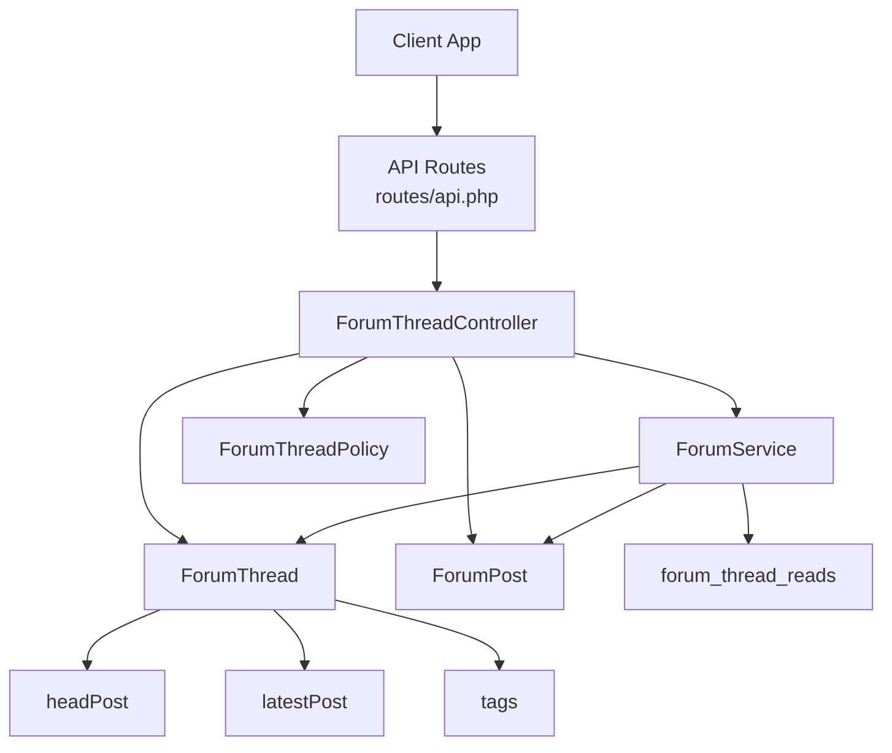
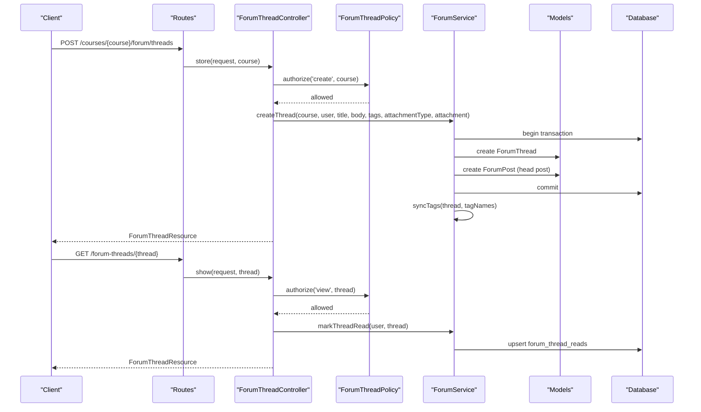
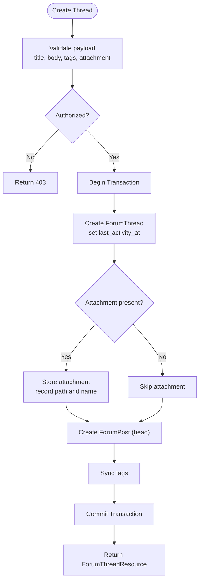
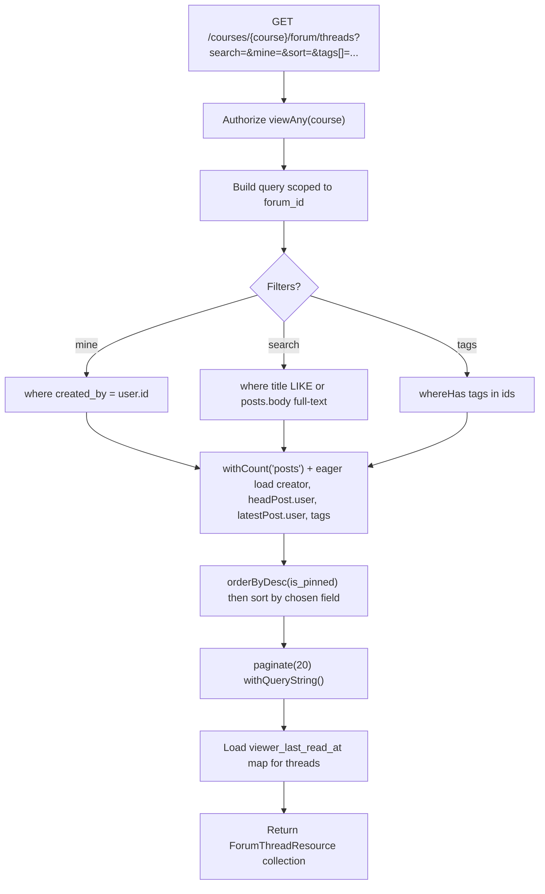
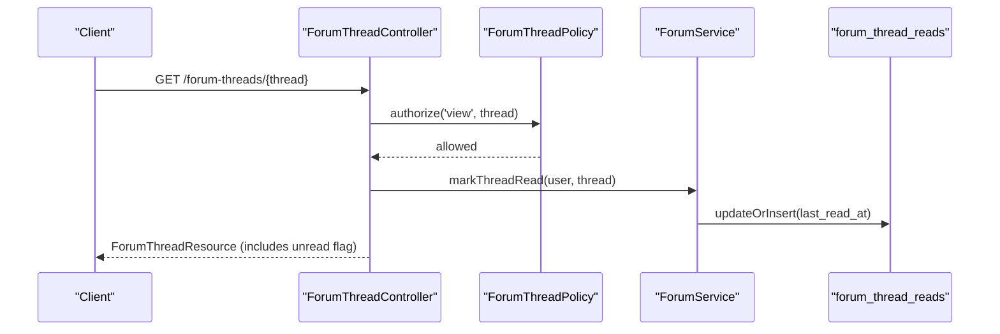
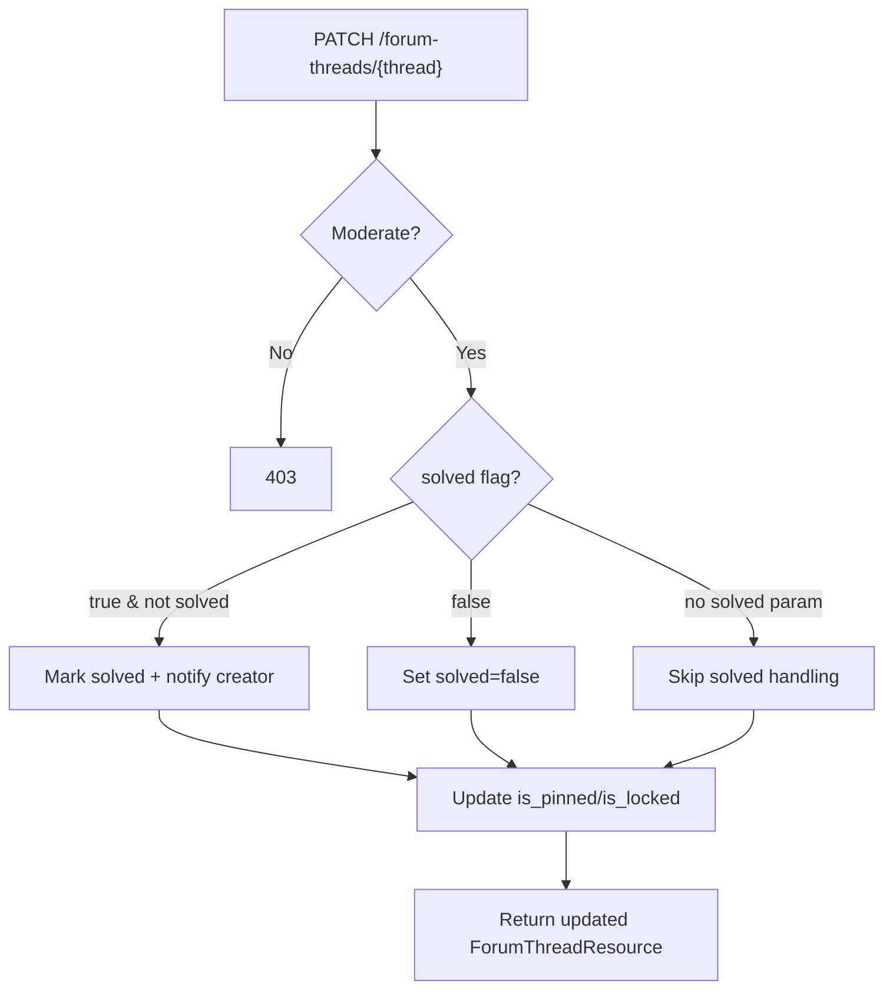
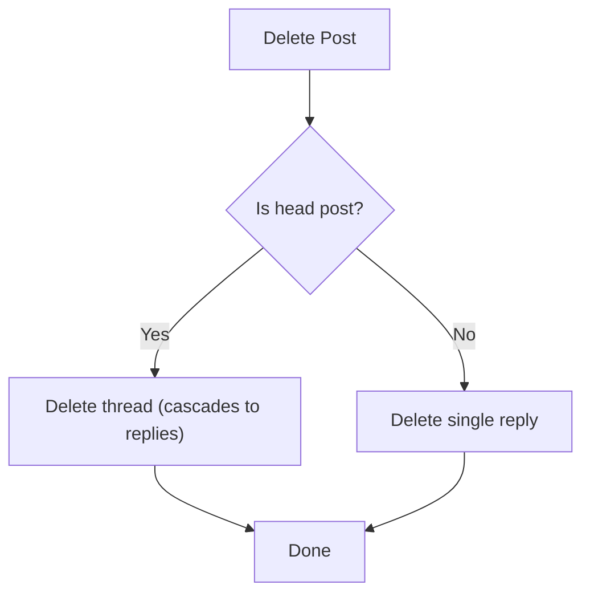
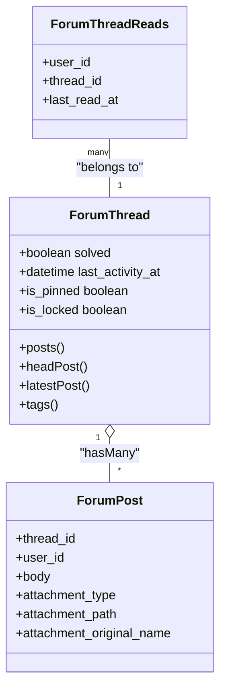
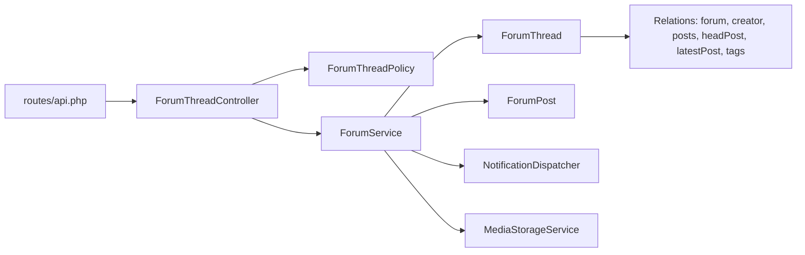

# Thread Management

<cite>
**Referenced Files in This Document**
- [ForumService.php](file://app/Services/Communication/ForumService.php)
- [ForumThreadController.php](file://app/Http/Controllers/Api/V1/ForumThreadController.php)
- [ForumThreadPolicy.php](file://app/Policies/ForumThreadPolicy.php)
- [ForumThread.php](file://app/Models/ForumThread.php)
- [ForumPost.php](file://app/Models/ForumPost.php)
- [StoreForumThreadRequest.php](file://app/Http/Requests/Api/V1/StoreForumThreadRequest.php)
- [UpdateForumThreadRequest.php](file://app/Http/Requests/Api/V1/UpdateForumThreadRequest.php)
- [ForumThreadResource.php](file://app/Http/Resources/ForumThreadResource.php)
- [api.php](file://routes/api.php)
- [2026_07_23_100000_add_solved_and_last_activity_to_forum_threads_table.php](file://database/migrations/2026_07_23_100000_add_solved_and_last_activity_to_forum_threads_table.php)
- [2026_07_23_100002_create_forum_thread_reads_table.php](file://database/migrations/2026_07_23_100002_create_forum_thread_reads_table.php)
</cite>

## Table of Contents
1. [Introduction](#introduction)
2. [Project Structure](#project-structure)
3. [Core Components](#core-components)
4. [Architecture Overview](#architecture-overview)
5. [Detailed Component Analysis](#detailed-component-analysis)
6. [Dependency Analysis](#dependency-analysis)
7. [Performance Considerations](#performance-considerations)
8. [Troubleshooting Guide](#troubleshooting-guide)
9. [Conclusion](#conclusion)

## Introduction
This document explains the Thread Management functionality implemented for course-based forums. It covers how threads are created, edited, and deleted; how lifecycle states such as solved status and last activity timestamps are managed; how read tracking works; permissions and moderation capabilities; user interactions like replies and attachments; and search, filtering, and pagination features exposed via the API.

## Project Structure
The thread management feature spans controllers, services, models, policies, requests, resources, routes, and database migrations:
- Controllers expose REST endpoints under authenticated routes.
- Services encapsulate business logic (thread creation, marking solved, read tracking).
- Models define data structures and relationships.
- Policies enforce access control based on enrollment and roles.
- Requests validate input payloads.
- Resources shape JSON responses.
- Routes register endpoints.
- Migrations add schema fields and tables for solved state, last activity, and per-user read tracking.

**Diagram sources**
- [api.php:218-221](file://routes/api.php#L218-L221)
- [ForumThreadController.php:19-114](file://app/Http/Controllers/Api/V1/ForumThreadController.php#L19-L114)
- [ForumService.php:32-223](file://app/Services/Communication/ForumService.php#L32-L223)
- [ForumThreadPolicy.php:13-51](file://app/Policies/ForumThreadPolicy.php#L13-L51)
- [ForumThread.php:15-94](file://app/Models/ForumThread.php#L15-L94)
- [ForumPost.php:14-56](file://app/Models/ForumPost.php#L14-L56)
- [2026_07_23_100002_create_forum_thread_reads_table.php:15-32](file://database/migrations/2026_07_23_100002_create_forum_thread_reads_table.php#L15-L32)

**Section sources**
- [api.php:218-229](file://routes/api.php#L218-L229)
- [ForumThreadController.php:19-114](file://app/Http/Controllers/Api/V1/ForumThreadController.php#L19-L114)
- [ForumService.php:32-223](file://app/Services/Communication/ForumService.php#L32-L223)
- [ForumThreadPolicy.php:13-51](file://app/Policies/ForumThreadPolicy.php#L13-L51)
- [ForumThread.php:15-94](file://app/Models/ForumThread.php#L15-L94)
- [ForumPost.php:14-56](file://app/Models/ForumPost.php#L14-L56)
- [2026_07_23_100000_add_solved_and_last_activity_to_forum_threads_table.php:10-39](file://database/migrations/2026_07_23_100000_add_solved_and_last_activity_to_forum_threads_table.php#L10-L39)
- [2026_07_23_100002_create_forum_thread_reads_table.php:15-32](file://database/migrations/2026_07_23_100002_create_forum_thread_reads_table.php#L15-L32)

## Core Components
- ForumThreadController: Exposes endpoints to list, create, show, and update threads; handles search, filters, sorting, and pagination; marks threads read on show; enforces authorization via policies.
- ForumService: Implements core business operations including creating threads with optional attachments, replying to threads, marking threads solved, updating posts, deleting posts (with cascade behavior), syncing tags, and recording read state.
- ForumThread model: Defines fillable attributes (including solved and last_activity_at), casts, and relationships (forum, creator, posts, headPost, latestPost, tags).
- ForumPost model: Represents posts within a thread, including attachment metadata and relations to thread and user.
- ForumThreadPolicy: Enforces who can view/create threads (enrolled students, instructors, admins) and who can moderate (instructors/admins only).
- Requests: Validate inputs for creating and updating threads, including attachment constraints.
- Resource: Formats thread responses, including computed reply_count and unread flag based on read tracking.
- Routes: Register authenticated endpoints for thread CRUD and post operations.
- Migrations: Add solved and last_activity_at columns and index; create forum_thread_reads table for per-user read tracking.

**Section sources**
- [ForumThreadController.php:19-114](file://app/Http/Controllers/Api/V1/ForumThreadController.php#L19-L114)
- [ForumService.php:32-223](file://app/Services/Communication/ForumService.php#L32-L223)
- [ForumThread.php:15-94](file://app/Models/ForumThread.php#L15-L94)
- [ForumPost.php:14-56](file://app/Models/ForumPost.php#L14-L56)
- [ForumThreadPolicy.php:13-51](file://app/Policies/ForumThreadPolicy.php#L13-L51)
- [StoreForumThreadRequest.php:12-49](file://app/Http/Requests/Api/V1/StoreForumThreadRequest.php#L12-L49)
- [UpdateForumThreadRequest.php:10-29](file://app/Http/Requests/Api/V1/UpdateForumThreadRequest.php#L10-L29)
- [ForumThreadResource.php:18-53](file://app/Http/Resources/ForumThreadResource.php#L18-L53)
- [api.php:218-229](file://routes/api.php#L218-L229)
- [2026_07_23_100000_add_solved_and_last_activity_to_forum_threads_table.php:10-39](file://database/migrations/2026_07_23_100000_add_solved_and_last_activity_to_forum_threads_table.php#L10-L39)
- [2026_07_23_100002_create_forum_thread_reads_table.php:15-32](file://database/migrations/2026_07_23_100002_create_forum_thread_reads_table.php#L15-L32)

## Architecture Overview
The thread management flow is request-driven through authenticated API routes, validated by request classes, authorized by policies, and executed via service methods that interact with Eloquent models and storage/notification services. Read tracking and solved status are persisted to dedicated columns and tables.

**Diagram sources**
- [api.php:218-221](file://routes/api.php#L218-L221)
- [ForumThreadController.php:71-93](file://app/Http/Controllers/Api/V1/ForumThreadController.php#L71-L93)
- [ForumThreadPolicy.php:19-39](file://app/Policies/ForumThreadPolicy.php#L19-L39)
- [ForumService.php:50-86](file://app/Services/Communication/ForumService.php#L50-L86)
- [ForumService.php:122-128](file://app/Services/Communication/ForumService.php#L122-L128)
- [2026_07_23_100002_create_forum_thread_reads_table.php:15-32](file://database/migrations/2026_07_23_100002_create_forum_thread_reads_table.php#L15-L32)

## Detailed Component Analysis

### Thread Creation
- Endpoint: POST /courses/{course}/forum/threads
- Validation: Title required, body required, optional tags array, optional attachment_type enum, conditional file validation with size and MIME checks.
- Authorization: Requires ability to create threads in the course (enrolled confirmed users, instructors, or admins).
- Business Logic: Creates a forum if needed, creates a thread with last_activity_at set, stores optional attachment, creates the head post, syncs tags, and returns a resource with related data.

**Diagram sources**
- [StoreForumThreadRequest.php:27-46](file://app/Http/Requests/Api/V1/StoreForumThreadRequest.php#L27-L46)
- [ForumThreadController.php:71-84](file://app/Http/Controllers/Api/V1/ForumThreadController.php#L71-L84)
- [ForumService.php:50-86](file://app/Services/Communication/ForumService.php#L50-L86)

**Section sources**
- [StoreForumThreadRequest.php:12-49](file://app/Http/Requests/Api/V1/StoreForumThreadRequest.php#L12-L49)
- [ForumThreadController.php:71-84](file://app/Http/Controllers/Api/V1/ForumThreadController.php#L71-L84)
- [ForumService.php:50-86](file://app/Services/Communication/ForumService.php#L50-L86)

### Thread Listing, Search, Filtering, Sorting, Pagination
- Endpoint: GET /courses/{course}/forum/threads
- Query parameters:
  - search: matches thread title or any post body using full-text search on forum_posts.body.
  - mine: scopes to threads created by the current user.
  - sort: latest_activity (default), newest, most_replies; pinned threads always sort first.
  - tags[]: filter by one or more tag IDs (any match).
- Pagination: Returns paginated results (per_page default 20) with query string preserved.
- Read tracking: Adds viewer_last_read_at per thread for the current user to compute unread flag in the response.

**Diagram sources**
- [ForumThreadController.php:30-69](file://app/Http/Controllers/Api/V1/ForumThreadController.php#L30-L69)
- [ForumThreadResource.php:23-50](file://app/Http/Resources/ForumThreadResource.php#L23-L50)

**Section sources**
- [ForumThreadController.php:30-69](file://app/Http/Controllers/Api/V1/ForumThreadController.php#L30-L69)
- [ForumThreadResource.php:23-50](file://app/Http/Resources/ForumThreadResource.php#L23-L50)

### Thread Show and Read Tracking
- Endpoint: GET /forum-threads/{thread}
- Behavior: Authorizes viewing, records the current user’s read timestamp for the thread, and returns the thread resource with related data.
- Read tracking mechanism: Upserts forum_thread_reads with last_read_at; unread flag is derived by comparing last_activity_at with viewer_last_read_at.

**Diagram sources**
- [ForumThreadController.php:86-93](file://app/Http/Controllers/Api/V1/ForumThreadController.php#L86-L93)
- [ForumService.php:122-128](file://app/Services/Communication/ForumService.php#L122-L128)
- [ForumThreadResource.php:42-49](file://app/Http/Resources/ForumThreadResource.php#L42-L49)
- [2026_07_23_100002_create_forum_thread_reads_table.php:15-32](file://database/migrations/2026_07_23_100002_create_forum_thread_reads_table.php#L15-L32)

**Section sources**
- [ForumThreadController.php:86-93](file://app/Http/Controllers/Api/V1/ForumThreadController.php#L86-L93)
- [ForumService.php:122-128](file://app/Services/Communication/ForumService.php#L122-L128)
- [ForumThreadResource.php:42-49](file://app/Http/Resources/ForumThreadResource.php#L42-L49)
- [2026_07_23_100002_create_forum_thread_reads_table.php:15-32](file://database/migrations/2026_07_23_100002_create_forum_thread_reads_table.php#L15-L32)

### Thread Update and Moderation
- Endpoint: PATCH /forum-threads/{thread}
- Capabilities: Pin/unpin, lock/unlock, mark solved/unmark solved.
- Authorization: Only moderators (admins or course instructors) can update threads.
- Solved handling: Marking solved triggers a notification to the thread creator unless the actor is the creator; unmarking solved updates directly.

**Diagram sources**
- [ForumThreadController.php:100-113](file://app/Http/Controllers/Api/V1/ForumThreadController.php#L100-L113)
- [ForumThreadPolicy.php:44-49](file://app/Policies/ForumThreadPolicy.php#L44-L49)
- [ForumService.php:113-120](file://app/Services/Communication/ForumService.php#L113-L120)

**Section sources**
- [ForumThreadController.php:100-113](file://app/Http/Controllers/Api/V1/ForumThreadController.php#L100-L113)
- [ForumThreadPolicy.php:44-49](file://app/Policies/ForumThreadPolicy.php#L44-L49)
- [ForumService.php:113-120](file://app/Services/Communication/ForumService.php#L113-L120)

### Thread Deletion
- Deletion occurs when removing a thread’s head post; this cascades to delete the entire thread and all its replies due to foreign key constraints.
- Deleting a non-head post removes only that reply.

**Diagram sources**
- [ForumService.php:191-202](file://app/Services/Communication/ForumService.php#L191-L202)

**Section sources**
- [ForumService.php:191-202](file://app/Services/Communication/ForumService.php#L191-L202)

### Lifecycle Management and Status Tracking
- Solved status: Boolean flag on threads; staff-only marking via service method; notifications sent when resolved by someone other than the creator.
- Last activity timestamp: Set on thread creation and updated on each reply; used for sorting and unread determination.
- Read tracking: Per-user last_read_at stored; unread flag computed by comparing last_activity_at with viewer_last_read_at.

**Diagram sources**
- [ForumThread.php:22-37](file://app/Models/ForumThread.php#L22-L37)
- [ForumThread.php:58-92](file://app/Models/ForumThread.php#L58-L92)
- [ForumPost.php:19-30](file://app/Models/ForumPost.php#L19-L30)
- [2026_07_23_100002_create_forum_thread_reads_table.php:19-24](file://database/migrations/2026_07_23_100002_create_forum_thread_reads_table.php#L19-L24)

**Section sources**
- [ForumThread.php:22-37](file://app/Models/ForumThread.php#L22-L37)
- [ForumThread.php:58-92](file://app/Models/ForumThread.php#L58-L92)
- [ForumPost.php:19-30](file://app/Models/ForumPost.php#L19-L30)
- [2026_07_23_100000_add_solved_and_last_activity_to_forum_threads_table.php:17-29](file://database/migrations/2026_07_23_100000_add_solved_and_last_activity_to_forum_threads_table.php#L17-L29)
- [2026_07_23_100002_create_forum_thread_reads_table.php:19-24](file://database/migrations/2026_07_23_100002_create_forum_thread_reads_table.php#L19-L24)

### Permissions and Moderation
- View/Create: Confirmed-enrolled students, course instructors, or admins can view and create threads in a course’s forum.
- Moderate: Only admins or course instructors can pin, lock, or mark threads solved.
- Enforcement: Handled via policy checks before controller actions execute.

**Section sources**
- [ForumThreadPolicy.php:19-49](file://app/Policies/ForumThreadPolicy.php#L19-L49)
- [ForumThreadController.php:30-33](file://app/Http/Controllers/Api/V1/ForumThreadController.php#L30-L33)
- [ForumThreadController.php:86-89](file://app/Http/Controllers/Api/V1/ForumThreadController.php#L86-L89)
- [UpdateForumThreadRequest.php:12-18](file://app/Http/Requests/Api/V1/UpdateForumThreadRequest.php#L12-L18)

### User Interactions
- Replies: Text-only replies update last_activity_at and may trigger notifications to the thread creator.
- Attachments: Head posts can include image/video/audio/article attachments; replies do not support attachments per design.
- Tagging: Threads can be tagged; tags are created or matched case-insensitively and synced to the thread.

**Section sources**
- [ForumService.php:92-107](file://app/Services/Communication/ForumService.php#L92-L107)
- [ForumService.php:136-153](file://app/Services/Communication/ForumService.php#L136-L153)
- [StoreForumThreadRequest.php:27-46](file://app/Http/Requests/Api/V1/StoreForumThreadRequest.php#L27-L46)

### Concrete Examples
- Starting a new discussion thread:
  - Use POST /courses/{course}/forum/threads with title, body, optional tags, and optional attachment_type and attachment.
  - The system creates the thread, head post, sets last_activity_at, stores attachments if provided, syncs tags, and returns the thread resource.
- Updating thread metadata:
  - Use PATCH /forum-threads/{thread} with is_pinned, is_locked, and/or solved flags.
  - Moderators can pin/lock; solving triggers notifications when done by non-creators.
- Managing visibility:
  - Pinning elevates threads to the top of lists; locking prevents further replies (policy enforced at write points for posts).
- Handling events:
  - Notifications are dispatched when a reply is posted (to the creator) and when a thread is marked solved (to the creator).

[No sources needed since this section summarizes usage without analyzing specific files]

## Dependency Analysis
- Controller depends on Service for business logic and on Policy for authorization.
- Service depends on Models (ForumThread, ForumPost) and external services (NotificationDispatcher, MediaStorageService).
- Models define relationships to Forum, User, ForumTag, and posts.
- Routes connect HTTP endpoints to controller actions.
- Migrations provide schema for solved, last_activity_at, and forum_thread_reads.

**Diagram sources**
- [api.php:218-229](file://routes/api.php#L218-L229)
- [ForumThreadController.php:19-114](file://app/Http/Controllers/Api/V1/ForumThreadController.php#L19-L114)
- [ForumService.php:32-223](file://app/Services/Communication/ForumService.php#L32-L223)
- [ForumThread.php:15-94](file://app/Models/ForumThread.php#L15-L94)

**Section sources**
- [api.php:218-229](file://routes/api.php#L218-L229)
- [ForumThreadController.php:19-114](file://app/Http/Controllers/Api/V1/ForumThreadController.php#L19-L114)
- [ForumService.php:32-223](file://app/Services/Communication/ForumService.php#L32-L223)
- [ForumThread.php:15-94](file://app/Models/ForumThread.php#L15-L94)

## Performance Considerations
- Full-text search on forum_posts.body improves search performance for thread content.
- Index on last_activity_at supports efficient sorting by latest activity.
- Eager loading of creator, headPost.user, latestPost.user, and tags reduces N+1 queries during listing.
- Pagination limits result sets to 20 items per page to manage payload size and rendering performance.
- Read mapping uses a single query to fetch viewer_last_read_at for the current page’s threads.

[No sources needed since this section provides general guidance]

## Troubleshooting Guide
- Unauthorized access: Ensure the user is enrolled (confirmed), an instructor, or admin for the course; verify policy checks pass.
- Missing attachments: Confirm attachment_type is valid and file meets size/MIME constraints; article mode does not require a file.
- Unread indicators not updating: Verify show endpoint is called to record last_read_at; ensure last_activity_at is set and newer than viewer_last_read_at.
- Solved notifications not received: Check that marking solved is performed by a moderator and that the actor is not the thread creator; confirm notification dispatching is wired.

**Section sources**
- [ForumThreadPolicy.php:19-49](file://app/Policies/ForumThreadPolicy.php#L19-L49)
- [StoreForumThreadRequest.php:27-46](file://app/Http/Requests/Api/V1/StoreForumThreadRequest.php#L27-L46)
- [ForumThreadController.php:86-93](file://app/Http/Controllers/Api/V1/ForumThreadController.php#L86-L93)
- [ForumService.php:113-120](file://app/Services/Communication/ForumService.php#L113-L120)

## Conclusion
Thread Management provides a robust, permissioned, and searchable forum experience within courses. Threads support lifecycle states (solved, pinned, locked), activity tracking, and per-user read state. The API exposes clear endpoints for creating, listing, showing, and updating threads, with comprehensive search, filtering, and pagination. Moderation capabilities allow instructors and admins to manage discussions effectively while maintaining a smooth user experience.